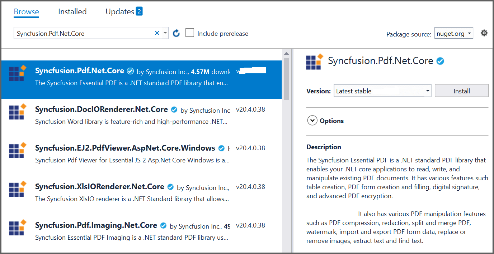
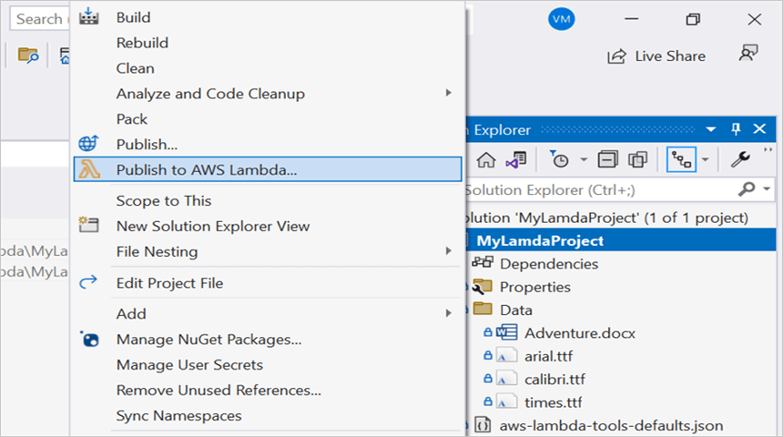
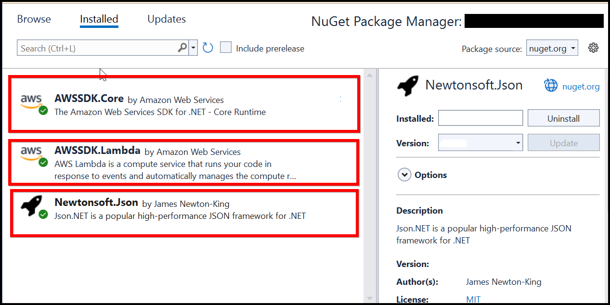

# Open and save PDF document in AWS Lambda

The [Syncfusion .NET Core PDF library](https://www.syncfusion.com/document-processing/pdf-framework/net-core) is used to create, read, and edit PDF documents programatically without the dependency of Adobe Acrobat. Using this library, **open and save PDF document in AWS Lambda**. 

## Steps to open and save PDF document in AWS Lambda

Step 1: Create a new **AWS Lambda project** as follows.

Step 2: Select the Blueprint as Empty Function and click **Finish**.

Step 3: Install the [Syncfusion.Pdf.Net.Core](https://www.nuget.org/packages/Syncfusion.Pdf.Net.Core/) NuGet package as a reference to your project from [NuGet.org](https://www.nuget.org/).

N> Starting with v16.2.0.x, if you reference Syncfusion assemblies from the trial setup or NuGet feed, you also have to add the "Syncfusion.Licensing" assembly reference and include a license key in your projects. Please refer to this [link](https://help.syncfusion.com/common/essential-studio/licensing/overview) to registering the Syncfusion license key in your application to use our components.

Step 4: Create a folder and copy the required data files, and include the files in the project.

Step 5: Set the **copy to the output directory** to **Copy if newer** to all the data files.

Step 6: Include the following namespaces in **Function.cs** file.




using Syncfusion.Pdf.Parsing;
using Syncfusion.Pdf;
using Syncfusion.Pdf.Graphics;
using Syncfusion.Pdf.Grid;
using Syncfusion.Drawing;




step 7: Add the following code sample in **Function.cs** to **open a PDF document in AWS Lambda**.




//Open an existing PDF document.
FileStream document = new FileStream("Input.pdf", FileMode.Open, FileAccess.Read);
PdfLoadedDocument document = new PdfLoadedDocument(stream);




Step 8: Add the below code example to add a table in the PDF document.




//Load the existing page.
PdfLoadedPage loadedPage = document.Pages[0] as PdfLoadedPage;
//Create PDF graphics for the page.
PdfGraphics graphics = loadedPage.Graphics;

//Create a PdfGrid.
PdfGrid pdfGrid = new PdfGrid();
//Add values to the list.
List<object> data = new List<object>();
Object row1 = new { Product_ID = "1001", Product_Name = "Bicycle", Price = "10,000" };
Object row2 = new { Product_ID = "1002", Product_Name = "Head Light", Price = "3,000" };
Object row3 = new { Product_ID = "1003", Product_Name = "Break wire", Price = "1,500" };
data.Add(row1);
data.Add(row2);
data.Add(row3);
//Add list to IEnumerable.
IEnumerable<object> dataTable = data;
//Assign data source.
pdfGrid.DataSource = dataTable;
//Apply built-in table style.
pdfGrid.ApplyBuiltinStyle(PdfGridBuiltinStyle.GridTable4Accent3);
//Draw the grid to the page of PDF document.
pdfGrid.Draw(graphics, new RectangleF(40, 400, loadedPage.Size.Width - 80, 0));




Step 9: Add the following code example to **save the PDF document in AWS Lambda**.




//Save the document into stream.
MemoryStream memoryStream = new MemoryStream();
//Save and Close the PDF Document.
document.Save(memoryStream);
document.Close(true);
return Convert.ToBase64String(memoryStream.ToArray());




Step 10: Right-click the project and select **Publish to AWS Lambda**.

Step 11: Create a new AWS profile in the Upload Lambda Function Window. After creating the profile, add a name for the Lambda function to publish. Then, click **Next**.

Step 12: In the Advanced Function Details window, specify the **Role Name** based on AWS Managed policy. After selecting the role, click **Upload** button to deploy your application.

Step 13:See the published Lambda function in the **AWS console** after deploying the application.

Step 14: Edit the Memory size and Timeout as maximum in Basic settings of the AWS Lambda function.

## Steps to post the request to AWS Lambda

Step 1: Create a new console project.

step 2: Install the following **Nuget packages** in your application from [Nuget.org](https://www.nuget.org/).

* [AWSSDK.Core](https://www.nuget.org/packages/AWSSDK.Core/)
* [AWSSDK.Lambda](https://www.nuget.org/packages/AWSSDK.Lambda/)
* [Newtonsoft.Json](https://www.nuget.org/packages/Newtonsoft.Json/)

Step 3: Include the following namespaces in **Program.cs** file.




using Amazon;
using Amazon.Lambda;
using Amazon.Lambda.Model;
using Newtonsoft.Json;




Step 4: Add the following code sample in **Program.cs** to invoke the published AWS Lambda function using the function name and access keys.




//Create a new AmazonLambdaClient
AmazonLambdaClient client = new AmazonLambdaClient("awsaccessKeyID", "awsSecreteAccessKey", RegionEndpoint.USEast2);
//Create new InvokeRequest with published function name.
InvokeRequest invoke = new InvokeRequest
{
    FunctionName = "MyNewFunction",
    InvocationType = InvocationType.RequestResponse,
    Payload = "\"Test\""
};
//Get the InvokeResponse from client InvokeRequest
InvokeResponse response = await client.InvokeAsync(invoke);
//Read the response stream
var stream = new StreamReader(response.Payload);
JsonReader reader = new JsonTextReader(stream);
var serilizer = new JsonSerializer();
var responseText = serilizer.Deserialize(reader);
//Convert Base64String into PDF document
byte[] bytes = Convert.FromBase64String(responseText.ToString());
FileStream fileStream = new FileStream("Sample.pdf", FileMode.Create);
BinaryWriter writer = new BinaryWriter(fileStream);
writer.Write(bytes, 0, bytes.Length);
writer.Close();
System.Diagnostics.Process.Start("Sample.pdf");




By executing the program, you will get the a **PDF document** as follows.

From GitHub, you can download the [console application](https://github.com/SyncfusionExamples/PDF-Examples/tree/master/Open%20and%20Save%20PDF%20document/AWS/ConsoleApp) and [AWS Lambda](https://github.com/SyncfusionExamples/PDF-Examples/tree/master/Open%20and%20Save%20PDF%20document/AWS/AWSLambdaProject) project.

Click [here](https://www.syncfusion.com/document-processing/pdf-framework/net-core?_gl=1*7czwz1*_ga*OTcwNzc5NDkuMTY4MTEwMjEwNA..*_ga_WC4JKKPHH0*MTY4OTg0NTE0Ni4zMzguMC4xNjg5ODQ1MTQ2LjYwLjAuMA..) to explore the rich set of Syncfusion PDF library features. 