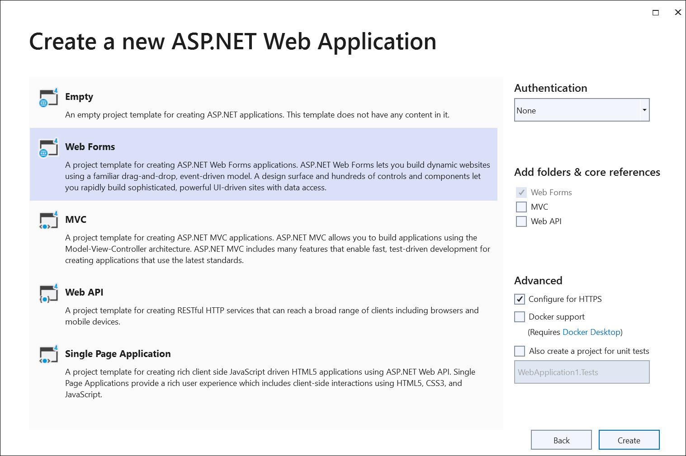
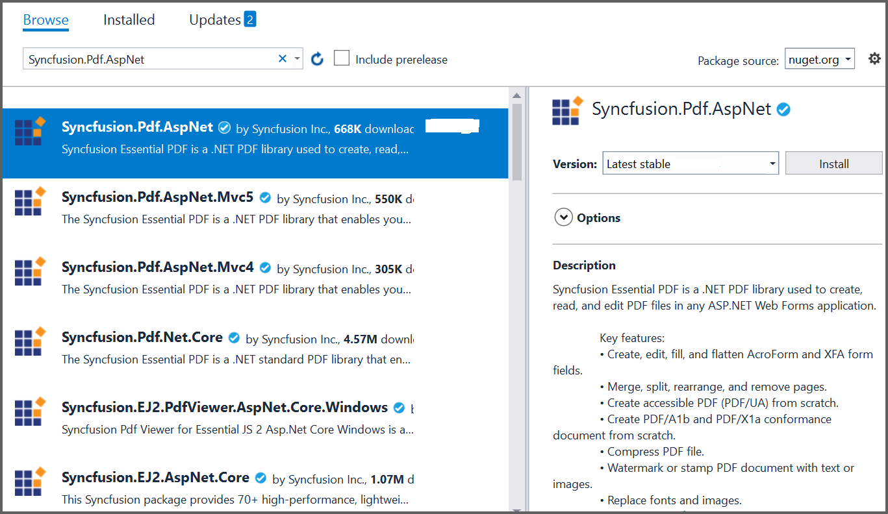

# Open and Save PDF document in ASP.NET

The [Syncfusion .NET PDF library](https://www.syncfusion.com/document-processing/pdf-framework/net) is used to create, read, and edit PDF documents programatically without the dependency of Adobe Acrobat. Using this library, you can **open and save PDF document in ASP.NET**.

## Steps to open and save PDF document programatically: 

Step 1: Create a new ASP.NET Web application project.

Step 2: Install the [Syncfusion.Pdf.AspNet](https://www.nuget.org/packages/Syncfusion.Pdf.AspNet/) NuGet package as a reference to your project from [NuGet.org](https://www.nuget.org/).

N> Starting with v16.2.0.x, if you reference Syncfusion assemblies from trial setup or from the NuGet feed, you also have to add "Syncfusion.Licensing" assembly reference and include a license key in your projects. Please refer to this [link](https://help.syncfusion.com/common/essential-studio/licensing/overview) to know about registering the Syncfusion license key in your application to use our components.

Step 3: Add a new button in the **Default.aspx** as shown in the following.





<asp:Content ID="BodyContent" ContentPlaceHolderID="MainContent" runat="server">
    <asp:Button ID="Button1" runat="server" Text="Load and save PDF document" OnClick="OpenAndSaveDocument" />  
    

        
    

</asp:Content>





Step 4: Include the following namespace in your **Default.aspx.cs** file.





using Syncfusion.Pdf.Graphics;
using Syncfusion.Pdf.Grid;
using Syncfusion.Pdf.Parsing;
using Syncfusion.Pdf;





Step 5: Include the below code samples in the click event of the button in **Default.aspx.cs**, to **open an existing PDF document in ASP.NET**.





//Load an existing PDF document.
PdfLoadedDocument document = new PdfLoadedDocument("Input.pdf");





Step 6: Add the below code example to add a table in the PDF document.





//Get the first page from a document.
PdfLoadedPage page = document.Pages[0] as PdfLoadedPage;
//Create PDF graphics for the page.
PdfGraphics graphics = page.Graphics;
//Create a PdfGrid.
PdfGrid pdfGrid = new PdfGrid();
//Add values to the list.
List<object> data = new List<object>();
Object row1 = new { Product_ID = "1001", Product_Name = "Bicycle", Price = "10,000" };
Object row2 = new { Product_ID = "1002", Product_Name = "Head Light", Price = "3,000" };
Object row3 = new { Product_ID = "1003", Product_Name = "Break wire", Price = "1,500" };
data.Add(row1);
data.Add(row2);
data.Add(row3);
//Add list to IEnumerable.
IEnumerable<object> dataTable = data;
//Assign data source.
pdfGrid.DataSource = dataTable;
//Apply built-in table style.
pdfGrid.ApplyBuiltinStyle(PdfGridBuiltinStyle.GridTable4Accent3);
//Draw the grid to the page of the PDF document.
pdfGrid.Draw(graphics, new RectangleF(40, 400, page.Size.Width - 80, 0));





Step 7: Add the below code example to **save the PDF document in ASP.NET**.





//Save the document.
document.Save("Output.pdf", HttpContext.Current.Response, HttpReadType.Save);





You can download a complete working sample from [GitHub](https://github.com/SyncfusionExamples/PDF-Examples/tree/master/Open%20and%20Save%20PDF%20document/ASP.NET/Open_and_save_PDF_document).

By executing the program, you will get the **PDF document** as follows.

Click [here](https://www.syncfusion.com/document-processing/pdf-framework/net) to explore the rich set of Syncfusion PDF library features.