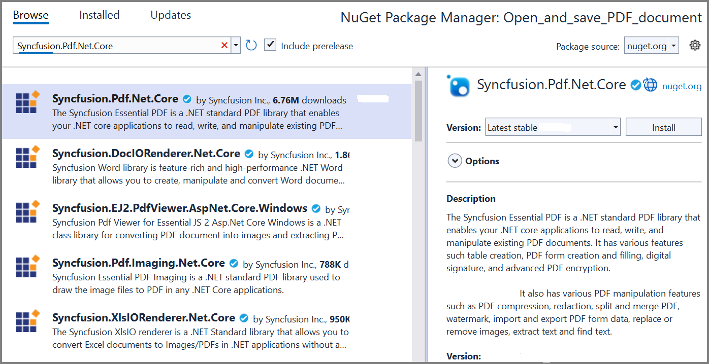

# Open and save PDF document in Azure App Service on Windows

The [Syncfusion .NET Core PDF library](https://www.syncfusion.com/document-processing/pdf-framework/net-core) is used to create, read, edit PDF documents programmatically without the dependency of Adobe Acrobat. Using this library, you can **Open and save PDF document in Azure App Service on Windows**.

## Steps to open and save PDF document in Azure App Service on Windows

Step 1: Create a new ASP.NET Core Web App (Model-View-Controller).

Step 2: Create a project name and select the location.

Step 3: Click **Create** button.

Step 4: Install the [Syncfusion.Pdf.Net.Core](https://www.nuget.org/packages/Syncfusion.Pdf.Net.Core/) NuGet package as a reference to your project from [NuGet.org](https://www.nuget.org/).

N> Starting with v16.2.0.x, if you reference Syncfusion assemblies from trial setup or from the NuGet feed, you also have to add "Syncfusion.Licensing" assembly reference and include a license key in your projects. Please refer to this [link](https://help.syncfusion.com/common/essential-studio/licensing/overview) to know about registering Syncfusion license key in your application to use our components.

Step 5: A default action method named Index will be present in *HomeController.cs*. Right click on Index method and select Go To View where you will be directed to its associated view page *Index.cshtml*. Add a new button in the *Index.cshtml* as shown below.




@{
    Html.BeginForm("OpenAndSavePDFDocument", "Home", FormMethod.Get);
    {
        

            <input type="submit" value="Open and save PDF Document" style="width:200px;height:27px" />
        

    }
    Html.EndForm();
}




Step 6: Include the following namespaces in **HomeController.cs**.




using Syncfusion.Pdf.Graphics;
using Syncfusion.Pdf.Parsing;
using Syncfusion.Pdf.Grid;
using Syncfusion.Pdf;
using Syncfusion.Drawing;




Step 7: Add a new action method **OpenAndSaveDocument** in HomeController.cs and include the below code snippet to **open an existing PDF document**.




//Load PDF document as stream.
string docPath = Path.Combine(_hostingEnvironment.WebRootPath + "/Data/Input.pdf");
FileStream docStream = new FileStream(docPath, FileMode.Open, FileAccess.Read);
//Load an existing PDF document.
PdfLoadedDocument document = new PdfLoadedDocument(docStream);




Step 8: Add below code example to add a table in an existing PDF document.




//Create a PdfGrid.
PdfGrid pdfGrid = new PdfGrid();
//Add values to the list.
List<object> data = new List<object>();
Object row1 = new { Product_ID = "1001", Product_Name = "Bicycle", Price = "10,000" };
Object row2 = new { Product_ID = "1002", Product_Name = "Head Light", Price = "3,000" };
Object row3 = new { Product_ID = "1003", Product_Name = "Break wire", Price = "1,500" };
data.Add(row1);
data.Add(row2);
data.Add(row3);
//Add list to IEnumerable.
IEnumerable<object> dataTable = data;
//Assign data source.
pdfGrid.DataSource = dataTable;
//Apply built-in table style.
pdfGrid.ApplyBuiltinStyle(PdfGridBuiltinStyle.GridTable4Accent3);
//Draw the grid to the page of PDF document.
pdfGrid.Draw(graphics, new RectangleF(40, 400, loadedPage.Size.Width - 80, 0));




Step 9: Add below code example to **save the PDF document**.




//Saving the PDF to the MemoryStream.
MemoryStream stream = new MemoryStream();
document.Save(stream);
//Set the position as '0'.
stream.Position = 0;
//Download the PDF document in the browser.
FileStreamResult fileStreamResult = new FileStreamResult(stream, "application/pdf");
fileStreamResult.FileDownloadName = "Sample.pdf";
return fileStreamResult;




## Steps to publish as Azure App Service on Windows

Step 1: Right-click the project and select **Publish** option.

Step 2: Select the publish target as **Azure**.

Step 3: Select the Specific target as **Azure App Service (Windows)**.

Step 4: To create a new app service, click **Create new** option.

Step 5: Click the **Create** button to proceed with **App Service** creation.

Step 6: Click the **Finish** button to finalize the **App Service** creation.

Step 7: Click **Close** button.

Step 8: Click the **Publish** button.

Step 9: Now, Publish has been succeeded.

Step 10: Now, the published webpage will open in the browser. 

Step 11: Click **Open and Save Document** button.You will get the output **PDF document** as follows.

You can download a complete working sample from [GitHub](https://github.com/SyncfusionExamples/PDF-Examples/tree/master/Open%20and%20Save%20PDF%20document/Azure/Azure_App_Service).

Click [here](https://www.syncfusion.com/document-processing/pdf-framework/net-core) to explore the rich set of Syncfusion PDF library features. 

An online sample link to [create PDF document](https://ej2.syncfusion.com/aspnetcore/PDF/HelloWorld#/bootstrap5) in ASP.NET Core. 