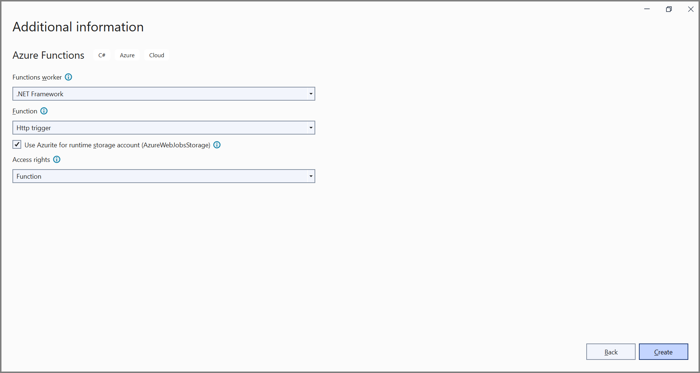
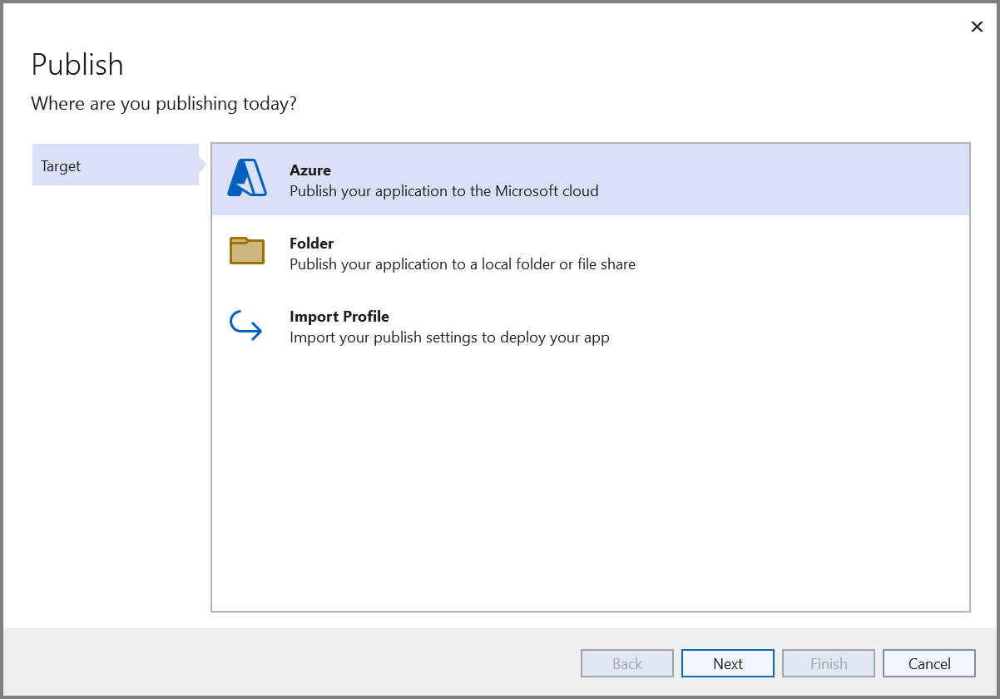

# Open and save PDF document in Azure Functions v1

The [Syncfusion .NET PDF library](https://www.syncfusion.com/document-processing/pdf-framework/net) is used to create, read, edit PDF documents programmatically without the dependency of Adobe Acrobat. Using this library, you can **Open and save PDF document in Azure Functions v1**.

## Steps to open and save PDF document in Azure Functions v1

Step 1: Create a new Azure Functions project.
 

Step 2: Create a project name and select the location.

Step 3: Select function worker as **.NET Framework**. 

Step 4: Install the [Syncfusion.PDF.AspNet](https://www.nuget.org/packages/Syncfusion.Pdf.AspNet) NuGet package as a reference to your project from [NuGet.org](https://www.nuget.org/).

N> Starting with v16.2.0.x, if you reference Syncfusion assemblies from trial setup or from the NuGet feed, you also have to add "Syncfusion.Licensing" assembly reference and include a license key in your projects. Please refer to this [link](https://help.syncfusion.com/common/essential-studio/licensing/overview) to know about registering Syncfusion license key in your application to use our components.

Step 5: Include the following namespaces in the **Function1.cs** file.   




using Syncfusion.Pdf.Grid;
using Syncfusion.Pdf;
using Syncfusion.Pdf.Parsing;
using System.Drawing;




Step 6: Add the following code snippet in **Run** method of **Function1** class to perform ***open an existing PDF document**.




//Load an existing PDF document from the disk.
var assembly = Assembly.GetExecutingAssembly();
var docStream = assembly.GetManifestResourceStream("Open_and_save_PDF_document.Data.Input.pdf");
PdfLoadedDocument loadedDocument = new PdfLoadedDocument(docStream);




Step 7: Add below code example to add a table in the PDF document.




//Create a PdfGrid.
PdfGrid pdfGrid = new PdfGrid();
//Add values to the list.
List<object> data = new List<object>();
Object row1 = new { Product_ID = "1001", Product_Name = "Bicycle", Price = "10,000" };
Object row2 = new { Product_ID = "1002", Product_Name = "Head Light", Price = "3,000" };
Object row3 = new { Product_ID = "1003", Product_Name = "Break wire", Price = "1,500" };
data.Add(row1);
data.Add(row2);
data.Add(row3);
//Add list to IEnumerable.
IEnumerable<object> dataTable = data;
//Assign data source.
pdfGrid.DataSource = dataTable;
//Apply built-in table style.
pdfGrid.ApplyBuiltinStyle(PdfGridBuiltinStyle.GridTable4Accent3);
//Draw the grid to the page of PDF document.
pdfGrid.Draw(graphics, new RectangleF(40, 400, loadedPage.Size.Width - 80, 0));




Step 8: Add below code example to **save the PDF document**.




//Save and close the PDF document  
MemoryStream ms = new MemoryStream();
loadedDocument.Save(ms);
loadedDocument.Close();
ms.Position = 0;

HttpResponseMessage response = new HttpResponseMessage(HttpStatusCode.OK);
response.Content = new ByteArrayContent(ms.ToArray());
response.Content.Headers.ContentDisposition = new ContentDispositionHeaderValue("attachment")
{
    FileName = "Sample.pdf"
};
response.Content.Headers.ContentType = new System.Net.Http.Headers.MediaTypeHeaderValue("application/pdf");
return response;




Step 9: Right click the project and select **Publish**. Then, create a new profile in the Publish Window.

Step 10: Select the target as **Azure** and click **Next** button.

Step 11: Select the **Create new** button.

Step 12: Click **Create** button. 

Step 13: After creating app service then click **Finish** button. 

Step 14: Click the **Publish** button.

Step 15: Publish has been succeed.

Step 16: Now, go to Azure portal and select the App Services. After running the service, click **Get function URL > Copy**. Include the URL as a query string in the URL. Then, paste it into the new browser tab. You will get the PDF document as follows. 

You can download a complete working sample from [GitHub](https://github.com/SyncfusionExamples/PDF-Examples/tree/master/Open%20and%20Save%20PDF%20document/Azure/Azure_Functions/Azure-functions-v1).

Click [here](https://www.syncfusion.com/document-processing/pdf-framework/net-core) to explore the rich set of Syncfusion PDF library features.

An online sample link to [create a PDF document](https://ej2.syncfusion.com/aspnetcore/PDF/HelloWorld#/material3) in ASP.NET Core.
