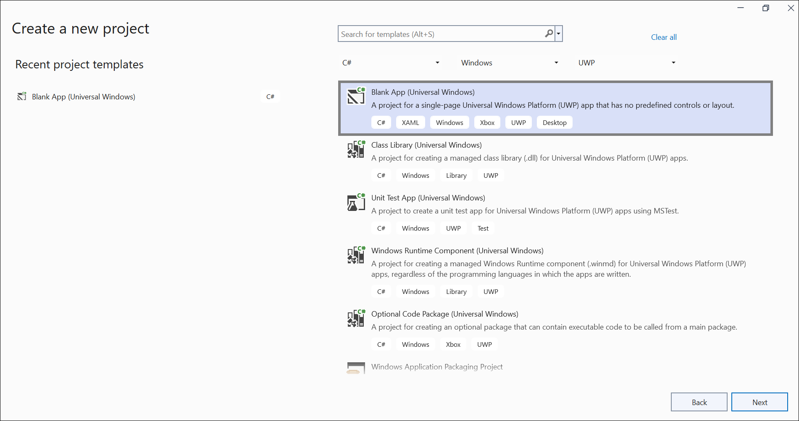
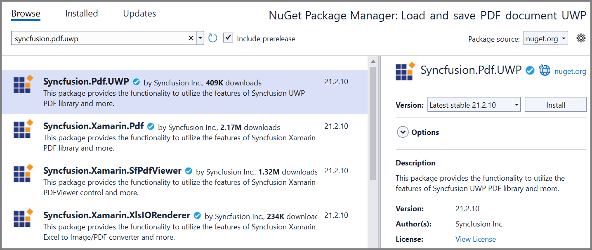

# Open and Save PDF document in UWP

The [Syncfusion UWP PDF library](https://www.syncfusion.com/document-processing/pdf-framework/uwp) is used to create, read, and edit PDF documents programatically without the dependency of Adobe Acrobat. Using this library, you can **open and save PDF document in UWP**. 

## Steps to open and save PDF document programatically:

Step 1: Create a new C# Blank App (Universal Windows) project.
 

Step 2: Install the [Syncfusion.Pdf.UWP](https://www.nuget.org/packages/Syncfusion.Pdf.UWP/) NuGet package as reference to your UWP applications from [NuGet.org](https://www.nuget.org/).

N> Starting with v16.2.0.x, if you reference Syncfusion assemblies from trial setup or from the NuGet feed, you also have to add "Syncfusion.Licensing" assembly reference and include a license key in your projects. Please refer to this [link](https://help.syncfusion.com/common/essential-studio/licensing/overview) to know about registering Syncfusion license key in your application to use our components.

Step 3: Create button in `MainPage.Xaml` page using below code example and create Button_Click event.





<Grid>
    <Button Content="OpenAndSavePDF" HorizontalAlignment="Center"  VerticalAlignment="Center" Width="150" Height="100" Click="Button_Click" />
</Grid>





Step 4: Include the following namespaces in the `MainPage.xaml.cs` file. 





using Syncfusion.Pdf.Grid;
using Syncfusion.Pdf.Parsing;
using Syncfusion.Pdf;





Step 5: Include the below code snippet in the click event of the button in MainPage.xaml.cs, to **Open an existing PDF document in UWP**.





//Load an existing PDF document.
Stream docStream = typeof(MainPage).GetTypeInfo().Assembly.GetManifestResourceStream("Sample.Assets.Input.pdf");
PdfLoadedDocument loadedDocument = new PdfLoadedDocument(docStream);





Step 6: Add below code example to add a table in the PDF document.





//Create a PdfGrid.
PdfGrid pdfGrid = new PdfGrid();
//Add values to the list.
List<object> data = new List<object>();
Object row1 = new { Product_ID = "1001", Product_Name = "Bicycle", Price = "10,000" };
Object row2 = new { Product_ID = "1002", Product_Name = "Head Light", Price = "3,000" };
Object row3 = new { Product_ID = "1003", Product_Name = "Break wire", Price = "1,500" };
data.Add(row1);
data.Add(row2);
data.Add(row3); 
//Add list to IEnumerable.
IEnumerable<object> dataTable = data;

//Assign data source.
pdfGrid.DataSource = dataTable;
//Apply built-in table style.
pdfGrid.ApplyBuiltinStyle(PdfGridBuiltinStyle.GridTable4Accent3);
//Draw the grid to the page of PDF document.
pdfGrid.Draw(graphics, new RectangleF(40, 400, loadedPage.Size.Width - 80, 0));





Step 7: Add below code example to **save the PDF document in UWP**.





//Create memory stream.
MemoryStream ms = new MemoryStream();
//Open the document in browser after saving it.
loadedDocument.Save(ms);
//Close the document.
loadedDocument.Close(true);
//Save the PDF document. 
Save(ms, "Sample.pdf");





Step 8: Add below code example to save the PDF document as a physical file and open the file for viewing.





//Save the stream to physical file and open the file for viewing. 
public async void Save(Stream stream, string filename)
{
    stream.Position = 0;

    StorageFile stFile;
    if (!(Windows.Foundation.Metadata.ApiInformation.IsTypePresent("Windows.Phone.UI.Input.HardwareButtons")))
    {
        FileSavePicker savePicker = new FileSavePicker();
        savePicker.DefaultFileExtension = ".pdf";
        savePicker.SuggestedFileName = "Sample";
        savePicker.FileTypeChoices.Add("Adobe PDF Document", new List<string>() { ".pdf" });
        stFile = await savePicker.PickSaveFileAsync();
    }
    else
    {
        StorageFolder local = Windows.Storage.ApplicationData.Current.LocalFolder;
        stFile = await local.CreateFileAsync(filename, CreationCollisionOption.ReplaceExisting);
    }
    if (stFile != null)
    {
        Windows.Storage.Streams.IRandomAccessStream fileStream = await stFile.OpenAsync(FileAccessMode.ReadWrite);
        Stream st = fileStream.AsStreamForWrite();
        st.SetLength(0);
        st.Write((stream as MemoryStream).ToArray(), 0, (int)stream.Length);
        st.Flush();
        st.Dispose();
        fileStream.Dispose();
        MessageDialog msgDialog = new MessageDialog("Do you want to view the Document?", "File created.");
        UICommand yesCmd = new UICommand("Yes");
        msgDialog.Commands.Add(yesCmd);
        UICommand noCmd = new UICommand("No");
        msgDialog.Commands.Add(noCmd);
        IUICommand cmd = await msgDialog.ShowAsync();
        if (cmd == yesCmd)
        {
            // Launch the retrieved file 
            bool success = await Windows.System.Launcher.LaunchFileAsync(stFile);
        }
    }
}





You can download a complete working sample from [GitHub]().

By executing the program, you will get the **Word document** as follows.
