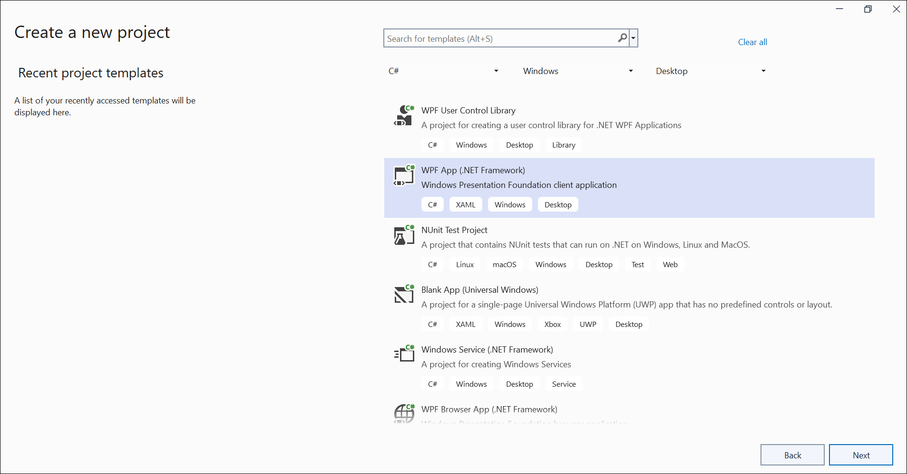

# Open and save PDF document in WPF

The [Syncfusion .NET PDF library](https://www.syncfusion.com/document-processing/pdf-framework/net) is used to create, read, and edit PDF documents programatically without the dependency of Adobe Acrobat. Using this library, you can **open and save PDF document in WPF**. 

## Steps to open and save PDF document programmatically:

Step 1: Create a new Windows Forms application project.

Step 2: Install [Syncfusion.Pdf.Wpf](https://www.nuget.org/packages/Syncfusion.Pdf.Wpf/) NuGet package as a reference to your Windows Forms application from the [NuGet.org](https://www.nuget.org/).

N> Starting with v16.2.0.x, if you reference Syncfusion assemblies from the trial setup or from the NuGet feed, you also have to add the "Syncfusion.Licensing" assembly reference and include a license key in your projects. Please refer to this [link](https://help.syncfusion.com/common/essential-studio/licensing/overview) to know about registering Syncfusion license key in your application to use our components.

Step 3: Include the following namespaces in the *MainWindow.xaml.cs* file.





using Syncfusion.Pdf.Grid;
using Syncfusion.Pdf;
using Syncfusion.Pdf.Parsing;
using Syncfusion.Pdf.Graphics;





Step 4: Add a new button in the **MainWindow.xaml** to open and save the PDF document as follows.





<Button Click="btnOpenAndSave_Click" Margin="0,187,0,0" VerticalAlignment="Top" Height="30" BorderBrush="LightBlue" HorizontalAlignment="Center" Width="256">
    <Button.Background>
        <LinearGradientBrush EndPoint="0.5,-0.04" StartPoint="0.5,1.04">
            <GradientStop Color="#FFD9E9F7" Offset="0"/>
                <GradientStop Color="#FFEFF8FF" Offset="1"/>
        </LinearGradientBrush>
    </Button.Background>
    <StackPanel Orientation="Horizontal" Height="23" Margin="0,0,0,-2.52" VerticalAlignment="Bottom" HorizontalAlignment="Right" Width="200">
        <Image Name="image2" Margin="2" HorizontalAlignment="Center" VerticalAlignment="Center" />
        <TextBlock Text="Opend and Save PDF documemt" Height="26" Width="261" />
    </StackPanel>
</Button>





Step 5: Add the following code in the **btnOpenAndSave_Click** to **open an existing PDF document in WPF**.





//Open an existing PDF document.
PdfLoadedDocument document = new PdfLoadedDocument("Input.pdf");





Step 6: Add the below code example to add a table in the PDF document.





//Load the page. 
PdfLoadedPage loadedPage = document.Pages[0] as PdfLoadedPage;
//Create graphics for the page. 
PdfGraphics graphics = loadedPage.Graphics;

//Create a PdfGrid.
PdfGrid pdfGrid = new PdfGrid();
//Add values to the list.
List<object> data = new List<object>();
Object row1 = new { Product_ID = "1001", Product_Name = "Bicycle", Price = "10,000" };
Object row2 = new { Product_ID = "1002", Product_Name = "Head Light", Price = "3,000" };
Object row3 = new { Product_ID = "1003", Product_Name = "Break wire", Price = "1,500" };
data.Add(row1);
data.Add(row2);
data.Add(row3);
//Add list to IEnumerable.
IEnumerable<object> dataTable = data;
//Assign data source.
pdfGrid.DataSource = dataTable;
//Apply built-in table style.
pdfGrid.ApplyBuiltinStyle(PdfGridBuiltinStyle.GridTable4Accent3);
//Draw the grid to the page of PDF document.
pdfGrid.Draw(graphics, new RectangleF(40, 400, loadedPage.Size.Width - 80, 0));





Step 7: Add the below code example to **save the PDF document in WPF**.





//Save the document.
document.Save("Sample.pdf");





You can download a complete working sample from [GitHub](https://github.com/SyncfusionExamples/PDF-Examples/tree/master/Open%20and%20Save%20PDF%20document/WPf/Open-and-save-PDF-document-WPF).

By executing the program, you will get the **PDF document** as follows.

Click [here](https://www.syncfusion.com/document-processing/pdf-framework/net) to explore the rich set of Syncfusion PDF library features.