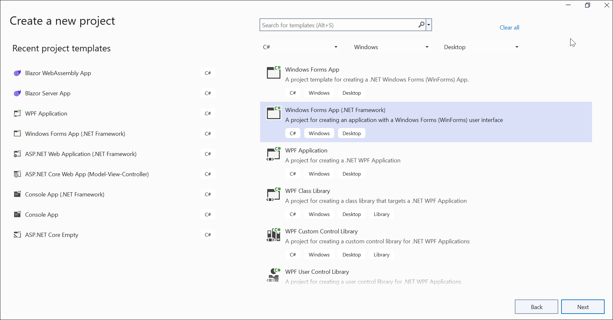

# Open and save PDF document in Windows Forms

The [Syncfusion .NET PDF library](https://www.syncfusion.com/document-processing/pdf-framework/net) is used to create, read, and edit PDF documents programatically without the dependency of Adobe Acrobat. Using this library, you can **open and save PDF document in ASP.NET Core**. 

## Steps to open and save PDF document programmatically:

Step 1: Create a new Windows Forms application project.

Step 2: Install [Syncfusion.Pdf.WinForms](https://www.nuget.org/packages/Syncfusion.Pdf.WinForms/) NuGet package as a reference to your Windows Forms application from the [NuGet.org](https://www.nuget.org/).

N> Starting with v16.2.0.x, if you reference Syncfusion assemblies from the trial setup or from the NuGet feed, you also have to add the  "Syncfusion.Licensing" assembly reference and include a license key in your projects. Please refer to this [link](https://help.syncfusion.com/common/essential-studio/licensing/overview) to know about registering Syncfusion license key in your application to use our components.

Step 3: Include the following namespaces in the **Form1.cs** file.





using Syncfusion.Pdf;
using Syncfusion.Pdf.Graphics;
using Syncfusion.Pdf.Grid;
using Syncfusion.Pdf.Parsing;





Step 4: Add a new button in **Form1.Designer.cs** to open and save PDF document as follows. 





this.button1 = new System.Windows.Forms.Button();
this.label1 = new System.Windows.Forms.Label();
this.SuspendLayout();
// 
// button1
// 
this.button1.Location = new System.Drawing.Point(271, 170);
this.button1.Name = "button1";
this.button1.Size = new System.Drawing.Size(183, 57);
this.button1.TabIndex = 0;
this.button1.Text = "Open and save PDF document";
this.button1.UseVisualStyleBackColor = true;
this.button1.Click += new System.EventHandler(this.button1_Click);
// 
// label1
// 
this.label1.AutoSize = true;
this.label1.Location = new System.Drawing.Point(207, 105);
this.label1.Name = "label1";
this.label1.Size = new System.Drawing.Size(356, 20);
this.label1.TabIndex = 1;
this.label1.Text = "Click the button to open and save PDF document";





Step 5: Add the following code in the **btnOpenAndSave_Click** to **open an existing PDF document in Windows-Forms**.





//Open an existing PDF document.
PdfLoadedDocument document = new PdfLoadedDocument("Input.pdf");





Step 6: Add below code example to add a table in an existing PDF document.





//Create a PdfGrid.
PdfGrid pdfGrid = new PdfGrid();
//Add values to the list.
List<object> data = new List<object>();
Object row1 = new { Product_ID = "1001", Product_Name = "Bicycle", Price = "10,000" };
Object row2 = new { Product_ID = "1002", Product_Name = "Head Light", Price = "3,000" };
Object row3 = new { Product_ID = "1003", Product_Name = "Break wire", Price = "1,500" };
data.Add(row1);
data.Add(row2);
data.Add(row3);
//Add list to IEnumerable.
IEnumerable<object> dataTable = data;
//Assign data source.
pdfGrid.DataSource = dataTable;
//Apply built-in table style.
pdfGrid.ApplyBuiltinStyle(PdfGridBuiltinStyle.GridTable4Accent3);
//Draw the grid to the page of PDF document.
pdfGrid.Draw(graphics, new RectangleF(40, 400, page.Size.Width - 80, 0));





Step 7: Add below code example to **save the PDF document in Windows Forms**.





//Save the PDF document. 
document.Save("Sample.pdf");





You can download a complete working sample from [GitHub](https://github.com/SyncfusionExamples/PDF-Examples/tree/master/Open%20and%20Save%20PDF%20document/Windows%20Forms/Open-and-save-PDF-document).

By executing the program, you will get the **PDF document** as follows.
