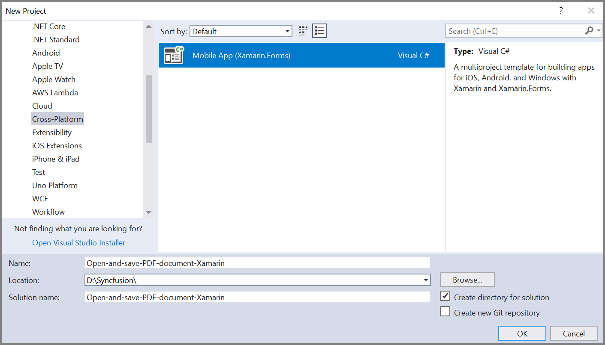
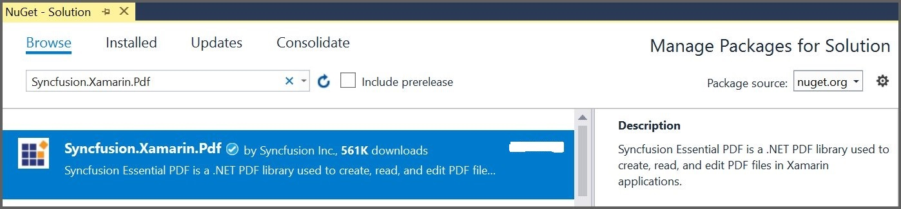

# Open and Save PDF document in Xamarin

The [Syncfusion Xamarin PDF library](https://www.syncfusion.com/document-processing/pdf-framework/xamarin) is used to create, read, and edit PDF documents programatically without the dependency of Adobe Acrobat. Using this library, you can **open and save PDF document in Xamarin**.

## Steps to open and save PDF document programmatically:

Step 1: Create a new Xamarin.Forms application project.

Step 2: Select a project template and required platforms to deploy the application. In this application, the portable assemblies to be shared across multiple platforms, so the .NET Standard code sharing strategy has been selected. For more details about code sharing, refer [here](https://learn.microsoft.com/en-us/xamarin/cross-platform/app-fundamentals/code-sharing).

N> If .NET Standard is not available in the code sharing strategy, the Portable Class Library (PCL) can be selected.

Step 3: Install the [Syncfusion.Xamarin.PDF](https://www.nuget.org/packages/Syncfusion.Xamarin.PDF/) NuGet package as a reference to your Xamarin.Forms applications from [NuGet.org](https://www.nuget.org/).

N> Starting with v16.2.0.x, if you reference Syncfusion assemblies from trial setup or from the NuGet feed, you also have to add "Syncfusion.Licensing" assembly reference and include a license key in your projects. Please refer to this [link](https://help.syncfusion.com/common/essential-studio/licensing/overview) to know about registering Syncfusion license key in your application to use our components.

Step 4: Add new Forms XAML page in *portable project* if there is no XAML page defined in the App class. Otherwise proceed to the next step.
<ul>
<li>
To add the new XAML page, right click on the project and select <b>Add > New Item</b> and add a Forms XAML Page from the list. Name it as <b>MainXamlPage</b>.
</li>
<li>
In App class of <b>portable project</b> (App.cs), replace the existing constructor of App class with the code snippet given below which invokes the <b>MainXamlPage</b>.
</li>
</ul>




public App()
{
    //The root page of your application.
    MainPage = new MainXamlPage();
}




Step 5: In the *MainXamlPage.xaml*, add new button as shown below.





<ContentPage xmlns="http://xamarin.com/schemas/2014/forms"
             xmlns:x="http://schemas.microsoft.com/winfx/2009/xaml"
             xmlns:local="clr-namespace:Open_and_save_PDF_document_Xamarin"
             x:Class="Open_and_save_PDF_document_Xamarin.MainPage">
    <StackLayout VerticalOptions="Center">
        <Button Text="Load and save PDF document" Clicked="Button_Clicked" HorizontalOptions="Center"/>
    </StackLayout>
</ContentPage>





Step 6: Include the following namespace in the *MainXamlPage.xaml.cs* file.





using Syncfusion.Pdf.Parsing;
using Syncfusion.Pdf;
using Syncfusion.Pdf.Graphics;
using Syncfusion.Pdf.Grid;
using Syncfusion.Drawing;





Step 7: Include the below code sample in the click event of the button in MainXamlPage.xaml.cs, to **open an existing PDF document in Xamarin**. 





void OnButtonClicked(object sender, EventArgs args)
{
    //Load an existing PDF document. 
    Stream inputPDFStream = typeof(App).GetTypeInfo().Assembly.GetManifestResourceStream("Sample.Assets.Input.pdf");
}





Step 8:  Add below code example to add a tabe in the PDF document.





//Create a PdfGrid
PdfGrid pdfGrid = new PdfGrid();
//Add values to the list
List<object> data = new List<object>();
Object row1 = new { Product_ID = "1001", Product_Name = "Bicycle", Price = "10,000" };
Object row2 = new { Product_ID = "1002", Product_Name = "Head Light", Price = "3,000" };
Object row3 = new { Product_ID = "1003", Product_Name = "Break wire", Price = "1,500" };
data.Add(row1);
data.Add(row2);
data.Add(row3);
//Add list to IEnumerable
IEnumerable<object> dataTable = data;
//Assign data source
pdfGrid.DataSource = dataTable;
//Apply built-in table style
pdfGrid.ApplyBuiltinStyle(PdfGridBuiltinStyle.GridTable4Accent3);
//Draw the grid to the page of PDF document
pdfGrid.Draw(graphics, new RectangleF(40, 400, loadedPage.Size.Width - 80, 0));





Step 9: Add below code example to **save the PDF document in Xamarin**.





//Save the document to the stream.
MemoryStream stream = new MemoryStream();
document.Save(stream);
//Close the document.
document.Close(true);
//Save the stream as a file in the device and invoke it for viewing.
Xamarin.Forms.DependencyService.Get<ISave>().SaveAndView("Output.pdf", "application/pdf", stream);





### Helper files for Xamarin

Step 8: Download the helper files from this [link](https://www.syncfusion.com/downloads/support/directtrac/general/ze/Helper_Class1305995392) and add them into the mentioned project. These helper files allow you to save the stream as a physical file and open the file for viewing. 

<table>
  <tr>
    <th>Project</th>
    <th>File Name</th>
	<th>Summary</th>
  </tr>
  <tr>
    <td>portable project</td>
    <td>ISave.cs </td>
	<td>Represent the base interface for save operation</td>	
  </tr>
  <tr>
    <td rowspan="2">iOS Project</td>
    <td>SaveIOS.cs</td>
	<td>Represent the base interface for save operation</td>	
  </tr>
   <tr>    
    <td>PreviewControllerDS.cs</td>
	<td>Helper class for viewing the PDF file in iOS device</td>	
  </tr>
  <tr>
    <td>Android project</td>
    <td>SaveAndroid.cs</td>
	<td>Save implementation for Android device</td>	
  </tr>
  <tr>
    <td>WinPhone project</td>
    <td>SaveWinPhone.cs</td>
	<td>Save implementation for Windows Phone device</td>	
  </tr>
  <tr>
    <td>UWP project</td>
    <td>SaveWindows.cs</td>
	<td>Save implementation for UWP device.</td>	
  </tr>
  <tr>
    <td>Windows(8.1) project </td>
    <td>SaveWindows81.cs</td>
	<td>Save implementation for WinRT device.</td>	
  </tr>     
</table>

N> Introduced a new runtime permission model for the Android SDK version 23 and above. So, include the following code for enabling the Android file provider to save and view the generated PDF document.

Step 9(i): Create a new XML file with the name of provider_paths.xml under the Android project Resources folder and add the following code in it.
Eg: Resources/xml/provider_paths.xml


<?xml version="1.0" encoding="UTF-8" ?>
<paths xmlns:android="http://schemas.android.com/apk/res/android">
<external-path name="external_files" path="."/>
</paths>


Step 9(ii): Add the following code to the AndroidManifest.xml file located under Properties/AndroidManifest.xml.


<?xml version="1.0" encoding="utf-8"?>
<manifest xmlns:android="http://schemas.android.com/apk/res/android" android:versionCode="1" android:versionName="1.0" package="com.companyname. GettingStarted ">
<uses-sdk android:minSdkVersion="19" android:targetSdkVersion="27" />
<application android:label=" GettingStarted.Android" android:requestLegacyExternalStorage="true">
<provider android:name="android.support.v4.content.FileProvider"
android:authorities="${applicationId}.provider"
android:exported="false"
android:grantUriPermissions="true">
<meta-data android:name="android.support.FILE_PROVIDER_PATHS"
android:resource="@xml/provider_paths" />
</provider>
</application>
</manifest>


### Please include the changes if you deploy the application in Android 11:

* Enabled the androidLegacyExtranalStorage in the AndroidManifest.xml file.



<application android:label=" PDFXamarinSample.Android" android:requestLegacyExternalStorage="true">



* User permission for read or write external storage.Add the following code to the AndroidManifest.xml file located under Properties/AndroidManifest.xml.



<uses-permission android:name="android.permission.WRITE_EXTERNAL_STORAGE">
</uses-permission>
<uses-permission android:name="android.permission.READ_EXTERNAL_STORAGE" />



Step 10: Compile and execute the application. This will creates a PDF document.

You can download a complete working sample from [GitHub](https://github.com/SyncfusionExamples/PDF-Examples/tree/master/Open%20and%20Save%20PDF%20document/Xamarin/Open_and_save_PDF_document_Xamarin).

By executing the program, you will get the PDF document as follows.

