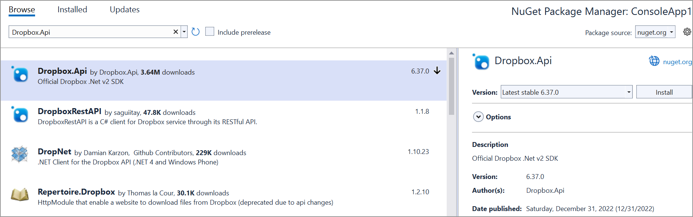

# Opem PDF file from Dropbox cloud file storage

To Open a PDF file from Dropbox cloud file storage, you can follow the steps below

Step 1: Create a Dropbox API

To create a Dropbox API App, you should follow the official documentation provided by Dropbox [link](https://www.dropbox.com/developers/documentation/dotnet#tutorial). The process involves visiting the Dropbox Developer website and using their App Console to set up your API app. This app will allow you to interact with Dropbox programmatically, enabling secure access to files and data.

Step 2: Create a simple console application

Step 3: Install the and [Dropbox.Api](https://www.nuget.org/packages/Dropbox.Api) NuGet package as a reference to your project from the [NuGet.org](https://www.nuget.org/).

Step 4: Include the following namespaces in the Program.cs file.





    using Dropbox.Api;





Step 5: Add the below code example to load a PDF ifrom Dropbox cloud file storage.





      // Define the access token for authentication with the Dropbox API
    var accessToken = "YOUR_ACCESS_TOKEN";// Replace with your actual access token
    
    // Define the file path in Dropbox where the PDF file is located
    var filePathInDropbox = "/path/to/save/Sample.pdf"; // Replace with the actual file path in Dropbox
    // Create a new DropboxClient instance using the provided access token
    using (var dbx = new DropboxClient(accessToken))
    {
        // Start a download request for the specified file in Dropbox
        using (var response = await dbx.Files.DownloadAsync(filePathInDropbox))
        {
            // Get the content of the downloaded file as a stream
            var content = await response.GetContentAsStreamAsync();
            // Create a new file stream to save the downloaded content locally
            using (var fileStream = File.Create("Output.pdf"))
            {
                // Copy the content stream to the file stream
                content.CopyTo(fileStream);
                // Close the file stream once the content is copied
                fileStream.Close();
            }
        }
    }





You can download a complete working sample from GitHub.
