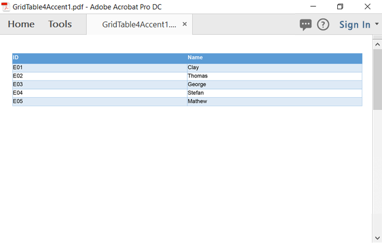

# Working with .NET PDF Tables using the PdfGrid model 

The Syncfusion .NET PDF library supports creating PDF tables or grids. The PDF table displays data from the data sources or by direct data binding in a tabular format. It is designed for high performance with advanced customization, styling, and formatting. Here you will see the creation of a PDF table using the **PdfGrid** model.  

## Creating a simple table  

The [PdfGrid](https://help.syncfusion.com/cr/file-formats/Syncfusion.Pdf.Grid.PdfGrid.html) allows you to create a table by entering the data manually or from an external data source. 

### Create a simple table from a data source 

The [DataSource](https://help.syncfusion.com/cr/file-formats/Syncfusion.Pdf.Grid.PdfGrid.html#Syncfusion_Pdf_Grid_PdfGrid_DataSource) can be a data set, data table, arrays or an IEnumerable object.

N> In Silverlight, Windows store apps, and Xamarin, only the strongly typed IEnumerable objects are supported. 

The following code sample illustrates how to create a simple table from a data source using the ``PdfGrid.``





//Create a new PDF document.
PdfDocument doc = new PdfDocument();

//Add a page.
PdfPage page = doc.Pages.Add();

//Create a PdfGrid.
PdfGrid pdfGrid = new PdfGrid();

//Create a DataTable.
DataTable dataTable = new DataTable();

//Add columns to the DataTable.
dataTable.Columns.Add("ID");
dataTable.Columns.Add("Name");

//Add rows to the DataTable.
dataTable.Rows.Add(new object[] { "E01", "Clay" });
dataTable.Rows.Add(new object[] { "E02", "Thomas" });

//Assign data source.
pdfGrid.DataSource = dataTable;

//Draw the grid to the page of a PDF document.
pdfGrid.Draw(page, new PointF(10, 10));

//Save the document.
doc.Save("Output.pdf");

//Close the document
doc.Close(true);





'Create a new PDF document. 
Dim doc As PdfDocument = New PdfDocument()

'Add a page. 
Dim page As PdfPage = doc.Pages.Add()

'Create a PdfGrid. 
Dim pdfGrid As PdfGrid = New PdfGrid()

'Create a Datatable.
Dim dataTable As DataTable = New DataTable()

'Add columns to the DataTable. 
dataTable.Columns.Add("ID")
dataTable.Columns.Add("Name")

'Add rows to the DataTable. 
dataTable.Rows.Add(New Object() {"E01", "Clay"})
dataTable.Rows.Add(New Object() {"E02", "Thomas"})

'Assign data source. 
pdfGrid.DataSource = dataTable

'Draw grid to the page of PDF document.
pdfGrid.Draw(page, New PointF(10, 10))

'Save the document.
doc.Save("Output.pdf")

'Close the document. 
doc.Close(True)





//Create a new PDF document.
PdfDocument doc = new PdfDocument();

//Add a page.
PdfPage page = doc.Pages.Add();

//Create a PdfGrid.
PdfGrid pdfGrid = new PdfGrid();

//Add values to the list.
List<object> data = new List<object>();

Object row1 = new { ID = "E01", Name = "Clay" };
Object row2 = new { ID = "E02", Name = "Thomas" };

data.Add(row1);
data.Add(row2);

//Add list to the IEnumerable.
IEnumerable<object> dataTable = data;

//Assign data source.
pdfGrid.DataSource = dataTable;

//Draw the grid to the page of a PDF document.
pdfGrid.Draw(page, new PointF(10, 10));

//Save the PDF document into the stream.
MemoryStream stream = new MemoryStream();
await doc.SaveAsync(stream);

//Close the document.
doc.Close(true);

//Save the stream as a PDF document file in the local machine. Refer to the PDF or UWP section for the respective code samples.
Save(stream, "Output.pdf");





//Create a new PDF document.
PdfDocument doc = new PdfDocument();

//Add a page.
PdfPage page = doc.Pages.Add();

//Create a PdfGrid.
PdfGrid pdfGrid = new PdfGrid();

//Add values to the list.
List<object> data = new List<object>();
Object row1 = new { ID = "E01", Name = "Clay" };
Object row2 = new { ID = "E02", Name = "Thomas" };

data.Add(row1);
data.Add(row2);

//Add list to IEnumerable.
IEnumerable<object> dataTable = data;

//Assign data source.
pdfGrid.DataSource = dataTable;

//Draw the grid to the page of PDF document.
pdfGrid.Draw(page, new Syncfusion.Drawing.PointF(10, 10));

//Creating the stream object.
MemoryStream stream = new MemoryStream();

//Save the PDF document to stream.
doc.Save(stream);

//If the position is not set to '0,' a PDF will be empty.
stream.Position = 0;

//Close the document.
doc.Close(true);

//Defining the ContentType for pdf file.
string contentType = "application/pdf";

//Define the file name.
string fileName = "Output.pdf";

//Creates a FileContentResult object by using the file contents, content type, and file name.
return File(stream, contentType, fileName);





//Create a new PDF document.
PdfDocument doc = new PdfDocument();

//Add a page.
PdfPage page = doc.Pages.Add();

//Create a PdfGrid.
PdfGrid pdfGrid = new PdfGrid();

//Add values to the list.
List<object> data = new List<object>();
Object row1 = new { ID = "E01", Name = "Clay" };
Object row2 = new { ID = "E02", Name = "Thomas" };

data.Add(row1);
data.Add(row2);

//Add list to the IEnumerable.
IEnumerable<object> dataTable = data;

//Assign data source.
pdfGrid.DataSource = dataTable;

//Draw the grid to the page of a PDF document.
pdfGrid.Draw(page, new Syncfusion.Drawing.PointF(10, 10));

//Save the PDF document into the stream.
MemoryStream stream = new MemoryStream();
doc.Save(stream);

//Close the document.
doc.Close(true);

//Save the stream into a pdf file.
//The operation in the Save under Xamarin varies between Windows Phone, Android, and iOS platforms. Please refer to the PDF or Xamarin section for the respective code samples.

if (Device.OS == TargetPlatform.WinPhone || Device.OS == TargetPlatform.Windows)
{
    Xamarin.Forms.DependencyService.Get<ISaveWindowsPhone>().Save("Output.pdf", "application/pdf", stream);
}
else
{
    Xamarin.Forms.DependencyService.Get<ISave>().Save("Output.pdf", "application/pdf", stream);
}





### Create a simple table directly without setting any data source 

Set the data directly without setting any data source using the [PdfGridRow](https://help.syncfusion.com/cr/file-formats/Syncfusion.Pdf.Grid.PdfGridRow.html) and [PdfGridColumn](https://help.syncfusion.com/cr/file-formats/Syncfusion.Pdf.Grid.PdfGridColumn.html) classes. 

The below code snippet illustrates how to create the simple table directly using [PdfGrid](https://help.syncfusion.com/cr/file-formats/Syncfusion.Pdf.Grid.PdfGrid.html).





//Create a new PDF document.
PdfDocument pdfDocument = new PdfDocument();

//Add a page. 
PdfPage pdfPage = pdfDocument.Pages.Add();

//Create a new PdfGrid.
PdfGrid pdfGrid = new PdfGrid();

//Add three columns.
pdfGrid.Columns.Add(3);

//Add header.
pdfGrid.Headers.Add(1);
PdfGridRow pdfGridHeader = pdfGrid.Headers[0];

pdfGridHeader.Cells[0].Value = "Employee ID";
pdfGridHeader.Cells[1].Value = "Employee Name";
pdfGridHeader.Cells[2].Value = "Salary";

//Add rows.
PdfGridRow pdfGridRow = pdfGrid.Rows.Add();

pdfGridRow.Cells[0].Value = "E01";
pdfGridRow.Cells[1].Value = "Clay";
pdfGridRow.Cells[2].Value = "$10,000";

//Draw the PdfGrid.
pdfGrid.Draw(pdfPage, PointF.Empty);

//Save the document.
pdfDocument.Save("Output.pdf");

//Close the document.
pdfDocument.Close(true);





'Create a new PDF document.
Dim pdfDocument As New PdfDocument()

'Add page.
Dim pdfPage As PdfPage = pdfDocument.Pages.Add()

'Create a new PdfGrid.
Dim pdfGrid As New PdfGrid()

'Add three columns.
pdfGrid.Columns.Add(3)

'Add header.
pdfGrid.Headers.Add(1)

Dim pdfGridHeader As PdfGridRow = pdfGrid.Headers(0)
pdfGridHeader.Cells(0).Value = "Employee ID"
pdfGridHeader.Cells(1).Value = "Employee Name"
pdfGridHeader.Cells(2).Value = "Salary"

'Add rows.
Dim pdfGridRow As PdfGridRow = pdfGrid.Rows.Add()
pdfGridRow.Cells(0).Value = "E01"
pdfGridRow.Cells(1).Value = "Clay"
pdfGridRow.Cells(2).Value = "$10,000"

'Draw the PdfGrid.
pdfGrid.Draw(pdfPage, PointF.Empty)

'Save the document.
pdfDocument.Save("Output.pdf")

'Close the document
pdfDocument.Close(True)





//Create a new PDF document.
PdfDocument pdfDocument = new PdfDocument();

//Add page. 
PdfPage pdfPage = pdfDocument.Pages.Add();

//Create a new PdfGrid.
PdfGrid pdfGrid = new PdfGrid();

//Add three columns.
pdfGrid.Columns.Add(3);

//Add header.
pdfGrid.Headers.Add(1);

PdfGridRow pdfGridHeader = pdfGrid.Headers[0];
pdfGridHeader.Cells[0].Value = "Employee ID";
pdfGridHeader.Cells[1].Value = "Employee Name";
pdfGridHeader.Cells[2].Value = "Salary";

//Add rows.
PdfGridRow pdfGridRow = pdfGrid.Rows.Add();
pdfGridRow.Cells[0].Value = "E01";
pdfGridRow.Cells[1].Value = "Clay";
pdfGridRow.Cells[2].Value = "$10,000";

//Draw the PdfGrid.
pdfGrid.Draw(pdfPage, PointF.Empty);

//Save the PDF document into the stream
MemoryStream stream = new MemoryStream();
await pdfDocument.SaveAsync(stream);

//Close the document.
pdfDocument.Close(true);

//Save the stream as a PDF document file in the local machine. Refer to the PDF/UWP section for respective code samples.
Save(stream, "Output.pdf");





//Create a new PDF document.
PdfDocument pdfDocument = new PdfDocument();

//Add page. 
PdfPage pdfPage = pdfDocument.Pages.Add();

//Create a new PdfGrid.
PdfGrid pdfGrid = new PdfGrid();

//Add three columns.
pdfGrid.Columns.Add(3);

//Add header.
pdfGrid.Headers.Add(1);

PdfGridRow pdfGridHeader = pdfGrid.Headers[0];
pdfGridHeader.Cells[0].Value = "Employee ID";
pdfGridHeader.Cells[1].Value = "Employee Name";
pdfGridHeader.Cells[2].Value = "Salary";

//Add rows.
PdfGridRow pdfGridRow = pdfGrid.Rows.Add();
pdfGridRow.Cells[0].Value = "E01";
pdfGridRow.Cells[1].Value = "Clay";
pdfGridRow.Cells[2].Value = "$10,000";

//Draw the PdfGrid.
pdfGrid.Draw(pdfPage, Syncfusion.Drawing.PointF.Empty);

//Creating the stream object.
MemoryStream stream = new MemoryStream();

//Save the PDF document to stream.
pdfDocument.Save(stream);

//If the position is not set to '0,' a PDF will be empty.
stream.Position = 0;

//Close the document.
pdfDocument.Close(true);

//Defining the ContentType for pdf file.
string contentType = "application/pdf";

//Define the file name.
string fileName = "Output.pdf";

//Creates a FileContentResult object by using the file contents, content type, and file name.
return File(stream, contentType, fileName);





//Create a new PDF document.
PdfDocument pdfDocument = new PdfDocument();

//Add page. 
PdfPage pdfPage = pdfDocument.Pages.Add();

//Create a new PdfGrid.
PdfGrid pdfGrid = new PdfGrid();

//Add three columns.
pdfGrid.Columns.Add(3);

//Add header.
pdfGrid.Headers.Add(1);
PdfGridRow pdfGridHeader = pdfGrid.Headers[0];
pdfGridHeader.Cells[0].Value = "Employee ID";
pdfGridHeader.Cells[1].Value = "Employee Name";
pdfGridHeader.Cells[2].Value = "Salary";

//Add rows.
PdfGridRow pdfGridRow = pdfGrid.Rows.Add();
pdfGridRow.Cells[0].Value = "E01";
pdfGridRow.Cells[1].Value = "Clay";
pdfGridRow.Cells[2].Value = "$10,000";

//Draw the PdfGrid.
pdfGrid.Draw(pdfPage, Syncfusion.Drawing.PointF.Empty);

//Save the PDF document into the stream.
MemoryStream stream = new MemoryStream();
pdfDocument.Save(stream);

//Close the document.
pdfDocument.Close(true);

//Save the stream into a pdf file.
//The operation in Save under Xamarin varies between Windows Phone, Android, and iOS platforms. Please refer PDF/Xamarin section for respective code samples.

if (Device.OS == TargetPlatform.WinPhone || Device.OS == TargetPlatform.Windows)
{
    Xamarin.Forms.DependencyService.Get<ISaveWindowsPhone>().Save("Output.pdf", "application/pdf", stream);
}
else
{
    Xamarin.Forms.DependencyService.Get<ISave>().Save("Output.pdf", "application/pdf", stream);
}





### Create a simple table using IEnumerable data source

Create a table using the [PdfGrid](https://help.syncfusion.com/cr/file-formats/Syncfusion.Pdf.Grid.PdfGrid.html) by loading the IEnumerable data source. Refer to the following code.





//Create a new PDF document.
PdfDocument doc = new PdfDocument();

//Add a page.
PdfPage page = doc.Pages.Add();

//Create a PdfGrid.
PdfGrid pdfGrid = new PdfGrid();

//Add values to the list.
List<object> data = new List<object>();
Object row1 = new { ID = "1", Name = "Clay" };
Object row2 = new { ID = "2", Name = "Gray" };
Object row3 = new { ID = "3", Name = "Ash" };

data.Add(row1);
data.Add(row2);
data.Add(row3);

//Add list to IEnumerable.
IEnumerable<object> tableData = data;

//Assign data source.
pdfGrid.DataSource = tableData;

//Draw the grid to the page of a PDF document.
pdfGrid.Draw(page, new PointF(10, 10));

//Save the document.
doc.Save("Sample.pdf");

//Close the document.
doc.Close(true);





'Create a new PDF document.
Dim doc As New PdfDocument()

'Add a page.
Dim page As PdfPage = doc.Pages.Add()

'Create a PdfGrid.
Dim pdfGrid As New PdfGrid()

'Add values to the list.
Dim data As New List(Of Object)()
Dim row1 As Object = New With {Key .ID = "1", Key .Name = "Clay"}
Dim row2 As Object = New With {Key .ID = "2", Key .Name = "Gray"}
Dim row3 As Object = New With {Key .ID = "3", Key .Name = "Ash"}

data.Add(row1)
data.Add(row2)
data.Add(row3)

'Add list to IEnumerable.
Dim tableData As IEnumerable(Of Object) = data

'Assign data source.
pdfGrid.DataSource = tableData

'Draw grid to the page of PDF document.
pdfGrid.Draw(page, New PointF(10, 10))

'Save the document.
doc.Save("Sample.pdf")

'Close the document.
doc.Close(True)





//Create a new PDF document.
PdfDocument doc = new PdfDocument();

//Add a page.
PdfPage page = doc.Pages.Add();

//Create a PdfGrid.
PdfGrid pdfGrid = new PdfGrid();

//Add values to the list.
List<object> data = new List<object>();
Object row1 = new { ID = "1", Name = "Clay" };
Object row2 = new { ID = "2", Name = "Gray" };
Object row3 = new { ID = "3", Name = "Ash" };

data.Add(row1);
data.Add(row2);
data.Add(row3);

//Add list to IEnumerable.
IEnumerable<object> tableData = data;

//Assign data source.
pdfGrid.DataSource = tableData;

//Draw the grid to the page of a PDF document.
pdfGrid.Draw(page, new PointF(10, 10));

//Save the PDF document into the stream.
MemoryStream stream = new MemoryStream();
await doc.SaveAsync(stream);

//Close the document.
doc.Close(true);

//Save the stream as a PDF document file in the local machine. Refer to the PDF or UWP section for the respective code samples.
Save(stream, "Output.pdf");





//Create a new PDF document.
PdfDocument doc = new PdfDocument();

//Add a page.
PdfPage page = doc.Pages.Add();

//Create a PdfGrid.
PdfGrid pdfGrid = new PdfGrid();

//Add values to the list.
List<object> data = new List<object>();
Object row1 = new { ID = "1", Name = "Clay" };
Object row2 = new { ID = "2", Name = "Gray" };
Object row3 = new { ID = "3", Name = "Ash" };

data.Add(row1);
data.Add(row2);
data.Add(row3);

//Add list to IEnumerable.
IEnumerable<object> tableData = data;

//Assign data source.
pdfGrid.DataSource = tableData;

//Draw the grid to the page of PDF document.
pdfGrid.Draw(page, new Syncfusion.Drawing.PointF(10, 10));

//Creating the stream object.
MemoryStream stream = new MemoryStream();

//Save the PDF document to stream.
doc.Save(stream);

//If the position is not set to '0' then the PDF will be empty.
stream.Position = 0;

//Close the document.
doc.Close(true);

//Defining the ContentType for pdf file.
string contentType = "application/pdf";

//Define the file name.
string fileName = "Output.pdf";

//Creates a FileContentResult object by using the file contents, content type, and file name.
return File(stream, contentType, fileName);





//Create a new PDF document.
PdfDocument doc = new PdfDocument();

//Add a page.
PdfPage page = doc.Pages.Add();

//Create a PdfGrid.
PdfGrid pdfGrid = new PdfGrid();

//Add values to the list.
List<object> data = new List<object>();
Object row1 = new { ID = "1", Name = "Clay" };
Object row2 = new { ID = "2", Name = "Gray" };
Object row3 = new { ID = "3", Name = "Ash" };

data.Add(row1);
data.Add(row2);
data.Add(row3);

//Add list to IEnumerable.
IEnumerable<object> tableData = data;

//Assign data source.
pdfGrid.DataSource = tableData;

//Draw the grid to the page of PDF document.
pdfGrid.Draw(page, new Syncfusion.Drawing.PointF(10, 10));

//Save the PDF document into the stream.
MemoryStream stream = new MemoryStream();
doc.Save(stream);

//Close the document.
doc.Close(true);

//Save the stream into a pdf file.

//The operation in Save under Xamarin varies between Windows Phone, Android, and iOS platforms. Please refer to the PDF or Xamarin section for the respective code samples.

if (Device.OS == TargetPlatform.WinPhone || Device.OS == TargetPlatform.Windows)
{
    Xamarin.Forms.DependencyService.Get<ISaveWindowsPhone>().Save("Output.pdf", "application/pdf", stream);
}
else
{
    Xamarin.Forms.DependencyService.Get<ISave>().Save("Output.pdf", "application/pdf", stream);
}



 

### Creating a simple table using PdfGrid in an existing document

You can create a table using [PdfGrid](https://help.syncfusion.com/cr/file-formats/Syncfusion.Pdf.Grid.PdfGrid.html) in the existing document by using the following code sample.





//Load a PDF document.
PdfLoadedDocument doc = new PdfLoadedDocument("input.pdf");

//Get the first page from the document.
PdfLoadedPage page = doc.Pages[0] as PdfLoadedPage;

//Create PDF graphics for the page.
PdfGraphics graphics = page.Graphics;

//Create a PdfGrid.
PdfGrid pdfGrid = new PdfGrid();

//Create a DataTable.
DataTable dataTable = new DataTable();

//Add columns to the DataTable.
dataTable.Columns.Add("ID");
dataTable.Columns.Add("Name");

//Add rows to the DataTable.
dataTable.Rows.Add(new object[] { "E01", "Clay" });
dataTable.Rows.Add(new object[] { "E02", "Thomas" });

//Assign data source.
pdfGrid.DataSource = dataTable;

//Draw the grid to the page of a PDF document.
pdfGrid.Draw(graphics, new PointF(10, 10));

//Save the document.
doc.Save("Output.pdf");

//Close the document.
doc.Close(true);





'Load a PDF document.
Dim doc As New PdfLoadedDocument("input.pdf")

'Get the first page from the document.
Dim page As PdfLoadedPage = TryCast(doc.Pages(0), PdfLoadedPage)

'Create PDF graphics for the page.
Dim graphics As PdfGraphics = page.Graphics

'Create a PdfGrid.
Dim pdfGrid As New PdfGrid()

'Create a DataTable.
Dim dataTable As New DataTable()

'Add columns to the DataTable.
dataTable.Columns.Add("ID")
dataTable.Columns.Add("Name")

'Add rows to the DataTable.
dataTable.Rows.Add(New Object() {"E01", "Clay"})
dataTable.Rows.Add(New Object() {"E02", "Thomas"})

'Assign data source.
pdfGrid.DataSource = dataTable

'Draw the grid to the page of a PDF document.
pdfGrid.Draw(graphics, New PointF(10, 10))

'Save the document.
doc.Save("Output.pdf")

'Close the document
doc.Close(True)



  

//Create the open file picker.
var picker = new FileOpenPicker();
picker.FileTypeFilter.Add(".pdf");

//Browse and choose the file.
StorageFile file = await picker.PickSingleFileAsync();

//Create an empty PDF loaded document instance.
PdfLoadedDocument doc = new PdfLoadedDocument();

//Load or open an existing PDF document through the Open method of the PdfLoadedDocument class.
await doc.OpenAsync(file);

//Get the first page from the document.
PdfLoadedPage page = doc.Pages[0] as PdfLoadedPage;

//Create the PDF graphics for the page.
PdfGraphics graphics = page.Graphics;

//Create a PdfGrid.
PdfGrid pdfGrid = new PdfGrid();

//Add values to the list.
List<object> data = new List<object>();
Object row1 = new { ID = "1", Name = "Clay" };
Object row2 = new { ID = "2", Name = "Thomas" };

data.Add(row1);
data.Add(row2);

//Add list to IEnumerable.
IEnumerable<object> dataTable = data;

//Assign data source.
pdfGrid.DataSource = dataTable;

//Draw the grid to the page of a PDF document.
pdfGrid.Draw(graphics, new PointF(10, 10));

//Save the PDF document into the stream.
MemoryStream stream = new MemoryStream();
await doc.SaveAsync(stream);

//Close the document.
doc.Close(true);

//Save the stream as a PDF document file in the local machine. Refer to the PDF or UWP section for the respective code samples.
Save(stream, "Output.pdf");





//Load the PDF document.
FileStream docStream = new FileStream("input.pdf", FileMode.Open, FileAccess.Read);
PdfLoadedDocument doc = new PdfLoadedDocument(docStream);

//Get the first page from a document.
PdfLoadedPage page = doc.Pages[0] as PdfLoadedPage;

//Create PDF graphics for the page.
PdfGraphics graphics = page.Graphics;

//Create a PdfGrid.
PdfGrid pdfGrid = new PdfGrid();

//Add values to the list.
List<object> data = new List<object>();
Object row1 = new { ID = "1", Name = "Clay" };
Object row2 = new { ID = "2", Name = "Thomas" };

data.Add(row1);
data.Add(row2);

//Add list to IEnumerable.
IEnumerable<object> dataTable = data;

//Assign data source.
pdfGrid.DataSource = dataTable;

//Draw the grid to the page of PDF document.
pdfGrid.Draw(graphics, new Syncfusion.Drawing.PointF(10, 10));

//Creating the stream object.
MemoryStream stream = new MemoryStream();

//Save the PDF document to stream.
doc.Save(stream);

//If the position is not set to '0' then the PDF will be empty.
stream.Position = 0;

//Close the document.
doc.Close(true);

//Defining the ContentType for pdf file.
string contentType = "application/pdf";

//Define the file name.
string fileName = "Output.pdf";

//Creates a FileContentResult object by using the file contents, content type, and file name.
return File(stream, contentType, fileName);





//Load the file as a stream.
Stream docStream = typeof(App).GetTypeInfo().Assembly.GetManifestResourceStream("Sample.Assets.input.pdf");
PdfLoadedDocument doc = new PdfLoadedDocument(docStream);

//Get the first page from the document.
PdfLoadedPage page = doc.Pages[0] as PdfLoadedPage;

//Create PDF graphics for the page.
PdfGraphics graphics = page.Graphics;

//Create a PdfGrid.
PdfGrid pdfGrid = new PdfGrid();

//Add values to the list.
List<object> data = new List<object>();
Object row1 = new { ID = "1", Name = "Clay" };
Object row2 = new { ID = "2", Name = "Thomas" };

data.Add(row1);
data.Add(row2);

//Add list to IEnumerable.
IEnumerable<object> dataTable = data;

//Assign data source.
pdfGrid.DataSource = dataTable;

//Draw the grid to the page of a PDF document.
pdfGrid.Draw(graphics, new Syncfusion.Drawing.PointF(10, 10));

//Save the PDF document into the stream.
MemoryStream stream = new MemoryStream();
doc.Save(stream);

//Close the document.
doc.Close(true);

//Save the stream into a pdf file.
//The operation in the Save under Xamarin varies between Windows Phone, Android, and iOS platforms. Please refer to the PDF or Xamarin section for the respective code samples.

if (Device.OS == TargetPlatform.WinPhone || Device.OS == TargetPlatform.Windows)
{
    Xamarin.Forms.DependencyService.Get<ISaveWindowsPhone>().Save("Output.pdf", "application/pdf", stream);
}
else
{
    Xamarin.Forms.DependencyService.Get<ISave>().Save("Output.pdf", "application/pdf", stream);
}





## Cell customization 

[PdfGridCell](https://help.syncfusion.com/cr/file-formats/Syncfusion.Pdf.Grid.PdfGridCell.html) provides various direct options to customize cells like [ColumnSpan](https://help.syncfusion.com/cr/file-formats/Syncfusion.Pdf.Grid.PdfGridCell.html#Syncfusion_Pdf_Grid_PdfGridCell_ColumnSpan), [RowSpan](https://help.syncfusion.com/cr/file-formats/Syncfusion.Pdf.Grid.PdfGridCell.html#Syncfusion_Pdf_Grid_PdfGridCell_RowSpan), text color, background color, and etc.

The following code example illustrates how to customize the cell in the [PdfGrid](https://help.syncfusion.com/cr/file-formats/Syncfusion.Pdf.Grid.PdfGrid.html).






//Create a new PDF document.
PdfDocument pdfDocument = new PdfDocument();

//Create the page.
PdfPage pdfPage = pdfDocument.Pages.Add();

//Create the parent grid.
PdfGrid parentPdfGrid = new PdfGrid();

//Add the rows.
PdfGridRow row1 = parentPdfGrid.Rows.Add();
PdfGridRow row2 = parentPdfGrid.Rows.Add();
row2.Height = 58;

//Add the columns.
parentPdfGrid.Columns.Add(3);

//Set the value to the specific cell.
parentPdfGrid.Rows[0].Cells[0].Value = "Nested Table";
parentPdfGrid.Rows[0].Cells[1].RowSpan = 2;
parentPdfGrid.Rows[0].Cells[1].ColumnSpan = 2;

//Create the child table.
PdfGrid childPdfGrid = new PdfGrid();

//Set the column and rows for the child grid.
childPdfGrid.Columns.Add(5);

for (int i = 0; i < 5; i++)
{
PdfGridRow row = childPdfGrid.Rows.Add();

for (int j = 0; j < 5; j++)
{
row.Cells[j].Value = String.Format("Cell [{0} {1}]", j, i);
}

}

//Set the value as another PdfGrid in a cell.
parentPdfGrid.Rows[0].Cells[1].Value = childPdfGrid;

//Specify the style for the PdfGridCell.
PdfGridCellStyle pdfGridCellStyle = new PdfGridCellStyle();
pdfGridCellStyle.TextPen = PdfPens.Red;
pdfGridCellStyle.Borders.All = PdfPens.Red;
pdfGridCellStyle.BackgroundImage = new PdfBitmap(imagePath);
PdfGridCell pdfGridCell = parentPdfGrid.Rows[0].Cells[0];

//Apply style.
pdfGridCell.Style = pdfGridCellStyle;

//Set image position for the background image in style.
pdfGridCell.ImagePosition = PdfGridImagePosition.Fit;

//Draw the PdfGrid.
parentPdfGrid.Draw(pdfPage, PointF.Empty);

//Save the document.
pdfDocument.Save("Output.pdf");

//Close the document.
pdfDocument.Close(true);





'Create a new PDF document.
Dim pdfDocument As New PdfDocument()

'Create the page.
Dim pdfPage As PdfPage = pdfDocument.Pages.Add()

'Create the parent grid.
Dim parentPdfGrid As New PdfGrid()

'Add the rows.
Dim row1 As PdfGridRow = parentPdfGrid.Rows.Add()
Dim row2 As PdfGridRow = parentPdfGrid.Rows.Add()
row2.Height = 58

'Add the columns.
parentPdfGrid.Columns.Add(3)

'Set the value to the specific cell.
parentPdfGrid.Rows(0).Cells(0).Value = "Nested Table"
parentPdfGrid.Rows(0).Cells(1).RowSpan = 2
parentPdfGrid.Rows(0).Cells(1).ColumnSpan = 2

'Create the child table.
Dim childPdfGrid As New PdfGrid()

'Set the column and rows for the child grid.
childPdfGrid.Columns.Add(5)

For i As Integer = 0 To 4

Dim row As PdfGridRow = childPdfGrid.Rows.Add()

For j As Integer = 0 To 4

row.Cells(j).Value = String.Format("Cell [{0} {1}]", j, i)

Next j

Next i

'Set the value as another PdfGrid in a cell.
parentPdfGrid.Rows(0).Cells(1).Value = childPdfGrid

'Specify the style for the PdfGridCell.
Dim pdfGridCellStyle As New PdfGridCellStyle()
pdfGridCellStyle.TextPen = PdfPens.Red
pdfGridCellStyle.Borders.All = PdfPens.Red
pdfGridCellStyle.BackgroundImage = New PdfBitmap(imageFileName)

Dim pdfGridCell As PdfGridCell = parentPdfGrid.Rows(0).Cells(0)

'Apply style.
pdfGridCell.Style = pdfGridCellStyle

'Set image position for the background image in style.
pdfGridCell.ImagePosition = PdfGridImagePosition.Fit

'Draw the PdfGrid.
parentPdfGrid.Draw(pdfPage, PointF.Empty)

'Save the document.
pdfDocument.Save("Output.pdf")

'Close the document.
pdfDocument.Close(True)





//Create a new PDF document.
PdfDocument pdfDocument = new PdfDocument();

//Create the page.
PdfPage pdfPage = pdfDocument.Pages.Add();

//Create the parent grid.
PdfGrid parentPdfGrid = new PdfGrid();

//Add the rows.
PdfGridRow row1 = parentPdfGrid.Rows.Add();
PdfGridRow row2 = parentPdfGrid.Rows.Add();
row2.Height = 58;

//Add the columns.
parentPdfGrid.Columns.Add(3);

//Set the value to the specific cell.
parentPdfGrid.Rows[0].Cells[0].Value = "Nested Table";
parentPdfGrid.Rows[0].Cells[1].RowSpan = 2;
parentPdfGrid.Rows[0].Cells[1].ColumnSpan = 2;

//Create the child table.
PdfGrid childPdfGrid = new PdfGrid();

//Set the column and rows for the child grid.
childPdfGrid.Columns.Add(5);

for (int i = 0; i < 5; i++)

{

    PdfGridRow row = childPdfGrid.Rows.Add();

    for (int j = 0; j < 5; j++)

    {

        row.Cells[j].Value = String.Format("Cell [{0} {1}]", j, i);

    }

}

//Set the value as another PdfGrid in a cell.
parentPdfGrid.Rows[0].Cells[1].Value = childPdfGrid;

//Specify the style for the PdfGridCell.
PdfGridCellStyle pdfGridCellStyle = new PdfGridCellStyle();
pdfGridCellStyle.TextPen = PdfPens.Red;
pdfGridCellStyle.Borders.All = PdfPens.Red;

//Load the image as a stream.
Stream imageStream = typeof(MainPage).GetTypeInfo().Assembly.GetManifestResourceStream("Sample.Assets.Data.Image.jpg");
pdfGridCellStyle.BackgroundImage = new PdfBitmap(imageStream);
PdfGridCell pdfGridCell = parentPdfGrid.Rows[0].Cells[0];

//Apply style.
pdfGridCell.Style = pdfGridCellStyle;

//Set image position for the background image in style.
pdfGridCell.ImagePosition = PdfGridImagePosition.Fit;

//Draw the PdfGrid.
parentPdfGrid.Draw(pdfPage, PointF.Empty);

//Save the PDF document into the stream.
MemoryStream stream = new MemoryStream();
await pdfDocument.SaveAsync(stream);

//Close the document.
pdfDocument.Close(true);

//Save the stream as a PDF document file in the local machine. Refer to the PDF or UWP section for the respective code samples.
Save(stream, "Output.pdf");





//Create a new PDF document.
PdfDocument pdfDocument = new PdfDocument();

//Create the page.
PdfPage pdfPage = pdfDocument.Pages.Add();

//Create the parent grid.
PdfGrid parentPdfGrid = new PdfGrid();

//Add the rows.
PdfGridRow row1 = parentPdfGrid.Rows.Add();
PdfGridRow row2 = parentPdfGrid.Rows.Add();
row2.Height = 58;

//Add the columns.
parentPdfGrid.Columns.Add(3);

//Set the value to the specific cell.
parentPdfGrid.Rows[0].Cells[0].Value = "Nested Table";
parentPdfGrid.Rows[0].Cells[1].RowSpan = 2;
parentPdfGrid.Rows[0].Cells[1].ColumnSpan = 2;

//Create the child table.
PdfGrid childPdfGrid = new PdfGrid();

//Set the column and rows for the child grid.
childPdfGrid.Columns.Add(5);

for (int i = 0; i < 5; i++)

{

    PdfGridRow row = childPdfGrid.Rows.Add();

    for (int j = 0; j < 5; j++)

    {

        row.Cells[j].Value = String.Format("Cell [{0} {1}]", j, i);

    }

}

//Set the value as another PdfGrid in a cell.
parentPdfGrid.Rows[0].Cells[1].Value = childPdfGrid;

//Specify the style for the PdfGridCell.
PdfGridCellStyle pdfGridCellStyle = new PdfGridCellStyle();
pdfGridCellStyle.TextPen = PdfPens.Red;
pdfGridCellStyle.Borders.All = PdfPens.Red;

//Load the image as a stream.
FileStream imageStream = new FileStream("Image.jpg", FileMode.Open, FileAccess.Read);
pdfGridCellStyle.BackgroundImage = new PdfBitmap(imageStream);
PdfGridCell pdfGridCell = parentPdfGrid.Rows[0].Cells[0];

//Apply style.
pdfGridCell.Style = pdfGridCellStyle;

//Set image position for the background image in style.
pdfGridCell.ImagePosition = PdfGridImagePosition.Fit;

//Draw the PdfGrid.
parentPdfGrid.Draw(pdfPage, Syncfusion.Drawing.PointF.Empty);

//Creating the stream object.
MemoryStream stream = new MemoryStream();

//Save the PDF document to stream.
pdfDocument.Save(stream);

//If the position is not set to '0' then the PDF will be empty.
stream.Position = 0;

//Close the document.
pdfDocument.Close(true);

//Defining the ContentType for pdf file.
string contentType = "application/pdf";

//Define the file name.
string fileName = "Output.pdf";

//Creates a FileContentResult object by using the file contents, content type, and file name.
return File(stream, contentType, fileName);





//Create a new PDF document.
PdfDocument pdfDocument = new PdfDocument();

//Create the page.
PdfPage pdfPage = pdfDocument.Pages.Add();

//Create the parent grid.
PdfGrid parentPdfGrid = new PdfGrid();

//Add the rows.
PdfGridRow row1 = parentPdfGrid.Rows.Add();
PdfGridRow row2 = parentPdfGrid.Rows.Add();
row2.Height = 58;

//Add the columns.
parentPdfGrid.Columns.Add(3);

//Set the value to the specific cell.
parentPdfGrid.Rows[0].Cells[0].Value = "Nested Table";
parentPdfGrid.Rows[0].Cells[1].RowSpan = 2;
parentPdfGrid.Rows[0].Cells[1].ColumnSpan = 2;

//Create the child table.
PdfGrid childPdfGrid = new PdfGrid();

//Set the column and rows for the child grid.
childPdfGrid.Columns.Add(5);

for (int i = 0; i < 5; i++)

{

    PdfGridRow row = childPdfGrid.Rows.Add();

    for (int j = 0; j < 5; j++)

    {

        row.Cells[j].Value = String.Format("Cell [{0} {1}]", j, i);

    }

}

//Set the value as another PdfGrid in a cell.
parentPdfGrid.Rows[0].Cells[1].Value = childPdfGrid;

//Specify the style for the PdfGridCell.
PdfGridCellStyle pdfGridCellStyle = new PdfGridCellStyle();
pdfGridCellStyle.TextPen = PdfPens.Red;
pdfGridCellStyle.Borders.All = PdfPens.Red;

Stream imageStream = typeof(App).GetTypeInfo().Assembly.GetManifestResourceStream("Sample.Assets.Image.jpg");
pdfGridCellStyle.BackgroundImage = new PdfBitmap(imageStream);
PdfGridCell pdfGridCell = parentPdfGrid.Rows[0].Cells[0];

//Apply style.
pdfGridCell.Style = pdfGridCellStyle;

//Set image position for the background image in style.
pdfGridCell.ImagePosition = PdfGridImagePosition.Fit;

//Draw the PdfGrid.
parentPdfGrid.Draw(pdfPage, Syncfusion.Drawing.PointF.Empty);

//Save the PDF document into the stream.
MemoryStream stream = new MemoryStream();
pdfDocument.Save(stream);

//Close the document.
pdfDocument.Close(true);

//Save the stream into a pdf file

//The operation in Save under Xamarin varies between Windows Phone, Android, and iOS platforms. Please refer to the PDF or Xamarin section for the respective code samples.

if (Device.OS == TargetPlatform.WinPhone || Device.OS == TargetPlatform.Windows)
{
    Xamarin.Forms.DependencyService.Get<ISaveWindowsPhone>().Save("Output.pdf", "application/pdf", stream);
}
else
{
    Xamarin.Forms.DependencyService.Get<ISave>().Save("Output.pdf", "application/pdf", stream);
}





## Row customization

You can customize row height and styles using [Rows](https://help.syncfusion.com/cr/file-formats/Syncfusion.Pdf.Grid.PdfGrid.html#Syncfusion_Pdf_Grid_PdfGrid_Rows) property in [PdfGrid](https://help.syncfusion.com/cr/file-formats/Syncfusion.Pdf.Grid.PdfGrid.html) class.

The following code snippet illustrates how to customize the row in ``PdfGrid``.






//Create a new PDF document.
PdfDocument pdfDocument = new PdfDocument();

//Add page. 
PdfPage pdfPage = pdfDocument.Pages.Add();

//Create a new PdfGrid.
PdfGrid pdfGrid = new PdfGrid();

//Create a DataTable.
DataTable dataTable = new DataTable();

//Add columns to the DataTable.
dataTable.Columns.Add("ID");
dataTable.Columns.Add("Name");

//Add rows to the DataTable.
dataTable.Rows.Add(new object[] { "E01", "John" });
dataTable.Rows.Add(new object[] { "E02", "Thomas" });
dataTable.Rows.Add(new object[] { "E03", "Peter" });

//Assign data source.
pdfGrid.DataSource = dataTable;

//Create an instance of PdfGridRowStyle.
PdfGridRowStyle pdfGridRowStyle = new PdfGridRowStyle();
pdfGridRowStyle.BackgroundBrush = PdfBrushes.LightYellow;
pdfGridRowStyle.Font = new PdfStandardFont(PdfFontFamily.Courier, 10);
pdfGridRowStyle.TextBrush = PdfBrushes.Blue;
pdfGridRowStyle.TextPen = PdfPens.Pink;

//Set the height.
pdfGrid.Rows[2].Height = 50;

//Set style for the PdfGridRow.
pdfGrid.Rows[0].Style = pdfGridRowStyle;

//Draw the PdfGrid.
PdfGridLayoutResult result = pdfGrid.Draw(pdfPage, PointF.Empty);

//Save the document.
pdfDocument.Save("Output.pdf");

//Close the document
pdfDocument.Close(true);





'Create a new PDF document.
Dim pdfDocument As New PdfDocument()

'Add page.
Dim pdfPage As PdfPage = pdfDocument.Pages.Add()

'Create a new PdfGrid.
Dim pdfGrid As New PdfGrid()

'Create a DataTable.
Dim dataTable As New DataTable()

'Add columns to the DataTable.
dataTable.Columns.Add("ID")
dataTable.Columns.Add("Name")

'Add rows to the DataTable.
dataTable.Rows.Add(New Object() {"E01", "John"})
dataTable.Rows.Add(New Object() {"E02", "Thomas"})
dataTable.Rows.Add(New Object() {"E03", "Peter"})

'Assign data source.
pdfGrid.DataSource = dataTable

'Create an instance of PdfGridRowStyle.
Dim pdfGridRowStyle As New PdfGridRowStyle()
pdfGridRowStyle.BackgroundBrush = PdfBrushes.LightYellow
pdfGridRowStyle.Font = New PdfStandardFont(PdfFontFamily.Courier, 10)
pdfGridRowStyle.TextBrush = PdfBrushes.Blue
pdfGridRowStyle.TextPen = PdfPens.Pink

'Set the height.
pdfGrid.Rows(2).Height = 50

'Set style for the PdfGridRow.
pdfGrid.Rows(0).Style = pdfGridRowStyle

'Draw the PdfGrid.
Dim result As PdfGridLayoutResult = pdfGrid.Draw(pdfPage, PointF.Empty)

'Save the document.
pdfDocument.Save("Output.pdf")

'Close the document
pdfDocument.Close(True)





//Create a new PDF document.
PdfDocument pdfDocument = new PdfDocument();

//Add page.
PdfPage pdfPage = pdfDocument.Pages.Add();

//Create a new PdfGrid.
PdfGrid pdfGrid = new PdfGrid();

//Add values to the list.
List<object> data = new List<object>();
Object row1 = new { ID = "E01", Name = "John" };
Object row2 = new { ID = "E02", Name = "Thomas" };
Object row3 = new { ID = "E03", Name = "Peter" };

data.Add(row1);
data.Add(row2);
data.Add(row3);

//Add list to IEnumerable.
IEnumerable<object> dataTable = data;

//Assign data source.
pdfGrid.DataSource = dataTable;

//Create an instance of PdfGridRowStyle.
PdfGridRowStyle pdfGridRowStyle = new PdfGridRowStyle();
pdfGridRowStyle.BackgroundBrush = PdfBrushes.LightYellow;
pdfGridRowStyle.Font = new PdfStandardFont(PdfFontFamily.Courier, 10);
pdfGridRowStyle.TextBrush = PdfBrushes.Blue;
pdfGridRowStyle.TextPen = PdfPens.Pink;

//Set the height.
pdfGrid.Rows[2].Height = 50;

//Set style for the PdfGridRow.
pdfGrid.Rows[0].Style = pdfGridRowStyle;

//Draw the PdfGrid.
PdfGridLayoutResult result = pdfGrid.Draw(pdfPage, PointF.Empty);

//Save the PDF document into the stream.
MemoryStream stream = new MemoryStream();
await pdfDocument.SaveAsync(stream);

//Close the document.
pdfDocument.Close(true);

//Save the stream as a PDF document file in the local machine. Refer to the PDF or UWP section for the respective code samples.
Save(stream, "Output.pdf");





//Create a new PDF document.
PdfDocument pdfDocument = new PdfDocument();

//Add page. 
PdfPage pdfPage = pdfDocument.Pages.Add();

//Create a new PdfGrid.
PdfGrid pdfGrid = new PdfGrid();

//Add values to the list.
List<object> data = new List<object>();
Object row1 = new { ID = "E01", Name = "John" };
Object row2 = new { ID = "E02", Name = "Thomas" };
Object row3 = new { ID = "E03", Name = "Peter" };

data.Add(row1);
data.Add(row2);
data.Add(row3);

//Add list to IEnumerable.
IEnumerable<object> dataTable = data;

//Assign data source.
pdfGrid.DataSource = dataTable;

//Create an instance of PdfGridRowStyle.
PdfGridRowStyle pdfGridRowStyle = new PdfGridRowStyle();
pdfGridRowStyle.BackgroundBrush = PdfBrushes.LightYellow;
pdfGridRowStyle.Font = new PdfStandardFont(PdfFontFamily.Courier, 10);
pdfGridRowStyle.TextBrush = PdfBrushes.Blue;
pdfGridRowStyle.TextPen = PdfPens.Pink;

//Set the height.
pdfGrid.Rows[2].Height = 50;

//Set style for the PdfGridRow.
pdfGrid.Rows[0].Style = pdfGridRowStyle;

//Draw the PdfGrid.
PdfGridLayoutResult result = pdfGrid.Draw(pdfPage, Syncfusion.Drawing.PointF.Empty);

//Creating the stream object.
MemoryStream stream = new MemoryStream();

//Save the PDF document to stream.
pdfDocument.Save(stream);

//If the position is not set to '0' then the PDF will be empty.
stream.Position = 0;

//Close the document.
pdfDocument.Close(true);

//Defining the ContentType for pdf file.
string contentType = "application/pdf";

//Define the file name.
string fileName = "Output.pdf";

//Creates a FileContentResult object by using the file contents, content type, and file name.
return File(stream, contentType, fileName);





//Create a new PDF document.
PdfDocument pdfDocument = new PdfDocument();

//Add a page.
PdfPage pdfPage = pdfDocument.Pages.Add();

//Create a new PdfGrid.
PdfGrid pdfGrid = new PdfGrid();

//Add values to the list.
List<object> data = new List<object>();
Object row1 = new { ID = "E01", Name = "John" };
Object row2 = new { ID = "E02", Name = "Thomas" };
Object row3 = new { ID = "E03", Name = "Peter" };

data.Add(row1);
data.Add(row2);
data.Add(row3);

//Add list to IEnumerable.
IEnumerable<object> dataTable = data;

//Assign data source.
pdfGrid.DataSource = dataTable;

//Create an instance of PdfGridRowStyle.
PdfGridRowStyle pdfGridRowStyle = new PdfGridRowStyle();
pdfGridRowStyle.BackgroundBrush = PdfBrushes.LightYellow;
pdfGridRowStyle.Font = new PdfStandardFont(PdfFontFamily.Courier, 10);
pdfGridRowStyle.TextBrush = PdfBrushes.Blue;
pdfGridRowStyle.TextPen = PdfPens.Pink;

//Set the height.
pdfGrid.Rows[2].Height = 50;

//Set style for the PdfGridRow.
pdfGrid.Rows[0].Style = pdfGridRowStyle;

//Draw the PdfGrid.
PdfGridLayoutResult result = pdfGrid.Draw(pdfPage, Syncfusion.Drawing.PointF.Empty);

//Save the PDF document into the stream.
MemoryStream stream = new MemoryStream();
pdfDocument.Save(stream);

//Close the document.
pdfDocument.Close(true);

//Save the stream into a PDF file.

//The operation in the Save under Xamarin varies between Windows Phone, Android, and iOS platforms. Please refer to the PDF or Xamarin section for the respective code samples.

if (Device.OS == TargetPlatform.WinPhone || Device.OS == TargetPlatform.Windows)
{
    Xamarin.Forms.DependencyService.Get<ISaveWindowsPhone>().Save("Output.pdf", "application/pdf", stream);
}
else
{
    Xamarin.Forms.DependencyService.Get<ISave>().Save("Output.pdf", "application/pdf", stream);
}





## Column customization 

You can customize column width and text formats using [Columns](https://help.syncfusion.com/cr/file-formats/Syncfusion.Pdf.Grid.PdfGrid.html#Syncfusion_Pdf_Grid_PdfGrid_Columns) property in [PdfGrid](https://help.syncfusion.com/cr/file-formats/Syncfusion.Pdf.Grid.PdfGrid.html) class.

The following code snippet illustrates how to customize the column in ``PdfGrid``.





//Create a new PDF document.
PdfDocument pdfDocument = new PdfDocument();

//Add a page. 
PdfPage pdfPage = pdfDocument.Pages.Add();

//Create a new PdfGrid.
PdfGrid pdfGrid = new PdfGrid();

//Create a DataTable.
DataTable dataTable = new DataTable();

//Add columns to the DataTable.
dataTable.Columns.Add("ID");
dataTable.Columns.Add("Name");

//Add rows to the DataTable.
dataTable.Rows.Add(new object[] { "E01", "John" });
dataTable.Rows.Add(new object[] { "E02", "Thomas" });
dataTable.Rows.Add(new object[] { "E03", "Peter" });

//Assign data source.
pdfGrid.DataSource = dataTable;

//Set the column width. 
pdfGrid.Columns[1].Width = 50;

//Create and customize the string formats.
PdfStringFormat format=new PdfStringFormat();
format.Alignment=PdfTextAlignment.Center;
format.LineAlignment=PdfVerticalAlignment.Bottom;

//Set the column text format.
pdfGrid.Columns[0].Format = format;

//Draw the PdfGrid.
PdfGridLayoutResult result = pdfGrid.Draw(pdfPage, PointF.Empty);

//Save the document.
pdfDocument.Save("Output.pdf");

//Close the document.
pdfDocument.Close(true);





'Create a new PDF document.
Dim pdfDocument As New PdfDocument()

'Add a page. 
Dim pdfPage As PdfPage = pdfDocument.Pages.Add()

'Create a new PdfGrid.
Dim pdfGrid As New PdfGrid()

'Create a DataTable.
Dim dataTable As New DataTable()

'Add columns to the DataTable.
dataTable.Columns.Add("ID")
dataTable.Columns.Add("Name")

'Add rows to the DataTable.
dataTable.Rows.Add(New Object() {"E01", "John"})
dataTable.Rows.Add(New Object() {"E02", "Thomas"})
dataTable.Rows.Add(New Object() {"E03", "Peter"})

'Assign data source.
pdfGrid.DataSource = dataTable

'Set the column width.
pdfGrid.Columns(1).Width = 50

'Create and customize the string formats.
Dim format As New PdfStringFormat()
format.Alignment = PdfTextAlignment.Center
format.LineAlignment = PdfVerticalAlignment.Bottom

'Set the column text format.
pdfGrid.Columns(0).Format = format

'Draw the PdfGrid.
Dim result As PdfGridLayoutResult = pdfGrid.Draw(pdfPage, PointF.Empty)

'Save the document.
pdfDocument.Save("Output.pdf")

'Close the document.
pdfDocument.Close(True)





//Create a new PDF document.
PdfDocument pdfDocument = new PdfDocument();

//Add a page.
PdfPage pdfPage = pdfDocument.Pages.Add();

//Create a new PdfGrid.
PdfGrid pdfGrid = new PdfGrid();

//Add values to the list.
List<object> data = new List<object>();

Object row1 = new { ID = "E01", Name = "Clay" };
Object row2 = new { ID = "E02", Name = "Thomas" };
Object row3 = new { ID = "E02", Name = "Peter" };

data.Add(row1);
data.Add(row2);
data.Add(row3);

//Add list to IEnumerable.
IEnumerable<object> dataTable = data;

//Assign data source.
pdfGrid.DataSource = dataTable;

//Set the width
pdfGrid.Columns[1].Width = 50;

//Create and customize the string formats.
PdfStringFormat format = new PdfStringFormat();
format.Alignment = PdfTextAlignment.Center;
format.LineAlignment = PdfVerticalAlignment.Bottom;

//Set the column text format.
pdfGrid.Columns[0].Format = format;

//Draw the PdfGrid.
PdfGridLayoutResult result = pdfGrid.Draw(pdfPage, PointF.Empty);

//Save the PDF document into the stream.
MemoryStream stream = new MemoryStream();
await pdfDocument.SaveAsync(stream);

//Close the document.
pdfDocument.Close(true);

//Save the stream as a PDF document file in the local machine. Refer to the PDF or UWP section for the respective code samples.
Save(stream, "Output.pdf");





//Create a new PDF document.
PdfDocument pdfDocument = new PdfDocument();

//Add a page. 
PdfPage pdfPage = pdfDocument.Pages.Add();

//Create a new PdfGrid.
PdfGrid pdfGrid = new PdfGrid();

//Add values to the list.
List<object> data = new List<object>();

Object row1 = new { ID = "E01", Name = "Clay" };
Object row2 = new { ID = "E02", Name = "Thomas" };
Object row3 = new { ID = "E02", Name = "Peter" };

data.Add(row1);
data.Add(row2);
data.Add(row3);

//Add list to IEnumerable.
IEnumerable<object> dataTable = data;

//Assign data source.
pdfGrid.DataSource = dataTable;

//Set the column width.
pdfGrid.Columns[1].Width = 50;

//Create and customize the string formats.
PdfStringFormat format = new PdfStringFormat();
format.Alignment = PdfTextAlignment.Center;
format.LineAlignment = PdfVerticalAlignment.Bottom;

//Set the column text format.
pdfGrid.Columns[0].Format = format;

//Draw the PdfGrid.
PdfGridLayoutResult result = pdfGrid.Draw(pdfPage, Syncfusion.Drawing.PointF.Empty);

//Creating the stream object.
MemoryStream stream = new MemoryStream();

//Save the PDF document to stream.
pdfDocument.Save(stream);

//If the position is not set to '0' then the PDF will be empty.
stream.Position = 0;

//Close the document.
pdfDocument.Close(true);

//Defining the ContentType for pdf file.
string contentType = "application/pdf";

//Define the file name.
string fileName = "Output.pdf";

//Creates a FileContentResult object by using the file contents, content type, and file name.
return File(stream, contentType, fileName);





//Create a new PDF document.
PdfDocument pdfDocument = new PdfDocument();

//Add a page. 
PdfPage pdfPage = pdfDocument.Pages.Add();

//Create a new PdfGrid.

PdfGrid pdfGrid = new PdfGrid();

//Add values to the list.
List<object> data = new List<object>();
Object row1 = new { ID = "E01", Name = "Clay" };
Object row2 = new { ID = "E02", Name = "Thomas" };
Object row3 = new { ID = "E02", Name = "Peter" };

data.Add(row1);
data.Add(row2);
data.Add(row3);

//Add list to IEnumerable.
IEnumerable<object> dataTable = data;

//Assign data source.
pdfGrid.DataSource = dataTable;

//Set the column width.
pdfGrid.Columns[1].Width = 50;

//Create and customize the string formats.
PdfStringFormat format = new PdfStringFormat();
format.Alignment = PdfTextAlignment.Center;
format.LineAlignment = PdfVerticalAlignment.Bottom;

//Set the column text format.
pdfGrid.Columns[0].Format = format;

//Draw the PdfGrid.
PdfGridLayoutResult result = pdfGrid.Draw(pdfPage, Syncfusion.Drawing.PointF.Empty);

//Save the PDF document to stream.
MemoryStream stream = new MemoryStream();
pdfDocument.Save(stream);

//Close the document.
pdfDocument.Close(true);

//Save the stream into a pdf file

//The operation in the Save under Xamarin varies between Windows Phone, Android, and iOS platforms. Please refer to the PDF or Xamarin section for the respective code samples.

if (Device.OS == TargetPlatform.WinPhone || Device.OS == TargetPlatform.Windows)
{
    Xamarin.Forms.DependencyService.Get<ISaveWindowsPhone>().Save("Output.pdf", "application/pdf", stream);
}
else
{
    Xamarin.Forms.DependencyService.Get<ISave>().Save("Output.pdf", "application/pdf", stream);
}





## Table customization 

Syncfusion .NET PDF library supports users to create a customizable PDF table like [CellSpacing](https://help.syncfusion.com/cr/file-formats/Syncfusion.Pdf.Grid.PdfGridStyle.html#Syncfusion_Pdf_Grid_PdfGridStyle_CellSpacing), [CellPadding](https://help.syncfusion.com/cr/file-formats/Syncfusion.Pdf.Grid.PdfGridStyle.html#Syncfusion_Pdf_Grid_PdfGridStyle_CellPadding), [HorizontalOverflow](https://help.syncfusion.com/cr/file-formats/Syncfusion.Pdf.Grid.PdfGridStyle.html#Syncfusion_Pdf_Grid_PdfGridStyle_AllowHorizontalOverflow), etc. This can be achieved by using [PdfGridStyle](https://help.syncfusion.com/cr/file-formats/Syncfusion.Pdf.Grid.PdfGridStyle.html) class.

The following code snippet illustrates how to customize the table using [PdfGrid](https://help.syncfusion.com/cr/file-formats/Syncfusion.Pdf.Grid.PdfGrid.html). 





//Create a new PDF document.
PdfDocument document = new PdfDocument();

//Add a page.
PdfPage page = document.Pages.Add();

//Create a PdfGrid.
PdfGrid pdfGrid = new PdfGrid();

//Create a DataTable.
DataTable dataTable = new DataTable();

//Add columns to the DataTable.
dataTable.Columns.Add("ID");
dataTable.Columns.Add("Name");

//Add rows to the DataTable.
dataTable.Rows.Add(new object[] { "E01", "Clay" });
dataTable.Rows.Add(new object[] { "E02", "Thomas" });

//Assign data source.
pdfGrid.DataSource = dataTable;

//Declare and define the grid style.
PdfGridStyle gridStyle = new PdfGridStyle();

//Set the cell padding, which specifies the space between the border and content of the cell.
gridStyle.CellPadding = new PdfPaddings(2, 2, 2, 2);

//Set cell spacing, which specifies the space between the adjacent cells.
gridStyle.CellSpacing = 2;

//Enable to adjust PDF table row width based on the text length.
gridStyle.AllowHorizontalOverflow = true;

//Apply style.
pdfGrid.Style = gridStyle;

//Draw the grid to the page of PDF document.
pdfGrid.Draw(page, new PointF(10, 10));

//Save the document.
document.Save("Output.pdf");

//Close the document.
document.Close(true);





'Create a new PDF document.
Dim document As New PdfDocument()

'Add a page.
Dim page As PdfPage = document.Pages.Add()

'Create a PdfGrid.
Dim pdfGrid As New PdfGrid()

'Create a DataTable.
Dim dataTable As New DataTable()

'Add columns to the DataTable.
dataTable.Columns.Add("ID")
dataTable.Columns.Add("Name")

'Add rows to the DataTable.
dataTable.Rows.Add(New Object() {"E01", "Clay"})
dataTable.Rows.Add(New Object() {"E02", "Thomas"})

'Assign data source.
pdfGrid.DataSource = dataTable

'Declare and define the grid style.
Dim gridStyle As New PdfGridStyle()

'Set the cell padding, which specifies the space between the border and content of the cell.
gridStyle.CellPadding = New PdfPaddings(2, 2, 2, 2)

'Set cell spacing, which specifies the space between the adjacent cells.
gridStyle.CellSpacing = 2

'Enable to adjust PDF table row width based on the text length.
gridStyle.AllowHorizontalOverflow = True

'Apply style.
pdfGrid.Style = gridStyle

'Draw grid to the page of PDF document.
pdfGrid.Draw(page, New PointF(10, 10))

'Save the document.
document.Save("Output.pdf")

'Close the document.
document.Close(True)

'This will open the PDF file, so the result will be seen in the default PDF viewer.
Process.Start("Output.pdf")





//Create a new PDF document.
PdfDocument doc = new PdfDocument();

//Add a page.
PdfPage page = doc.Pages.Add();

//Create a PdfGrid.
PdfGrid pdfGrid = new PdfGrid();

//Add values to the list.
List<object> data = new List<object>();
Object row1 = new { ID = "E01", Name = "Clay" };
Object row2 = new { ID = "E02", Name = "Thomas" };

data.Add(row1);
data.Add(row2);

//Add list to IEnumerable.
IEnumerable<object> dataTable = data;

//Assign data source.
pdfGrid.DataSource = dataTable;

//Declare and define the grid style.
PdfGridStyle gridStyle = new PdfGridStyle();

//Set cell padding, which specifies the space between the border and content of the cell.
gridStyle.CellPadding = new PdfPaddings(2, 2, 2, 2);

//Set cell spacing, which specifies the space between the adjacent cells.
gridStyle.CellSpacing = 2;

//Enable to adjust PDF table row width based on the text length.
gridStyle.AllowHorizontalOverflow = true;

//Apply style.
pdfGrid.Style = gridStyle;

//Draw the grid to the page of PDF document.
pdfGrid.Draw(page, new PointF(10, 10));

//Save the PDF document into the stream.
MemoryStream stream = new MemoryStream();
await doc.SaveAsync(stream);

//Close the document.
doc.Close(true);

//Save the stream as a PDF document file in the local machine. Refer to the PDF or UWP section for the respective code samples.
Save(stream, "Output.pdf");





//Create a new PDF document.
PdfDocument document = new PdfDocument();

//Add a page.
PdfPage page = document.Pages.Add();

//Create a PdfGrid.
PdfGrid pdfGrid = new PdfGrid();

//Add values to the list.
List<object> data = new List<object>();
Object row1 = new { ID = "E01", Name = "Clay" };
Object row2 = new { ID = "E02", Name = "Thomas" };

data.Add(row1);
data.Add(row2);

//Add list to IEnumerable.
IEnumerable<object> dataTable = data;

//Assign data source.
pdfGrid.DataSource = dataTable;

//Declare and define the grid style.
PdfGridStyle gridStyle = new PdfGridStyle();

//Set cell padding, which specifies the space between the border and content of the cell.
gridStyle.CellPadding = new PdfPaddings(2, 2, 2, 2);

//Set cell spacing, which specifies the space between the adjacent cells.
gridStyle.CellSpacing = 2;

//Enable to adjust PDF table row width based on the text length.
gridStyle.AllowHorizontalOverflow = true;

//Apply style.
pdfGrid.Style = gridStyle;

//Draw the grid to the page of a PDF document.
pdfGrid.Draw(page, new PointF(10, 10));

//Creating the stream object.
MemoryStream stream = new MemoryStream();

//Save the document as a stream.
document.Save(stream);

//If the position is not set to '0', then the PDF will be empty.
stream.Position = 0;

//Close the document.
document.Close(true);

//Defining the ContentType for PDF file.
string contentType = "application/pdf";

//Define the file name.
string fileName = "Output.pdf";

//Creates a FileContentResult object by using the file contents, content type, and file name.
return File(stream, contentType, fileName);





//Create a new PDF document.
PdfDocument document = new PdfDocument();

//Add a page.
PdfPage page = document.Pages.Add();

//Create a PdfGrid.
PdfGrid pdfGrid = new PdfGrid();

//Add values to the list.
List<object> data = new List<object>();
Object row1 = new { ID = "E01", Name = "Clay" };
Object row2 = new { ID = "E02", Name = "Thomas" };

data.Add(row1);
data.Add(row2);

//Add list to IEnumerable.
IEnumerable<object> dataTable = data;

//Assign data source.
pdfGrid.DataSource = dataTable;

//Declare and define the grid style.
PdfGridStyle gridStyle = new PdfGridStyle();

//Set cell padding, which specifies the space between the border and content of the cell.
gridStyle.CellPadding = new PdfPaddings(2, 2, 2, 2);

//Set the cell spacing, which specifies the space between the adjacent cells.
gridStyle.CellSpacing = 2;

//Enable to adjust PDF table row width based on the text length.
gridStyle.AllowHorizontalOverflow = true;

//Apply style.
pdfGrid.Style = gridStyle;

//Draw the grid to the page of PDF document.
pdfGrid.Draw(page, new PointF(10, 10));

//Save the document as a stream.
MemoryStream stream = new MemoryStream();
document.Save(stream);

//Close the document instances.
document.Close(true);

//Save the stream into a PDF file.

//The operation in Save under Xamarin varies between Windows Phone, Android, and iOS platforms. Refer to the PDF/Xamarin section for respective code samples.

if (Device.RuntimePlatform == Device.UWP)
{
    Xamarin.Forms.DependencyService.Get<ISaveWindowsPhone>().Save("Output.pdf", "application/pdf", stream);
}
else
{
    Xamarin.Forms.DependencyService.Get<ISave>().Save("Output.pdf", "application/pdf", stream);
}





## Built-in table styles 

In-built table styles can be applied to [PdfGrid](https://help.syncfusion.com/cr/file-formats/Syncfusion.Pdf.Grid.PdfGrid.html), and the appearance is made similar to Microsoft Word’s built-in table styles. You can also apply in-built table styles with the following additional table style options.

* Banded columns
* Banded rows
* First column
* Last column
* Header row
* Last row

The below code example illustrates how to apply built-in table style using [ApplyBuiltinStyle](https://help.syncfusion.com/cr/file-formats/Syncfusion.Pdf.Grid.PdfGrid.html#Syncfusion_Pdf_Grid_PdfGrid_ApplyBuiltinStyle_Syncfusion_Pdf_PdfGridBuiltinStyle_) method of the ``PdfGrid`` with styles from [PdfGridBuiltinStyle](https://help.syncfusion.com/cr/file-formats/Syncfusion.Pdf.PdfGridBuiltinStyle.html) Enum.






//Create a new PDF document.
PdfDocument doc = new PdfDocument();

//Add a page.
PdfPage page = doc.Pages.Add();

//Create a PdfGrid.
PdfGrid pdfGrid = new PdfGrid();

//Create a DataTable.
DataTable dataTable = new DataTable();

//Add columns to the DataTable.
dataTable.Columns.Add("ID");
dataTable.Columns.Add("Name");

//Add rows to the DataTable.
dataTable.Rows.Add(new object[] { "E01", "Clay" });
dataTable.Rows.Add(new object[] { "E02", "Thomas" });
dataTable.Rows.Add(new object[] { "E03", "George" });
dataTable.Rows.Add(new object[] { "E04", "Stefan" });
dataTable.Rows.Add(new object[] { "E05", "Mathew" });
            
//Assign data source.
pdfGrid.DataSource = dataTable;

//Apply built-in table style
pdfGrid.ApplyBuiltinStyle(PdfGridBuiltinStyle.GridTable4Accent1);

//Draw the grid to the page of PDF document.
pdfGrid.Draw(page, new PointF(10, 10));

//Save the document.
doc.Save("Output.pdf");

//Close the document
doc.Close(true);





'Create a new PDF document.
Dim doc As New PdfDocument()

'Add a page.
Dim page As PdfPage = doc.Pages.Add()

'Create a PdfGrid.
Dim pdfGrid As New PdfGrid()

'Create a DataTable.
Dim dataTable As New DataTable()

'Add columns to the DataTable.
dataTable.Columns.Add("ID")
dataTable.Columns.Add("Name")

'Add rows to the DataTable.
dataTable.Rows.Add(New Object() {"E01", "Clay"})
dataTable.Rows.Add(New Object() {"E02", "Thomas"})
dataTable.Rows.Add(New Object() {"E03", "George"})
dataTable.Rows.Add(new object() {"E04", "Stefan"})
dataTable.Rows.Add(new object() {"E05", "Mathew"})

'Assign data source.
pdfGrid.DataSource = dataTable

'Apply built-in table style.
pdfGrid.ApplyBuiltinStyle(PdfGridBuiltinStyle.GridTable4Accent1)

'Draw grid to the page of PDF document.
pdfGrid.Draw(page, New PointF(10, 10))

'Save the document.
doc.Save("Output.pdf")

'Close the document.
doc.Close(True)





//Create a new PDF document.
PdfDocument doc = new PdfDocument();

//Add a page.
PdfPage page = doc.Pages.Add();

//Create a PdfGrid.
PdfGrid pdfGrid = new PdfGrid();

//Add values to the list.
List<object> data = new List<object>();

Object row1 = new { ID = "E01", Name = "Clay" };
Object row2 = new { ID = "E02", Name = "Thomas" };
Object row3 = new { ID = "E03", Name = "George" };
Object row4 = new { ID = "E04", Name = "Steffen" };
Object row5 = new { ID = "E05", Name = "Mathew" };

data.Add(row1);
data.Add(row2);
data.Add(row3);
data.Add(row4);
data.Add(row5);

//Add list to IEnumerable.
IEnumerable<object> dataTable = data;

//Assign data source.
pdfGrid.DataSource = dataTable;

//Apply built-in table style.
pdfGrid.ApplyBuiltinStyle(PdfGridBuiltinStyle.GridTable4Accent1);

//Draw the grid to the page of a PDF document.
pdfGrid.Draw(page, new PointF(10, 10));

//Save the PDF document to stream.
MemoryStream stream = new MemoryStream();
await doc.SaveAsync(stream);

//Close the document.
doc.Close(true);

//Save the stream as a PDF document file in the local machine. Refer to the PDF or UWP section for the respective code samples.
Save(stream, "Output.pdf");





//Create a new PDF document.
PdfDocument doc = new PdfDocument();

//Add a page.
PdfPage page = doc.Pages.Add();

//Create a PdfGrid.
PdfGrid pdfGrid = new PdfGrid();

//Add values to the list.
List<object> data = new List<object>();

Object row1 = new { ID = "E01", Name = "Clay" };
Object row2 = new { ID = "E02", Name = "Thomas" };
Object row3 = new { ID = "E03", Name = "George" };
Object row4 = new { ID = "E04", Name = "Steffen" };
Object row5 = new { ID = "E05", Name = "Mathew" };

data.Add(row1);
data.Add(row2);
data.Add(row3);
data.Add(row4);
data.Add(row5);

//Add list to IEnumerable.
IEnumerable<object> dataTable = data;

//Assign data source.
pdfGrid.DataSource = dataTable;

//Apply built-in table style
pdfGrid.ApplyBuiltinStyle(PdfGridBuiltinStyle.GridTable4Accent1);

//Draw the grid to the page of PDF document.
pdfGrid.Draw(page, new Syncfusion.Drawing.PointF(10, 10));

//Creating the stream object.
MemoryStream stream = new MemoryStream();

//Save the document as a stream.
doc.Save(stream);

//If the position is not set to '0' then the PDF will be empty.
stream.Position = 0;

//Close the document.
doc.Close(true);

//Defining the ContentType for pdf file.
string contentType = "application/pdf";

//Define the file name.
string fileName = "Output.pdf";

//Creates a FileContentResult object by using the file contents, content type, and file name.
return File(stream, contentType, fileName);





//Create a new PDF document.
PdfDocument doc = new PdfDocument();

//Add a page.
PdfPage page = doc.Pages.Add();

//Create a PdfGrid.
PdfGrid pdfGrid = new PdfGrid();

//Add values to the list.
List<object> data = new List<object>();

Object row1 = new { ID = "E01", Name = "Clay" };
Object row2 = new { ID = "E02", Name = "Thomas" };
Object row3 = new { ID = "E03", Name = "George" };
Object row4 = new { ID = "E04", Name = "Steffen" };
Object row5 = new { ID = "E05", Name = "Mathew" };

data.Add(row1);
data.Add(row2);
data.Add(row3);
data.Add(row4);
data.Add(row5);

//Add list to IEnumerable.
IEnumerable<object> dataTable = data;

//Assign data source.
pdfGrid.DataSource = dataTable;

//Apply built-in table style.
pdfGrid.ApplyBuiltinStyle(PdfGridBuiltinStyle.GridTable4Accent1);

//Draw the grid to the page of a PDF document.
pdfGrid.Draw(page, new Syncfusion.Drawing.PointF(10, 10));

//Save the PDF document to stream.
MemoryStream stream = new MemoryStream();
doc.Save(stream);

//Close the document.
doc.Close(true);

//Save the stream into a pdf file.
//The operation in the Save under Xamarin varies between Windows Phone, Android, and iOS platforms. Please refer to the PDF or Xamarin section for the respective code samples.

if (Device.OS == TargetPlatform.WinPhone || Device.OS == TargetPlatform.Windows)
{
    Xamarin.Forms.DependencyService.Get<ISaveWindowsPhone>().Save("Output.pdf", "application/pdf", stream);
}
else
{
    Xamarin.Forms.DependencyService.Get<ISave>().Save("Output.pdf", "application/pdf", stream);
}





The following image shows the PDF document with the ```PdfGridBuiltinStyle.GridTable4Accent1```.



The below code example illustrates how to apply built-in table styles with table options to the [PdfGrid](https://help.syncfusion.com/cr/file-formats/Syncfusion.Pdf.Grid.PdfGrid.html).





//Create a new PDF document.
PdfDocument doc = new PdfDocument();

//Add a page.
PdfPage page = doc.Pages.Add();

//Create a PdfGrid.
PdfGrid pdfGrid = new PdfGrid();

//Create a DataTable.
DataTable dataTable = new DataTable();

//Add columns to the DataTable.
dataTable.Columns.Add("ID");
dataTable.Columns.Add("Name");

//Add rows to the DataTable.
dataTable.Rows.Add(new object[] { "E01", "Clay" });
dataTable.Rows.Add(new object[] { "E02", "Thomas" });
dataTable.Rows.Add(new object[] { "E03", "George" });
dataTable.Rows.Add(new object[] { "E04", "Stefan" });
dataTable.Rows.Add(new object[] { "E05", "Mathew" });

//Assign data source.
pdfGrid.DataSource = dataTable;

PdfGridBuiltinStyleSettings tableStyleOption = new PdfGridBuiltinStyleSettings();
tableStyleOption.ApplyStyleForBandedRows = true;
tableStyleOption.ApplyStyleForHeaderRow = true;

//Apply built-in table style.
pdfGrid.ApplyBuiltinStyle(PdfGridBuiltinStyle.GridTable4Accent4, tableStyleOption);

//Draw the grid to the page of PDF document.
pdfGrid.Draw(page, new PointF(10, 10));

//Save the document.
doc.Save("Output.pdf");

//Close the document
doc.Close(true);





'Create a new PDF document.
Dim doc As New PdfDocument()

'Add a page.
Dim page As PdfPage = doc.Pages.Add()

'Create a PdfGrid.
Dim pdfGrid As New PdfGrid()

'Create a DataTable.
Dim dataTable As New DataTable()

'Add columns to the DataTable.
dataTable.Columns.Add("ID")
dataTable.Columns.Add("Name")

'Add rows to the DataTable.
dataTable.Rows.Add(New Object() {"E01", "Clay"})
dataTable.Rows.Add(New Object() {"E02", "Thomas"})
dataTable.Rows.Add(New Object() {"E03", "George"})
dataTable.Rows.Add(new object() { "E04", "Stefan"})
dataTable.Rows.Add(new object() { "E05", "Mathew"})

'Assign data source.
pdfGrid.DataSource = dataTable

Dim tableStyleOption As New PdfGridBuiltinStyleSettings()
tableStyleOption.ApplyStyleForBandedRows = True
tableStyleOption.ApplyStyleForHeaderRow = True

'Apply built-in table style.
pdfGrid.ApplyBuiltinStyle(PdfGridBuiltinStyle.GridTable4Accent4, tableStyleOption)

'Draw grid to the page of PDF document.
pdfGrid.Draw(page, New PointF(10, 10))

'Save the document.
doc.Save("Output.pdf")

'close the document
doc.Close(True)





//Create a new PDF document.
PdfDocument doc = new PdfDocument();

//Add a page.
PdfPage page = doc.Pages.Add();

//Create a PdfGrid.
PdfGrid pdfGrid = new PdfGrid();

//Add values to the list.
List<object> data = new List<object>();

Object row1 = new { ID = "E01", Name = "Clay" };
Object row2 = new { ID = "E02", Name = "Thomas" };
Object row3 = new { ID = "E03", Name = "George" };
Object row4 = new { ID = "E04", Name = "Steffen" };
Object row5 = new { ID = "E05", Name = "Mathew" };

data.Add(row1);
data.Add(row2);
data.Add(row3);
data.Add(row4);
data.Add(row5);

//Add list to IEnumerable.
IEnumerable<object> dataTable = data;

//Assign data source.
pdfGrid.DataSource = dataTable;

PdfGridBuiltinStyleSettings tableStyleOption = new PdfGridBuiltinStyleSettings();
tableStyleOption.ApplyStyleForBandedRows = true;
tableStyleOption.ApplyStyleForHeaderRow = true;

//Apply built-in table style.
pdfGrid.ApplyBuiltinStyle(PdfGridBuiltinStyle.GridTable4Accent4, tableStyleOption);

//Draw the grid to the page of PDF document.
pdfGrid.Draw(page, new PointF(10, 10));

//Save the PDF document to stream.
MemoryStream stream = new MemoryStream();
await doc.SaveAsync(stream);

//Close the document.
doc.Close(true);

//Save the stream as a PDF document file in the local machine. Refer to the PDF or UWP section for the respective code samples.
Save(stream, "Output.pdf");





//Create a new PDF document.
PdfDocument doc = new PdfDocument();

//Add a page.
PdfPage page = doc.Pages.Add();

//Create a PdfGrid.
PdfGrid pdfGrid = new PdfGrid();

//Add values to the list.
List<object> data = new List<object>();

Object row1 = new { ID = "E01", Name = "Clay" };
Object row2 = new { ID = "E02", Name = "Thomas" };
Object row3 = new { ID = "E03", Name = "George" };
Object row4 = new { ID = "E04", Name = "Steffen" };
Object row5 = new { ID = "E05", Name = "Mathew" };

data.Add(row1);
data.Add(row2);
data.Add(row3);
data.Add(row4);
data.Add(row5);

//Add list to IEnumerable.
IEnumerable<object> dataTable = data;

//Assign data source.
pdfGrid.DataSource = dataTable;

PdfGridBuiltinStyleSettings tableStyleOption = new PdfGridBuiltinStyleSettings();
tableStyleOption.ApplyStyleForBandedRows = true;
tableStyleOption.ApplyStyleForHeaderRow = true;

//Apply built-in table style.
pdfGrid.ApplyBuiltinStyle(PdfGridBuiltinStyle.GridTable4Accent4, tableStyleOption);

//Draw the grid to the page of PDF document.
pdfGrid.Draw(page, new Syncfusion.Drawing.PointF(10, 10));

//Creating the stream object.
MemoryStream stream = new MemoryStream();

//Save the document as a stream.
doc.Save(stream);

//If the position is not set to '0' then the PDF will be empty.
stream.Position = 0;

//Close the document.
doc.Close(true);

//Defining the ContentType for pdf file.
string contentType = "application/pdf";

//Define the file name.
string fileName = "Output.pdf";

//Creates a FileContentResult object by using the file contents, content type, and file name.
return File(stream, contentType, fileName);





//Create a new PDF document.
PdfDocument doc = new PdfDocument();

//Add a page.
PdfPage page = doc.Pages.Add();

//Create a PdfGrid.
PdfGrid pdfGrid = new PdfGrid();

//Add values to the list.
List<object> data = new List<object>();

Object row1 = new { ID = "E01", Name = "Clay" };
Object row2 = new { ID = "E02", Name = "Thomas" };
Object row3 = new { ID = "E03", Name = "George" };
Object row4 = new { ID = "E04", Name = "Steffen" };
Object row5 = new { ID = "E05", Name = "Mathew" };

data.Add(row1);
data.Add(row2);
data.Add(row3);
data.Add(row4);
data.Add(row5);

//Add list to IEnumerable.
IEnumerable<object> dataTable = data;

//Assign data source.
pdfGrid.DataSource = dataTable;

PdfGridBuiltinStyleSettings tableStyleOption = new PdfGridBuiltinStyleSettings();
tableStyleOption.ApplyStyleForBandedRows = true;
tableStyleOption.ApplyStyleForHeaderRow = true;

//Apply built-in table style.
pdfGrid.ApplyBuiltinStyle(PdfGridBuiltinStyle.GridTable4Accent4, tableStyleOption);

//Draw the grid to the page of PDF document.
pdfGrid.Draw(page, new Syncfusion.Drawing.PointF(10, 10));

//Save the PDF document to stream.
MemoryStream stream = new MemoryStream();
doc.Save(stream);

//Close the document.
doc.Close(true);

//Save the stream into a pdf file.

//The operation in the Save under Xamarin varies between Windows Phone, Android, and iOS platforms. Please refer to the PDF or Xamarin section for the respective code samples.
if (Device.OS == TargetPlatform.WinPhone || Device.OS == TargetPlatform.Windows)
{
    Xamarin.Forms.DependencyService.Get<ISaveWindowsPhone>().Save("Output.pdf", "application/pdf", stream);
}
else
{
    Xamarin.Forms.DependencyService.Get<ISave>().Save("Output.pdf", "application/pdf", stream);
}





The following image shows the PDF document with `PdfGridBuiltinStyle.Gridtable4Accent4`.


## Pagination 

Essential PDF supports to paginate the [PdfGrid](https://help.syncfusion.com/cr/file-formats/Syncfusion.Pdf.Grid.PdfGrid.html) using [PdfGridLayoutFormat](https://help.syncfusion.com/cr/file-formats/Syncfusion.Pdf.Grid.PdfGridLayoutFormat.html) class.

The below sample illustrates how to allow the ``PdfGrid`` to flow across pages.






//Create a new PDF document.
PdfDocument document = new PdfDocument();

//Add a page.
PdfPage page = document.Pages.Add();

//Create a PdfGrid.
PdfGrid pdfGrid = new PdfGrid();

//Create a DataTable.
DataTable dataTable = new DataTable();

//Add columns to the DataTable.
dataTable.Columns.Add("ID");
dataTable.Columns.Add("Name");

//Add rows to the DataTable.
dataTable.Rows.Add(new object[] { "E01", "Clay" });
dataTable.Rows.Add(new object[] { "E02", "Thomas" });

//Assign data source.
pdfGrid.DataSource = dataTable;

//Set properties to paginate the grid.
PdfGridLayoutFormat layoutFormat = new PdfGridLayoutFormat();
layoutFormat.Break = PdfLayoutBreakType.FitPage;
layoutFormat.Layout = PdfLayoutType.Paginate;

//Draw the grid to the page of PDF document.
pdfGrid.Draw(page, new PointF(10, 10),layoutFormat);

//Save the document.
document.Save("Output.pdf");

//Close the document.
document.Close(true);





'Create a new PDF document.
Dim document As New PdfDocument()

'Add a page.
Dim page As PdfPage = document.Pages.Add()

'Create a PdfGrid.
Dim pdfGrid As New PdfGrid()

'Create a DataTable.
Dim dataTable As New DataTable()

'Add columns to the DataTable.
dataTable.Columns.Add("ID")
dataTable.Columns.Add("Name")

'Add rows to the DataTable.
dataTable.Rows.Add(New Object() {"E01", "Clay"})
dataTable.Rows.Add(New Object() {"E02", "Thomas"})

'Assign data source.
pdfGrid.DataSource = dataTable

'Set properties to paginate the grid.
Dim layoutFormat As New PdfGridLayoutFormat()
layoutFormat.Break = PdfLayoutBreakType.FitPage
layoutFormat.Layout = PdfLayoutType.Paginate

'Draw grid to the page of PDF document.
pdfGrid.Draw(page, New PointF(10, 10), layoutFormat)

'Save the document.
document.Save("Output.pdf")

'Close the document.
document.Close(True)





//Create a new PDF document.
PdfDocument document = new PdfDocument();

//Add a page.
PdfPage page = document.Pages.Add();

//Create a PdfGrid.
PdfGrid pdfGrid = new PdfGrid();

//Add values to the list.
List<object> data = new List<object>();

//You can add multiple rows.
Object row1 = new { ID = "E01", Name = "Clay" };
Object row2 = new { ID = "E02", Name = "Thomas" };

data.Add(row1);
data.Add(row2);

//Add list to IEnumerable.
IEnumerable<object> dataTable = data;

//Assign data source.
pdfGrid.DataSource = dataTable;

//Set properties to paginate the grid.
PdfGridLayoutFormat layoutFormat = new PdfGridLayoutFormat();
layoutFormat.Break = PdfLayoutBreakType.FitPage;
layoutFormat.Layout = PdfLayoutType.Paginate;

//Draw the grid to the page of PDF document.
pdfGrid.Draw(page, new PointF(10, 10), layoutFormat);

//Save the PDF document to stream.
MemoryStream stream = new MemoryStream();
await document.SaveAsync(stream);

//Close the document.
document.Close(true);

//Save the stream as a PDF document file in the local machine. Refer to the PDF or UWP section for the respective code samples.
Save(stream, "Output.pdf");





//Create a new PDF document.
PdfDocument document = new PdfDocument();

//Add a page.
PdfPage page = document.Pages.Add();

//Create a PdfGrid.
PdfGrid pdfGrid = new PdfGrid();

//Add values to the list.
List<object> data = new List<object>();

//You can add multiple rows here.
Object row1 = new { ID = "E01", Name = "Clay" };
Object row2 = new { ID = "E02", Name = "Thomas" };

data.Add(row1);
data.Add(row2);

//Add list to IEnumerable.
IEnumerable<object> dataTable = data;

//Assign data source.
pdfGrid.DataSource = dataTable;

//Set properties to paginate the grid.
PdfGridLayoutFormat layoutFormat = new PdfGridLayoutFormat();
layoutFormat.Break = PdfLayoutBreakType.FitPage;
layoutFormat.Layout = PdfLayoutType.Paginate;

//Draw the grid to the page of PDF document.
pdfGrid.Draw(page, new Syncfusion.Drawing.PointF(10, 10), layoutFormat);

//Creating the stream object.
MemoryStream stream = new MemoryStream();

//Save the document as a stream.
document.Save(stream);

//If the position is not set to '0' then the PDF will be empty.
stream.Position = 0;

//Close the document.
document.Close(true);

//Defining the ContentType for pdf file.
string contentType = "application/pdf";

//Define the file name.
string fileName = "Output.pdf";

//Creates a FileContentResult object by using the file contents, content type, and file name.
return File(stream, contentType, fileName);





//Create a new PDF document.
PdfDocument document = new PdfDocument();

//Add a page.
PdfPage page = document.Pages.Add();

//Create a PdfGrid.
PdfGrid pdfGrid = new PdfGrid();

//Add values to the list.
List<object> data = new List<object>();

//You can add multiple rows.
Object row1 = new { ID = "E01", Name = "Clay" };
Object row2 = new { ID = "E02", Name = "Thomas" };

data.Add(row1);
data.Add(row2);

//Add list to IEnumerable.
IEnumerable<object> dataTable = data;

//Assign data source.
pdfGrid.DataSource = dataTable;

//Set properties to paginate the grid.
PdfGridLayoutFormat layoutFormat = new PdfGridLayoutFormat();
layoutFormat.Break = PdfLayoutBreakType.FitPage;
layoutFormat.Layout = PdfLayoutType.Paginate;

//Draw the grid to the page of PDF document.
pdfGrid.Draw(page, new Syncfusion.Drawing.PointF(10, 10), layoutFormat);

//Save the PDF document to stream.
MemoryStream stream = new MemoryStream();
document.Save(stream);

//Close the document.
document.Close(true);

//Save the stream into a pdf file.

//The operation in the Save under Xamarin varies between Windows Phone, Android, and iOS platforms. Please refer to the PDF or Xamarin section for the respective code samples.

if (Device.OS == TargetPlatform.WinPhone || Device.OS == TargetPlatform.Windows)
{
    Xamarin.Forms.DependencyService.Get<ISaveWindowsPhone>().Save("Output.pdf", "application/pdf", stream);
}
else
{
    Xamarin.Forms.DependencyService.Get<ISave>().Save("Output.pdf", "application/pdf", stream);
}





## Adjust table width automatically 

Automatically adjust the width of the table by enabling the [AllowHorizontalOverflow](https://help.syncfusion.com/cr/file-formats/Syncfusion.Pdf.Grid.PdfGridStyle.html#Syncfusion_Pdf_Grid_PdfGridStyle_AllowHorizontalOverflow) property of [PdfGridStyle](https://help.syncfusion.com/cr/file-formats/Syncfusion.Pdf.Grid.PdfGridStyle.html) instance. The following code sample illustrates this:





//Create a new PDF document.
PdfDocument document = new PdfDocument();

//Add a new section to the document.
PdfSection section = document.Sections.Add();

//Add a page to the section.
PdfPage page = section.Pages.Add();

//Initialize PdfGrid.
PdfGrid grid = new PdfGrid();

//Create a DataTable.
DataTable dataTable = new DataTable();

//Add columns to the DataTable.
dataTable.Columns.Add("Employee_ID");
dataTable.Columns.Add("Employee_Name");
dataTable.Columns.Add("Employee_Role");
dataTable.Columns.Add("Employee_DateOfBirth");

//Add rows to the DataTable.
dataTable.Rows.Add(new object[] { "E01", "Clay", "Sales Representative", "12/8/1948" });
dataTable.Rows.Add(new object[] { "E02", "Thomas", "Sales Representative", "7/2/1963" });
dataTable.Rows.Add(new object[] { "E03", "Ash", "Sales Manager", "3/4/1955" });
dataTable.Rows.Add(new object[] { "E04", "Andrew", "Vice President, Sales", "2/19/1952" });

//Assign data source to the grid.
grid.DataSource = dataTable;

//Apply the table style.
grid.ApplyBuiltinStyle(PdfGridBuiltinStyle.GridTable5DarkAccent5);

//Allow the horizontal overflow for PdfGrid.
grid.Style.AllowHorizontalOverflow = true;

//Draw the PdfGrid on the page.
grid.Draw(page, PointF.Empty);

//Save the PDF document.
document.Save("Output.pdf");

//Close the instance of PdfDocument.
document.Close(true);





'Create a new PDF document.
Dim document As PdfDocument = New PdfDocument

'Add a new section to the document.
Dim section As PdfSection = document.Sections.Add

'Add a page to the section.
Dim page As PdfPage = section.Pages.Add

'Initialize PdfGrid.
Dim grid As PdfGrid = New PdfGrid

'Create a DataTable.
Dim dataTable As DataTable = New DataTable

'Add columns to the DataTable.
dataTable.Columns.Add("Employee_ID")
dataTable.Columns.Add("Employee_Name")
dataTable.Columns.Add("Employee_Role")
dataTable.Columns.Add("Employee_DateOfBirth")

'Add rows to the DataTable.
dataTable.Rows.Add(New Object() {"E01", "Clay", "Sales Representative", "12/8/1948"})
dataTable.Rows.Add(New Object() {"E02", "Thomas", "Sales Representative", "7/2/1963"})
dataTable.Rows.Add(New Object() {"E03", "Ash", "Sales Manager", "3/4//1955"})
dataTable.Rows.Add(New Object() {"E04", "Andrew", "Vice President, Sales", "2/19/1952"})

'Assign data source to the grid.
grid.DataSource = dataTable

'Apply the table style.
grid.ApplyBuiltinStyle(PdfGridBuiltinStyle.GridTable5DarkAccent5)

'Allow the horizontal overflow for PdfGrid.
grid.Style.AllowHorizontalOverflow = True

'Draw the PdfGrid on the page.
grid.Draw(page, PointF.Empty)

'Save the PDF document.
document.Save("Output.pdf")

'Close the instance of PdfDocument.
document.Close(True)





//Create a new PDF document.
PdfDocument document = new PdfDocument();

//Add a new section to the document.
PdfSection section = document.Sections.Add();

//Add a page to the section.
PdfPage page = section.Pages.Add();

//Initialize PdfGrid.
PdfGrid grid = new PdfGrid();

//Add values to the list.
List<object> data = new List<object>();
Object grid1row1 = new { Employee_ID = "E01", Employee_Name = "Clay", Employee_Role = "Sales Representative", Employee_DateOfBirth = "12/8/1948" };
Object grid1row2 = new { Employee_ID = "E02", Employee_Name = "Thomas", Employee_Role = "Sales Representative", Employee_DateOfBirth = "7/2/1963" };
Object grid1row3 = new { Employee_ID = "E03", Employee_Name = "Ash", Employee_Role = "Sales Manager", Employee_DateOfBirth = "3/4/1955" };
Object grid1row4 = new { Employee_ID = "E04", Employee_Name = "Andrew", Employee_Role = "Vice President, Sales", Employee_DateOfBirth = "2/19/1952" };

data.Add(grid1row1);
data.Add(grid1row2);
data.Add(grid1row3);
data.Add(grid1row4);

//Add list to IEnumerable.
IEnumerable<object> dataTable = data;

//Assign data source to the grid.
grid.DataSource = dataTable;

//Apply the table style.
grid.ApplyBuiltinStyle(PdfGridBuiltinStyle.GridTable5DarkAccent5);

//Allow the horizontal overflow for PdfGrid.
grid.Style.AllowHorizontalOverflow = true;

//Draw the PdfGrid on the page.
grid.Draw(page, PointF.Empty);

//Create a memory stream.
MemoryStream stream = new MemoryStream();

//Open the document in the browser after saving it.
document.Save(stream);

//Close the instance of PdfDocument.
document.Close(true);

//Save the stream as a PDF document file in the local machine. Refer to the PDF or UWP section for the respective code samples.
Save(stream, "Output.pdf");





//Create a new PDF document.
PdfDocument document = new PdfDocument();

//Add a new section to the document.
PdfSection section = document.Sections.Add();

//Add a page to the section.
PdfPage page = section.Pages.Add();

//Initialize PdfGrid.
PdfGrid grid = new PdfGrid();

//Add values to the list.
List<object> data = new List<object>();
Object grid1row1 = new { Employee_ID = "E01", Employee_Name = "Clay", Employee_Role = "Sales Representative", Employee_DateOfBirth = "12/8/1948" };
Object grid1row2 = new { Employee_ID = "E02", Employee_Name = "Thomas", Employee_Role = "Sales Representative", Employee_DateOfBirth = "7/2/1963" };
Object grid1row3 = new { Employee_ID = "E03", Employee_Name = "Ash", Employee_Role = "Sales Manager", Employee_DateOfBirth = "3/4/1955" };
Object grid1row4 = new { Employee_ID = "E04", Employee_Name = "Andrew", Employee_Role = "Vice President, Sales", Employee_DateOfBirth = "2/19/1952" };

data.Add(grid1row1);
data.Add(grid1row2);
data.Add(grid1row3);
data.Add(grid1row4);

//Add list to IEnumerable.
IEnumerable<object> dataTable = data;

//Assign data source to the grid.
grid.DataSource = dataTable;

//Apply the table style.
grid.ApplyBuiltinStyle(PdfGridBuiltinStyle.GridTable5DarkAccent5);

//Allow the horizontal overflow for PdfGrid.
grid.Style.AllowHorizontalOverflow = true;

//Draw the PdfGrid on the page.
grid.Draw(page, PointF.Empty);

//Saving the PDF to the MemoryStream.
MemoryStream stream = new MemoryStream();
document.Save(stream);

//Set the position as '0'.
stream.Position = 0;

//Download the PDF document in the browser.
FileStreamResult fileStreamResult = new FileStreamResult(stream, "application/pdf");
fileStreamResult.FileDownloadName = "Output.pdf";
return fileStreamResult;





//Create a new PDF document.
PdfDocument document = new PdfDocument();

//Add a new section to the document.
PdfSection section = document.Sections.Add();

//Add a page to the section.
PdfPage page = section.Pages.Add();

//Initialize PdfGrid.
PdfGrid grid = new PdfGrid();

//Add values to the list.
List<object> data = new List<object>();
Object grid1row1 = new { Employee_ID = "E01", Employee_Name = "Clay", Employee_Role = "Sales Representative", Employee_DateOfBirth = "12/8/1948" };
Object grid1row2 = new { Employee_ID = "E02", Employee_Name = "Thomas", Employee_Role = "Sales Representative", Employee_DateOfBirth = "7/2/1963" };
Object grid1row3 = new { Employee_ID = "E03", Employee_Name = "Ash", Employee_Role = "Sales Manager", Employee_DateOfBirth = "3/4/1955" };
Object grid1row4 = new { Employee_ID = "E04", Employee_Name = "Andrew", Employee_Role = "Vice President, Sales", Employee_DateOfBirth = "2/19/1952" };

data.Add(grid1row1);
data.Add(grid1row2);
data.Add(grid1row3);
data.Add(grid1row4);

//Add list to IEnumerable.
IEnumerable<object> dataTable = data;

//Assign data source to the grid.
grid.DataSource = dataTable;

//Apply the table style.
grid.ApplyBuiltinStyle(PdfGridBuiltinStyle.GridTable5DarkAccent5);

//Allow the horizontal overflow for PdfGrid.
grid.Style.AllowHorizontalOverflow = true;

//Draw the PdfGrid on the page.
grid.Draw(page, PointF.Empty);

//Save the document to the stream.
MemoryStream stream = new MemoryStream();
document.Save(stream);

//Close the instance of PdfDocument.
document.Close(true);

//Save the stream into a PDF file.
//The operation in Save under Xamarin varies between Windows Phone, Android, and iOS platforms. Refer to the PDF/Xamarin section for respective code samples.
if (Device.OS == TargetPlatform.WinPhone || Device.OS == TargetPlatform.Windows)
{
    Xamarin.Forms.DependencyService.Get<ISaveWindowsPhone>().Save("Output.pdf", "application/pdf", stream);
}
else
{
    Xamarin.Forms.DependencyService.Get<ISave>().Save("Output.pdf", "application/pdf", stream);
}



## Adding multiple tables 

The Essential PDF supports maintaining the position of a PDF grid drawn on a PDF page using [PdfGridLayoutResult](https://help.syncfusion.com/cr/file-formats/Syncfusion.Pdf.Grid.PdfGridLayoutResult.html). It provides the rendered bounds of the previously added grid, which can be used to place successive elements without overlapping. Add multiple PDF grids using the bottom position of the previously rendered PDF grid. The following code sample illustrates this.





//Create a new PDF document.
PdfDocument document = new PdfDocument();

//Add a page.
PdfPage page = document.Pages.Add();

//Create a new PdfGrid instance.
PdfGrid pdfGrid = new PdfGrid();

//Create a DataTable.
DataTable dataTable = new DataTable();

//Add columns to the DataTable.
dataTable.Columns.Add("ID");
dataTable.Columns.Add("Name");
dataTable.Columns.Add("Salary");

//Add rows to the DataTable.
dataTable.Rows.Add(new object[] { "E01", "Clay", "$10,000" });
dataTable.Rows.Add(new object[] { "E02", "Thomas", "$10,500" });
dataTable.Rows.Add(new object[] { "E03", "Simon", "$12,000" });

//Assign data source.
pdfGrid.DataSource = dataTable;

//Draw the grid on the PDF document pagement and store the grid position in PdfGridLayoutResult.
PdfGridLayoutResult pdfGridLayoutResult = pdfGrid.Draw(page, new PointF(10, 10));

//Initialize PdfGrid and DataTable.
pdfGrid = new PdfGrid();
dataTable = new DataTable();

//Add columns to the DataTable.
dataTable.Columns.Add("Name");
dataTable.Columns.Add("Age");
dataTable.Columns.Add("Sex");

//Add rows to the DataTable.
dataTable.Rows.Add(new object[] { "Andrew", "21", "Male" });
dataTable.Rows.Add(new object[] { "Steven", "22", "Female" });
dataTable.Rows.Add(new object[] { "Michael", "24", "Male" });

//Assign data source.
pdfGrid.DataSource = dataTable;

//Draw the grid on the page using the previous result.
pdfGrid.Draw(page, new PointF(10, pdfGridLayoutResult.Bounds.Bottom + 20));

//Save the document.
document.Save("Output.pdf");

//Close the document.
document.Close(true);





'Create a new PDF document.
Dim document As PdfDocument = New PdfDocument

'Add a page.
Dim page As PdfPage = document.Pages.Add

'Create a new PdfGrid instance.
Dim pdfGrid As PdfGrid = New PdfGrid

'Create a DataTable.
Dim dataTable As DataTable = New DataTable

'Add columns to the DataTable.
dataTable.Columns.Add("ID")
dataTable.Columns.Add("Name")
dataTable.Columns.Add("Salary")

'Add rows to the DataTable.
dataTable.Rows.Add(New Object() {"E01", "Clay", "$10,000"})
dataTable.Rows.Add(New Object() {"E02", "Thomas", "$10,500"})
dataTable.Rows.Add(New Object() {"E03", "Simon", "$12,000"})

'Assign data source.
pdfGrid.DataSource = dataTable

'Draw a grid on the page of a PDF document and store the grid position in the PdfGridLayoutResult.
Dim pdfGridLayoutResult As PdfGridLayoutResult = pdfGrid.Draw(page, New PointF(10, 10))

'Initialize PdfGrid and DataTable.
pdfGrid = New PdfGrid
dataTable = New DataTable

'Add columns to the DataTable.
dataTable.Columns.Add("Name")
dataTable.Columns.Add("Age")
dataTable.Columns.Add("Sex")

'Add rows to the DataTable.
dataTable.Rows.Add(New Object() {"Andrew", "21", "Male"})
dataTable.Rows.Add(New Object() {"Steven", "22", "Female"})
dataTable.Rows.Add(New Object() {"Michael", "24", "Male"})

'Assign data source.
pdfGrid.DataSource = dataTable

'Draw the grid on the page using the previous result.
pdfGrid.Draw(page, New PointF(10, (pdfGridLayoutResult.Bounds.Bottom + 20)))

'Save the document.
document.Save("Output.pdf")

'Close the document.
document.Close(True)




//Create a new PDF document.
PdfDocument document = new PdfDocument();

//Add a page.
PdfPage page = document.Pages.Add();

//Create a new PdfGrid instance.
PdfGrid pdfGrid = new PdfGrid();

//Add values to the list.
List<object> data = new List<object>();
Object grid1row1 = new { ID = "E01", Name = "Clay", Salary = "$10,000" };
Object grid1row2 = new { ID = "E02", Name = "Thomas", Salary = "$10,500" };
Object grid1row3 = new { ID = "E03", Name = "Simon", Salary = "$12,000" };

data.Add(grid1row1);
data.Add(grid1row2);
data.Add(grid1row3);

//Add list to IEnumerable.
IEnumerable<object> dataTable = data;

//Assign data source.
pdfGrid.DataSource = dataTable;

//Draw the grid on the page of a PDF document and store the grid position in PdfGridLayoutResult.
PdfGridLayoutResult pdfGridLayoutResult = pdfGrid.Draw(page, new PointF(10, 10));

//Initialize PdfGrid and list.
pdfGrid = new PdfGrid();
data = new List<object>();

//Add values to the list.
Object grid2row1 = new { Name = "Andrew", Age = "21", Sex = "Male" };
Object grid2row2 = new { Name = "Steven", Age = "22", Sex = "Female" };
Object grid2row3 = new { Name = "Michael", Age = "24", Sex = "Male" };

data.Add(grid2row1);
data.Add(grid2row2);
data.Add(grid2row3);

//Add list to IEnumerable.
dataTable = data;

//Assign data source.
pdfGrid.DataSource = dataTable;

//Draw the grid on the page using the previous result.
pdfGrid.Draw(page, new PointF(10, pdfGridLayoutResult.Bounds.Bottom + 20));

//Create a memory stream.
MemoryStream stream = new MemoryStream();

//Open the document in the browser after saving it.
document.Save(stream);

//Close the document.
document.Close(true);

//Save the stream as a PDF document file in the local machine. Refer to the PDF or UWP section for the respective code samples.
Save(stream, "Output.pdf");





//Create a new PDF document.
PdfDocument document = new PdfDocument();

//Add a page.
PdfPage page = document.Pages.Add();

//Create a new PdfGrid instance.
PdfGrid pdfGrid = new PdfGrid();

//Add values to the list.
List<object> data = new List<object>();
Object grid1row1 = new { ID = "E01", Name = "Clay", Salary = "$10,000" };
Object grid1row2 = new { ID = "E02", Name = "Thomas", Salary = "$10,500" };
Object grid1row3 = new { ID = "E03", Name = "Simon", Salary = "$12,000" };

data.Add(grid1row1);
data.Add(grid1row2);
data.Add(grid1row3);

//Add list to IEnumerable.
IEnumerable<object> dataTable = data;

//Assign data source.
pdfGrid.DataSource = dataTable;

//Draw the grid on the page of a PDF document and store the grid position in PdfGridLayoutResult.
PdfGridLayoutResult pdfGridLayoutResult = pdfGrid.Draw(page, new PointF(10, 10));

//Initialize PdfGrid and list.
pdfGrid = new PdfGrid();
data = new List<object>();

//Add values to the list.
Object grid2row1 = new { Name = "Andrew", Age = "21", Sex = "Male" };
Object grid2row2 = new { Name = "Steven", Age = "22", Sex = "Female" };
Object grid2row3 = new { Name = "Michael", Age = "24", Sex = "Male" };

data.Add(grid2row1);
data.Add(grid2row2);
data.Add(grid2row3);

//Add list to IEnumerable.
dataTable = data;

//Assign data source.
pdfGrid.DataSource = dataTable;

//Draw the grid on the page using previous result.
pdfGrid.Draw(page, new PointF(10, pdfGridLayoutResult.Bounds.Bottom + 20));

//Saving the PDF to the MemoryStream.
MemoryStream stream = new MemoryStream();
document.Save(stream);

//Set the position as '0'.
stream.Position = 0;

//Download the PDF document in the browser.
FileStreamResult fileStreamResult = new FileStreamResult(stream, "application/pdf");
fileStreamResult.FileDownloadName = "Output.pdf";
return fileStreamResult;





//Create a new PDF document.
PdfDocument document = new PdfDocument();

//Add a page.
PdfPage page = document.Pages.Add();

//Create a new PdfGrid instance.
PdfGrid pdfGrid = new PdfGrid();

//Add values to the list.
List<object> data = new List<object>();
Object grid1row1 = new { ID = "E01", Name = "Clay", Salary = "$10,000" };
Object grid1row2 = new { ID = "E02", Name = "Thomas", Salary = "$10,500" };
Object grid1row3 = new { ID = "E03", Name = "Simon", Salary = "$12,000" };

data.Add(grid1row1);
data.Add(grid1row2);
data.Add(grid1row3);

//Add list to IEnumerable.
IEnumerable<object> dataTable = data;

//Assign data source.
pdfGrid.DataSource = dataTable;

//Draw the grid on the page of PDF document and store the grid position in PdfGridLayoutResult.
PdfGridLayoutResult pdfGridLayoutResult = pdfGrid.Draw(page, new PointF(10, 10));

//Initialize PdfGrid and list.
pdfGrid = new PdfGrid();
data = new List<object>();

//Add values to the list.
Object grid2row1 = new { Name = "Andrew", Age = "21", Sex = "Male" };
Object grid2row2 = new { Name = "Steven", Age = "22", Sex = "Female" };
Object grid2row3 = new { Name = "Michael", Age = "24", Sex = "Male" };

data.Add(grid2row1);
data.Add(grid2row2);
data.Add(grid2row3);

//Add list to IEnumerable.
dataTable = data;

//Assign data source.
pdfGrid.DataSource = dataTable;

//Draw the grid on the page using previous result.
pdfGrid.Draw(page, new PointF(10, pdfGridLayoutResult.Bounds.Bottom + 20));

//Save the PDF document to stream.
MemoryStream stream = new MemoryStream();
document.Save(stream);

//Close the document.
document.Close(true);

//Save the stream into a PDF file.
//The operation in Save under Xamarin varies between Windows Phone, Android, and iOS platforms. Refer to the PDF/Xamarin section for respective code samples.
if (Device.OS == TargetPlatform.WinPhone || Device.OS == TargetPlatform.Windows)
{
    Xamarin.Forms.DependencyService.Get<ISaveWindowsPhone>().Save("Output.pdf", "application/pdf", stream);
}
else
{
    Xamarin.Forms.DependencyService.Get<ISave>().Save("Output.pdf", "application/pdf", stream);
}



## String formatting 

Syncfusion .NET PDF library supports applying string formatting for a whole table, a column in a table, a row in a table, and a cell in a table using the [PdfStingFormat](https://help.syncfusion.com/cr/file-formats/Syncfusion.Pdf.Graphics.PdfStringFormat.html) class.

### String formatting for the whole table 

The following code snippet explains how to apply string formatting for the whole table in the [PdfGrid](https://help.syncfusion.com/cr/file-formats/Syncfusion.Pdf.Grid.PdfGrid.html).





//Create a new PDF document.
PdfDocument document = new PdfDocument();

//Add page to the document.
PdfPage page = document.Pages.Add();

//Create a new PdfGrid.
PdfGrid grid = new PdfGrid();

//Create a DataTable.
DataTable dataTable = new DataTable();

//Add columns to the DataTable.
dataTable.Columns.Add("ID");
dataTable.Columns.Add("Name");
dataTable.Columns.Add("Salary");

//Add rows to the DataTable.
dataTable.Rows.Add(new object[] { "E01", "Clay", "$10,000" });
dataTable.Rows.Add(new object[] { "E02", "Thomas", "$10,500" });
dataTable.Rows.Add(new object[] { "E03", "Simon", "$12,000" });

//Assign data source.
grid.DataSource = dataTable;

//Create and customize the string formats.
PdfStringFormat stringFormat = new PdfStringFormat();
stringFormat.Alignment = PdfTextAlignment.Center;
stringFormat.LineAlignment = PdfVerticalAlignment.Middle;
stringFormat.CharacterSpacing = 2f;

//Apply string formatting for the whole table.
for (int i = 0; i < grid.Columns.Count; i++)
{
    grid.Columns[i].Format = stringFormat;
}

//Draw the PdfGrid on the page.
grid.Draw(page, new PointF(10, 10));

//Save the document and close the instance of PdfDocument.
document.Save("Output.pdf");
document.Close(true);





'Create a new PDF document.
Dim document As PdfDocument = New PdfDocument

'Add page to the document.
Dim page As PdfPage = document.Pages.Add

'Create a new PdfGrid.
Dim grid As PdfGrid = New PdfGrid

'Create a DataTable.
Dim dataTable As DataTable = New DataTable

'Add columns to the DataTable.
dataTable.Columns.Add("ID")
dataTable.Columns.Add("Name")
dataTable.Columns.Add("Salary")

'Add rows to the DataTable.
dataTable.Rows.Add(New Object() {"E01", "Clay", "$10,000"})
dataTable.Rows.Add(New Object() {"E02", "Thomas", "$10,500"})
dataTable.Rows.Add(New Object() {"E03", "Simon", "$12,000"})

'Assign data source.
grid.DataSource = dataTable

'Create and customize the string formats.
Dim stringFormat As PdfStringFormat = New PdfStringFormat
stringFormat.Alignment = PdfTextAlignment.Center
stringFormat.LineAlignment = PdfVerticalAlignment.Middle
stringFormat.CharacterSpacing = 2.0F

'Apply string formatting for the whole table.
Dim i As Integer = 0
For i = 0 To grid.Columns.Count - 1 Step 1
    grid.Columns(i).Format = stringFormat
Next

'Draw the PdfGrid on the page.
grid.Draw(page, New PointF(10, 10))

'Save the document and close the instance of PdfDocument.
document.Save("Output.pdf")
document.Close(True)





//Create a new PDF document.
PdfDocument document = new PdfDocument();

//Add page to the document.
PdfPage page = document.Pages.Add();

//Create a new PdfGrid.
PdfGrid grid = new PdfGrid();

//Add values to the list.
List<object> data = new List<object>();
Object grid1row1 = new { ID = "E01", Name = "Clay", Salary = "$10,000" };
Object grid1row2 = new { ID = "E02", Name = "Thomas", Salary = "$10,500" };
Object grid1row3 = new { ID = "E03", Name = "Simon", Salary = "$12,000" };

data.Add(grid1row1);
data.Add(grid1row2);
data.Add(grid1row3);

//Add list to IEnumerable.
IEnumerable<object> dataTable = data;

//Assign data source.
grid.DataSource = dataTable;

//Create and customize the string formats.
PdfStringFormat stringFormat = new PdfStringFormat();
stringFormat.Alignment = PdfTextAlignment.Center;
stringFormat.LineAlignment = PdfVerticalAlignment.Middle;
stringFormat.CharacterSpacing = 2f;

//Apply string formatting for the whole table.
for (int i = 0; i < grid.Columns.Count; i++)
{
    grid.Columns[i].Format = stringFormat;
}

//Draw the PdfGrid on the page.
grid.Draw(page, new PointF(10, 10));

//Create a memory stream.
MemoryStream ms = new MemoryStream();

//Open the document in the browser after saving it.
document.Save(ms);

//Close the document.
document.Close(true);

//Save the stream as a PDF document file in the local machine. Refer to the PDF or UWP section for the respective code samples.
Save(ms, "Output.pdf");





//Create a new PDF document.
PdfDocument document = new PdfDocument();

//Add page to the document.
PdfPage page = document.Pages.Add();

//Create a new PdfGrid.
PdfGrid grid = new PdfGrid();

//Add values to the list.
List<object> data = new List<object>();
Object grid1row1 = new { ID = "E01", Name = "Clay", Salary = "$10,000" };
Object grid1row2 = new { ID = "E02", Name = "Thomas", Salary = "$10,500" };
Object grid1row3 = new { ID = "E03", Name = "Simon", Salary = "$12,000" };

data.Add(grid1row1);
data.Add(grid1row2);
data.Add(grid1row3);

//Add list to IEnumerable.
IEnumerable<object> dataTable = data;

//Assign data source.
grid.DataSource = dataTable;

//Create and customize the string formats.
PdfStringFormat stringFormat = new PdfStringFormat();
stringFormat.Alignment = PdfTextAlignment.Center;
stringFormat.LineAlignment = PdfVerticalAlignment.Middle;
stringFormat.CharacterSpacing = 2f;

//Apply string formatting for the whole table.
for (int i = 0; i < grid.Columns.Count; i++)
{
    grid.Columns[i].Format = stringFormat;
}

//Draw the PdfGrid on the page.
grid.Draw(page, new PointF(10, 10));

//Saving the PDF to the MemoryStream.
MemoryStream stream = new MemoryStream();
document.Save(stream);

//Set the position as '0'.
stream.Position = 0;

//Download the PDF document in the browser.
FileStreamResult fileStreamResult = new FileStreamResult(stream, "application/pdf");
fileStreamResult.FileDownloadName = "Output.pdf";
return fileStreamResult;





//Create a new PDF document.
PdfDocument document = new PdfDocument();

//Add page to the document.
PdfPage page = document.Pages.Add();

//Create a new PdfGrid.
PdfGrid grid = new PdfGrid();

//Add values to the list.
List<object> data = new List<object>();
Object grid1row1 = new { ID = "E01", Name = "Clay", Salary = "$10,000" };
Object grid1row2 = new { ID = "E02", Name = "Thomas", Salary = "$10,500" };
Object grid1row3 = new { ID = "E03", Name = "Simon", Salary = "$12,000" };

data.Add(grid1row1);
data.Add(grid1row2);
data.Add(grid1row3);

//Add list to IEnumerable.
IEnumerable<object> dataTable = data;

//Assign data source.
grid.DataSource = dataTable;

//Create and customize the string formats.
PdfStringFormat stringFormat = new PdfStringFormat();
stringFormat.Alignment = PdfTextAlignment.Center;
stringFormat.LineAlignment = PdfVerticalAlignment.Middle;
stringFormat.CharacterSpacing = 2f;

//Apply string formatting for the whole table.
for (int i = 0; i < grid.Columns.Count; i++)
{
    grid.Columns[i].Format = stringFormat;
}

//Draw the PdfGrid on the page.
grid.Draw(page, new PointF(10, 10));

//Save the document to the stream.
MemoryStream stream = new MemoryStream();
document.Save(stream);

//Close the document.
document.Close(true);

//Save the stream into a PDF file.
//The operation in the Save under Xamarin varies between Windows Phone, Android, and iOS platforms. Refer to the PDF/Xamarin section for respective code samples.
if (Device.OS == TargetPlatform.WinPhone || Device.OS == TargetPlatform.Windows)
{
    Xamarin.Forms.DependencyService.Get<ISaveWindowsPhone>().Save("Output.pdf", "application/pdf", stream);
}
else
{
    Xamarin.Forms.DependencyService.Get<ISave>().Save("Output.pdf", "application/pdf", stream);
}





### String formatting to a column 

The following code snippet explains how to add string formatting to a column in [PdfGrid](https://help.syncfusion.com/cr/file-formats/Syncfusion.Pdf.Grid.PdfGrid.html).





//Create a new PDF document.
PdfDocument document = new PdfDocument();

//Add page to the document.
PdfPage page = document.Pages.Add();

//Create a new PdfGrid.
PdfGrid grid = new PdfGrid();

//Create a DataTable.
DataTable dataTable = new DataTable();

//Add columns to the DataTable.
dataTable.Columns.Add("ID");
dataTable.Columns.Add("Name");
dataTable.Columns.Add("Salary");

//Add rows to the DataTable.
dataTable.Rows.Add(new object[] { "E01", "Clay", "$10,000" });
dataTable.Rows.Add(new object[] { "E02", "Thomas", "$10,500" });
dataTable.Rows.Add(new object[] { "E03", "Simon", "$12,000" });

//Assign data source.
grid.DataSource = dataTable;

//create and customize the string formats.
PdfStringFormat stringFormat = new PdfStringFormat();
stringFormat.Alignment = PdfTextAlignment.Center;
stringFormat.LineAlignment = PdfVerticalAlignment.Middle;
stringFormat.CharacterSpacing = 2f;

//Apply string formatting to a column.
grid.Columns[1].Format = stringFormat;

//Draw the PdfGrid on the page.
grid.Draw(page, new PointF(10, 10));

//Save the document and close the instance of PdfDocument.
document.Save("Output.pdf");
document.Close(true);





'Create a new PDF document.
Dim document As PdfDocument = New PdfDocument

'Add page to the document.
Dim page As PdfPage = document.Pages.Add

'Create a new PdfGrid.
Dim grid As PdfGrid = New PdfGrid

'Create a DataTable.
Dim dataTable As DataTable = New DataTable

'Add columns to the DataTable.
dataTable.Columns.Add("ID")
dataTable.Columns.Add("Name")
dataTable.Columns.Add("Salary")

'Add rows to the DataTable.
dataTable.Rows.Add(New Object() {"E01", "Clay", "$10,000"})
dataTable.Rows.Add(New Object() {"E02", "Thomas", "$10,500"})
dataTable.Rows.Add(New Object() {"E03", "Simon", "$12,000"})

'Assign data source.
grid.DataSource = dataTable

'Create and customize the string formats.
Dim stringFormat As PdfStringFormat = New PdfStringFormat
stringFormat.Alignment = PdfTextAlignment.Center
stringFormat.LineAlignment = PdfVerticalAlignment.Middle
stringFormat.CharacterSpacing = 2.0F

'Apply the string formatting to a column.
grid.Columns(1).Format = stringFormat

'Draw the PdfGrid on the page.
grid.Draw(page, New PointF(10, 10))

'Save the document and close the instance of PdfDocument.
document.Save("Output.pdf")
document.Close(True)





//Create a new PDF document.
PdfDocument document = new PdfDocument();

//Add page to the document.
PdfPage page = document.Pages.Add();

//Create a new PdfGrid.
PdfGrid grid = new PdfGrid();

//Add values to the list.
List<object> data = new List<object>();
Object grid1row1 = new { ID = "E01", Name = "Clay", Salary = "$10,000" };
Object grid1row2 = new { ID = "E02", Name = "Thomas", Salary = "$10,500" };
Object grid1row3 = new { ID = "E03", Name = "Simon", Salary = "$12,000" };

data.Add(grid1row1);
data.Add(grid1row2);
data.Add(grid1row3);

//Add list to IEnumerable.
IEnumerable<object> dataTable = data;

//Assign data source.
grid.DataSource = dataTable;

//create and customize the string formats.
PdfStringFormat stringFormat = new PdfStringFormat();
stringFormat.Alignment = PdfTextAlignment.Center;
stringFormat.LineAlignment = PdfVerticalAlignment.Middle;
stringFormat.CharacterSpacing = 2f;

//Apply string formatting to a column.
grid.Columns[1].Format = stringFormat;

//Draw the PdfGrid on the page.
grid.Draw(page, new PointF(10, 10));

//Create a memory stream.
MemoryStream ms = new MemoryStream();

//Open the document in the browser after saving it.
document.Save(ms);

//Close the document.
document.Close(true);

//Save the stream as a PDF document file in the local machine. Refer to the PDF or UWP section for respective code samples.
Save(ms, "Output.pdf");





//Create a new PDF document.
PdfDocument document = new PdfDocument();

//Add page to the document.
PdfPage page = document.Pages.Add();

//Create a new PdfGrid.
PdfGrid grid = new PdfGrid();

//Add values to the list.
List<object> data = new List<object>();
Object grid1row1 = new { ID = "E01", Name = "Clay", Salary = "$10,000" };
Object grid1row2 = new { ID = "E02", Name = "Thomas", Salary = "$10,500" };
Object grid1row3 = new { ID = "E03", Name = "Simon", Salary = "$12,000" };

data.Add(grid1row1);
data.Add(grid1row2);
data.Add(grid1row3);

//Add list to IEnumerable.
IEnumerable<object> dataTable = data;

//Assign data source.
grid.DataSource = dataTable;

//create and customize the string formats.
PdfStringFormat stringFormat = new PdfStringFormat();
stringFormat.Alignment = PdfTextAlignment.Center;
stringFormat.LineAlignment = PdfVerticalAlignment.Middle;
stringFormat.CharacterSpacing = 2f;

//Apply the string formatting to a column.
grid.Columns[1].Format = stringFormat;

//Draw the PdfGrid on the page.
grid.Draw(page, new PointF(10, 10));

//Saving the PDF to the MemoryStream.
MemoryStream stream = new MemoryStream();
document.Save(stream);

//Set the position as '0'.
stream.Position = 0;

//Download the PDF document in the browser.
FileStreamResult fileStreamResult = new FileStreamResult(stream, "application/pdf");
fileStreamResult.FileDownloadName = "Output.pdf";
return fileStreamResult;





//Create a new PDF document.
PdfDocument document = new PdfDocument();

//Add page to the document.
PdfPage page = document.Pages.Add();

//Create a new PdfGrid.
PdfGrid grid = new PdfGrid();

//Add values to the list.
List<object> data = new List<object>();
Object grid1row1 = new { ID = "E01", Name = "Clay", Salary = "$10,000" };
Object grid1row2 = new { ID = "E02", Name = "Thomas", Salary = "$10,500" };
Object grid1row3 = new { ID = "E03", Name = "Simon", Salary = "$12,000" };

data.Add(grid1row1);
data.Add(grid1row2);
data.Add(grid1row3);

//Add list to IEnumerable.
IEnumerable<object> dataTable = data;

//Assign data source.
grid.DataSource = dataTable;

//Create and customize the string formats.
PdfStringFormat stringFormat = new PdfStringFormat();
stringFormat.Alignment = PdfTextAlignment.Center;
stringFormat.LineAlignment = PdfVerticalAlignment.Middle;
stringFormat.CharacterSpacing = 2f;

//Apply the string formatting to a column.
grid.Columns[1].Format = stringFormat;

//Draw the PdfGrid on the page.
grid.Draw(page, new PointF(10, 10));

//Save the document to the stream.
MemoryStream stream = new MemoryStream();
document.Save(stream);

//Close the document.
document.Close(true);

//Save the stream into a PDF file.
//The operation in the Save under Xamarin varies between Windows Phone, Android, and iOS platforms. Refer to the PDF or Xamarin section for respective code samples.
if (Device.OS == TargetPlatform.WinPhone || Device.OS == TargetPlatform.Windows)
{
    Xamarin.Forms.DependencyService.Get<ISaveWindowsPhone>().Save("Output.pdf", "application/pdf", stream);
}
else
{
    Xamarin.Forms.DependencyService.Get<ISave>().Save("Output.pdf", "application/pdf", stream);
}






### String formatting for a cell 

The following code sample illustrates how to add the string formatting for a cell in the[PdfGrid](https://help.syncfusion.com/cr/file-formats/Syncfusion.Pdf.Grid.PdfGrid.html).




//Create a new PDF document.
PdfDocument document = new PdfDocument();

//Add page to the PdfDocument.
PdfPage page = document.Pages.Add();

//Create a new PdfGrid.
PdfGrid grid = new PdfGrid();

//Create a DataTable.
DataTable dataTable = new DataTable();

//Add columns to the DataTable.
dataTable.Columns.Add("ID");
dataTable.Columns.Add("Name");
dataTable.Columns.Add("Salary");

//Add rows to the DataTable.
dataTable.Rows.Add(new object[] { "E01", "Clay", "$10,000" });
dataTable.Rows.Add(new object[] { "E02", "Thomas", "$10,500" });
dataTable.Rows.Add(new object[] { "E03", "Simon", "$12,000" });

//Assign data source.
grid.DataSource = dataTable;

//Create and customize the string formats.
PdfStringFormat stringFormat = new PdfStringFormat();
stringFormat.Alignment = PdfTextAlignment.Center;
stringFormat.LineAlignment = PdfVerticalAlignment.Middle;
stringFormat.CharacterSpacing = 2f;

//Apply string format to a cell.
grid.Rows[2].Cells[1].StringFormat = stringFormat;

//Draw the PdfGrid on a page.
grid.Draw(page, new PointF(10, 10));

//Save the document and close the instance of PdfDocument.
document.Save("Output.pdf");
document.Close(true);



'Create a new PDF document.
Dim document As PdfDocument = New PdfDocument

'Add page to the PdfDocument.
Dim page As PdfPage = document.Pages.Add

'Create a new PdfGrid.
Dim grid As PdfGrid = New PdfGrid

'Create a DataTable.
Dim dataTable As DataTable = New DataTable

'Add columns to the DataTable.
dataTable.Columns.Add("ID")
dataTable.Columns.Add("Name")
dataTable.Columns.Add("Salary")

'Add rows to the DataTable.
dataTable.Rows.Add(New Object() {"E01", "Clay", "$10,000"})
dataTable.Rows.Add(New Object() {"E02", "Thomas", "$10,500"})
dataTable.Rows.Add(New Object() {"E03", "Simon", "$12,000"})

'Assign data source.
grid.DataSource = dataTable

'Create and customize the string formats.
Dim stringFormat As PdfStringFormat = New PdfStringFormat
stringFormat.Alignment = PdfTextAlignment.Center
stringFormat.LineAlignment = PdfVerticalAlignment.Middle
stringFormat.CharacterSpacing = 2.0F

'Apply the string format to a cell.
grid.Rows(2).Cells(1).StringFormat = stringFormat

'Draw the PdfGrid on the page.
grid.Draw(page, New PointF(10, 10))

'Save the document and close the instance of PdfDocument.
document.Save("Output.pdf")
document.Close(True)


  
//Create a new PDF document.
PdfDocument document = new PdfDocument();

//Add a page to the PdfDocument.
PdfPage page = document.Pages.Add();

//Create a new PdfGrid.
PdfGrid grid = new PdfGrid();

//Add values to the list.
List<object> data = new List<object>();
Object grid1row1 = new { ID = "E01", Name = "Clay", Salary = "$10,000" };
Object grid1row2 = new { ID = "E02", Name = "Thomas", Salary = "$10,500" };
Object grid1row3 = new { ID = "E03", Name = "Simon", Salary = "$12,000" };
data.Add(grid1row1);
data.Add(grid1row2);
data.Add(grid1row3);

//Add list to IEnumerable.
IEnumerable<object> dataTable = data;

//Assign data source.
grid.DataSource = dataTable;

//create and customize the string formats.
PdfStringFormat stringFormat = new PdfStringFormat();
stringFormat.Alignment = PdfTextAlignment.Center;
stringFormat.LineAlignment = PdfVerticalAlignment.Middle;
stringFormat.CharacterSpacing = 2f;

//Apply string format to a cell.
grid.Rows[2].Cells[1].StringFormat = stringFormat;

//Draw the PdfGrid on the page.
grid.Draw(page, new PointF(10, 10));

//Create a memory stream.
MemoryStream ms = new MemoryStream();

//Open the document in the browser after saving it.
document.Save(ms);

//Close the document.
document.Close(true);

//Save the stream as a PDF document file in the local machine. Refer to the PDF or UWP section for the respective code samples.
Save(ms, "Output.pdf");



//Create a new PDF document.
PdfDocument document = new PdfDocument();

//Add page to the PdfDocument.
PdfPage page = document.Pages.Add();

//Create a new PdfGrid.
PdfGrid grid = new PdfGrid();

//Add values to the list.
List<object> data = new List<object>();
Object grid1row1 = new { ID = "E01", Name = "Clay", Salary = "$10,000" };
Object grid1row2 = new { ID = "E02", Name = "Thomas", Salary = "$10,500" };
Object grid1row3 = new { ID = "E03", Name = "Simon", Salary = "$12,000" };
data.Add(grid1row1);
data.Add(grid1row2);
data.Add(grid1row3);

//Add list to the IEnumerable.
IEnumerable<object> dataTable = data;

//Assign data source.
grid.DataSource = dataTable;

//create and customize the string formats.
PdfStringFormat stringFormat = new PdfStringFormat();
stringFormat.Alignment = PdfTextAlignment.Center;
stringFormat.LineAlignment = PdfVerticalAlignment.Middle;
stringFormat.CharacterSpacing = 2f;

//Apply the string format to a cell.
grid.Rows[2].Cells[1].StringFormat = stringFormat;

//Draw the PdfGrid on a page.
grid.Draw(page, new PointF(10, 10));

//Save the PDF to the MemoryStream.
MemoryStream stream = new MemoryStream();
document.Save(stream);

//Set the position as '0.'
stream.Position = 0;

//Download the PDF document in the browser.
FileStreamResult fileStreamResult = new FileStreamResult(stream, "application/pdf");
fileStreamResult.FileDownloadName = "Output.pdf";
return fileStreamResult;



//Create a new PDF document.
PdfDocument document = new PdfDocument();

//Add page to the PdfDocument.
PdfPage page = document.Pages.Add();

//Create a new PdfGrid.
PdfGrid grid = new PdfGrid();

//Add values to the list.
List<object> data = new List<object>();
Object grid1row1 = new { ID = "E01", Name = "Clay", Salary = "$10,000" };
Object grid1row2 = new { ID = "E02", Name = "Thomas", Salary = "$10,500" };
Object grid1row3 = new { ID = "E03", Name = "Simon", Salary = "$12,000" };
data.Add(grid1row1);
data.Add(grid1row2);
data.Add(grid1row3);

//Add list to the IEnumerable.
IEnumerable<object> dataTable = data;

//Assign data source.
grid.DataSource = dataTable;

//create and customize the string formats.
PdfStringFormat stringFormat = new PdfStringFormat();
stringFormat.Alignment = PdfTextAlignment.Center;
stringFormat.LineAlignment = PdfVerticalAlignment.Middle;
stringFormat.CharacterSpacing = 2f;

//Apply the string format to a cell.
grid.Rows[2].Cells[1].StringFormat = stringFormat;

//Draw the PdfGrid on a page.
grid.Draw(page, new PointF(10, 10));

//Save the document to the stream.
MemoryStream stream = new MemoryStream();
document.Save(stream);

//Close the document.
document.Close(true);

//Save the stream into a PDF file.
//The operation in the Save under Xamarin varies between Windows Phone, Android, and iOS platforms. Refer to a PDF or Xamarin section for respective code samples.
if (Device.OS == TargetPlatform.WinPhone || Device.OS == TargetPlatform.Windows)
{
    Xamarin.Forms.DependencyService.Get<ISaveWindowsPhone>().Save("Output.pdf", "application/pdf", stream);
}
else
{
    Xamarin.Forms.DependencyService.Get<ISave>().Save("Output.pdf", "application/pdf", stream);
}




### String formatting for a row

The following code sample illustrates how to add string formatting for a row in the[PdfGrid](https://help.syncfusion.com/cr/file-formats/Syncfusion.Pdf.Grid.PdfGrid.html).





//Create a new PDF document.
PdfDocument document = new PdfDocument();

//Add page to the document.
PdfPage page = document.Pages.Add();

//Create a new PdfGrid.
PdfGrid grid = new PdfGrid();

//Create a DataTable.
DataTable dataTable = new DataTable();

//Add columns to the DataTable.
dataTable.Columns.Add("ID");
dataTable.Columns.Add("Name");
dataTable.Columns.Add("Salary");

//Add rows to the DataTable.
dataTable.Rows.Add(new object[] { "E01", "Clay", "$10,000" });
dataTable.Rows.Add(new object[] { "E02", "Thomas", "$10,500" });
dataTable.Rows.Add(new object[] { "E03", "Simon", "$12,000" });

//Assign data source.
grid.DataSource = dataTable;

//Create and customize the string formats.
PdfStringFormat stringFormat = new PdfStringFormat();
stringFormat.Alignment = PdfTextAlignment.Center;
stringFormat.LineAlignment = PdfVerticalAlignment.Middle;
stringFormat.CharacterSpacing = 2f;

//Assign the string format to a row.
for (int i = 0; i < grid.Columns.Count; i++)
{
    grid.Rows[2].Cells[i].StringFormat = stringFormat;
}

//Draw the PdfGrid on the page.
grid.Draw(page, new PointF(10, 10));

//Save the document and close the instance of the PdfDocument.
document.Save("Output.pdf");
document.Close(true);





'Create a new PDF document.
Dim document As PdfDocument = New PdfDocument

'Add page to the document.
Dim page As PdfPage = document.Pages.Add

'Create a new PdfGrid.
Dim grid As PdfGrid = New PdfGrid

'Create a DataTable.
Dim dataTable As DataTable = New DataTable

'Add columns to the DataTable.
dataTable.Columns.Add("ID")
dataTable.Columns.Add("Name")
dataTable.Columns.Add("Salary")

'Add rows to the DataTable.
dataTable.Rows.Add(New Object() {"E01", "Clay", "$10,000"})
dataTable.Rows.Add(New Object() {"E02", "Thomas", "$10,500"})
dataTable.Rows.Add(New Object() {"E03", "Simon", "$12,000"})

'Assign data source.
grid.DataSource = dataTable

'Create and customize the string formats.
Dim stringFormat As PdfStringFormat = New PdfStringFormat
stringFormat.Alignment = PdfTextAlignment.Center
stringFormat.LineAlignment = PdfVerticalAlignment.Middle
stringFormat.CharacterSpacing = 2.0F

'Assign the string format to a row.
Dim i As Integer = 0
For i = 0 To grid.Columns.Count - 1 Step 1
    grid.Rows(2).Cells(i).StringFormat = stringFormat
Next

'Draw the PdfGrid on the page.
grid.Draw(page, New PointF(10, 10))

'Save the document and close the instance of the PdfDocument.
document.Save("Output.pdf")
document.Close(True)





//Create a new PDF document.
PdfDocument document = new PdfDocument();

//Add a page to the PdfDocument.
PdfPage page = document.Pages.Add();

//Create a new PdfGrid.
PdfGrid grid = new PdfGrid();

//Add values to the list.
List<object> data = new List<object>();
Object grid1row1 = new { ID = "E01", Name = "Clay", Salary = "$10,000" };
Object grid1row2 = new { ID = "E02", Name = "Thomas", Salary = "$10,500" };
Object grid1row3 = new { ID = "E03", Name = "Simon", Salary = "$12,000" };

data.Add(grid1row1);
data.Add(grid1row2);
data.Add(grid1row3);

//Add list to the IEnumerable.
IEnumerable<object> dataTable = data;

//Assign data source.
grid.DataSource = dataTable;

//create and customize the string formats.
PdfStringFormat stringFormat = new PdfStringFormat();
stringFormat.Alignment = PdfTextAlignment.Center;
stringFormat.LineAlignment = PdfVerticalAlignment.Middle;
stringFormat.CharacterSpacing = 2f;

//Assign the string format to a row.
for (int i = 0; i < grid.Columns.Count; i++)
{
    grid.Rows[2].Cells[i].StringFormat = stringFormat;
}

//Draw the PdfGrid on the page.
grid.Draw(page, new PointF(10, 10));

//Create the memory stream.
MemoryStream ms = new MemoryStream();

//Open the document in the browser after saving it.
document.Save(ms);

//Close the document.
document.Close(true);

//Save the stream as a PDF document file in the local machine. Refer to a PDF or UWP section for respective code samples.
Save(ms, "Output.pdf");





//Create a new PDF document.
PdfDocument document = new PdfDocument();

//Add page to the PdfDocument.
PdfPage page = document.Pages.Add();

//Create a new PdfGrid.
PdfGrid grid = new PdfGrid();

//Add values to the list.
List<object> data = new List<object>();
Object grid1row1 = new { ID = "E01", Name = "Clay", Salary = "$10,000" };
Object grid1row2 = new { ID = "E02", Name = "Thomas", Salary = "$10,500" };
Object grid1row3 = new { ID = "E03", Name = "Simon", Salary = "$12,000" };

data.Add(grid1row1);
data.Add(grid1row2);
data.Add(grid1row3);

//Add list to the IEnumerable.
IEnumerable<object> dataTable = data;

//Assign data source.
grid.DataSource = dataTable;

//Create and customize the string formats.
PdfStringFormat stringFormat = new PdfStringFormat();
stringFormat.Alignment = PdfTextAlignment.Center;
stringFormat.LineAlignment = PdfVerticalAlignment.Middle;
stringFormat.CharacterSpacing = 2f;

//Assign the string format to a row.
for (int i = 0; i < grid.Columns.Count; i++)
{
    grid.Rows[2].Cells[i].StringFormat = stringFormat;
}

//Draw the PdfGrid on the page.
grid.Draw(page, new PointF(10, 10));

//Save a PDF to the MemoryStream.
MemoryStream stream = new MemoryStream();
document.Save(stream);

//Set the position as '0.'
stream.Position = 0;

//Download the PDF document in the browser.
FileStreamResult fileStreamResult = new FileStreamResult(stream, "application/pdf");
fileStreamResult.FileDownloadName = "Output.pdf";
return fileStreamResult;





//Create a new PDF document.
PdfDocument document = new PdfDocument();

//Add page to the PdfDocument.
PdfPage page = document.Pages.Add();

//Create a new PdfGrid.
PdfGrid grid = new PdfGrid();

//Add values to the list.
List<object> data = new List<object>();
Object grid1row1 = new { ID = "E01", Name = "Clay", Salary = "$10,000" };
Object grid1row2 = new { ID = "E02", Name = "Thomas", Salary = "$10,500" };
Object grid1row3 = new { ID = "E03", Name = "Simon", Salary = "$12,000" };

data.Add(grid1row1);
data.Add(grid1row2);
data.Add(grid1row3);

//Add list to the IEnumerable.
IEnumerable<object> dataTable = data;

//Assign data source.
grid.DataSource = dataTable;

//create and customize the string formats.
PdfStringFormat stringFormat = new PdfStringFormat();
stringFormat.Alignment = PdfTextAlignment.Center;
stringFormat.LineAlignment = PdfVerticalAlignment.Middle;
stringFormat.CharacterSpacing = 2f;

//Assign the string format to a row.
for (int i = 0; i < grid.Columns.Count; i++)
{
    grid.Rows[2].Cells[i].StringFormat = stringFormat;
}

//Draw the PdfGrid on the page.
grid.Draw(page, new PointF(10, 10));

//Save the document to the stream.
MemoryStream stream = new MemoryStream();
document.Save(stream);

//Close the document.
document.Close(true);

//Save the stream into a PDF file.
//The operation in the Save under Xamarin varies between Windows Phone, Android, and iOS platforms. Refer to a PDF or Xamarin section for the respective code samples.
if (Device.OS == TargetPlatform.WinPhone || Device.OS == TargetPlatform.Windows)
{
    Xamarin.Forms.DependencyService.Get<ISaveWindowsPhone>().Save("Output.pdf", "application/pdf", stream);
}
else
{
    Xamarin.Forms.DependencyService.Get<ISave>().Save("Output.pdf", "application/pdf", stream);
}





## Row and Column spanning 

The essential PDF supports both row and column spanning in a PDF table.

### Row spanning

Span a row in the[PdfGrid](https://help.syncfusion.com/cr/file-formats/Syncfusion.Pdf.Grid.PdfGrid.html) by using the [RowSpan](https://help.syncfusion.com/cr/file-formats/Syncfusion.Pdf.Grid.PdfGridCell.html#Syncfusion_Pdf_Grid_PdfGridCell_RowSpan) property of the [PdfGridCell](https://help.syncfusion.com/cr/file-formats/Syncfusion.Pdf.Grid.PdfGridCell.html). The following code sample illustrates this.





//Create a new PDF document.
PdfDocument document = new PdfDocument();

//Create the page.
PdfPage page = document.Pages.Add();

//Create a PdfGrid.
PdfGrid pdfGrid = new PdfGrid();

//Create and customize the string formats.
PdfStringFormat format = new PdfStringFormat();
format.Alignment = PdfTextAlignment.Center;
format.LineAlignment = PdfVerticalAlignment.Middle;

//Add columns to the PdfGrid.
pdfGrid.Columns.Add(5);

//Add rows to the PdfGrid.
for (int i = 0; i < pdfGrid.Columns.Count; i++)
{
    PdfGridRow row = pdfGrid.Rows.Add();
    row.Height = 20;
}

//Add the RowSpan.
PdfGridCell gridCell = pdfGrid.Rows[1].Cells[3];
gridCell.RowSpan = 3;
gridCell.StringFormat = format;
gridCell.Value = "Row Span";
gridCell.Style.BackgroundBrush = PdfBrushes.Yellow;

//Draw the PdfGrid.
pdfGrid.Draw(page, new PointF(10, 10));

//Save the document.
document.Save("Output.pdf");

//Close the document.
document.Close(true);





'Create a new PDF document.
Dim document As PdfDocument = New PdfDocument

'Create the page.
Dim page As PdfPage = document.Pages.Add

'Create a PdfGrid.
Dim pdfGrid As PdfGrid = New PdfGrid

'Create and customize the string formats.
Dim format As PdfStringFormat = New PdfStringFormat
format.Alignment = PdfTextAlignment.Center
format.LineAlignment = PdfVerticalAlignment.Middle

'Add columns to the PdfGrid.
pdfGrid.Columns.Add(5)

'Add rows to the PdfGrid.
For i = 0 To pdfGrid.Columns.Count - 1 Step 1
    Dim row As PdfGridRow = pdfGrid.Rows.Add
    row.Height = 20
Next

'Add the RowSpan.
Dim gridCell As PdfGridCell = pdfGrid.Rows(1).Cells(3)
gridCell.RowSpan = 3
gridCell.StringFormat = format
gridCell.Value = "Row Span"
gridCell.Style.BackgroundBrush = PdfBrushes.Yellow

'Draw the PdfGrid.
pdfGrid.Draw(page, New PointF(10, 10))

'Save the document.
document.Save("Output.pdf")

'Close the document.
document.Close(True)





//Create a new PDF document.
PdfDocument document = new PdfDocument();

//Create the page.
PdfPage page = document.Pages.Add();

//Create a PdfGrid.
PdfGrid pdfGrid = new PdfGrid();

//Create and customize the string formats.
PdfStringFormat format = new PdfStringFormat();
format.Alignment = PdfTextAlignment.Center;
format.LineAlignment = PdfVerticalAlignment.Middle;

//Add columns to the PdfGrid.
pdfGrid.Columns.Add(5);

//Add rows to the PdfGrid.
for (int i = 0; i < pdfGrid.Columns.Count; i++)
{
    PdfGridRow row = pdfGrid.Rows.Add();
    row.Height = 20;
}

//Add the RowSpan.
PdfGridCell gridCell = pdfGrid.Rows[1].Cells[3];
gridCell.RowSpan = 3;
gridCell.StringFormat = format;
gridCell.Value = "Row Span";
gridCell.Style.BackgroundBrush = PdfBrushes.Yellow;

//Draw the PdfGrid.
pdfGrid.Draw(page, new PointF(10, 10));

//Create the memory stream.
MemoryStream ms = new MemoryStream();

//Open the document in the browser after saving it.
document.Save(ms);

//Close the document.
document.Close(true);

//Save the stream as a PDF document file in the local machine. Refer to the PDF/UWP section for the respective code samples.
Save(ms, "Sample.pdf");





//Create a new PDF document.
PdfDocument document = new PdfDocument();

//Create the page.
PdfPage page = document.Pages.Add();

//Create a PdfGrid.
PdfGrid pdfGrid = new PdfGrid();

//Create and customize the string formats.
PdfStringFormat format = new PdfStringFormat();
format.Alignment = PdfTextAlignment.Center;
format.LineAlignment = PdfVerticalAlignment.Middle;

//Add columns to the PdfGrid.
pdfGrid.Columns.Add(5);

//Add rows to the PdfGrid.
for (int i = 0; i < pdfGrid.Columns.Count; i++)
{
    PdfGridRow row = pdfGrid.Rows.Add();
    row.Height = 20;
}

//Add the RowSpan.
PdfGridCell gridCell = pdfGrid.Rows[1].Cells[3];
gridCell.RowSpan = 3;
gridCell.StringFormat = format;
gridCell.Value = "Row Span";
gridCell.Style.BackgroundBrush = PdfBrushes.Yellow;

//Draw the PdfGrid.
pdfGrid.Draw(page, new PointF(10, 10));

//Saving the PDF to the MemoryStream.
MemoryStream stream = new MemoryStream();
document.Save(stream);

//Set the position as '0.'
stream.Position = 0;

//Download the PDF document in the browser.
FileStreamResult fileStreamResult = new FileStreamResult(stream, "application/pdf");
fileStreamResult.FileDownloadName = "Sample.pdf";
return fileStreamResult;





//Create a new PDF document.
PdfDocument document = new PdfDocument();

//Create the page.
PdfPage page = document.Pages.Add();

//Create a PdfGrid.
PdfGrid pdfGrid = new PdfGrid();

//Create and customize the string formats.
PdfStringFormat format = new PdfStringFormat();
format.Alignment = PdfTextAlignment.Center;
format.LineAlignment = PdfVerticalAlignment.Middle;

//Add columns to the PdfGrid.
pdfGrid.Columns.Add(5);

//Add rows to the PdfGrid.
for (int i = 0; i < pdfGrid.Columns.Count; i++)
{
    PdfGridRow row = pdfGrid.Rows.Add();
    row.Height = 20;
}

//Add the RowSpan.
PdfGridCell gridCell = pdfGrid.Rows[1].Cells[3];
gridCell.RowSpan = 3;
gridCell.StringFormat = format;
gridCell.Value = "Row Span";
gridCell.Style.BackgroundBrush = PdfBrushes.Yellow;

//Draw the PdfGrid.
pdfGrid.Draw(page, new PointF(10, 10));

//Save the document to the stream.
MemoryStream stream = new MemoryStream();
document.Save(stream);

//Close the document.
document.Close(true);

//Save the stream into a PDF file.
//The operation in the Save under Xamarin varies between Windows Phone, Android, and iOS platforms. Refer to the PDF or Xamarin section for the respective code samples.
if (Device.OS == TargetPlatform.WinPhone || Device.OS == TargetPlatform.Windows)
{
    Xamarin.Forms.DependencyService.Get<ISaveWindowsPhone>().Save("Output.pdf", "application/pdf", stream);
}
else
{
    Xamarin.Forms.DependencyService.Get<ISave>().Save("Output.pdf", "application/pdf", stream);
}





### Column Spanning 

Span a column in the [PdfGrid](https://help.syncfusion.com/cr/file-formats/Syncfusion.Pdf.Grid.PdfGrid.html) by using the [ColumnSpan](https://help.syncfusion.com/cr/file-formats/Syncfusion.Pdf.Grid.PdfGridCell.html#Syncfusion_Pdf_Grid_PdfGridCell_ColumnSpan) property of the [PdfGridCell](https://help.syncfusion.com/cr/file-formats/Syncfusion.Pdf.Grid.PdfGridCell.html). The following code sample explains this.





//Create a new PDF document.
PdfDocument document = new PdfDocument();

//Create the page.
PdfPage page = document.Pages.Add();

//Create a PdfGrid.
PdfGrid pdfGrid = new PdfGrid();

//Create and customize the string formats.
PdfStringFormat format = new PdfStringFormat();
format.Alignment = PdfTextAlignment.Center;
format.LineAlignment = PdfVerticalAlignment.Middle;

//Add columns to the PdfGrid.
pdfGrid.Columns.Add(5);

//Add rows to PdfGrid.
for (int i = 0; i < pdfGrid.Columns.Count; i++)
{
    PdfGridRow row = pdfGrid.Rows.Add();
    row.Height = 20;
}

//Add the ColumnSpan.
PdfGridCell gridCell = pdfGrid.Rows[1].Cells[0];
gridCell.ColumnSpan = 2;
gridCell.StringFormat = format;
gridCell.Value = "Column Span";
gridCell.Style.BackgroundBrush = PdfBrushes.Yellow;

//Draw the PdfGrid.
pdfGrid.Draw(page, new PointF(10, 10));

//Save the document.
document.Save("Output.pdf");

//Close the document.
document.Close(true);




'Create a new PDF document.
Dim document As PdfDocument = New PdfDocument

'Create the page.
Dim page As PdfPage = document.Pages.Add

'Create a PdfGrid.
Dim pdfGrid As PdfGrid = New PdfGrid

'Create and customize the string formats.
Dim format As PdfStringFormat = New PdfStringFormat
format.Alignment = PdfTextAlignment.Center
format.LineAlignment = PdfVerticalAlignment.Middle

'Add columns to the PdfGrid.
pdfGrid.Columns.Add(5)

'Add rows to the PdfGrid.
For i = 0 To pdfGrid.Columns.Count - 1 Step 1
    Dim row As PdfGridRow = pdfGrid.Rows.Add
    row.Height = 20
Next

'Add the ColumnSpan.
Dim gridCell As PdfGridCell = pdfGrid.Rows(1).Cells(0)
gridCell.ColumnSpan = 2
gridCell.StringFormat = format
gridCell.Value = "Column Span"
gridCell.Style.BackgroundBrush = PdfBrushes.Yellow

'Draw the PdfGrid.
pdfGrid.Draw(page, New PointF(10, 10))

'Save the document.
document.Save("Output.pdf")

'Close the document.
document.Close(True)





//Create a new PDF document.
PdfDocument document = new PdfDocument();

//Create the page.
PdfPage page = document.Pages.Add();

//Create a PdfGrid.
PdfGrid pdfGrid = new PdfGrid();

//Create and customize the string formats.
PdfStringFormat format = new PdfStringFormat();
format.Alignment = PdfTextAlignment.Center;
format.LineAlignment = PdfVerticalAlignment.Middle;

//Add columns to the PdfGrid.
pdfGrid.Columns.Add(5);

//Add rows to PdfGrid.
for (int i = 0; i < pdfGrid.Columns.Count; i++)
{
    PdfGridRow row = pdfGrid.Rows.Add();
    row.Height = 20;
}

//Add the ColumnSpan.
PdfGridCell gridCell = pdfGrid.Rows[1].Cells[0];
gridCell.ColumnSpan = 2;
gridCell.StringFormat = format;
gridCell.Value = "Column Span";
gridCell.Style.BackgroundBrush = PdfBrushes.Yellow;

//Draw the PdfGrid.
pdfGrid.Draw(page, new PointF(10, 10));

//Create the memory stream.
MemoryStream ms = new MemoryStream();

//Open the document in the browser after saving it.
document.Save(ms);

//Close the document.
document.Close(true);

//Save the stream as a PDF document file in the local machine. Refer to the PDF or UWP section for the respective code samples.
Save(ms, "Sample.pdf");




//Create a new PDF document.
PdfDocument document = new PdfDocument();

//Create the page.
PdfPage page = document.Pages.Add();

//Create a PdfGrid.
PdfGrid pdfGrid = new PdfGrid();

//Create and customize the string formats.
PdfStringFormat format = new PdfStringFormat();
format.Alignment = PdfTextAlignment.Center;
format.LineAlignment = PdfVerticalAlignment.Middle;

//Add columns to the PdfGrid.
pdfGrid.Columns.Add(5);

//Add rows to the PdfGrid.
for (int i = 0; i < pdfGrid.Columns.Count; i++)
{
    PdfGridRow row = pdfGrid.Rows.Add();
    row.Height = 20;
}

//Add the ColumnSpan.
PdfGridCell gridCell = pdfGrid.Rows[1].Cells[0];
gridCell.ColumnSpan = 2;
gridCell.StringFormat = format;
gridCell.Value = "Column Span";
gridCell.Style.BackgroundBrush = PdfBrushes.Yellow;

//Draw the PdfGrid.
pdfGrid.Draw(page, new PointF(10, 10));

//Save a PDF to the MemoryStream.
MemoryStream stream = new MemoryStream();
document.Save(stream);

//Set the position as '0.'
stream.Position = 0;

//Download the PDF document in the browser.
FileStreamResult fileStreamResult = new FileStreamResult(stream, "application/pdf");
fileStreamResult.FileDownloadName = "Sample.pdf";
return fileStreamResult;





//Create a new PDF document.
PdfDocument document = new PdfDocument();

//Create the page.
PdfPage page = document.Pages.Add();

//Create a PdfGrid.
PdfGrid pdfGrid = new PdfGrid();

//Create and customize the string formats.
PdfStringFormat format = new PdfStringFormat();
format.Alignment = PdfTextAlignment.Center;
format.LineAlignment = PdfVerticalAlignment.Middle;

//Add columns to the PdfGrid.
pdfGrid.Columns.Add(5);

//Add rows to the PdfGrid.
for (int i = 0; i < pdfGrid.Columns.Count; i++)
{
    PdfGridRow row = pdfGrid.Rows.Add();
    row.Height = 20;
}

//Add the ColumnSpan.
PdfGridCell gridCell = pdfGrid.Rows[1].Cells[0];
gridCell.ColumnSpan = 2;
gridCell.StringFormat = format;
gridCell.Value = "Column Span";
gridCell.Style.BackgroundBrush = PdfBrushes.Yellow;

//Draw the PdfGrid.
pdfGrid.Draw(page, new PointF(10, 10));

//Save the document to the stream.
MemoryStream stream = new MemoryStream();
document.Save(stream);

//Close the document.
document.Close(true);

//Save the stream into a PDF file.
//The operation in the Save under Xamarin varies between Windows Phone, Android, and iOS platforms. Refer to the PDF or Xamarin section for the respective code samples.
if (Device.OS == TargetPlatform.WinPhone || Device.OS == TargetPlatform.Windows)
{
    Xamarin.Forms.DependencyService.Get<ISaveWindowsPhone>().Save("Output.pdf", "application/pdf", stream);
}
else
{
    Xamarin.Forms.DependencyService.Get<ISave>().Save("Output.pdf", "application/pdf", stream);
}





## Table cell Styles 

The essential PDF allows you to add different styles like background color using the [BackgroundBrush](https://help.syncfusion.com/cr/file-formats/Syncfusion.Pdf.Grid.PdfGridStyleBase.html#Syncfusion_Pdf_Grid_PdfGridStyleBase_BackgroundBrush), background image using the [BackgroundImage](https://help.syncfusion.com/cr/file-formats/Syncfusion.Pdf.Grid.PdfGridCellStyle.html#Syncfusion_Pdf_Grid_PdfGridCellStyle_BackgroundImage), border using the [Borders](https://help.syncfusion.com/cr/file-formats/Syncfusion.Pdf.Grid.PdfGridCellStyle.html#Syncfusion_Pdf_Grid_PdfGridCellStyle_Borders), cell dimension by setting the row [Height](https://help.syncfusion.com/cr/file-formats/Syncfusion.Pdf.Grid.PdfGridRow.html#Syncfusion_Pdf_Grid_PdfGridRow_Height), and the column [Width](https://help.syncfusion.com/cr/file-formats/Syncfusion.Pdf.Grid.PdfGridColumn.html#Syncfusion_Pdf_Grid_PdfGridColumn_Width), along with spanning through the [RowSpan](https://help.syncfusion.com/cr/file-formats/Syncfusion.Pdf.Grid.PdfGridCell.html#Syncfusion_Pdf_Grid_PdfGridCell_RowSpan) and [ColumnSpan](https://help.syncfusion.com/cr/file-formats/Syncfusion.Pdf.Grid.PdfGridCell.html#Syncfusion_Pdf_Grid_PdfGridCell_ColumnSpan).

The following code sample explains how to add different cell styles to a cell in the [PdfGrid](https://help.syncfusion.com/cr/file-formats/Syncfusion.Pdf.Grid.PdfGrid.html).





//Create a new PDF document.
PdfDocument pdfDocument = new PdfDocument();

/Add a page. 
PdfPage pdfPage = pdfDocument.Pages.Add();

//Create a new PdfGrid instance.
PdfGrid pdfGrid = new PdfGrid();

//Create a DataTable.
DataTable dataTable = new DataTable();

//Add columns to the DataTable.
dataTable.Columns.Add("ID");
dataTable.Columns.Add("Name");
dataTable.Columns.Add("Salary");

//Add rows to the DataTable.
dataTable.Rows.Add(new object[] { "E01", "Clay", "$10,000" });
dataTable.Rows.Add(new object[] { "E02", "Thomas", "$10,500" });
dataTable.Rows.Add(new object[] { "E03", "Simon", "$12,000" });

//Assign data source to the PdfGrid.
pdfGrid.DataSource = dataTable;

//Assign the row height and column width.
pdfGrid.Rows[1].Height = 50;
pdfGrid.Columns[1].Width = 100;

//Initialize the PdfGridCellStyle and set the background color.
PdfGridCellStyle gridCellStyle = new PdfGridCellStyle();
gridCellStyle.BackgroundBrush = PdfBrushes.Yellow;

//Assign the background color to a PdfGridCell.
PdfGridCell gridCell = pdfGrid.Rows[0].Cells[0];
gridCell.Style = gridCellStyle;

//Initialize the PdfGridCellStyle and set background image.
gridCellStyle = new PdfGridCellStyle();
gridCellStyle.BackgroundImage = PdfImage.FromFile("Autumn Leaves.jpg");

//Assign the background image to a PdfGridCell.
gridCell = pdfGrid.Rows[1].Cells[1];
gridCell.Style = gridCellStyle;
gridCell.ImagePosition = PdfGridImagePosition.Fit;

//Initialize the PdfGridCellStyle and set the border color.
gridCellStyle = new PdfGridCellStyle();
gridCellStyle.Borders.All = PdfPens.Red;

//Assign the border color to a PdfGridCell.
gridCell = pdfGrid.Rows[2].Cells[2];
gridCell.Style = gridCellStyle;

//Initialize the PdfGridCellStyle and set the text color.
gridCellStyle = new PdfGridCellStyle();
gridCellStyle.TextBrush = PdfBrushes.DarkBlue;

//Assign the text color to a PdfGridCell.
gridCell = pdfGrid.Rows[0].Cells[2];
gridCell.Style = gridCellStyle;

//Set the column span.
pdfGrid.Rows[2].Cells[0].ColumnSpan = 2;

//Initialize the PdfStringFormat and set the properties.
PdfStringFormat stringFormat = new PdfStringFormat();
stringFormat.Alignment = PdfTextAlignment.Center;
stringFormat.LineAlignment = PdfVerticalAlignment.Middle;

//Set the PdfStringFormat to PdfGridCell.
gridCell = pdfGrid.Rows[2].Cells[0];
gridCell.StringFormat = stringFormat;

//Draw the table on the PDF page.
pdfGrid.Draw(pdfPage, new PointF(10, 10));

//Save the document.
pdfDocument.Save("Output.pdf");

//Close the instance of the PdfDocument.
pdfDocument.Close(true);





'Create a new PDF document.
Dim pdfDocument As PdfDocument = New PdfDocument

'Add a page. 
Dim pdfPage As PdfPage = pdfDocument.Pages.Add

'Create a new PdfGrid instance.
Dim pdfGrid As PdfGrid = New PdfGrid

'Create a DataTable.
Dim dataTable As DataTable = New DataTable

'Add columns to the DataTable.
dataTable.Columns.Add("ID")
dataTable.Columns.Add("Name")
dataTable.Columns.Add("Salary")

'Add rows to the DataTable.
dataTable.Rows.Add(New Object() {"E01", "Clay", "$10,000"})
dataTable.Rows.Add(New Object() {"E02", "Thomas", "$10,500"})
dataTable.Rows.Add(New Object() {"E03", "Simon", "$12,000"})

'Assign data source to the PdfGrid.
pdfGrid.DataSource = dataTable

'Assign the row height and column width.
pdfGrid.Rows(1).Height = 50
pdfGrid.Columns(1).Width = 100

'Initialize the PdfGridCellStyle and set the background color.
Dim gridCellStyle As PdfGridCellStyle = New PdfGridCellStyle
gridCellStyle.BackgroundBrush = PdfBrushes.Yellow

'Assign the background color to a PdfGridCell.
Dim gridCell As PdfGridCell = pdfGrid.Rows(0).Cells(0)
gridCell.Style = gridCellStyle

'Initialize the PdfGridCellStyle and set the background image.
gridCellStyle = New PdfGridCellStyle
gridCellStyle.BackgroundImage = PdfImage.FromFile("Autumn Leaves.jpg")

'Assign the background image to a PdfGridCell.
gridCell = pdfGrid.Rows(1).Cells(1)
gridCell.Style = gridCellStyle
gridCell.ImagePosition = PdfGridImagePosition.Fit

'Initialize the PdfGridCellStyle and set the border color.
gridCellStyle = New PdfGridCellStyle
gridCellStyle.Borders.All = PdfPens.Red

'Assign the border color to a PdfGridCell.
gridCell = pdfGrid.Rows(2).Cells(2)
gridCell.Style = gridCellStyle

'Initialize the PdfGridCellStyle and set the text color.
gridCellStyle = New PdfGridCellStyle
gridCellStyle.TextBrush = PdfBrushes.DarkBlue

'Assign the text color to a PdfGridCell.
gridCell = pdfGrid.Rows(0).Cells(2)
gridCell.Style = gridCellStyle

'Set the column span.
pdfGrid.Rows(2).Cells(0).ColumnSpan = 2

'Initialize the PdfStringFormat and set the properties.
Dim stringFormat As PdfStringFormat = New PdfStringFormat
stringFormat.Alignment = PdfTextAlignment.Center
stringFormat.LineAlignment = PdfVerticalAlignment.Middle

'Set the PdfStringFormat to the PdfGridCell.
gridCell = pdfGrid.Rows(2).Cells(0)
gridCell.StringFormat = stringFormat

'Draw the table on the PDF page.
pdfGrid.Draw(pdfPage, New PointF(10, 10))

'Save the document.
pdfDocument.Save("Output.pdf")

'Close the instance of the PdfDocument.
pdfDocument.Close(True)




//Create a new PDF document.
PdfDocument pdfDocument = new PdfDocument();

//Add a page. 
PdfPage pdfPage = pdfDocument.Pages.Add();

//Create a new PdfGrid instance.
PdfGrid pdfGrid = new PdfGrid();

//Add values to the list.
List<object> data = new List<object>();
Object grid1row1 = new { ID = "E01", Name = "Clay", Salary = "$10,000" };
Object grid1row2 = new { ID = "E02", Name = "Thomas", Salary = "$10,500" };
Object grid1row3 = new { ID = "E03", Name = "Simon", Salary = "$12,000" };

data.Add(grid1row1);
data.Add(grid1row2);
data.Add(grid1row3);

//Add list to the IEnumerable.
IEnumerable<object> dataTable = data;

//Assign data source to the PdfGrid.
pdfGrid.DataSource = dataTable;

//Assign the row height and column width.
pdfGrid.Rows[1].Height = 50;
pdfGrid.Columns[1].Width = 100;

//Initialize the PdfGridCellStyle and set the background color.
PdfGridCellStyle gridCellStyle = new PdfGridCellStyle();
gridCellStyle.BackgroundBrush = PdfBrushes.Yellow;

//Assign the background color to a PdfGridCell.
PdfGridCell gridCell = pdfGrid.Rows[0].Cells[0];
gridCell.Style = gridCellStyle;

//Initialize the PdfGridCellStyle and set the background image.
Stream imageStream = typeof(MainPage).GetTypeInfo().Assembly.GetManifestResourceStream("Sample.Data.Autumn Leaves.jpg");
gridCellStyle = new PdfGridCellStyle();
gridCellStyle.BackgroundImage = PdfImage.FromStream(imageStream);

//Assign background image to a PdfGridCell.
gridCell = pdfGrid.Rows[1].Cells[1];
gridCell.Style = gridCellStyle;
gridCell.ImagePosition = PdfGridImagePosition.Fit;

//Initialize the PdfGridCellStyle and set the border color.
gridCellStyle = new PdfGridCellStyle();
gridCellStyle.Borders.All = PdfPens.Red;

//Assign the border color to a PdfGridCell.
gridCell = pdfGrid.Rows[2].Cells[2];
gridCell.Style = gridCellStyle;

//Initialize the PdfGridCellStyle and set the text color.
gridCellStyle = new PdfGridCellStyle();
gridCellStyle.TextBrush = PdfBrushes.DarkBlue;

//Assign the text color to a PdfGridCell.
gridCell = pdfGrid.Rows[0].Cells[2];
gridCell.Style = gridCellStyle;

//Set the column span.
pdfGrid.Rows[2].Cells[0].ColumnSpan = 2;

//Initialize the PdfStringFormat and set the properties.
PdfStringFormat stringFormat = new PdfStringFormat();
stringFormat.Alignment = PdfTextAlignment.Center;
stringFormat.LineAlignment = PdfVerticalAlignment.Middle;

//Set the PdfStringFormat to the PdfGridCell.
gridCell = pdfGrid.Rows[2].Cells[0];
gridCell.StringFormat = stringFormat;

//Draw the table on the PDF page.
pdfGrid.Draw(pdfPage, new PointF(10, 10));

//Create the memory stream.
MemoryStream ms = new MemoryStream();

//Open the document in the browser after saving it.
pdfDocument.Save(ms);

//Close the document.
pdfDocument.Close(true);

//Save the stream as a PDF document file in the local machine. Refer to the PDF or UWP section for the respective code samples.
Save(ms, "Output.pdf");





//Create a new PDF document.
PdfDocument pdfDocument = new PdfDocument();

//Add a page. 
PdfPage pdfPage = pdfDocument.Pages.Add();

//Create a new PdfGrid instance.
PdfGrid pdfGrid = new PdfGrid();

//Add values to the list.
List<object> data = new List<object>();
Object grid1row1 = new { ID = "E01", Name = "Clay", Salary = "$10,000" };
Object grid1row2 = new { ID = "E02", Name = "Thomas", Salary = "$10,500" };
Object grid1row3 = new { ID = "E03", Name = "Simon", Salary = "$12,000" };

data.Add(grid1row1);
data.Add(grid1row2);
data.Add(grid1row3);

//Add list to the IEnumerable.
IEnumerable<object> dataTable = data;

//Assign data source to the PdfGrid.
pdfGrid.DataSource = dataTable;

//Assign the row height and column width.
pdfGrid.Rows[1].Height = 50;
pdfGrid.Columns[1].Width = 100;

//Initialize the PdfGridCellStyle and set the background color.
PdfGridCellStyle gridCellStyle = new PdfGridCellStyle();
gridCellStyle.BackgroundBrush = PdfBrushes.Yellow;

//Assign the background color to a PdfGridCell.
PdfGridCell gridCell = pdfGrid.Rows[0].Cells[0];
gridCell.Style = gridCellStyle;

//Initialize the PdfGridCellStyle and set the background image.
FileStream imageStream = new FileStream("Autumn Leaves.jpg", FileMode.Open);
gridCellStyle = new PdfGridCellStyle();
gridCellStyle.BackgroundImage = PdfImage.FromStream(imageStream);

//Assign the background image to a PdfGridCell.
gridCell = pdfGrid.Rows[1].Cells[1];
gridCell.Style = gridCellStyle;
gridCell.ImagePosition = PdfGridImagePosition.Fit;

//Initialize the PdfGridCellStyle and set the border color.
gridCellStyle = new PdfGridCellStyle();
gridCellStyle.Borders.All = PdfPens.Red;

//Assign the border color to a PdfGridCell.
gridCell = pdfGrid.Rows[2].Cells[2];
gridCell.Style = gridCellStyle;

//Initialize the PdfGridCellStyle and set the text color.
gridCellStyle = new PdfGridCellStyle();
gridCellStyle.TextBrush = PdfBrushes.DarkBlue;

//Assign the text color to a PdfGridCell.
gridCell = pdfGrid.Rows[0].Cells[2];
gridCell.Style = gridCellStyle;

//Set the column span.
pdfGrid.Rows[2].Cells[0].ColumnSpan = 2;

//Initialize the PdfStringFormat and set the properties.
PdfStringFormat stringFormat = new PdfStringFormat();
stringFormat.Alignment = PdfTextAlignment.Center;
stringFormat.LineAlignment = PdfVerticalAlignment.Middle;

//Set the PdfStringFormat to the PdfGridCell.
gridCell = pdfGrid.Rows[2].Cells[0];
gridCell.StringFormat = stringFormat;

//Draw the table on the PDF page.
pdfGrid.Draw(pdfPage, new PointF(10, 10));

//Save a PDF to the MemoryStream.
MemoryStream stream = new MemoryStream();
pdfDocument.Save(stream);

//Set the position as '0.'
stream.Position = 0;

//Download the PDF document in the browser.
FileStreamResult fileStreamResult = new FileStreamResult(stream, "application/pdf");
fileStreamResult.FileDownloadName = "Output.pdf";
return fileStreamResult;





//Create a new PDF document.
PdfDocument pdfDocument = new PdfDocument();

//Add a page. 
PdfPage pdfPage = pdfDocument.Pages.Add();

//Create a new PdfGrid instance.
PdfGrid pdfGrid = new PdfGrid();

//Add values to the list.
List<object> data = new List<object>();
Object grid1row1 = new { ID = "E01", Name = "Clay", Salary = "$10,000" };
Object grid1row2 = new { ID = "E02", Name = "Thomas", Salary = "$10,500" };
Object grid1row3 = new { ID = "E03", Name = "Simon", Salary = "$12,000" };

data.Add(grid1row1);
data.Add(grid1row2);
data.Add(grid1row3);

//Add list to the IEnumerable.
IEnumerable<object> dataTable = data;

//Assign data source to the PdfGrid.
pdfGrid.DataSource = dataTable;

//Assign the row height and column width.
pdfGrid.Rows[1].Height = 50;
pdfGrid.Columns[1].Width = 100;

//Initialize the PdfGridCellStyle and set the background color.
PdfGridCellStyle gridCellStyle = new PdfGridCellStyle();
gridCellStyle.BackgroundBrush = PdfBrushes.Yellow;

//Assign the background color to a PdfGridCell.
PdfGridCell gridCell = pdfGrid.Rows[0].Cells[0];
gridCell.Style = gridCellStyle;

//Initialize the PdfGridCellStyle and set the background image.
Stream imageStream = typeof(MainPage).GetTypeInfo().Assembly.GetManifestResourceStream("Sample.Data.Autumn Leaves.jpg");
gridCellStyle = new PdfGridCellStyle();
gridCellStyle.BackgroundImage = PdfImage.FromStream(imageStream);

//Assign the background image to a PdfGridCell.
gridCell = pdfGrid.Rows[1].Cells[1];
gridCell.Style = gridCellStyle;
gridCell.ImagePosition = PdfGridImagePosition.Fit;

//Initialize the PdfGridCellStyle and set the border color.
gridCellStyle = new PdfGridCellStyle();
gridCellStyle.Borders.All = PdfPens.Red;

//Assign the border color to a PdfGridCell.
gridCell = pdfGrid.Rows[2].Cells[2];
gridCell.Style = gridCellStyle;

//Initialize the PdfGridCellStyle and set the text color.
gridCellStyle = new PdfGridCellStyle();
gridCellStyle.TextBrush = PdfBrushes.DarkBlue;

//Assign the text color to a PdfGridCell.
gridCell = pdfGrid.Rows[0].Cells[2];
gridCell.Style = gridCellStyle;

//Set the column span.
pdfGrid.Rows[2].Cells[0].ColumnSpan = 2;

//Initialize the PdfStringFormat and set the properties.
PdfStringFormat stringFormat = new PdfStringFormat();
stringFormat.Alignment = PdfTextAlignment.Center;
stringFormat.LineAlignment = PdfVerticalAlignment.Middle;

//Set the PdfStringFormat to the PdfGridCell.
gridCell = pdfGrid.Rows[2].Cells[0];
gridCell.StringFormat = stringFormat;

//Draw the table on the PDF page.
pdfGrid.Draw(pdfPage, new PointF(10, 10));

//Save the document to the stream.
MemoryStream stream = new MemoryStream();
pdfDocument.Save(stream);

//Close the document.
pdfDocument.Close(true);

//Save the stream into a PDF file.
//The operation in the Save under Xamarin varies between the Windows Phone, Android, and iOS platforms. Refer to the PDF or Xamarin section for the respective code samples.
if (Device.OS == TargetPlatform.WinPhone || Device.OS == TargetPlatform.Windows)
{
    Xamarin.Forms.DependencyService.Get<ISaveWindowsPhone>().Save("Output.pdf", "application/pdf", stream);
}
else
{
    Xamarin.Forms.DependencyService.Get<ISave>().Save("Output.pdf", "application/pdf", stream);
}





## Table row style 

The essential PDF supports applying different styles to a row in the [PdfGrid](https://help.syncfusion.com/cr/file-formats/Syncfusion.Pdf.Grid.PdfGrid.html) by using the [PdfGridCellStyle](https://help.syncfusion.com/cr/file-formats/Syncfusion.Pdf.Grid.PdfGridCellStyle.html) and [PdfGridRow](https://help.syncfusion.com/cr/file-formats/Syncfusion.Pdf.Grid.PdfGridRow.html) instances. The following code sample explains this.






//Create a new PDF document.
PdfDocument pdfDocument = new PdfDocument();

//Add a page. 
PdfPage pdfPage = pdfDocument.Pages.Add();

//Create a new PdfGrid instance.
PdfGrid pdfGrid = new PdfGrid();

//Create a DataTable.
DataTable dataTable = new DataTable();

//Add columns to the DataTable.
dataTable.Columns.Add("ID");
dataTable.Columns.Add("Name");
dataTable.Columns.Add("Salary");

//Add rows to the DataTable.
dataTable.Rows.Add(new object[] { "E01", "Clay", "$10,000" });
dataTable.Rows.Add(new object[] { "E02", "Thomas", "$10,500" });
dataTable.Rows.Add(new object[] { "E03", "Simon", "$12,000" });

//Assign data source to the PdfGrid.
pdfGrid.DataSource = dataTable;

//Assign the row height and column width.
pdfGrid.Rows[1].Height = 50;
pdfGrid.Columns[1].Width = 100;

//Initialize the PdfStringFormat and set the properties.
PdfStringFormat stringFormat = new PdfStringFormat();
stringFormat.Alignment = PdfTextAlignment.Center;
stringFormat.LineAlignment = PdfVerticalAlignment.Middle;
stringFormat.CharacterSpacing = 2f;

//Initialize the PdfGridCellStyle. Set the background color and string format.
PdfGridCellStyle gridCellStyle = new PdfGridCellStyle();
gridCellStyle.BackgroundBrush = PdfBrushes.Yellow;
gridCellStyle.StringFormat = stringFormat;

//Initialize the PdfGridRow and apply the PdfGridCellStyle to the row.
PdfGridRow gridRow = pdfGrid.Rows[0];            
gridRow.ApplyStyle(gridCellStyle);

//Initialize the PdfGridCellStyle and set the background image.
gridCellStyle = new PdfGridCellStyle();
gridCellStyle.BackgroundImage = PdfImage.FromFile("Autumn Leaves.jpg");

//Initialize the PdfGridRow and apply the PdfGridCellStyle to the row.
gridRow = pdfGrid.Rows[1];
gridRow.ApplyStyle(gridCellStyle);

//Initialize the PdfGridCellStyle. Set the border color and text color.
gridCellStyle = new PdfGridCellStyle();
gridCellStyle.Borders.All = PdfPens.Red;
gridCellStyle.TextBrush = PdfBrushes.DarkBlue;

//Initialize the PdfGridRow and apply the PdfGridCellStyle to the row.
gridRow = pdfGrid.Rows[2];
gridRow.ApplyStyle(gridCellStyle);

//Draw the table on the PDF page.
pdfGrid.Draw(pdfPage, new PointF(10, 10));

//Save the document.
pdfDocument.Save("Output.pdf");

//Close the instance of the PdfDocument.
pdfDocument.Close(true);





'Create a new PDF document.
Dim pdfDocument As PdfDocument = New PdfDocument

'Add a page. 
Dim pdfPage As PdfPage = pdfDocument.Pages.Add

'Create a new PdfGrid instance.
Dim pdfGrid As PdfGrid = New PdfGrid

'Create a DataTable.
Dim dataTable As DataTable = New DataTable

'Add columns to the DataTable.
dataTable.Columns.Add("ID")
dataTable.Columns.Add("Name")
dataTable.Columns.Add("Salary")

'Add rows to the DataTable.
dataTable.Rows.Add(New Object() {"E01", "Clay", "$10,000"})
dataTable.Rows.Add(New Object() {"E02", "Thomas", "$10,500"})
dataTable.Rows.Add(New Object() {"E03", "Simon", "$12,000"})

'Assign data source to the PdfGrid.
pdfGrid.DataSource = dataTable

'Assign the row height and column width.
pdfGrid.Rows(1).Height = 50
pdfGrid.Columns(1).Width = 100

'Initialize the PdfStringFormat and set the properties.
Dim stringFormat As PdfStringFormat = New PdfStringFormat
stringFormat.Alignment = PdfTextAlignment.Center
stringFormat.LineAlignment = PdfVerticalAlignment.Middle
stringFormat.CharacterSpacing = 2.0F

'Initialize the PdfGridCellStyle. Set the background color and string format.
Dim gridCellStyle As PdfGridCellStyle = New PdfGridCellStyle
gridCellStyle.BackgroundBrush = PdfBrushes.Yellow
gridCellStyle.StringFormat = stringFormat

'Initialize the PdfGridRow and apply the PdfGridCellStyle to the row.
Dim gridRow As PdfGridRow = pdfGrid.Rows(0)
gridRow.ApplyStyle(gridCellStyle)

'Initialize PdfGridCellStyle and set a background image.
gridCellStyle = New PdfGridCellStyle
gridCellStyle.BackgroundImage = PdfImage.FromFile("Autumn Leaves.jpg")

'Initialize the PdfGridRow and apply the PdfGridCellStyle to the row.
gridRow = pdfGrid.Rows(1)
gridRow.ApplyStyle(gridCellStyle)

'Initialize the PdfGridCellStyle. Set the border color and text color.
gridCellStyle = New PdfGridCellStyle
gridCellStyle.Borders.All = PdfPens.Red
gridCellStyle.TextBrush = PdfBrushes.DarkBlue

'Initialize the PdfGridRow and apply the PdfGridCellStyle to the row.
gridRow = pdfGrid.Rows(2)
gridRow.ApplyStyle(gridCellStyle)

'Draw the table on the PDF page.
pdfGrid.Draw(pdfPage, New PointF(10, 10))

'Save the document.
pdfDocument.Save("Output.pdf")

'Close the instance of the PdfDocument.
pdfDocument.Close(True)





//Create a new PDF document.
PdfDocument pdfDocument = new PdfDocument();

//Add a page.
PdfPage pdfPage = pdfDocument.Pages.Add();

//Create a new PdfGrid instance.
PdfGrid pdfGrid = new PdfGrid();

//Add values to the list.
List<object> data = new List<object>();
Object grid1row1 = new { ID = "E01", Name = "Clay", Salary = "$10,000" };
Object grid1row2 = new { ID = "E02", Name = "Thomas", Salary = "$10,500" };
Object grid1row3 = new { ID = "E03", Name = "Simon", Salary = "$12,000" };

data.Add(grid1row1);
data.Add(grid1row2);
data.Add(grid1row3);

//Add list to the IEnumerable.
IEnumerable<object> dataTable = data;

//Assign data source to the PdfGrid.
pdfGrid.DataSource = dataTable;

//Assign the row height and column width.
pdfGrid.Rows[1].Height = 50;
pdfGrid.Columns[1].Width = 100;

//Initialize the PdfStringFormat and set the properties.
PdfStringFormat stringFormat = new PdfStringFormat();
stringFormat.Alignment = PdfTextAlignment.Center;
stringFormat.LineAlignment = PdfVerticalAlignment.Middle;
stringFormat.CharacterSpacing = 2f;

//Initialize the PdfGridCellStyle. Set the background color and string format.
PdfGridCellStyle gridCellStyle = new PdfGridCellStyle();
gridCellStyle.BackgroundBrush = PdfBrushes.Yellow;
gridCellStyle.StringFormat = stringFormat;

//Initialize the PdfGridRow and apply the PdfGridCellStyle to the row.
PdfGridRow gridRow = pdfGrid.Rows[0];
gridRow.ApplyStyle(gridCellStyle);

//Initialize the PdfGridCellStyle and set the background image.
Stream imageStream = typeof(MainPage).GetTypeInfo().Assembly.GetManifestResourceStream("Sample.Data.Autumn Leaves.jpg");
gridCellStyle = new PdfGridCellStyle();
gridCellStyle.BackgroundImage = PdfImage.FromStream(imageStream);

//Initialize the PdfGridRow and apply the PdfGridCellStyle to the row.
gridRow = pdfGrid.Rows[1];
gridRow.ApplyStyle(gridCellStyle);

//Initialize the PdfGridCellStyle. Set the border color and text color.
gridCellStyle = new PdfGridCellStyle();
gridCellStyle.Borders.All = PdfPens.Red;
gridCellStyle.TextBrush = PdfBrushes.DarkBlue;

//Initialize the PdfGridRow and apply the PdfGridCellStyle to the row.
gridRow = pdfGrid.Rows[2];
gridRow.ApplyStyle(gridCellStyle);

//Draw the table on the PDF page.
pdfGrid.Draw(pdfPage, new PointF(10, 10));

//Create the memory stream.
MemoryStream ms = new MemoryStream();

//Open the document in the browser after saving it.
pdfDocument.Save(ms);

//Close the document.
pdfDocument.Close(true);

//Save the stream as a PDF document file in the local machine. Refer to the PDF or UWP section for the respective code samples.
Save(ms, "Output.pdf");





//Create a new PDF document.
PdfDocument pdfDocument = new PdfDocument();

//Add a page. 
PdfPage pdfPage = pdfDocument.Pages.Add();

//Create a new PdfGrid instance.
PdfGrid pdfGrid = new PdfGrid();

//Add values to the list.
List<object> data = new List<object>();
Object grid1row1 = new { ID = "E01", Name = "Clay", Salary = "$10,000" };
Object grid1row2 = new { ID = "E02", Name = "Thomas", Salary = "$10,500" };
Object grid1row3 = new { ID = "E03", Name = "Simon", Salary = "$12,000" };

data.Add(grid1row1);
data.Add(grid1row2);
data.Add(grid1row3);

//Add list to the IEnumerable.
IEnumerable<object> dataTable = data;

//Assign data source to the PdfGrid.
pdfGrid.DataSource = dataTable;

//Assign the row height and column width.
pdfGrid.Rows[1].Height = 50;
pdfGrid.Columns[1].Width = 100;

//Initialize the PdfStringFormat and set the properties.
PdfStringFormat stringFormat = new PdfStringFormat();
stringFormat.Alignment = PdfTextAlignment.Center;
stringFormat.LineAlignment = PdfVerticalAlignment.Middle;
stringFormat.CharacterSpacing = 2f;

//Initialize the PdfGridCellStyle. Set the background color and string format.
PdfGridCellStyle gridCellStyle = new PdfGridCellStyle();
gridCellStyle.BackgroundBrush = PdfBrushes.Yellow;
gridCellStyle.StringFormat = stringFormat;

//Initialize the PdfGridRow and apply the PdfGridCellStyle to the row.
PdfGridRow gridRow = pdfGrid.Rows[0];
gridRow.ApplyStyle(gridCellStyle);

//Initialize the PdfGridCellStyle and set the background image.
FileStream imageStream = new FileStream("Autumn Leaves.jpg", FileMode.Open);
gridCellStyle = new PdfGridCellStyle();
gridCellStyle.BackgroundImage = PdfImage.FromStream(imageStream);

//Initialize the PdfGridRow and apply the PdfGridCellStyle to the row.
gridRow = pdfGrid.Rows[1];
gridRow.ApplyStyle(gridCellStyle);

//Initialize the PdfGridCellStyle. Set the border color and text color.
gridCellStyle = new PdfGridCellStyle();
gridCellStyle.Borders.All = PdfPens.Red;
gridCellStyle.TextBrush = PdfBrushes.DarkBlue;

//Initialize the PdfGridRow and apply the PdfGridCellStyle to the row.
gridRow = pdfGrid.Rows[2];
gridRow.ApplyStyle(gridCellStyle);

//Draw the table on the PDF page.
pdfGrid.Draw(pdfPage, new PointF(10, 10));

//Save a PDF to the Memory Stream.
MemoryStream stream = new MemoryStream();
pdfDocument.Save(stream);

//Set the position as '0.'
stream.Position = 0;

//Download the PDF document in the browser.
FileStreamResult fileStreamResult = new FileStreamResult(stream, "application/pdf");
fileStreamResult.FileDownloadName = "Output.pdf";
return fileStreamResult;





//Create a new PDF document.
PdfDocument pdfDocument = new PdfDocument();

//Add a page. 
PdfPage pdfPage = pdfDocument.Pages.Add();

//Create a new PdfGrid instance.
PdfGrid pdfGrid = new PdfGrid();

//Add values to the list.
List<object> data = new List<object>();
Object grid1row1 = new { ID = "E01", Name = "Clay", Salary = "$10,000" };
Object grid1row2 = new { ID = "E02", Name = "Thomas", Salary = "$10,500" };
Object grid1row3 = new { ID = "E03", Name = "Simon", Salary = "$12,000" };

data.Add(grid1row1);
data.Add(grid1row2);
data.Add(grid1row3);

//Add list to the IEnumerable.
IEnumerable<object> dataTable = data;

//Assign data source to the PdfGrid.
pdfGrid.DataSource = dataTable;

//Assign the row height and column width.
pdfGrid.Rows[1].Height = 50;
pdfGrid.Columns[1].Width = 100;

//Initialize the PdfStringFormat and set the properties.
PdfStringFormat stringFormat = new PdfStringFormat();
stringFormat.Alignment = PdfTextAlignment.Center;
stringFormat.LineAlignment = PdfVerticalAlignment.Middle;
stringFormat.CharacterSpacing = 2f;

//Initialize the PdfGridCellStyle. Set the background color and string format.
PdfGridCellStyle gridCellStyle = new PdfGridCellStyle();
gridCellStyle.BackgroundBrush = PdfBrushes.Yellow;
gridCellStyle.StringFormat = stringFormat;

//Initialize the PdfGridRow and apply the PdfGridCellStyle to the row.
PdfGridRow gridRow = pdfGrid.Rows[0];
gridRow.ApplyStyle(gridCellStyle);

//Initialize the PdfGridCellStyle and set the background image.
Stream imageStream = typeof(MainPage).GetTypeInfo().Assembly.GetManifestResourceStream("Sample.Data.Autumn Leaves.jpg");
gridCellStyle = new PdfGridCellStyle();
gridCellStyle.BackgroundImage = PdfImage.FromStream(imageStream);

//Initialize the PdfGridRow and apply the PdfGridCellStyle to the row.
gridRow = pdfGrid.Rows[1];
gridRow.ApplyStyle(gridCellStyle);

//Initialize the PdfGridCellStyle. Set the border color and text color.
gridCellStyle = new PdfGridCellStyle();
gridCellStyle.Borders.All = PdfPens.Red;
gridCellStyle.TextBrush = PdfBrushes.DarkBlue;

//Initialize the PdfGridRow and apply the PdfGridCellStyle to the row.
gridRow = pdfGrid.Rows[2];
gridRow.ApplyStyle(gridCellStyle);

//Draw the table on the PDF page.
pdfGrid.Draw(pdfPage, new PointF(10, 10));

//Save the document to the stream.
MemoryStream stream = new MemoryStream();
pdfDocument.Save(stream);

//Close the document.
pdfDocument.Close(true);

//Save the stream into a PDF file.
//The operation in the Save under Xamarin varies between the Windows Phone, Android, and iOS platforms. Refer to the PDF or Xamarin section for the respective code samples.
if (Device.OS == TargetPlatform.WinPhone || Device.OS == TargetPlatform.Windows)
{
    Xamarin.Forms.DependencyService.Get<ISaveWindowsPhone>().Save("Output.pdf", "application/pdf", stream);
}
else
{
    Xamarin.Forms.DependencyService.Get<ISave>().Save("Output.pdf", "application/pdf", stream);
}





## Word wrap

The Syncfusion .NET PDF library supports word wrapping in the table cell by setting the [WordWrap](https://help.syncfusion.com/cr/file-formats/Syncfusion.Pdf.Graphics.PdfStringFormat.html#Syncfusion_Pdf_Graphics_PdfStringFormat_WordWrap) property to **Word** of the [PdfWordWrapType](https://help.syncfusion.com/cr/file-formats/Syncfusion.Pdf.Graphics.PdfWordWrapType.html) Enum. It also supports the *Character* and *WordOnly* text wrapping. 

The following code sample explains how to apply word wrap in the PDF table cell. 





//Create a new PDF document.
PdfDocument document = new PdfDocument();

//Add a page.
PdfPage page = document.Pages.Add();

//Create a PdfGrid.
PdfGrid grid = new PdfGrid();

//Create a DataTable.
DataTable dataTable = new DataTable();

//Add columns to the DataTable.
dataTable.Columns.Add("CustomerID");
dataTable.Columns.Add("CompanyName");
dataTable.Columns.Add("ContactName");
dataTable.Columns.Add("Address");
dataTable.Columns.Add("City");
dataTable.Columns.Add("PostalCode");
dataTable.Columns.Add("Country");

//Add rows to the DataTable.
dataTable.Rows.Add(new object[] { "ALFKI", "Alfreds Futterkiste", "Maria Anders", "Obere Str. 57", "Berlin", "12209", "Germany" });
dataTable.Rows.Add(new object[] { "ANATR", "Ana Trujillo Emparedados yhelados", "Ana Trujillo", "Avda. de la Constitucion 2222", "Mexico D.F.", "05021", "Mexico" });
dataTable.Rows.Add(new object[] { "ANTON", "Antonio Moreno Taqueria", "Antonio Moreno", "Mataderos 2312", "Mexico D.F.", "05023", "Mexico" });

//Assign data source.
grid.DataSource = dataTable;

//Create a new instance for string format.
PdfStringFormat format = new PdfStringFormat();

//Set a word wrap to string format. 
format.WordWrap = PdfWordWrapType.Word;

//Set the word wrapping in the PDF table cell.
foreach (PdfGridRow row in grid.Headers)
{
    foreach(PdfGridCell cell in row.Cells)
    {
        cell.Style.StringFormat = format;
    }
}

//Draw a grid to the resultant page of the first grid.
grid.Draw(page, new PointF(10, 20));

//Save and close the document.
document.Save("WordWrapInTableCell.pdf");
document.Close(true);





'Create a new PDF document. 
Dim document As PdfDocument = New PdfDocument()

'Add a page.
Dim page As PdfPage = document.Pages.Add()

'Create a PdfGrid.
Dim grid As PdfGrid = New PdfGrid()

'Create a DataTable.
Dim dataTable As DataTable = New DataTable()

'Add columns to the DataTable.
dataTable.Columns.Add("CustomerID")
dataTable.Columns.Add("CompanyName")
dataTable.Columns.Add("ContactName")
dataTable.Columns.Add("Address")
dataTable.Columns.Add("City")
dataTable.Columns.Add("PostalCode")
dataTable.Columns.Add("Country")

'Add rows to the DataTable.
dataTable.Rows.Add(New Object() {"ALFKI", "Alfreds Futterkiste", "Maria Anders", "Obere Str. 57", "Berlin", "12209", "Germany"})
dataTable.Rows.Add(New Object() {"ANATR", "Ana Trujillo Emparedados yhelados", "Ana Trujillo", "Avda. de la Constitucion 2222", "Mexico D.F.", "05021", "Mexico"})
dataTable.Rows.Add(New Object() {"ANTON", "Antonio Moreno Taqueria", "Antonio Moreno", "Mataderos 2312", "Mexico D.F.", "05023", "Mexico"})

'Assign data source.
grid.DataSource = dataTable

'Create a new instance for string format.
Dim format As PdfStringFormat = New PdfStringFormat()

'Set a word wrap to string format. 
format.WordWrap = PdfWordWrapType.Word

'Set the word wrapping in the PDF table cell.
For Each row As PdfGridRow In grid.Headers
    For Each cell As PdfGridCell In row.Cells
        cell.Style.StringFormat = format
    Next
Next

'Draw a grid to the resultant page of the first grid.
grid.Draw(page, New PointF(10, 20))

'Save and close the PDF document. 
document.Save("WordWrapInTableCell.pdf")
document.Close(True)





//Create a new PDF document.
PdfDocument document = new PdfDocument();

//Add a page.
PdfPage page = document.Pages.Add();

//Create a PdfGrid.
PdfGrid grid = new PdfGrid();

//Add values to the list.
List<object> data = new List<object>();

object row1 = new { CustomerID = "ALFKI", CompanyName = "Alfreds Futterkiste", ContactName = "Maria Anders", Address = "Obere Str. 57", City = "Berlin", PostalCode = "12209", Country = "Germany" };
object row2 = new { CustomerID = "ANATR", CompanyName = "Ana Trujillo Emparedados yhelados", ContactName = "Ana Trujillo", Address = "Avda. de la Constitucion 2222", City = "Mexico D.F.", PostalCode = "05021", Country = "Mexico" };
object row3 = new { CustomerID = "ANTON", CompanyName = "Antonio Moreno Taqueria", ContactName = "Antonio Moreno", Address = "Mataderos 2312", City = "Mexico D.F.", PostalCode = "05023", Country = "Mexico" };

data.Add(row1);
data.Add(row2);
data.Add(row3);

//Add list to the IEnumerable.
IEnumerable<object> dataTable = data;

//Assign data source.
grid.DataSource = dataTable;

//Create a new instance for string format.
PdfStringFormat format = new PdfStringFormat();

//Set a word wrap to string format. 
format.WordWrap = PdfWordWrapType.Word;

//Set the word wrapping in the PDF table cell.
foreach (PdfGridRow row in grid.Headers)
{
    foreach (PdfGridCell cell in row.Cells)
    {
        cell.Style.StringFormat = format;
    }
}

//Draw a grid to the resultant page of the first grid.
grid.Draw(page, new PointF(10, 20));

//Save the document to the stream.
MemoryStream stream = new MemoryStream();
document.Save(stream);

//Close the PDF document.
document.Close(true);

//Save the stream as a PDF document file in the local machine. Refer to the PDF or UWP section for the respective code samples.
Save(stream, "Output.pdf");





//Create a new PDF document.
PdfDocument document = new PdfDocument();

//Add a page.
PdfPage page = document.Pages.Add();

//Create a PdfGrid.
PdfGrid grid = new PdfGrid();

//Add values to the list.
List<object> data = new List<object>();

object row1 = new { CustomerID = "ALFKI", CompanyName = "Alfreds Futterkiste", ContactName = "Maria Anders", Address = "Obere Str. 57", City = "Berlin", PostalCode = "12209", Country = "Germany" };
object row2 = new { CustomerID = "ANATR", CompanyName = "Ana Trujillo Emparedados yhelados", ContactName = "Ana Trujillo", Address = "Avda. de la Constitucion 2222", City = "Mexico D.F.", PostalCode = "05021", Country = "Mexico" };
object row3 = new { CustomerID = "ANTON", CompanyName = "Antonio Moreno Taqueria", ContactName = "Antonio Moreno", Address = "Mataderos 2312", City = "Mexico D.F.", PostalCode = "05023", Country = "Mexico" };

data.Add(row1);
data.Add(row2);
data.Add(row3);

//Add list to the IEnumerable
IEnumerable<object> dataTable = data;

//Assign data source.
grid.DataSource = dataTable;

//Create a new instance for string format.
PdfStringFormat format = new PdfStringFormat();

//Set a word wrap to string format. 
format.WordWrap = PdfWordWrapType.Word;

//Set the word wrapping in the PDF table cell.
foreach (PdfGridRow row in grid.Headers)
{
    foreach (PdfGridCell cell in row.Cells)
    {
        cell.Style.StringFormat = format;
    }
}

//Draw a grid to the resultant page of the first grid.
grid.Draw(page, new PointF(10, 20));

//Save the document into the stream.
MemoryStream stream = new MemoryStream();
document.Save(stream);

//If the position is not set to '0,' a PDF will be empty. 
stream.Position = 0;

//Close the document.
document.Close(true);

//Define the ContentType for a pdf file. 
string contentType = "application/pdf";

//Define the file name. 
string fileName = "Output.pdf";

//Create a FileContentResult object by using the file contents, content type, and file name. 
return File(stream, contentType, fileName);





//Create a new PDF document.
PdfDocument document = new PdfDocument();

//Add a page.
PdfPage page = document.Pages.Add();

//Create a PdfGrid.
PdfGrid grid = new PdfGrid();

//Add values to the list.
List<object> data = new List<object>();

object row1 = new { CustomerID = "ALFKI", CompanyName = "Alfreds Futterkiste", ContactName = "Maria Anders", Address = "Obere Str. 57", City = "Berlin", PostalCode = "12209", Country = "Germany" };
object row2 = new { CustomerID = "ANATR", CompanyName = "Ana Trujillo Emparedados yhelados", ContactName = "Ana Trujillo", Address = "Avda. de la Constitucion 2222", City = "Mexico D.F.", PostalCode = "05021", Country = "Mexico" };
object row3 = new { CustomerID = "ANTON", CompanyName = "Antonio Moreno Taqueria", ContactName = "Antonio Moreno", Address = "Mataderos 2312", City = "Mexico D.F.", PostalCode = "05023", Country = "Mexico" };

data.Add(row1);
data.Add(row2);
data.Add(row3);

//Add list to the IEnumerable.
IEnumerable<object> dataTable = data;

//Assign data source.
grid.DataSource = dataTable;

//Create a new instance for string format.
PdfStringFormat format = new PdfStringFormat();

//Set a word wrap to string format. 
format.WordWrap = PdfWordWrapType.Word;

//Set the word wrapping in the PDF table cell.
foreach (PdfGridRow row in grid.Headers)
{
    foreach (PdfGridCell cell in row.Cells)
    {
        cell.Style.StringFormat = format;
    }
}

//Draw a grid to the resultant page of the first grid.
grid.Draw(page, new PointF(10, 20));

//Save the document to the stream. 
MemoryStream stream = new MemoryStream();
document.Save(stream);

//Close the document.
document.Close(true);

//Save the stream into a pdf file.
//The operation in the Save under Xamarin varies between the Windows Phone, Android, and iOS platforms. Please refer to the PDF or Xamarin section for the respective code samples.
if (Device.OS == TargetPlatform.WinPhone || Device.OS == TargetPlatform.Windows)
{
    Xamarin.Forms.DependencyService.Get<ISaveWindowsPhone>().Save("Output.pdf", "application/pdf", stream);
}
else
{
    Xamarin.Forms.DependencyService.Get<ISave>().Save("Output.pdf", "application/pdf", stream);
}





## Draw rotated table 

Rotate the table in a PDF document using the ``BeginPageLayout`` as shown in the following code sample. 





//Create a new PDF document.
PdfDocument document = new PdfDocument();

//Add a page.
PdfPage page = document.Pages.Add();

//Create a PdfGrid.
PdfGrid pdfGrid = new PdfGrid();

//Add a handler to rotate the table.
pdfGrid.BeginPageLayout += PdfGrid_BeginPageLayout;

//Create a DataTable.
DataTable dataTable = new DataTable();

//Add columns to the DataTable.
dataTable.Columns.Add("ID", typeof(int));
dataTable.Columns.Add("Name", typeof(string));
dataTable.Columns.Add("Type", typeof(string));
dataTable.Columns.Add("Date", typeof(DateTime));

//Add rows to the DataTable.
for (int i = 0; i < 10; i++)
{
    dataTable.Rows.Add(57, "AAA", "ABC", DateTime.Now);
    dataTable.Rows.Add(130, "BBB", "BCD", DateTime.Now);
    dataTable.Rows.Add(92, "CCC", "CDE", DateTime.Now);
}

//Assign data source.
pdfGrid.DataSource = dataTable;

//Set a repeat header for the table. 
pdfGrid.RepeatHeader = true;

//Draw a grid to the page of a PDF document.
pdfGrid.Draw(page, new RectangleF(100,20,0,page.GetClientSize().Width));

//Save the document.
document.Save("RotatedTable.pdf");

//Close the document.
document.Close(true);


private void PdfGrid_BeginPageLayout(object sender, Syncfusion.Pdf.Graphics.BeginPageLayoutEventArgs e)
{
    PdfPage page = e.Page;
    PdfGraphics graphics = e.Page.Graphics;

    //Translate the coordinate system to the required position.
    graphics.TranslateTransform(page.GetClientSize().Width, 0);

    //Rotate the coordinate system.
    graphics.RotateTransform(90);
}





'Create a new PDF document.
Dim document As PdfDocument = New PdfDocument()

'Add a page.
Dim page As PdfPage = document.Pages.Add()

'Create a PdfGrid.
Dim pdfGrid As PdfGrid = New PdfGrid()

'Add a handler to rotate the table.
AddHandler pdfGrid.BeginPageLayout, AddressOf PdfGrid_BeginPageLayout

'Create a DataTable.
Dim dataTable As DataTable = New DataTable()

'Add columns to the DataTable.
dataTable.Columns.Add("ID", GetType(Integer))
dataTable.Columns.Add("Name", GetType(String))
dataTable.Columns.Add("Type", GetType(String))
dataTable.Columns.Add("Date", GetType(DateTime))

'Add rows to the DataTable.
For i As Integer = 0 To 10 - 1
    dataTable.Rows.Add(57, "AAA", "ABC", DateTime.Now)
    dataTable.Rows.Add(130, "BBB", "BCD", DateTime.Now)
    dataTable.Rows.Add(92, "CCC", "CDE", DateTime.Now)
Next

'Assign data source.
pdfGrid.DataSource = dataTable

'Set a repeat header for the table. 
pdfGrid.RepeatHeader = True

'Draw a grid to the page of a PDF document.
pdfGrid.Draw(page, New RectangleF(100, 20, 0, page.GetClientSize().Width))

'Save the document. 
document.Save("RotatedTable.pdf")

'Close the document. 
document.Close(True)


Private Sub PdfGrid_BeginPageLayout(ByVal sender As Object, ByVal e As Syncfusion.Pdf.Graphics.BeginPageLayoutEventArgs)
    Dim page As PdfPage = e.Page
    Dim graphics As PdfGraphics = e.Page.Graphics

    'Translate the coordinate system to the required position.
    graphics.TranslateTransform(page.GetClientSize().Width, 0)

    'Rotate the coordinate system.
    graphics.RotateTransform(90)
End Sub





//Create a new PDF document.
PdfDocument document = new PdfDocument();

//Add a page.
PdfPage page = document.Pages.Add();

//Create a PdfGrid.
PdfGrid pdfGrid = new PdfGrid();

//Add a handler to rotate the table.
pdfGrid.BeginPageLayout += PdfGrid_BeginPageLayout;

//Add values to the list.
List<object> data = new List<object>();

Object row1 = new { ID = "57", Name = "AAA", Type = "ABC", Date = DateTime.Now };
Object row2 = new { ID = "130", Name = "BBB", Type = "BCD", Date = DateTime.Now };
Object row3 = new { ID = "92", Name = "CCC", Type = "CDE", Date = DateTime.Now };

data.Add(row1);
data.Add(row2);
data.Add(row3);

//Add list to the IEnumerable.
IEnumerable<object> dataTable = data;

//Assign data source.
pdfGrid.DataSource = dataTable;

//Set a repeat header for the table. 
pdfGrid.RepeatHeader = true;

//Draw a grid to the page of a PDF document.
pdfGrid.Draw(page, new RectangleF(100, 20, 0, page.GetClientSize().Width));

//Save the document to the stream.
MemoryStream stream = new MemoryStream();
document.Save(stream);

//Close the PDF document.
document.Close(true);

//Save the stream as a PDF document file in the local machine. Refer to the PDF or UWP section for the respective code samples.
Save(stream, "Output.pdf");


private void PdfGrid_BeginPageLayout(object sender, BeginPageLayoutEventArgs e)
{
    PdfPage page = e.Page;
    PdfGraphics graphics = e.Page.Graphics;

    //Translate the coordinate system to the required position.
    graphics.TranslateTransform(page.GetClientSize().Width, 0);

    //Rotate the coordinate system.
    graphics.RotateTransform(90);
}





//Create a new PDF document.
PdfDocument document = new PdfDocument();

//Add a page.
PdfPage page = document.Pages.Add();

//Create a PdfGrid.
PdfGrid pdfGrid = new PdfGrid();

//Add a handler to rotate the table.
pdfGrid.BeginPageLayout += PdfGrid_BeginPageLayout; 

//Add values to the list.
List<object> data = new List<object>();

Object row1 = new { ID = "57", Name = "AAA", Type = "ABC", Date = DateTime.Now };
Object row2 = new { ID = "130", Name = "BBB", Type = "BCD", Date = DateTime.Now };
Object row3 = new { ID = "92", Name = "CCC", Type = "CDE", Date = DateTime.Now };

data.Add(row1);
data.Add(row2);
data.Add(row3);

//Add list to the IEnumerable.
IEnumerable<object> dataTable = data;

//Assign data source.
pdfGrid.DataSource = dataTable;

//Set a repeat header for the table. 
pdfGrid.RepeatHeader = true;

//Draw a grid to the page of a PDF document.
pdfGrid.Draw(page, new RectangleF(100, 20, 0, page.GetClientSize().Width));

//Save the document into the stream.
MemoryStream stream = new MemoryStream();
document.Save(stream);

//If the position is not set to '0,' a PDF will be empty. 
stream.Position = 0;

//Close the document.
document.Close(true);

//Define the ContentType for a pdf file. 
string contentType = "application/pdf";

//Define the file name. 
string fileName = "Output.pdf";

//Creates a FileContentResult object by using the file contents, content type, and file name. 
return File(stream, contentType, fileName);


private void PdfGrid_BeginPageLayout(object sender, BeginPageLayoutEventArgs e)
{
    PdfPage page = e.Page;
    PdfGraphics graphics = e.Page.Graphics;

    //Translate the coordinate system to the required position.
    graphics.TranslateTransform(page.GetClientSize().Width, 0);

    //Rotate the coordinate system.
    graphics.RotateTransform(90);
}





//Create a new PDF document.
PdfDocument document = new PdfDocument();

//Add a page.
PdfPage page = document.Pages.Add();

//Create a PdfGrid.
PdfGrid pdfGrid = new PdfGrid();

//Add a handler to rotate the table.
pdfGrid.BeginPageLayout += PdfGrid_BeginPageLayout; ;

//Add values to the list.
List<object> data = new List<object>();

Object row1 = new { ID = "57", Name = "AAA", Type = "ABC", Date = DateTime.Now };
Object row2 = new { ID = "130", Name = "BBB", Type = "BCD", Date = DateTime.Now };
Object row3 = new { ID = "92", Name = "CCC", Type = "CDE", Date = DateTime.Now };

data.Add(row1);
data.Add(row2);
data.Add(row3);

//Add list to IEnumerable.
IEnumerable<object> dataTable = data;

//Assign data source.
pdfGrid.DataSource = dataTable;

//Set a repeat header for the table. 
pdfGrid.RepeatHeader = true;

//Draw a grid to the page of a PDF document.
pdfGrid.Draw(page, new RectangleF(100, 20, 0, page.GetClientSize().Width));

//Save the document to the stream. 
MemoryStream stream = new MemoryStream();
document.Save(stream);

//Close the document.
document.Close(true);

//Save the stream into a pdf file.
//The operation in the Save under Xamarin varies between the Windows Phone, Android, and iOS platforms. Please refer to the PDF or Xamarin section for the respective code samples.
if (Device.OS == TargetPlatform.WinPhone || Device.OS == TargetPlatform.Windows)
{
    Xamarin.Forms.DependencyService.Get<ISaveWindowsPhone>().Save("Output.pdf", "application/pdf", stream);
}
else
{
    Xamarin.Forms.DependencyService.Get<ISave>().Save("Output.pdf", "application/pdf", stream);
}


private void PdfGrid_BeginPageLayout(object sender, BeginPageLayoutEventArgs e)
{
    PdfPage page = e.Page;
    PdfGraphics graphics = e.Page.Graphics;

    //Translate the coordinate system to the required position.
    graphics.TranslateTransform(page.GetClientSize().Width, 0);

    //Rotate the coordinate system.
    graphics.RotateTransform(90);
}





## Draw HTML styled text 

The Syncfusion .NET PDF library provides support to render HTML string in the PDF table cell using the [PdfHTMLTextElement](https://help.syncfusion.com/cr/file-formats/Syncfusion.Pdf.Graphics.PdfHTMLTextElement.html) class. 

* The PdfHTMLTextElement class provides support for a basic set of HTML tags, to render the HTML format text in the PDF document.

   Supported tags (Should be XHTML-compliant)

   * Font
   * B
   * I
   * U
   * Sub
   * Sup
   * BR

The following code example illustrates how to render the HTML string in a PDF table cell. 





//Create a new PDF document.
PdfDocument pdfDocument = new PdfDocument();

//Create the page.
PdfPage pdfPage = pdfDocument.Pages.Add();

//Create a new PdfGrid.
PdfGrid pdfGrid = new PdfGrid();

//Add columns.
pdfGrid.Columns.Add(2);

//Add row and cell values. 
PdfGridRow row1 = pdfGrid.Rows.Add();
row1.Cells[0].Value = "Product Name";
row1.Cells[1].Value = "Description";

//Add row and cell values.
PdfGridRow row2 = pdfGrid.Rows.Add();
row2.Cells[0].Value = "Essential PDF";

//Render the HTML text.
string htmlText = "<font color='#0000F8'><b>Essential PDF</b></font> is a <u><i>.NET library</i></u> " + "with the capability to produce <i>Adobe PDF files </i>.";
PdfHTMLTextElement richTextElement = new PdfHTMLTextElement(htmlText, new PdfStandardFont(PdfFontFamily.TimesRoman, 12), PdfBrushes.Black);

//Set the HTML styled text value to the table cell.
row2.Cells[1].Value = richTextElement;

//Draw the PdfGrid.
pdfGrid.Draw(pdfPage, PointF.Empty);

//Save the document.
pdfDocument.Save("Table.pdf");

//Close the document.
pdfDocument.Close(true);





'Create a new PDF document.
Dim pdfDocument As New PdfDocument()

'Create the page.
Dim pdfPage As PdfPage = pdfDocument.Pages.Add()

'Create a new PdfGrid.
Dim pdfGrid As New PdfGrid()

'Add columns.
pdfGrid.Columns.Add(2)

'Add row and cell values. 
Dim row1 As PdfGridRow = pdfGrid.Rows.Add()
row1.Cells(0).Value = "Product Name"
row1.Cells(1).Value = "Description"

'Add row and cell values. 
Dim row2 As PdfGridRow = pdfGrid.Rows.Add()
row2.Cells(0).Value = "Essential PDF"

'Render the HTML text.
Dim htmlText As String = "<font color='#0000F8'><b>Essential PDF</b></font> is a <u><i>.NET library</i></u> " + "with the capability to produce <i>Adobe PDF files </i>."
Dim richTextElement As New PdfHTMLTextElement(htmlText, New PdfStandardFont(PdfFontFamily.TimesRoman, 12), PdfBrushes.Black)

'Set the HTML styled text value to the table cell.
row2.Cells(1).Value = richTextElement

'Draw the PdfGrid.
pdfGrid.Draw(pdfPage, PointF.Empty)

'Save the document.
pdfDocument.Save("Table.pdf")

'Close the document.
pdfDocument.Close(True)





//Create a new PDF document.
PdfDocument pdfDocument = new PdfDocument();

//Create the page.
PdfPage pdfPage = pdfDocument.Pages.Add();

//Create a new PdfGrid.
PdfGrid pdfGrid = new PdfGrid();

//Add columns.
pdfGrid.Columns.Add(2);

//Add row and cell values. 
PdfGridRow row1 = pdfGrid.Rows.Add();
row1.Cells[0].Value = "Product Name";
row1.Cells[1].Value = "Description";

//Add row and cell values.
PdfGridRow row2 = pdfGrid.Rows.Add();
row2.Cells[0].Value = "Essential PDF";

//Render the HTML text.
string htmlText = "<font color='#0000F8'><b>Essential PDF</b></font> is a <u><i>.NET library</i></u> " + "with the capability to produce <i>Adobe PDF files </i>.";
PdfHTMLTextElement richTextElement = new PdfHTMLTextElement(htmlText, new PdfStandardFont(PdfFontFamily.TimesRoman, 12), PdfBrushes.Black);

//Set the HTML styled text value to the table cell.
row2.Cells[1].Value = richTextElement;

//Draw the PdfGrid.
pdfGrid.Draw(pdfPage, PointF.Empty);

//Save the document to the stream.
MemoryStream stream = new MemoryStream();
pdfDocument.Save(stream);

//Close the PDF document.
pdfDocument.Close(true);

//Save the stream as a PDF document file in the local machine. Refer to the PDF or UWP section for the respective code samples.
Save(stream, "Output.pdf");





//Create a new PDF document.
PdfDocument pdfDocument = new PdfDocument();

//Create the page.
PdfPage pdfPage = pdfDocument.Pages.Add();

//Create a new PdfGrid.
PdfGrid pdfGrid = new PdfGrid();

//Add columns.
pdfGrid.Columns.Add(2);

//Add row and cell values. 
PdfGridRow row1 = pdfGrid.Rows.Add();
row1.Cells[0].Value = "Product Name";
row1.Cells[1].Value = "Description";

//Add row and cell values.
PdfGridRow row2 = pdfGrid.Rows.Add();
row2.Cells[0].Value = "Essential PDF";

//Render the HTML text.
string htmlText = "<font color='#0000F8'><b>Essential PDF</b></font> is a <u><i>.NET library</i></u> " + "with the capability to produce <i>Adobe PDF files </i>.";
PdfHTMLTextElement richTextElement = new PdfHTMLTextElement(htmlText, new PdfStandardFont(PdfFontFamily.TimesRoman, 12), PdfBrushes.Black);

//Set the HTML styled text value to the table cell.
row2.Cells[1].Value = richTextElement;

//Draw the PdfGrid.
pdfGrid.Draw(pdfPage, PointF.Empty);

//Save the document into the stream.
MemoryStream stream = new MemoryStream();
pdfDocument.Save(stream);

//If the position is not set to '0,' a PDF will be empty. 
stream.Position = 0;

//Close the document.
pdfDocument.Close(true);

//Define the ContentType for a pdf file. 
string contentType = "application/pdf";

//Define the file name. 
string fileName = "Output.pdf";

//Creates a FileContentResult object by using the file contents, content type, and file name. 
return File(stream, contentType, fileName);





//Create a new PDF document.
PdfDocument pdfDocument = new PdfDocument();

//Create the page.
PdfPage pdfPage = pdfDocument.Pages.Add();

//Create a new PdfGrid.
PdfGrid pdfGrid = new PdfGrid();

//Add columns.
pdfGrid.Columns.Add(2);

//Add row and cell values. 
PdfGridRow row1 = pdfGrid.Rows.Add();
row1.Cells[0].Value = "Product Name";
row1.Cells[1].Value = "Description";

//Add row and cell values.
PdfGridRow row2 = pdfGrid.Rows.Add();
row2.Cells[0].Value = "Essential PDF";

//Render the HTML text.
string htmlText = "<font color='#0000F8'><b>Essential PDF</b></font> is a <u><i>.NET library</i></u> " + "with the capability to produce <i>Adobe PDF files </i>.";
PdfHTMLTextElement richTextElement = new PdfHTMLTextElement(htmlText, new PdfStandardFont(PdfFontFamily.TimesRoman, 12), PdfBrushes.Black);

//Set the HTML styled text value to the table cell.
row2.Cells[1].Value = richTextElement;

//Draw the PdfGrid.
pdfGrid.Draw(pdfPage, PointF.Empty);

//Save the document to the stream. 
MemoryStream stream = new MemoryStream();
document.Save(stream);

//Close the document.
document.Close(true);

//Save the stream into a pdf file.
//The operation in the Save under Xamarin varies between the Windows Phone, Android, and iOS platforms. Please refer to the PDF or Xamarin section for the respective code samples.
if (Device.OS == TargetPlatform.WinPhone || Device.OS == TargetPlatform.Windows)
{
    Xamarin.Forms.DependencyService.Get<ISaveWindowsPhone>().Save("Output.pdf", "application/pdf", stream);
}
else
{
    Xamarin.Forms.DependencyService.Get<ISave>().Save("Output.pdf", "application/pdf", stream);
}




   
## Add the background picture in a table cell 

Add the background image to the PDF table cell by setting the [BackgroundImage](https://help.syncfusion.com/cr/file-formats/Syncfusion.Pdf.Grid.PdfGridCellStyle.html#Syncfusion_Pdf_Grid_PdfGridCellStyle_BackgroundImage) property to the image file of the [PdfBitmap](https://help.syncfusion.com/cr/file-formats/Syncfusion.Pdf.Graphics.PdfBitmap.html).

The following code illustrates adding the background image into a table cell. 





//Create a new PDF document.
PdfDocument pdfDocument = new PdfDocument();

//Add a page to the PDF document.
PdfPage pdfPage = pdfDocument.Pages.Add();

//Create a new PdfGrid.
PdfGrid pdfGrid = new PdfGrid();

//Add three columns.
pdfGrid.Columns.Add(3);

//Add the header.
pdfGrid.Headers.Add(1);
PdfGridRow pdfGridHeader = pdfGrid.Headers[0];
pdfGridHeader.Cells[0].Value = "Employee ID";
pdfGridHeader.Cells[1].Value = "Employee Name";
pdfGridHeader.Cells[2].Value = "Salary";

//Add rows.
PdfGridRow pdfGridRow = pdfGrid.Rows.Add();
pdfGridRow.Cells[0].Value = "E01";
pdfGridRow.Cells[1].Value = "Clay";
pdfGridRow.Cells[2].Value = "$10,000";

//Specify the style for the PdfGridCell.
PdfGridCellStyle pdfGridCellStyle = new PdfGridCellStyle();

//Set the background image. 
pdfGridCellStyle.BackgroundImage = new PdfBitmap("sample.jpg");
pdfGridCellStyle.Font = new PdfStandardFont(PdfFontFamily.Helvetica, 10, PdfFontStyle.Bold);

//Apply the cell style.
PdfGridCell pdfGridCell = pdfGrid.Rows[0].Cells[0];
pdfGridCell.Style = pdfGridCellStyle;

//Set the row height. 
pdfGrid.Rows[0].Height = 50;

//Set the image position for the background image in style.
pdfGridCell.ImagePosition = PdfGridImagePosition.Stretch;

//Draw the PdfGrid.
pdfGrid.Draw(pdfPage, PointF.Empty);

//Save the document.
pdfDocument.Save("Table.pdf");

//Close the document.
pdfDocument.Close(true);





'Create a new PDF document.
Dim pdfDocument As PdfDocument = New PdfDocument()

'Add a page to the PDF document.
Dim pdfPage As PdfPage = pdfDocument.Pages.Add()

'Create a new PdfGrid.
Dim pdfGrid As PdfGrid = New PdfGrid()

'Add three columns.
pdfGrid.Columns.Add(3)

'Add the header. 
pdfGrid.Headers.Add(1)
Dim pdfGridHeader As PdfGridRow = pdfGrid.Headers(0)
pdfGridHeader.Cells(0).Value = "Employee ID"
pdfGridHeader.Cells(1).Value = "Employee Name"
pdfGridHeader.Cells(2).Value = "Salary"

'Add a row.
Dim pdfGridRow As PdfGridRow = pdfGrid.Rows.Add()
pdfGridRow.Cells(0).Value = "E01"
pdfGridRow.Cells(1).Value = "Clay"
pdfGridRow.Cells(2).Value = "$10,000"

'Specify the style for the PdfGridCell.
Dim pdfGridCellStyle As PdfGridCellStyle = New PdfGridCellStyle()

'Set the background image.
pdfGridCellStyle.BackgroundImage = New PdfBitmap("sample.jpg")
pdfGridCellStyle.Font = New PdfStandardFont(PdfFontFamily.Helvetica, 10, PdfFontStyle.Bold)

'Apply the cell style.
Dim pdfGridCell As PdfGridCell = pdfGrid.Rows(0).Cells(0)
pdfGridCell.Style = pdfGridCellStyle
pdfGrid.Rows(0).Height = 50

'Set the image position for the background image in style.
pdfGridCell.ImagePosition = PdfGridImagePosition.Stretch

'Draw the PdfGrid.
pdfGrid.Draw(pdfPage, PointF.Empty)

'Save the document.
pdfDocument.Save("Table.pdf")

'Close the document.
pdfDocument.Close(True)





//Create a new PDF document.
PdfDocument pdfDocument = new PdfDocument();

//Add a page to the PDF document.
PdfPage pdfPage = pdfDocument.Pages.Add();

//Create a new PdfGrid.
PdfGrid pdfGrid = new PdfGrid();

//Add three columns.
pdfGrid.Columns.Add(3);

//Add the header.
pdfGrid.Headers.Add(1);
PdfGridRow pdfGridHeader = pdfGrid.Headers[0];
pdfGridHeader.Cells[0].Value = "Employee ID";
pdfGridHeader.Cells[1].Value = "Employee Name";
pdfGridHeader.Cells[2].Value = "Salary";

//Add rows.
PdfGridRow pdfGridRow = pdfGrid.Rows.Add();
pdfGridRow.Cells[0].Value = "E01";
pdfGridRow.Cells[1].Value = "Clay";
pdfGridRow.Cells[2].Value = "$10,000";

//Specify the style for the PdfGridCell.
PdfGridCellStyle pdfGridCellStyle = new PdfGridCellStyle();

//Load the image as a stream from the disk.
Stream imageStream = typeof(MainPage).GetTypeInfo().Assembly.GetManifestResourceStream("Sample.Assets.Data.sample.jpg");
PdfBitmap image = new PdfBitmap(imageStream);

//Set the background image. 
pdfGridCellStyle.BackgroundImage = image;
pdfGridCellStyle.Font = new PdfStandardFont(PdfFontFamily.Helvetica, 10, PdfFontStyle.Bold);

//Apply the cell style.
PdfGridCell pdfGridCell = pdfGrid.Rows[0].Cells[0];
pdfGridCell.Style = pdfGridCellStyle;

//Set the row height. 
pdfGrid.Rows[0].Height = 50;

//Set the image position for the background image in style.
pdfGridCell.ImagePosition = PdfGridImagePosition.Stretch;

//Draw the PdfGrid.
pdfGrid.Draw(pdfPage, PointF.Empty);

//Save the document to the stream.
MemoryStream stream = new MemoryStream();
pdfDocument.Save(stream);

//Close the PDF document.
pdfDocument.Close(true);

//Save the stream as a PDF document file in the local machine. Refer to the PDF or UWP section for the respective code samples.
Save(stream, "Output.pdf");





//Create a new PDF document.
PdfDocument pdfDocument = new PdfDocument();

//Add a page to the PDF document.
PdfPage pdfPage = pdfDocument.Pages.Add();

//Create a new PdfGrid.
PdfGrid pdfGrid = new PdfGrid();

//Add three columns.
pdfGrid.Columns.Add(3);

//Add the header.
pdfGrid.Headers.Add(1);
PdfGridRow pdfGridHeader = pdfGrid.Headers[0];
pdfGridHeader.Cells[0].Value = "Employee ID";
pdfGridHeader.Cells[1].Value = "Employee Name";
pdfGridHeader.Cells[2].Value = "Salary";

//Add rows.
PdfGridRow pdfGridRow = pdfGrid.Rows.Add();
pdfGridRow.Cells[0].Value = "E01";
pdfGridRow.Cells[1].Value = "Clay";
pdfGridRow.Cells[2].Value = "$10,000";

//Specify the style for the PdfGridCell.
PdfGridCellStyle pdfGridCellStyle = new PdfGridCellStyle();

//Load the image from the disk.
FileStream imageStream = new FileStream("sample.jpg", FileMode.Open, FileAccess.Read);
PdfBitmap image = new PdfBitmap(imageStream);

//Set the background image. 
pdfGridCellStyle.BackgroundImage = image;
pdfGridCellStyle.Font = new PdfStandardFont(PdfFontFamily.Helvetica, 10, PdfFontStyle.Bold);

//Apply the cell style.
PdfGridCell pdfGridCell = pdfGrid.Rows[0].Cells[0];
pdfGridCell.Style = pdfGridCellStyle;

//Set the row height. 
pdfGrid.Rows[0].Height = 50;

//Set the image position for the background image in style.
pdfGridCell.ImagePosition = PdfGridImagePosition.Stretch;

//Draw the PdfGrid.
pdfGrid.Draw(pdfPage, PointF.Empty);

//Save the document into the stream.
MemoryStream stream = new MemoryStream();
pdfDocument.Save(stream);

//If the position is not set to '0,' a PDF will be empty. 
stream.Position = 0;

//Close the document.
pdfDocument.Close(true);

//Define the ContentType for a pdf file. 
string contentType = "application/pdf";

//Define the file name. 
string fileName = "Output.pdf";

//Creates a FileContentResult object by using the file contents, content type, and file name. 
return File(stream, contentType, fileName);





//Create a new PDF document.
PdfDocument pdfDocument = new PdfDocument();

//Add a page to the PDF document.
PdfPage pdfPage = pdfDocument.Pages.Add();

//Create a new PdfGrid.
PdfGrid pdfGrid = new PdfGrid();

//Add three columns.
pdfGrid.Columns.Add(3);

//Add the header.
pdfGrid.Headers.Add(1);
PdfGridRow pdfGridHeader = pdfGrid.Headers[0];
pdfGridHeader.Cells[0].Value = "Employee ID";
pdfGridHeader.Cells[1].Value = "Employee Name";
pdfGridHeader.Cells[2].Value = "Salary";

//Add rows.
PdfGridRow pdfGridRow = pdfGrid.Rows.Add();
pdfGridRow.Cells[0].Value = "E01";
pdfGridRow.Cells[1].Value = "Clay";
pdfGridRow.Cells[2].Value = "$10,000";

//Specify the style for the PdfGridCell.
PdfGridCellStyle pdfGridCellStyle = new PdfGridCellStyle();

//Load the image as a stream.
Stream imageStream = typeof(App).GetTypeInfo().Assembly.GetManifestResourceStream("Sample.Assets.sample.jpg");
PdfBitmap image = new PdfBitmap(imageStream);

//Set the background image. 
pdfGridCellStyle.BackgroundImage = image;
pdfGridCellStyle.Font = new PdfStandardFont(PdfFontFamily.Helvetica, 10, PdfFontStyle.Bold);

//Apply the cell style.
PdfGridCell pdfGridCell = pdfGrid.Rows[0].Cells[0];
pdfGridCell.Style = pdfGridCellStyle;

//Set the row height. 
pdfGrid.Rows[0].Height = 50;

//Set the image position for the background image in style.
pdfGridCell.ImagePosition = PdfGridImagePosition.Stretch;

//Draw the PdfGrid.
pdfGrid.Draw(pdfPage, PointF.Empty);

//Save the document as a stream.
MemoryStream stream = new MemoryStream();
pdfDocument.Save(stream);

//Close the document.
pdfDocument.Close(true);

//Save the stream into a pdf file.
//The operation in the Save under Xamarin varies between the Windows Phone, Android, and iOS platforms. Please refer to the PDF or Xamarin section for the respective code samples.
if (Device.OS == TargetPlatform.WinPhone || Device.OS == TargetPlatform.Windows)
{
    Xamarin.Forms.DependencyService.Get<ISaveWindowsPhone>().Save("Output.pdf", "application/pdf", stream);
}
else
{
    Xamarin.Forms.DependencyService.Get<ISave>().Save("Output.pdf", "application/pdf", stream);
}



 

## Add different font styles for particular table cell 

The Syncfusion .NET PDF library supports adding of different font styles for a particular table cell using the [BeginCellLayout](https://help.syncfusion.com/cr/file-formats/Syncfusion.Pdf.Grid.PdfGrid.html#Syncfusion_Pdf_Grid_PdfGrid_BeginCellLayout) event in the [PdfGrid](https://help.syncfusion.com/cr/file-formats/Syncfusion.Pdf.Grid.PdfGrid.html) class. 

The following code illustrates how to create a table with different font styles for a particular table cell using the ``PdfGrid.`` 





//Create a new PDF document.
PdfDocument pdfDocument = new PdfDocument();

//Create the page.
PdfPage pdfPage = pdfDocument.Pages.Add();

//Create a new PdfGrid.
PdfGrid pdfGrid = new PdfGrid();

//Add a row.
PdfGridRow row1 = pdfGrid.Rows.Add();

//Add columns.
pdfGrid.Columns.Add(3);

//Set the value to the specific cell.
row1.Cells[0].Value = "Employee Details";
row1.Cells[0].ColumnSpan = 3;

//Add a row.
PdfGridRow row2 = pdfGrid.Rows.Add();
row2.Cells[0].Value = "Employee ID";
row2.Cells[1].Value = "Employee Name";
row2.Cells[2].Value = "Employee Address";

//Add a row.
PdfGridRow row3 = pdfGrid.Rows.Add();
row3.Cells[0].Value = "E01";
row3.Cells[1].Value = "Simons Bistro";
row3.Height = 50;

//Call the event handler to add the string to a particular cell.
pdfGrid.BeginCellLayout += PdfGrid_BeginCellLayout;

//Create and customize the string formats.
PdfStringFormat format = new PdfStringFormat();
format.Alignment = PdfTextAlignment.Center;
pdfGrid.Rows[0].Cells[0].StringFormat = format;

//Draw the PdfGrid.
pdfGrid.Draw(pdfPage, PointF.Empty);

//Save the document.
pdfDocument.Save("Table.pdf");

//Close the document.
pdfDocument.Close(true);

private static void PdfGrid_BeginCellLayout(object sender, PdfGridBeginCellLayoutEventArgs args)
{
    //Draw multiple fonts for a particular table cell.
    if (args.RowIndex == 2 && args.CellIndex == 2)
    {
        //Draw string. 
        PdfFont font = new PdfStandardFont(PdfFontFamily.Helvetica, 10, PdfFontStyle.Bold);
        args.Graphics.DrawString("Phone: 31 12 34 56", font, PdfBrushes.Black, args.Bounds.X, args.Bounds.Y);
        font = new PdfStandardFont(PdfFontFamily.TimesRoman, 10, PdfFontStyle.Italic);
        args.Graphics.DrawString("Email: simonsbistro@outlook.com ", font, PdfBrushes.Black, args.Bounds.X, args.Bounds.Y + 12);
        font = new PdfStandardFont(PdfFontFamily.Courier, 10, PdfFontStyle.Italic);
        args.Graphics.DrawString("Address:Vinbaeltet 34,US", font, PdfBrushes.Black, args.Bounds.X, args.Bounds.Y + (2 * 12));
    }
}





'Create a new PDF document.
Dim pdfDocument As PdfDocument = New PdfDocument()

'Create the page.   
Dim pdfPage As PdfPage = pdfDocument.Pages.Add()

'Create a new PdfGrid.
Dim pdfGrid As PdfGrid = New PdfGrid()

'Add a row.
Dim row1 As PdfGridRow = pdfGrid.Rows.Add()

'Add columns.
pdfGrid.Columns.Add(3)

'Set the value to the specific cell.
row1.Cells(0).Value = "Employee Details"
row1.Cells(0).ColumnSpan = 3

'Add a row.
Dim row2 As PdfGridRow = pdfGrid.Rows.Add()
row2.Cells(0).Value = "Employee ID"
row2.Cells(1).Value = "Employee Name"
row2.Cells(2).Value = "Employee Address"

'Add a row.
Dim row3 As PdfGridRow = pdfGrid.Rows.Add()
row3.Cells(0).Value = "E01"
row3.Cells(1).Value = "Simons Bistro"
row3.Height = 50

'Call the event handler to add a string in a particular cell. 
AddHandler pdfGrid.BeginCellLayout, AddressOf PdfGrid_BeginCellLayout

'Create and customize the string formats.
Dim format As PdfStringFormat = New PdfStringFormat()
format.Alignment = PdfTextAlignment.Center
pdfGrid.Rows(0).Cells(0).StringFormat = format

'Draw the PdfGrid.
pdfGrid.Draw(pdfPage, PointF.Empty)

'Save the document.
pdfDocument.Save("Table.pdf")

'Close the document.
pdfDocument.Close(True)

'This will open the PDF file, so the result will be seen in the default PDF viewer. 
System.Diagnostics.Process.Start("Table.pdf")

 
Private Shared Sub PdfGrid_BeginCellLayout(ByVal sender As Object, ByVal args As PdfGridBeginCellLayoutEventArgs)
    'Draw multiple fonts in a single table cell.
    If args.RowIndex = 2 AndAlso args.CellIndex = 2 Then
        'Draw string.
        Dim font As PdfFont = New PdfStandardFont(PdfFontFamily.Helvetica, 10, PdfFontStyle.Bold)
        args.Graphics.DrawString("Phone: 31 12 34 56", font, PdfBrushes.Black, args.Bounds.X, args.Bounds.Y)
        font = New PdfStandardFont(PdfFontFamily.TimesRoman, 10, PdfFontStyle.Italic)
        args.Graphics.DrawString("Email: simonsbistro@outlook.com ", font, PdfBrushes.Black, args.Bounds.X, args.Bounds.Y + 12)
        font = New PdfStandardFont(PdfFontFamily.Courier, 10, PdfFontStyle.Italic)
        args.Graphics.DrawString("Address:Vinbaeltet 34,US", font, PdfBrushes.Black, args.Bounds.X, args.Bounds.Y + (2 * 12))
    End If
End Sub





//Create a new PDF document.
PdfDocument pdfDocument = new PdfDocument();

//Create the page.
PdfPage pdfPage = pdfDocument.Pages.Add();

//Create a new PdfGrid.
PdfGrid pdfGrid = new PdfGrid();

//Add a row.
PdfGridRow row1 = pdfGrid.Rows.Add();

//Add columns.
pdfGrid.Columns.Add(3);

//Set the value to the specific cell.
row1.Cells[0].Value = "Employee Details";
row1.Cells[0].ColumnSpan = 3;

//Add a row.
PdfGridRow row2 = pdfGrid.Rows.Add();
row2.Cells[0].Value = "Employee ID";
row2.Cells[1].Value = "Employee Name";
row2.Cells[2].Value = "Employee Address";

//Add a row.
PdfGridRow row3 = pdfGrid.Rows.Add();
row3.Cells[0].Value = "E01";
row3.Cells[1].Value = "Simons Bistro";
row3.Height = 50;

//Call the event handler to add the string to a particular cell.
pdfGrid.BeginCellLayout += PdfGrid_BeginCellLayout; 

//Create and customize the string formats.
PdfStringFormat format = new PdfStringFormat();
format.Alignment = PdfTextAlignment.Center;
pdfGrid.Rows[0].Cells[0].StringFormat = format;

//Draw the PdfGrid.
pdfGrid.Draw(pdfPage, PointF.Empty);

//Save the document to the stream.
MemoryStream stream = new MemoryStream();
pdfDocument.Save(stream);

//Close the PDF document.
pdfDocument.Close(true);

//Save the stream as a PDF document file in the local machine. Refer to the PDF or UWP section for the respective code samples.
Save(stream, "Output.pdf");

private static void PdfGrid_BeginCellLayout(object sender, PdfGridBeginCellLayoutEventArgs args)
{
    //Draw multiple fonts for a particular table cell.
    if (args.RowIndex == 2 && args.CellIndex == 2)
    {
        //Draw a string. 
        PdfFont font = new PdfStandardFont(PdfFontFamily.Helvetica, 10, PdfFontStyle.Bold);
        args.Graphics.DrawString("Phone: 31 12 34 56", font, PdfBrushes.Black, args.Bounds.X, args.Bounds.Y);
        font = new PdfStandardFont(PdfFontFamily.TimesRoman, 10, PdfFontStyle.Italic);
        args.Graphics.DrawString("Email: simonsbistro@outlook.com ", font, PdfBrushes.Black, args.Bounds.X, args.Bounds.Y + 12);
        font = new PdfStandardFont(PdfFontFamily.Courier, 10, PdfFontStyle.Italic);
        args.Graphics.DrawString("Address:Vinbaeltet 34,US", font, PdfBrushes.Black, args.Bounds.X, args.Bounds.Y + (2 * 12));
    }
}





//Create a new PDF document.
PdfDocument pdfDocument = new PdfDocument();

//Create the page.
PdfPage pdfPage = pdfDocument.Pages.Add();

//Create a new PdfGrid.
PdfGrid pdfGrid = new PdfGrid();

//Add a row.
PdfGridRow row1 = pdfGrid.Rows.Add();

//Add columns.
pdfGrid.Columns.Add(3);

//Set the value to the specific cell.
row1.Cells[0].Value = "Employee Details";
row1.Cells[0].ColumnSpan = 3;

//Add a row.
PdfGridRow row2 = pdfGrid.Rows.Add();
row2.Cells[0].Value = "Employee ID";
row2.Cells[1].Value = "Employee Name";
row2.Cells[2].Value = "Employee Address";

//Add a row.
PdfGridRow row3 = pdfGrid.Rows.Add();
row3.Cells[0].Value = "E01";
row3.Cells[1].Value = "Simons Bistro";
row3.Height = 50;

//Call the event handler to add the string to a particular cell.
pdfGrid.BeginCellLayout += PdfGrid_BeginCellLayout;

//Create and customize the string formats.
PdfStringFormat format = new PdfStringFormat();
format.Alignment = PdfTextAlignment.Center;
pdfGrid.Rows[0].Cells[0].StringFormat = format;

//Draw the PdfGrid.
pdfGrid.Draw(pdfPage, PointF.Empty);

//Save the document into the stream.
MemoryStream stream = new MemoryStream();
pdfDocument.Save(stream);

//If the position is not set to '0,' a PDF will be empty. 
stream.Position = 0;

//Close the document.
pdfDocument.Close(true);

//Define the ContentType for a pdf file. 
string contentType = "application/pdf";

//Define the file name. 
string fileName = "Output.pdf";

//Create a FileContentResult object by using the file contents, content type, and file name. 
return File(stream, contentType, fileName);

private static void PdfGrid_BeginCellLayout(object sender, PdfGridBeginCellLayoutEventArgs args)
{
    //Draw multiple fonts for a particular table cell.
    if (args.RowIndex == 2 && args.CellIndex == 2)
    {
        //Draw a string. 
        PdfFont font = new PdfStandardFont(PdfFontFamily.Helvetica, 10, PdfFontStyle.Bold);
        args.Graphics.DrawString("Phone: 31 12 34 56", font, PdfBrushes.Black, args.Bounds.X, args.Bounds.Y);
        font = new PdfStandardFont(PdfFontFamily.TimesRoman, 10, PdfFontStyle.Italic);
        args.Graphics.DrawString("Email: simonsbistro@outlook.com ", font, PdfBrushes.Black, args.Bounds.X, args.Bounds.Y + 12);
        font = new PdfStandardFont(PdfFontFamily.Courier, 10, PdfFontStyle.Italic);
        args.Graphics.DrawString("Address:Vinbaeltet 34,US", font, PdfBrushes.Black, args.Bounds.X, args.Bounds.Y + (2 * 12));
    }
}





//Create a new PDF document.
PdfDocument pdfDocument = new PdfDocument();

//Create the page.
PdfPage pdfPage = pdfDocument.Pages.Add();

//Create a new PdfGrid.
PdfGrid pdfGrid = new PdfGrid();

//Add a row.
PdfGridRow row1 = pdfGrid.Rows.Add();

//Add columns.
pdfGrid.Columns.Add(3);

//Set the value to the specific cell.
row1.Cells[0].Value = "Employee Details";
row1.Cells[0].ColumnSpan = 3;

//Add a row.
PdfGridRow row2 = pdfGrid.Rows.Add();
row2.Cells[0].Value = "Employee ID";
row2.Cells[1].Value = "Employee Name";
row2.Cells[2].Value = "Employee Address";

//Add a row.
PdfGridRow row3 = pdfGrid.Rows.Add();
row3.Cells[0].Value = "E01";
row3.Cells[1].Value = "Simons Bistro";
row3.Height = 50;

//Call the event handler to add the string to a particular cell.
pdfGrid.BeginCellLayout += PdfGrid_BeginCellLayout;

//Create and customize the string formats.
PdfStringFormat format = new PdfStringFormat();
format.Alignment = PdfTextAlignment.Center;
pdfGrid.Rows[0].Cells[0].StringFormat = format;

//Draw the PdfGrid.
pdfGrid.Draw(pdfPage, PointF.Empty);

//Save the document to the stream. 
MemoryStream stream = new MemoryStream();
pdfDocument.Save(stream);

//Close the document.
pdfDocument.Close(true);

//Save the stream into a pdf file.
//The operation in the Save under Xamarin varies between the Windows Phone, Android, and iOS platforms. Please refer to the PDF or Xamarin section for the respective code samples.
if (Device.OS == TargetPlatform.WinPhone || Device.OS == TargetPlatform.Windows)
{
    Xamarin.Forms.DependencyService.Get<ISaveWindowsPhone>().Save("Output.pdf", "application/pdf", stream);
}
else
{
    Xamarin.Forms.DependencyService.Get<ISave>().Save("Output.pdf", "application/pdf", stream);
}


private static void PdfGrid_BeginCellLayout(object sender, PdfGridBeginCellLayoutEventArgs args)
{
    //Draw multiple fonts for a particular table cell.
    if (args.RowIndex == 2 && args.CellIndex == 2)
    {
        //Draw a string. 
        PdfFont font = new PdfStandardFont(PdfFontFamily.Helvetica, 10, PdfFontStyle.Bold);
        args.Graphics.DrawString("Phone: 31 12 34 56", font, PdfBrushes.Black, args.Bounds.X, args.Bounds.Y);
        font = new PdfStandardFont(PdfFontFamily.TimesRoman, 10, PdfFontStyle.Italic);
        args.Graphics.DrawString("Email: simonsbistro@outlook.com ", font, PdfBrushes.Black, args.Bounds.X, args.Bounds.Y + 12);
        font = new PdfStandardFont(PdfFontFamily.Courier, 10, PdfFontStyle.Italic);
        args.Graphics.DrawString("Address:Vinbaeltet 34,US", font, PdfBrushes.Black, args.Bounds.X, args.Bounds.Y + (2 * 12));
    }
}





## Insert image 

Load image streams and files on the disk, and use the System.Drawing.Bitmap objects to insert the image in the table through the [DrawImage](https://help.syncfusion.com/cr/file-formats/Syncfusion.Pdf.Graphics.PdfGraphics.html#Syncfusion_Pdf_Graphics_PdfGraphics_DrawImage_Syncfusion_Pdf_Graphics_PdfImage_System_Drawing_PointF_) method of the [PdfGraphics](https://help.syncfusion.com/cr/file-formats/Syncfusion.Pdf.Graphics.PdfGraphics.html) class. 

The following code sample shows how to insert the image in a particular table cell of a PDF document. 





//Create a new PDF document.
PdfDocument pdfDocument = new PdfDocument();

//Create the page.
PdfPage pdfPage = pdfDocument.Pages.Add();

//Create a new PdfGrid.
PdfGrid pdfGrid = new PdfGrid();

//Create a DataTable.
DataTable dataTable = new DataTable();

//Add columns to the DataTable.
dataTable.Columns.Add("S.NO");
dataTable.Columns.Add("Image");

//Add rows to the DataTable.
dataTable.Rows.Add(new object[] { "1", "" });

//Assign data source.
pdfGrid.DataSource = dataTable;

//Set the row height. 
pdfGrid.Rows[0].Height = 100;

//Call the event handler to draw the image in a particular cell. 
pdfGrid.BeginCellLayout += PdfGrid_BeginCellLayout;              

//Draw a grid to the page of a PDF document.
pdfGrid.Draw(pdfPage, new PointF(10, 10));

//Save the document.
pdfDocument.Save("Output.pdf");

//Close the document.
pdfDocument.Close(true);


private static void PdfGrid_BeginCellLayout(object sender, PdfGridBeginCellLayoutEventArgs args)
{
    if(args.CellIndex==1 && !args.IsHeaderRow)
    {                
        //Load the image from the disk. 
        PdfBitmap image = new PdfBitmap("Support.jpg");

        //Insert the image in a table cell. 
        args.Graphics.DrawImage(image, args.Bounds.X, args.Bounds.Y + 10, args.Bounds.Width, args.Bounds.Height - 10);
    }
}





'Create a new PDF document. 
Dim pdfDocument As PdfDocument = New PdfDocument()

'Create the page. 
Dim pdfPage As PdfPage = pdfDocument.Pages.Add()

'Create a new PdfGrid.
Dim pdfGrid As PdfGrid = New PdfGrid()

'Create a data table.
Dim dataTable As DataTable = New DataTable()

'Add columns to the data table. 
dataTable.Columns.Add("S.NO")
dataTable.Columns.Add("Image")

'Add a row. 
dataTable.Rows.Add(New Object() {"1", ""})

'Assign data source. 
pdfGrid.DataSource = dataTable

'Set the row height. 
pdfGrid.Rows(0).Height = 100

'Call the event handler to draw the image in a particular cell. 
AddHandler pdfGrid.BeginCellLayout, AddressOf PdfGrid_BeginCellLayout

'Draw grid to the page of PDF document. 
pdfGrid.Draw(pdfPage, New PointF(10, 10))

'Save the PDF document. 
pdfDocument.Save("Output.pdf")

'Close the document. 
pdfDocument.Close(True)


Private Sub PdfGrid_BeginCellLayout(ByVal sender As Object, ByVal args As PdfGridBeginCellLayoutEventArgs)

    If args.CellIndex = 1 AndAlso Not args.IsHeaderRow Then

        'Load the image from the disk. 
        Dim image As PdfBitmap = New PdfBitmap("Support.jpg")

        'Insert the image in a table cell.
        args.Graphics.DrawImage(image, args.Bounds.X, args.Bounds.Y + 10, args.Bounds.Width, args.Bounds.Height - 10)

    End If

End Sub





//Create a new PDF document.
PdfDocument pdfDocument = new PdfDocument();

//Create the page.
PdfPage pdfPage = pdfDocument.Pages.Add();

//Create a new PdfGrid.
PdfGrid pdfGrid = new PdfGrid();

//Add values to the list.
List<object> data = new List<object>();
Object row1 = new { SNO = "1", Image = "" };
data.Add(row1);

//Add list to the IEnumerable.
IEnumerable<object> dataTable = data;

//Assign data source.
pdfGrid.DataSource = dataTable;

//Set the row height. 
pdfGrid.Rows[0].Height = 100;

//Call the event handler to draw the image in a particular cell. 
pdfGrid.BeginCellLayout += PdfGrid_BeginCellLayout;

//Draw a grid to the page of a PDF document.
pdfGrid.Draw(pdfPage, new PointF(10, 10));

//Save the document to the stream.
MemoryStream stream = new MemoryStream();
pdfDocument.Save(stream);

//Close the PDF document.
pdfDocument.Close(true);

//Save the stream as a PDF document file in the local machine. Refer to the PDF or UWP section for the respective code samples.
Save(stream, "Output.pdf");


private static void PdfGrid_BeginCellLayout(object sender, PdfGridBeginCellLayoutEventArgs args)
{
    if (args.CellIndex == 1 && !args.IsHeaderRow)
    {
        //Load the image as a stream from the disk.
        Stream imageStream = typeof(MainPage).GetTypeInfo().Assembly.GetManifestResourceStream("Sample.Assets.Data.Autumn Leaves.jpg");
        PdfBitmap image = new PdfBitmap(imageStream);

        //Insert the image in a table cell. 
        args.Graphics.DrawImage(image, args.Bounds.X, args.Bounds.Y + 10, args.Bounds.Width, args.Bounds.Height - 10);
    }
}





//Create a new PDF document.
PdfDocument pdfDocument = new PdfDocument();

//Create the page.
PdfPage pdfPage = pdfDocument.Pages.Add();

//Create a new PdfGrid.
PdfGrid pdfGrid = new PdfGrid();

//Add values to the list.
List<object> data = new List<object>();
Object row1 = new { SNO = "1", Image = "" };
data.Add(row1);

//Add list to the IEnumerable.
IEnumerable<object> dataTable = data;

//Assign data source.
pdfGrid.DataSource = dataTable;

//Set the row height. 
pdfGrid.Rows[0].Height = 100;

//Call the event handler to draw the image in a particular cell. 
pdfGrid.BeginCellLayout += PdfGrid_BeginCellLayout;

//Draw a grid to the page of a PDF document.
pdfGrid.Draw(pdfPage, new PointF(10, 10));

//Save the document into the stream.
MemoryStream stream = new MemoryStream();
pdfDocument.Save(stream);

//If the position is not set to '0,' a PDF will be empty. 
stream.Position = 0;

//Close the document.
pdfDocument.Close(true);

//Define the ContentType for a pdf file. 
string contentType = "application/pdf";

//Define the file name. 
string fileName = "Output.pdf";

//Creates a FileContentResult object by using the file contents, content type, and file name. 
return File(stream, contentType, fileName);


private static void PdfGrid_BeginCellLayout(object sender, PdfGridBeginCellLayoutEventArgs args)
{
    if (args.CellIndex == 1 && !args.IsHeaderRow)
    {
        //Load the image from the disk.
        FileStream imageStream = new FileStream("Support.jpg", FileMode.Open, FileAccess.Read);
        PdfBitmap image = new PdfBitmap(imageStream);

        //Insert the image in a table cell. 
        args.Graphics.DrawImage(image, args.Bounds.X, args.Bounds.Y + 10, args.Bounds.Width, args.Bounds.Height - 10);
    }
}






//Create a new PDF document.
PdfDocument pdfDocument = new PdfDocument();

//Create the page.
PdfPage pdfPage = pdfDocument.Pages.Add();

//Create a new PdfGrid.
PdfGrid pdfGrid = new PdfGrid();

//Add values to the list.
List<object> data = new List<object>();
Object row1 = new { SNO = "1", Image = "" };
data.Add(row1);

//Add list to the IEnumerable.
IEnumerable<object> dataTable = data;

//Assign data source.
pdfGrid.DataSource = dataTable;

//Set the row height. 
pdfGrid.Rows[0].Height = 100;

//Call the event handler to draw the image in a particular cell. 
pdfGrid.BeginCellLayout += PdfGrid_BeginCellLayout;

//Draw a grid to the page of a PDF document.
pdfGrid.Draw(pdfPage, new PointF(10, 10));

//Save the document to the stream. 
MemoryStream stream = new MemoryStream();
pdfDocument.Save(stream);

//Close the document.
pdfDocument.Close(true);

//Save the stream into a pdf file.
//The operation in the Save under Xamarin varies between the Windows Phone, Android, and iOS platforms. Please refer to the PDF or Xamarin section for the respective code samples.

if (Device.OS == TargetPlatform.WinPhone || Device.OS == TargetPlatform.Windows)
{
    Xamarin.Forms.DependencyService.Get<ISaveWindowsPhone>().Save("Output.pdf", "application/pdf", stream);
}
else
{
    Xamarin.Forms.DependencyService.Get<ISave>().Save("Output.pdf", "application/pdf", stream);
}


private static void PdfGrid_BeginCellLayout(object sender, PdfGridBeginCellLayoutEventArgs args)
{
    if (args.CellIndex == 1 && !args.IsHeaderRow)
    {
        //Load the image as a stream.
        Stream imageStream = typeof(App).GetTypeInfo().Assembly.GetManifestResourceStream("Sample.Assets.Autumn Leaves.jpg");
        PdfBitmap image = new PdfBitmap(imageStream);

        //Insert the image in a table cell. 
        args.Graphics.DrawImage(image, args.Bounds.X, args.Bounds.Y + 10, args.Bounds.Width, args.Bounds.Height - 10);
    }
}






## Draw borderless table 

The Syncfusion .NET PDF library allows you to draw borderless tables by setting the **Transparent** color to all [Borders](https://help.syncfusion.com/cr/file-formats/Syncfusion.Pdf.Grid.PdfGridCellStyle.html#Syncfusion_Pdf_Grid_PdfGridCellStyle_Borders) property of the [PdfGridCellStyle](https://help.syncfusion.com/cr/file-formats/Syncfusion.Pdf.Grid.PdfGridCellStyle.html). Also change or remove the border of either side of the table cell. 

The following code sample illustrates how to draw a borderless table in a PDF document using the ``PdfGrid.`` 





//Create a new PDF document.
PdfDocument pdfDocument = new PdfDocument();

//Create the page.
PdfPage pdfPage = pdfDocument.Pages.Add();

//Create a new PdfGrid.
PdfGrid pdfGrid = new PdfGrid();

//Create a DataTable.
DataTable dataTable = new DataTable();

//Add columns to the DataTable.
dataTable.Columns.Add("Roll Number");
dataTable.Columns.Add("Name");
dataTable.Columns.Add("Class");

//Add rows to the DataTable.
dataTable.Rows.Add(new object[] { "E01", "Maxim", "IV" });
dataTable.Rows.Add(new object[] { "E02", "Clay", "IV" });

//Assign data source.
pdfGrid.DataSource = dataTable;

//Declare and define the table cell style. 
PdfGridCellStyle headerStyle = new PdfGridCellStyle();

//Set the border color for the table.
headerStyle.Borders.All = new PdfPen(Color.Transparent);

//Set the text color for the header. 
headerStyle.TextBrush = PdfBrushes.Red;

//Apply the cell style for the header cells. 
for (int i = 0; i < pdfGrid.Headers[0].Cells.Count; i++)
{
    //Get the header cell.
    PdfGridCell headerCell = pdfGrid.Headers[0].Cells[i];

    //Apply the header style. 
    headerCell.Style = headerStyle;
}

//Declare and define the table cell style. 
PdfGridCellStyle cellStyle = new PdfGridCellStyle();

//Set the border color for the table.
cellStyle.Borders.All = new PdfPen(Color.Transparent);

//Apply the cell style for the row cells.
for (int i = 0; i < pdfGrid.Rows.Count; i++)
{
    //Get the row. 
    PdfGridRow row = pdfGrid.Rows[i];

    for (int j = 0; j < row.Cells.Count; j++)
    {
        //Get the cell. 
        PdfGridCell cell = row.Cells[j];

        //Apply the cell style. 
        cell.Style = cellStyle;
    }
}

//Draw a grid to the page of a PDF document.
pdfGrid.Draw(pdfPage, new PointF(10, 10));

//Save the document.
pdfDocument.Save("Output.pdf");

//Close the document.
pdfDocument.Close(true);





'Create a new PDF document.
Dim pdfDocument As PdfDocument = New PdfDocument()

'Create the page.
Dim pdfPage As PdfPage = pdfDocument.Pages.Add()

'Create a new PdfGrid.
Dim pdfGrid As PdfGrid = New PdfGrid()

'Create a DataTable.
Dim dataTable As DataTable = New DataTable()

'Add columns to the DataTable.
dataTable.Columns.Add("Roll Number")
dataTable.Columns.Add("Name")
dataTable.Columns.Add("Class")

'Add rows to the DataTable.
dataTable.Rows.Add(New Object() {"E01", "Maxim", "IV"})
dataTable.Rows.Add(New Object() {"E02", "Clay", "IV"})

'Assign data source.
pdfGrid.DataSource = dataTable

'Declare and define the table cell style. 
Dim headerStyle As PdfGridCellStyle = New PdfGridCellStyle()

'Set the border color for the table.
headerStyle.Borders.All = New PdfPen(Color.Transparent)

'Set the text color for the header. 
headerStyle.TextBrush = PdfBrushes.Red

'Apply the cell style for the header cells. 
For i As Integer = 0 To pdfGrid.Headers(0).Cells.Count - 1
    'Get the header cell.
    Dim headerCell As PdfGridCell = pdfGrid.Headers(0).Cells(i)

    'Apply the header style. 
    headerCell.Style = headerStyle
Next

'Declare and define the table cell style. 
Dim cellStyle As PdfGridCellStyle = New PdfGridCellStyle()

'Set the border color for the table.
cellStyle.Borders.All = New PdfPen(Color.Transparent)

'Apply the cell style for the row cells.
For i As Integer = 0 To pdfGrid.Rows.Count - 1

    'Get the row. 
    Dim row As PdfGridRow = pdfGrid.Rows(i)

    For j As Integer = 0 To row.Cells.Count - 1
        'Get the cell. 
        Dim cell As PdfGridCell = row.Cells(j)

        'Apply the cell style. 
        cell.Style = cellStyle
    Next
Next

'Draw a grid to the page of a PDF document.
pdfGrid.Draw(pdfPage, New PointF(10, 10))

'Save the document.
pdfDocument.Save("Output.pdf")

'Close the document. 
pdfDocument.Close(True)





//Create a new PDF document.
PdfDocument pdfDocument = new PdfDocument();

//Create the page.
PdfPage pdfPage = pdfDocument.Pages.Add();

//Create a new PdfGrid.
PdfGrid pdfGrid = new PdfGrid();

//Add values to the list.
List<object> data = new List<object>();

Object row1 = new { RollNumber = "E01", Name = "Maxim", Class = "IV" };
Object row2 = new { RollNumber = "E02", Name = "Clay", Class = "IV" };

data.Add(row1);
data.Add(row2);

//Add list to the IEnumerable.
IEnumerable<object> dataTable = data;

//Assign data source.
pdfGrid.DataSource = dataTable;

//Declare and define the table cell style. 
PdfGridCellStyle headerStyle = new PdfGridCellStyle();

//Set the border color for the table.
headerStyle.Borders.All = new PdfPen(Color.Transparent);

//Set the text color for the header. 
headerStyle.TextBrush = PdfBrushes.Red;

//Apply the cell style for the header cells. 
for (int i = 0; i < pdfGrid.Headers[0].Cells.Count; i++)
{
    //Get the header cell.
    PdfGridCell headerCell = pdfGrid.Headers[0].Cells[i];

    //Apply the header style. 
    headerCell.Style = headerStyle;
}

//Declare and define the table cell style. 
PdfGridCellStyle cellStyle = new PdfGridCellStyle();

//Set the border color for the table.
cellStyle.Borders.All = new PdfPen(Color.Transparent);

//Apply the cell style for the row cells.
for (int i = 0; i < pdfGrid.Rows.Count; i++)
{
    //Get the row. 
    PdfGridRow row = pdfGrid.Rows[i];

    for (int j = 0; j < row.Cells.Count; j++)
    {
        //Get the cell. 
        PdfGridCell cell = row.Cells[j];

        //Apply the cell style. 
        cell.Style = cellStyle;
    }
}

//Draw a grid to the page of a PDF document.
pdfGrid.Draw(pdfPage, new PointF(10, 10));          

//Save the document to the stream.
MemoryStream stream = new MemoryStream();
pdfDocument.Save(stream);

//Close the PDF document.
pdfDocument.Close(true);

//Save the stream as a PDF document file in the local machine. Refer to the PDF or UWP section for the respective code samples.
Save(stream, "Output.pdf");





//Create a new PDF document.
PdfDocument pdfDocument = new PdfDocument();

//Create the page.
PdfPage pdfPage = pdfDocument.Pages.Add();

//Create a new PdfGrid.
PdfGrid pdfGrid = new PdfGrid();

//Add values to the list.
List<object> data = new List<object>();

Object row1 = new { RollNumber = "E01", Name = "Maxim", Class = "IV" };
Object row2 = new { RollNumber = "E02", Name = "Clay", Class = "IV" };

data.Add(row1);
data.Add(row2);

//Add list to the IEnumerable.
IEnumerable<object> dataTable = data;

//Assign data source.
pdfGrid.DataSource = dataTable;

//Declare and define the table cell style. 
PdfGridCellStyle headerStyle = new PdfGridCellStyle();

//Set the border color for the table.
headerStyle.Borders.All = new PdfPen(Color.Transparent);

//Set the text color for the header. 
headerStyle.TextBrush = PdfBrushes.Red;

//Apply the cell style for the header cells. 
for (int i = 0; i < pdfGrid.Headers[0].Cells.Count; i++)
{
    //Get the header cell.
    PdfGridCell headerCell = pdfGrid.Headers[0].Cells[i];

    //Apply the header style. 
    headerCell.Style = headerStyle;
}

//Declare and define the table cell style. 
PdfGridCellStyle cellStyle = new PdfGridCellStyle();

//Set the border color for the table.
cellStyle.Borders.All = new PdfPen(Color.Transparent);

//Apply the cell style for the row cells.
for (int i = 0; i < pdfGrid.Rows.Count; i++)
{
    //Get the row. 
    PdfGridRow row = pdfGrid.Rows[i];

    for (int j = 0; j < row.Cells.Count; j++)
    {
        //Get the cell. 
        PdfGridCell cell = row.Cells[j];

        //Apply the cell style. 
        cell.Style = cellStyle;
    }
}

//Draw a grid to the page of a PDF document.
pdfGrid.Draw(pdfPage, new PointF(10, 10));

//Save the document into the stream.
MemoryStream stream = new MemoryStream();
pdfDocument.Save(stream);

//If the position is not set to '0,' a PDF will be empty. 
stream.Position = 0;

//Close the document.
pdfDocument.Close(true);

//Define the ContentType for a pdf file. 
string contentType = "application/pdf";

//Define the file name. 
string fileName = "Output.pdf";

//Creates a FileContentResult object by using the file contents, content type, and file name. 
return File(stream, contentType, fileName);





//Create a new PDF document.
PdfDocument pdfDocument = new PdfDocument();

//Create the page.
PdfPage pdfPage = pdfDocument.Pages.Add();

//Create a new PdfGrid.
PdfGrid pdfGrid = new PdfGrid();

//Add values to the list.
List<object> data = new List<object>();

Object row1 = new { RollNumber = "E01", Name = "Maxim", Class = "IV" };
Object row2 = new { RollNumber = "E02", Name = "Clay", Class = "IV" };

data.Add(row1);
data.Add(row2);

//Add list to the IEnumerable.
IEnumerable<object> dataTable = data;

//Assign data source.
pdfGrid.DataSource = dataTable;

//Declare and define the table cell style. 
PdfGridCellStyle headerStyle = new PdfGridCellStyle();

//Set the border color for the table.
headerStyle.Borders.All = new PdfPen(Color.Transparent);

//Set the text color for the header. 
headerStyle.TextBrush = PdfBrushes.Red;

//Apply the cell style for the header cells. 
for (int i = 0; i < pdfGrid.Headers[0].Cells.Count; i++)
{
    //Get the header cell.
    PdfGridCell headerCell = pdfGrid.Headers[0].Cells[i];

    //Apply the header style. 
    headerCell.Style = headerStyle;
}

//Declare and define the table cell style. 
PdfGridCellStyle cellStyle = new PdfGridCellStyle();

//Set the border color for the table.
cellStyle.Borders.All = new PdfPen(Color.Transparent);

//Apply the cell style for the row cells.
for (int i = 0; i < pdfGrid.Rows.Count; i++)
{
    //Get the row. 
    PdfGridRow row = pdfGrid.Rows[i];

    for (int j = 0; j < row.Cells.Count; j++)
    {
        //Get the cell. 
        PdfGridCell cell = row.Cells[j];

        //Apply the cell style. 
        cell.Style = cellStyle;
    }
}

//Draw a grid to the page of a PDF document.
pdfGrid.Draw(pdfPage, new PointF(10, 10));

//Save the document to the stream. 
MemoryStream stream = new MemoryStream();
pdfDocument.Save(stream);

//Close the document.
pdfDocument.Close(true);

//Save the stream into a pdf file.
//The operation in the Save under Xamarin varies between the Windows Phone, Android, and iOS platforms. Please refer to the PDF or Xamarin section for the respective code samples.

if (Device.OS == TargetPlatform.WinPhone || Device.OS == TargetPlatform.Windows)
{
    Xamarin.Forms.DependencyService.Get<ISaveWindowsPhone>().Save("Output.pdf", "application/pdf", stream);
}
else
{
    Xamarin.Forms.DependencyService.Get<ISave>().Save("Output.pdf", "application/pdf", stream);
}





## Nested Table

The following code illustrates how to create the nested table in a PDF document using the ``PdfGrid.`` 





//Create a new PDF document.
PdfDocument pdfDocument = new PdfDocument();

//Create the page.
PdfPage pdfPage = pdfDocument.Pages.Add();

//Create the parent grid.
PdfGrid parentPdfGrid = new PdfGrid();

//Add columns in the parent grid.
parentPdfGrid.Columns.Add(3);
parentPdfGrid.Columns[2].Width = 300;

//Add the rows in the parent grid.
PdfGridRow row1 = parentPdfGrid.Rows.Add();
row1.Cells[0].Value = "Employee ID";
row1.Cells[1].Value = "Employee Name";
row1.Cells[2].Value = "Contact Details";

//Add the rows in the parent grid.
PdfGridRow row2 = parentPdfGrid.Rows.Add();
row2.Cells[0].Value = "E01";
row2.Cells[1].Value = "Clay";

//Create the child table. 
PdfGrid childPdfGrid = new PdfGrid();

//Add columns to the child grid. 
childPdfGrid.Columns.Add(2);

//Add the rows to the child grid. 
PdfGridRow childRow1 = childPdfGrid.Rows.Add();
childRow1.Cells[0].Value = "Phone";
childRow1.Cells[1].Value = "31 12 34 56";

PdfGridRow childRow2 = childPdfGrid.Rows.Add();
childRow2.Cells[0].Value = "Email";
childRow2.Cells[1].Value = "simonsbistro@outlook.com";

PdfGridRow childRow3 = childPdfGrid.Rows.Add();
childRow3.Cells[0].Value = "Address";
childRow3.Cells[1].Value = "Vinbaeltet 34, Denmark";

//Set the value as another child grid in a cell. 
parentPdfGrid.Rows[1].Cells[2].Value = childPdfGrid;

//Set padding for the child grid. 
parentPdfGrid.Rows[1].Cells[2].Style.CellPadding = new PdfPaddings(5, 5, 5, 5);

//Draw the parent PdfGrid
parentPdfGrid.Draw(pdfPage, PointF.Empty);

//Save the document.
pdfDocument.Save("NestedTable.pdf");

//Close the document.
pdfDocument.Close(true);





'Create a new PDF document.
Dim pdfDocument As PdfDocument = New PdfDocument()

'Create the page.
Dim pdfPage As PdfPage = pdfDocument.Pages.Add()

'Create the parent grid.
Dim parentPdfGrid As PdfGrid = New PdfGrid()

'Add columns in the parent grid.
parentPdfGrid.Columns.Add(3)
parentPdfGrid.Columns(2).Width = 300

'Add the rows in the parent grid.
Dim row1 As PdfGridRow = parentPdfGrid.Rows.Add()
row1.Cells(0).Value = "Employee ID"
row1.Cells(1).Value = "Employee Name"
row1.Cells(2).Value = "Contact Details"

'Add the rows in the parent grid.
Dim row2 As PdfGridRow = parentPdfGrid.Rows.Add()
row2.Cells(0).Value = "E01"
row2.Cells(1).Value = "Clay"

'Create the child table. 
Dim childPdfGrid As PdfGrid = New PdfGrid()

'Add columns to child grid. 
childPdfGrid.Columns.Add(2)

'Add the rows to the child grid. 
Dim childRow1 As PdfGridRow = childPdfGrid.Rows.Add()
childRow1.Cells(0).Value = "Phone"
childRow1.Cells(1).Value = "31 12 34 56"

Dim childRow2 As PdfGridRow = childPdfGrid.Rows.Add()
childRow2.Cells(0).Value = "Email"
childRow2.Cells(1).Value = "simonsbistro@outlook.com"

Dim childRow3 As PdfGridRow = childPdfGrid.Rows.Add()
childRow3.Cells(0).Value = "Address"
childRow3.Cells(1).Value = "Vinbaeltet 34, Denmark"

'Set the value as another child grid in a cell. 
parentPdfGrid.Rows(1).Cells(2).Value = childPdfGrid

'Set padding for the child grid. 
parentPdfGrid.Rows(1).Cells(2).Style.CellPadding = New PdfPaddings(5, 5, 5, 5)

'Draw the parent PdfGrid.
parentPdfGrid.Draw(pdfPage, PointF.Empty)

'Save the document.
pdfDocument.Save("NestedTable.pdf")

'Close the document.
pdfDocument.Close(True)





//Create a new PDF document.
PdfDocument pdfDocument = new PdfDocument();

//Create the page.
PdfPage pdfPage = pdfDocument.Pages.Add();

//Create the parent grid.
PdfGrid parentPdfGrid = new PdfGrid();

//Add columns in the parent grid.
parentPdfGrid.Columns.Add(3);
parentPdfGrid.Columns[2].Width = 300;

//Add the rows in the parent grid.
PdfGridRow row1 = parentPdfGrid.Rows.Add();
row1.Cells[0].Value = "Employee ID";
row1.Cells[1].Value = "Employee Name";
row1.Cells[2].Value = "Contact Details";

//Add the rows in the parent grid.
PdfGridRow row2 = parentPdfGrid.Rows.Add();
row2.Cells[0].Value = "E01";
row2.Cells[1].Value = "Clay";

//Create the child table. 
PdfGrid childPdfGrid = new PdfGrid();

//Add columns to the child grid. 
childPdfGrid.Columns.Add(2);

//Add the rows to the child grid. 
PdfGridRow childRow1 = childPdfGrid.Rows.Add();
childRow1.Cells[0].Value = "Phone";
childRow1.Cells[1].Value = "31 12 34 56";

PdfGridRow childRow2 = childPdfGrid.Rows.Add();
childRow2.Cells[0].Value = "Email";
childRow2.Cells[1].Value = "simonsbistro@outlook.com";

PdfGridRow childRow3 = childPdfGrid.Rows.Add();
childRow3.Cells[0].Value = "Address";
childRow3.Cells[1].Value = "Vinbaeltet 34, Denmark";

//Set the value as another child grid in a cell. 
parentPdfGrid.Rows[1].Cells[2].Value = childPdfGrid;

//Set padding for the child grid. 
parentPdfGrid.Rows[1].Cells[2].Style.CellPadding = new PdfPaddings(5, 5, 5, 5);

//Draw the parent PdfGrid
parentPdfGrid.Draw(pdfPage, PointF.Empty);

//Save the document to the stream.
MemoryStream stream = new MemoryStream();
pdfDocument.Save(stream);

//Close the PDF document.
pdfDocument.Close(true);

//Save the stream as a PDF document file in the local machine. Refer to the PDF or UWP section for the respective code samples.
Save(stream, "Output.pdf");





//Create a new PDF document.
PdfDocument pdfDocument = new PdfDocument();

//Create the page.
PdfPage pdfPage = pdfDocument.Pages.Add();

//Create the parent grid.
PdfGrid parentPdfGrid = new PdfGrid();

//Add columns in the parent grid.
parentPdfGrid.Columns.Add(3);
parentPdfGrid.Columns[2].Width = 300;

//Add the rows in the parent grid.
PdfGridRow row1 = parentPdfGrid.Rows.Add();
row1.Cells[0].Value = "Employee ID";
row1.Cells[1].Value = "Employee Name";
row1.Cells[2].Value = "Contact Details";

//Add the rows in the parent grid.
PdfGridRow row2 = parentPdfGrid.Rows.Add();
row2.Cells[0].Value = "E01";
row2.Cells[1].Value = "Clay";

//Create the child table. 
PdfGrid childPdfGrid = new PdfGrid();

//Add columns to the child grid. 
childPdfGrid.Columns.Add(2);

//Add the rows to the child grid. 
PdfGridRow childRow1 = childPdfGrid.Rows.Add();
childRow1.Cells[0].Value = "Phone";
childRow1.Cells[1].Value = "31 12 34 56";

PdfGridRow childRow2 = childPdfGrid.Rows.Add();
childRow2.Cells[0].Value = "Email";
childRow2.Cells[1].Value = "simonsbistro@outlook.com";

PdfGridRow childRow3 = childPdfGrid.Rows.Add();
childRow3.Cells[0].Value = "Address";
childRow3.Cells[1].Value = "Vinbaeltet 34, Denmark";

//Set the value as another child grid in a cell. 
parentPdfGrid.Rows[1].Cells[2].Value = childPdfGrid;

//Set padding for child grid. 
parentPdfGrid.Rows[1].Cells[2].Style.CellPadding = new PdfPaddings(5, 5, 5, 5);

//Draw the parent PdfGrid
parentPdfGrid.Draw(pdfPage, PointF.Empty);

//Save the document into the stream.
MemoryStream stream = new MemoryStream();
pdfDocument.Save(stream);

//If the position is not set to '0,' a PDF will be empty. 
stream.Position = 0;

//Close the document.
pdfDocument.Close(true);

//Defining the ContentType for a pdf file. 
string contentType = "application/pdf";

//Define the file name. 
string fileName = "Output.pdf";

//Creates a FileContentResult object by using the file contents, content type, and file name. 
return File(stream, contentType, fileName);





//Create a new PDF document.
PdfDocument pdfDocument = new PdfDocument();

//Create the page.
PdfPage pdfPage = pdfDocument.Pages.Add();

//Create the parent grid.
PdfGrid parentPdfGrid = new PdfGrid();

//Add columns in the parent grid.
parentPdfGrid.Columns.Add(3);
parentPdfGrid.Columns[2].Width = 300;

//Add the rows in the parent grid.
PdfGridRow row1 = parentPdfGrid.Rows.Add();
row1.Cells[0].Value = "Employee ID";
row1.Cells[1].Value = "Employee Name";
row1.Cells[2].Value = "Contact Details";

//Add the rows in the parent grid.
PdfGridRow row2 = parentPdfGrid.Rows.Add();
row2.Cells[0].Value = "E01";
row2.Cells[1].Value = "Clay";

//Create the child table. 
PdfGrid childPdfGrid = new PdfGrid();

//Add columns to the child grid. 
childPdfGrid.Columns.Add(2);

//Add the rows to the child grid. 
PdfGridRow childRow1 = childPdfGrid.Rows.Add();
childRow1.Cells[0].Value = "Phone";
childRow1.Cells[1].Value = "31 12 34 56";

PdfGridRow childRow2 = childPdfGrid.Rows.Add();
childRow2.Cells[0].Value = "Email";
childRow2.Cells[1].Value = "simonsbistro@outlook.com";

PdfGridRow childRow3 = childPdfGrid.Rows.Add();
childRow3.Cells[0].Value = "Address";
childRow3.Cells[1].Value = "Vinbaeltet 34, Denmark";

//Set the value as another child grid in a cell. 
parentPdfGrid.Rows[1].Cells[2].Value = childPdfGrid;

//Set padding for the child grid. 
parentPdfGrid.Rows[1].Cells[2].Style.CellPadding = new PdfPaddings(5, 5, 5, 5);

//Draw the parent PdfGrid
parentPdfGrid.Draw(pdfPage, PointF.Empty);

//Save the document to the stream. 
MemoryStream stream = new MemoryStream();
pdfDocument.Save(stream);

//Close the document.
pdfDocument.Close(true);

//Save the stream into a pdf file.
//The operation in the Save under Xamarin varies between the Windows Phone, Android, and iOS platforms. Please refer to the PDF or Xamarin section for the respective code samples.

if (Device.OS == TargetPlatform.WinPhone || Device.OS == TargetPlatform.Windows)
{
    Xamarin.Forms.DependencyService.Get<ISaveWindowsPhone>().Save("Output.pdf", "application/pdf", stream);
}
else
{
    Xamarin.Forms.DependencyService.Get<ISave>().Save("Output.pdf", "application/pdf", stream);
}





## Add a hyperlink 

In a PDF, hyperlinks can be added to allow the users to navigate to another part of a PDF file, Web page, or any other external content. The hyperlink can be added in the table cell using the [PdfDocumentLinkAnnotation](https://help.syncfusion.com/cr/file-formats/Syncfusion.Pdf.Interactive.PdfDocumentLinkAnnotation.html), [PdfFileLinkAnnotation](https://help.syncfusion.com/cr/file-formats/Syncfusion.Pdf.Interactive.PdfFileLinkAnnotation.html) or [PdfUriAnnotation](https://help.syncfusion.com/cr/file-formats/Syncfusion.Pdf.Interactive.PdfUriAnnotation.html) classes. 

The following code sample illustrates how to add a hyperlink in a table cell. 





//Creates a new PDF document.
PdfDocument document = new PdfDocument();

//Adds a new page.
PdfPage page = document.Pages.Add();

//Initialize the UriAnnotation to pass it in the grid cell.
RectangleF rectangle = new RectangleF(10, 40, 30, 30);
PdfUriAnnotation uriAnnotation = new PdfUriAnnotation(rectangle, "http://www.google.com");

//Set the annotation text. 
uriAnnotation.Text = "Uri Annotation";

//Creates a new pdf grid.
PdfGrid grid = new PdfGrid();

//Add columns to the grid. 
grid.Columns.Add(3);

//Add rows. 
PdfGridRow row = grid.Rows.Add();
row.Cells[0].Value = "First Cell";

//Assign the UriAnnotation as a hyperlink in the grid cell. 
row.Cells[1].Value = uriAnnotation;
row.Cells[2].Value = "Third Cell";

//Create the grid cell style.
PdfGridCellStyle cellStyle = new PdfGridCellStyle();
cellStyle.TextBrush = PdfBrushes.Blue;

//Apply the cell style to the annotation cell. 
row.Cells[1].Style = cellStyle;

//Draw the grid.
grid.Draw(page, new PointF(0,0));

//Save the document and close it.
document.Save("Output.pdf");
document.Close(true);





'Creates a new PDF document.
Dim document As PdfDocument = New PdfDocument()

'Add a new page.
Dim page As PdfPage = document.Pages.Add()

'Initialize the UriAnnotation to pass it in the grid cell.
Dim rectangle As RectangleF = New RectangleF(10, 40, 30, 30)
Dim uriAnnotation As PdfUriAnnotation = New PdfUriAnnotation(rectangle, "http://www.google.com")

'Set the annotation text. 
uriAnnotation.Text = "Uri Annotation"

'Create a new pdf grid.
Dim grid As PdfGrid = New PdfGrid()

'Add columns to the grid. 
grid.Columns.Add(3)

'Add rows. 
Dim row As PdfGridRow = grid.Rows.Add()
row.Cells(0).Value = "First Cell"

'Assign the UriAnnotation as a hyperlink in the grid cell. 
row.Cells(1).Value = uriAnnotation
row.Cells(2).Value = "Third Cell"

'Create the grid cell style.
Dim cellStyle As PdfGridCellStyle = New PdfGridCellStyle()
cellStyle.TextBrush = PdfBrushes.Blue

'Apply the cell style to the annotation cell. 
row.Cells(1).Style = cellStyle

'Draw the grid.
grid.Draw(page, new PointF(0,0))

'Save the document and close it.
document.Save("Output.pdf")
document.Close(True)





//Create a new PDF document.
PdfDocument document = new PdfDocument();

//Add a new page.
PdfPage page = document.Pages.Add();

//Initialize the UriAnnotation to pass it in the grid cell.
RectangleF rectangle = new RectangleF(10, 40, 30, 30);
PdfUriAnnotation uriAnnotation = new PdfUriAnnotation(rectangle, "http://www.google.com");

//Set the annotation text. 
uriAnnotation.Text = "Uri Annotation";

//Create a new pdf grid.
PdfGrid grid = new PdfGrid();

//Add columns to the grid. 
grid.Columns.Add(3);

//Add rows. 
PdfGridRow row = grid.Rows.Add();
row.Cells[0].Value = "First Cell";

//Assign the UriAnnotation as a hyperlink in the grid cell. 
row.Cells[1].Value = uriAnnotation;
row.Cells[2].Value = "Third Cell";

//Create the grid cell style.
PdfGridCellStyle cellStyle = new PdfGridCellStyle();
cellStyle.TextBrush = PdfBrushes.Blue;

//Apply the cell style to the annotation cell. 
row.Cells[1].Style = cellStyle;

//Draw the grid.
grid.Draw(page, new PointF(0, 0));

//Save the document to the stream.
MemoryStream stream = new MemoryStream();
document.Save(stream);

//Close the PDF document.
document.Close(true);

//Save the stream as a PDF document file in the local machine. Refer to the PDF or UWP section for the respective code samples.
Save(stream, "Output.pdf");





//Create a new PDF document.
PdfDocument document = new PdfDocument();

//Add a new page.
PdfPage page = document.Pages.Add();

//Initialize the UriAnnotation to pass it in the grid cell.
RectangleF rectangle = new RectangleF(10, 40, 30, 30);
PdfUriAnnotation uriAnnotation = new PdfUriAnnotation(rectangle, "http://www.google.com");

//Set the annotation text. 
uriAnnotation.Text = "Uri Annotation";

//Create a new pdf grid.
PdfGrid grid = new PdfGrid();

//Add columns to the grid. 
grid.Columns.Add(3);

//Add rows. 
PdfGridRow row = grid.Rows.Add();
row.Cells[0].Value = "First Cell";

//Assign the UriAnnotation as a hyperlink in the grid cell. 
row.Cells[1].Value = uriAnnotation;
row.Cells[2].Value = "Third Cell";

//Create the grid cell style.
PdfGridCellStyle cellStyle = new PdfGridCellStyle();
cellStyle.TextBrush = PdfBrushes.Blue;

//Apply the cell style to the annotation cell. 
row.Cells[1].Style = cellStyle;

//Draw the grid.
grid.Draw(page, new PointF(0, 0));

//Save the document into the stream.
MemoryStream stream = new MemoryStream();
document.Save(stream);

//If the position is not set to '0,' a PDF will be empty. 
stream.Position = 0;

//Close the document.
document.Close(true);

//Define the ContentType for a pdf file. 
string contentType = "application/pdf";

//Define the file name. 
string fileName = "Output.pdf";

//Creates a FileContentResult object by using the file contents, content type, and file name. 
return File(stream, contentType, fileName);





//Create a new PDF document.
PdfDocument document = new PdfDocument();

//Add a new page.
PdfPage page = document.Pages.Add();

//Initialize the UriAnnotation to pass it in the grid cell.
RectangleF rectangle = new RectangleF(10, 40, 30, 30);
PdfUriAnnotation uriAnnotation = new PdfUriAnnotation(rectangle, "http://www.google.com");

//Set the annotation text. 
uriAnnotation.Text = "Uri Annotation";

//Create a new pdf grid.
PdfGrid grid = new PdfGrid();

//Add columns to the grid. 
grid.Columns.Add(3);

//Add rows. 
PdfGridRow row = grid.Rows.Add();
row.Cells[0].Value = "First Cell";

//Assign the UriAnnotation as a hyperlink in the grid cell. 
row.Cells[1].Value = uriAnnotation;
row.Cells[2].Value = "Third Cell";

//Create the grid cell style.
PdfGridCellStyle cellStyle = new PdfGridCellStyle();
cellStyle.TextBrush = PdfBrushes.Blue;

//Apply the cell style to the annotation cell. 
row.Cells[1].Style = cellStyle;

//Draw the grid.
grid.Draw(page, new PointF(0, 0));

//Save the document to the stream. 
MemoryStream stream = new MemoryStream();
document.Save(stream);

//Close the document.
document.Close(true);

//Save the stream into a pdf file.
//The operation in the Save under Xamarin varies between the Windows Phone, Android, and iOS platforms. Please refer to the PDF or Xamarin section for the respective code samples.

if (Device.OS == TargetPlatform.WinPhone || Device.OS == TargetPlatform.Windows)
{
    Xamarin.Forms.DependencyService.Get<ISaveWindowsPhone>().Save("Output.pdf", "application/pdf", stream);
}
else
{
    Xamarin.Forms.DependencyService.Get<ISave>().Save("Output.pdf", "application/pdf", stream);
}




