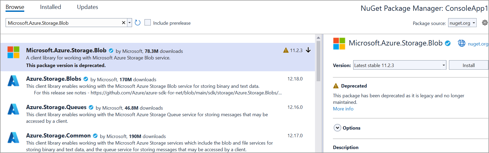

# Save PDF file to Azure Blob storage

To save a PDF file to Azure blob storage, you can follow the steps below

Step 1: Create a simple console application

Step 3: Install the [Syncfusion.Pdf.Net.Core ](https://www.nuget.org/packages/Syncfusion.Pdf.Net.Core) and [Microsoft.Azure.Storage.Blob](https://www.nuget.org/packages/Microsoft.Azure.Storage.Blob) NuGet packages as a reference to your project from the [NuGet.org](https://www.nuget.org/).

  

Step 4: Include the following namespaces in the Program.cs file.





using Syncfusion.Pdf;
using Syncfusion.Pdf.Graphics;
using Syncfusion.Drawing;
using Microsoft.Azure.Storage;
using Microsoft.Azure.Storage.Blob;





Step 5: Add the below code example to create a simple PDF and save in google drive.





using (PdfDocument doc = new PdfDocument())
{
    PdfPage page = doc.Pages.Add();
    PdfGraphics graphics = page.Graphics;
    PdfFont font = new PdfStandardFont(PdfFontFamily.Helvetica, 12);
    graphics.DrawString("Hello, World!", font, PdfBrushes.Black, new PointF(10, 10));
    MemoryStream stream = new MemoryStream();
    doc.Save(stream);
    File.WriteAllBytes("output.pdf", stream.ToArray());
}
CloudStorageAccount storageAccount = CloudStorageAccount.Parse(connectionString);
CloudBlobClient blobClient = storageAccount.CreateCloudBlobClient();
CloudBlobContainer container = blobClient.GetContainerReference(containerName);
container.CreateIfNotExists();

CloudBlockBlob blockBlob = container.GetBlockBlobReference(blobName);
using (var fileStream = System.IO.File.OpenRead("sample.pdf"))
{
    blockBlob.UploadFromStream(fileStream);
}





You can download a complete working sample from GitHub.
