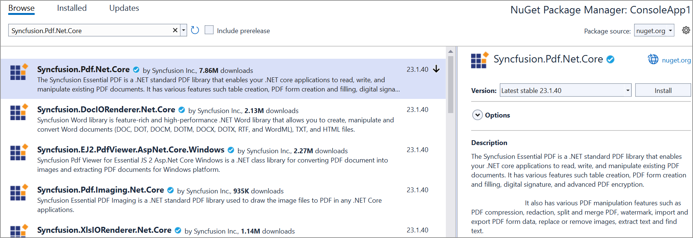
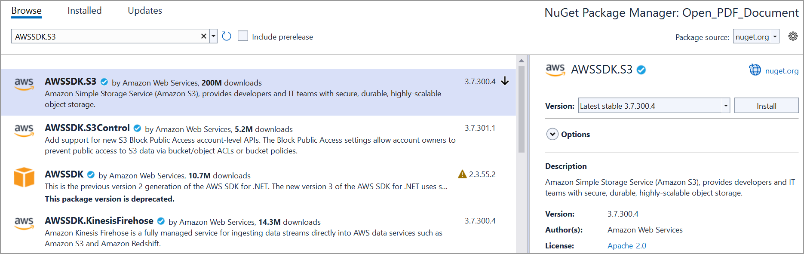

# Save PDF file to AWS S3

To save a PDF file to AWS S3, you can follow the steps below

Step 1: Create a simple console application

Step 2: Install the [Syncfusion.Pdf.Net.Core ](https://www.nuget.org/packages/Syncfusion.Pdf.Net.Core) and [AWSSDK.S3](https://www.nuget.org/packages/AWSSDK.S3) NuGet packages as a reference to your project from the [NuGet.org](https://www.nuget.org/).
  

  

Step 3: Include the following namespaces in the Program.cs file.





    using Syncfusion.Pdf.Graphics;
    using Syncfusion.Pdf;
    using Amazon.S3;
    using Syncfusion.Drawing;
    using Amazon.S3.Transfer;
    using Amazon;





Step 4: Add the below code example to create a simple PDF and save in AWS S3.





    // Create a new PDF document
    using (PdfDocument document = new PdfDocument())
    {
    // Add a page to the document
    PdfPage page = document.Pages.Add();

    // Create a PDF graphics for the page
    PdfGraphics graphics = page.Graphics;

    // Draw text on the page
    graphics.DrawString("Hello, Syncfusion PDF!", new PdfStandardFont(PdfFontFamily.Helvetica, 12), PdfBrushes.Black, new PointF(10, 10));

    // Save the PDF to a stream
    MemoryStream stream = new MemoryStream();
    document.Save(stream);

    // Save the stream to a file (optional)
    File.WriteAllBytes("HelloWorld.pdf", stream.ToArray());

    // Upload the PDF to AWS S3 (see next step)

    // Set your AWS credentials and region
    string accessKey = "YOUR_ACCESS_KEY";
    string secretKey = "YOUR_SECRET_KEY";
    RegionEndpoint region = RegionEndpoint.YOUR_REGION; // Change to your desired region

    // Create an Amazon S3 client
    using (var s3Client = new AmazonS3Client(accessKey, secretKey, region))
    {
        // Specify the bucket name and object key
        string bucketName = "your_bucket_name";
        string objectKey = "HelloWorld.pdf";

        // Upload the PDF to S3
        using (var transferUtility = new TransferUtility(s3Client))
        {
            transferUtility.Upload(stream, bucketName, objectKey);
        }
    }
}
    

    
   
    





You can download a complete working sample from GitHub.
