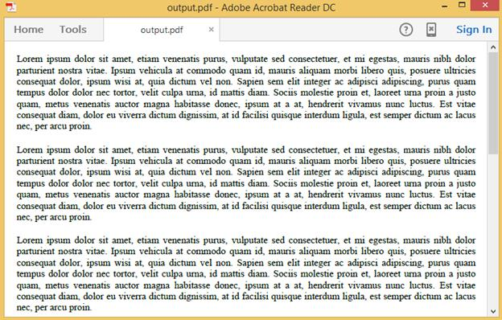
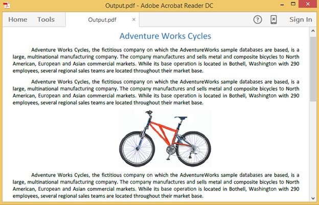
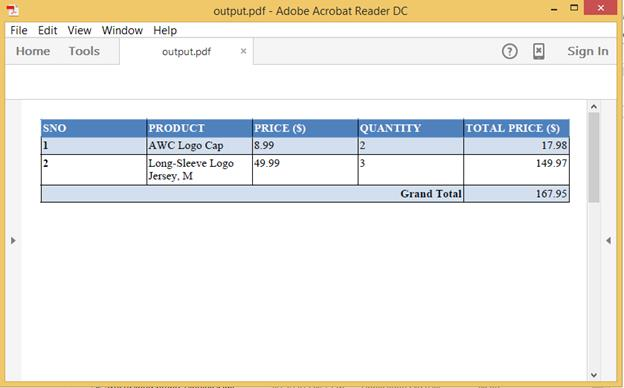

# Working with flow layout

PDF documents can be created using flow model instead of adding elements through absolute positioning. To create a PDF document in flow model, please add references to the following set of assemblies. 
<table>
<tr>
<th>
Assembly Name </th><th>
Description </th></tr>
<tr>
<td>
Syncfusion.Pdf.Base </td><td>
This assembly contains the core feature for creating, manipulating and saving PDF documents. </td></tr>
<tr>
<td>
Syncfusion.Compression.Base </td><td>
This assembly is required for compressing the internal contents of a PDF document. </td></tr>
<tr>
<td>
Syncfusion.DocIO.Base </td><td>
This assembly contains the core features needed for creating, reading, manipulating a Word document. </td></tr>
<tr>
<td>
Syncfusion.DocToPdfConverter.Base </td><td>
This assembly is required for converting word to PDF </td></tr>
</table>
Include the following namespaces in your .cs or .vb file as shown below.


using Syncfusion.Pdf;
using Syncfusion.DocIO.DLS;
using Syncfusion.DocToPDFConverter;



Imports Syncfusion.Pdf
Imports Syncfusion.DocIO.DLS
Imports Syncfusion.DocToPDFConverter




using Syncfusion.Pdf;
using Syncfusion.DocIO.DLS;
using Syncfusion.DocIORenderer;





using Syncfusion.Pdf;
using Syncfusion.DocIO.DLS;
using Syncfusion.DocIORenderer;





## Working with Text

You can create a PDF document with multiple paragraph text using flow model with the following code snippet.



//Creates a new Word document. 
WordDocument wordDocument = new WordDocument();
//Adds new section with single paragraph to the document.
wordDocument.EnsureMinimal();
wordDocument.LastSection.PageSetup.Margins.All = 15;
//Get Last paragraph of the document.
IWParagraph paragraph = wordDocument.LastParagraph;
//Create a custom style.
WParagraphStyle paragraphStyle = wordDocument.Styles.FindByName("Normal") as WParagraphStyle;
paragraphStyle.CharacterFormat.Font = new Font("Times New Roman", 12);
paragraphStyle.ParagraphFormat.HorizontalAlignment = HorizontalAlignment.Justify;
paragraphStyle.ParagraphFormat.AfterSpacing = 15f;
WSection section = wordDocument.LastSection;
string text = "Adventure Works Cycles, the fictitious company on which the AdventureWorks sample databases are based, is a large, multinational manufacturing company. The company manufactures and sells metal and composite bicycles to North American, European and Asian commercial markets. While its base operation is located in Washington with 290 employees, several regional sales teams are located throughout their market base.";
//Adds new text to the paragraph.
paragraph.AppendText(text);
//Adds first text to the paragraph.
paragraph = section.AddParagraph();
paragraph.AppendText(text);
//Second paragraph.
paragraph = section.AddParagraph();
paragraph.AppendText(text);
//Creates an instance of the DocToPDFConverter.
DocToPDFConverter converter = new DocToPDFConverter();
//Converts Word document into PDF document.
PdfDocument pdfDocument = converter.ConvertToPDF(wordDocument);
//Save and close the PDF document. 
pdfDocument.Save("Output.pdf");
pdfDocument.Close(true);
//Close the document.
wordDocument.Close();



'Creates a new Word document 
Dim wordDocument As New WordDocument()
'Adds new section with single paragraph to the document
wordDocument.EnsureMinimal()
wordDocument.LastSection.PageSetup.Margins.All = 15
'Get Last paragraph of the document
Dim paragraph As IWParagraph = wordDocument.LastParagraph
'Create a custom style
Dim paragraphStyle As WParagraphStyle = TryCast(wordDocument.Styles.FindByName("Normal"), WParagraphStyle)
paragraphStyle.CharacterFormat.Font = New Font("Times New Roman", 12)
paragraphStyle.ParagraphFormat.HorizontalAlignment = HorizontalAlignment.Justify
paragraphStyle.ParagraphFormat.AfterSpacing = 15F
Dim section As WSection = wordDocument.LastSection
Dim text As String = "Adventure Works Cycles, the fictitious company on which the AdventureWorks sample databases are based, is a large, multinational manufacturing company. The company manufactures and sells metal and composite bicycles to North American, European and Asian commercial markets. While its base operation is located in Washington with 290 employees, several regional sales teams are located throughout their market base."
'Adds new text to the paragraph
paragraph.AppendText(text)
'Adds first text to the paragraph
paragraph = section.AddParagraph()
paragraph.AppendText(text)
'Second paragraph
paragraph = section.AddParagraph()
paragraph.AppendText(text)
'Creates an instance of the DocToPDFConverter
Dim converter As New DocToPDFConverter()
'Converts Word document into PDF document
Dim pdfDocument As PdfDocument = converter.ConvertToPDF(wordDocument)
'Save and close the PDF document 
pdfDocument.Save("Output.pdf")
pdfDocument.Close(True)
'Close the document
wordDocument.Close()




//Creates a new Word document. 
WordDocument wordDocument = new WordDocument();
//Adds new section with single paragraph to the document.
wordDocument.EnsureMinimal();
wordDocument.LastSection.PageSetup.Margins.All = 15;
//Get Last paragraph of the document.
IWParagraph paragraph = wordDocument.LastParagraph;
//Create a custom style.
WParagraphStyle paragraphStyle = wordDocument.Styles.FindByName("Normal") as WParagraphStyle;
paragraphStyle.CharacterFormat.Font = new Font("Times New Roman", 12);
paragraphStyle.ParagraphFormat.HorizontalAlignment = HorizontalAlignment.Justify;
paragraphStyle.ParagraphFormat.AfterSpacing = 15f;
WSection section = wordDocument.LastSection;
string text = "Adventure Works Cycles, the fictitious company on which the AdventureWorks sample databases are based, is a large, multinational manufacturing company. The company manufactures and sells metal and composite bicycles to North American, European and Asian commercial markets. While its base operation is located in Washington with 290 employees, several regional sales teams are located throughout their market base.";
//Adds new text to the paragraph.
paragraph.AppendText(text);
//Adds first text to the paragraph.
paragraph = section.AddParagraph();
paragraph.AppendText(text);
//Second paragraph.
paragraph = section.AddParagraph();
paragraph.AppendText(text);
//Instantiation of DocIORenderer for Word to PDF conversion.
DocIORenderer render = new DocIORenderer();
//Converts Word document into PDF document.
PdfDocument pdfDocument = render.ConvertToPDF(wordDocument);
//Releases all resources used by the Word document and DocIO Renderer objects.
render.Dispose();
wordDocument.Dispose();
//Save the document into stream.
MemoryStream stream = new MemoryStream();
pdfDocument.Save(stream);
stream.Position = 0;
//Close the documents.
pdfDocument.Close(true);
//Defining the ContentType for pdf file.
string contentType = "application/pdf";
//Define the file name.
string fileName = " Output.pdf";
//Creates a FileContentResult object by using the file contents, content type, and file name.
return File(stream, contentType, fileName);





//Creates a new Word document. 
WordDocument wordDocument = new WordDocument();
//Adds new section with single paragraph to the document.
wordDocument.EnsureMinimal();
wordDocument.LastSection.PageSetup.Margins.All = 15;
//Get Last paragraph of the document.
IWParagraph paragraph = wordDocument.LastParagraph;
//Create a custom style.
WParagraphStyle paragraphStyle = wordDocument.Styles.FindByName("Normal") as WParagraphStyle;
paragraphStyle.CharacterFormat.Font = new Syncfusion.Drawing.Font("Times New Roman", 12);
paragraphStyle.ParagraphFormat.HorizontalAlignment = HorizontalAlignment.Justify;
paragraphStyle.ParagraphFormat.AfterSpacing = 15f;
WSection section = wordDocument.LastSection;
string text = "Adventure Works Cycles, the fictitious company on which the AdventureWorks sample databases are based, is a large, multinational manufacturing company. The company manufactures and sells metal and composite bicycles to North American, European and Asian commercial markets. While its base operation is located in Washington with 290 employees, several regional sales teams are located throughout their market base.";
//Adds new text to the paragraph.
paragraph.AppendText(text);
//Adds first text to the paragraph.
paragraph = section.AddParagraph();
paragraph.AppendText(text);
//Second paragraph.
paragraph = section.AddParagraph();
paragraph.AppendText(text);
//Instantiation of DocIORenderer for Word to PDF conversion.
DocIORenderer render = new DocIORenderer();
//Converts Word document into PDF document.
PdfDocument pdfDocument = render.ConvertToPDF(wordDocument);
//Releases all resources used by the Word document and DocIO Renderer objects.
render.Dispose();
wordDocument.Dispose();
//Save the document into memory stream.
MemoryStream stream = new MemoryStream();
pdfDocument.Save(stream);
stream.Position = 0;
//Close the document. 
pdfDocument.Close();
//Save the stream into pdf file.
//The operation in Save under Xamarin varies between Windows Phone, Android and iOS platforms. Please refer PDF/Xamarin section for respective code samples.
if (Device.OS == TargetPlatform.WinPhone || Device.OS == TargetPlatform.Windows)
{
    Xamarin.Forms.DependencyService.Get<ISaveWindowsPhone>().Save("Output.pdf", "application/pdf", stream);
}
else
{
    Xamarin.Forms.DependencyService.Get<ISave>().Save("Output.pdf", "application/pdf", stream);
}





The following image shows the PDF document with multiple paragraphs created using the flow model.

## Working with text and images

You can create PDF document with text and image using the following code snippet.



//A new document is created.
WordDocument document = new WordDocument();
//Adding a new section to the document.
WSection section = document.AddSection() as WSection;
//Set Margin of the section.
section.PageSetup.Margins.All = 20;

//Create Paragraph styles.
WParagraphStyle style = document.AddParagraphStyle("Normal") as WParagraphStyle;
style.CharacterFormat.FontName = "Calibri";
style.ParagraphFormat.HorizontalAlignment = Syncfusion.DocIO.DLS.HorizontalAlignment.Justify;
style.CharacterFormat.FontSize = 11f;
style.ParagraphFormat.AfterSpacing = 8;
style.ParagraphFormat.FirstLineIndent = 36f;
style = document.AddParagraphStyle("Heading 1") as WParagraphStyle;
style.ApplyBaseStyle("Normal");
style.CharacterFormat.FontName = "Calibri Light";
style.CharacterFormat.FontSize = 16f;
style.CharacterFormat.TextColor = Color.FromArgb(46, 116, 181);
//Appends paragraph.
IWParagraph paragraph = section.AddParagraph();
paragraph.ApplyStyle("Heading 1");
paragraph.ParagraphFormat.HorizontalAlignment = Syncfusion.DocIO.DLS.HorizontalAlignment.Center;
paragraph.ParagraphFormat.AfterSpacing = 10;
WTextRange textRange = paragraph.AppendText("Adventure Works Cycles") as WTextRange;
textRange.CharacterFormat.FontSize = 18f;
textRange.CharacterFormat.FontName = "Calibri";
string text =
"Adventure Works Cycles, the fictitious company on which the AdventureWorks sample databases are based, is a large, multinational manufacturing company. The company manufactures and sells metal and composite bicycles to North American, European and Asian commercial markets. While its base operation is located in Washington with 290 employees, several regional sales teams are located throughout their market base.";
//Appends paragraph.
paragraph = section.AddParagraph();
textRange = paragraph.AppendText(text) as WTextRange;
paragraph = section.AddParagraph();
textRange = paragraph.AppendText(text) as WTextRange;
//Add image to the paragraph.
paragraph = section.AddParagraph();
paragraph.ParagraphFormat.HorizontalAlignment = Syncfusion.DocIO.DLS.HorizontalAlignment.Center;
paragraph.AppendPicture(Image.FromFile("Mountain-200.jpg"));
//Appends paragraph.
paragraph = section.AddParagraph();
textRange = paragraph.AppendText(text) as WTextRange;
//Creates an instance of the DocToPDFConverter.
DocToPDFConverter converter = new DocToPDFConverter();
//Converts Word document into PDF document.
PdfDocument pdfDocument = converter.ConvertToPDF(document);

//Saves the PDF file. 
pdfDocument.Save("Sample.pdf");
pdfDocument.Close(true);
document.Close();



'A new document is created
Dim document As New WordDocument()
'Adding a new section to the document
Dim section As WSection = TryCast(document.AddSection(), WSection)
'Set Margin of the section
section.PageSetup.Margins.All = 20

'Create Paragraph styles
Dim style As WParagraphStyle = TryCast(document.AddParagraphStyle("Normal"), WParagraphStyle)
style.CharacterFormat.FontName = "Calibri"
style.ParagraphFormat.HorizontalAlignment = Syncfusion.DocIO.DLS.HorizontalAlignment.Justify
style.CharacterFormat.FontSize = 11F
style.ParagraphFormat.AfterSpacing = 8
style.ParagraphFormat.FirstLineIndent = 36F
style = TryCast(document.AddParagraphStyle("Heading 1"), WParagraphStyle)
style.ApplyBaseStyle("Normal")
style.CharacterFormat.FontName = "Calibri Light"
style.CharacterFormat.FontSize = 16F
style.CharacterFormat.TextColor = Color.FromArgb(46, 116, 181)
'Appends paragraph
Dim paragraph As IWParagraph = section.AddParagraph()
paragraph.ApplyStyle("Heading 1")
paragraph.ParagraphFormat.HorizontalAlignment = Syncfusion.DocIO.DLS.HorizontalAlignment.Center
paragraph.ParagraphFormat.AfterSpacing = 10
Dim textRange As WTextRange = TryCast(paragraph.AppendText("Adventure Works Cycles"), WTextRange)
textRange.CharacterFormat.FontSize = 18F
textRange.CharacterFormat.FontName = "Calibri"
Dim text As String = "Adventure Works Cycles, the fictitious company on which the AdventureWorks sample databases are based, is a large, multinational manufacturing company. The company manufactures and sells metal and composite bicycles to North American, European and Asian commercial markets. While its base operation is located in Washington with 290 employees, several regional sales teams are located throughout their market base."
'Appends paragraph
paragraph = section.AddParagraph()
textRange = TryCast(paragraph.AppendText(text), WTextRange)
paragraph = section.AddParagraph()
textRange = TryCast(paragraph.AppendText(text), WTextRange)
'Add image to the paragraph
paragraph = section.AddParagraph()
paragraph.ParagraphFormat.HorizontalAlignment = Syncfusion.DocIO.DLS.HorizontalAlignment.Center
paragraph.AppendPicture(Image.FromFile("Mountain-200.jpg"))
'Appends paragraph
paragraph = section.AddParagraph()
textRange = TryCast(paragraph.AppendText(text), WTextRange)
'Creates an instance of the DocToPDFConverter
Dim converter As New DocToPDFConverter()
'Converts Word document into PDF document
Dim pdfDocument As PdfDocument = converter.ConvertToPDF(document)

'Saves the PDF file 
pdfDocument.Save("Sample.pdf")
pdfDocument.Close(True)
document.Close()




//A new document is created.
WordDocument document = new WordDocument();
//Adding a new section to the document.
WSection section = document.AddSection() as WSection;
//Set Margin of the section.
section.PageSetup.Margins.All = 20;

//Create Paragraph styles.
WParagraphStyle style = document.AddParagraphStyle("Normal") as WParagraphStyle;
style.CharacterFormat.FontName = "Calibri";
style.ParagraphFormat.HorizontalAlignment = Syncfusion.DocIO.DLS.HorizontalAlignment.Justify;
style.CharacterFormat.FontSize = 11f;
style.ParagraphFormat.AfterSpacing = 8;
style.ParagraphFormat.FirstLineIndent = 36f;
style = document.AddParagraphStyle("Heading 1") as WParagraphStyle;
style.ApplyBaseStyle("Normal");
style.CharacterFormat.FontName = "Calibri Light";
style.CharacterFormat.FontSize = 16f;
style.CharacterFormat.TextColor = Color.FromArgb(46, 116, 181);
//Appends paragraph.
IWParagraph paragraph = section.AddParagraph();
paragraph.ApplyStyle("Heading 1");
paragraph.ParagraphFormat.HorizontalAlignment = Syncfusion.DocIO.DLS.HorizontalAlignment.Center;
paragraph.ParagraphFormat.AfterSpacing = 10;
WTextRange textRange = paragraph.AppendText("Adventure Works Cycles") as WTextRange;
textRange.CharacterFormat.FontSize = 18f;
textRange.CharacterFormat.FontName = "Calibri";
string text =
"Adventure Works Cycles, the fictitious company on which the AdventureWorks sample databases are based, is a large, multinational manufacturing company. The company manufactures and sells metal and composite bicycles to North American, European and Asian commercial markets. While its base operation is located in Washington with 290 employees, several regional sales teams are located throughout their market base.";
//Appends paragraph.
paragraph = section.AddParagraph();
textRange = paragraph.AppendText(text) as WTextRange;
paragraph = section.AddParagraph();
textRange = paragraph.AppendText(text) as WTextRange;
//Add image to the paragraph.
paragraph = section.AddParagraph();
paragraph.ParagraphFormat.HorizontalAlignment = Syncfusion.DocIO.DLS.HorizontalAlignment.Center;
FileStream imageStream = new FileStream(@"Mountain-200.jpg", FileMode.Open, FileAccess.Read);
paragraph.AppendPicture(imageStream);
//Appends paragraph.
paragraph = section.AddParagraph();
textRange = paragraph.AppendText(text) as WTextRange;
//Instantiation of DocIORenderer for Word to PDF conversion
DocIORenderer render = new DocIORenderer();
//Converts Word document into PDF document.
PdfDocument pdfDocument = render.ConvertToPDF(document);
//Releases all resources used by the Word document and DocIO Renderer objects.
render.Dispose();
document.Dispose();

//Save the document into stream.
MemoryStream stream = new MemoryStream();
pdfDocument.Save(stream);
stream.Position = 0;
//Close the documents.
pdfDocument.Close(true);
//Defining the ContentType for pdf file.
string contentType = "application/pdf";
//Define the file name.
string fileName = " Output.pdf";
//Creates a FileContentResult object by using the file contents, content type, and file name.
return File(stream, contentType, fileName);





//A new document is created.
WordDocument document = new WordDocument();
//Adding a new section to the document.
WSection section = document.AddSection() as WSection;
//Set Margin of the section.
section.PageSetup.Margins.All = 20;

//Create Paragraph styles.
WParagraphStyle style = document.AddParagraphStyle("Normal") as WParagraphStyle;
style.CharacterFormat.FontName = "Calibri";
style.ParagraphFormat.HorizontalAlignment = Syncfusion.DocIO.DLS.HorizontalAlignment.Justify;
style.CharacterFormat.FontSize = 11f;
style.ParagraphFormat.AfterSpacing = 8;
style.ParagraphFormat.FirstLineIndent = 36f;
style = document.AddParagraphStyle("Heading 1") as WParagraphStyle;
style.ApplyBaseStyle("Normal");
style.CharacterFormat.FontName = "Calibri Light";
style.CharacterFormat.FontSize = 16f;
style.CharacterFormat.TextColor = Syncfusion.Drawing.Color.FromArgb(46, 116, 181);
//Appends paragraph.
IWParagraph paragraph = section.AddParagraph();
paragraph.ApplyStyle("Heading 1");
paragraph.ParagraphFormat.HorizontalAlignment = Syncfusion.DocIO.DLS.HorizontalAlignment.Center;
paragraph.ParagraphFormat.AfterSpacing = 10;
WTextRange textRange = paragraph.AppendText("Adventure Works Cycles") as WTextRange;
textRange.CharacterFormat.FontSize = 18f;
textRange.CharacterFormat.FontName = "Calibri";
string text =
"Adventure Works Cycles, the fictitious company on which the AdventureWorks sample databases are based, is a large, multinational manufacturing company. The company manufactures and sells metal and composite bicycles to North American, European and Asian commercial markets. While its base operation is located in Washington with 290 employees, several regional sales teams are located throughout their market base.";
//Appends paragraph.
paragraph = section.AddParagraph();
textRange = paragraph.AppendText(text) as WTextRange;
paragraph = section.AddParagraph();
textRange = paragraph.AppendText(text) as WTextRange;
//Add image to the paragraph.
paragraph = section.AddParagraph();
paragraph.ParagraphFormat.HorizontalAlignment = Syncfusion.DocIO.DLS.HorizontalAlignment.Center;
Stream imageStream = typeof(App).GetTypeInfo().Assembly.GetManifestResourceStream("Sample.Assets.Mountain-200.jpg");
paragraph.AppendPicture(imageStream);
//Appends paragraph.
paragraph = section.AddParagraph();
textRange = paragraph.AppendText(text) as WTextRange;
//Instantiation of DocIORenderer for Word to PDF conversion.
DocIORenderer render = new DocIORenderer();
//Converts Word document into PDF document.
PdfDocument pdfDocument = render.ConvertToPDF(document);
//Releases all resources used by the Word document and DocIO Renderer objects.
render.Dispose();
document.Dispose();

//Save the document into memory stream.
MemoryStream stream = new MemoryStream();
pdfDocument.Save(stream);
stream.Position = 0;
//Close the document. 
pdfDocument.Close();
//Save the stream into pdf file.
//The operation in Save under Xamarin varies between Windows Phone, Android and iOS platforms. Please refer PDF/Xamarin section for respective code samples.
if (Device.OS == TargetPlatform.WinPhone || Device.OS == TargetPlatform.Windows)
{
    Xamarin.Forms.DependencyService.Get<ISaveWindowsPhone>().Save("Output.pdf", "application/pdf", stream);
}
else
{
    Xamarin.Forms.DependencyService.Get<ISave>().Save("Output.pdf", "application/pdf", stream);
}




The following image shows the PDF document with multiple paragraphs and image created using the flow model.

## Working with table

You can create PDF document with simple table using the following code snippet.



//Creates a new Word document. 
WordDocument wordDocument = new WordDocument();
//Adding a new section to the document.
WSection section = wordDocument.AddSection() as WSection;
//Set Margin of the section.
section.PageSetup.Margins.All = 20;

//Adding a new Table.
WTable table = section.AddTable() as WTable;
table.TableFormat.Paddings.All = 2;
table.TableFormat.Borders.BorderType = Syncfusion.DocIO.DLS.BorderStyle.Single;
//Inserting rows to the table.
table.ResetCells(4, 5);
//Appends paragraph with header.
IWParagraph paragraph = table[0, 0].AddParagraph();
paragraph.AppendText("SNO");
paragraph = table[0, 1].AddParagraph();
paragraph.AppendText("PRODUCT");
paragraph = table[0, 2].AddParagraph();
paragraph.AppendText("PRICE ($)");
paragraph = table[0, 3].AddParagraph();
paragraph.AppendText("QUANTITY");
paragraph = table[0, 4].AddParagraph();
paragraph.AppendText("TOTAL PRICE ($)");
//Add the first item.
paragraph = table[1, 0].AddParagraph();
paragraph.AppendText("1");
paragraph = table[1, 1].AddParagraph();
paragraph.AppendText("AWC Logo Cap");
paragraph = table[1, 2].AddParagraph();
paragraph.AppendText("8.99");
paragraph = table[1, 3].AddParagraph();
paragraph.AppendText("2");
paragraph = table[1, 4].AddParagraph();
paragraph.ParagraphFormat.HorizontalAlignment = HorizontalAlignment.Right;
paragraph.AppendText("17.98");
//Add the second item.
paragraph = table[2, 0].AddParagraph();
paragraph.AppendText("2");
paragraph = table[2, 1].AddParagraph();
paragraph.AppendText("Long-Sleeve Logo Jersey, M");
paragraph = table[2, 2].AddParagraph();
paragraph.AppendText("49.99");
paragraph = table[2, 3].AddParagraph();
paragraph.AppendText("3");
paragraph = table[2, 4].AddParagraph();
paragraph.ParagraphFormat.HorizontalAlignment = HorizontalAlignment.Right;
paragraph.AppendText("149.97");
// Table formatting with cell merging.
table[3, 0].CellFormat.HorizontalMerge = CellMerge.Start;
table[3, 1].CellFormat.HorizontalMerge = CellMerge.Continue;
table[3, 2].CellFormat.HorizontalMerge = CellMerge.Continue;
table[3, 3].CellFormat.HorizontalMerge = CellMerge.Continue;
paragraph = table[3, 0].AddParagraph();
paragraph.ParagraphFormat.HorizontalAlignment = HorizontalAlignment.Right;
paragraph.AppendText("Grand Total");
paragraph = table[3, 4].AddParagraph();
paragraph.ParagraphFormat.HorizontalAlignment = HorizontalAlignment.Right;
paragraph.AppendText("167.95");
//Apply built-in table style to the table.
table.ApplyStyle(BuiltinTableStyle.MediumShading1Accent1);
//Creates an instance of the DocToPDFConverter.
DocToPDFConverter converter = new DocToPDFConverter();
//Converts Word document into PDF document.
PdfDocument pdfDocument = converter.ConvertToPDF(wordDocument);

//Save and close the PDF document. 
pdfDocument.Save("Output.pdf");
pdfDocument.Close(true);
//Close the document.
wordDocument.Close();



'Creates a new Word document 
Dim wordDocument As New WordDocument()
'Adding a new section to the document
Dim section As WSection = TryCast(wordDocument.AddSection(), WSection)
'Set Margin of the section
section.PageSetup.Margins.All = 20

'Adding a new Table
Dim table As WTable = TryCast(section.AddTable(), WTable)
table.TableFormat.Paddings.All = 2
table.TableFormat.Borders.BorderType = Syncfusion.DocIO.DLS.BorderStyle.[Single]
'Inserting rows to the table
table.ResetCells(4, 5)
'Appends paragraph with header
Dim paragraph As IWParagraph = table(0, 0).AddParagraph()
paragraph.AppendText("SNO")
paragraph = table(0, 1).AddParagraph()
paragraph.AppendText("PRODUCT")
paragraph = table(0, 2).AddParagraph()
paragraph.AppendText("PRICE ($)")
paragraph = table(0, 3).AddParagraph()
paragraph.AppendText("QUANTITY")
paragraph = table(0, 4).AddParagraph()
paragraph.AppendText("TOTAL PRICE ($)")
'Add the first item
paragraph = table(1, 0).AddParagraph()
paragraph.AppendText("1")
paragraph = table(1, 1).AddParagraph()
paragraph.AppendText("AWC Logo Cap")
paragraph = table(1, 2).AddParagraph()
paragraph.AppendText("8.99")
paragraph = table(1, 3).AddParagraph()
paragraph.AppendText("2")
paragraph = table(1, 4).AddParagraph()
paragraph.ParagraphFormat.HorizontalAlignment = HorizontalAlignment.Right
paragraph.AppendText("17.98")
'Add the second item
paragraph = table(2, 0).AddParagraph()
paragraph.AppendText("2")
paragraph = table(2, 1).AddParagraph()
paragraph.AppendText("Long-Sleeve Logo Jersey, M")
paragraph = table(2, 2).AddParagraph()
paragraph.AppendText("49.99")
paragraph = table(2, 3).AddParagraph()
paragraph.AppendText("3")
paragraph = table(2, 4).AddParagraph()
paragraph.ParagraphFormat.HorizontalAlignment = HorizontalAlignment.Right
paragraph.AppendText("149.97")
'Table formatting with cell merging
table(3, 0).CellFormat.HorizontalMerge = CellMerge.Start
table(3, 1).CellFormat.HorizontalMerge = CellMerge.[Continue]
table(3, 2).CellFormat.HorizontalMerge = CellMerge.[Continue]
table(3, 3).CellFormat.HorizontalMerge = CellMerge.[Continue]
paragraph = table(3, 0).AddParagraph()
paragraph.ParagraphFormat.HorizontalAlignment = HorizontalAlignment.Right
paragraph.AppendText("Grand Total")
paragraph = table(3, 4).AddParagraph()
paragraph.ParagraphFormat.HorizontalAlignment = HorizontalAlignment.Right
paragraph.AppendText("167.95")
'Apply built-in table style to the table
table.ApplyStyle(BuiltinTableStyle.MediumShading1Accent1)
'Creates an instance of the DocToPDFConverter
Dim converter As New DocToPDFConverter()
'Converts Word document into PDF document
Dim pdfDocument As PdfDocument = converter.ConvertToPDF(wordDocument)

'Save and close the PDF document 
pdfDocument.Save("Output.pdf")
pdfDocument.Close(True)
'Close the document
wordDocument.Close()




//Creates a new Word document. 
WordDocument wordDocument = new WordDocument();
//Adding a new section to the document.
WSection section = wordDocument.AddSection() as WSection;
//Set Margin of the section.
section.PageSetup.Margins.All = 20;

//Adding a new Table.
WTable table = section.AddTable() as WTable;
table.TableFormat.Paddings.All = 2;
table.TableFormat.Borders.BorderType = Syncfusion.DocIO.DLS.BorderStyle.Single;
//Inserting rows to the table.
table.ResetCells(4, 5);
//Appends paragraph with header.
IWParagraph paragraph = table[0, 0].AddParagraph();
paragraph.AppendText("SNO");
paragraph = table[0, 1].AddParagraph();
paragraph.AppendText("PRODUCT");
paragraph = table[0, 2].AddParagraph();
paragraph.AppendText("PRICE ($)");
paragraph = table[0, 3].AddParagraph();
paragraph.AppendText("QUANTITY");
paragraph = table[0, 4].AddParagraph();
paragraph.AppendText("TOTAL PRICE ($)");
//Add the first item.
paragraph = table[1, 0].AddParagraph();
paragraph.AppendText("1");
paragraph = table[1, 1].AddParagraph();
paragraph.AppendText("AWC Logo Cap");
paragraph = table[1, 2].AddParagraph();
paragraph.AppendText("8.99");
paragraph = table[1, 3].AddParagraph();
paragraph.AppendText("2");
paragraph = table[1, 4].AddParagraph();
paragraph.ParagraphFormat.HorizontalAlignment = HorizontalAlignment.Right;
paragraph.AppendText("17.98");
//Add the second item.
paragraph = table[2, 0].AddParagraph();
paragraph.AppendText("2");
paragraph = table[2, 1].AddParagraph();
paragraph.AppendText("Long-Sleeve Logo Jersey, M");
paragraph = table[2, 2].AddParagraph();
paragraph.AppendText("49.99");
paragraph = table[2, 3].AddParagraph();
paragraph.AppendText("3");
paragraph = table[2, 4].AddParagraph();
paragraph.ParagraphFormat.HorizontalAlignment = HorizontalAlignment.Right;
paragraph.AppendText("149.97");
//Table formatting with cell merging.
table[3, 0].CellFormat.HorizontalMerge = CellMerge.Start;
table[3, 1].CellFormat.HorizontalMerge = CellMerge.Continue;
table[3, 2].CellFormat.HorizontalMerge = CellMerge.Continue;
table[3, 3].CellFormat.HorizontalMerge = CellMerge.Continue;
paragraph = table[3, 0].AddParagraph();
paragraph.ParagraphFormat.HorizontalAlignment = HorizontalAlignment.Right;
paragraph.AppendText("Grand Total");
paragraph = table[3, 4].AddParagraph();
paragraph.ParagraphFormat.HorizontalAlignment = HorizontalAlignment.Right;
paragraph.AppendText("167.95");
//Apply built-in table style to the table.
table.ApplyStyle(BuiltinTableStyle.MediumShading1Accent1);
//Instantiation of DocIORenderer for Word to PDF conversion.
DocIORenderer render = new DocIORenderer();
//Converts Word document into PDF document.
PdfDocument pdfDocument = render.ConvertToPDF(wordDocument);
//Releases all resources used by the Word document and DocIO Renderer objects.
render.Dispose();
wordDocument.Dispose();

//Save the document into stream.
MemoryStream stream = new MemoryStream();
pdfDocument.Save(stream);
stream.Position = 0;
//Close the documents.
pdfDocument.Close(true);
//Defining the ContentType for pdf file.
string contentType = "application/pdf";
//Define the file name.
string fileName = " Output.pdf";
//Creates a FileContentResult object by using the file contents, content type, and file name.
return File(stream, contentType, fileName);





//Creates a new Word document.
WordDocument wordDocument = new WordDocument();
//Adding a new section to the document.
WSection section = wordDocument.AddSection() as WSection;
//Set Margin of the section.
section.PageSetup.Margins.All = 20;

//Adding a new Table.
WTable table = section.AddTable() as WTable;
table.TableFormat.Paddings.All = 2;
table.TableFormat.Borders.BorderType = Syncfusion.DocIO.DLS.BorderStyle.Single;
//Inserting rows to the table.
table.ResetCells(4, 5);
//Appends paragraph with header.
IWParagraph paragraph = table[0, 0].AddParagraph();
paragraph.AppendText("SNO");
paragraph = table[0, 1].AddParagraph();
paragraph.AppendText("PRODUCT");
paragraph = table[0, 2].AddParagraph();
paragraph.AppendText("PRICE ($)");
paragraph = table[0, 3].AddParagraph();
paragraph.AppendText("QUANTITY");
paragraph = table[0, 4].AddParagraph();
paragraph.AppendText("TOTAL PRICE ($)");
//Add the first item.
paragraph = table[1, 0].AddParagraph();
paragraph.AppendText("1");
paragraph = table[1, 1].AddParagraph();
paragraph.AppendText("AWC Logo Cap");
paragraph = table[1, 2].AddParagraph();
paragraph.AppendText("8.99");
paragraph = table[1, 3].AddParagraph();
paragraph.AppendText("2");
paragraph = table[1, 4].AddParagraph();
paragraph.ParagraphFormat.HorizontalAlignment = HorizontalAlignment.Right;
paragraph.AppendText("17.98");
//Add the second item.
paragraph = table[2, 0].AddParagraph();
paragraph.AppendText("2");
paragraph = table[2, 1].AddParagraph();
paragraph.AppendText("Long-Sleeve Logo Jersey, M");
paragraph = table[2, 2].AddParagraph();
paragraph.AppendText("49.99");
paragraph = table[2, 3].AddParagraph();
paragraph.AppendText("3");
paragraph = table[2, 4].AddParagraph();
paragraph.ParagraphFormat.HorizontalAlignment = HorizontalAlignment.Right;
paragraph.AppendText("149.97");
//Table formatting with cell merging.
table[3, 0].CellFormat.HorizontalMerge = CellMerge.Start;
table[3, 1].CellFormat.HorizontalMerge = CellMerge.Continue;
table[3, 2].CellFormat.HorizontalMerge = CellMerge.Continue;
table[3, 3].CellFormat.HorizontalMerge = CellMerge.Continue;
paragraph = table[3, 0].AddParagraph();
paragraph.ParagraphFormat.HorizontalAlignment = HorizontalAlignment.Right;
paragraph.AppendText("Grand Total");
paragraph = table[3, 4].AddParagraph();
paragraph.ParagraphFormat.HorizontalAlignment = HorizontalAlignment.Right;
paragraph.AppendText("167.95");
//Apply built-in table style to the table.
table.ApplyStyle(BuiltinTableStyle.MediumShading1Accent1);
//Instantiation of DocIORenderer for Word to PDF conversion.
DocIORenderer render = new DocIORenderer();
//Converts Word document into PDF document.
PdfDocument pdfDocument = render.ConvertToPDF(wordDocument);
//Releases all resources used by the Word document and DocIO Renderer objects.
render.Dispose();
wordDocument.Dispose();

//Save the document into memory stream.
MemoryStream stream = new MemoryStream();
pdfDocument.Save(stream);
stream.Position = 0;
//Close the document. 
pdfDocument.Close();
//Save the stream into pdf file.
//The operation in Save under Xamarin varies between Windows Phone, Android and iOS platforms. Please refer PDF/Xamarin section for respective code samples.
if (Device.OS == TargetPlatform.WinPhone || Device.OS == TargetPlatform.Windows)
{
    Xamarin.Forms.DependencyService.Get<ISaveWindowsPhone>().Save("Output.pdf", "application/pdf", stream);
}
else
{
    Xamarin.Forms.DependencyService.Get<ISave>().Save("Output.pdf", "application/pdf", stream);
}





The following image shows the PDF document with simple table created using the flow model.

## Flow model using PdfLayoutResult

Syncfusion Essential PDF supports creating a PDF document with flow model by maintaining the position of previously drawn element in [PdfLayoutResult](https://help.syncfusion.com/cr/file-formats/Syncfusion.Pdf.Graphics.PdfLayoutResult.html).

The following code snippet explains how to create a PDF document with image, paragraph text, header text, a line below the header text, and a table using flow model.



//Create a new PDF document.
PdfDocument document = new PdfDocument();
//Add a page to the document.
PdfPage page = document.Pages.Add();
//Create PDF graphics for the page.
PdfGraphics graphics = page.Graphics;

//Load an image into PdfImage.
PdfImage image = PdfImage.FromFile("AdventureCycle.jpg");
//Draw image on the page in the specified location and with required size.
graphics.DrawImage(image, new RectangleF(150, 30, 200, 100));
//Initialize a standard font.
PdfFont standardFont = new PdfStandardFont(PdfFontFamily.Helvetica, 12);
//Load the paragraph text into PdfTextElement with initialized standard font.
PdfTextElement textElement = new PdfTextElement("Adventure Works Cycles, the fictitious company on which the AdventureWorks sample databases are based," +
                    " is a large, multinational manufacturing company. The company manufactures and sells metal and composite bicycles to North American, " +
                    "European and Asian commercial markets. While its base operation is located in Bothell, Washington with 290 employees, several regional" +
                    " sales teams are located throughout their market base.", standardFont);
//Draw the paragraph text on page and maintain the position in PdfLayoutResult.
PdfLayoutResult layoutResult = textElement.Draw(page, new RectangleF(0, 150, page.GetClientSize().Width, page.GetClientSize().Height));
//Assign header text to PdfTextElement.
textElement.Text = "Top 5 sales stores";
//Assign standard font to PdfTextElement.
textElement.Font = new PdfStandardFont(PdfFontFamily.Helvetica, 14, PdfFontStyle.Bold);
//Draw the header text on page, below the paragraph text with a height gap of 20 and maintain the position in PdfLayoutResult.
layoutResult = textElement.Draw(page, new PointF(0, layoutResult.Bounds.Bottom + 20));
//Initialize PdfLine with start point and end point for drawing the line.
PdfLine line = new PdfLine(new PointF(0, 0), new PointF(page.GetClientSize().Width, 0))
{
    Pen = PdfPens.DarkGray
};
//Draw the line on page, below the header text with a height gap of 5 and maintain the position in PdfLayoutResult.
layoutResult = line.Draw(page, new PointF(0, layoutResult.Bounds.Bottom + 5));
//Initialize PdfGrid for drawing the table.
PdfGrid grid = new PdfGrid();
//Create a DataTable.
DataTable dataTable = new DataTable();
//Add columns to the DataTable.
dataTable.Columns.Add("ID");
dataTable.Columns.Add("Name");
dataTable.Columns.Add("Salary");
//Add rows to the DataTable.
dataTable.Rows.Add(new object[] { "E01", "Clay", "$10,000" });
dataTable.Rows.Add(new object[] { "E02", "Thomas", "$10,500" });
dataTable.Rows.Add(new object[] { "E03", "Simon", "$12,000" });
//Assign the DataTable as data source to grid.
grid.DataSource = dataTable;
//Set the grid cell padding.
grid.Style.CellPadding.All = 5;
//Apply built-in table style to the grid.
grid.ApplyBuiltinStyle(PdfGridBuiltinStyle.GridTable5DarkAccent5);
//Draw the table in page, below the line with a height gap of 20.
grid.Draw(page, new PointF(0, layoutResult.Bounds.Bottom + 20));

//Save the PDF document.
document.Save("Output.pdf");
//Close the instance of PdfDocument.
document.Close(true);



'Create a new PDF document
Dim document As PdfDocument = New PdfDocument
'Add a page to the document
Dim page As PdfPage = document.Pages.Add
'Create PDF graphics for the page
Dim graphics As PdfGraphics = page.Graphics

'Load an image into PdfImage
Dim image As PdfImage = PdfImage.FromFile("AdventureCycle.jpg")
'Draw image on the page in the specified location and with required size
graphics.DrawImage(image, New RectangleF(150, 30, 200, 100))
'Initialize a standard font
Dim standardFont As PdfFont = New PdfStandardFont(PdfFontFamily.Helvetica, 12)
'Load the paragraph text into PdfTextElement with initialized standard font
Dim textElement As PdfTextElement = New PdfTextElement("Adventure Works Cycles, the fictitious company on which the AdventureWorks sample databases are based," &
                " is a large, multinational manufacturing company. The company manufactures and sells metal and composite bicycles to North American, " &
                "European And Asian commercial markets. While its base operation Is located in Bothell, Washington with 290 employees, several regional" &
                " sales teams are located throughout their market base.", standardFont)
'Draw the paragraph text on page and maintain the position in PdfLayoutResult
Dim layoutResult As PdfLayoutResult = textElement.Draw(page, New RectangleF(0, 150, page.GetClientSize.Width, page.GetClientSize.Height))
'Assign header text to PdfTextElement
textElement.Text = "Top 5 sales stores"
'Assign standard font to PdfTextElement
textElement.Font = New PdfStandardFont(PdfFontFamily.Helvetica, 14, PdfFontStyle.Bold)
'Draw the header text on page, below the paragraph text with a height gap of 20 and maintain the position in PdfLayoutResult
layoutResult = textElement.Draw(page, New PointF(0, (layoutResult.Bounds.Bottom + 20)))
'Initialize PdfLine with start point and end point for drawing the line
Dim line As PdfLine = New PdfLine(New PointF(0, 0), New PointF(page.GetClientSize.Width, 0))
'Draw the line on page, below the header text with a height gap of 5 and maintain the position in PdfLayoutResult
layoutResult = line.Draw(page, New PointF(0, (layoutResult.Bounds.Bottom + 5)))
'Initialize PdfGrid for drawing the table
Dim grid As PdfGrid = New PdfGrid
'Create a DataTable
Dim dataTable As DataTable = New DataTable
'Add columns to the DataTable
dataTable.Columns.Add("ID")
dataTable.Columns.Add("Name")
dataTable.Columns.Add("Salary")
'Add rows to the DataTable
dataTable.Rows.Add(New Object() {"E01", "Clay", "$10,000"})
dataTable.Rows.Add(New Object() {"E02", "Thomas", "$10,500"})
dataTable.Rows.Add(New Object() {"E03", "Simon", "$12,000"})
'Assign the DataTable as data source to grid
grid.DataSource = dataTable
'Set the grid cell padding
grid.Style.CellPadding.All = 5
'Apply built-in table style to the grid
grid.ApplyBuiltinStyle(PdfGridBuiltinStyle.GridTable5DarkAccent5)
'Draw the table in page, below the line with a height gap of 20
grid.Draw(page, New PointF(0, (layoutResult.Bounds.Bottom + 20)))

'Save the PDF document
document.Save("Output.pdf")
'Close the instance of PdfDocument
document.Close(True)



//Create a new PDF document.
PdfDocument document = new PdfDocument();
//Add a page to the document.
PdfPage page = document.Pages.Add();
//Create PDF graphics for the page.
PdfGraphics graphics = page.Graphics;

//Load an image into PdfImage.
Stream imageStream = typeof(MainPage).GetTypeInfo().Assembly.GetManifestResourceStream("Sample.Assets.AdventureCycle.jpg");
PdfImage image = PdfImage.FromStream(imageStream);
//Draw image on the page in the specified location and with required size.
graphics.DrawImage(image, new RectangleF(150, 30, 200, 100));
//Initialize a standard font.
PdfFont standardFont = new PdfStandardFont(PdfFontFamily.Helvetica, 12);
//Load the paragraph text into PdfTextElement with initialized standard font.
PdfTextElement textElement = new PdfTextElement("Adventure Works Cycles, the fictitious company on which the AdventureWorks sample databases are based," +
                    " is a large, multinational manufacturing company. The company manufactures and sells metal and composite bicycles to North American, " +
                    "European and Asian commercial markets. While its base operation is located in Bothell, Washington with 290 employees, several regional" +
                    " sales teams are located throughout their market base.", standardFont);
//Draw the paragraph text on page and maintain the position in PdfLayoutResult.
PdfLayoutResult layoutResult = textElement.Draw(page, new RectangleF(0, 150, page.GetClientSize().Width, page.GetClientSize().Height));
//Assign header text to PdfTextElement.
textElement.Text = "Top 5 sales stores";
//Assign standard font to PdfTextElement.
textElement.Font = new PdfStandardFont(PdfFontFamily.Helvetica, 14, PdfFontStyle.Bold);
//Draw the header text on page, below the paragraph text with a height gap of 20 and maintain the position in PdfLayoutResult.
layoutResult = textElement.Draw(page, new PointF(0, layoutResult.Bounds.Bottom + 20));
//Initialize PdfLine with start point and end point for drawing the line.
PdfLine line = new PdfLine(new PointF(0, 0), new PointF(page.GetClientSize().Width, 0))
{
    Pen = PdfPens.DarkGray
};
//Draw the line on page, below the header text with a height gap of 5 and maintain the position in PdfLayoutResult.
layoutResult = line.Draw(page, new PointF(0, layoutResult.Bounds.Bottom + 5));
//Initialize PdfGrid for drawing the table.
PdfGrid grid = new PdfGrid();
//Add values to list.
List<object> data = new List<object>();
Object grid1row1 = new { ID = "E01", Name = "Clay", Salary = "$10,000" };
Object grid1row2 = new { ID = "E02", Name = "Thomas", Salary = "$10,500" };
Object grid1row3 = new { ID = "E03", Name = "Simon", Salary = "$12,000" };
data.Add(grid1row1);
data.Add(grid1row2);
data.Add(grid1row3);
//Add list to IEnumerable.
IEnumerable<object> dataTable = data;
//Assign the DataTable as data source to grid.
grid.DataSource = dataTable;
//Set the grid cell padding.
grid.Style.CellPadding.All = 5;
//Apply built-in table style to the grid.
grid.ApplyBuiltinStyle(PdfGridBuiltinStyle.GridTable5DarkAccent5);
//Draw the table in page, below the line with a height gap of 20.
grid.Draw(page, new PointF(0, layoutResult.Bounds.Bottom + 20));

//Create memory stream.
MemoryStream stream = new MemoryStream();
//Open the document in browser after saving it.
document.Save(stream);
//Close the instance of PdfDocument.
document.Close(true);
//Save the stream as PDF document file in local machine. Refer to the PDF/UWP section for respective code samples.
Save(stream, "Output.pdf");



//Create a new PDF document.
PdfDocument document = new PdfDocument();
//Add a page to the document.
PdfPage page = document.Pages.Add();
//Create PDF graphics for the page.
PdfGraphics graphics = page.Graphics;

//Load an image into PdfImage.
FileStream imageStream = new FileStream("AdventureCycle.jpg", FileMode.Open);
PdfImage image = PdfImage.FromStream(imageStream);
//Draw image on the page in the specified location and with required size.
graphics.DrawImage(image, new RectangleF(150, 30, 200, 100));
//Initialize a standard font.
PdfFont standardFont = new PdfStandardFont(PdfFontFamily.Helvetica, 12);
//Load the paragraph text into PdfTextElement with initialized standard font.
PdfTextElement textElement = new PdfTextElement("Adventure Works Cycles, the fictitious company on which the AdventureWorks sample databases are based," +
                    " is a large, multinational manufacturing company. The company manufactures and sells metal and composite bicycles to North American, " +
                    "European and Asian commercial markets. While its base operation is located in Bothell, Washington with 290 employees, several regional" +
                    " sales teams are located throughout their market base.", standardFont);
//Draw the paragraph text on page and maintain the position in PdfLayoutResult.
PdfLayoutResult layoutResult = textElement.Draw(page, new RectangleF(0, 150, page.GetClientSize().Width, page.GetClientSize().Height));
//Assign header text to PdfTextElement.
textElement.Text = "Top 5 sales stores";
//Assign standard font to PdfTextElement.
textElement.Font = new PdfStandardFont(PdfFontFamily.Helvetica, 14, PdfFontStyle.Bold);
//Draw the header text on page, below the paragraph text with a height gap of 20 and maintain the position in PdfLayoutResult.
layoutResult = textElement.Draw(page, new PointF(0, layoutResult.Bounds.Bottom + 20));
//Initialize PdfLine with start point and end point for drawing the line.
PdfLine line = new PdfLine(new PointF(0, 0), new PointF(page.GetClientSize().Width, 0))
{
    Pen = PdfPens.DarkGray
};
//Draw the line on page, below the header text with a height gap of 5 and maintain the position in PdfLayoutResult.
layoutResult = line.Draw(page, new PointF(0, layoutResult.Bounds.Bottom + 5));
//Initialize PdfGrid for drawing the table.
PdfGrid grid = new PdfGrid();
//Add values to list.
List<object> data = new List<object>();
Object grid1row1 = new { ID = "E01", Name = "Clay", Salary = "$10,000" };
Object grid1row2 = new { ID = "E02", Name = "Thomas", Salary = "$10,500" };
Object grid1row3 = new { ID = "E03", Name = "Simon", Salary = "$12,000" };
data.Add(grid1row1);
data.Add(grid1row2);
data.Add(grid1row3);
//Add list to IEnumerable.
IEnumerable<object> dataTable = data;
//Assign the DataTable as data source to grid.
grid.DataSource = dataTable;
//Set the grid cell padding.
grid.Style.CellPadding.All = 5;
//Apply built-in table style to the grid.
grid.ApplyBuiltinStyle(PdfGridBuiltinStyle.GridTable5DarkAccent5);
//Draw the table in page, below the line with a height gap of 20.
grid.Draw(page, new PointF(0, layoutResult.Bounds.Bottom + 20));

//Saving the PDF to the MemoryStream.
MemoryStream stream = new MemoryStream();
document.Save(stream);
//Set the position as '0'.
stream.Position = 0;
//Download the PDF document in the browser.
FileStreamResult fileStreamResult = new FileStreamResult(stream, "application/pdf");
fileStreamResult.FileDownloadName = "Output.pdf";
return fileStreamResult;



//Create a new PDF document.
PdfDocument document = new PdfDocument();
//Add a page to the document.
PdfPage page = document.Pages.Add();
//Create PDF graphics for the page.
PdfGraphics graphics = page.Graphics;

//Load an image into PdfImage.
Stream imageStream = typeof(MainPage).GetTypeInfo().Assembly.GetManifestResourceStream("Sample.Assets.AdventureCycle.jpg");
PdfImage image = PdfImage.FromStream(imageStream);
//Draw image on the page in the specified location and with required size.
graphics.DrawImage(image, new RectangleF(150, 30, 200, 100));
//Initialize a standard font.
PdfFont standardFont = new PdfStandardFont(PdfFontFamily.Helvetica, 12);
//Load the paragraph text into PdfTextElement with initialized standard font.
PdfTextElement textElement = new PdfTextElement("Adventure Works Cycles, the fictitious company on which the AdventureWorks sample databases are based," +
                    " is a large, multinational manufacturing company. The company manufactures and sells metal and composite bicycles to North American, " +
                    "European and Asian commercial markets. While its base operation is located in Bothell, Washington with 290 employees, several regional" +
                    " sales teams are located throughout their market base.", standardFont);
//Draw the paragraph text on page and maintain the position in PdfLayoutResult.
PdfLayoutResult layoutResult = textElement.Draw(page, new RectangleF(0, 150, page.GetClientSize().Width, page.GetClientSize().Height));
//Assign header text to PdfTextElement.
textElement.Text = "Top 5 sales stores";
//Assign standard font to PdfTextElement.
textElement.Font = new PdfStandardFont(PdfFontFamily.Helvetica, 14, PdfFontStyle.Bold);
//Draw the header text on page, below the paragraph text with a height gap of 20 and maintain the position in PdfLayoutResult.
layoutResult = textElement.Draw(page, new PointF(0, layoutResult.Bounds.Bottom + 20));
//Initialize PdfLine with start point and end point for drawing the line.
PdfLine line = new PdfLine(new PointF(0, 0), new PointF(page.GetClientSize().Width, 0))
{
    Pen = PdfPens.DarkGray
};
//Draw the line on page, below the header text with a height gap of 5 and maintain the position in PdfLayoutResult.
layoutResult = line.Draw(page, new PointF(0, layoutResult.Bounds.Bottom + 5));
//Initialize PdfGrid for drawing the table.
PdfGrid grid = new PdfGrid();
//Add values to list.
List<object> data = new List<object>();
Object grid1row1 = new { ID = "E01", Name = "Clay", Salary = "$10,000" };
Object grid1row2 = new { ID = "E02", Name = "Thomas", Salary = "$10,500" };
Object grid1row3 = new { ID = "E03", Name = "Simon", Salary = "$12,000" };
data.Add(grid1row1);
data.Add(grid1row2);
data.Add(grid1row3);
//Add list to IEnumerable.
IEnumerable<object> dataTable = data;
//Assign the DataTable as data source to grid.
grid.DataSource = dataTable;
//Set the grid cell padding.
grid.Style.CellPadding.All = 5;
//Apply built-in table style to the grid.
grid.ApplyBuiltinStyle(PdfGridBuiltinStyle.GridTable5DarkAccent5);
//Draw the table in page, below the line with a height gap of 20.
grid.Draw(page, new PointF(0, layoutResult.Bounds.Bottom + 20));

//Save the document to the stream.
MemoryStream stream = new MemoryStream();
document.Save(stream);
//Close the instance of PdfDocument.
document.Close(true);
//Save the stream into PDF file.
//The operation in Save under Xamarin varies between Windows Phone, Android, and iOS platforms. Refer to the PDF/Xamarin section for respective code samples
if (Device.OS == TargetPlatform.WinPhone || Device.OS == TargetPlatform.Windows)
{
    Xamarin.Forms.DependencyService.Get<ISaveWindowsPhone>().Save("Output.pdf", "application/pdf", stream);
}
else
{
    Xamarin.Forms.DependencyService.Get<ISave>().Save("Output.pdf", "application/pdf", stream);
}


