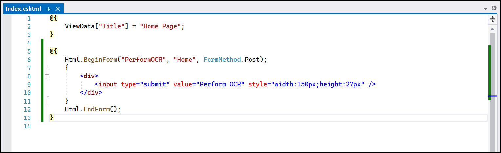

# How to Perform OCR on a PDF Document Using Docker container

Optical Character Recognition (OCR) is a technology that converts scanned paper documents from PDF files or images into searchable and editable data.

The [Syncfusion OCR processor library](https://www.syncfusion.com/document-processing/pdf-framework/net/pdf-library/ocr-process) has extended support to OCR process PDF documents and other scanned images in [docker](https://www.docker.com/why-docker/) container with the help of the [Tesseract](https://github.com/tesseract-ocr/tesseract) OCR engine.

## Steps to perform OCR on a PDF document programmatically

Step 1: Create a new ASP.NET Core application project.

Step 2: In the project configuration window, name your project and select Next.

Step 3: Enable the Docker support with Linux as a target OS.

Step 4: Install the [Syncfusion.PDF.OCR.Net](https://www.nuget.org/packages/Syncfusion.PDF.OCR.Net/) NuGet package as a reference to your .NET Core application [NuGet.org](https://www.nuget.org/).

Step 5: Tesseract assemblies are not added as a reference. They must be kept in the local machine, and the location of the assemblies is passed as a parameter to the OCR processor.


OCRProcessor processor = new OCRProcessor(@"TesseractBinaries\")


Step 6: Place the Tesseract language data {E.g eng.traineddata} in the local system and provide a path to the OCR processor. Please use the OCR language data for other languages using the following [link](https://github.com/tesseract-ocr/tessdata)


OCRProcessor processor = new OCRProcessor("Tesseractbinaries\");
processor.PerformOCR(loadedDocument, "tessdata/");



Step 7: Include the following commands in the Docker file to install the dependent packages in the docker container.



RUN apt-get update && \
apt-get install -yq --no-install-recommends \
libgdiplus libc6-dev



Step 8: A default action method named Index will be present in HomeController.cs. Right-click on Index method and select Go to View, where you will be directed to its associated view page Index.cshtml.
Step 9: Add a new button in the index.cshtml as shown below.



@{Html.BeginForm("PerformOCR", "Home", FormMethod.Get);
    {
        

            <input type="submit" value="Perform OCR on entire PDF" style="width:200px;height:27px" />
        

    }
    Html.EndForm();
}



Step 10: A default controller with name HomeController.cs gets added on creation of ASP.NET Core project. Include the following namespaces in that HomeController.cs file.



using Syncfusion.OCRProcessor;
using Syncfusion.Pdf.Parsing;



Step 11: Add a new action method PerformOCR in HomeController.cs and include the below code snippet to perform OCR in PDF file and download it.



public ActionResult PerformOCR()
{
   string docPath = _hostingEnvironment.WebRootPath + "/Data/Input.pdf";
   string tesseractPath = _hostingEnvironment.WebRootPath + "/Data/Tesseractbinaries/Linux";
    //Initialize the OCR processor by providing the path of tesseract binaries(SyncfusionTesseract.dll and liblept168.dll)
     using (OCRProcessor processor = new OCRProcessor(tesseractPath))
    {
        FileStream fileStream = new FileStream(docPath, FileMode.Open, FileAccess.Read);
        //Load a PDF document
        PdfLoadedDocument lDoc = new PdfLoadedDocument(fileStream);
        //Set OCR language to process
        processor.Settings.Language = Languages.English;
        string tessdataPath = _hostingEnvironment.WebRootPath + "/Data/tessdata";
        //Process OCR by providing the PDF document and Tesseract data
        processor.PerformOCR(lDoc, tessdataPath);
        //Create memory stream
        MemoryStream stream = new MemoryStream();
        //Save the document to memory stream
        lDoc.Save(stream);
        lDoc.Close();
        //Set the position as '0'
        stream.Position = 0;
        //Download the PDF document in the browser
        FileStreamResult fileStreamResult = new FileStreamResult(stream, "application/pdf");
        fileStreamResult.FileDownloadName = "Sample.pdf";
        return fileStreamResult;
    }
}



Step 12: Build and run the sample in the Docker. It will pull the Linux Docker image from the Docker hub and run the project. Now, the webpage will open in the browser. Click the button to convert the webpage to a PDF.

By executing the program, you will get the PDF document as follows.

A complete working sample for converting an HTML to PDF in the Linux docker container can be downloaded from [Github]().
  