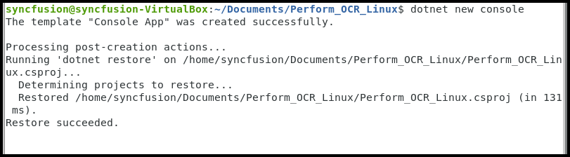
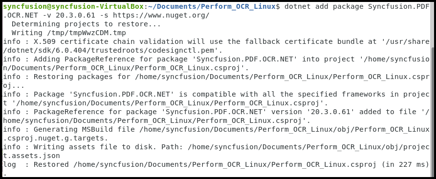
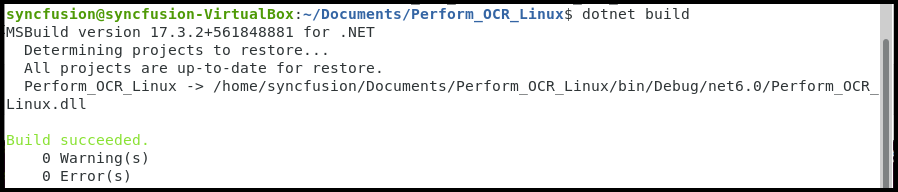

# Perform OCR in Linux

The [Syncfusion .NET OCR library](https://www.syncfusion.com/document-processing/pdf-framework/net/pdf-library/ocr-process) is used to extract text from scanned PDFs and images in the Linux application with the help of Google's [Tesseract](https://github.com/tesseract-ocr/tesseract) Optical Character Recognition engine.
## Pre-requisites

The following Linux dependencies should be installed where the conversion takes place. 



1.sudo apt-get update
2.sudo apt-get install libgdiplus
3.sudo apt-get install y- libopenjp2-7



## Steps to convert HTML to PDF in .NET Core application on Linux

Step 1: Execute the following command in the Linux terminal to create a new .NET Core Console application.



dotnet new console



 

Step 2: Install the [Syncfusion.PDF.OCR.Net](https://www.nuget.org/packages/Syncfusion.PDF.OCR.Net/) NuGet package as a reference to your .NET Core application [NuGet.org](https://www.nuget.org/).



dotnet add package Syncfusion.PDF.OCR.Net -v xx.x.x.xx -s https://www.nuget.org/



Step 3: Tesseract assemblies are not added as a reference. They must be kept in the local machine, and the location of the assemblies is passed as a parameter to the OCR processor.



OCRProcessor processor = new OCRProcessor(@"TesseractBinaries/")



Step 4: Place the Tesseract language data {E.g eng.traineddata} in the local system and provide a path to the OCR processor. Please use the OCR language data for other languages using the following link.

[Tesseract language data](https://github.com/tesseract-ocr/tessdata)



OCRProcessor processor = new OCRProcessor("Tesseractbinaries/");
processor.PerformOCR(loadedDocument, "tessdata/");



Step 5: Include the following namespaces in Program.cs file.



using Syncfusion.OCRProcessor;
using Syncfusion.Pdf;
using Syncfusion.Pdf.Parsing;



Step 6: Add code sample to perform OCR on entire PDF document in Program.cs file.


 
string path = ("Tesseractbinaries/Linux/");
string docPath = ("input.pdf");

//Initialize the OCR processor
using (OCRProcessor processor = new OCRProcessor(path))
{
    //Load the PDF document 
    FileStream stream = new FileStream(docPath, FileMode.Open, FileAccess.Read);
    PdfLoadedDocument lDoc = new PdfLoadedDocument(stream);

    //Language to process the OCR
    processor.Settings.Language = Languages.English;
    //Process OCR by providing loaded PDF document, Data dictionary and language
    processor.PerformOCR(lDoc, ("tessdata/"));

    //Save the OCR processed PDF document in the disk
    MemoryStream streamData = new MemoryStream();
    lDoc.Save(streamData);
    File.WriteAllBytes("Output.pdf", streamData.ToArray());
    lDoc.Close(true);
}



Step 7: Execute the following command to restore the NuGet packages.



dotnet restore



Step 8:  Execute the following command in the terminal to build the application.



dotnet build



Step 9: Execute the following command in the terminal to run the application.



dotnet run



By executing the program, you will get the PDF document as follows. The output will be saved in parallel to the program.cs file.

A complete working sample can be downloaded from Github
