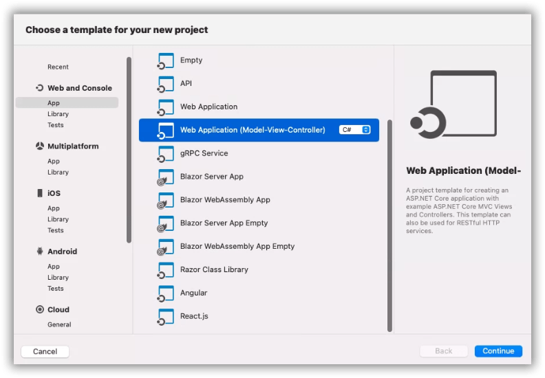
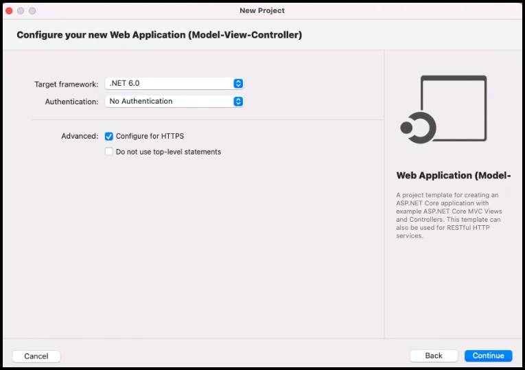
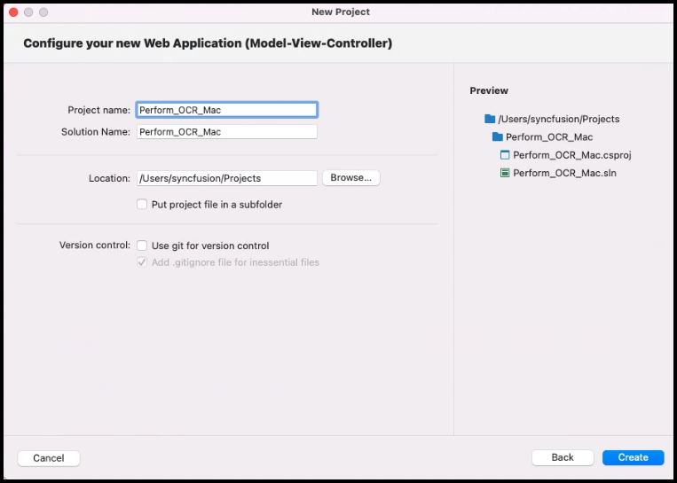
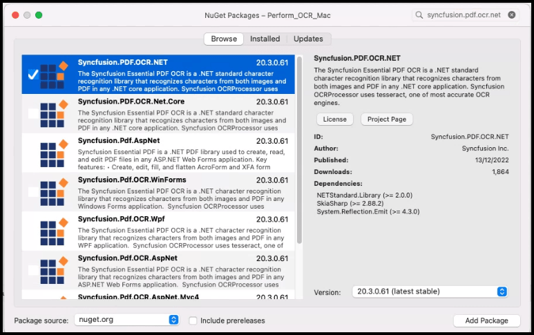
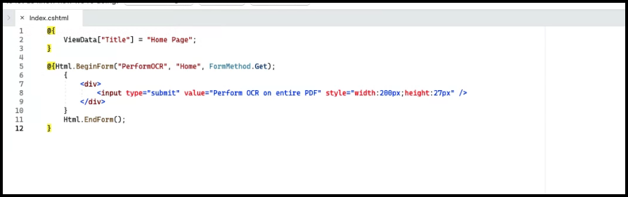
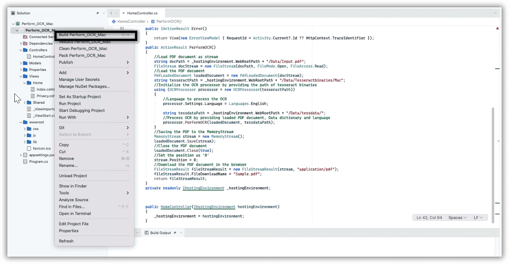
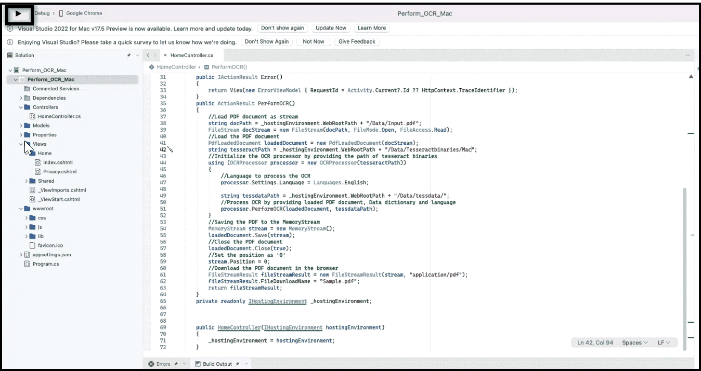

# Perform OCR using Mac

The [Syncfusion .NET OCR library](https://www.syncfusion.com/document-processing/pdf-framework/net/pdf-library/ocr-process) is used to extract text from the scanned PDFs and images in Mac application with the help of Google's [Tesseract](https://github.com/tesseract-ocr/tesseract) Optical Character Recognition engine.

## Steps to perform OCR on entire PDF document in Mac

Step 1: Create a new C# ASP.NET Core Web Application project.

Step 2: Select the Target Framework of your project.

Step 3: Configure your application and click Create.
)

Step 4: Install the [Syncfusion.PDF.OCR.Net](https://www.nuget.org/packages/Syncfusion.PDF.OCR.Net/) NuGet package as a reference to your .NET Core application [NuGet.org](https://www.nuget.org/).

Step 5: To install the “’libgdiplus” and “tesseract” packages in the Mac machine where the OCR operations occur, please refer to the following commands.


1.brew install mono-libgdiplus
2.brew install tesseract


Step 6: A default controller with the name HomeController.cs gets added to the creation of the ASP.NET project. Include the following namespaces in that HomeController.cs file.



using Syncfusion.OCRProcessor;
using Syncfusion.Pdf.Parsing;



Step 7: A default action method named Index will be present in the HomeController.cs. Right-click on the Index method and select Go To View, where you will be directed to its associated view page Index.cshtml.

Step 8: Add a new button in the Index.cshtml as follows.



@{Html.BeginForm("PerformOCR", "Home", FormMethod.Get);
    {
        

            <input type="submit" value="Perform OCR on entire PDF" style="width:200px;height:27px" />
        

    }
    Html.EndForm();
}



Step 9: Add a new action method PerformOCR in the HomeController.cs, and include the following code sample to perform OCR in a PDF file and download it.



public ActionResult PerformOCR()
{
    string docPath = _hostingEnvironment.WebRootPath + "/Input.pdf";
    string tesseractPath = _hostingEnvironment.WebRootPath + "Tesseractbinaries/Mac";
    //Initialize the OCR processor by providing the path of tesseract binaries(SyncfusionTesseract.dll and liblept168.dll)
    using (OCRProcessor processor = new OCRProcessor(tesseractPath))
    {
        FileStream fileStream = new FileStream(docPath, FileMode.Open, FileAccess.Read);
        //Load a PDF document
        PdfLoadedDocument lDoc = new PdfLoadedDocument(fileStream);
        //Set OCR language to process
        processor.Settings.Language = Languages.English;
        string tessdataPath = _hostingEnvironment.WebRootPath + "tessdata/";
        //Process OCR by providing the PDF document and Tesseract data
        processor.PerformOCR(lDoc, tessdataPath);
        //Create memory stream
        MemoryStream stream = new MemoryStream();
        //Save the document to memory stream
        lDoc.Save(stream);
        lDoc.Close();
        //Set the position as '0'
        stream.Position = 0;
        //Download the PDF document in the browser
        FileStreamResult fileStreamResult = new FileStreamResult(stream, "application/pdf");
        fileStreamResult.FileDownloadName = "Sample.pdf";
        return fileStreamResult;
    }
}



Step 10: Right-click the project and select Build.

Step 11: Run the application.

By executing the program, you will get a PDF document as follows.

A complete working sample can be downloaded from GitHub.