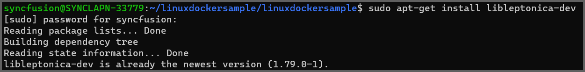
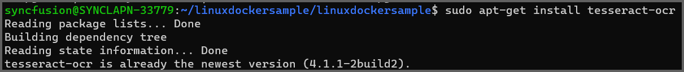

---
title: Troubleshooting PDF OCR failures | Syncfusion
description: Learn how to overcome OCR Processor failures using Syncfusion .NET OCR library with the help of Google's Tesseract Optical Character Recognition engine.
platform: file-formats
control: PDF
documentation: UG
keywords: Assemblies
--- 

# OCR Processor Troubleshooting 

## Tesseract has not been initialized exception

<table>
<th style="font-size:14px" width="100px">Exception</th>
<th style="font-size:14px">Tesseract has not been initialized exception.</th>
<tr>
<th style="font-size:14px" width="100px">Reason
</th>
<td>The exception may occur if the tesseract binaries and tessdata files are unavailable on the provided path. 
</td>
</tr>
<tr>
<th style="font-size:14px" width="100px">Solution1</th>
<td>
Set proper tesseract binaries and tessdata folder with all files and inner folders. The tessdata folder name is case-sensitive and should not change.  
  



//TesseractBinaries - path of the folder tesseract binaries. 
OCRProcessor processor = new OCRProcessor(@"TesseractBinaries/");

//TessData - path of the folder containing the language pack
processor.PerformOCR(lDoc, @"TessData/");



</td>
</tr>
<tr>
<th style="font-size:14px" width="100px">Solution2</th>
<td>
Ensure that your data file version is 3.02 since the OCR processor is built with the Tesseract version 3.02.
</td>
</tr>
</table>

## Exception has been thrown by the target of an invocation

<table>
<th style="font-size:14px" width="100px">Exception</th>
<th style="font-size:14px">Exception has been thrown by the target of an invocation.</th>
<tr>
<th style="font-size:14px" width="100px">Reason
</th>
<td>If the tesseract binaries are not in the required structure.  
</td>
</tr>
<tr>
<th style="font-size:14px" width="100px">Solution</th>
<td>
To resolve this exception, ensure the tesseract binaries are in the following structure.
  
The tessdata and tesseract binaries folder are automatically added to the bin folder of the application. The assemblies should be in the following structure.
  
1.<i>bin\Debug\net7.0\runtimes\win-x64\native\leptonica-1.80.0.dll,libSyncfusionTesseract.dll</i> 
2.<i>bin\Debug\net7.0\runtimes\win-x86\native\leptonica-1.80.0.dll,libSyncfusionTesseract.dll</i>
</td>
</tr>
<tr>
<th style="font-size:14px" width="100px">Reason 1
</th>
<td>An exception may occur due to missing or mismatched assemblies of the Tesseract binaries and Tesseract data from the OCR processor.
</td>
</tr>
<tr>
<th style="font-size:14px" width="100px">Reason 2
</th>
<td>An exception may occur due to the VC++ 2015 redistributable files missing in the machine where the OCR processor takes place.
</td>
</tr>
<tr>
<th style="font-size:14px" width="100px">Solution</th>
<td>
Install the VC++ 2015 redistributable files in your machine to overcome an exception. So, please select both file and install it.
 
<b>Refer to the following screenshot:</b>
 

  
Please find the download link Visual C++ 2015 Redistributable file, 
<a href="https://www.microsoft.com/en-us/download/details.aspx?id=48145">Visual C++ 2015 Redistributable file</a> 
</td>
</tr>
</table>

## Can't be opened because the developer's identity cannot be confirmed

<table>
<th style="font-size:14px" width="100px">Exception</th>
<th style="font-size:14px">Can't be opened because the developer's identity cannot be confirmed.</th>
<tr>
<th style="font-size:14px" width="100px">Reason
</th>
<td>This error may occur during the initial loading of the OCR processor in Mac environments.     
</td>
</tr>
<tr>
<th style="font-size:14px" width="100px">Solution</th>
<td>
To resolve this issue, refer this <a href="https://support.shippingeasy.com/hc/en-us/articles/211543683-What-is-the-error-identity-of-the-developer-cannot-be-confirmed-">link</a> for more details.

</td>
</tr>
</table>

## The OCR processor doesn't process languages other than English

<table>
<th style="font-size:14px" width="100px">Exception</th>
<th style="font-size:14px">The OCR processor doesn't process languages other than English.</th>
<tr>
<th style="font-size:14px" width="100px">Reason
</th>
<td>This issue may occur if the input image has other languages. The language and tessdata are unavailable for those languages.    
</td>
</tr>
<tr>
<th style="font-size:14px" width="100px">Solution</th>
<td>
The essential PDF supports all the languages the Tesseract engine supports in the OCR processor.
The dictionary packs for the languages can be downloaded from the following online location: 
<a href="https://code.google.com/p/tesseract-ocr/downloads/list">https://code.google.com/p/tesseract-ocr/downloads/list</a>
  
It is also mandatory to change the corresponding language code in the OCRProcessor.Settings.Language property.   
For example, to perform the optical character recognition in German, the property should be set as   
"processor.Settings.Language = "deu";"
</td>
</tr>
</table>

## Text does not recognize properly when performing OCR on a PDF document with low-quality images

<table>
<th style="font-size:14px" width="100px">Issue</th>
<th style="font-size:14px">Text does not recognize properly when performing OCR on a PDF document with low-quality images</th>
<tr>
<th style="font-size:14px" width="100px">Reason
</th>
<td>The presence of low quality images in the input PDF document may be the cause of this issue.
</td>
</tr>
<tr>
<th style="font-size:14px" width="100px">Solution</th>
<td>
By using the best tessdata, we can improve the OCR results. For more information,  please refer to the links below.
 
<a href="https://github.com/tesseract-ocr/tessdata_best">https://github.com/tesseract-ocr/tessdata_best</a>  
{{'**Note:**'| markdownify }}For better performance, kindly use the fast tessdata which is mentioned in below link, <a href="https://github.com/tesseract-ocr/tessdata_fast">https://github.com/tesseract-ocr/tessdata_fast</a> 
</td>
</tr>
</table>

## OCR not working on Mac: Exception has been thrown by the target of an invocation

<table>
<th style="font-size:14px" width="100px">Issue
</th>
<th style="font-size:14px">Syncfusion.Pdf.PdfException: Exception has been thrown by the target of an invocation" in the Mac machine. 
</th>
<tr>
<th style="font-size:14px" width="100px">Reason
</th>
<td>The problem occurs due to a mismatch in the dependency package versions on your Mac machine. 
</td>
</tr>
<tr>
<th style="font-size:14px" width="100px">Solution
</th>
<td>To resolve this problem, you should install and utilize Tesseract 5 on your Mac machine. Refer to the following steps for installing Tesseract 5 and integrating it into an OCR processing workflow. 
  
1.Execute the following command to install Tesserat 5. 
  



brew install tesseract



  
If the "brew" is not installed on your machine, you can install it using the following command.
  



/bin/bash -c "$(curl -fsSL https://raw.githubusercontent.com/Homebrew/install/HEAD/install.sh)"



  

2.Once Tesseract 5 is successfully installed, you can configure the path to the latest binaries by copying the location of the Tesseract folder and setting it as the Tesseract binaries path when setting up the OCR processor. Refer to the example code below:
  



//Initialize the OCR processor by providing the path of tesseract binaries.
using (OCRProcessor processor = new OCRProcessor("/opt/homebrew/Cellar/tesseract/5.3.2/lib"))



  

3.Add the TessDataPath from bin folder. Refer to the example code below:
  



using (OCRProcessor processor = new OCRProcessor("/opt/homebrew/Cellar/tesseract/5.3.2/lib"))
{
    FileStream fileStream = new FileStream("../../../Input.pdf", FileMode.Open, FileAccess.Read);
    //Load a PDF document.
    PdfLoadedDocument lDoc = new PdfLoadedDocument(fileStream);
    //Set OCR language to process.
    processor.Settings.Language = Languages.English;
    //Process OCR by providing the PDF document.
    processor.TessDataPath = "runtimes/tessdata";
    processor.PerformOCR(lDoc);
    //Create file stream.
    using (FileStream outputFileStream = new FileStream("Output.pdf", FileMode.Create, FileAccess.ReadWrite))
    {
        //Save the PDF document to file stream.
        lDoc.Save(outputFileStream);
    }
    //Close the document.
    lDoc.Close(true);
}



</td>
</tr>
</table>

## Method PerformOCR() causes problems and ignores the tesseract files under WSL.

<table>
<th style="font-size:14px" width="100px">Issue</th>
<th style="font-size:14px">Method PerformOCR() causes problem and ignores the tesseract files under WSL</th>
<tr>
<th style="font-size:14px" width="100px">Reason
</th>
<td>Tesseract binaries in WSL are missing.
</td>
</tr>
<tr>
<th style="font-size:14px" width="100px">Solution</th>
<td>To resolve this problem, you should install and utilize Leptonica and Tesseract on your machine. Refer to the following steps for installing Leptonica and Tesseract,
  
1. Install the leptonica.
 



sudo apt-get install libleptonica-dev



  

  
2.Install the tesseract.
 



sudo apt-get install tesseract-ocr-eng



  

  
3. Copy the binaries (liblept.so and libtesseract.so) to the missing files exception folder in the project location.
 



cp /usr/lib/x86_64-linux-gnu/liblept.so /home/syncfusion/linuxdockersample/linuxdockersample/bin/Debug/net7.0/liblept1753.so



 



cp /usr/lib/x86_64-linux-gnu/libtesseract.so.4 /home/syncfusion/linuxdockersample/linuxdockersample/bin/Debug/net7.0/libSyncfusionTesseract.so



 
</td>
</tr>
</table>

## OCR not working on Linux: Exception has been thrown by the target of an invocation

<table>
<th style="font-size:14px" width="100px">Issue</th>
<th style="font-size:14px">Syncfusion.Pdf.PdfException: Exception has been thrown by the target of an invocation" in the Linux machine.</th>
<tr>
<th style="font-size:14px" width="100px">Reason
</th>
<td>The problem occurs due to the missing prerequisites dependencies on your Linux machine.
</td>
</tr>
<tr>
<th style="font-size:14px" width="100px">Solution</th>
<td>
To resolve this problem, you should install all required dependencies in your Linux machine. Refer to the following steps to installing the missing dependencies.

Step 1: Execute the following command in terminal window to check dependencies are installed properly.



        ldd  liblept1753.so
        ldd  libSyncfusionTesseract.so



Run the following commands in terminal
Step 1:



        sudo apt-get install libleptonica-dev libjpeg62



Step 2:



        ln -s /usr/lib/x86_64-linux-gnu/libtiff.so.6 /usr/lib/x86_64-linux-gnu/libtiff.so.5



Step 3:



        ln -s /lib/x86_64-linux-gnu/libdl.so.2 /usr/lib/x86_64-linux-gnu/libdl.so



</td>
</tr>
</table>

## OCR not working on Docker net 8.0: Exception has been thrown by target of an invocation.

<table>
<th style="font-size:14px" width="100px">Exception</th>
<th style="font-size:14px">OCR not working on Docker net 8.0: Exception has been thrown by target of an invocation.</th>
<tr>
<th style="font-size:14px" width="100px">Reason
</th>
<td>The reported issue occurs due to the missing prerequisite dependencies packages in the Docker container in .NET 8.0 version.
</td>
</tr>
<tr>
<th style="font-size:14px" width="100px">Solution</th>
<td>
 We can resolve the reported issue by installing the tesseract required dependencies by using Docker file. Please refer the below commands.

FROM mcr.microsoft.com/dotnet/aspnet:8.0 AS base

`RUN apt-get update && \`

`apt-get install -yq --no-install-recommends \`

`libgdiplus libc6-dev libleptonica-dev libjpeg62`

`RUN ln -s /usr/lib/x86_64-linux-gnu/libtiff.so.6 /usr/lib/x86_64-linux-gnu/libtiff.so.5`

`RUN ln -s /lib/x86_64-linux-gnu/libdl.so.2 /usr/lib/x86_64-linux-gnu/libdl.so`

 

USER app

WORKDIR /app

EXPOSE 8080

EXPOSE 8081

</td>
</tr>
</table>