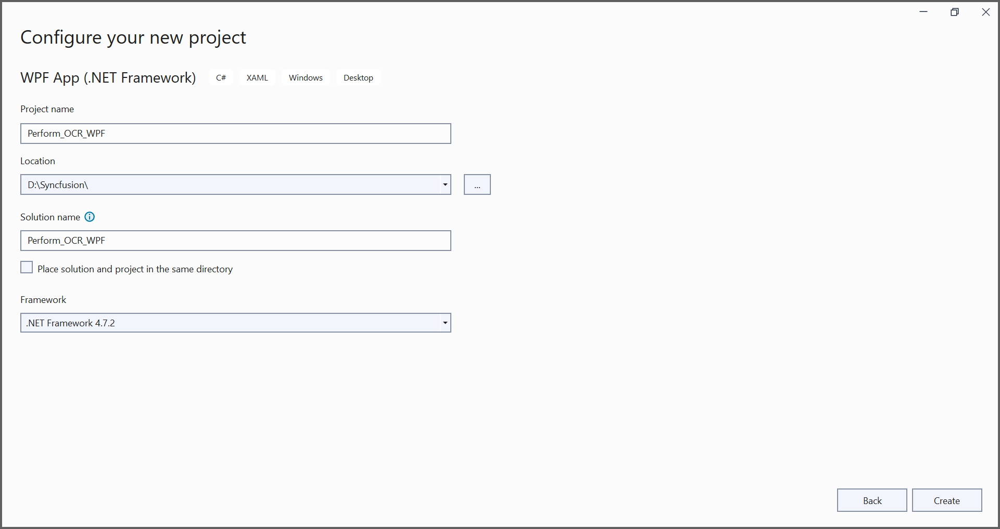
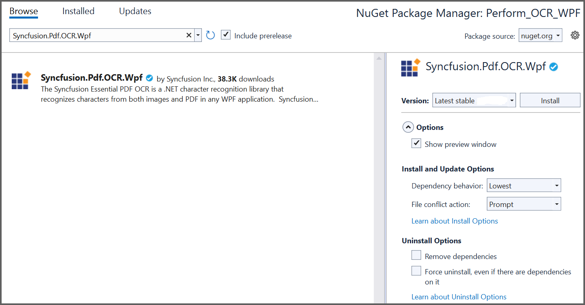

---
title: Perform OCR on PDF and image files in WPF | Syncfusion
description: Learn how to perform OCR on scanned PDF documents and images in WPF with different tesseract version using Syncfusion .NET OCR library. 
platform: file-formats
control: PDF
documentation: UG
keywords: Assemblies
--- 

# Perform OCR in WPF (Windows Presentation Foundation)

The [Syncfusion .NET OCR library](https://www.syncfusion.com/document-processing/pdf-framework/net/pdf-library/ocr-process) used to extract text from scanned PDFs and images in the WPF application with the help of Google's [Tesseract](https://github.com/tesseract-ocr/tesseract) Optical Character Recognition engine.

## Steps to perform OCR on entire PDF document in WPF

Step 1: Create a new WPF application project. 

In project configuration window, name your project and select Create. 

Step 2: Install the [Syncfusion.Pdf.OCR.Wpf](https://www.nuget.org/packages/Syncfusion.Pdf.OCR.Wpf) NuGet package as a reference to your WPF application from [nuget.org](https://www.nuget.org/).

N> 1. Beginning from version 21.1.x, the default configuration includes the addition of the TesseractBinaries and Tesseract language data folder paths, eliminating the requirement to explicitly provide these paths.
N> 2. Starting with v16.2.0.x, if you reference Syncfusion assemblies from trial setup or from the NuGet feed, you also have to add "Syncfusion.Licensing" assembly reference and include a license key in your projects. Please refer to this [link](https://help.syncfusion.com/common/essential-studio/licensing/overview) to know about registering Syncfusion license key in your application to use our components.

Step 3: Add a new button in **MainWindow.xaml** to perform OCR as follows.



<Grid>
    <Button Content="Perform OCR" HorizontalAlignment="Left" Margin="279,178,0,0" VerticalAlignment="Top" Height="68" Width="203" Click="Button_Click"/>
</Grid>



Step 6: Include the following namespaces in the **MainWindow.xaml.cs** file.



using Syncfusion.OCRProcessor;
using Syncfusion.Pdf.Parsing;



Step 4: Add the following code to a Button_Click to perform OCR on the entire PDF document using [PerformOCR](https://help.syncfusion.com/cr/file-formats/Syncfusion.OCRProcessor.OCRProcessor.html#Syncfusion_OCRProcessor_OCRProcessor_PerformOCR_Syncfusion_Pdf_Parsing_PdfLoadedDocument_System_String_) method of the [OCRProcessor](https://help.syncfusion.com/cr/file-formats/Syncfusion.OCRProcessor.OCRProcessor.html) class. 



//Initialize the OCR processor.
using (OCRProcessor processor = new OCRProcessor())
{
    //Load an existing PDF document.
    PdfLoadedDocument loadedDocument = new PdfLoadedDocument("Input.pdf");
    //Set the tesseract version.
    processor.Settings.TesseractVersion = TesseractVersion.Version4_0;
    //Set OCR language to process.
    processor.Settings.Language = Languages.English;
    //Process OCR by providing the PDF document.
    processor.PerformOCR(loadedDocument);
    //Save the OCR processed PDF document in the disk.
    loadedDocument.Save("OCR.pdf");
    loadedDocument.Close(true);
}



By executing the program, you will get a PDF document as follows. 

A complete working sample can be downloaded from [GitHub](https://github.com/SyncfusionExamples/OCR-csharp-examples/tree/master/WPF).

Click [here](https://www.syncfusion.com/document-processing/pdf-framework/net) to explore the rich set of Syncfusion PDF library features.

