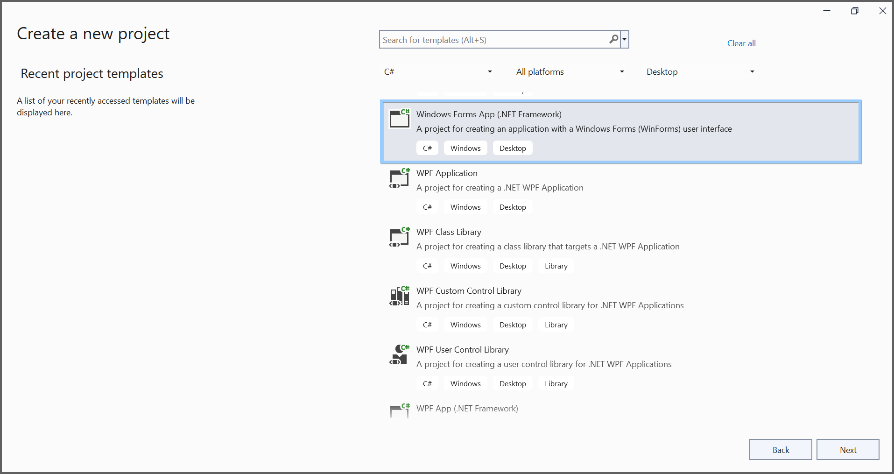
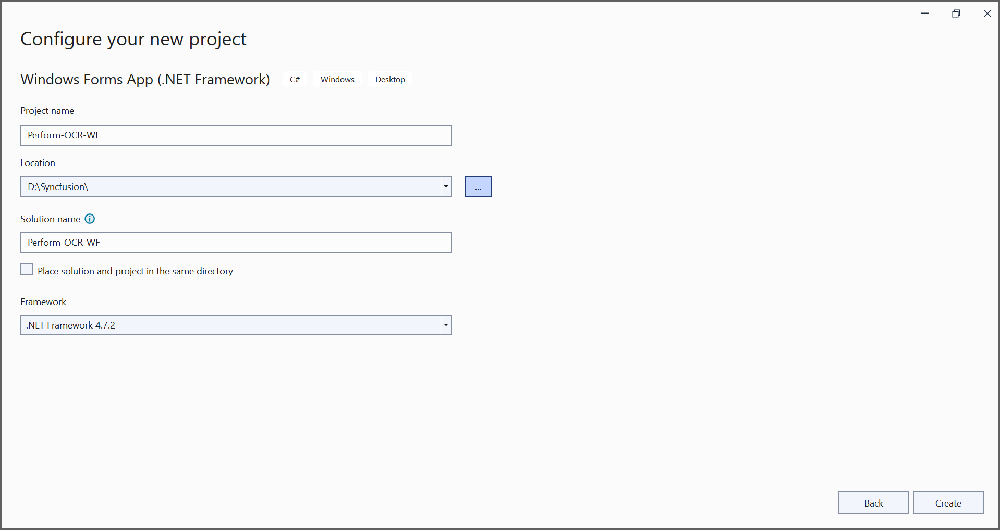
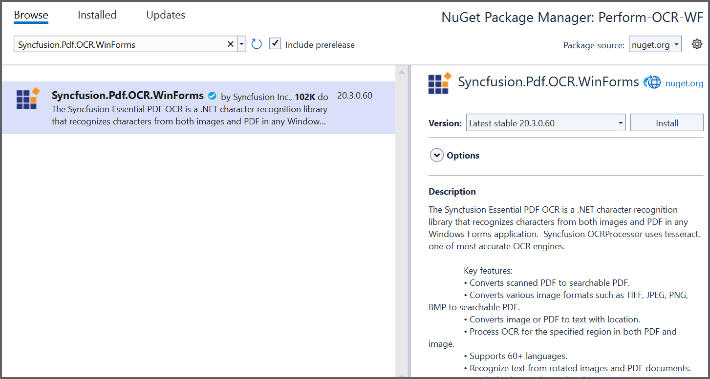

---
title: Perform OCR on PDF and image files in Windows Forms | Syncfusion
description: Learn how to perform OCR on scanned PDF documents and images in Windows Forms with different tesseract versions using Syncfusion .NET OCR library. 
platform: file-formats
control: PDF
documentation: UG
keywords: Assemblies
--- 

# Perform OCR in Windows 
The [Syncfusion .NET OCR library](https://www.syncfusion.com/document-processing/pdf-framework/net/pdf-library/ocr-process) used to extract text from scanned PDFs and images in Windows Forms application with the help of Google's [Tesseract](https://github.com/tesseract-ocr/tesseract) Optical Character Recognition engine.

## Steps to perform OCR on entire PDF document in Windows Forms 

Step 1: Create a new Windows Forms application project. 

In project configuration window, name your project and select Create. 

Step 2: Install the [Syncfusion.Pdf.OCR.WinForms](https://www.nuget.org/packages/Syncfusion.Pdf.OCR.WinForms) NuGet package as a reference to your WinForms application from [nuget.org](https://www.nuget.org/).

Step 3: Tesseract assemblies are not added as a reference. They must be kept in the local machine, and the assemblies location is passed as a parameter to the OCR processor.



OCRProcessor processor = new OCRProcessor(@"TesseractBinaries/")



Step 4: Place the Tesseract language data {e.g, eng.traineddata} in the local system and provide a path to the OCR processor. Please use the OCR language data for other languages using the following link.

[Tesseract language data](https://github.com/tesseract-ocr/tessdata)



OCRProcessor processor = new OCRProcessor("Tesseractbinaries/");
processor.PerformOCR(loadedDocument, "tessdata/");



Step 5: Add a new button in Form1.Designer.cs file. 



private System.Windows.Forms.Button button1;

private void InitializeComponent()
{
    this.button1 = new System.Windows.Forms.Button();
    this.SuspendLayout();
    // 
    // button1
    // 
    this.button1.Location = new System.Drawing.Point(284, 162);
    this.button1.Name = "button1";
    this.button1.Size = new System.Drawing.Size(190, 65);
    this.button1.TabIndex = 0;
    this.button1.Text = "Perform OCR on entire PDF document";
    this.button1.UseVisualStyleBackColor = true;
    this.button1.Click += new System.EventHandler(this.btnCreate_Click);
    // 
    // Form1
    // 
    this.AutoScaleDimensions = new System.Drawing.SizeF(9F, 20F);
    this.AutoScaleMode = System.Windows.Forms.AutoScaleMode.Font;
    this.ClientSize = new System.Drawing.Size(800, 450);
    this.Controls.Add(this.button1);
    this.Name = "Form1";
    this.Text = "Form1";
    this.ResumeLayout(false);
}



Step 6: Include the following namespaces in the Form1.cs file.



using Syncfusion.OCRProcessor;
using Syncfusion.Pdf.Parsing;



Step 7: Create the btnCreate_Click event and add the following code to perform OCR on the entire PDF document. 



//Initialize the OCR processor by providing the path of tesseract binaries.
using (OCRProcessor processor = new OCRProcessor(@"TesseractBinaries/"))
{
    //Load an existing PDF document.
    PdfLoadedDocument loadedDocument = new PdfLoadedDocument("Input.pdf");

    //Set the tesseract version 
    processor.Settings.TesseractVersion = TesseractVersion.Version4_0;

    //Set OCR language to process.
    processor.Settings.Language = Languages.English;

    //Process OCR by providing the PDF document and Tesseract data.
    processor.PerformOCR(loadedDocument, @"Tessdata/");
        
    //Save the OCR processed PDF document in the disk.
    loadedDocument.Save("OCR.pdf");
    loadedDocument.Close(true);
}



By executing the program, you will get a PDF document as follows.

A complete working sample can be downloaded from [GitHub](https://github.com/SyncfusionExamples/OCR-csharp-examples/tree/master/Windows%20Forms).
