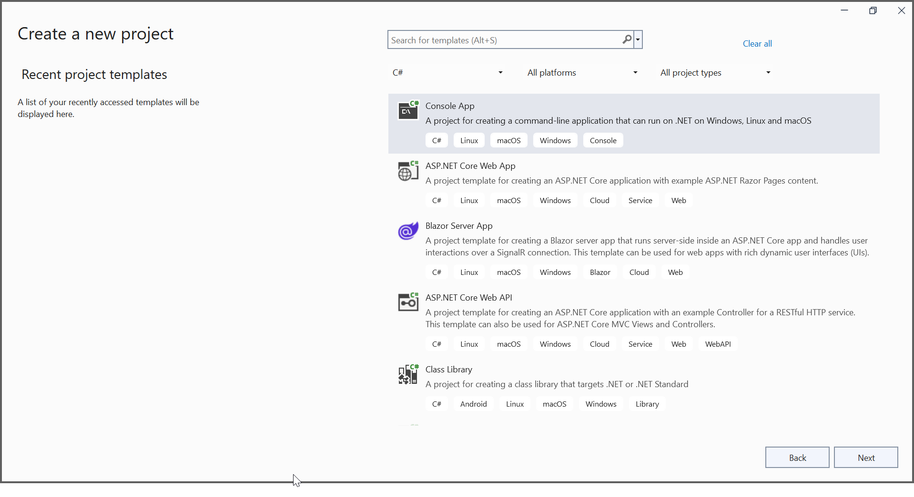
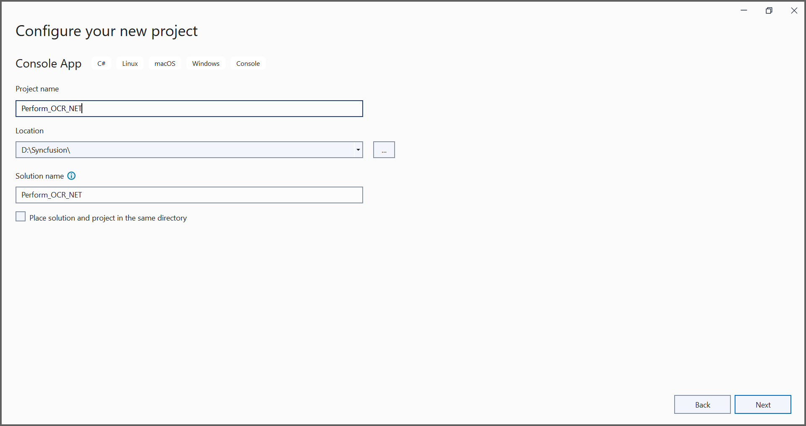
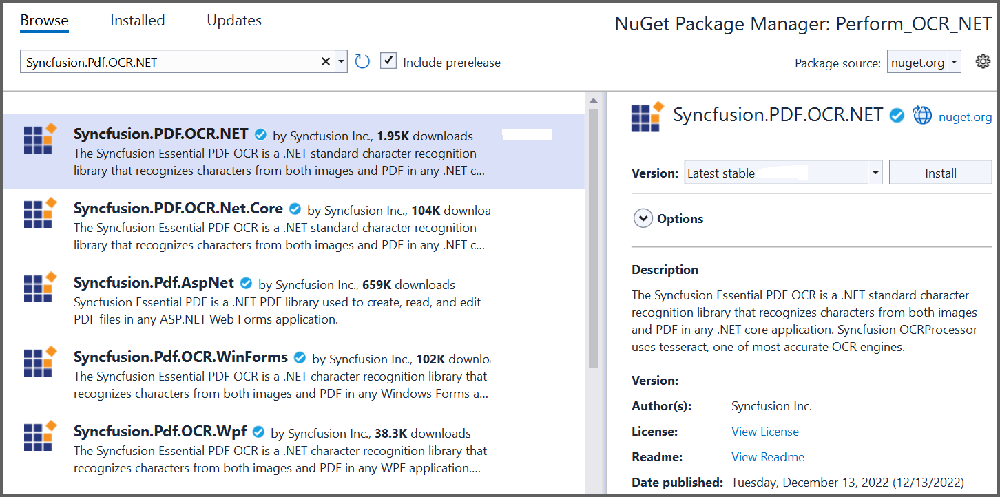

# Working with Optical Character Recognition (OCR)

Optical character recognition (OCR) is a technology used to convert scanned paper documents in the form of PDF files or images into searchable and editable data.  

The [Syncfusion OCR processor library](https://www.syncfusion.com/document-processing/pdf-framework/net/pdf-library/ocr-process) has extended support to process OCR on scanned PDF documents and images with the help of Google’s [Tesseract](https://github.com/tesseract-ocr/tesseract) Optical Character Recognition engine.  

The Syncfusion OCR processor library works seamlessly in various platforms: Azure App Services, Azure Functions, AWS Textract, Docker, WinForms, WPF, Blazor, ASP.NET MVC, ASP.NET Core with Windows, MacOS and Linux. 

N> Starting with v20.1.0.x, if you reference Syncfusion OCR processor assemblies from the trial setup or the NuGet feed, you also have to include a license key in your projects. Please refer to this [link](https://help.syncfusion.com/common/essential-studio/licensing/license-key) to learn more about registering the Syncfusion license key in your application to use its components.

## Key features 

* Create a searchable PDF from scanned PDF.
* Zonal text extraction from the scanned PDF.
* Preserve Unicode characters.
* Extract text from the image.
* Create a searchable PDF from large scanned PDF documents. 
* Create a searchable PDF from rotated scanned PDF.
* Get OCRed text and its bounds from a scanned PDF document. 
* Native call.
* Customizing the temp folder.
* Performing OCR with different Page Segmentation Mode.
* Performing OCR with different OCR Engine Mode.
* White List.
* Black List.
* Image into searchable PDF or PDF/A.
* Improved accessibility.
* Post-processing.
* Compatible with .NET Framework 4.5 and above.
* Compatible with .NET Core 2.0 and above.

## Install .NET OCR library

Include the OCR library in your project using two approaches.

* NuGet Package Required (Recommended)
* Assemblies Required 

### NuGet Package Required (Recommended)

Directly install the NuGet package to your application from [nuget.org](https://www.nuget.org/).

<table>
<tr>
<thead>
<th><b>Platform(s)</b></th>
<th><b>NuGet Package</b></th>
</thead>
</tr>
<tr>
<td>
(.NET Core, .NET 5, .NET 6 and .NET 7) Windows, Linux and Mac
</td>
<td>
{{'[Syncfusion.PDF.OCR.NET.nupkg](https://www.nuget.org/packages/Syncfusion.PDF.OCR.NET)'| markdownify }}
</td>
</tr>
<tr>
<td>
Windows Forms
</td>
<td>
{{'[Syncfusion.Pdf.OCR.WinForms.nupkg](https://www.nuget.org/packages/Syncfusion.Pdf.OCR.WinForms)'| markdownify }}
</td>
</tr>
<tr>
<td>
WPF
</td>
<td>
{{'[Syncfusion.Pdf.OCR.Wpf.nupkg](https://www.nuget.org/packages/Syncfusion.Pdf.OCR.Wpf)'| markdownify }}
</td>
</tr>
<tr>
<td>
ASP.NET 
</td>
<td>
{{'[Syncfusion.Pdf.OCR.AspNet.nupkg](https://www.nuget.org/packages/Syncfusion.Pdf.OCR.AspNet)'| markdownify }}
</td>
</tr>
<tr>
<td>
ASP.NET MVC4
</td>
<td>
{{'[Syncfusion.Pdf.OCR.AspNet.Mvc4.nupkg](https://www.nuget.org/packages/Syncfusion.Pdf.OCR.AspNet.Mvc4)'| markdownify }}
</td>
</tr>
<tr>
<td>
ASP.NET MVC5
</td>
<td>
{{'[Syncfusion.Pdf.OCR.AspNet.Mvc5.nupkg](https://www.nuget.org/packages/Syncfusion.Pdf.OCR.AspNet.Mvc5)'| markdownify }}
</td>
</tr>
<tr>
<td>
ASP.NET Core (.NET 5, .NET 6 and .NET 7) Windows, Linux and Mac
</td>
<td>
{{'[Syncfusion.PDF.OCR.Net.Core.nupkg](https://www.nuget.org/packages/Syncfusion.PDF.OCR.Net.Core)'| markdownify }}
</td>
</tr>
</table>

### Assemblies Required

Get the following required assemblies by downloading the OCR library installer. Download and install the OCR library for Windows, Linux, and Mac respectively. Please refer to the advanced installation steps for more details.

#### Syncfusion assemblies

<table>
<tr>
<thead>
<th><b>Platform(s)</b></th>
<th><b>Assemblies</b></th>
</thead>
</tr>
<tr>
<td>
Windows Forms, WPF, ASP.NET, and ASP.NET MVC 
</td>
<td>
<ul>
<li>Syncfusion.OCRProcessor.Base.dll</li>
<li>Syncfusion.Pdf.Base.dll</li>
<li>Syncfusion.Compression.Base.dll</li>
</ul>
</td>
</tr>
<tr>
<td>
.NET Standard 2.0 
</td>
<td>
<ul>
<li>Syncfusion.OCRProcessor.Portable.dll</li>
<li>Syncfusion.PdfImaging.Portable.dll</li>
<li>Syncfusion.Pdf.Portable.dll</li>
<li>Syncfusion.Compression.Portable.dll</li>
<li>{{'[System.Drawing.Common](https://www.nuget.org/packages/System.Drawing.Common/4.5.0)'| markdownify }} package (v 4.5.0 or above)</li>
</ul>
</td>
</tr>
<tr>
<td>
.NET 5/.NET 6
</td>
<td>
<ul>
<li>Syncfusion.OCRProcessor.NET.dll</li>
<li>Syncfusion.PdfImaging.NET.dll</li>
<li>Syncfusion.Pdf.NET.dll</li>
<li>Syncfusion.Compression.NET.dll</li>
<li>{{'[SkiaSharp](https://www.nuget.org/packages/SkiaSharp/2.88.0-preview.232)'| markdownify }} package</li>
</ul>
</td>
</tr>
</table>

## Prerequisites

The Syncfusion OCR processor internally uses Tesseract libraries to perform OCR, so please copy the necessary Tessdata and TesseractBinaries folders from the NuGet package folder to the project folder to use the OCR feature.

### Prerequisites for Windows
Provide the TesseractBinaries windows folder path when creating a new OCR processor. Please refer to the following code sample for windows.



OCRProcessor processor = new OCRProcessor(@"TesseractBinaries/Windows");



When performing the OCR to recognize different language images, provide the tesseract language data folder path (tessdata).



processor.PerformOCR(lDoc, "tessdata/");



Download the language packages from the following link.
[https://github.com/tesseract-ocr/tessdata](https://github.com/tesseract-ocr/tessdata)

N> From 16.1.0.24 OCR is not a part of Essential Studio and is available as a separate package (OCR Processor) under the Add-On section in the following link.
[https://www.syncfusion.com/downloads/latest-version](https://www.syncfusion.com/downloads/latest-version)

### Prerequisites for Linux 

Using the "System.Drawing.Common" API in the OCR Processor, install the "libgdiplus" and "libopenjp2-7" packages. Please refer to the following commands to install the packages.



sudo apt-get update
sudo apt-get install libgdiplus
sudo apt-get install y- libopenjp2-7



Provide the TesseractBinaries Linux folder path when creating a new OCR processor. Please refer to the following code snippet for Linux.



OCRProcessor processor = new OCRProcessor(@"TesseractBinaries/Linux");





processor.PerformOCR(lDoc, "tessdata/");



Download the language packages from the following link.    
[https://github.com/tesseract-ocr/tessdata](https://github.com/tesseract-ocr/tessdata)

### Prerequisites for Mac

Use the "System.Drawing.Common" package to process the image and perform the OCR in the OCR Processor. Install the "libgdiplus" and "tesseract" packages in the Mac machine where the OCR operations occur. Please refer to the following commands to install this package.



brew install mono-libgdiplus
brew install tesseract



Provide the TesseractBinaries Mac folder path when creating a new OCR processor. Please refer to the following code sample for Mac.



OCRProcessor processor = new OCRProcessor(@"TesseractBinaries/Mac");





processor.PerformOCR(lDoc, "tessdata/");



Download the language packages from the following link.  
[https://code.google.com/p/tesseract-ocr/downloads/list](https://code.google.com/p/tesseract-ocr/downloads/list)

## Get Started with OCR 

### Perform OCR using C# 

Integrating the OCR processor library in any .NET application is simple. Please refer to the following steps to perform OCR in your .NET application. 

#### Steps to perform OCR on a entire PDF document in .NET application 

Step 1: Create a new .NET console application. 

In project configuration window, name your project and select Next.

Step 2: Install [Syncfusion.PDF.OCR.NET](https://www.nuget.org/packages/Syncfusion.PDF.OCR.NET) NuGet package as a reference to your .NET application from [nuget.org](https://www.nuget.org).

Step 3: Tesseract assemblies are not added as a reference. They must be kept in the local machine, and the location of the assemblies is passed as a parameter to the OCR processor.



OCRProcessor processor = new OCRProcessor(@"TesseractBinaries/")



Step 4: Place the Tesseract language data {E.g eng.traineddata} in the local system and provide a path to the OCR processor. Please use the OCR language data for other languages using the following link.

[Tesseract language data](https://github.com/tesseract-ocr/tessdata)



OCRProcessor processor = new OCRProcessor(@"Tesseractbinaries/");
processor.PerformOCR(loadedDocument, "tessdata/");



Step 5: Include the following namespace in your class file. 



using Syncfusion.OCRProcessor;
using Syncfusion.Pdf.Parsing;



Step 6: Use the following code sample to perform OCR on the entire PDF document using [PerformOCR](https://help.syncfusion.com/cr/file-formats/Syncfusion.OCRProcessor.OCRProcessor.html#Syncfusion_OCRProcessor_OCRProcessor_PerformOCR_Syncfusion_Pdf_Parsing_PdfLoadedDocument_System_String_) method of the [OCRProcessor](https://help.syncfusion.com/cr/file-formats/Syncfusion.OCRProcessor.OCRProcessor.html) class in Program.cs file. 



//Initialize the OCR processor by providing the path of tesseract binaries.
using (OCRProcessor processor = new OCRProcessor("TesseractBinaries/Windows/"))
{
    //Load an existing PDF document.
    FileStream stream = new FileStream("Input.pdf", FileMode.Open, FileAccess.Read);
    PdfLoadedDocument pdfLoadedDocument = new PdfLoadedDocument(stream);
    //Set OCR language to process.
    processor.Settings.Language = Languages.English;
    //Process OCR by providing the PDF document and Tesseract data.
    processor.PerformOCR(pdfLoadedDocument, "TessData/"));
    //Create file stream.
    using (FileStream outputFileStream = new FileStream(@"Output.pdf", FileMode.Create, FileAccess.ReadWrite))
    {
        //Save the PDF document to file stream.
        pdfLoadedDocument.Save(outputFileStream);
    }
    //Close the document.
    pdfLoadedDocument.Close(true);
}



By executing the program, you will get the PDF document as follows.

A complete working sample can be downloaded from [GitHub](https://github.com/SyncfusionExamples/OCR-csharp-examples/tree/master/.NET).

### Perform OCR in Linux 

The Syncfusion .NET OCR library supports performing OCR in Linux. Refer to [this](/file-formats/pdf/working-with-ocr/linux) section for more information about performing OCR on an entire PDF document in Linux.  

### Perform OCR in Docker 

The Syncfusion .NET OCR library supports performing OCR in Docker. Refer to [this](/file-formats/pdf/working-with-ocr/docker) section for more information about performing OCR on an entire PDF document in Docker.  

### Perform OCR in Mac

The Syncfusion .NET OCR library supports performing OCR on Mac. Refer to [this]() section for more information about performing OCR on an entire PDF document on Mac. 

### Perform OCR in ASP.NET Core 

The Syncfusion .NET OCR library supports performing OCR in ASP.NET Core. Refer to [this](/file-formats/pdf/working-with-ocr/net-core) section for more information about performing OCR on an entire PDF document in ASP.NET Core.  

### Perform OCR in ASP.NET MVC

The Syncfusion .NET OCR library supports performing OCR in ASP.NET MVC. Refer to [this](/file-formats/pdf/working-with-ocr/aspnet-mvc) section for more information about performing OCR on an entire PDF document in ASP.NET MVC. 

### Perform OCR in Blazor

The Syncfusion .NET OCR library supports performing OCR in Blazor. Refer to [this](/file-formats/pdf/working-with-ocr/blazor) section for more information about performing OCR on an entire PDF document in Blazor.  

### Perform OCR in Azure

The Syncfusion .NET OCR library supports performing OCR in Azure. Refer to [this](/file-formats/pdf/working-with-ocr/azure) section for more information about performing OCR on an entire PDF document in Azure.  

### Perform OCR in Azure Vision
The Syncfusion .NET OCR library supports performing OCR with Azure Vision (external engine). Refer to [this](/file-formats/pdf/working-with-ocr/azure-vision) section for more information about performing OCR on an entire PDF document. 

### Perform OCR in AWS Textract

The Syncfusion .NET OCR library supports performing OCR with AWS Textract. Refer to [this](/file-formats/pdf/working-with-ocr/aws-textract) section for more information about performing OCR on an entire PDF document in AWS.  

## Features 

Refer to [this](/file-formats/pdf/working-with-ocr/features) section for more information about features in PDF OCR. Get the details, code examples and demo from this section. 

## Troubleshooting 

Refer to [this](/file-formats/pdf/working-with-ocr/troubleshooting) section for troubleshooting PDF OCR failures. 

