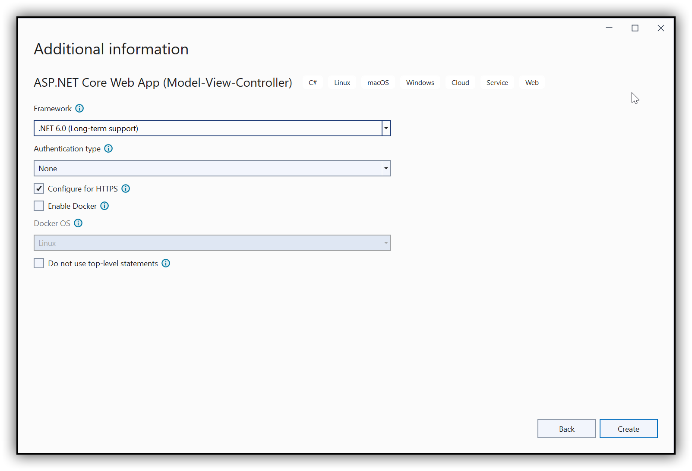
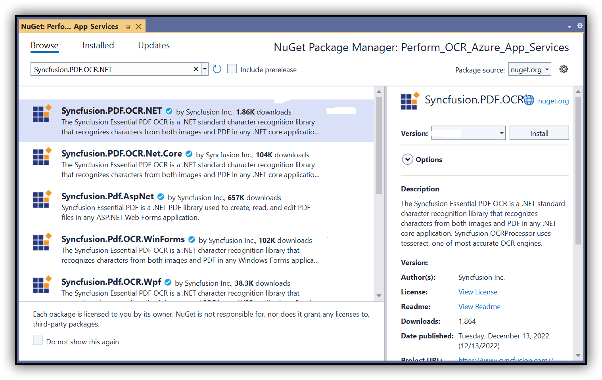
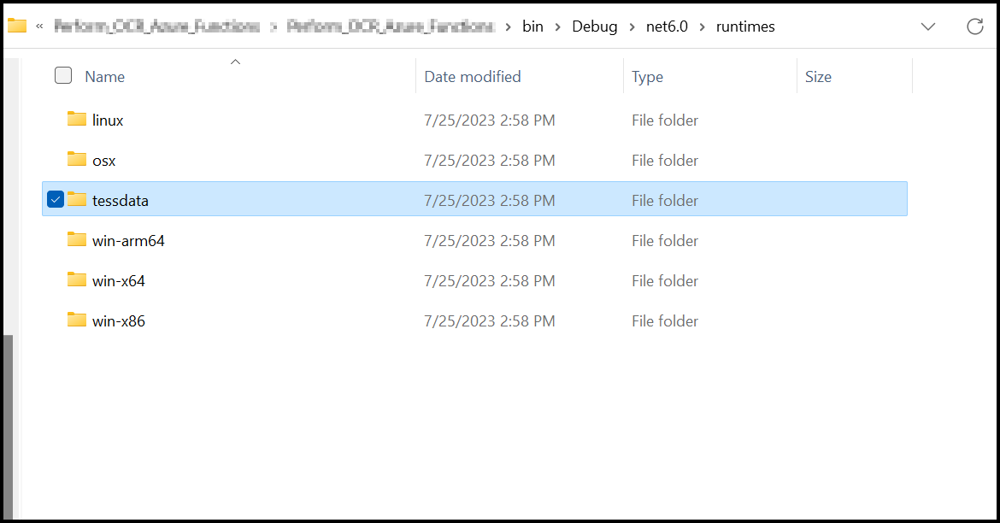
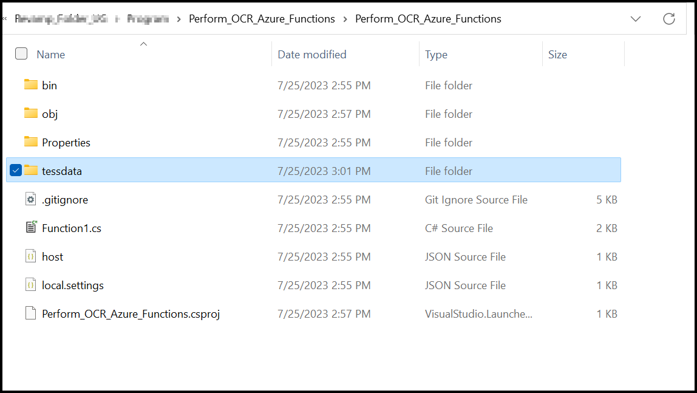
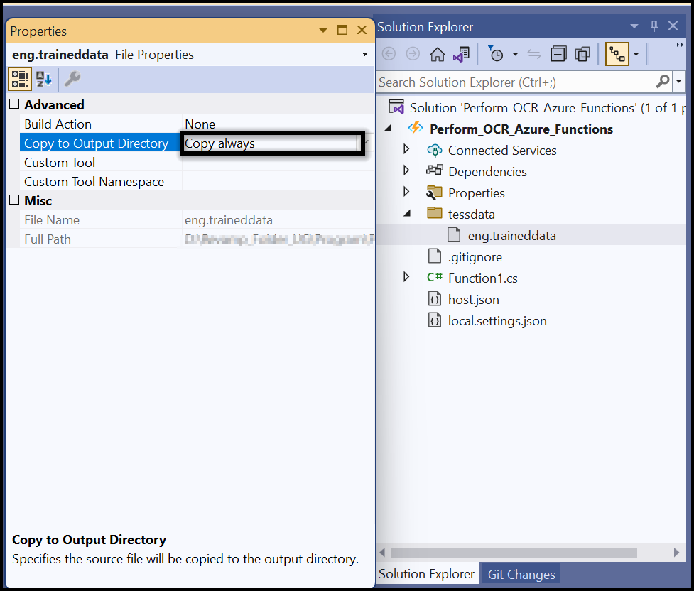

# Perform OCR in Azure using C#

The [Syncfusion .NET OCR library](https://www.syncfusion.com/document-processing/pdf-framework/net/pdf-library/ocr-process) is used to extract text from scanned PDFs and images in Azure with the help of Google's [Tesseract](https://github.com/tesseract-ocr/tesseract) Optical Character Recognition engine.

## Azure App Service Windows

### Steps to perform OCR on entire PDF document in Azure App Service

Step 1: Create a new ASP.NET Core MVC application.
 

Step 2: In configuration windows, name your project and click Next.
 
 

Step 3: Install the [Syncfusion.PDF.OCR.NET](https://www.nuget.org/packages/Syncfusion.PDF.OCR.NET) NuGet package as a reference to your .NET Core application [NuGet.org](https://www.nuget.org/).
 

N> 1. Beginning from version 21.1.x, the default configuration includes the addition of the TesseractBinaries and Tesseract language data folder paths, eliminating the requirement to explicitly provide these paths.
N> 2. Starting with v16.2.0.x, if you reference Syncfusion assemblies from trial setup or from the NuGet feed, you also have to add "Syncfusion.Licensing" assembly reference and include a license key in your projects. Please refer to this [link](https://help.syncfusion.com/common/essential-studio/licensing/overview) to know about registering Syncfusion license key in your application to use our components.

Step 4: Add a new button in index.cshtml as follows.



@{
    Html.BeginForm("PerformOCR", "Home", FormMethod.Get);
    {
         
        

            <input type="submit" value="Perform OCR" style="width:150px;height:27px" />
        

    }
    Html.EndForm();
}



Step 5: Include the following namespaces in the HomeController.cs file.



using Syncfusion.OCRProcessor;
using Syncfusion.Pdf.Parsing;
using Microsoft.AspNetCore.Hosting.IHostingEnvironment;



Step 6: Add the code samples for performing OCR on the entire PDF document using [PerformOCR](https://help.syncfusion.com/cr/file-formats/Syncfusion.OCRProcessor.OCRProcessor.html#Syncfusion_OCRProcessor_OCRProcessor_PerformOCR_Syncfusion_Pdf_Parsing_PdfLoadedDocument_System_String_) method of the [OCRProcessor](https://help.syncfusion.com/cr/file-formats/Syncfusion.OCRProcessor.OCRProcessor.html) class. 



public IActionResult PerformOCR()
{
    //Initialize the OCR processor.
    OCRProcessor processor = new OCRProcessor();
    //Load a PDF document.
    PdfLoadedDocument lDoc = new PdfLoadedDocument("Input.pdf");
    //Set OCR language to process.
    processor.Settings.Language = Languages.English;
    //Perform OCR with input document.
    string ocr = processor.PerformOCR(lDoc);
    //Save the document. 
    MemoryStream stream = new MemoryStream();
    lDoc.Save(stream);
    return File(stream.ToArray(), System.Net.Mime.MediaTypeNames.Application.Pdf, "OCR_Azure.pdf");
}



Step 7: Now, check the OCR creation in the local machine.

### Steps to publish as Azure App Service

Step 1: Right-click the project and click Publish.
   

Step 2: Create a new profile in the publish target window.
   
     

Step 3: Create an App Service using an Azure subscription and select a hosting plan based on the environment.
  

Step 4: Configure the Hosting plan.
  

Step 5: After creating a profile, click Publish.
  

Now, the published webpage will open in the browser, then click the **Perform OCR** button then perform OCR on a PDF document.
 
 

A complete work sample for performing OCR on a PDF document in Azure App Service on Windows can be downloaded from [GitHub](https://github.com/SyncfusionExamples/OCR-csharp-examples/tree/master/Azure/Azure%20App%20Services).

## Azure Functions

### Steps to perform OCR on the entire PDF document in Azure Functions

Step 1: Create the Azure function project.
 

Step 2: Select the framework to Azure Functions and select HTTP triggers as follows.
 
 

Step 3: Install the [Syncfusion.PDF.OCR.NET](https://www.nuget.org/packages/Syncfusion.PDF.OCR.NET) NuGet package as a reference to your .NET Core application [NuGet.org](https://www.nuget.org/).
 

Step 4: Copy the tessdata folder from the **bin->Debug->net6.0->runtimes** and paste it into the folder that contains the project file.
 

Step 5: Then, set Copy to output directory to give copy always the tessdata folder.

Step 6: Include the following namespaces in the **Function1.cs** file to perform OCR for a PDF document using C#.



using System;
using System.IO;
using System.Threading.Tasks;
using Syncfusion.OCRProcessor;
using Syncfusion.Pdf.Graphics;
using Syncfusion.Pdf;
using System.Net.Http;
using Syncfusion.Pdf.Parsing;
using System.Net.Http.Headers;
using System.Net;
using Microsoft.Azure.WebJobs.Host;
using Microsoft.Azure.WebJobs;
using Microsoft.Azure.WebJobs.Extensions.Http;



Step 7: Add the following code sample in the Function1 class to perform OCR for a PDF document using [PerformOCR](https://help.syncfusion.com/cr/file-formats/Syncfusion.OCRProcessor.OCRProcessor.html#Syncfusion_OCRProcessor_OCRProcessor_PerformOCR_Syncfusion_Pdf_Parsing_PdfLoadedDocument_System_String_) method of the [OCRProcessor](https://help.syncfusion.com/cr/file-formats/Syncfusion.OCRProcessor.OCRProcessor.html) class in Azure Functions.



[FunctionName("Function1")]
public static async Task<HttpResponseMessage> Run([HttpTrigger(AuthorizationLevel.Function, "get", "post", Route = null)] HttpRequestMessage req, TraceWriter log, ExecutionContext executionContext)
{
    MemoryStream ms = new MemoryStream();
    try
    {
        OCRProcessor processor = new OCRProcessor();
        FileStream stream = new FileStream(Path.Combine(executionContext.FunctionAppDirectory, "Data", "Input.pdf"), FileMode.Open);
        //Load a PDF document.
        PdfLoadedDocument lDoc = new PdfLoadedDocument(stream);
        //Set OCR language to process.
        processor.Settings.Language = Languages.English;
        //Perform OCR with input document.
        string ocr = processor.PerformOCR(lDoc,Path.Combine(executionContext.FunctionAppDirectory, "tessdata"));            
        //Save the PDF document.  
        lDoc.Save(ms);
        ms.Position = 0;
    }
    catch (Exception ex)
    {
        //Add a page to the document.
        PdfDocument document = new PdfDocument();
        PdfPage page = document.Pages.Add();
        //Create PDF graphics for the page.
        PdfGraphics graphics = page.Graphics;
        //Set the standard font.
        PdfFont font = new PdfStandardFont(PdfFontFamily.Helvetica, 6);
        //Draw the text.
        graphics.DrawString(ex.ToString(), font, PdfBrushes.Black, new Syncfusion.Drawing.PointF(0, 0));
        ms = new MemoryStream();
        //Save the PDF document.  
        document.Save(ms);
    }
    HttpResponseMessage response = new HttpResponseMessage(HttpStatusCode.OK);
    response.Content = new ByteArrayContent(ms.ToArray());
    response.Content.Headers.ContentDisposition = new ContentDispositionHeaderValue("attachment")
    {
        FileName = "Output.pdf"
    };
    response.Content.Headers.ContentType = new System.Net.Http.Headers.MediaTypeHeaderValue("application/pdf");
    return response;
}



Step 8: Now, check the OCR creation in the local machine.

### Steps to publish as Azure Functions 

Step 1: Right-click the project and click Publish. Then, create a new profile in the Publish Window. So, create the Azure Function App with a consumption plan.

Step 2: After creating the profile, click Publish.

Step 3: Now, publish has been succeeded.

Step 4: Now, go to the Azure portal and select the Functions Apps. After running the service, click Get function URL > Copy. Include the URL as a query string in the URL. Then, paste it into the new browser tab. You will get a PDF document as follows.
 

A complete working sample can be downloaded from [GitHub](https://github.com/SyncfusionExamples/OCR-csharp-examples/tree/master/Azure/Azure%20Function).

Click [here](https://www.syncfusion.com/document-processing/pdf-framework/net-core) to explore the rich set of Syncfusion PDF library features.