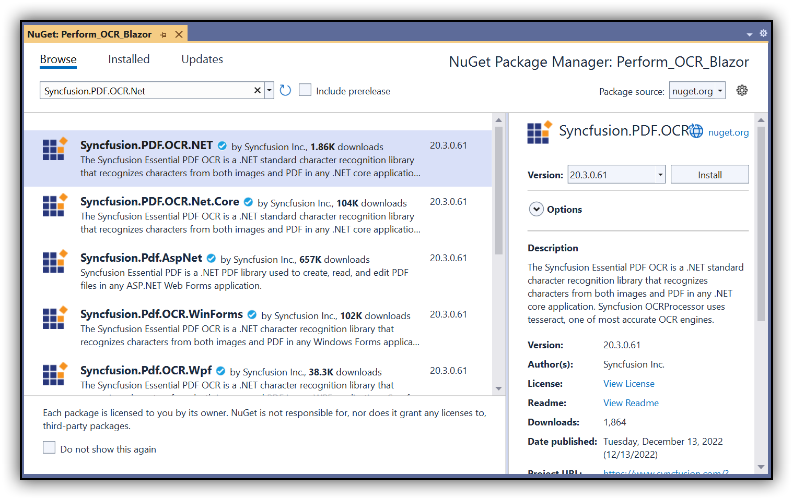

# Perform OCR on a PDF document in Blazor

The Syncfusion Essential PDF is a .NET PDF library that supports OCR by using the Tesseract open-source engine in Blazor application.

## Steps to perform OCR on a PDF document in Blazor application

Step 1: Create a new C# Blazor Server application project. Select Blazor App from the template and click the Next button.

In the project configuration window, name your project and select Create.

Step 2: Install the [Syncfusion.PDF.OCR.NET](https://www.nuget.org/packages/Syncfusion.PDF.OCR.NET) NuGet package as a reference to your Blazor Server application from [NuGet.org](https://www.nuget.org/).

Step 3: Tesseract assemblies are not added as a reference. They must be kept in the local machine, and the location of the assemblies is passed as a parameter to the OCR processor.



OCRProcessor processor = new OCRProcessor(@"Tesseractbinaries/Windows");



Step 4: Place the Tesseract language data {E.g eng.traineddata} in the local system and provide a path to the OCR processor. Please use the OCR language data for other languages using the following link,
https://github.com/tesseract-ocr/tessdata



OCRProcessor processor = new OCRProcessor(@"Tesseractbinaries/Windows");
processor.PerformOCR(lDoc, "tessdata/");



Step 5: Create a new class file named ExportService under Data folder and include the following namespaces in the file.



using Syncfusion.OCRProcessor;
using Syncfusion.Pdf.Parsing;
using System.IO;



Step 6: Use the following code sample to perform OCR in the ExportService class.



public MemoryStream CreatePdf()
{
    string docPath = Path.GetFullPath("wwwroot/Data/Input.pdf");
    string tesseractPath = Path.GetFullPath("wwwroot/Data/Tesseractbinaries/Windows");            
    //Initialize the OCR processor by providing the path of tesseract binaries(SyncfusionTesseract.dll and liblept168.dll)
    using (OCRProcessor processor = new OCRProcessor(tesseractPath))
    {
        FileStream fileStream = new FileStream(docPath, FileMode.Open, FileAccess.Read);
        //Load a PDF document
        PdfLoadedDocument lDoc = new PdfLoadedDocument(fileStream);
        //Set OCR language to process
        processor.Settings.Language = Languages.English;
        string tessdataPath = Path.GetFullPath("wwwroot/Data/tessdata");
        //Process OCR by providing the PDF document and Tesseract data
        processor.PerformOCR(lDoc, tessdataPath);
        //Create memory stream.
        MemoryStream stream = new MemoryStream();
        //Save the document to memory stream.
        lDoc.Save(stream);
        return stream;
    }
}



Step 7: Register your service in the ConfigureServices method available in the Startup.cs class as follows.



public void ConfigureServices(IServiceCollection services)
{
    services.AddRazorPages();
    services.AddServerSideBlazor();
    services.AddSingleton<WeatherForecastService>();
    services.AddSingleton<ExportService>();
}



Step 8: Inject ExportService into FetchData.razor using the following code.



@inject ExportService exportService
@inject Microsoft.JSInterop.IJSRuntime JS
@using  System.IO;



Step 9: Create a button in the FetchData.razor using the following code.



<button class="btn btn-primary" @onclick="@PerformOCR">Perform OCR</button>



Step 10: Add the PerformOCR method in FetchData.razor page to call the export service.



@functions
{
   protected async Task PerformOCR()
   {
       ExportService exportService = new ExportService();
       using (MemoryStream excelStream = exportService.CreatePdf())
       {
           await JS.SaveAs("Output.pdf", excelStream.ToArray());
       }
   }
}



Step 11: Create a class file with FileUtil name and add the following code to invoke the JavaScript action to download the file in the browser.



public static class FileUtil
{
    public static ValueTask<object> SaveAs(this IJSRuntime js, string filename, byte[] data)
     => js.InvokeAsync<object>(
         "saveAsFile",
         filename,
         Convert.ToBase64String(data));
}



Step 12: Add the following JavaScript function in the _Host.cshtml available under the Pages folder.





By executing the program, you will get the following output in the browser.

Click the button, and you will get the PDF document with the following output.

    
A complete working sample can be downloaded from Github.
    