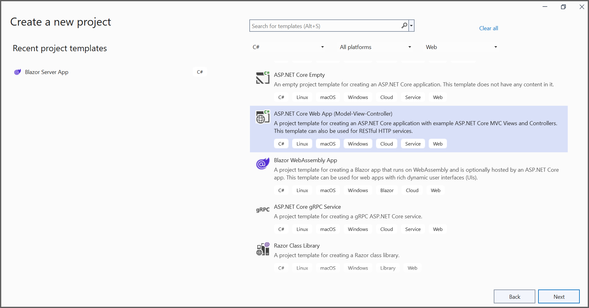
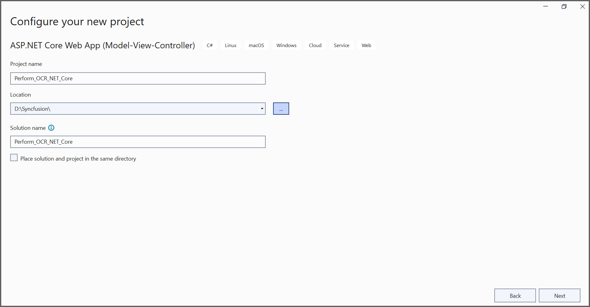
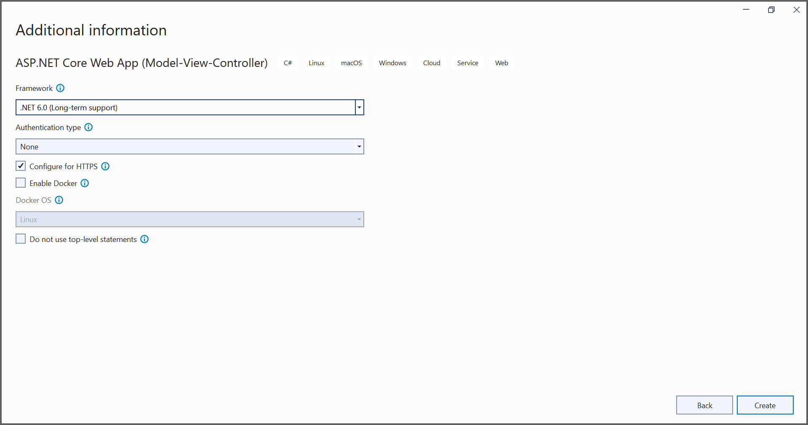
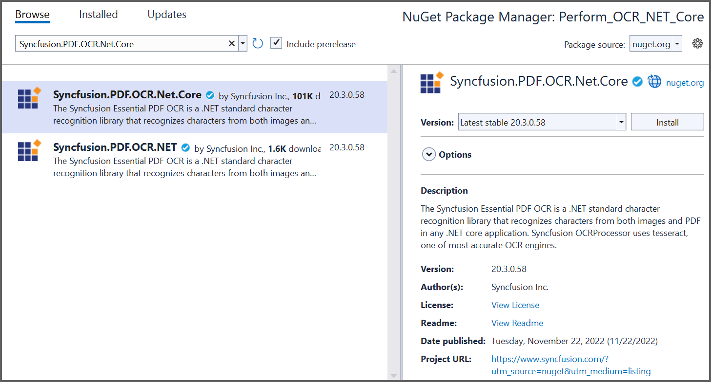

# How to Perform OCR on a PDF Document Using ASP.NET Core

Optical Character Recognition (OCR) is a technology that converts scanned paper documents from PDF files or images into searchable and editable data.

The [Syncfusion OCR processor library](https://www.syncfusion.com/document-processing/pdf-framework/net/pdf-library/ocr-process) has extended support to process OCR on scanned PDF documents and other scanned images in the .NET Core platform with the help of the [Tesseract](https://github.com/tesseract-ocr/tesseract) OCR engine. 

## Steps to perform OCR on a PDF document programmatically

1.Create a new C# ASP.NET Core Web application project. 
  

2.In the project configuration window, name your project and select <b>Next</b>.
  
  

3.Install the [Syncfusion.PDF.OCR.Net.Core](https://www.nuget.org/packages/Syncfusion.PDF.OCR.Net.Core/) NuGet package as a reference to your .NET Standard application from [nuget.org](https://www.nuget.org/).  
  

4.Tesseract assemblies are not added as a reference. They must be kept in the local machine, and the location of the assemblies is passed as a parameter to the OCR processor.
  



OCRProcessor processor = new OCRProcessor(@"TesseractBinaries\")



  

5.Place the Tesseract language data {E.g eng.traineddata} in the local system and provide a path to the OCR processor. Please use the OCR language data for other languages using the following link, 
https://github.com/tesseract-ocr/tessdata 

  



OCRProcessor processor = new OCRProcessor("Tesseractbinaries\");
processor.PerformOCR(loadedDocument, "tessdata/");



  

6.A default action method named Index will be present in HomeController.cs. Right-click on Index method and select <b>Go to View</b>, where you will be directed to its associated view page Index.cshtml.
7.Add a new button in the Index.cshtml as shown below.



@{Html.BeginForm("PerformOCR", "Home", FormMethod.Get);
    {
        

            <input type="submit" value="Perform OCR on entire PDF" style="width:200px;height:27px" />
        

    }
    Html.EndForm();
}



8.A default controller with name HomeController.cs is added to the creation of ASP.NET Core project. Include the following namespaces in that HomeController.cs file.
  



using Syncfusion.Pdf.Parsing;
using Syncfusion.OCRProcessor;
using System.Drawing;



   

10.Use the following code sample to perform OCR in the ASP.NET Core application.
  



//Load PDF document as stream
string docPath = _hostingEnvironment.WebRootPath + "/Data/Input.pdf";
FileStream docStream = new FileStream(docPath, FileMode.Open, FileAccess.Read);
//Load the PDF document 
PdfLoadedDocument loadedDocument = new PdfLoadedDocument(docStream);
string tesseractPath = _hostingEnvironment.WebRootPath + "/Data/Tesseractbinaries/Windows";
//Initialize the OCR processor by providing the path of tesseract binaries
using (OCRProcessor processor = new OCRProcessor(tesseractPath))
{
    //Language to process the OCR
    processor.Settings.Language = Languages.English;

    string tessdataPath = _hostingEnvironment.WebRootPath + "/Data/tessdata/";
    //Process OCR by providing loaded PDF document, Data dictionary and language
    processor.PerformOCR(loadedDocument, tessdataPath);
}
//Saving the PDF to the MemoryStream
MemoryStream stream = new MemoryStream();
loadedDocument.Save(stream);
//Close the PDF document 
loadedDocument.Close(true);
//Set the position as '0'
stream.Position = 0;
//Download the PDF document in the browser
FileStreamResult fileStreamResult = new FileStreamResult(stream, "application/pdf");
fileStreamResult.FileDownloadName = "Sample.pdf";
return fileStreamResult;



 

A complete working sample can be downloaded from [GitHub]().

By executing the program, you will get the text file (contains extracted text) as follows. 

