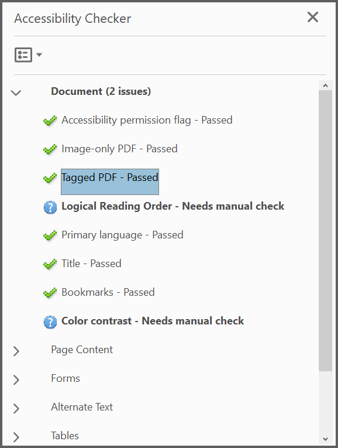

# Working with Tagged PDF

## Introduction

The Tagged PDF is a PDF that includes structure in terms for a set of instruction that defines reading order and meaning of significant elements such as figures, images, lists, tables and more. Tagged PDF documents created using Syncfusion PDF library are compliant with section 508 (PDF/UA) standard or WCAG 2.0 standard (ISO 14289-1:2014).
Usually tagged PDF used to making content accessible to users who rely on assistive technology.

This section explains how to add tags to PDF elements such as text element, image, shapes, form fields, annotations, table, list, and more

## Adding tag to text element

You can add tag to text or paragraphs in PDF document by using the [PdfTag](https://help.syncfusion.com/cr/file-formats/Syncfusion.Pdf.Graphics.PdfLayoutElement.html#Syncfusion_Pdf_Graphics_PdfLayoutElement_PdfTag) property available in the [PdfTextElement](https://help.syncfusion.com/cr/file-formats/Syncfusion.Pdf.Graphics.PdfTextElement.html) class and specifying the tag type as ```Paragraph``` of [PdfTagType](https://help.syncfusion.com/cr/file-formats/Syncfusion.Pdf.PdfTagType.html) Enum in the [PdfStructureElement](https://help.syncfusion.com/cr/file-formats/Syncfusion.Pdf.PdfStructureElement.html) class.

The following code sample explains you how to add tag for the text element in PDF document.




//Creates new PDF document
PdfDocument doc = new PdfDocument();

//Set the document title
doc.DocumentInformation.Title = "PdfTextElement";

//Creates new page
PdfPage page = doc.Pages.Add();

//Initialize the structure element with tag type paragraph
PdfStructureElement structureElement = new PdfStructureElement(PdfTagType.Paragraph);

//represents the text that is exact replacement for PdfTextElement
structureElement.ActualText = "Simple paragraph element";

string text = "Adventure Works Cycles, the fictitious company on which the AdventureWorks sample databases are based, is a large, multinational manufacturing company. The company manufactures and sells metal and composite bicycles to North American, European and Asian commercial markets. While its base operation is located in Washington with 290 employees, several regional sales teams are located throughout their market base.";

//Initialize the PDF text element
PdfTextElement element = new PdfTextElement(text);

//Adding tag to the text element
element.PdfTag = structureElement;

//Creates font for the text element
element.Font = new PdfStandardFont(PdfFontFamily.TimesRoman, 12);

element.Brush = new PdfSolidBrush(new PdfColor(89, 89, 93));

//Draws text
PdfLayoutResult result = element.Draw(page, new RectangleF(0, 0, page.Graphics.ClientSize.Width, 200));

//Save the document and dispose it
doc.Save("Output.pdf");

doc.Close(true);




'Creates new PDF document
Dim doc As PdfDocument = New PdfDocument()

'Set the document title
doc.DocumentInformation.Title = "PdfTextElement"

'Creates new page
Dim page As PdfPage = doc.Pages.Add()

'Initialize the structure element with tag type paragraph
Dim structureElement As PdfStructureElement = New PdfStructureElement(PdfTagType.Paragraph)

'represents the text that is exact replacement for PdfTextElement
structureElement.ActualText = "Simple paragraph element"

Dim text As String = "Adventure Works Cycles, the fictitious company on which the AdventureWorks sample databases are based, is a large, multinational manufacturing company. The company manufactures and sells metal and composite bicycles to North American, European and Asian commercial markets. While its base operation is located in Washington with 290 employees, several regional sales teams are located throughout their market base."

'Initialize the PDF text element
Dim element As PdfTextElement = New PdfTextElement(text)

'Adding tag to the text element
element.PdfTag = structureElement

'Creates font for the text element
element.Font = New PdfStandardFont(PdfFontFamily.TimesRoman, 12)

element.Brush = New PdfSolidBrush(New PdfColor(89, 89, 93))

'Draws text
Dim result As PdfLayoutResult = element.Draw(page, New RectangleF(0, 0, page.Graphics.ClientSize.Width, 200))

'Save the document and dispose it
doc.Save("Output.pdf")

doc.Close(True)



  

//Creates new PDF document
PdfDocument doc = new PdfDocument();

//Set the document title
doc.DocumentInformation.Title = "PdfTextElement";

//Creates new page
PdfPage page = doc.Pages.Add();

//Initialize the structure element with tag type paragraph.
PdfStructureElement structureElement = new PdfStructureElement(PdfTagType.Paragraph);

//Represents the text that is exact replacement for PdfTextElement
structureElement.ActualText = "Simple paragraph element";

string text = "Adventure Works Cycles, the fictitious company on which the AdventureWorks sample databases are based, is a large, multinational manufacturing company. The company manufactures and sells metal and composite bicycles to North American, European and Asian commercial markets. While its base operation is located in Washington with 290 employees, several regional sales teams are located throughout their market base.";

//Initialize the PDF text element
PdfTextElement element = new PdfTextElement(text);

//Adding tag to the text element
element.PdfTag = structureElement;

//Creates font for the text element
element.Font = new PdfStandardFont(PdfFontFamily.TimesRoman, 12);

element.Brush = new PdfSolidBrush(new PdfColor(89, 89, 93));

//Draws text
PdfLayoutResult result = element.Draw(page, new RectangleF(0, 0, page.Graphics.ClientSize.Width, 200));

//Save the PDF document to stream
MemoryStream stream = new MemoryStream();

await doc.SaveAsync(stream);

//Close the document
doc.Close(true);

//Save the stream as PDF document file in local machine. Refer to the PDF/UWP section for respective code samples
Save(stream, "Output.pdf");





//Creates new PDF document
PdfDocument doc = new PdfDocument();

//Set the document title
doc.DocumentInformation.Title = "PdfTextElement";

//Creates new page
PdfPage page = doc.Pages.Add();

//Initialize the structure element with tag type paragraph
PdfStructureElement structureElement = new PdfStructureElement(PdfTagType.Paragraph);

//Represents the text that is exact replacement for PdfTextElement
structureElement.ActualText = "Simple paragraph element";

string text = "Adventure Works Cycles, the fictitious company on which the AdventureWorks sample databases are based, is a large, multinational manufacturing company. The company manufactures and sells metal and composite bicycles to North American, European and Asian commercial markets. While its base operation is located in Washington with 290 employees, several regional sales teams are located throughout their market base.";

//Initialize the PDF text element
PdfTextElement element = new PdfTextElement(text);

//Adding tag to the text element
element.PdfTag = structureElement;

//Creates font for the text element
element.Font = new PdfStandardFont(PdfFontFamily.TimesRoman, 12);

element.Brush = new PdfSolidBrush(new PdfColor(89, 89, 93));

//Draws text
PdfLayoutResult result = element.Draw(page, new RectangleF(0, 0, page.Graphics.ClientSize.Width, 200));

//Save the document into stream
MemoryStream stream = new MemoryStream();

doc.Save(stream);

stream.Position = 0;

//Closes the document
doc.Close(true);

//Defining the ContentType for PDF file
string contentType = "application/pdf";

//Define the file name
string fileName = "Output.pdf";

//Creates a FileContentResult object by using the file contents, content type, and file name
return File(stream, contentType, fileName);





//Creates new PDF document
PdfDocument doc = new PdfDocument();

//Set the document title
doc.DocumentInformation.Title = "PdfTextElement";

//Creates new page
PdfPage page = doc.Pages.Add();

//Initialize the structure element with tag type paragraph
PdfStructureElement structureElement = new PdfStructureElement(PdfTagType.Paragraph);

//represents the text that is exact replacement for PdfTextElement
structureElement.ActualText = "Simple paragraph element";

string text = "Adventure Works Cycles, the fictitious company on which the AdventureWorks sample databases are based, is a large, multinational manufacturing company. The company manufactures and sells metal and composite bicycles to North American, European and Asian commercial markets. While its base operation is located in Washington with 290 employees, several regional sales teams are located throughout their market base.";

//Initialize the PDF text element
PdfTextElement element = new PdfTextElement(text);

//Adding tag to the text element.
element.PdfTag = structureElement;

//Creates font for the text element
element.Font = new PdfStandardFont(PdfFontFamily.TimesRoman, 12);

element.Brush = new PdfSolidBrush(new PdfColor(89, 89, 93));

//Draws text
PdfLayoutResult result = element.Draw(page, new RectangleF(0, 0, page.Graphics.ClientSize.Width, 200));

//Save the document into stream
MemoryStream stream = new MemoryStream();

doc.Save(stream);

//Close the document
doc.Close(true);

//Save the stream into PDF file
//The operation in Save under Xamarin varies between Windows Phone, Android and iOS platforms. Please refer PDF/Xamarin section for respective code samples.
if (Device.OS == TargetPlatform.WinPhone || Device.OS == TargetPlatform.Windows)
{
    Xamarin.Forms.DependencyService.Get<ISaveWindowsPhone>().Save("Output.pdf", "application/pdf", stream);
}
else
{
    Xamarin.Forms.DependencyService.Get<ISave>().Save("Output.pdf", "application/pdf", stream);
}





## Adding tag to image

You can add tag to image in the PDF document by using the [PdfTag](https://help.syncfusion.com/cr/file-formats/Syncfusion.Pdf.Graphics.PdfLayoutElement.html#Syncfusion_Pdf_Graphics_PdfLayoutElement_PdfTag) property available in the [PdfBitmap](https://help.syncfusion.com/cr/file-formats/Syncfusion.Pdf.Graphics.PdfBitmap.html) class and specifying the tag type as ```Figure``` of [PdfTagType](https://help.syncfusion.com/cr/file-formats/Syncfusion.Pdf.PdfTagType.html) Enum in the [PdfStructureElement](https://help.syncfusion.com/cr/file-formats/Syncfusion.Pdf.PdfStructureElement.html) class. You can add alternate text to image by using the the [AlternateText](https://help.syncfusion.com/cr/file-formats/Syncfusion.Pdf.PdfStructureElement.html#Syncfusion_Pdf_PdfStructureElement_AlternateText) property available in the ```PdfStructureElement``` class.

The following code explains how to add tag for image element in PDF document.




//Creates new PDF document
PdfDocument doc = new PdfDocument();

//Set the document title
doc.DocumentInformation.Title = "Image";

//Creates new page
PdfPage page = doc.Pages.Add();

//Draw string
page.Graphics.DrawString("JPEG Image:", new PdfStandardFont(PdfFontFamily.Helvetica, 12, PdfFontStyle.Bold), PdfBrushes.Blue, new PointF(0, 0));

//Create a new PDF bitmap object
PdfBitmap bitmap = new PdfBitmap("syncfusion.jpg");

//Set the tag type
PdfStructureElement imageElement = new PdfStructureElement(PdfTagType.Figure);

//Set the alternate text
imageElement.AlternateText = "GreenTree";

//adding tag to the PDF image
bitmap.PdfTag = imageElement;

//Draw image
bitmap.Draw(page.Graphics, new PointF(50, 20));

//Save the document and dispose it
doc.Save("Image.pdf");

doc.Close(true);




'Creates new PDF document
Dim doc As PdfDocument = New PdfDocument()

'Set the document title
doc.DocumentInformation.Title = "Image"

'Creates new page
Dim page As PdfPage = doc.Pages.Add()

'Draw string
page.Graphics.DrawString("JPEG Image:", New PdfStandardFont(PdfFontFamily.Helvetica, 12, PdfFontStyle.Bold), PdfBrushes.Blue, New PointF(0, 0))

'Create a new PDF bitmap object
Dim bitmap As PdfBitmap = New PdfBitmap("syncfusion.jpg")

'Set the tag type
Dim imageElement As PdfStructureElement = New PdfStructureElement(PdfTagType.Figure)

'Set the alternate text
imageElement.AlternateText = "GreenTree"

'adding tag to the PDF image
bitmap.PdfTag = imageElement

'Draw image
bitmap.Draw(page.Graphics, New PointF(50, 20))

'Save the document and dispose it
doc.Save("Image.pdf")

doc.Close(True) 



  

//Creates new PDF document
PdfDocument doc = new PdfDocument();

//Set the document title
doc.DocumentInformation.Title = "Image";

//Creates new page
PdfPage page = doc.Pages.Add();

//Draw string
page.Graphics.DrawString("JPEG Image:", new PdfStandardFont(PdfFontFamily.Helvetica, 12, PdfFontStyle.Bold), PdfBrushes.Blue, new PointF(0, 0));

//Load the image as stream
Stream imageStream = typeof(MainPage).GetTypeInfo().Assembly.GetManifestResourceStream("Sample.Assets.Data.syncfusion.jpg");

//Create a new PDF bitmap object
PdfBitmap bitmap = new PdfBitmap(imageStream);

//Set the tag type
PdfStructureElement imageElement = new PdfStructureElement(PdfTagType.Figure);

//Set the alternate text
imageElement.AlternateText = "GreenTree";

//Adding tag to the PDF image
bitmap.PdfTag = imageElement;

//Draw image
bitmap.Draw(page.Graphics, new PointF(50, 20));

//Save the PDF document to stream

MemoryStream stream = new MemoryStream();

await doc.SaveAsync(stream);

//Close the document

doc.Close(true);

//Save the stream as PDF document file in local machine. Refer to the PDF/UWP section for respective code samples

Save(stream, "Image.pdf");





//Creates new PDF document
PdfDocument doc = new PdfDocument();

//Set the document title
doc.DocumentInformation.Title = "Image";

//Creates new page
PdfPage page = doc.Pages.Add();

//Draw string
page.Graphics.DrawString("JPEG Image:", new PdfStandardFont(PdfFontFamily.Helvetica, 12, PdfFontStyle.Bold), PdfBrushes.Blue, new PointF(0, 0));

//Load the image as stream
FileStream imageStream = new FileStream("syncfusion.jpg", FileMode.Open, FileAccess.Read);

//Create a new PDF bitmap object
PdfBitmap bitmap = new PdfBitmap(imageStream);

//Set the tag type
PdfStructureElement imageElement = new PdfStructureElement(PdfTagType.Figure);

//Set the alternate text
imageElement.AlternateText = "GreenTree";

//adding tag to the PDF image
bitmap.PdfTag = imageElement;

//Draw image
bitmap.Draw(page.Graphics, new PointF(50, 20));

//Save the document into stream

MemoryStream stream = new MemoryStream();

doc.Save(stream);

stream.Position = 0;

//Closes the document

doc.Close(true);

//Defining the ContentType for PDF file

string contentType = "application/pdf";

//Define the file name

string fileName = "Image.pdf";

//Creates a FileContentResult object by using the file contents, content type, and file name

return File(stream, contentType, fileName);





//Creates new PDF document
PdfDocument doc = new PdfDocument();

//Set the document title
doc.DocumentInformation.Title = "Image";

//Creates new page
PdfPage page = doc.Pages.Add();

//Draw string
page.Graphics.DrawString("JPEG Image:", new PdfStandardFont(PdfFontFamily.Helvetica, 12, PdfFontStyle.Bold), PdfBrushes.Blue, new PointF(0, 0));

//Load the file as stream
Stream imageStream = typeof(App).GetTypeInfo().Assembly.GetManifestResourceStream("Sample.Assets.syncfusion.jpg");

//Create a new PDF bitmap object
PdfBitmap bitmap = new PdfBitmap(imageStream);

//Set the tag type
PdfStructureElement imageElement = new PdfStructureElement(PdfTagType.Figure);

//Set the alternate text
imageElement.AlternateText = "GreenTree";

//adding tag to the PDF image
bitmap.PdfTag = imageElement;

//Draw image
bitmap.Draw(page.Graphics, new PointF(50, 20));

//Save the document into stream

MemoryStream stream = new MemoryStream();

doc.Save(stream);

//Close the document

doc.Close(true);

//Save the stream into PDF file
//The operation in Save under Xamarin varies between Windows Phone, Android and iOS platforms. Please refer PDF/Xamarin section for respective code samples.
if (Device.OS == TargetPlatform.WinPhone || Device.OS == TargetPlatform.Windows)
{
    Xamarin.Forms.DependencyService.Get<ISaveWindowsPhone>().Save("Image.pdf", "application/pdf", stream);
}
else
{
    Xamarin.Forms.DependencyService.Get<ISave>().Save("Image.pdf", "application/pdf", stream);
}





## Adding tag to shapes

You can add tag to shapes such as rectangle, line, circle, polygon, and more by using the [PdfTag](https://help.syncfusion.com/cr/file-formats/Syncfusion.Pdf.Graphics.PdfLayoutElement.html#Syncfusion_Pdf_Graphics_PdfLayoutElement_PdfTag) property and specifying the tag type as ```Figure``` of [PdfTagType](https://help.syncfusion.com/cr/file-formats/Syncfusion.Pdf.PdfTagType.html) Enum. You can add alternate text to shapes by using the the [AlternateText](https://help.syncfusion.com/cr/file-formats/Syncfusion.Pdf.PdfStructureElement.html#Syncfusion_Pdf_PdfStructureElement_AlternateText) property available in the [PdfStructureElement](https://help.syncfusion.com/cr/file-formats/Syncfusion.Pdf.PdfStructureElement.html) class.

The following code explains how to add tag for shape element in the PDF document.




//Creates new PDF document
PdfDocument doc = new PdfDocument();

//Set the document title
doc.DocumentInformation.Title = "LineShape";

//Add new page
PdfPage page = doc.Pages.Add();

//Draw text
page.Graphics.DrawString("Line Shape:", new PdfStandardFont(PdfFontFamily.Helvetica, 12, PdfFontStyle.Bold), PdfBrushes.Blue, new PointF(30, 80));

//Initialize structure element with tag type as Figure
PdfStructureElement element = new PdfStructureElement(PdfTagType.Figure);

//Set alternate text
element.AlternateText = "Line Sample";

//Initialize the line shape
PdfLine line = new PdfLine(100, 100, 100, 300);

line.Pen = new PdfPen(Color.Red);

//Adding tag to the line element
line.PdfTag = element;

//Draws the line
line.Draw(page.Graphics);

//Save the document and dispose it
doc.Save("Output.pdf"); 




'Creates new PDF document
Dim doc As PdfDocument = New PdfDocument()

'Set the document title
doc.DocumentInformation.Title = "LineShape"

'Add new page
Dim page As PdfPage = doc.Pages.Add()

'Draw text
page.Graphics.DrawString("Line Shape:", New PdfStandardFont(PdfFontFamily.Helvetica, 12, PdfFontStyle.Bold), PdfBrushes.Blue, New PointF(30, 80))

'Initialize structure element with tag type as Figure
Dim element As PdfStructureElement = New PdfStructureElement(PdfTagType.Figure)

'Set alternate text
element.AlternateText = "Line Sample"

'Initialize the line shape
Dim line As PdfLine = New PdfLine(100, 100, 100, 300)

line.Pen = New PdfPen(Color.Red)

'Adding tag to the line element
line.PdfTag = element

'Draws the line
line.Draw(page.Graphics)

'Save the document and dispose it
doc.Save("Output.pdf")



  

//Creates new PDF document
PdfDocument doc = new PdfDocument();

//Set the document title
doc.DocumentInformation.Title = "LineShape";

//Add new page
PdfPage page = doc.Pages.Add();

//Draw text
page.Graphics.DrawString("Line Shape:", new PdfStandardFont(PdfFontFamily.Helvetica, 12, PdfFontStyle.Bold), PdfBrushes.Blue, new PointF(30, 80));

//Initialize structure element with tag type as Figure
PdfStructureElement element = new PdfStructureElement(PdfTagType.Figure);

//Set alternate text
element.AlternateText = "Line Sample";

//Initialize the line shape
PdfLine line = new PdfLine(100, 100, 100, 300);

line.Pen = new PdfPen(new PdfColor(255, 0, 0));

//Adding tag to the line element
line.PdfTag = element;

//Draws the line
line.Draw(page.Graphics);

//Save the PDF document to stream
MemoryStream stream = new MemoryStream();

await doc.SaveAsync(stream);

//Close the document
doc.Close(true);

//Save the stream as PDF document file in local machine. Refer to the PDF/UWP section for respective code samples
Save(stream, "Output.pdf");





//Creates new PDF document
PdfDocument doc = new PdfDocument();

//Set the document title
doc.DocumentInformation.Title = "LineShape";

//Add new page
PdfPage page = doc.Pages.Add();

//Draw text
page.Graphics.DrawString("Line Shape:", new PdfStandardFont(PdfFontFamily.Helvetica, 12, PdfFontStyle.Bold), PdfBrushes.Blue, new PointF(30, 80));

//Initialize structure element with tag type as figure
PdfStructureElement element = new PdfStructureElement(PdfTagType.Figure);

//Set alternate text
element.AlternateText = "Line Sample";

//Initialize the line shape
PdfLine line = new PdfLine(100, 100, 100, 300);

line.Pen = new PdfPen(Color.Red);

//Adding tag to the line element
line.PdfTag = element;

//Draws the line
line.Draw(page.Graphics);

//Save the document into stream

MemoryStream stream = new MemoryStream();

doc.Save(stream);

stream.Position = 0;

//Closes the document

doc.Close(true);

//Defining the ContentType for PDF file

string contentType = "application/pdf";

//Define the file name

string fileName = "Output.pdf";

//Creates a FileContentResult object by using the file contents, content type, and file name

return File(stream, contentType, fileName);





//Creates new PDF document
PdfDocument doc = new PdfDocument();

//Set the document title
doc.DocumentInformation.Title = "LineShape";

//Add new page
PdfPage page = doc.Pages.Add();

//Draw text
page.Graphics.DrawString("Line Shape:", new PdfStandardFont(PdfFontFamily.Helvetica, 12, PdfFontStyle.Bold), PdfBrushes.Blue, new PointF(30, 80));

//Initialize structure element with tag type as figure
PdfStructureElement element = new PdfStructureElement(PdfTagType.Figure);

//Set alternate text
element.AlternateText = "Line Sample";

//Initialize the line shape
PdfLine line = new PdfLine(100, 100, 100, 300);

line.Pen = new PdfPen(Syncfusion.Drawing.Color.Red);

//Adding tag to the line element
line.PdfTag = element;

//Draws the line
line.Draw(page.Graphics);

//Save the document into stream.

MemoryStream stream = new MemoryStream();

doc.Save(stream);

//Close the document

doc.Close(true);

//Save the stream into PDF file
//The operation in Save under Xamarin varies between Windows Phone, Android and iOS platforms. Please refer PDF/Xamarin section for respective code samples.
if (Device.OS == TargetPlatform.WinPhone || Device.OS == TargetPlatform.Windows)
{
    Xamarin.Forms.DependencyService.Get<ISaveWindowsPhone>().Save("Output.pdf", "application/pdf", stream);
}
else
{
    Xamarin.Forms.DependencyService.Get<ISave>().Save("Output.pdf", "application/pdf", stream);
}





## Adding tag to Form Fields

You can tag the form fields in the PDF document by using the [PdfTag](https://help.syncfusion.com/cr/file-formats/Syncfusion.Pdf.Graphics.PdfLayoutElement.html#Syncfusion_Pdf_Graphics_PdfLayoutElement_PdfTag) and specifying the tag type as ```Form``` of [PdfTagType](https://help.syncfusion.com/cr/file-formats/Syncfusion.Pdf.PdfTagType.html) Enum.

The following code explains how to add tag for the form fields in PDF document.




//Creates new PDF document
PdfDocument doc = new PdfDocument();

doc.DocumentInformation.Title = "Form Fields";

//Adds new page
PdfPage page = doc.Pages.Add();

// Create a text box field
PdfTextBoxField textBoxField = new PdfTextBoxField(page, "This is form field text box");

//Adding tag to the text box field
textBoxField.PdfTag = new PdfStructureElement(PdfTagType.Form);

textBoxField.Text = "Filled text box";

//Set properties to the text box
textBoxField.Font = new PdfStandardFont(PdfFontFamily.Helvetica, 12);

textBoxField.BorderColor = new PdfColor(Color.Gray);

textBoxField.BorderStyle = PdfBorderStyle.Beveled;

textBoxField.Bounds = new RectangleF(200, 0, 90, 20);

textBoxField.ToolTip = "TextBox field";

doc.Form.Fields.Add(textBoxField);

//Save the document and dispose it
doc.Save("Output.pdf");

doc.Close(true);




'Creates new PDF document
Dim doc As PdfDocument = New PdfDocument()

doc.DocumentInformation.Title = "Form Fields"

'Adds new page
Dim page As PdfPage = doc.Pages.Add()

' Create a text box field
Dim textBoxField As PdfTextBoxField = New PdfTextBoxField(page, "This is form field text box")

'Adding tag to the text box field
textBoxField.PdfTag = New PdfStructureElement(PdfTagType.Form)

textBoxField.Text = "Filled text box"

'Set properties to the text box
textBoxField.Font = New PdfStandardFont(PdfFontFamily.Helvetica, 12)

textBoxField.BorderColor = New PdfColor(Color.Gray)

textBoxField.BorderStyle = PdfBorderStyle.Beveled

textBoxField.Bounds = New RectangleF(200, 0, 90, 20)

textBoxField.ToolTip = "TextBox field"

doc.Form.Fields.Add(textBoxField)

'Save the document and dispose it
doc.Save("Output.pdf")

doc.Close(True)



  

//Creates new PDF document
PdfDocument doc = new PdfDocument();

doc.DocumentInformation.Title = "Form Fields";

//Adds new page
PdfPage page = doc.Pages.Add();

// Create a text box field
PdfTextBoxField textBoxField = new PdfTextBoxField(page, "This is form field text box");

//Adding tag to the text box field
textBoxField.PdfTag = new PdfStructureElement(PdfTagType.Form);

textBoxField.Text = "Filled text box";

//Set properties to the text box
textBoxField.Font = new PdfStandardFont(PdfFontFamily.Helvetica, 12);

textBoxField.BorderColor = new PdfColor(128,128,128);

textBoxField.BorderStyle = PdfBorderStyle.Beveled;

textBoxField.Bounds = new RectangleF(200, 0, 90, 20);

textBoxField.ToolTip = "TextBox field";

doc.Form.Fields.Add(textBoxField);

//Save the PDF document to stream

MemoryStream stream = new MemoryStream();

await doc.SaveAsync(stream);

//Close the document

doc.Close(true);

//Save the stream as PDF document file in local machine. Refer to the PDF/UWP section for respective code samples

Save(stream, "Output.pdf");





//Creates new PDF document
PdfDocument doc = new PdfDocument();

doc.DocumentInformation.Title = "Form Fields";

//Adds new page
PdfPage page = doc.Pages.Add();

// Create a text box field
PdfTextBoxField textBoxField = new PdfTextBoxField(page, "This is form field text box");

//Adding tag to the text box field
textBoxField.PdfTag = new PdfStructureElement(PdfTagType.Form);

textBoxField.Text = "Filled text box";

//Set properties to the text box
textBoxField.Font = new PdfStandardFont(PdfFontFamily.Helvetica, 12);

textBoxField.BorderColor = new PdfColor(Color.Gray);

textBoxField.BorderStyle = PdfBorderStyle.Beveled;

textBoxField.Bounds = new RectangleF(200, 0, 90, 20);

textBoxField.ToolTip = "TextBox field";

doc.Form.Fields.Add(textBoxField);

//Save the document into stream

MemoryStream stream = new MemoryStream();

doc.Save(stream);

stream.Position = 0;

//Closes the document

doc.Close(true);

//Defining the ContentType for PDF file

string contentType = "application/pdf";

//Define the file name

string fileName = "Output.pdf";

//Creates a FileContentResult object by using the file contents, content type, and file name

return File(stream, contentType, fileName);





//Creates new PDF document
PdfDocument doc = new PdfDocument();

doc.DocumentInformation.Title = "Form Fields";

//Adds new page
PdfPage page = doc.Pages.Add();

// Create a text box field
PdfTextBoxField textBoxField = new PdfTextBoxField(page, "This is form field text box");

//Adding tag to the text box field
textBoxField.PdfTag = new PdfStructureElement(PdfTagType.Form);

textBoxField.Text = "Filled text box";

//Set properties to the text box
textBoxField.Font = new PdfStandardFont(PdfFontFamily.Helvetica, 12);

textBoxField.BorderColor = new PdfColor(Syncfusion.Drawing.Color.Gray);

textBoxField.BorderStyle = PdfBorderStyle.Beveled;

textBoxField.Bounds = new RectangleF(200, 0, 90, 20);

textBoxField.ToolTip = "TextBox field";

doc.Form.Fields.Add(textBoxField);

//Save the document into stream

MemoryStream stream = new MemoryStream();

doc.Save(stream);

//Close the document

doc.Close(true);

//Save the stream into pdf file
//The operation in Save under Xamarin varies between Windows Phone, Android and iOS platforms. Please refer PDF/Xamarin section for respective code samples.
if (Device.OS == TargetPlatform.WinPhone || Device.OS == TargetPlatform.Windows)
{
    Xamarin.Forms.DependencyService.Get<ISaveWindowsPhone>().Save("Output.pdf", "application/pdf", stream);
}
else
{
    Xamarin.Forms.DependencyService.Get<ISave>().Save("Output.pdf", "application/pdf", stream);
}





## Adding tag to Annotation

You can add tags to annotation in PDF document by using the [PdfTag](https://help.syncfusion.com/cr/file-formats/Syncfusion.Pdf.Graphics.PdfLayoutElement.html#Syncfusion_Pdf_Graphics_PdfLayoutElement_PdfTag) property and specifying the tag type as ```Annotation``` of [PdfTagType](https://help.syncfusion.com/cr/file-formats/Syncfusion.Pdf.PdfTagType.html) Enum.

The following code explains how to add tag for the annotations in PDF document.




//Creates new PDF document
PdfDocument doc = new PdfDocument();

//Set the document title
doc.DocumentInformation.Title = "LineShape";

//Add new page
PdfPage page = doc.Pages.Add();

//Initialize the structure element with tag type as annotation
PdfStructureElement structureElement = new PdfStructureElement(PdfTagType.Annotation);

structureElement.AlternateText = "Popup Annotation";

RectangleF rectangle = new RectangleF(10, 40, 30, 30);

PdfPopupAnnotation popupAnnotation = new PdfPopupAnnotation(rectangle, "Test popup annotation");

//Adding tag for the annotation
popupAnnotation.PdfTag = structureElement;

popupAnnotation.Border.Width = 4;

popupAnnotation.Border.HorizontalRadius = 20;

popupAnnotation.Border.VerticalRadius = 30;

//Sets the PDF pop-up icon
popupAnnotation.Icon = PdfPopupIcon.NewParagraph;

//Adds this annotation to a new page
page.Annotations.Add(popupAnnotation);

//Saves the document to disk
doc.Save("PopupAnnotation.pdf");

//Close the PDF document
doc.Close(true);




'Creates new PDF document
Dim doc As PdfDocument = New PdfDocument()

'Set the document title
doc.DocumentInformation.Title = "LineShape"

'Add new page
Dim page As PdfPage = doc.Pages.Add()

'Initialize the structure element with tag type as annotation
Dim structureElement As PdfStructureElement = New PdfStructureElement(PdfTagType.Annotation)

structureElement.AlternateText = "Popup Annotation"

Dim rectangle As RectangleF = New RectangleF(10, 40, 30, 30)

Dim popupAnnotation As PdfPopupAnnotation = New PdfPopupAnnotation(rectangle, "Test popup annotation")

'Adding tag for the annotation
popupAnnotation.PdfTag = structureElement

popupAnnotation.Border.Width = 4

popupAnnotation.Border.HorizontalRadius = 20

popupAnnotation.Border.VerticalRadius = 30

'Sets the PDF pop-up icon
popupAnnotation.Icon = PdfPopupIcon.NewParagraph

'Adds this annotation to a new page
page.Annotations.Add(popupAnnotation)

'Saves the document to disk
doc.Save("PopupAnnotation.pdf")

'Close the PDF document
doc.Close(True)



  

//Creates new PDF document
PdfDocument doc = new PdfDocument();

//Set the document title
doc.DocumentInformation.Title = "LineShape";

//Add new page
PdfPage page = doc.Pages.Add();

//Initialize the structure element with tag type as annotation
PdfStructureElement structureElement = new PdfStructureElement(PdfTagType.Annotation);

structureElement.AlternateText = "Popup Annotation";

RectangleF rectangle = new RectangleF(10, 40, 30, 30);

PdfPopupAnnotation popupAnnotation = new PdfPopupAnnotation(rectangle, "Test popup annotation");

//Adding tag for the annotation
popupAnnotation.PdfTag = structureElement;

popupAnnotation.Border.Width = 4;

popupAnnotation.Border.HorizontalRadius = 20;

popupAnnotation.Border.VerticalRadius = 30;

//Sets the PDF pop-up icon
popupAnnotation.Icon = PdfPopupIcon.NewParagraph;

//Adds this annotation to a new page
page.Annotations.Add(popupAnnotation);

//Save the PDF document to stream

MemoryStream stream = new MemoryStream();

await doc.SaveAsync(stream);

//Close the document

doc.Close(true);

//Save the stream as PDF document file in local machine. Refer to the PDF/UWP section for respective code samples

Save(stream, "PopupAnnotation.pdf");





//Creates new PDF document
PdfDocument doc = new PdfDocument();

//Set the document title
doc.DocumentInformation.Title = "LineShape";

//Add new page
PdfPage page = doc.Pages.Add();

//Initialize the structure element with tag type as annotation
PdfStructureElement structureElement = new PdfStructureElement(PdfTagType.Annotation);

structureElement.AlternateText = "Popup Annotation";

RectangleF rectangle = new RectangleF(10, 40, 30, 30);

PdfPopupAnnotation popupAnnotation = new PdfPopupAnnotation(rectangle, "Test popup annotation"

//Adding tag for the annotation
popupAnnotation.PdfTag = structureElement;

popupAnnotation.Border.Width = 4;

popupAnnotation.Border.HorizontalRadius = 20;

popupAnnotation.Border.VerticalRadius = 30;

//Sets the PDF pop-up icon
popupAnnotation.Icon = PdfPopupIcon.NewParagraph;

//Adds this annotation to a new page
page.Annotations.Add(popupAnnotation);

//Save the document into stream

MemoryStream stream = new MemoryStream();

doc.Save(stream);

stream.Position = 0;

//Closes the document

doc.Close(true);

//Defining the ContentType for PDF file

string contentType = "application/pdf";

//Define the file name

string fileName = "PopupAnnotation.pdf";

//Creates a FileContentResult object by using the file contents, content type, and file name

return File(stream, contentType, fileName);





//Creates new PDF document
PdfDocument doc = new PdfDocument();

//Set the document title
doc.DocumentInformation.Title = "LineShape";

//Add new page
PdfPage page = doc.Pages.Add();

//Initialize the structure element with tag type as annotation
PdfStructureElement structureElement = new PdfStructureElement(PdfTagType.Annotation);

structureElement.AlternateText = "Popup Annotation";

RectangleF rectangle = new RectangleF(10, 40, 30, 30);

PdfPopupAnnotation popupAnnotation = new PdfPopupAnnotation(rectangle, "Test popup annotation");

//Adding tag for the annotation
popupAnnotation.PdfTag = structureElement;

popupAnnotation.Border.Width = 4;

popupAnnotation.Border.HorizontalRadius = 20;

popupAnnotation.Border.VerticalRadius = 30;

//Sets the PDF pop-up icon
popupAnnotation.Icon = PdfPopupIcon.NewParagraph;

//Adds this annotation to a new page
page.Annotations.Add(popupAnnotation);

//Save the document into stream

MemoryStream stream = new MemoryStream();

doc.Save(stream);

//Close the document

doc.Close(true);

//Save the stream into PDF file
//The operation in Save under Xamarin varies between Windows Phone, Android and iOS platforms. Please refer PDF/Xamarin section for respective code samples.
if (Device.OS == TargetPlatform.WinPhone || Device.OS == TargetPlatform.Windows)
{
    Xamarin.Forms.DependencyService.Get<ISaveWindowsPhone>().Save("PopupAnnotation.pdf", "application/pdf", stream);
}
else
{
    Xamarin.Forms.DependencyService.Get<ISave>().Save("PopupAnnotation.pdf", "application/pdf", stream);
}





## Adding tag to Hyperlink

You can tag the hyperlink present in the PDF document by using [PdfTag](https://help.syncfusion.com/cr/file-formats/Syncfusion.Pdf.Graphics.PdfLayoutElement.html#Syncfusion_Pdf_Graphics_PdfLayoutElement_PdfTag) available in the [PdfTextWebLink](https://help.syncfusion.com/cr/file-formats/Syncfusion.Pdf.Interactive.PdfTextWebLink.html) class and specifying the tag type as ```Link``` of [PdfTagType](https://help.syncfusion.com/cr/file-formats/Syncfusion.Pdf.PdfTagType.html) Enum. 

The following code example shows how to add tag for hyperlink in PDF document




//Create a new PDF document
PdfDocument document = new PdfDocument();

document.DocumentInformation.Title = "Link";

//Add a page to the document
PdfPage page = document.Pages.Add();

//Creates new PDF structure element with tag type link
PdfStructureElement linkStructureElement = new PdfStructureElement(PdfTagType.Link);

//Create the font
PdfFont font = new PdfStandardFont(PdfFontFamily.Helvetica, 12f);

//Create the text web link
PdfTextWebLink textLink = new PdfTextWebLink();

//Adding tag to text web link
textLink.PdfTag = linkStructureElement;

//Set the hyperlink
textLink.Url = "http://www.syncfusion.com";

//Set the link text
textLink.Text = "Syncfusion .NET components and controls";

//Set the font
textLink.Font = font;

textLink.Brush = PdfBrushes.Blue;

//Draw the hyperlink in PDF page
textLink.DrawTextWebLink(page, new PointF(10, 40));

//Save the document
document.Save("Output.pdf");

//Close the document
document.Close(true);




'Create a new PDF document
Dim document As PdfDocument = New PdfDocument()

document.DocumentInformation.Title = "Link"

'Add a page to the document
Dim page As PdfPage = document.Pages.Add()

'Creates new PDF structure element with tag type link
Dim linkStructureElement As PdfStructureElement = New PdfStructureElement(PdfTagType.Link)

'Create the font
Dim font As PdfFont = New PdfStandardFont(PdfFontFamily.Helvetica, 12.0F)

'Create the text web link
Dim textLink As PdfTextWebLink = New PdfTextWebLink()

'Adding tag to text web link
textLink.PdfTag = linkStructureElement

'Set the hyperlink
textLink.Url = "http://www.syncfusion.com"

'Set the link text
textLink.Text = "Syncfusion .NET components and controls"

'Set the font
textLink.Font = font

textLink.Brush = PdfBrushes.Blue

'Draw the hyperlink in PDF page
textLink.DrawTextWebLink(page, New PointF(10, 40))

'Save the document
document.Save("Output.pdf")

'Close the document
document.Close(True)



  

//Create a new PDF document
PdfDocument document = new PdfDocument();

document.DocumentInformation.Title = "Link";

//Add a page to the document
PdfPage page = document.Pages.Add();

//Creates new PDF structure element with tag type link
PdfStructureElement linkStructureElement = new PdfStructureElement(PdfTagType.Link);

//Create the font
PdfFont font = new PdfStandardFont(PdfFontFamily.Helvetica, 12f);

//Create the text web link
PdfTextWebLink textLink = new PdfTextWebLink();

//Adding tag to text web link
textLink.PdfTag = linkStructureElement;

//Set the hyperlink
textLink.Url = "http://www.syncfusion.com";

//Set the link text
textLink.Text = "Syncfusion .NET components and controls";

//Set the font
textLink.Font = font;

textLink.Brush = PdfBrushes.Blue;

//Draw the hyperlink in PDF page
textLink.DrawTextWebLink(page, new PointF(10, 40));

//Save the PDF document to stream

MemoryStream stream = new MemoryStream();

await document.SaveAsync(stream);

//Close the document

document.Close(true);

//Save the stream as PDF document file in local machine. Refer to the PDF/UWP section for respective code samples

Save(stream, "Output.pdf");





//Create a new PDF document
PdfDocument document = new PdfDocument();

document.DocumentInformation.Title = "Link";

//Add a page to the document
PdfPage page = document.Pages.Add();

//Creates new PDF structure element with tag type link
PdfStructureElement linkStructureElement = new PdfStructureElement(PdfTagType.Link);

//Create the font
PdfFont font = new PdfStandardFont(PdfFontFamily.Helvetica, 12f);

//Create the text web link
PdfTextWebLink textLink = new PdfTextWebLink();

//Adding tag to text web link
textLink.PdfTag = linkStructureElement;

//Set the hyperlink
textLink.Url = "http://www.syncfusion.com";

//Set the link text
textLink.Text = "Syncfusion .NET components and controls";

//Set the font
textLink.Font = font;

textLink.Brush = PdfBrushes.Blue;

//Draw the hyperlink in PDF page
textLink.DrawTextWebLink(page, new PointF(10, 40));

//Save the document into stream

MemoryStream stream = new MemoryStream();

document.Save(stream);

stream.Position = 0;

//Closes the document

document.Close(true);

//Defining the ContentType for PDF file

string contentType = "application/pdf";

//Define the file name

string fileName = "Output.pdf";

//Creates a FileContentResult object by using the file contents, content type, and file name

return File(stream, contentType, fileName);





//Create a new PDF document
PdfDocument document = new PdfDocument();

document.DocumentInformation.Title = "Link";

//Add a page to the document
PdfPage page = document.Pages.Add();

//Creates new pdf structure element with tag type link
PdfStructureElement linkStructureElement = new PdfStructureElement(PdfTagType.Link);

//Create the font
PdfFont font = new PdfStandardFont(PdfFontFamily.Helvetica, 12f);

//Create the text web link
PdfTextWebLink textLink = new PdfTextWebLink();

//Adding tag to text web link
textLink.PdfTag = linkStructureElement;

//Set the hyperlink
textLink.Url = "http://www.syncfusion.com";

//Set the link text
textLink.Text = "Syncfusion .NET components and controls";

//Set the font
textLink.Font = font;

textLink.Brush = PdfBrushes.Blue;

//Draw the hyperlink in PDF page
textLink.DrawTextWebLink(page, new PointF(10, 40));

//Save the document into stream

MemoryStream stream = new MemoryStream();

document.Save(stream);

//Close the document

document.Close(true);

//Save the stream into PDF file
//The operation in Save under Xamarin varies between Windows Phone, Android and iOS platforms. Please refer PDF/Xamarin section for respective code samples.
if (Device.OS == TargetPlatform.WinPhone || Device.OS == TargetPlatform.Windows)
{
    Xamarin.Forms.DependencyService.Get<ISaveWindowsPhone>().Save("Output.pdf", "application/pdf", stream);
}
else
{
    Xamarin.Forms.DependencyService.Get<ISave>().Save("Output.pdf", "application/pdf", stream);
}





## Adding tag to Template

You can add tags to template in PDF document by using the [PdfTag](https://help.syncfusion.com/cr/file-formats/Syncfusion.Pdf.Graphics.PdfLayoutElement.html#Syncfusion_Pdf_Graphics_PdfLayoutElement_PdfTag) property available in the [PdfTemplate](https://help.syncfusion.com/cr/file-formats/Syncfusion.Pdf.Graphics.PdfTemplate.html) class. 

The following code sample explains how to add tag support for the template element.




//Creates a new PDF document
PdfDocument pdfDocument = new PdfDocument();

pdfDocument.DocumentInformation.Title = "TemplateDocument";

//Add a page to the PDF document
PdfPage pdfPage = pdfDocument.Pages.Add();

pdfPage.Graphics.DrawString("Rectangle:", new PdfStandardFont(PdfFontFamily.Helvetica, 12, PdfFontStyle.Bold), PdfBrushes.Blue, new PointF(0, 0));

//Create a PDF template
PdfTemplate template = new PdfTemplate(100, 50);

//Initialize the structure element with tag type figure
PdfStructureElement structureElement = new PdfStructureElement(PdfTagType.Figure);

//Set alternative description for figure
structureElement.AlternateText = "Template Figure";

//Adding tag to the template element
template.PdfTag = structureElement;

PdfFont font = new PdfStandardFont(PdfFontFamily.Helvetica, 14);

PdfBrush brush = new PdfSolidBrush(Color.Pink);

//Draw rectangle using template graphics
template.Graphics.DrawRectangle(brush, new RectangleF(0, 30, 150, 90));

//Draw the template on the page graphics of the document
pdfPage.Graphics.DrawPdfTemplate(template, PointF.Empty);

//Save the document and dispose it
pdfDocument.Save("Output.pdf");

pdfDocument.Close(true);




'Creates a new PDF document
Dim pdfDocument As PdfDocument = New PdfDocument()

pdfDocument.DocumentInformation.Title = "TemplateDocument"

'Add a page to the PDF document
Dim pdfPage As PdfPage = pdfDocument.Pages.Add()

pdfPage.Graphics.DrawString("Rectangle:", New PdfStandardFont(PdfFontFamily.Helvetica, 12, PdfFontStyle.Bold), PdfBrushes.Blue, New PointF(0, 0))

'Create a PDF template
Dim template As PdfTemplate = New PdfTemplate(100, 50)

'Initialize the structure element with tag type figure
Dim structureElement As PdfStructureElement = New PdfStructureElement(PdfTagType.Figure)

'Set alternative description for figure
structureElement.AlternateText = "Template Figure"

'Adding tag to the template element
template.PdfTag = structureElement

Dim font As PdfFont = New PdfStandardFont(PdfFontFamily.Helvetica, 14)

Dim brush As PdfBrush = New PdfSolidBrush(Color.Pink)

'Draw rectangle using template graphics
template.Graphics.DrawRectangle(brush, New RectangleF(0, 30, 150, 90))

'Draw the template on the page graphics of the document
pdfPage.Graphics.DrawPdfTemplate(template, PointF.Empty)

'Save the document and dispose it
pdfDocument.Save("Output.pdf")

pdfDocument.Close(True)



  






//Creates a new PDF document
PdfDocument pdfDocument = new PdfDocument();

pdfDocument.DocumentInformation.Title = "TemplateDocument";

//Add a page to the PDF document
PdfPage pdfPage = pdfDocument.Pages.Add();

pdfPage.Graphics.DrawString("Rectangle:", new PdfStandardFont(PdfFontFamily.Helvetica, 12, PdfFontStyle.Bold), PdfBrushes.Blue, new PointF(0, 0));

//Create a PDF template
PdfTemplate template = new PdfTemplate(100, 50);

//Initialize the structure element with tag type figure
PdfStructureElement structureElement = new PdfStructureElement(PdfTagType.Figure);

//Set alternative description for figure
structureElement.AlternateText = "Template Figure";

//Adding tag to the template element
template.PdfTag = structureElement;

PdfFont font = new PdfStandardFont(PdfFontFamily.Helvetica, 14);

PdfBrush brush = new PdfSolidBrush(Color.Pink);

//Draw rectangle using template graphics
template.Graphics.DrawRectangle(brush, new RectangleF(0, 30, 150, 90));

//Draw the template on the page graphics of the document
pdfPage.Graphics.DrawPdfTemplate(template, PointF.Empty);

//Save the document into stream

MemoryStream stream = new MemoryStream();

pdfDocument.Save(stream);

stream.Position = 0;

//Closes the document

pdfDocument.Close(true);

//Defining the ContentType for PDF file

string contentType = "application/pdf";

//Define the file name

string fileName = "Output.pdf";

//Creates a FileContentResult object by using the file contents, content type, and file name

return File(stream, contentType, fileName);





//Creates a new PDF document
PdfDocument pdfDocument = new PdfDocument();

pdfDocument.DocumentInformation.Title = "TemplateDocument";

//Add a page to the PDF document
PdfPage pdfPage = pdfDocument.Pages.Add();

pdfPage.Graphics.DrawString("Rectangle:", new PdfStandardFont(PdfFontFamily.Helvetica, 12, PdfFontStyle.Bold), PdfBrushes.Blue, new PointF(0, 0));

//Create a PDF template
PdfTemplate template = new PdfTemplate(100, 50);

//Initialize the structure element with tag type figure
PdfStructureElement structureElement = new PdfStructureElement(PdfTagType.Figure);

//Set alternative description for figure
structureElement.AlternateText = "Template Figure";

//Adding tag to the template element
template.PdfTag = structureElement;

PdfFont font = new PdfStandardFont(PdfFontFamily.Helvetica, 14);

PdfBrush brush = new PdfSolidBrush(Syncfusion.Drawing.Color.Pink);

//Draw rectangle using template graphics
template.Graphics.DrawRectangle(brush, new RectangleF(0, 30, 150, 90));

//Draw the template on the page graphics of the document
pdfPage.Graphics.DrawPdfTemplate(template, PointF.Empty);

//Save the document into stream

MemoryStream stream = new MemoryStream();

pdfDocument.Save(stream);

//Close the document

pdfDocument.Close(true);

//Save the stream into PDF file
//The operation in Save under Xamarin varies between Windows Phone, Android and iOS platforms. Please refer PDF/Xamarin section for respective code samples.
if (Device.OS == TargetPlatform.WinPhone || Device.OS == TargetPlatform.Windows)
{
    Xamarin.Forms.DependencyService.Get<ISaveWindowsPhone>().Save("Output.pdf", "application/pdf", stream);
}
else
{
    Xamarin.Forms.DependencyService.Get<ISave>().Save("Output.pdf", "application/pdf", stream);
}





## Adding tag to Table

You can tag the table in the PDF document by specifying the tag type as ```Table``` of [PdfTagType](https://help.syncfusion.com/cr/file-formats/Syncfusion.Pdf.PdfTagType.html) Enum. The following tag types are used to mention the table header, rows, and cells:

1. PdfTagType.TableHeader
2. PdfTagType.TableRow
3. PdfTagType.TableDataCell

The following code snippet illustrates how to add tag for table element.




//Creates a new PDF document
PdfDocument pdfDocument = new PdfDocument();

pdfDocument.DocumentInformation.Title = "Table";

//Adds new page
PdfPage pdfPage = pdfDocument.Pages.Add();

//Initialize the new structure element with tag type table
PdfStructureElement element = new PdfStructureElement(PdfTagType.Table);

//Create a new PdfGrid
PdfGrid pdfGrid = new PdfGrid();

//Adding tag to PDF grid
pdfGrid.PdfTag = element;

//Add three columns
pdfGrid.Columns.Add(3);

//Add header
pdfGrid.Headers.Add(1);

PdfGridRow pdfGridHeader = pdfGrid.Headers[0];

pdfGridHeader.Style.Font = new PdfStandardFont(PdfFontFamily.Helvetica, 12, PdfFontStyle.Bold);

pdfGridHeader.Style.TextBrush = PdfBrushes.Brown;

//Adding tag for each row with tag type TR
pdfGridHeader.PdfTag = new PdfStructureElement(PdfTagType.TableRow);

pdfGridHeader.Cells[0].Value = "Employee ID";

//Adding tag for header cell with tag type TH
pdfGridHeader.Cells[0].PdfTag = new PdfStructureElement(PdfTagType.TableHeader);

pdfGridHeader.Cells[1].Value = "Employee Name";

//Adding tag for header cell with tag type TH
pdfGridHeader.Cells[1].PdfTag = new PdfStructureElement(PdfTagType.TableHeader);

pdfGridHeader.Cells[2].Value = "Salary";

//Adding tag for header cell with tag type TH
pdfGridHeader.Cells[2].PdfTag = new PdfStructureElement(PdfTagType.TableHeader);

//Add rows.
PdfGridRow pdfGridRow = pdfGrid.Rows.Add();

pdfGridRow.PdfTag = new PdfStructureElement(PdfTagType.TableRow);

pdfGridRow.Cells[0].Value = "E01";

pdfGridRow.Cells[1].Value = "Clay";

pdfGridRow.Cells[2].Value = "$10,000";

//Adding tag for each cell with tag type TD
pdfGridRow.Cells[0].PdfTag = new PdfStructureElement(PdfTagType.TableDataCell);

pdfGridRow.Cells[1].PdfTag = new PdfStructureElement(PdfTagType.TableDataCell);

pdfGridRow.Cells[2].PdfTag = new PdfStructureElement(PdfTagType.TableDataCell);

//Draw the PdfGrid
pdfGrid.Draw(pdfPage, PointF.Empty);

//save the document and dispose it
pdfDocument.Save("Output.pdf");

pdfDocument.Close(true);




'Creates a new PDF document
Dim pdfDocument As PdfDocument = New PdfDocument()

pdfDocument.DocumentInformation.Title = "Table"

'Adds new page
Dim pdfPage As PdfPage = pdfDocument.Pages.Add()

'Initialize the new structure element with tag type table
Dim element As PdfStructureElement = New PdfStructureElement(PdfTagType.Table)

'Create a new PdfGrid
Dim pdfGrid As PdfGrid = New PdfGrid()

'Adding tag to PDF grid
pdfGrid.PdfTag = element

'Add three columns
pdfGrid.Columns.Add(3)

'Add header.
pdfGrid.Headers.Add(1)

Dim pdfGridHeader As PdfGridRow = pdfGrid.Headers(0)

pdfGridHeader.Style.Font = New PdfStandardFont(PdfFontFamily.Helvetica, 12, PdfFontStyle.Bold)

pdfGridHeader.Style.TextBrush = PdfBrushes.Brown

'Adding tag for each row with tag type TR
pdfGridHeader.PdfTag = New PdfStructureElement(PdfTagType.TableRow)

pdfGridHeader.Cells(0).Value = "Employee ID"

'Adding tag for header cell with tag type TH
pdfGridHeader.Cells(0).PdfTag = New PdfStructureElement(PdfTagType.TableHeader)

pdfGridHeader.Cells(1).Value = "Employee Name"

'Adding tag for header cell with tag type TH
pdfGridHeader.Cells(1).PdfTag = New PdfStructureElement(PdfTagType.TableHeader)

pdfGridHeader.Cells(2).Value = "Salary"

'Adding tag for header cell with tag type TH
pdfGridHeader.Cells(2).PdfTag = New PdfStructureElement(PdfTagType.TableHeader)

'Add rows.
Dim pdfGridRow As PdfGridRow = pdfGrid.Rows.Add()

pdfGridRow.PdfTag = New PdfStructureElement(PdfTagType.TableRow)

pdfGridRow.Cells(0).Value = "E01"

pdfGridRow.Cells(1).Value = "Clay"

pdfGridRow.Cells(2).Value = "$10,000"

'Adding tag for each cell with tag type TD
pdfGridRow.Cells(0).PdfTag = New PdfStructureElement(PdfTagType.TableDataCell)

pdfGridRow.Cells(1).PdfTag = New PdfStructureElement(PdfTagType.TableDataCell)

pdfGridRow.Cells(2).PdfTag = New PdfStructureElement(PdfTagType.TableDataCell)

'Draw the PdfGrid
pdfGrid.Draw(pdfPage, PointF.Empty)

'save the document and dispose it
pdfDocument.Save("Output.pdf")

pdfDocument.Close(True)



  

//Creates a new PDF document
PdfDocument pdfDocument = new PdfDocument();

pdfDocument.DocumentInformation.Title = "Table";

//Adds new page
PdfPage pdfPage = pdfDocument.Pages.Add();

//Initialize the new structure element with tag type table
PdfStructureElement element = new PdfStructureElement(PdfTagType.Table);

//Create a new PdfGrid
PdfGrid pdfGrid = new PdfGrid();

//Adding tag to PDF grid
pdfGrid.PdfTag = element;

//Add three columns
pdfGrid.Columns.Add(3);

//Add header
pdfGrid.Headers.Add(1);

PdfGridRow pdfGridHeader = pdfGrid.Headers[0];

pdfGridHeader.Style.Font = new PdfStandardFont(PdfFontFamily.Helvetica, 12, PdfFontStyle.Bold);

pdfGridHeader.Style.TextBrush = PdfBrushes.Brown;

//Adding tag for each row with tag type TR
pdfGridHeader.PdfTag = new PdfStructureElement(PdfTagType.TableRow);

pdfGridHeader.Cells[0].Value = "Employee ID";

//Adding tag for header cell with tag type TH
pdfGridHeader.Cells[0].PdfTag = new PdfStructureElement(PdfTagType.TableHeader);

pdfGridHeader.Cells[1].Value = "Employee Name";

//Adding tag for header cell with tag type TH
pdfGridHeader.Cells[1].PdfTag = new PdfStructureElement(PdfTagType.TableHeader);

pdfGridHeader.Cells[2].Value = "Salary";

//Adding tag for header cell with tag type TH
pdfGridHeader.Cells[2].PdfTag = new PdfStructureElement(PdfTagType.TableHeader);

//Add rows
PdfGridRow pdfGridRow = pdfGrid.Rows.Add();

pdfGridRow.PdfTag = new PdfStructureElement(PdfTagType.TableRow);

pdfGridRow.Cells[0].Value = "E01";

pdfGridRow.Cells[1].Value = "Clay";

pdfGridRow.Cells[2].Value = "$10,000";

//Adding tag for each cell with tag type TD
pdfGridRow.Cells[0].PdfTag = new PdfStructureElement(PdfTagType.TableDataCell);

pdfGridRow.Cells[1].PdfTag = new PdfStructureElement(PdfTagType.TableDataCell);

pdfGridRow.Cells[2].PdfTag = new PdfStructureElement(PdfTagType.TableDataCell);

//Draw the PdfGrid
pdfGrid.Draw(pdfPage, PointF.Empty);

//Save the PDF document to stream

MemoryStream stream = new MemoryStream();

await pdfDocument.SaveAsync(stream);

//Close the document

pdfDocument.Close(true);

//Save the stream as PDF document file in local machine. Refer to the PDF/UWP section for the respective code samples

Save(stream, "Output.pdf");





//Creates a new PDF document
PdfDocument pdfDocument = new PdfDocument();

pdfDocument.DocumentInformation.Title = "Table";

//Adds new page
PdfPage pdfPage = pdfDocument.Pages.Add();

//Initialize the new structure element with tag type table
PdfStructureElement element = new PdfStructureElement(PdfTagType.Table);

//Create a new PdfGrid
PdfGrid pdfGrid = new PdfGrid();

//Adding tag to PDF grid
pdfGrid.PdfTag = element;

//Add three columns
pdfGrid.Columns.Add(3);

//Add header
pdfGrid.Headers.Add(1);

PdfGridRow pdfGridHeader = pdfGrid.Headers[0];

pdfGridHeader.Style.Font = new PdfStandardFont(PdfFontFamily.Helvetica, 12, PdfFontStyle.Bold);

pdfGridHeader.Style.TextBrush = PdfBrushes.Brown;

//Adding tag for each row with tag type TR
pdfGridHeader.PdfTag = new PdfStructureElement(PdfTagType.TableRow);

pdfGridHeader.Cells[0].Value = "Employee ID";

//Adding tag for header cell with tag type TH
pdfGridHeader.Cells[0].PdfTag = new PdfStructureElement(PdfTagType.TableHeader);

pdfGridHeader.Cells[1].Value = "Employee Name";

//Adding tag for header cell with tag type TH
pdfGridHeader.Cells[1].PdfTag = new PdfStructureElement(PdfTagType.TableHeader);

pdfGridHeader.Cells[2].Value = "Salary";

//Adding tag for header cell with tag type TH
pdfGridHeader.Cells[2].PdfTag = new PdfStructureElement(PdfTagType.TableHeader);

//Add rows
PdfGridRow pdfGridRow = pdfGrid.Rows.Add();

pdfGridRow.PdfTag = new PdfStructureElement(PdfTagType.TableRow);

pdfGridRow.Cells[0].Value = "E01";

pdfGridRow.Cells[1].Value = "Clay";

pdfGridRow.Cells[2].Value = "$10,000";

//Adding tag for each cell with tag type TD
pdfGridRow.Cells[0].PdfTag = new PdfStructureElement(PdfTagType.TableDataCell);

pdfGridRow.Cells[1].PdfTag = new PdfStructureElement(PdfTagType.TableDataCell);

pdfGridRow.Cells[2].PdfTag = new PdfStructureElement(PdfTagType.TableDataCell);

//Draw the PdfGrid
pdfGrid.Draw(pdfPage, PointF.Empty);

//Save the document into stream

MemoryStream stream = new MemoryStream();

pdfDocument.Save(stream);

stream.Position = 0;

//Closes the document

pdfDocument.Close(true);

//Defining the ContentType for pdf file

string contentType = "application/pdf";

//Define the file name

string fileName = "Output.pdf";

//Creates a FileContentResult object by using the file contents, content type, and file name

return File(stream, contentType, fileName);





//Creates a new PDF document
PdfDocument pdfDocument = new PdfDocument();

pdfDocument.DocumentInformation.Title = "Table";

//Adds new page
PdfPage pdfPage = pdfDocument.Pages.Add();

//Initialize the new structure element with tag type table
PdfStructureElement element = new PdfStructureElement(PdfTagType.Table);

//Create a new PdfGrid
PdfGrid pdfGrid = new PdfGrid();

//Adding tag to PDF grid
pdfGrid.PdfTag = element;

//Add three columns.
pdfGrid.Columns.Add(3);

//Add header.
pdfGrid.Headers.Add(1);

PdfGridRow pdfGridHeader = pdfGrid.Headers[0];

pdfGridHeader.Style.Font = new PdfStandardFont(PdfFontFamily.Helvetica, 12, PdfFontStyle.Bold);

pdfGridHeader.Style.TextBrush = PdfBrushes.Brown;

//Adding tag for each row with tag type TR
pdfGridHeader.PdfTag = new PdfStructureElement(PdfTagType.TableRow);

pdfGridHeader.Cells[0].Value = "Employee ID";

//Adding tag for header cell with tag type TH
pdfGridHeader.Cells[0].PdfTag = new PdfStructureElement(PdfTagType.TableHeader);

pdfGridHeader.Cells[1].Value = "Employee Name";

//Adding tag for header cell with tag type TH
pdfGridHeader.Cells[1].PdfTag = new PdfStructureElement(PdfTagType.TableHeader);

pdfGridHeader.Cells[2].Value = "Salary";

//Adding tag for header cell with tag type TH
pdfGridHeader.Cells[2].PdfTag = new PdfStructureElement(PdfTagType.TableHeader);

//Add rows
PdfGridRow pdfGridRow = pdfGrid.Rows.Add();

pdfGridRow.PdfTag = new PdfStructureElement(PdfTagType.TableRow);

pdfGridRow.Cells[0].Value = "E01";

pdfGridRow.Cells[1].Value = "Clay";

pdfGridRow.Cells[2].Value = "$10,000";

//Adding tag for each cell with tag type TD
pdfGridRow.Cells[0].PdfTag = new PdfStructureElement(PdfTagType.TableDataCell);

pdfGridRow.Cells[1].PdfTag = new PdfStructureElement(PdfTagType.TableDataCell);

pdfGridRow.Cells[2].PdfTag = new PdfStructureElement(PdfTagType.TableDataCell);

//Draw the PdfGrid
pdfGrid.Draw(pdfPage, PointF.Empty);

//Save the document into stream

MemoryStream stream = new MemoryStream();

pdfDocument.Save(stream);

//Close the document

pdfDocument.Close(true);

//Save the stream into PDF file
//The operation in Save under Xamarin varies between Windows Phone, Android and iOS platforms. Please refer PDF/Xamarin section for respective code samples.
if (Device.OS == TargetPlatform.WinPhone || Device.OS == TargetPlatform.Windows)
{
    Xamarin.Forms.DependencyService.Get<ISaveWindowsPhone>().Save("Output.pdf", "application/pdf", stream);
}
else
{
    Xamarin.Forms.DependencyService.Get<ISave>().Save("Output.pdf", "application/pdf", stream);
}





## Adding tag to List Element

You can add the tags to list element in PDF document by specifying the tag type as ```List``` of [PdfTagType](https://help.syncfusion.com/cr/file-formats/Syncfusion.Pdf.PdfTagType.html) Enum available in the [PdfStructureElement](https://help.syncfusion.com/cr/file-formats/Syncfusion.Pdf.PdfStructureElement.html) class. 

The following code example illustrates how to add tag support for list element.




//Create a new PDF document
PdfDocument document = new PdfDocument();

//Sets document title
document.DocumentInformation.Title = "List";

//Add a new page to the document
PdfPage page = document.Pages.Add();

PdfGraphics graphics = page.Graphics;

SizeF size = page.Graphics.ClientSize;

//Create font
PdfFont font = new PdfStandardFont(PdfFontFamily.TimesRoman, 10, PdfFontStyle.Italic);

graphics.DrawString("List:", new PdfStandardFont(PdfFontFamily.Helvetica, 12, PdfFontStyle.Bold), PdfBrushes.Blue, new Point(10, 0));

string[] products = { "Tools", "Grid", "Chart", "Edit", "Diagram", "XlsIO", "Grouping", "Calculate", "PDF", "HTMLUI", "DocIO" };

//Create string format
PdfStringFormat format = new PdfStringFormat();

format.LineSpacing = 10f;

//Initialize new structure element with tag type List.
PdfStructureElement listElement = new PdfStructureElement(PdfTagType.List);

//Create ordered list
PdfOrderedList pdfList = new PdfOrderedList();

//Adding tag for list element
pdfList.PdfTag = listElement;

pdfList.Marker.Brush = PdfBrushes.Black;

pdfList.Indent = 20;

//Set format for sub list
pdfList.Font = font;

pdfList.StringFormat = format;

for (int i = 0; i < products.Length; i++)
{
pdfList.Items.Add(string.Concat("Essential ", products[i]));

//Adding tag for the list item
pdfList.Items[i].PdfTag = new PdfStructureElement(PdfTagType.ListItem);
}

//Draw the list
pdfList.Draw(page, new RectangleF(0, 20, size.Width, size.Height));

//Save and close the document
document.Save("Output.pdf");

document.Close(true);




'Create a new PDF document
Dim document As PdfDocument = New PdfDocument()

'Sets document title
document.DocumentInformation.Title = "List"

'Add a new page to the document
Dim page As PdfPage = document.Pages.Add()

Dim graphics As PdfGraphics = page.Graphics

Dim size As SizeF = page.Graphics.ClientSize

'Create font
Dim font As PdfFont = New PdfStandardFont(PdfFontFamily.TimesRoman, 10, PdfFontStyle.Italic)

graphics.DrawString("List:", New PdfStandardFont(PdfFontFamily.Helvetica, 12, PdfFontStyle.Bold), PdfBrushes.Blue, New Point(10, 0))

Dim products() As String = {"Tools", "Grid", "Chart", "Edit", "Diagram", "XlsIO", "Grouping", "Calculate", "PDF", "HTMLUI", "DocIO"}


'Create string format
Dim format As PdfStringFormat = New PdfStringFormat()

format.LineSpacing = 10.0F

'Initialize new structure element with tag type list
Dim listElement As PdfStructureElement = New PdfStructureElement(PdfTagType.List)

'Create ordered list
Dim pdfList As PdfOrderedList = New PdfOrderedList()

'Adding tag for list element
pdfList.PdfTag = listElement

pdfList.Marker.Brush = PdfBrushes.Black

pdfList.Indent = 20

'Set format for sub list
pdfList.Font = font

pdfList.StringFormat = format


For i As Integer = 0 To products.Length - 1

pdfList.Items.Add(String.Concat("Essential ", products(i)))

'Adding tag for the list item
pdfList.Items(i).PdfTag = New PdfStructureElement(PdfTagType.ListItem)

Next

'Draw the list
pdfList.Draw(page, New RectangleF(0, 20, size.Width, size.Height))

' Save and close the document
document.Save("Output.pdf")

document.Close(True)



  

//Create a new PDF document
PdfDocument document = new PdfDocument();

//Sets document title
document.DocumentInformation.Title = "List";

//Add a new page to the document
PdfPage page = document.Pages.Add();

PdfGraphics graphics = page.Graphics;

SizeF size = page.Graphics.ClientSize;

//Create font
PdfFont font = new PdfStandardFont(PdfFontFamily.TimesRoman, 10, PdfFontStyle.Italic);

graphics.DrawString("List:", new PdfStandardFont(PdfFontFamily.Helvetica, 12, PdfFontStyle.Bold), PdfBrushes.Blue, new PointF(10, 0));

string[] products = { "Tools", "Grid", "Chart", "Edit", "Diagram", "XlsIO", "Grouping", "Calculate", "PDF", "HTMLUI", "DocIO" };

//Create string format
PdfStringFormat format = new PdfStringFormat();

format.LineSpacing = 10f;

//Initialize new structure element with tag type list
PdfStructureElement listElement = new PdfStructureElement(PdfTagType.List);

//Create Ordered list
PdfOrderedList pdfList = new PdfOrderedList();

//Adding tag for list element
pdfList.PdfTag = listElement;

pdfList.Marker.Brush = PdfBrushes.Black;

pdfList.Indent = 20;

//Set format for sub list
pdfList.Font = font;

pdfList.StringFormat = format;

for (int i = 0; i < products.Length; i++)
{
    pdfList.Items.Add(string.Concat("Essential ", products[i]));

    //Adding tag for the list item
    pdfList.Items[i].PdfTag = new PdfStructureElement(PdfTagType.ListItem);
}

//Draw the list
pdfList.Draw(page, new RectangleF(0, 20, size.Width, size.Height));

//Save the PDF document to stream

MemoryStream stream = new MemoryStream();

await document.SaveAsync(stream);

//Close the document

document.Close(true);

//Save the stream as PDF document file in local machine. Refer to the PDF/UWP section for respective code samples

Save(stream, "Output.pdf");





//Create a new PDF document
PdfDocument document = new PdfDocument();

//Sets document title
document.DocumentInformation.Title = "List";

//Add a new page to the document
PdfPage page = document.Pages.Add();

PdfGraphics graphics = page.Graphics;

SizeF size = page.Graphics.ClientSize;

//Create font
PdfFont font = new PdfStandardFont(PdfFontFamily.TimesRoman, 10, PdfFontStyle.Italic);

graphics.DrawString("List:", new PdfStandardFont(PdfFontFamily.Helvetica, 12, PdfFontStyle.Bold), PdfBrushes.Blue, new PointF(10, 0));

string[] products = { "Tools", "Grid", "Chart", "Edit", "Diagram", "XlsIO", "Grouping", "Calculate", "PDF", "HTMLUI", "DocIO" };

//Create string format
PdfStringFormat format = new PdfStringFormat();

format.LineSpacing = 10f;

//Initialize new structure element with tag type List.
PdfStructureElement listElement = new PdfStructureElement(PdfTagType.List);

//Create ordered list
PdfOrderedList pdfList = new PdfOrderedList();

//Adding tag for list element
pdfList.PdfTag = listElement;

pdfList.Marker.Brush = PdfBrushes.Black;

pdfList.Indent = 20;

//Set format for sub list
pdfList.Font = font;

pdfList.StringFormat = format;

for (int i = 0; i < products.Length; i++)
{
    pdfList.Items.Add(string.Concat("Essential ", products[i]));

    //Adding tag for the list item
    pdfList.Items[i].PdfTag = new PdfStructureElement(PdfTagType.ListItem);
}

//Draw the list
pdfList.Draw(page, new RectangleF(0, 20, size.Width, size.Height));

//Save the document into stream

MemoryStream stream = new MemoryStream();

document.Save(stream);

stream.Position = 0;

//Closes the document

document.Close(true);

//Defining the ContentType for PDF file

string contentType = "application/pdf";

//Define the file name

string fileName = "Output.pdf";

//Creates a FileContentResult object by using the file contents, content type, and file name

return File(stream, contentType, fileName);





//Create a new PDF document
PdfDocument document = new PdfDocument();

//Sets document title
document.DocumentInformation.Title = "List";

//Add a new page to the document
PdfPage page = document.Pages.Add();

PdfGraphics graphics = page.Graphics;

SizeF size = page.Graphics.ClientSize;

//Create font
PdfFont font = new PdfStandardFont(PdfFontFamily.TimesRoman, 10, PdfFontStyle.Italic);

graphics.DrawString("List:", new PdfStandardFont(PdfFontFamily.Helvetica, 12, PdfFontStyle.Bold), PdfBrushes.Blue, new PointF(10, 0));

string[] products = { "Tools", "Grid", "Chart", "Edit", "Diagram", "XlsIO", "Grouping", "Calculate", "PDF", "HTMLUI", "DocIO" };

//Create string format
PdfStringFormat format = new PdfStringFormat();

format.LineSpacing = 10f;

//Initialize new structure element with tag type List.
PdfStructureElement listElement = new PdfStructureElement(PdfTagType.List);

//Create ordered list
PdfOrderedList pdfList = new PdfOrderedList();

//Adding tag for list element
pdfList.PdfTag = listElement;

pdfList.Marker.Brush = PdfBrushes.Black;

pdfList.Indent = 20;

//Set format for sub list
pdfList.Font = font;

pdfList.StringFormat = format;

for (int i = 0; i < products.Length; i++)
{
    pdfList.Items.Add(string.Concat("Essential ", products[i]));

    //Adding tag for the list item
    pdfList.Items[i].PdfTag = new PdfStructureElement(PdfTagType.ListItem);
}

//Draw the list
pdfList.Draw(page, new RectangleF(0, 20, size.Width, size.Height));

//Save the document into stream

MemoryStream stream = new MemoryStream();

document.Save(stream);

//Close the document

document.Close(true);

//Save the stream into pdf file
//The operation in Save under Xamarin varies between Windows Phone, Android and iOS platforms. Please refer PDF/Xamarin section for respective code samples.
if (Device.OS == TargetPlatform.WinPhone || Device.OS == TargetPlatform.Windows)
{
    Xamarin.Forms.DependencyService.Get<ISaveWindowsPhone>().Save("Output.pdf", "application/pdf", stream);
}
else
{
    Xamarin.Forms.DependencyService.Get<ISave>().Save("Output.pdf", "application/pdf", stream);
}





## Marking PDF content as an artifact

Artifacts in the PDF document can be graphic objects or other markings that are not a part of the authored content and will include such things as: headers, footers, page numbers, watermarks, cut marks, color bars, background images, lines separating content, or decorative images. 
You can add artifact tag to PDF element by using the [PdfArtifact](https://help.syncfusion.com/cr/file-formats/Syncfusion.Pdf.PdfArtifact.html) class. The artifact type can be speified by using the [ArtifactType](https://help.syncfusion.com/cr/file-formats/Syncfusion.Pdf.PdfArtifact.html#Syncfusion_Pdf_PdfArtifact_ArtifactType) property available in the ```PdfArtifact``` class.

The following code explains how to add tag for header and footers in the PDF document.




//Creates new PDF document
PdfDocument pdfDocument = new PdfDocument();

//Add a page to the PDF document
PdfPage pdfPage = pdfDocument.Pages.Add();

pdfDocument.DocumentInformation.Title = "HeaderFooter";

//Creating artifact type for the header
PdfArtifact headerArtifact = new PdfArtifact(PdfArtifactType.Pagination, new RectangleF(30, 40, 100, 100), new PdfAttached(PdfEdge.Top), PdfArtifactSubType.Header);

//Create a header and draw the image
RectangleF bounds = new RectangleF(0, 0, pdfDocument.Pages[0].GetClientSize().Width, 50);

PdfPageTemplateElement header = new PdfPageTemplateElement(bounds);

//Adding artifact to the header
header.PdfTag = headerArtifact;

PdfImage image = new PdfBitmap("syncfusion.jpg");

//Draw the image in the header           
header.Graphics.DrawImage(image, new PointF(200, 0), new SizeF(100, 50));

//Add the header at the top
pdfDocument.Template.Top = header;

//Creating artifact type for the footer
PdfArtifact footerArtifact = new PdfArtifact(PdfArtifactType.Pagination, new PdfAttached(PdfEdge.Bottom), PdfArtifactSubType.Footer);

//Create a Page template that can be used as footer
PdfPageTemplateElement footer = new PdfPageTemplateElement(bounds);

PdfFont font = new PdfStandardFont(PdfFontFamily.Helvetica, 7);

PdfBrush brush = new PdfSolidBrush(Color.Black);

//Create page number field
PdfPageNumberField pageNumber = new PdfPageNumberField(font, brush);

//Create page count field
PdfPageCountField count = new PdfPageCountField(font, brush);

//Add the fields in composite fields
PdfCompositeField compositeField = new PdfCompositeField(font, brush, "Page {0} of {1}", pageNumber, count);

compositeField.Bounds = footer.Bounds;

//Adding artifact type to the footer
compositeField.PdfTag = footerArtifact;

//Draw the composite field in footer
compositeField.Draw(footer.Graphics, new PointF(470, 40));

//Add the footer template at the bottom
pdfDocument.Template.Bottom = footer;

//Save the document and dispose it
pdfDocument.Save("HeaderFooter.pdf");

pdfDocument.Close(true);




'Creates new PDF document
Dim pdfDocument As PdfDocument = New PdfDocument()

'Add a page to the PDF document
Dim pdfPage As PdfPage = pdfDocument.Pages.Add()

pdfDocument.DocumentInformation.Title = "HeaderFooter"

'Creating artifact type for the header
Dim headerArtifact As PdfArtifact = New PdfArtifact(PdfArtifactType.Pagination, New RectangleF(30, 40, 100, 100), New PdfAttached(PdfEdge.Top), PdfArtifactSubType.Header)

'Create a header and draw the image
Dim bounds As RectangleF = New RectangleF(0, 0, pdfDocument.Pages(0).GetClientSize().Width, 50)

Dim header As PdfPageTemplateElement = New PdfPageTemplateElement(bounds)

'Adding artifact to the header
header.PdfTag = headerArtifact

Dim image As PdfImage = New PdfBitmap("syncfusion.jpg")

'Draw the image in the header           
header.Graphics.DrawImage(image, New PointF(200, 0), New SizeF(100, 50))

'Add the header at the top
pdfDocument.Template.Top = header

'Creating artifact type for the footer
Dim footerArtifact As PdfArtifact = New PdfArtifact(PdfArtifactType.Pagination, New PdfAttached(PdfEdge.Bottom), PdfArtifactSubType.Footer)

'Create a Page template that can be used as footer
Dim footer As PdfPageTemplateElement = New PdfPageTemplateElement(bounds)

Dim font As PdfFont = New PdfStandardFont(PdfFontFamily.Helvetica, 7)

Dim brush As PdfBrush = New PdfSolidBrush(Color.Black)

'Create page number field
Dim pageNumber As PdfPageNumberField = New PdfPageNumberField(font, brush)

'Create page count field
Dim count As PdfPageCountField = New PdfPageCountField(font, brush)

'Add the fields in composite fields
Dim compositeField As PdfCompositeField = New PdfCompositeField(font, brush, "Page {0} of {1}", pageNumber, count)

compositeField.Bounds = footer.Bounds

'Adding artifact type to the footer
compositeField.PdfTag = footerArtifact

'Draw the composite field in footer
compositeField.Draw(footer.Graphics, New PointF(470, 40))

'Add the footer template at the bottom
pdfDocument.Template.Bottom = footer

'Save the document and dispose it
pdfDocument.Save("HeaderFooter.pdf")

pdfDocument.Close(True)



  

//Creates new PDF document
PdfDocument pdfDocument = new PdfDocument();

//Add a page to the PDF document
PdfPage pdfPage = pdfDocument.Pages.Add();

pdfDocument.DocumentInformation.Title = "HeaderFooter";

//Creating artifact type for the header
PdfArtifact headerArtifact = new PdfArtifact(PdfArtifactType.Pagination, new RectangleF(30, 40, 100, 100), new PdfAttached(PdfEdge.Top

//Create a header and draw the image
RectangleF bounds = new RectangleF(0, 0, pdfDocument.Pages[0].GetClientSize().Width, 50);

PdfPageTemplateElement header = new PdfPageTemplateElement(bounds);

//Adding artifact to the header
header.PdfTag = headerArtifact;

//Load the image as stream
Stream imageStream = typeof(MainPage).GetTypeInfo().Assembly.GetManifestResourceStream("Sample.Assets.Data.syncfusion.jpg");
PdfImage image = new PdfBitmap(imageStream);

//Draw the image in the header            
header.Graphics.DrawImage(image, new PointF(200, 0), new SizeF(100, 50));

//Add the header at the top
pdfDocument.Template.Top = header;

//Creating artifact type for the footer
PdfArtifact footerArtifact = new PdfArtifact(PdfArtifactType.Pagination, new PdfAttached(PdfEdge.Bottom), PdfArtifactSubType.Footer);

//Create a Page template that can be used as footer
PdfPageTemplateElement footer = new PdfPageTemplateElement(bounds);

PdfFont font = new PdfStandardFont(PdfFontFamily.Helvetica, 7);

PdfBrush brush = new PdfSolidBrush(Color.FromArgb(0,0,0,0));

//Create page number field
PdfPageNumberField pageNumber = new PdfPageNumberField(font, brush);

//Create page count field
PdfPageCountField count = new PdfPageCountField(font, brush);

//Add the fields in composite fields
PdfCompositeField compositeField = new PdfCompositeField(font, brush, "Page {0} of {1}", pageNumber, count);

compositeField.Bounds = footer.Bounds;

//Adding artifact type to the footer
compositeField.PdfTag = footerArtifact;

//Draw the composite field in footer
compositeField.Draw(footer.Graphics, new PointF(470, 40));

//Add the footer template at the bottom
pdfDocument.Template.Bottom = footer;

//Save the PDF document to stream

MemoryStream stream = new MemoryStream();

await pdfDocument.SaveAsync(stream);

//Close the document

pdfDocument.Close(true);

//Save the stream as PDF document file in local machine. Refer to the PDF/UWP section for the respective code samples

Save(stream, "HeaderFooter.pdf");





//Creates new PDF document
PdfDocument pdfDocument = new PdfDocument();

//Add a page to the PDF document
PdfPage pdfPage = pdfDocument.Pages.Add();

pdfDocument.DocumentInformation.Title = "HeaderFooter";

//Creating artifact type for the header
PdfArtifact headerArtifact = new PdfArtifact(PdfArtifactType.Pagination, new RectangleF(30, 40, 100, 100), new PdfAttached(PdfEdge.Top), PdfArtifactSubType.Header);

//Create a header and draw the image
RectangleF bounds = new RectangleF(0, 0, pdfDocument.Pages[0].GetClientSize().Width, 50);

PdfPageTemplateElement header = new PdfPageTemplateElement(bounds);

//Adding artifact to the header
header.PdfTag = headerArtifact;

//Load the image as stream
FileStream imageStream = new FileStream("Autumn Leaves.jpg", FileMode.Open, FileAccess.Read);
PdfImage image = new PdfBitmap(imageStream);

//Draw the image in the header          
header.Graphics.DrawImage(image, new PointF(200, 0), new SizeF(100, 50));

//Add the header at the top
pdfDocument.Template.Top = header;

//Creating artifact type for the footer
PdfArtifact footerArtifact = new PdfArtifact(PdfArtifactType.Pagination, new PdfAttached(PdfEdge.Bottom), PdfArtifactSubType.Footer);

//Create a Page template that can be used as footer
PdfPageTemplateElement footer = new PdfPageTemplateElement(bounds);

PdfFont font = new PdfStandardFont(PdfFontFamily.Helvetica, 7);

PdfBrush brush = new PdfSolidBrush(Color.Black);

//Create page number field
PdfPageNumberField pageNumber = new PdfPageNumberField(font, brush);

//Create page count field
PdfPageCountField count = new PdfPageCountField(font, brush);

//Add the fields in composite fields
PdfCompositeField compositeField = new PdfCompositeField(font, brush, "Page {0} of {1}", pageNumber, count);

compositeField.Bounds = footer.Bounds;

//Adding artifact type to the footer
compositeField.PdfTag = footerArtifact;

//Draw the composite field in footer
compositeField.Draw(footer.Graphics, new PointF(470, 40));

//Add the footer template at the bottom
pdfDocument.Template.Bottom = footer;

//Save the document into stream

MemoryStream stream = new MemoryStream();

pdfDocument.Save(stream);

stream.Position = 0;

//Closes the document

pdfDocument.Close(true);

//Defining the ContentType for PDF file

string contentType = "application/pdf";

//Define the file name

string fileName = "HeaderFooter.pdf";

//Creates a FileContentResult object by using the file contents, content type, and file name

return File(stream, contentType, fileName);





//Creates new PDF document
PdfDocument pdfDocument = new PdfDocument();

//Add a page to the PDF document
PdfPage pdfPage = pdfDocument.Pages.Add();

pdfDocument.DocumentInformation.Title = "HeaderFooter";

//Creating artifact type for the header
PdfArtifact headerArtifact = new PdfArtifact(PdfArtifactType.Pagination, new RectangleF(30, 40, 100, 100), new PdfAttached(PdfEdge.Top), PdfArtifactSubType.Header);

//Create a header and draw the image
RectangleF bounds = new RectangleF(0, 0, pdfDocument.Pages[0].GetClientSize().Width, 50);

PdfPageTemplateElement header = new PdfPageTemplateElement(bounds);

//Adding artifact to the header
header.PdfTag = headerArtifact;

//Load the file as stream
Stream imageStream = typeof(App).GetTypeInfo().Assembly.GetManifestResourceStream("Signature.Assets.Autumn Leaves.jpg");
PdfImage image = new PdfBitmap(imageStream);

//Draw the image in the header          
header.Graphics.DrawImage(image, new PointF(200, 0), new SizeF(100, 50));

//Add the header at the top
pdfDocument.Template.Top = header;

//Creating artifact type for the footer
PdfArtifact footerArtifact = new PdfArtifact(PdfArtifactType.Pagination, new PdfAttached(PdfEdge.Bottom), PdfArtifactSubType.Footer);

//Create a Page template that can be used as footer
PdfPageTemplateElement footer = new PdfPageTemplateElement(bounds);

PdfFont font = new PdfStandardFont(PdfFontFamily.Helvetica, 7);

PdfBrush brush = new PdfSolidBrush(Syncfusion.Drawing.Color.Black);

//Create page number field
PdfPageNumberField pageNumber = new PdfPageNumberField(font, brush);

//Create page count field
PdfPageCountField count = new PdfPageCountField(font, brush);

//Add the fields in composite fields
PdfCompositeField compositeField = new PdfCompositeField(font, brush, "Page {0} of {1}", pageNumber, count);

compositeField.Bounds = footer.Bounds;

//Adding artifact type to the footer
compositeField.PdfTag = footerArtifact;

//Draw the composite field in footer
compositeField.Draw(footer.Graphics, new PointF(470, 40));

//Add the footer template at the bottom
pdfDocument.Template.Bottom = footer;

//Save the document into stream

MemoryStream stream = new MemoryStream();

pdfDocument.Save(stream);

//Close the document.

pdfDocument.Close(true);

//Save the stream into PDF file
//The operation in Save under Xamarin varies between Windows Phone, Android and iOS platforms. Refer to the PDF/Xamarin section for respective code samples.
if (Device.OS == TargetPlatform.WinPhone || Device.OS == TargetPlatform.Windows)
{
    Xamarin.Forms.DependencyService.Get<ISaveWindowsPhone>().Save("HeaderFooter.pdf", "application/pdf", stream);
}
else
{
    Xamarin.Forms.DependencyService.Get<ISave>().Save("HeaderFooter.pdf", "application/pdf", stream);
}





## Tag Reading Order

Basically, the element which draws first takes precedence over the tag reading order. You can re-order the tagged elements in document using the [Order](https://help.syncfusion.com/cr/file-formats/Syncfusion.Pdf.PdfStructureElement.html#Syncfusion_Pdf_PdfStructureElement_Order) property. 

The following code example illustrates how to order the tagged elements in a PDF document.




//Create a new PDF document
PdfDocument document = new PdfDocument();

//Sets document title
document.DocumentInformation.Title = "Order";

//Add a new page to the document
PdfPage page = document.Pages.Add();

//Initialize the structure element with tag type paragraph
PdfStructureElement structureElement = new PdfStructureElement(PdfTagType.Paragraph);

//Order the tag in third position
structureElement.Order = 3;

PdfTextElement element = new PdfTextElement("This is paragraph ONE.", new PdfStandardFont(PdfFontFamily.Helvetica, 12));

element.Brush = new PdfSolidBrush(new PdfColor(89, 89, 93));

//Adding tag to the text element
element.PdfTag = structureElement;

element.Draw(page, new RectangleF(0, 0, page.Graphics.ClientSize.Width / 2, 200));

//Initialize the structure element with tag type paragraph
PdfStructureElement paraStruct1 = new PdfStructureElement(PdfTagType.Paragraph);

//Order the tag in first position
paraStruct1.Order = 1;

//Creates new text element
PdfTextElement element1 = new PdfTextElement("This is paragraph TWO.", new PdfStandardFont(PdfFontFamily.Helvetica, 12));

element1.Brush = new PdfSolidBrush(new PdfColor(89, 89, 93));

//Adding tag to the text element
element1.PdfTag = paraStruct1;

element1.Draw(page, new RectangleF(0, 50, page.Graphics.ClientSize.Width / 2, 200));

//Initialize the structure element with tag type paragraph
PdfStructureElement paraStruct2 = new PdfStructureElement(PdfTagType.Paragraph);

//Order the tag in second position
paraStruct2.Order = 2;

//Creates new text element
PdfTextElement element2 = new PdfTextElement("This is paragraph THREE.", new PdfStandardFont(PdfFontFamily.Helvetica, 12));

element2.Brush = new PdfSolidBrush(new PdfColor(89, 89, 93));

//Adding tag to the text element
element2.PdfTag = paraStruct2;

element2.Draw(page.Graphics, new PointF(0, 100));

//Save the document and dispose it
document.Save("Output.pdf");

document.Close(true);




'Create a new PDF document
Dim document As PdfDocument = New PdfDocument()

'Sets document title
document.DocumentInformation.Title = "Order"

'Add a new page to the document
Dim page As PdfPage = document.Pages.Add()

'Initialize the structure element with tag type paragraph.
Dim structureElement As PdfStructureElement = New PdfStructureElement(PdfTagType.Paragraph)

'Order the tag in third position
structureElement.Order = 3

Dim element As PdfTextElement = New PdfTextElement("This is paragraph ONE.", New PdfStandardFont(PdfFontFamily.Helvetica, 12))

element.Brush = New PdfSolidBrush(New PdfColor(89, 89, 93))

'Adding tag to the text element
element.PdfTag = structureElement

element.Draw(page, New RectangleF(0, 0, page.Graphics.ClientSize.Width / 2, 200))

'Initialize the structure element with tag type paragraph
Dim paraStruct1 As PdfStructureElement = New PdfStructureElement(PdfTagType.Paragraph)

'Order the tag in first position
paraStruct1.Order = 1

'Creates new text element
Dim element1 As PdfTextElement = New PdfTextElement("This is paragraph TWO.", New PdfStandardFont(PdfFontFamily.Helvetica, 12))

element1.Brush = New PdfSolidBrush(New PdfColor(89, 89, 93))

'Adding tag to the text element
element1.PdfTag = paraStruct1

element1.Draw(page, New RectangleF(0, 50, page.Graphics.ClientSize.Width / 2, 200))

'Initialize the structure element with tag type paragraph
Dim paraStruct2 As PdfStructureElement = New PdfStructureElement(PdfTagType.Paragraph)

'Order the tag in second position
paraStruct2.Order = 2

'Creates new text element
Dim element2 As PdfTextElement = New PdfTextElement("This is paragraph THREE.", New PdfStandardFont(PdfFontFamily.Helvetica, 12))

element2.Brush = New PdfSolidBrush(New PdfColor(89, 89, 93))

'Adding tag to the text element
element2.PdfTag = paraStruct2

element2.Draw(page.Graphics, New PointF(0, 100))

'Save the document and dispose it
document.Save("Output.pdf")

document.Close(True)



  

//Create a new PDF document
PdfDocument document = new PdfDocument();

//Sets document title
document.DocumentInformation.Title = "Order";

//Add a new page to the document
PdfPage page = document.Pages.Add();

//Initialize the structure element with tag type paragraph
PdfStructureElement structureElement = new PdfStructureElement(PdfTagType.Paragraph);

//Order the tag in third position
structureElement.Order = 3;

PdfTextElement element = new PdfTextElement("This is paragraph ONE.", new PdfStandardFont(PdfFontFamily.Helvetica, 12));

element.Brush = new PdfSolidBrush(new PdfColor(89, 89, 93));

//Adding tag to the text element
element.PdfTag = structureElement;

element.Draw(page, new RectangleF(0, 0, page.Graphics.ClientSize.Width / 2, 200));

//Initialize the structure element with tag type paragraph.
PdfStructureElement paraStruct1 = new PdfStructureElement(PdfTagType.Paragraph);

//Order the tag in first position
paraStruct1.Order = 1;

//Creates new text element
PdfTextElement element1 = new PdfTextElement("This is paragraph TWO.", new PdfStandardFont(PdfFontFamily.Helvetica, 12));

element1.Brush = new PdfSolidBrush(new PdfColor(89, 89, 93));

//Adding tag to the text element
element1.PdfTag = paraStruct1;

element1.Draw(page, new RectangleF(0, 50, page.Graphics.ClientSize.Width / 2, 200));

//Initialize the structure element with tag type paragraph
PdfStructureElement paraStruct2 = new PdfStructureElement(PdfTagType.Paragraph);

//Order the tag in second position
paraStruct2.Order = 2;

//Creates new text element
PdfTextElement element2 = new PdfTextElement("This is paragraph THREE.", new PdfStandardFont(PdfFontFamily.Helvetica, 12));

element2.Brush = new PdfSolidBrush(new PdfColor(89, 89, 93));

//Adding tag to the text element
element2.PdfTag = paraStruct2;

element2.Draw(page.Graphics, new PointF(0, 100));

//Save the PDF document to stream

MemoryStream stream = new MemoryStream();

await document.SaveAsync(stream);

//Close the document

document.Close(true);

//Save the stream as PDF document file in local machine. Refer to the PDF/UWP section for respective code samples

Save(stream, "Output.pdf");





//Create a new PDF document
PdfDocument document = new PdfDocument();

//Sets document title
document.DocumentInformation.Title = "Order";

//Add a new page to the document
PdfPage page = document.Pages.Add();

//Initialize the structure element with tag type paragraph
PdfStructureElement structureElement = new PdfStructureElement(PdfTagType.Paragraph);

//Order the tag in third position
structureElement.Order = 3;

PdfTextElement element = new PdfTextElement("This is paragraph ONE.", new PdfStandardFont(PdfFontFamily.Helvetica, 12));

element.Brush = new PdfSolidBrush(new PdfColor(89, 89, 93));

//Adding tag to the text element
element.PdfTag = structureElement;

element.Draw(page, new RectangleF(0, 0, page.Graphics.ClientSize.Width / 2, 200));

//Initialize the structure element with tag type paragraph
PdfStructureElement paraStruct1 = new PdfStructureElement(PdfTagType.Paragraph);

//Order the tag in first position
paraStruct1.Order = 1;

//Creates new text element
PdfTextElement element1 = new PdfTextElement("This is paragraph TWO.", new PdfStandardFont(PdfFontFamily.Helvetica, 12));

element1.Brush = new PdfSolidBrush(new PdfColor(89, 89, 93));

//Adding tag to the text element
element1.PdfTag = paraStruct1;

element1.Draw(page, new RectangleF(0, 50, page.Graphics.ClientSize.Width / 2, 200));

//Initialize the structure element with tag type paragraph
PdfStructureElement paraStruct2 = new PdfStructureElement(PdfTagType.Paragraph);

//Order the tag in second position
paraStruct2.Order = 2;

//Creates new text element
PdfTextElement element2 = new PdfTextElement("This is paragraph THREE.", new PdfStandardFont(PdfFontFamily.Helvetica, 12));

element2.Brush = new PdfSolidBrush(new PdfColor(89, 89, 93));

//Adding tag to the text element
element2.PdfTag = paraStruct2;

element2.Draw(page.Graphics, new PointF(0, 100));

//Save the document into stream

MemoryStream stream = new MemoryStream();

document.Save(stream);

stream.Position = 0;

//Closes the document

document.Close(true);

//Defining the ContentType for PDF file

string contentType = "application/pdf";

//Define the file name

string fileName = "Output.pdf";

//Creates a FileContentResult object by using the file contents, content type, and file name

return File(stream, contentType, fileName);





//Create a new PDF document
PdfDocument document = new PdfDocument();

//Sets document title
document.DocumentInformation.Title = "Order";

//Add a new page to the document
PdfPage page = document.Pages.Add();

//Initialize the structure element with tag type paragraph
PdfStructureElement structureElement = new PdfStructureElement(PdfTagType.Paragraph);

//Order the tag in third position
structureElement.Order = 3;

PdfTextElement element = new PdfTextElement("This is paragraph ONE.", new PdfStandardFont(PdfFontFamily.Helvetica, 12));

element.Brush = new PdfSolidBrush(new PdfColor(89, 89, 93));

//Adding tag to the text element
element.PdfTag = structureElement;

element.Draw(page, new RectangleF(0, 0, page.Graphics.ClientSize.Width / 2, 200));

//Initialize the structure element with tag type paragraph
PdfStructureElement paraStruct1 = new PdfStructureElement(PdfTagType.Paragraph);

//Order the tag in first position
paraStruct1.Order = 1;

//Creates new text element
PdfTextElement element1 = new PdfTextElement("This is paragraph TWO.", new PdfStandardFont(PdfFontFamily.Helvetica, 12));

element1.Brush = new PdfSolidBrush(new PdfColor(89, 89, 93));

//Adding tag to the text element
element1.PdfTag = paraStruct1;

element1.Draw(page, new RectangleF(0, 50, page.Graphics.ClientSize.Width / 2, 200));

//Initialize the structure element with tag type paragraph
PdfStructureElement paraStruct2 = new PdfStructureElement(PdfTagType.Paragraph);

//Order the tag in second position
paraStruct2.Order = 2;

//Creates new text element
PdfTextElement element2 = new PdfTextElement("This is paragraph THREE.", new PdfStandardFont(PdfFontFamily.Helvetica, 12));

element2.Brush = new PdfSolidBrush(new PdfColor(89, 89, 93));

//Adding tag to the text element
element2.PdfTag = paraStruct2;

element2.Draw(page.Graphics, new PointF(0, 100));

//Save the document into stream

MemoryStream stream = new MemoryStream();

document.Save(stream);

//Close the document

document.Close(true);

//Save the stream into PDF file
//The operation in Save under Xamarin varies between Windows Phone, Android and iOS platforms. Please refer PDF/Xamarin section for respective code samples.
if (Device.OS == TargetPlatform.WinPhone || Device.OS == TargetPlatform.Windows)
{
    Xamarin.Forms.DependencyService.Get<ISaveWindowsPhone>().Save("Output.pdf", "application/pdf", stream);
}
else
{
    Xamarin.Forms.DependencyService.Get<ISave>().Save("Output.pdf", "application/pdf", stream);
}





## Auto Tagging a new document

When the auto-tag feature is enabled, all the elements in the document is tagged with appropriate tag type that is ```Paragraph```, ```Figure```, ```Annotation```, and more from [PdfTagType](https://help.syncfusion.com/cr/file-formats/Syncfusion.Pdf.PdfTagType.html) Enum. 

The following code example explains how to auto-tag the elements in a PDF document.

N> Enabling the auto-tag feature will never add alternate texts/descriptions for figures, images, and other properties related to tag.




//Creates new PDF document
PdfDocument document = new PdfDocument();

//Set true to auto tag all elements in document
document.AutoTag = true;

document.DocumentInformation.Title = "AutoTag";

// Add a new page to the document
PdfPage page = document.Pages.Add();

//Creates new text element
PdfTextElement element = new PdfTextElement("This is paragraph ONE.", new PdfStandardFont(PdfFontFamily.Helvetica, 12));

element.Brush = new PdfSolidBrush(new PdfColor(89, 89, 93));

element.Draw(page, new RectangleF(0, 0, page.Graphics.ClientSize.Width / 2, 200));

//Creates new text element
PdfTextElement element1 = new PdfTextElement("This is paragraph TWO.", new PdfStandardFont(PdfFontFamily.Helvetica, 12));

element1.Brush = new PdfSolidBrush(new PdfColor(89, 89, 93));

element1.Draw(page, new RectangleF(0, 50, page.Graphics.ClientSize.Width / 2, 200));

//Creates new text element
PdfTextElement element2 = new PdfTextElement("This is paragraph THREE.", new PdfStandardFont(PdfFontFamily.Helvetica, 12));

element2.Brush = new PdfSolidBrush(new PdfColor(89, 89, 93));

element2.Draw(page.Graphics, new PointF(0, 100));

//Save the document and dispose it
document.Save("AutoTag.pdf");

document.Close(true);




'Creates new PDF document
Dim document As PdfDocument = New PdfDocument()

'Set true to auto tag all elements in document
document.AutoTag = True

document.DocumentInformation.Title = "AutoTag"

'Add a new page to the document
Dim page As PdfPage = document.Pages.Add()

'Creates new text element
Dim element As PdfTextElement = New PdfTextElement("This is paragraph ONE.", New PdfStandardFont(PdfFontFamily.Helvetica, 12))

element.Brush = New PdfSolidBrush(New PdfColor(89, 89, 93))

element.Draw(page, New RectangleF(0, 0, page.Graphics.ClientSize.Width / 2, 200))

'Creates new text element
Dim element1 As PdfTextElement = New PdfTextElement("This is paragraph TWO.", New PdfStandardFont(PdfFontFamily.Helvetica, 12))

element1.Brush = New PdfSolidBrush(New PdfColor(89, 89, 93))

element1.Draw(page, New RectangleF(0, 50, page.Graphics.ClientSize.Width / 2, 200))

'Creates new text element
Dim element2 As PdfTextElement = New PdfTextElement("This is paragraph THREE.", New PdfStandardFont(PdfFontFamily.Helvetica, 12))

element2.Brush = New PdfSolidBrush(New PdfColor(89, 89, 93))

element2.Draw(page.Graphics, New PointF(0, 100))

'Save the document and dispose it
document.Save("AutoTag.pdf")

document.Close(True)



  

//Creates a new PDF document
PdfDocument document = new PdfDocument();

//Set true to auto tag all elements in document
document.AutoTag = true;

document.DocumentInformation.Title = "AutoTag";

//Add a new page to the document
PdfPage page = document.Pages.Add();

//Creates new text element
PdfTextElement element = new PdfTextElement("This is paragraph ONE.", new PdfStandardFont(PdfFontFamily.Helvetica, 12));

element.Brush = new PdfSolidBrush(new PdfColor(89, 89, 93));

element.Draw(page, new RectangleF(0, 0, page.Graphics.ClientSize.Width / 2, 200));

//Creates new text element
PdfTextElement element1 = new PdfTextElement("This is paragraph TWO.", new PdfStandardFont(PdfFontFamily.Helvetica, 12));

element1.Brush = new PdfSolidBrush(new PdfColor(89, 89, 93));

element1.Draw(page, new RectangleF(0, 50, page.Graphics.ClientSize.Width / 2, 200));

//Creates new text element
PdfTextElement element2 = new PdfTextElement("This is paragraph THREE.", new PdfStandardFont(PdfFontFamily.Helvetica, 12));

element2.Brush = new PdfSolidBrush(new PdfColor(89, 89, 93));

element2.Draw(page.Graphics, new PointF(0, 100));

//Save the PDF document to stream

MemoryStream stream = new MemoryStream();

await document.SaveAsync(stream);

//Close the document

document.Close(true);

//Save the stream as PDF document file in local machine. Refer to the PDF/UWP section for respective code samples

Save(stream, "AutoTag.pdf");





//Creates new PDF document
PdfDocument document = new PdfDocument();

//Set true to auto tag all elements in document
document.AutoTag = true;

document.DocumentInformation.Title = "AutoTag";

// Add a new page to the document
PdfPage page = document.Pages.Add();

//Creates new text element
PdfTextElement element = new PdfTextElement("This is paragraph ONE.", new PdfStandardFont(PdfFontFamily.Helvetica, 12));

element.Brush = new PdfSolidBrush(new PdfColor(89, 89, 93));

element.Draw(page, new RectangleF(0, 0, page.Graphics.ClientSize.Width / 2, 200));

//Creates new text element
PdfTextElement element1 = new PdfTextElement("This is paragraph TWO.", new PdfStandardFont(PdfFontFamily.Helvetica, 12));

element1.Brush = new PdfSolidBrush(new PdfColor(89, 89, 93));

element1.Draw(page, new RectangleF(0, 50, page.Graphics.ClientSize.Width / 2, 200));

//Creates new text element
PdfTextElement element2 = new PdfTextElement("This is paragraph THREE.", new PdfStandardFont(PdfFontFamily.Helvetica, 12));

element2.Brush = new PdfSolidBrush(new PdfColor(89, 89, 93));

element2.Draw(page.Graphics, new PointF(0, 100));

//Save the document into stream

MemoryStream stream = new MemoryStream();

document.Save(stream);

stream.Position = 0;

//Closes the document

document.Close(true);

//Defining the ContentType for PDF file

string contentType = "application/pdf";

//Define the file name

string fileName = "AutoTag.pdf";

//Creates a FileContentResult object by using the file contents, content type, and file name

return File(stream, contentType, fileName);





//Creates new PDF document
PdfDocument document = new PdfDocument();

//Set true to auto tag all elements in document
document.AutoTag = true;

document.DocumentInformation.Title = "AutoTag";

// Add a new page to the document
PdfPage page = document.Pages.Add();

//Creates new text element
PdfTextElement element = new PdfTextElement("This is paragraph ONE.", new PdfStandardFont(PdfFontFamily.Helvetica, 12));

element.Brush = new PdfSolidBrush(new PdfColor(89, 89, 93));

element.Draw(page, new RectangleF(0, 0, page.Graphics.ClientSize.Width / 2, 200));

//Creates new text element
PdfTextElement element1 = new PdfTextElement("This is paragraph TWO.", new PdfStandardFont(PdfFontFamily.Helvetica, 12));

element1.Brush = new PdfSolidBrush(new PdfColor(89, 89, 93));

element1.Draw(page, new RectangleF(0, 50, page.Graphics.ClientSize.Width / 2, 200));

//Creates new text element
PdfTextElement element2 = new PdfTextElement("This is paragraph THREE.", new PdfStandardFont(PdfFontFamily.Helvetica, 12));

element2.Brush = new PdfSolidBrush(new PdfColor(89, 89, 93));

element2.Draw(page.Graphics, new PointF(0, 100));

//Save the document into stream

MemoryStream stream = new MemoryStream();

document.Save(stream);

//Close the document

document.Close(true);

//Save the stream into PDF file
//The operation in Save under Xamarin varies between Windows Phone, Android, and iOS platforms. Refer to the PDF/Xamarin section for respective code samples.
if (Device.OS == TargetPlatform.WinPhone || Device.OS == TargetPlatform.Windows)
{
    Xamarin.Forms.DependencyService.Get<ISaveWindowsPhone>().Save("AutoTag.pdf", "application/pdf", stream);
}
else
{
    Xamarin.Forms.DependencyService.Get<ISave>().Save("AutoTag.pdf", "application/pdf", stream);
}





N> After the document is auto tagged and if any element tagged manually, then the manually tagged element takes the precedence.

## How to pass accessibility full check

To pass the full check accessibility, follow the below conventions while tagging the document:

1. Mention the PDF document “Title” in the document properties.
2. Make sure that the images in the document has alternate text or marked as artifact.
3. The bookmarks should be included for tagged PDF with more than 21 pages.
4. All the form fields require text description (tooltip).
5. All tables in a document should have a header.
6. Tables must contain same number of columns in each row.
7. A list element must contain list item element (LI), and list item element can only contain label (Lbl) or body elements(LBody).

## Tagged PDF support for converting HTML to PDF

Essential PDF provides support to convert HTML to TaggedPDF by using the MSHTML rendering library.

The Tagged PDF is a stylized use of PDF that builds the logical structure Framework. It defines a set of standard structure types and attributes that allows the page content (text, graphics, and images) to be extracted and reused. The contents are accessible to users with visual impairments.

To convert HTML to Tagged PDF, you can use the [ConvertToTaggedPDF](https://help.syncfusion.com/cr/file-formats/Syncfusion.HtmlConverter.HtmlConverter.html#Syncfusion_HtmlConverter_HtmlConverter_ConvertToTaggedPDF_Syncfusion_Pdf_PdfDocument_System_String_) method in [HtmlConverter](https://help.syncfusion.com/cr/file-formats/Syncfusion.HtmlConverter.HtmlConverter.html) class.

The following code illustrates how to convert HTML to TaggedPDF.




//Creates a new PdfDocument

PdfDocument document = new PdfDocument();

//Creates a new instance of HtmlConverter class

using (HtmlConverter html = new HtmlConverter())

{

//Enable JavaScript

html.EnableJavaScript = true;

//Converts to Tagged PDF

html.ConvertToTaggedPDF(document,"http://www.google.com");

}

//Saves and closes the document

document.Save("Sample.pdf");

document.Close(true);




'Creates a new PdfDocument

Dim document As New PdfDocument()

'Creates a new instance of HtmlConverter class

Using html As New HtmlConverter()

'Enables JavaScript

html.EnableJavaScript = True

'Converts to Tagged PDF

html.ConvertToTaggedPDF(document, "http://www.google.com")

End Using

'Saves and closes the document

document.Save("Sample.pdf")

document.Close(True)






N> Hyperlinks are not supported in tagged PDF


## Converting Word document to Tagged PDF

This setting allows you to determine whether to preserve document structured tags in the converted PDF document for accessibility (508 compliance) support. This property will set the title and description for images, diagrams, and other objects in the generated PDF document. This information will be useful for people with vision or cognitive impairments who cannot see or understand the object.

The following code sample shows how to preserve document structured tags in the converted PDF document.



//Loads an existing Word document

WordDocument wordDocument = new WordDocument("Sample.docx", FormatType.Docx);

//Creates an instance of the DocToPDFConverter - responsible for Word to PDF conversion

DocToPDFConverter converter = new DocToPDFConverter();

//Sets true to preserve document structured tags in the converted PDF document 

converter.Settings.AutoTag = true;

//Converts Word document into PDF document

PdfDocument pdfDocument = converter.ConvertToPDF(wordDocument);

//Saves the PDF file to file system

pdfDocument.Save("WordtoPDF.pdf");

//Closes the instance of document objects

pdfDocument.Close(true);

wordDocument.Close();



'Loads an existing Word document

Dim wordDocument As New WordDocument("Sample.docx", FormatType.Docx)

'Creates an instance of the DocToPDFConverter - responsible for Word to PDF conversion

Dim converter As New DocToPDFConverter()

'Sets true to preserve document structured tags in the converted PDF document 

converter.Settings.AutoTag = True

'Converts Word document into PDF document

Dim pdfDocument As PdfDocument = converter.ConvertToPDF(wordDocument)

'Saves the PDF file to file system

pdfDocument.Save("WordtoPDF.pdf")

'Closes the instance of document objects

pdfDocument.Close(True)

wordDocument.Close()




//Open the file as Stream
FileStream docStream = new FileStream(@"D:\Template.docx", FileMode.Open, FileAccess.Read);

//Loads file stream into Word document

WordDocument wordDocument = new WordDocument(docStream, Syncfusion.DocIO.FormatType.Automatic);

//Instantiation of DocIORenderer for Word to PDF conversion

DocIORenderer render = new DocIORenderer();

//Sets true to preserve document structured tags in the converted PDF document 

render.Settings.AutoTag = true;

//Converts Word document into PDF document

PdfDocument pdfDocument = render.ConvertToPDF(wordDocument);

//Releases all resources used by the Word document and DocIO Renderer objects

render.Dispose();

wordDocument.Dispose();

//Saves the PDF file

MemoryStream outputStream = new MemoryStream();

pdfDocument.Save(outputStream);

//Closes the instance of PDF document object

pdfDocument.Close();



//Load the Word document as stream

Stream docStream = typeof(App).GetTypeInfo().Assembly.GetManifestResourceStream("Sample.Assets.Sample.docx");

//Loads the stream into Word Document.

WordDocument wordDocument = new WordDocument(docStream, Syncfusion.DocIO.FormatType.Automatic);
	
//Instantiation of DocIORenderer for Word to PDF conversion

DocIORenderer render = new DocIORenderer();

//Sets true to preserve document structured tags in the converted PDF document 

render.Settings.AutoTag = true;

//Converts Word document into PDF document

PdfDocument pdfDocument = render.ConvertToPDF(wordDocument);

//Releases all resources used by the Word document and DocIO Renderer objects

render.Dispose();

wordDocument.Dispose();

//Saves the PDF file

MemoryStream outputStream = new MemoryStream();

pdfDocument.Save(outputStream);

//Closes the instance of PDF document object

pdfDocument.Close();



## Validating tagged PDF in Acrobat

Follow the below steps to validate the tagged PDF information in Adobe Acrobat:

1.	Choose Tools > Accessibility.
2.	In the secondary toolbar, click Full Check. 
3.	The Accessibility Checker Option dialog box will be displayed, from that you can ensure the validity of tagged information. 

The following screenshot shows the Accessibility checker dialog box.

 
