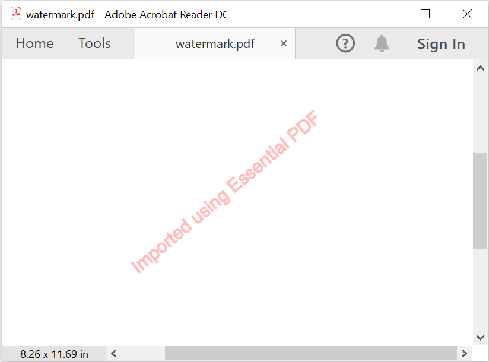
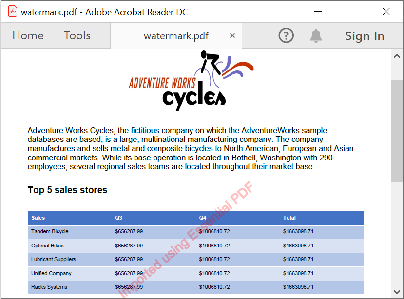
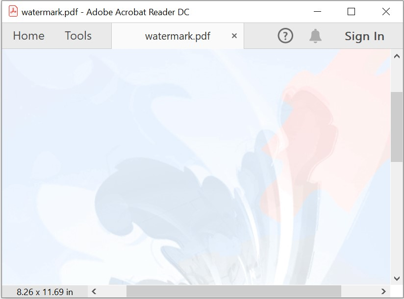
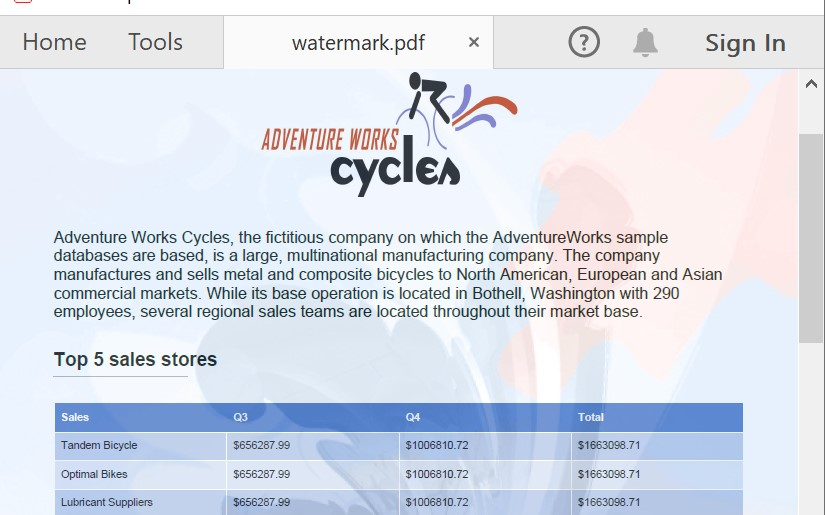

# Working with Watermarks

Essential PDF provides you support to add watermark in the PDF document using PdfGraphics.

## Adding text watermark in PDF document

Essential PDF allows you to draw the text watermark in PDF document using graphics elements.

The below code illustrates how to draw the text watermark in new PDF document:





//Create a new PDF document.

PdfDocument pdfDocument = new PdfDocument();

//Add a page to the PDF document.

PdfPage pdfPage = pdfDocument.Pages.Add();

PdfGraphics graphics = pdfPage.Graphics;

//set the font

PdfFont font = new PdfStandardFont(PdfFontFamily.Helvetica, 20);

//watermark text.

PdfGraphicsState state = graphics.Save();

graphics.SetTransparency(0.25f);

graphics.RotateTransform(-40);

graphics.DrawString("Imported using Essential PDF", font, PdfPens.Red, PdfBrushes.Red, new PointF(-150, 450));

//Save and close the document.

pdfDocument.Save("watermark.pdf");

pdfDocument.Close(true);





'Create a new PDF document.

Dim pdfDocument As New PdfDocument()

'Add a page to the PDF document.

Dim pdfPage As PdfPage = pdfDocument.Pages.Add()

Dim graphics As PdfGraphics = pdfPage.Graphics

'set the font

Dim font As PdfFont = New PdfStandardFont(PdfFontFamily.Helvetica, 20)

' watermark text.

Dim state As PdfGraphicsState = graphics.Save()

graphics.SetTransparency(0.25F)

graphics.RotateTransform(-40)

graphics.DrawString("Imported using Essential PDF", font, PdfPens.Red, PdfBrushes.Red, New PointF(-150, 450))

'Save and close the document.

pdfDocument.Save("watermark.pdf")

pdfDocument.Close(True)



  

//Create a new PDF document.

PdfDocument pdfDocument = new PdfDocument();

//Add a page to the PDF document.

PdfPage pdfPage = pdfDocument.Pages.Add();

PdfGraphics graphics = pdfPage.Graphics;

//set the font

PdfFont font = new PdfStandardFont(PdfFontFamily.Helvetica, 20);

//watermark text.

PdfGraphicsState state = graphics.Save();

graphics.SetTransparency(0.25f);

graphics.RotateTransform(-40);

graphics.DrawString("Imported using Essential PDF", font, PdfPens.Red, PdfBrushes.Red, new PointF(-150, 450));

//Save the PDF document to stream

MemoryStream stream = new MemoryStream();

await pdfDocument.SaveAsync(stream);

//Close the document

pdfDocument.Close(true);                                                                   

//Save the stream as PDF document file in local machine. Refer to PDF/UWP section for respected code samples

Save(stream, "output.pdf");





//Create a new PDF document.

PdfDocument pdfDocument = new PdfDocument();

//Add a page to the PDF document.

PdfPage pdfPage = pdfDocument.Pages.Add();

PdfGraphics graphics = pdfPage.Graphics;

//set the font

PdfFont font = new PdfStandardFont(PdfFontFamily.Helvetica, 20);

//watermark text.

PdfGraphicsState state = graphics.Save();

graphics.SetTransparency(0.25f);

graphics.RotateTransform(-40);

graphics.DrawString("Imported using Essential PDF", font, PdfPens.Red, PdfBrushes.Red, new PointF(-150, 450));

//Save the document into stream.

MemoryStream stream = new MemoryStream();

pdfDocument.Save(stream);

stream.Position = 0;

//Close the document.

pdfDocument.Close(true);

//Defining the ContentType for pdf file.

string contentType = "application/pdf";

//Define the file name.

string fileName = "watermark.pdf";

//Creates a FileContentResult object by using the file contents, content type, and file name.

return File(stream, contentType, fileName);





//Create a new PDF document.

PdfDocument pdfDocument = new PdfDocument();

//Add a page to the PDF document.

PdfPage pdfPage = pdfDocument.Pages.Add();

PdfGraphics graphics = pdfPage.Graphics;

//set the font

PdfFont font = new PdfStandardFont(PdfFontFamily.Helvetica, 20);

//watermark text.

PdfGraphicsState state = graphics.Save();

graphics.SetTransparency(0.25f);

graphics.RotateTransform(-40);

graphics.DrawString("Imported using Essential PDF", font, PdfPens.Red, PdfBrushes.Red, new PointF(-150, 450));

//Save the PDF document to stream

MemoryStream stream = new MemoryStream();

pdfDocument.Save(stream);

//Closes the document

pdfDocument.Close(true);

//Save the stream into pdf file

//The operation in Save under Xamarin varies between Windows Phone, Android and iOS platforms. Please refer PDF/Xamarin section for respective code samples

if (Device.OS == TargetPlatform.WinPhone || Device.OS == TargetPlatform.Windows)
{
    Xamarin.Forms.DependencyService.Get<ISaveWindowsPhone>().Save("Output.pdf", "application/pdf", stream);
}
else
{
    Xamarin.Forms.DependencyService.Get<ISave>().Save("Output.pdf", "application/pdf", stream);
}





You can download a complete working sample from [GitHub](https://github.com/SyncfusionExamples/PDF-Examples/tree/master/Watermark/Adding-text-watermark-in-PDF-document).

The following screenshot shows the output of adding text watermark to PDF document. 

The below code illustrates how to draw the text watermark in existing PDF document:





//Load the document.

PdfLoadedDocument loadedDocument = new PdfLoadedDocument(fileName);

PdfPageBase loadedPage = loadedDocument.Pages[0];

PdfGraphics graphics = loadedPage.Graphics;

//set the font

PdfFont font = new PdfStandardFont(PdfFontFamily.Helvetica, 20);

// watermark text.

PdfGraphicsState state = graphics.Save();

graphics.SetTransparency(0.25f);

graphics.RotateTransform(-40);

graphics.DrawString("Imported using Essential PDF", font, PdfPens.Red, PdfBrushes.Red, new PointF(-150, 450));

//Save and close the document.

loadedDocument.Save("watermark.pdf");

loadedDocument.Close(true);





'Load the document.

Dim loadedDocument As New PdfLoadedDocument(fileName)

Dim loadedPage As PdfPageBase = loadedDocument.Pages(0)

Dim graphics As PdfGraphics = loadedPage.Graphics

'set the font

Dim font As PdfFont = New PdfStandardFont(PdfFontFamily.Helvetica, 20)

' watermark text.

Dim state As PdfGraphicsState = graphics.Save()

graphics.SetTransparency(0.25F)

graphics.RotateTransform(-40)

graphics.DrawString("Imported using Essential PDF", font, PdfPens.Red, PdfBrushes.Red, New PointF(-150, 450))

'Save and close the document.

loadedDocument.Save("watermark.pdf")

loadedDocument.Close(True)



  

//Create the file open picker

var picker = new FileOpenPicker();

picker.FileTypeFilter.Add(".pdf");

//Browse and chose the file

StorageFile file = await picker.PickSingleFileAsync();

//Creates an empty PDF loaded document instance
PdfLoadedDocument loadedDocument = new PdfLoadedDocument();

//Loads or opens an existing PDF document through Open method of PdfLoadedDocument class
await loadedDocument.OpenAsync(file);

PdfPageBase loadedPage = loadedDocument.Pages[0];

PdfGraphics graphics = loadedPage.Graphics;

//set the font

PdfFont font = new PdfStandardFont(PdfFontFamily.Helvetica, 20);

// watermark text.

PdfGraphicsState state = graphics.Save();

graphics.SetTransparency(0.25f);

graphics.RotateTransform(-40);

graphics.DrawString("Imported using Essential PDF", font, PdfPens.Red, PdfBrushes.Red, new PointF(-150, 450));

//Save the PDF document to stream

MemoryStream stream = new MemoryStream();

await loadedDocument.SaveAsync(stream);

//Close the document

loadedDocument.Close(true);                                                                   

//Save the stream as PDF document file in local machine. Refer to PDF/UWP section for respected code samples

Save(stream, "output.pdf");





//Load the PDF document

FileStream docStream = new FileStream("Input.pdf", FileMode.Open, FileAccess.Read);

PdfLoadedDocument loadedDocument = new PdfLoadedDocument(docStream);

PdfPageBase loadedPage = loadedDocument.Pages[0];

PdfGraphics graphics = loadedPage.Graphics;

//set the font

PdfFont font = new PdfStandardFont(PdfFontFamily.Helvetica, 20);

// watermark text.

PdfGraphicsState state = graphics.Save();

graphics.SetTransparency(0.25f);

graphics.RotateTransform(-40);

graphics.DrawString("Imported using Essential PDF", font, PdfPens.Red, PdfBrushes.Red, new PointF(-150, 

//Save the document into stream.

MemoryStream stream = new MemoryStream();

loadedDocument.Save(stream);

stream.Position = 0;

//Close the document.

loadedDocument.Close(true);

//Defining the ContentType for pdf file.

string contentType = "application/pdf";

//Define the file name.

string fileName = "watermark.pdf";

//Creates a FileContentResult object by using the file contents, content type, and file name.

return File(stream, contentType, fileName);





//Load the file as stream

Stream docStream = typeof(App).GetTypeInfo().Assembly.GetManifestResourceStream("Sample.Assets.Sample.pdf");

PdfLoadedDocument loadedDocument = new PdfLoadedDocument(docStream);

PdfPageBase loadedPage = loadedDocument.Pages[0];

PdfGraphics graphics = loadedPage.Graphics;

//set the font

PdfFont font = new PdfStandardFont(PdfFontFamily.Helvetica, 20);

// watermark text.

PdfGraphicsState state = graphics.Save();

graphics.SetTransparency(0.25f);

graphics.RotateTransform(-40);

graphics.DrawString("Imported using Essential PDF", font, PdfPens.Red, PdfBrushes.Red, new PointF(-150, 450));

//Save the PDF document to stream

MemoryStream stream = new MemoryStream();

loadedDocument.Save(stream);

//Closes the document

loadedDocument.Close(true);

//Save the stream into pdf file

//The operation in Save under Xamarin varies between Windows Phone, Android and iOS platforms. Please refer PDF/Xamarin section for respective code samples

if (Device.OS == TargetPlatform.WinPhone || Device.OS == TargetPlatform.Windows)
{
    Xamarin.Forms.DependencyService.Get<ISaveWindowsPhone>().Save("Output.pdf", "application/pdf", stream);
}
else
{
    Xamarin.Forms.DependencyService.Get<ISave>().Save("Output.pdf", "application/pdf", stream);
}





You can download a complete working sample from [GitHub](https://github.com/SyncfusionExamples/PDF-Examples/tree/master/Watermark/Add-text-watermark-in-an-existing-PDF-document/).

The following screenshot shows the output of adding text watermark to an existing PDF document. 

## Adding image watermark in PDF document

To add the image watermark in PDF document, you can draw the image with transparency in PdfGraphics.

The below code illustrates how to draw the image watermark in new PDF document:





//Create a new PDF document.

PdfDocument pdfDocument = new PdfDocument();

//Add a page to the PDF document.

PdfPage pdfPage = pdfDocument.Pages.Add();

PdfGraphics graphics = pdfPage.Graphics;

//Image watermark.

PdfImage image = new PdfBitmap("Image.gif");

PdfGraphicsState state = graphics.Save();

graphics.SetTransparency(0.25f);

graphics.DrawImage(image, new PointF(0, 0), pdfPage.Graphics.ClientSize);

//Save and close the document.

pdfDocument.Save("watermark.pdf");

pdfDocument.Close(true);





'Create a new PDF document.

Dim pdfDocument As New PdfDocument()

'Add a page to the PDF document.

Dim pdfPage As PdfPage = pdfDocument.Pages.Add()

Dim graphics As PdfGraphics = pdfPage.Graphics

'Image watermark.

Dim image As PdfImage = New PdfBitmap("Image.gif")

Dim state As PdfGraphicsState = graphics.Save()

graphics.SetTransparency(0.25F)

graphics.DrawImage(image, New PointF(0, 0), pdfPage.Graphics.ClientSize)

'Save and close the document.

pdfDocument.Save("watermark.pdf")

pdfDocument.Close(True)



  

//Create a new PDF document.

PdfDocument pdfDocument = new PdfDocument();

//Add a page to the PDF document.

PdfPage pdfPage = pdfDocument.Pages.Add();

PdfGraphics graphics = pdfPage.Graphics;

//Load the image as stream.

Stream imageStream = typeof(MainPage).GetTypeInfo().Assembly.GetManifestResourceStream("Sample.Assets.Data.Image.gif");

//Image watermark.

PdfImage image = new PdfBitmap(imageStream);

PdfGraphicsState state = graphics.Save();

graphics.SetTransparency(0.25f);

graphics.DrawImage(image, new PointF(0, 0), pdfPage.Graphics.ClientSize);

//Save the PDF document to stream

MemoryStream stream = new MemoryStream();

await pdfDocument.SaveAsync(stream);

//Close the document

pdfDocument.Close(true);                                                                   

//Save the stream as PDF document file in local machine. Refer to PDF/UWP section for respected code samples

Save(stream, "output.pdf");





//Create a new PDF document.

PdfDocument pdfDocument = new PdfDocument();

//Add a page to the PDF document.

PdfPage pdfPage = pdfDocument.Pages.Add();

PdfGraphics graphics = pdfPage.Graphics;

//Load the image as stream.

FileStream imageStream = new FileStream("Image.gif", FileMode.Open, FileAccess.Read);

//Image watermark.

PdfImage image = new PdfBitmap(imageStream);

PdfGraphicsState state = graphics.Save();

graphics.SetTransparency(0.25f);

graphics.DrawImage(image, new PointF(0, 0), pdfPage.Graphics.ClientSize);

//Save the document into stream.

MemoryStream stream = new MemoryStream();

pdfDocument.Save(stream);

stream.Position = 0;

//Close the document.

pdfDocument.Close(true);

//Defining the ContentType for pdf file.

string contentType = "application/pdf";

//Define the file name.

string fileName = "watermark.pdf";

//Creates a FileContentResult object by using the file contents, content type, and file name.

return File(stream, contentType, fileName);





//Create a new PDF document.

PdfDocument pdfDocument = new PdfDocument();

//Add a page to the PDF document.

PdfPage pdfPage = pdfDocument.Pages.Add();

PdfGraphics graphics = pdfPage.Graphics;

//Load the image as stream.

Stream imageStream = typeof(App).GetTypeInfo().Assembly.GetManifestResourceStream("Sample.Assets.Image.gif ");

PdfImage image = new PdfBitmap(imageStream);

PdfGraphicsState state = graphics.Save();

graphics.SetTransparency(0.25f);

graphics.DrawImage(image, new PointF(0, 0), pdfPage.Graphics.ClientSize);

//Save the PDF document to stream

MemoryStream stream = new MemoryStream();

pdfDocument.Save(stream);

//Closes the document

pdfDocument.Close(true);

//Save the stream into pdf file

//The operation in Save under Xamarin varies between Windows Phone, Android and iOS platforms. Please refer PDF/Xamarin section for respective code samples

if (Device.OS == TargetPlatform.WinPhone || Device.OS == TargetPlatform.Windows)
{
    Xamarin.Forms.DependencyService.Get<ISaveWindowsPhone>().Save("Output.pdf", "application/pdf", stream);
}
else
{
    Xamarin.Forms.DependencyService.Get<ISave>().Save("Output.pdf", "application/pdf", stream);
}





You can download a complete working sample from [GitHub](https://github.com/SyncfusionExamples/PDF-Examples/tree/master/Watermark/Adding-image-watermark-in-PDF-document).

The following screenshot shows the output of adding image watermark to PDF document. 

The below code illustrates how to draw the image watermark in existing PDF document.





//Load the document.

PdfLoadedDocument loadedDocument = new PdfLoadedDocument(fileName);

PdfPageBase loadedPage = loadedDocument.Pages[0];

PdfGraphics graphics = loadedPage.Graphics;

//Image watermark.

PdfImage image = new PdfBitmap("Image.gif");

PdfGraphicsState state = graphics.Save();

graphics.SetTransparency(0.25f);

graphics.DrawImage(image, new PointF(0, 0), loadedPage.Graphics.ClientSize);

//Save and close the document.

loadedDocument.Save("watermark.pdf");

loadedDocument.Close(true);





'Load the document.

Dim loadedDocument As New PdfLoadedDocument(fileName)

Dim loadedPage As PdfPageBase = loadedDocument.Pages(0)

Dim graphics As PdfGraphics = loadedPage.Graphics

'Image watermark.

Dim image As PdfImage = New PdfBitmap("Image.gif")

Dim state As PdfGraphicsState = graphics.Save()

graphics.SetTransparency(0.25F)

graphics.DrawImage(image, New PointF(0, 0), loadedPage.Graphics.ClientSize)

'Save and close the document.

loadedDocument.Save("watermark.pdf")

loadedDocument.Close(True)



  

//Create the file open picker

var picker = new FileOpenPicker();

picker.FileTypeFilter.Add(".pdf");

//Browse and chose the file

StorageFile file = await picker.PickSingleFileAsync();

//Creates an empty PDF loaded document instance

PdfLoadedDocument loadedDocument = new PdfLoadedDocument();

//Loads or opens an existing PDF document through Open method of PdfLoadedDocument class

await loadedDocument.OpenAsync(file);

PdfPageBase loadedPage = loadedDocument.Pages[0];

PdfGraphics graphics = loadedPage.Graphics;

//Load the image as stream

Stream imageStream = typeof(MainPage).GetTypeInfo().Assembly.GetManifestResourceStream("Sample.Assets.Data.Image.gif");

//Image watermark.

PdfImage image = new PdfBitmap(imageStream);

PdfGraphicsState state = graphics.Save();

graphics.SetTransparency(0.25f);

graphics.DrawImage(image, new PointF(0, 0), loadedPage.Graphics.ClientSize);

//Save the PDF document to stream

MemoryStream stream = new MemoryStream();

await loadedDocument.SaveAsync(stream);

//Close the document

loadedDocument.Close(true);                                                                   

//Save the stream as PDF document file in local machine. Refer to PDF/UWP section for respected code samples

Save(stream, "output.pdf");





//Load the PDF document

FileStream docStream = new FileStream("Input.pdf", FileMode.Open, FileAccess.Read);

PdfLoadedDocument loadedDocument = new PdfLoadedDocument(docStream);

PdfPageBase loadedPage = loadedDocument.Pages[0];

PdfGraphics graphics = loadedPage.Graphics;

//Load the image file as stream

FileStream imageStream = new FileStream("Image.gif", FileMode.Open, FileAccess.Read);

PdfImage image = new PdfBitmap(imageStream);

PdfGraphicsState state = graphics.Save();

graphics.SetTransparency(0.25f);

graphics.DrawImage(image, new PointF(0, 0), loadedPage.Graphics.ClientSize);

//Save the document into stream.

MemoryStream stream = new MemoryStream();

loadedDocument.Save(stream);

stream.Position = 0;

//Close the document.

loadedDocument.Close(true);

//Defining the ContentType for pdf file.

string contentType = "application/pdf";

//Define the file name.

string fileName = "watermark.pdf";

//Creates a FileContentResult object by using the file contents, content type, and file name.

return File(stream, contentType, fileName);





//Load the file as stream

Stream docStream = typeof(App).GetTypeInfo().Assembly.GetManifestResourceStream("Sample.Assets.Sample.pdf");

PdfLoadedDocument loadedDocument = new PdfLoadedDocument(docStream);

PdfPageBase loadedPage = loadedDocument.Pages[0];

PdfGraphics graphics = loadedPage.Graphics;

//Load the image as stream.

Stream imageStream = typeof(App).GetTypeInfo().Assembly.GetManifestResourceStream("Sample.Assets.Image.gif");

PdfImage image = new PdfBitmap(imageStream);

PdfGraphicsState state = graphics.Save();

graphics.SetTransparency(0.25f);

graphics.DrawImage(image, new PointF(0, 0), loadedPage.Graphics.ClientSize);

//Save the PDF document to stream

MemoryStream stream = new MemoryStream();

loadedDocument.Save(stream);

//Closes the document

loadedDocument.Close(true);

//Save the stream into pdf file

//The operation in Save under Xamarin varies between Windows Phone, Android and iOS platforms. Please refer PDF/Xamarin section for respective code samples

if (Device.OS == TargetPlatform.WinPhone || Device.OS == TargetPlatform.Windows)
{
    Xamarin.Forms.DependencyService.Get<ISaveWindowsPhone>().Save("Output.pdf", "application/pdf", stream);
}
else
{
    Xamarin.Forms.DependencyService.Get<ISave>().Save("Output.pdf", "application/pdf", stream);
}





You can download a complete working sample from [GitHub](https://github.com/SyncfusionExamples/PDF-Examples/tree/master/Watermark/Draw-the-image-watermark-in-an-existing-PDF-document).

The following screenshot shows the output of adding image watermark to an existing PDF document. 

