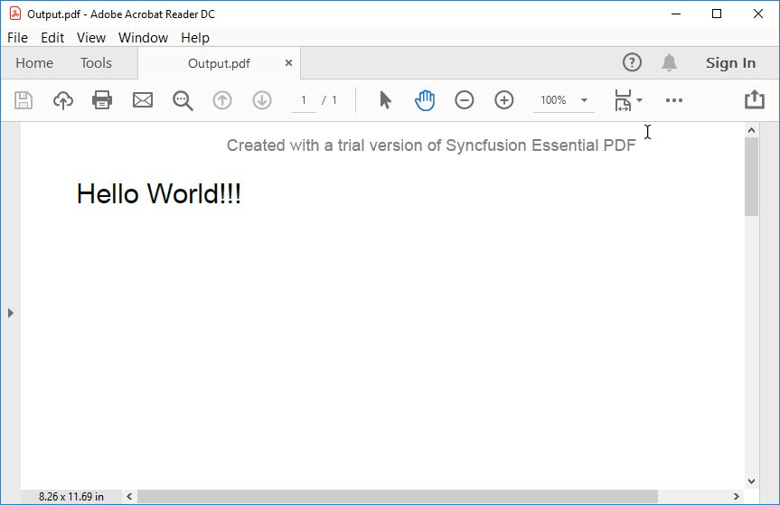

# Working with Xamarin

In your Xamarin application, please add the required assemblies in order to use Essential PDF. [Refer here for assemblies required](/File-Formats/PDF/Assemblies-Required).

## Steps to create PDF document in Xamarin

Create a new C# Xamarin.Forms application project.

Select a project template and required platforms to deploy the application. In this application, the portable assemblies to be shared across multiple platforms, the .NET Standard code sharing strategy has been selected. For more details about code sharing, refer here.

N> If .NET Standard is not available in the code sharing strategy, the Portable Class Library (PCL) can be selected.

Install the Syncfusion.Xamarin.PDF NuGet package as a reference to your.NET Framework applications from NuGet.org.

Add new Forms XAML page in portable project if there is no XAML page is defined in the App class. Otherwise, proceed to the next step.

a.  To add the new XAML page, right-click the project and select Add > New Item and add a Forms XAML Page from the list. Name it as MainXamlPage.

b.	In App class of portable project (App.cs), replace the existing constructor of App class with the following code snippet, which invokes the MainXamlPage.



public App()
{
    // The root page of your application
    MainPage = new MainXamlPage();
}



In the MainXamlPage.xaml, add new button as follows.


<ContentPage xmlns="http://xamarin.com/schemas/2014/forms"
             xmlns:x="http://schemas.microsoft.com/winfx/2009/xaml"
             x:Class="GettingStarted. MainXamlPage">
<StackLayout VerticalOptions="Center">
  
<Button Text="Generate Document" Clicked="OnButtonClicked" HorizontalOptions="Center"/>
  
</StackLayout>
</ContentPage>


Include the following namespace in the MainXamlPage.xaml.cs file.

  


using Syncfusion.Pdf;
using Syncfusion.Pdf.Parsing;
using Syncfusion.Pdf.Graphics;
using Syncfusion.Pdf.Grid;





Imports Syncfusion.Pdf
Imports Syncfusion.Pdf.Parsing
Imports Syncfusion.Pdf.Graphics
Imports Syncfusion.Pdf.Grid



 

Include the following code snippet in the click event of the button in MainXamlPage.xaml.cs, to create a PDF file and save it in a stream. 

  


// Create a new PDF document
PdfDocument document = new PdfDocument();

//Add a page to the document
PdfPage page = document.Pages.Add();

//Create PDF graphics for the page
PdfGraphics graphics = page.Graphics;

//Set the standard font
PdfFont font = new PdfStandardFont(PdfFontFamily.Helvetica, 20);

//Draw the text
graphics.DrawString("Hello World!!!", font, PdfBrushes.Black, new PointF(0, 0));

//Save the document to the stream
MemoryStream stream = new MemoryStream();
document.Save(stream);

//Close the document
document.Close(true);

//Save the stream as a file in the device and invoke it for viewing
Xamarin.Forms.DependencyService.Get<ISave>().SaveAndView("Output.pdf", "application / pdf", stream);





'Create a new PDF document
Dim document As New PdfDocument()

'Add a page to the document
Dim page As PdfPage = document.Pages.Add()

'Create PDF graphics for the page
Dim graphics As PdfGraphics = page.Graphics

'Set the standard font
Dim font As PdfFont = New PdfStandardFont(PdfFontFamily.Helvetica, 20)

'Draw the text
graphics.DrawString("Hello World!!!", font, PdfBrushes.Black, New PointF(0, 0))

'Save the document to the stream
Dim stream As New MemoryStream()
document.Save(stream)

'Close the document
document.Close(True)

'Save the stream as a file in the device and invoke it for viewing
Xamarin.Forms.DependencyService.[Get](Of ISave)().SaveAndView("Output.pdf", "application / pdf", stream)



  

Download the helper files from this [link](http://www.syncfusion.com/downloads/support/directtrac/general/HELPER~1-696201504.ZIP ) and add them into the mentioned project. These helper files allow you to save the stream as a physical file and open the file for viewing.

<table>
  <tr>
    <th>Project</th>
    <th>File Name</th>
	<th>Summary</th>
  </tr>
  <tr>
    <td>portable project</td>
    <td>ISave.cs </td>
	<td>Represent the base interface for save operation</td>	
  </tr>
  <tr>
    <td rowspan="2">iOS Project</td>
    <td>SaveIOS.cs</td>
	<td>Represent the base interface for save operation</td>	
  </tr>
   <tr>    
    <td>PreviewControllerDS.cs</td>
	<td>Helper class for viewing the PDF file in iOS device</td>	
  </tr>
  <tr>
    <td>Android project</td>
    <td>SaveAndroid.cs</td>
	<td>Save implementation for Android device</td>	
  </tr>
  <tr>
    <td>WinPhone project</td>
    <td>SaveWinPhone.cs</td>
	<td>Save implementation for Windows Phone device</td>	
  </tr>
  <tr>
    <td>UWP project</td>
    <td>SaveWindows.cs</td>
	<td>Save implementation for UWP device.</td>	
  </tr>
  <tr>
    <td>Windows(8.1) project </td>
    <td>SaveWindows81.cs</td>
	<td>Save implementation for WinRT device.</td>	
  </tr>     
</table>

Compile and execute the application. This creates a simple PDF document.

Download the complete work sample from [Create-PDF-file.zip](http://www.syncfusion.com/downloads/support/directtrac/general/ze/CreatePDFSample1541042202.zip )

By executing the program, you will get the PDF document as follows.

 
## Creating a PDF document with image

The following code example shows how to create a PDF document with an image.

  


//Create a new PDF document.
PdfDocument doc = new PdfDocument();
//Add a page to the document.
PdfPage page = doc.Pages.Add();
//Create PDF graphics for the page
PdfGraphics graphics = page.Graphics;
//Load the image as stream
Stream imagegStream = typeof(App).GetTypeInfo().Assembly.GetManifestResourceStream("Sample.Assets.Autumn Leaves.jpg");
//Load the image from the disk.
PdfBitmap image = new PdfBitmap(imagegStream);
//Draw the image
graphics.DrawImage(image, 0, 0);
////Save the document to the stream
MemoryStream stream = new MemoryStream();
//Save the document.
doc.Save(stream);
//Close the document.
doc.Close(true);

//Save the stream as a file in the device and invoke it for viewing
Xamarin.Forms.DependencyService.Get<ISave>().SaveAndView("Output.pdf", "application/pdf", stream);





'Create a new PDF document.
Dim doc As New PdfDocument()
'Add a page to the document.
Dim page As PdfPage = doc.Pages.Add()
'Create PDF graphics for the page
Dim graphics As PdfGraphics = page.Graphics
'Load the image as stream
Dim imgageStream As Stream = GetType(App).GetTypeInfo().Assembly.GetManifestResourceStream("Sample.Assets.Autumn Leaves.jpg")

'Load the image from the disk.
Dim image As New PdfBitmap(imgageStream)
'Draw the image
graphics.DrawImage(image, 0, 0)
'''/Save the document to the stream
Dim stream As New MemoryStream()
'Save the document.
doc.Save(stream)
'Close the document.
doc.Close(True)

'Save the stream as a file in the device and invoke it for viewing
Xamarin.Forms.DependencyService.[Get](Of ISave)().SaveAndView("Output.pdf", "application/pdf", stream)



  

## Creating a PDF document with table

The following code example shows how to create a PDF document with a simple table.

  


//Create a new PDF document.
PdfDocument doc = new PdfDocument();
//Add a page.
PdfPage page = doc.Pages.Add();
//Create a PdfGrid.
PdfGrid pdfGrid = new PdfGrid();
//Add values to list
List<object> data = new List<object>();
Object row1 = new { ID = "E01", Name = "Clay" };
Object row2 = new { ID = "E02", Name = "Thomas" };
Object row3 = new { ID = "E03", Name = "Andrew" };
Object row4 = new { ID = "E04", Name = "Paul" };
Object row5 = new { ID = "E05", Name = "Gray" };
data.Add(row1);
data.Add(row2);
data.Add(row3);
data.Add(row4);
data.Add(row5);
//Add list to IEnumerable
IEnumerable<object> dataTable = data;
//Assign data source.
pdfGrid.DataSource = dataTable;
//Draw grid to the page of PDF document.
pdfGrid.Draw(page, new PointF(10, 10));
//Save the PDF document to stream.
MemoryStream stream = new MemoryStream();
doc.Save(stream);
//Close the document.
doc.Close(true);

//Save the stream as a file in the device and invoke it for viewing
Xamarin.Forms.DependencyService.Get<ISave>().SaveAndView("Output.pdf", "application/pdf", stream);





'Create a new PDF document.
Dim doc As New PdfDocument()
'Add a page.
Dim page As PdfPage = doc.Pages.Add()
'Create a PdfGrid.
Dim pdfGrid As New PdfGrid()
'Add values to list
Dim data As New List(Of Object)()
Dim row1 As [Object] = New ()
Dim row2 As [Object] = New ()
Dim row3 As [Object] = New ()
Dim row4 As [Object] = New ()
Dim row5 As [Object] = New ()
data.Add(row1)
data.Add(row2)
data.Add(row3)
data.Add(row4)
data.Add(row5)
'Add list to IEnumerable
Dim dataTable As IEnumerable(Of Object) = data
'Assign data source.
pdfGrid.DataSource = dataTable
'Draw grid to the page of PDF document.
pdfGrid.Draw(page, New PointF(10, 10))
'Save the PDF document to stream.
Dim stream As New MemoryStream()
doc.Save(stream)
'Close the document.
doc.Close(True)

'Save the stream as a file in the device and invoke it for viewing
Xamarin.Forms.DependencyService.[Get](Of ISave)().SaveAndView("Output.pdf", "application/pdf", stream)



  

## Creating a simple PDF document with basic elements
The PdfDocument object represents an entire PDF document that is being created. The following code example shows how to create a PDF document and add a page to it along with the page settings.

  


//Creates a new PDF document
PdfDocument document = new PdfDocument();
//Adds page settings
document.PageSettings.Orientation = PdfPageOrientation.Landscape;
document.PageSettings.Margins.All = 50;
//Adds a page to the document
PdfPage page = document.Pages.Add();
PdfGraphics graphics = page.Graphics;





'Creates a new PDF document
Dim document As New PdfDocument()
'Adds page settings
document.PageSettings.Orientation = PdfPageOrientation.Landscape
document.PageSettings.Margins.All = 50
'Adds a page to the document
Dim page As PdfPage = document.Pages.Add()
Dim graphics As PdfGraphics = page.Graphics



  

1. Essential PDF has APIs similar to the .NET GDI plus which helps to draw elements to the PDF page just like 2D drawing in .NET. 
2. Unlike System.Drawing APIs all the units are measured in point instead of pixel. 
3. In PDF, all the elements are placed in absolute positions and has the possibility for content overlapping if misplaced. 
4. Essential PDF provides the rendered bounds for each and every elements added through PdfLayoutResult objects. This can be used to add successive elements and prevent content overlap.

The following code example explains how to add an image from disk to a PDF document, by providing the rectangle coordinates. 

  


//Loads the image as stream
Stream imageStream = typeof(App).GetTypeInfo().Assembly.GetManifestResourceStream("Sample.Assets.AdventureCycle.jpg");
RectangleF bounds = new RectangleF(176, 0, 390, 130);
PdfImage image = PdfImage.FromStream(imageStream);
//Draws the image to the PDF page
page.Graphics.DrawImage(image, bounds);





'Loads the image as stream
Dim imageStream As Stream = GetType(App).GetTypeInfo().Assembly.GetManifestResourceStream("Sample.Assets.AdventureCycle.jpg")
Dim bounds As New RectangleF(176, 0, 390, 130)
Dim image As PdfImage = PdfImage.FromStream(imageStream)
'Draws the image to the PDF page
page.Graphics.DrawImage(image, bounds)



  

The following methods can be used to add text to a PDF document.

1. DrawString() method of the PdfGraphics
2. PdfTextElement class.

The PdfTextElement provides the layout result of the added text by using the location of the next element that decides to prevent content overlapping. This is not available in the DrawString method. 

The following code example adds the necessary text such as address, invoice number and date to create a basic invoice application. 

  


PdfBrush solidBrush = new PdfSolidBrush(new PdfColor(126, 151, 173));
bounds = new RectangleF(0, bounds.Bottom + 90, graphics.ClientSize.Width, 30);
//Draws a rectangle to place the heading in that region.
graphics.DrawRectangle(solidBrush, bounds);
//Creates a font for adding the heading in the page
PdfFont subHeadingFont = new PdfStandardFont(PdfFontFamily.TimesRoman, 14);
//Creates a text element to add the invoice number
PdfTextElement element = new PdfTextElement("INVOICE " + id.ToString(), subHeadingFont);
element.Brush = PdfBrushes.White;

//Draws the heading on the page
PdfLayoutResult result = element.Draw(page, new PointF(10, bounds.Top + 8));
string currentDate = "DATE " + DateTime.Now.ToString("MM/dd/yyyy");
//Measures the width of the text to place it in the correct location
SizeF textSize = subHeadingFont.MeasureString(currentDate);
PointF textPosition = new PointF(graphics.ClientSize.Width - textSize.Width - 10, result.Bounds.Y);
//Draws the date by using DrawString method
graphics.DrawString(currentDate, subHeadingFont, element.Brush, textPosition);
PdfFont timesRoman = new PdfStandardFont(PdfFontFamily.TimesRoman, 10);
//Creates text elements to add the address and draw it to the page.
element = new PdfTextElement("BILL TO ", timesRoman);
element.Brush = new PdfSolidBrush(new PdfColor(126, 155, 203));
result = element.Draw(page, new PointF(10, result.Bounds.Bottom + 25));
PdfPen linePen = new PdfPen(new PdfColor(126, 151, 173), 0.70f);
PointF startPoint = new PointF(0, result.Bounds.Bottom + 3);
PointF endPoint = new PointF(graphics.ClientSize.Width, result.Bounds.Bottom + 3);
//Draws a line at the bottom of the address
graphics.DrawLine(linePen, startPoint, endPoint);





Dim solidBrush As PdfBrush = New PdfSolidBrush(New PdfColor(126, 151, 173))
bounds = New RectangleF(0, bounds.Bottom + 90, Graphics.ClientSize.Width, 30)
'Draws a rectangle to place the heading in that region.
Graphics.DrawRectangle(solidBrush, bounds)
'Creates a font for adding the heading in the page
Dim subHeadingFont As PdfFont = New PdfStandardFont(PdfFontFamily.TimesRoman, 14)
'Creates a text element to add the invoice number
Dim element As New PdfTextElement("INVOICE " + ID.ToString(), subHeadingFont)
element.Brush = PdfBrushes.White

'Draws the heading on the page
Dim result As PdfLayoutResult = element.Draw(Page, New PointF(10, bounds.Top + 8))
Dim currentDate As String = "DATE " + DateTime.Now.ToString("MM/dd/yyyy")
'Measures the width of the text to place it in the correct location
Dim textSize As SizeF = subHeadingFont.MeasureString(currentDate)
Dim textPosition As New PointF(Graphics.ClientSize.Width - textSize.Width - 10, result.Bounds.Y)
'Draws the date by using DrawString method
Graphics.DrawString(currentDate, subHeadingFont, element.Brush, textPosition)
Dim timesRoman As PdfFont = New PdfStandardFont(PdfFontFamily.TimesRoman, 10)
'Creates text elements to add the address and draw it to the page.
element = New PdfTextElement("BILL TO ", timesRoman)
element.Brush = New PdfSolidBrush(New PdfColor(126, 155, 203))
result = element.Draw(Page, New PointF(10, result.Bounds.Bottom + 25))
Dim linePen As New PdfPen(New PdfColor(126, 151, 173), 0.7F)
Dim startPoint As New PointF(0, result.Bounds.Bottom + 3)
Dim endPoint As New PointF(Graphics.ClientSize.Width, result.Bounds.Bottom + 3)
'Draws a line at the bottom of the address
Graphics.DrawLine(linePen, startPoint, endPoint)



  

Essential PDF provides two types of table models. The difference between both the table models can be referred from the link 
[Difference between PdfLightTable and PdfGrid](/file-formats/pdf/working-with-tables#difference-between-pdflighttable-and-pdfgrid "difference-between-pdflighttable-and-pdfgrid")

Since the invoice document requires only simple cell customizations, the given code example explains how to create a simple invoice table by using PdfGrid.

  


//Creates the datasource for the table
DataTable invoiceDetails = GetProductDetailsAsDataTable();
//Creates a PDF grid
PdfGrid grid = new PdfGrid();
//Adds the data source
grid.DataSource = invoiceDetails;
//Creates the grid cell styles
PdfGridCellStyle cellStyle = new PdfGridCellStyle();
cellStyle.Borders.All = PdfPens.White;
PdfGridRow header = grid.Headers[0];
//Creates the header style
PdfGridCellStyle headerStyle = new PdfGridCellStyle();
headerStyle.Borders.All = new PdfPen(new PdfColor(126, 151, 173));
headerStyle.BackgroundBrush = new PdfSolidBrush(new PdfColor(126, 151, 173));
headerStyle.TextBrush = PdfBrushes.White;
headerStyle.Font = new PdfStandardFont(PdfFontFamily.TimesRoman, 14f, PdfFontStyle.Regular);

//Adds cell customizations
for (int i = 0; i < header.Cells.Count; i++)
{
if (i == 0 || i == 1)
header.Cells[i].StringFormat = new PdfStringFormat(PdfTextAlignment.Left, PdfVerticalAlignment.Middle);
else
header.Cells[i].StringFormat = new PdfStringFormat(PdfTextAlignment.Right, PdfVerticalAlignment.Middle);
}

//Applies the header style
header.ApplyStyle(headerStyle);
cellStyle.Borders.Bottom = new PdfPen(new PdfColor(217, 217, 217), 0.70f);
cellStyle.Font = new PdfStandardFont(PdfFontFamily.TimesRoman, 12f);
cellStyle.TextBrush = new PdfSolidBrush(new PdfColor(131, 130, 136));
//Creates the layout format for grid
PdfGridLayoutFormat layoutFormat = new PdfGridLayoutFormat();
// Creates layout format settings to allow the table pagination
layoutFormat.Layout = PdfLayoutType.Paginate;
//Draws the grid to the PDF page.
PdfGridLayoutResult gridResult = grid.Draw(page, new RectangleF(new PointF(0, result.Bounds.Bottom + 40), new SizeF(graphics.ClientSize.Width, graphics.ClientSize.Height - 100)), layoutFormat);





'Creates the datasource for the table
Dim invoiceDetails As DataTable = GetProductDetailsAsDataTable()
'Creates a PDF grid
Dim grid As New PdfGrid()
'Adds the data source
grid.DataSource = invoiceDetails
'Creates the grid cell styles
Dim cellStyle As New PdfGridCellStyle()
cellStyle.Borders.All = PdfPens.White
Dim header As PdfGridRow = grid.Headers(0)
'Creates the header style
Dim headerStyle As New PdfGridCellStyle()
headerStyle.Borders.All = New PdfPen(New PdfColor(126, 151, 173))
headerStyle.BackgroundBrush = New PdfSolidBrush(New PdfColor(126, 151, 173))
headerStyle.TextBrush = PdfBrushes.White
headerStyle.Font = New PdfStandardFont(PdfFontFamily.TimesRoman, 14F, PdfFontStyle.Regular)
 
'Adds cell customizations
For i As Integer = 0 To header.Cells.Count - 1
	If i = 0 OrElse i = 1 Then
		header.Cells(i).StringFormat = New PdfStringFormat(PdfTextAlignment.Left, PdfVerticalAlignment.Middle)
	Else
		header.Cells(i).StringFormat = New PdfStringFormat(PdfTextAlignment.Right, PdfVerticalAlignment.Middle)
	End If
Next

'Applies the header style
header.ApplyStyle(headerStyle)
cellStyle.Borders.Bottom = New PdfPen(New PdfColor(217, 217, 217), 0.7F)
cellStyle.Font = New PdfStandardFont(PdfFontFamily.TimesRoman, 12F)
cellStyle.TextBrush = New PdfSolidBrush(New PdfColor(131, 130, 136))
'Creates the layout format for grid
Dim layoutFormat As New PdfGridLayoutFormat()
' Creates layout format settings to allow the table pagination
layoutFormat.Layout = PdfLayoutType.Paginate
'Draws the grid to the PDF page.
Dim gridResult As PdfGridLayoutResult = grid.Draw(page, New RectangleF(New PointF(0, result.Bounds.Bottom + 40), New SizeF(graphics.ClientSize.Width, graphics.ClientSize.Height - 100)), layoutFormat)



  

The following code example shows how to save the invoice document to disk and dispose the PdfDocument object.

  


//Save the PDF document to stream.
MemoryStream stream = new MemoryStream();
document.Save(stream);
//Close the document.
document.Close(true);

//Save the stream as a file in the device and invoke it for viewing
Xamarin.Forms.DependencyService.Get<ISave>().SaveAndView("Output.pdf", "application/pdf", stream);





'Save the PDF document to stream.
Dim stream As New MemoryStream()
document.Save(stream)
'Close the document.
document.Close(True)

'Save the stream as a file in the device and invoke it for viewing
Xamarin.Forms.DependencyService.[Get](Of ISave)().SaveAndView("Output.pdf", "application/pdf", stream)



 

The following screenshot shows the invoice PDF document created by using Essential PDF.

## Filling forms

An interactive form, sometimes referred to as an AcroForm is a collection of fields for gathering information interactively from the user. A PDF document can contain any number of fields appearing in any combination of pages, all of that make a single, globally interactive form spanning the entire document.

Essential PDF allows you to create and manipulate existing form in PDF document. To work with existing form documents, the following namespaces are required.

1. Syncfusion.Pdf
2. Syncfusion.Pdf.Parsing

The following guide shows how to fill a sample PDF form as shown.

Essential PDF allows you to fill the form fields by using PdfLoadedField class. You can get the form field either by using its field name or field index.

  


//Loads the PDF form.
PdfLoadedDocument loadedDocument = new PdfLoadedDocument(@"JobApplication.pdf");
//Loads the form
PdfLoadedForm form = loadedDocument.Form;
//Fills the textbox field by using index
(form.Fields[0] as PdfLoadedTextBoxField).Text = "John";
//Fills the textbox fields by using field name
(form.Fields["LastName"] as PdfLoadedTextBoxField).Text = "Doe";
(form.Fields["Address"] as PdfLoadedTextBoxField).Text = " John Doe \n 123 Main St \n Anytown, USA";
//Loads the radio button group
PdfLoadedRadioButtonItemCollection radioButtonCollection = (form.Fields["Gender"] as PdfLoadedRadioButtonListField).Items;
//Checks the 'Male' option
radioButtonCollection[0].Checked = true;
//Checks the 'business' checkbox field
(form.Fields["Business"] as PdfLoadedCheckBoxField).Checked = true;
//Checks the 'retiree' checkbox field
(form.Fields["Retiree"] as PdfLoadedCheckBoxField).Checked = true;
//Save the PDF document to stream.
MemoryStream stream = new MemoryStream();
loadedDocument.Save(stream);
//Close the document.
loadedDocument.Close(true);

//Save the stream as a file in the device and invoke it for viewing
Xamarin.Forms.DependencyService.Get<ISave>().SaveAndView("Output.pdf", "application/pdf", stream);





'Loads the PDF form.
Dim loadedDocument As New PdfLoadedDocument("JobApplication.pdf")
'Loads the form
Dim form As PdfLoadedForm = loadedDocument.Form
'Fills the textbox field by using index
TryCast(form.Fields(0), PdfLoadedTextBoxField).Text = "John"
'Fills the textbox fields by using field name
TryCast(form.Fields("LastName"), PdfLoadedTextBoxField).Text = "Doe"
TryCast(form.Fields("Address"), PdfLoadedTextBoxField).Text = " John Doe " & vbLf & " 123 Main St " & vbLf & " Anytown, USA"
'Loads the radio button group
Dim radioButtonCollection As PdfLoadedRadioButtonItemCollection = TryCast(form.Fields("Gender"), PdfLoadedRadioButtonListField).Items
'Checks the 'Male' option
radioButtonCollection(0).Checked = True
'Checks the 'business' checkbox field
TryCast(form.Fields("Business"), PdfLoadedCheckBoxField).Checked = True
'Checks the 'retiree' checkbox field
TryCast(form.Fields("Retiree"), PdfLoadedCheckBoxField).Checked = True
'Save the PDF document to stream.
Dim stream As New MemoryStream()
loadedDocument.Save(stream)
'Close the document.
loadedDocument.Close(True)

'Save the stream as a file in the device and invoke it for viewing
Xamarin.Forms.DependencyService.[Get](Of ISave)().SaveAndView("Output.pdf", "application/pdf", stream)



  

The filled form is shown in adobe reader application as follows.

## Merge PDF Documents

Essential PDF supports merging multiple PDF documents from disk and stream. You can merge the multiple PDF document from disk by specifying the path of the documents in a string array.

You can merge the PDF document streams by using the following code example.

  


//Creates a PDF document
PdfDocument finalDoc = new PdfDocument();
//Loads the Pdf as a stream.
Stream stream1 = typeof(App).GetTypeInfo().Assembly.GetManifestResourceStream("Sample.Assets.file1.pdf");
Stream stream2 = typeof(App).GetTypeInfo().Assembly.GetManifestResourceStream("Sample.Assets.file2.pdf");
// Creates a PDF stream for merging
Stream[] streams = { stream1, stream2 };
// Merges PDFDocument.
PdfDocumentBase.Merge(finalDoc, streams);
//Save the PDF document to stream
MemoryStream stream = new MemoryStream();
finalDoc.Save(stream);
//If the position is not set to '0' then the PDF will be empty.
stream.Position = 0;
//Close the document.
finalDoc.Close(true);

//Save the stream as a file in the device and invoke it for viewing
Xamarin.Forms.DependencyService.Get<ISave>().SaveAndView("Output.pdf", "application/pdf", stream);





'Creates a PDF document
Dim finalDoc As New PdfDocument()
'Loads the Pdf as a stream.
Dim stream1 As Stream = GetType(App).GetTypeInfo().Assembly.GetManifestResourceStream("Sample.Assets.file1.pdf")
Dim stream2 As Stream = GetType(App).GetTypeInfo().Assembly.GetManifestResourceStream("Sample.Assets.file2.pdf")
' Creates a PDF stream for merging
Dim streams As Stream() = {stream1, stream2}
' Merges PDFDocument.
PdfDocumentBase.Merge(finalDoc, streams)
'Save the PDF document to stream
Dim stream As New MemoryStream()
finalDoc.Save(stream)
'If the position is not set to '0' then the PDF will be empty.
stream.Position = 0
'Close the document.
finalDoc.Close(True)

'Save the stream as a file in the device and invoke it for viewing
Xamarin.Forms.DependencyService.[Get](Of ISave)().SaveAndView("Output.pdf", "application/pdf", stream)



  

