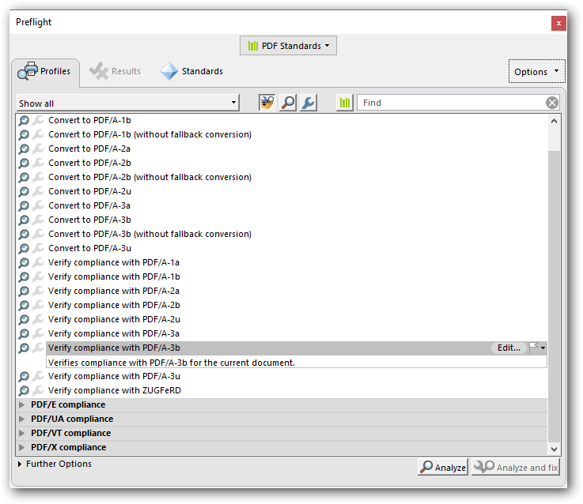
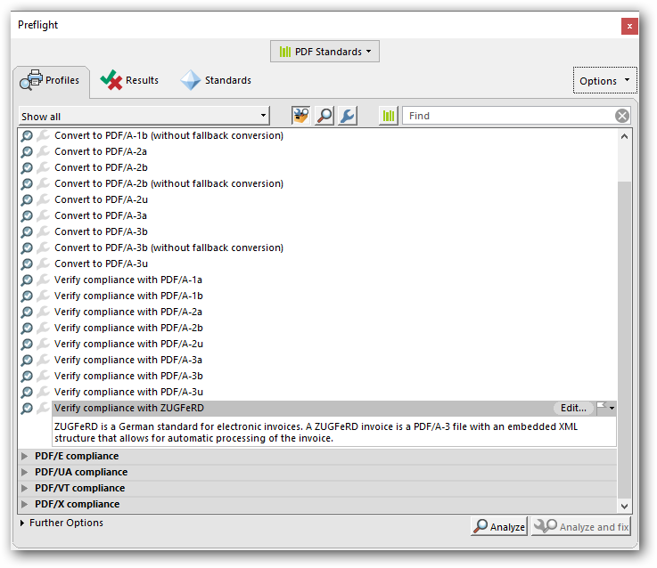
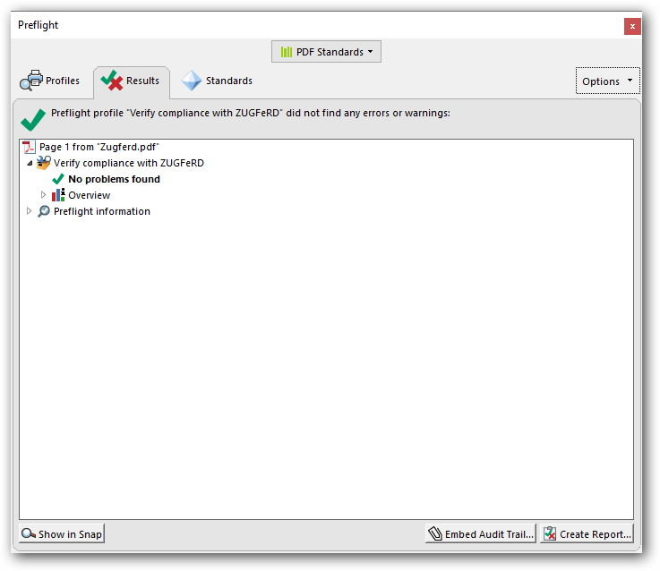

# Working with ZUGFeRD invoice 

The ZUGFeRD invoice is one of the uniformed data format for electronic invoices based on the ISO standard PDF/A-3, which is specifically designed for long term archiving. The ZUGFeRD invoice contains both human-readable invoice and machine-readable structured invoice data (XML).

The Essential PDF provides support to create PDF document with ZUGFeRD invoice.

## Generating ZUGFeRD invoice 

The Essential PDF has support to create PDF document with PDF/A-3b conformance, which allow to add external file to the PDF document as attachment.

The ZUGFeRD has two versions, ZugferdVersion 1.0 and ZugferdVersion 2.0. The Zugferd 2.0 is an updated version of Zugferd 1.0.

The ZUGFeRD has five conformance levels

* Basic: Represents the structured data for simple invoices. Additional information can be included as free text.
* Comfort: Represents the structured data for fully automated invoice processing.
* Extended: Represents the additional structured data for exchanging invoice across different industry segments.
* Minimum: Represents the basic invoice details compatible with the French Standard Factur-X.
* EN16931: Represents the fully compliant with the EU Standard, though it only defines the core elements of an invoice.

N> * The ZUGFeRD conformance levels “Minimum” and “EN16931” are only supported in ZugferdVersion2.0.

Using PDF/A-3b conformance, you can create a ZUGFeRD invoice.

 



//Create ZUGFeRD invoice PDF

PdfDocument document = new PdfDocument(PdfConformanceLevel.Pdf_A3B);

document.ZugferdConformanceLevel = ZugferdConformanceLevel.Basic;





'Create ZUGFeRD invoice PDF

Dim document As PdfDocument = New PdfDocument(PdfConformanceLevel.Pdf_A3B) 

document.ZugferdConformanceLevel = ZugferdConformanceLevel.Basic



  

//Create ZUGFeRD invoice PDF

PdfDocument document = new PdfDocument(PdfConformanceLevel.Pdf_A3B);

document.ZugferdConformanceLevel = ZugferdConformanceLevel.Basic;





//Create ZUGFeRD invoice PDF

PdfDocument document = new PdfDocument(PdfConformanceLevel.Pdf_A3B);

document.ZugferdConformanceLevel = ZugferdConformanceLevel.Basic;





//Create ZUGFeRD invoice PDF

PdfDocument document = new PdfDocument(PdfConformanceLevel.Pdf_A3B);

document.ZugferdConformanceLevel = ZugferdConformanceLevel.Basic;



  

Using PDF/A-3b conformance, you can create a ZUGFeRD invoice with ZugferdVersion2.0. By default, ZugferdVersion1.0 used. 

 



//Create ZUGFeRD invoice PDF

PdfDocument document = new PdfDocument(PdfConformanceLevel.Pdf_A3B);

//Specifies ZugferdVersion 
            
document.ZugferdVersion = ZugferdVersion.ZugferdVersion2_0;





'Create ZUGFeRD invoice PDF

Dim document As PdfDocument = New PdfDocument(PdfConformanceLevel.Pdf_A3B) 

'Specifies ZugferdVersion 

document.ZugferdVersion = ZugferdVersion.ZugferdVersion2_0



  

//Create ZUGFeRD invoice PDF

PdfDocument document = new PdfDocument(PdfConformanceLevel.Pdf_A3B);

//Specifies ZugferdVersion
            
document.ZugferdVersion = ZugferdVersion.ZugferdVersion2_0;





//Create ZUGFeRD invoice PDF

PdfDocument document = new PdfDocument(PdfConformanceLevel.Pdf_A3B);

//Specifies ZugferdVersion
            
document.ZugferdVersion = ZugferdVersion.ZugferdVersion2_0;





//Create ZUGFeRD invoice PDF

PdfDocument document = new PdfDocument(PdfConformanceLevel.Pdf_A3B);

//Specifies ZugferdVersion 
            
document.ZugferdVersion = ZugferdVersion.ZugferdVersion2_0;



  

## Adding ZUGFeRD structured data as attachment

The PDF/A-3 conformance supports the external files as attachment to the PDF document, so you can attach the ZUGFeRD data as attachment to the PDF document.

 



//Creates an attachment

FileStream invoiceStream = new FileStream("../../ Data / ZUGFeRD - invoice.xml", FileMode.Open, FileAccess.Read);

PdfAttachment attachment = new PdfAttachment("ZUGFeRD-invoice.xml",invoiceStream);

attachment.Relationship = PdfAttachmentRelationship.Alternative;

attachment.ModificationDate = DateTime.Now;

attachment.Description = "ZUGFeRD-invoice";

attachment.MimeType = "application/xml";

document.Attachments.Add(attachment);





'Creates an attachment

Dim invoiceStream As FileStream = New FileStream("../../ Data / ZUGFeRD - invoice.xml", FileMode.Open, FileAccess.Read)

Dim attachment As PdfAttachment = New PdfAttachment("ZUGFeRD-invoice.xml", invoiceStream)

attachment.Relationship = PdfAttachmentRelationship.Alternative

attachment.ModificationDate = DateTime.Now

attachment.Description = "ZUGFeRD-invoice"

attachment.MimeType = "application/xml"

document.Attachments.Add(attachment)



  

//Creates an attachment

Stream invoiceStream = typeof(MainPage).GetTypeInfo().Assembly.GetManifestResourceStream("Sample.Assets.Data.ZUGFeRD-invoice.xml");

PdfAttachment attachment = new PdfAttachment("ZUGFeRD-invoice.xml",invoiceStream);

attachment.Relationship = PdfAttachmentRelationship.Alternative;

attachment.ModificationDate = DateTime.Now;

attachment.Description = "ZUGFeRD-invoice";

attachment.MimeType = "application/xml";

document.Attachments.Add(attachment);





//Creates an attachment

FileStream fontStream = new FileStream("../../ Data / ZUGFeRD - invoice.xml", FileMode.Open, FileAccess.Read);

PdfAttachment attachment = new PdfAttachment("ZUGFeRD-invoice.xml",invoiceStream);

attachment.Relationship = PdfAttachmentRelationship.Alternative;

attachment.ModificationDate = DateTime.Now;

attachment.Description = "ZUGFeRD-invoice";

attachment.MimeType = "application/xml";

document.Attachments.Add(attachment);





//Creates an attachment

Stream invoiceStream = typeof(MainPage).GetTypeInfo().Assembly.GetManifestResourceStream("Sample.Assets.Data.ZUGFeRD-invoice.xml");

PdfAttachment attachment = new PdfAttachment("ZUGFeRD-invoice.xml",invoiceStream);

attachment.Relationship = PdfAttachmentRelationship.Alternative;

attachment.ModificationDate = DateTime.Now;

attachment.Description = "ZUGFeRD-invoice";

attachment.MimeType = "application/xml";

document.Attachments.Add(attachment);



  

N> * As per the ZUGFeRD standard guidelines, the XML name must be ZUGFeRD-invoice.xml.

## Complete code

The complete code snippet is given as follows.

 



//Create ZUGFeRD invoice PDF

PdfDocument document = new PdfDocument(PdfConformanceLevel.Pdf_A3B);

document.ZugferdConformanceLevel = ZugferdConformanceLevel.Basic;

//Creates an attachment 

FileStream invoiceStream = new FileStream("../../ Data / ZUGFeRD - invoice.xml", FileMode.Open, FileAccess.Read);

PdfAttachment attachment = new PdfAttachment("ZUGFeRD-invoice.xml",invoiceStream);

attachment.Relationship = PdfAttachmentRelationship.Alternative;

attachment.ModificationDate = DateTime.Now;

attachment.Description = "ZUGFeRD-invoice";

attachment.MimeType = "application/xml";

document.Attachments.Add(attachment);

// Save and close the document

document.Save("Zugferd.pdf");

document.Close(true);





'Create ZUGFeRD invoice PDF

Dim document As PdfDocument = New PdfDocument(PdfConformanceLevel.Pdf_A3B)

document.ZugferdConformanceLevel = ZugferdConformanceLevel.Basic

'Creates an attachment

Dim invoiceStream As FileStream = New FileStream("../../ Data / ZUGFeRD - invoice.xml", FileMode.Open, FileAccess.Read)

Dim attachment As PdfAttachment = New PdfAttachment("ZUGFeRD-invoice.xml",invoiceStream)

attachment.Relationship = PdfAttachmentRelationship.Alternative

attachment.ModificationDate = DateTime.Now

attachment.Description = "ZUGFeRD-invoice"

attachment.MimeType = "application/xml"

document.Attachments.Add(attachment)

'Save and close the document

document.Save("Zugferd.pdf")

document.Close(True)



  

PdfDocument document = new PdfDocument(PdfConformanceLevel.Pdf_A3B);

document.ZugferdConformanceLevel = ZugferdConformanceLevel.Basic;

//Creates an attachment 

Stream invoiceStream = typeof(MainPage).GetTypeInfo().Assembly.GetManifestResourceStream("Sample.Assets.Data.ZUGFeRD-invoice.xml");

PdfAttachment attachment = new PdfAttachment("ZUGFeRD-invoice.xml",invoiceStream);

attachment.Relationship = PdfAttachmentRelationship.Alternative;

attachment.ModificationDate = DateTime.Now;

attachment.Description = "ZUGFeRD-invoice";

attachment.MimeType = "application/xml";

document.Attachments.Add(attachment);

//Close the document

document.Close(true);

//Save the stream as PDF document file in local machine. Refer to the PDF/UWP section for respected code samples

Save(stream, "Zugferd.pdf");





PdfDocument document = new PdfDocument(PdfConformanceLevel.Pdf_A3B);

document.ZugferdConformanceLevel = ZugferdConformanceLevel.Basic;

//Creates an attachment 

FileStream fontStream = new FileStream("../../ Data / ZUGFeRD - invoice.xml", FileMode.Open, FileAccess.Read);

PdfAttachment attachment = new PdfAttachment("ZUGFeRD-invoice.xml",invoiceStream);

attachment.Relationship = PdfAttachmentRelationship.Alternative;

attachment.ModificationDate = DateTime.Now;

attachment.Description = "ZUGFeRD-invoice";

attachment.MimeType = "application/xml";

document.Attachments.Add(attachment);

//Creating the stream object

MemoryStream stream = new MemoryStream();

//Save the document into memory stream

document.Save(stream);

//If the position is not set to '0', then the PDF will be empty

stream.Position = 0;

//Close the document

document.Close(true);

//Defining the ContentType for PDF file

string contentType = "application/pdf";

//Define the file name

string fileName = "Zugferd.pdf";

//Creates a FileContentResult object by using the file contents, content type, and file name

return File(stream, contentType, fileName);





PdfDocument document = new PdfDocument(PdfConformanceLevel.Pdf_A3B);

document.ZugferdConformanceLevel = ZugferdConformanceLevel.Basic;

//Creates an attachment 

Stream invoiceStream = typeof(MainPage).GetTypeInfo().Assembly.GetManifestResourceStream("Sample.Assets.Data.ZUGFeRD-invoice.xml");

PdfAttachment attachment = new PdfAttachment("ZUGFeRD-invoice.xml",invoiceStream);

attachment.Relationship = PdfAttachmentRelationship.Alternative;

attachment.ModificationDate = DateTime.Now;

attachment.Description = "ZUGFeRD-invoice";

attachment.MimeType = "application/xml";

document.Attachments.Add(attachment);

//Save the document into memory stream

MemoryStream stream = new MemoryStream();

document.Save(stream);

//Close the document

document.Close(true);

//Save the stream into PDF file

//The operation in Save under Xamarin varies between Windows Phone, Android, and iOS platforms. Refer to the PDF/Xamarin section for respective code samples

if (Device.RuntimePlatform == Device.UWP)
{
    Xamarin.Forms.DependencyService.Get<ISaveWindowsPhone>().Save("Zugferd.pdf", "application/pdf", stream);
}
else
{
    Xamarin.Forms.DependencyService.Get<ISave>().Save("Zugferd.pdf", "application/pdf", stream);
}



  

You can download a complete working sample from [GitHub](https://github.com/SyncfusionExamples/PDF-Examples/tree/master/ZUGFeRD/Create-ZUGFeRD-compliment-PDF-invoice).

## Extract ZUGFeRD invoice from PDF

You can extract the ZUGFeRD invoice using the following code.

 



//Loads the PDF document

PdfLoadedDocument document = new PdfLoadedDocument("Sample.pdf");

//Iterates the attachments

foreach (PdfAttachment attachment in document.Attachments)

{

//Extracts the ZUGFeRD invoice attachment and saves it to the disk

FileStream s = new FileStream(attachment.FileName, FileMode.Create);

s.Write(attachment.Data, 0, attachment.Data.Length);

s.Dispose();

}

//Saves and closes the document

document.Save("Output.pdf");

document.Close(true);





'Loads the PDF document

Dim document As New PdfLoadedDocument("Sample.pdf")

'Iterates the attachments

For Each attachment As PdfAttachment In document.Attachments

'Extracts the attachment and saves it to the disk

Dim s As New FileStream(attachment.FileName, FileMode.Create)

s.Write(attachment.Data, 0, attachment.Data.Length)

s.Dispose()

Next

'Saves and closes the document

document.Save("Output.pdf")

document.Close(True)



  

//Create the file open picker

var picker = new FileOpenPicker();

picker.FileTypeFilter.Add(".pdf");

//Browse and chose the file

StorageFile file = await picker.PickSingleFileAsync();

//Creates an empty PDF loaded document instance

PdfLoadedDocument loadedDocument = new PdfLoadedDocument();

//Loads or opens an existing PDF document through Open method of PdfLoadedDocument class

await loadedDocument.OpenAsync(file);

//Iterates the attachments

foreach (PdfAttachment attachment in loadedDocument.Attachments)

{

//Extracts the ZUGFeRD invoice attachment and saves it to the disk

FileStream s = new FileStream(attachment.FileName, FileMode.Create);

s.Write(attachment.Data, 0, attachment.Data.Length);

s.Dispose();

}

//Save the PDF document to stream

MemoryStream stream = new MemoryStream();

await loadedDocument.SaveAsync(stream);

//Close the document

loadedDocument.Close(true);

//Save the stream as PDF document file in local machine. Refer to PDF/UWP section for respected code samples

Save(stream, "output.pdf");





//Load the PDF document

FileStream docStream = new FileStream("input.pdf", FileMode.Open, FileAccess.Read);

PdfLoadedDocument loadedDocument = new PdfLoadedDocument(docStream);

//Iterates the attachments

foreach (PdfAttachment attachment in loadedDocument.Attachments)

{

//Extracts the ZUGFeRD invoice attachment and saves it to the disk

FileStream s = new FileStream(attachment.FileName, FileMode.Create);

s.Write(attachment.Data, 0, attachment.Data.Length);

s.Dispose();

}

//Save the document into stream

MemoryStream stream = new MemoryStream();

loadedDocument.Save(stream);

stream.Position = 0;

//Closes the document

loadedDocument.Close(true);

//Defining the ContentType for pdf file

string contentType = "application/pdf";

//Define the file name

string fileName = "output.pdf";

//Creates a FileContentResult object by using the file contents, content type, and file name

return File(stream, contentType, fileName);





//Load the file as stream

Stream docStream = typeof(App).GetTypeInfo().Assembly.GetManifestResourceStream("Sample.Assets.input.pdf");

PdfLoadedDocument loadedDocument = new PdfLoadedDocument(docStream);

//Iterates the attachments

foreach (PdfAttachment attachment in loadedDocument.Attachments)

{

//Extracts the ZUGFeRD invoice attachment and saves it to the disk

FileStream s = new FileStream(attachment.FileName, FileMode.Create);

s.Write(attachment.Data, 0, attachment.Data.Length);

s.Dispose();

}

//Save the document into stream.

MemoryStream stream = new MemoryStream();

loadedDocument.Save(stream);

//Close the document.

loadedDocument.Close(true);

//Save the stream into pdf file
//The operation in Save under Xamarin varies between Windows Phone, Android and iOS platforms. Please refer PDF/Xamarin section for respective code samples
if (Device.OS == TargetPlatform.WinPhone || Device.OS == TargetPlatform.Windows)
{
    Xamarin.Forms.DependencyService.Get<ISaveWindowsPhone>().Save("output.pdf", "application/pdf", stream);
}
else
{
    Xamarin.Forms.DependencyService.Get<ISave>().Save("output.pdf", "application/pdf", stream);
}





You can download a complete working sample from [GitHub](https://github.com/SyncfusionExamples/PDF-Examples/tree/master/ZUGFeRD/Extract-ZUGFeRD-invoice-from-PDF-document).

## Validating ZUGFeRD invoices using Adobe Acrobat

The ZUGFeRD invoices can be validated as follows:

1. Conformance to the PDF/A-3b standard can be checked with Preflight function in Adobe acrobat. 

    * Open the PDF and choose Tools > Print Production > Preflight in the right pane.

    * Select the PDF/A-3b profile and click the Analyze button.

    * Check the result

2. Conformance to the ZUGFeRD invoice can be checked as follows:

    * Open the PDF and choose Tools > Print Production > Preflight in the right pane.

    * Select the ZUGFeRD profile and click the Analyze button.

    * Check the result

