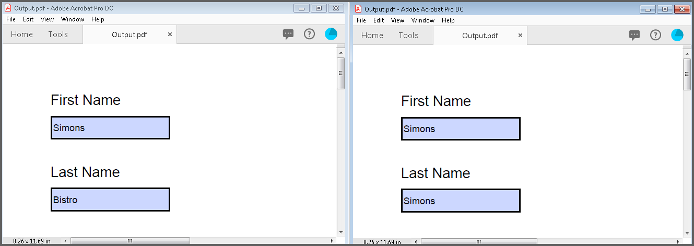

# Working with PDF Forms    

An interactive form, sometimes referred to as an AcroForm is a collection of fields for gathering information. A PDF document can contain any number of fields appearing on any combination of pages, all of that make a single, globally interactive form spanning the entire document.

## Creating a new PDF form

Essential PDF allows you to create and manage the form (AcroForm) in PDF document by using [PdfForm](https://help.syncfusion.com/cr/file-formats/Syncfusion.Pdf.Interactive.PdfForm.html) class. The [PdfFormFieldCollection](https://help.syncfusion.com/cr/file-formats/Syncfusion.Pdf.Interactive.PdfFormFieldCollection.html) class represents the entire field collection of the form.

### Adding the text box field 

[PdfTextBoxField](https://help.syncfusion.com/cr/file-formats/Syncfusion.Pdf.Interactive.PdfTextBoxField.html) class is used to create a text box field in PDF forms. 

The below code snippet illustrates how to add a textbox field to a new PDF document.






//Create a new PDF document.

PdfDocument document = new PdfDocument();

//Add a new page to the PDF document.

PdfPage page = document.Pages.Add();

//Create a textbox field and add the properties.

PdfTextBoxField textBoxField = new PdfTextBoxField(page, "FirstName");

textBoxField.Bounds = new RectangleF(0, 0, 100, 20);

textBoxField.ToolTip = "First Name";

//Add the form field to the document.

document.Form.Fields.Add(textBoxField);

//Save the document.

document.Save("Form.pdf");

//close the document

document.Close(true);






'Create a new PDF document.

Dim document As PdfDocument = New PdfDocument()

'Add a new page to the PDF document.

Dim page As PdfPage = document.Pages.Add()

'Create a textbox field and add the properties.

Dim textBoxField As PdfTextBoxField = New PdfTextBoxField(page, "FirstName")

textBoxField.Bounds = New RectangleF(0, 0, 100, 20)

textBoxField.ToolTip = "First Name"

'Add the form field to the document.

document.Form.Fields.Add(textBoxField)

'Save the document.

document.Save("Form.pdf")

'close the document

document.Close(True)





//Create a new PDF document.

PdfDocument document = new PdfDocument();

//Add a new page to the PDF document.

PdfPage page = document.Pages.Add();

//Create a textbox field and add the properties.

PdfTextBoxField textBoxField = new PdfTextBoxField(page, "FirstName");

textBoxField.Bounds = new RectangleF(0, 0, 100, 20);

textBoxField.ToolTip = "First Name";

//Add the form field to the document.

document.Form.Fields.Add(textBoxField);

//Save the PDF document to stream.

MemoryStream stream = new MemoryStream();

await document.SaveAsync(stream);

//Close the document.

document.Close(true);

//Save the stream as PDF document file in local machine. Refer to PDF/UWP section for respected code samples.

Save(stream, "Form.pdf");





//Create a new PDF document.

PdfDocument document = new PdfDocument();

//Add a new page to the PDF document.

PdfPage page = document.Pages.Add();

//Create a textbox field and add the properties.

PdfTextBoxField textBoxField = new PdfTextBoxField(page, "FirstName");

textBoxField.Bounds = new Syncfusion.Drawing.RectangleF(0, 0, 100, 20);

textBoxField.ToolTip = "First Name";

//Add the form field to the document.

document.Form.Fields.Add(textBoxField);

//Creating the stream object

MemoryStream stream = new MemoryStream();

//Save the document as stream

document.Save(stream);

//If the position is not set to '0' then the PDF will be empty.

stream.Position = 0;

//Close the document.

document.Close(true);

//Defining the ContentType for pdf file.

string contentType = "application/pdf";

//Define the file name.

string fileName = "Form.pdf";

//Creates a FileContentResult object by using the file contents, content type, and file name.

return File(stream, contentType, fileName);





//Create a new PDF document.

PdfDocument document = new PdfDocument();

//Add a new page to the PDF document.

PdfPage page = document.Pages.Add();

//Create a textbox field and add the properties.

PdfTextBoxField textBoxField = new PdfTextBoxField(page, "FirstName");

textBoxField.Bounds = new Syncfusion.Drawing.RectangleF(0, 0, 100, 20);

textBoxField.ToolTip = "First Name";

//Add the form field to the document.

document.Form.Fields.Add(textBoxField);

//Save the PDF document to stream.

MemoryStream stream = new MemoryStream();

document.Save(stream);

//Close the document.

document.Close(true);

//Save the stream into pdf file

//The operation in Save under Xamarin varies between Windows Phone, Android and iOS platforms. Please refer PDF/Xamarin section for respective code samples.

if (Device.OS == TargetPlatform.WinPhone || Device.OS == TargetPlatform.Windows)
{
        Xamarin.Forms.DependencyService.Get<ISaveWindowsPhone>().Save("Form.pdf", "application/pdf", stream);
}
else
{
        Xamarin.Forms.DependencyService.Get<ISave>().Save("Form.pdf", "application/pdf", stream);
}



  

The below code snippet illustrates how to add the textbox to an existing PDF document.

  




//Load the existing PDF document.

PdfLoadedDocument loadedDocument = new PdfLoadedDocument(fileName);

//Create the form if the form does not exist in the loaded document

if(loadedDocument.Form==null)

loadedDocument.CreateForm();

//Load the page

PdfLoadedPage loadedPage = loadedDocument.Pages[0] as PdfLoadedPage;

//Create a textbox field and add the properties.

PdfTextBoxField textBoxField = new PdfTextBoxField(loadedPage, "FirstName");

textBoxField.Bounds = new RectangleF(0, 0, 100, 20);

textBoxField.ToolTip = "First Name";

//Add the form field to the existing PDF document.

loadedDocument.Form.Fields.Add(textBoxField);

//Save the document.

loadedDocument.Save("Form.pdf");

//close the document

loadedDocument.Close(true);







'Load the existing PDF document.

Dim loadedDocument As New PdfLoadedDocument(fileName)

'Create the form if the form does not exist in the loaded document

If loadedDocument.Form Is Nothing Then

loadedDocument.CreateForm()

End If

'Load the page

Dim loadedPage As PdfLoadedPage = TryCast(loadedDocument.Pages(0), PdfLoadedPage)

'Create a text box field and add the properties.

Dim textBoxField As New PdfTextBoxField(loadedPage, "FirstName")

textBoxField.Bounds = New RectangleF(0, 0, 100, 20)

textBoxField.ToolTip = "First Name"

'Add the form field to the existing PDF document.

loadedDocument.Form.Fields.Add(textBoxField)

'Save the document.

loadedDocument.Save("Form.pdf")

'close the document

loadedDocument.Close(True)





//Create the file open picker

var picker = new FileOpenPicker();

picker.FileTypeFilter.Add(".pdf");

//Browse and chose the file

StorageFile file = await picker.PickSingleFileAsync();

//Creates an empty PDF loaded document instance

PdfLoadedDocument loadedDocument = new PdfLoadedDocument();

//Loads or opens an existing PDF document through Open method of PdfLoadedDocument class

await loadedDocument.OpenAsync(file);

//Create the form if the form does not exist in the loaded document

if (loadedDocument.Form == null)

    loadedDocument.CreateForm();

//Load the page

PdfLoadedPage loadedPage = loadedDocument.Pages[0] as PdfLoadedPage;

//Create a textbox field and add the properties.

PdfTextBoxField textBoxField = new PdfTextBoxField(loadedPage, "FirstName");

textBoxField.Bounds = new RectangleF(0, 0, 100, 20);

textBoxField.ToolTip = "First Name";

//Add the form field to the existing PDF document.

loadedDocument.Form.Fields.Add(textBoxField);

//Save the PDF document to stream.

MemoryStream stream = new MemoryStream();

await loadedDocument.SaveAsync(stream);

//Close the document.

loadedDocument.Close(true);

//Save the stream as PDF document file in local machine. Refer to PDF/UWP section for respected code samples.

Save(stream, "Form.pdf");





//Load the PDF document

FileStream docStream = new FileStream(fileName, FileMode.Open, FileAccess.Read);

PdfLoadedDocument loadedDocument = new PdfLoadedDocument(docStream);

//Create the form if the form does not exist in the loaded document

if (loadedDocument.Form == null)

    loadedDocument.CreateForm();

//Load the page

PdfLoadedPage loadedPage = loadedDocument.Pages[0] as PdfLoadedPage;

//Create a textbox field and add the properties.

PdfTextBoxField textBoxField = new PdfTextBoxField(loadedPage, "FirstName");

textBoxField.Bounds = new Syncfusion.Drawing.RectangleF(0, 0, 100, 20);

textBoxField.ToolTip = "First Name";

//Add the form field to the existing PDF document.

loadedDocument.Form.Fields.Add(textBoxField);

//Creating the stream object

MemoryStream stream = new MemoryStream();

//Save the document as stream

loadedDocument.Save(stream);

//If the position is not set to '0' then the PDF will be empty.

stream.Position = 0;

//Close the document.

loadedDocument.Close(true);

//Defining the ContentType for pdf file.

string contentType = "application/pdf";

//Define the file name.

string fileName = "Form.pdf";

//Creates a FileContentResult object by using the file contents, content type, and file name.

return File(stream, contentType, fileName);





//Load the file as stream

Stream docStream = typeof(App).GetTypeInfo().Assembly.GetManifestResourceStream("Sample.Assets.Sample.pdf");

PdfLoadedDocument loadedDocument = new PdfLoadedDocument(docStream);

//Create the form if the form does not exist in the loaded document

if (loadedDocument.Form == null)

    loadedDocument.CreateForm();

//Load the page

PdfLoadedPage loadedPage = loadedDocument.Pages[0] as PdfLoadedPage;

//Create a textbox field and add the properties.

PdfTextBoxField textBoxField = new PdfTextBoxField(loadedPage, "FirstName");

textBoxField.Bounds = new Syncfusion.Drawing.RectangleF(0, 0, 100, 20);

textBoxField.ToolTip = "First Name";

//Add the form field to the existing PDF document.

loadedDocument.Form.Fields.Add(textBoxField);

//Save the PDF document to stream.

MemoryStream stream = new MemoryStream();

loadedDocument.Save(stream);

//Close the document.

loadedDocument.Close(true);

//Save the stream into pdf file

//The operation in Save under Xamarin varies between Windows Phone, Android and iOS platforms. Please refer PDF/Xamarin section for respective code samples.

if (Device.OS == TargetPlatform.WinPhone || Device.OS == TargetPlatform.Windows)
{
      Xamarin.Forms.DependencyService.Get<ISaveWindowsPhone>().Save("Form.pdf", "application/pdf", stream);
}
else
{
      Xamarin.Forms.DependencyService.Get<ISave>().Save("Form.pdf", "application/pdf", stream);
}




  


### Adding the combo box field

[PdfComboBoxField](https://help.syncfusion.com/cr/file-formats/Syncfusion.Pdf.Interactive.PdfComboBoxField.html) class is used to create a combo box field in PDF forms. You can add a list of items to the combo box by using the [PdfListFieldItem](https://help.syncfusion.com/cr/file-formats/Syncfusion.Pdf.Interactive.PdfListFieldItem.html) class.

Please refer the below code snippet for adding the combo box in new PDF document.

 




//Create a new PDF document.

PdfDocument document = new PdfDocument();

//Add a new page to PDF document.

PdfPage page = document.Pages.Add();

//Create a combo box for the first page.

PdfComboBoxField comboBoxField = new PdfComboBoxField(page, "JobTitle");

//Set the combo box properties.

comboBoxField.Bounds = new RectangleF(0, 40, 100, 20);

//Set tooltip.

comboBoxField.ToolTip = "Job Title";

//Add list items.

comboBoxField.Items.Add(new PdfListFieldItem("Development", "accounts"));

comboBoxField.Items.Add(new PdfListFieldItem("Support", "advertise"));

comboBoxField.Items.Add(new PdfListFieldItem("Documentation", "content"));

//Add combo box to the form.

document.Form.Fields.Add(comboBoxField);

//Save the document.

document.Save("Form.pdf");

//Close the document.

document.Close(true);





     

'Create a new PDF document.

Dim document As New PdfDocument()

'Add a new page to PDF document.

Dim page As PdfPage = document.Pages.Add()

'Create a combo box for the first page.

Dim comboBoxField As New PdfComboBoxField(page, "JobTitle")

'Set the combo box properties.

comboBoxField.Bounds = New RectangleF(0, 40, 100, 20)

'Set tooltip

comboBoxField.ToolTip = "Job Title"

'Add list items.

comboBoxField.Items.Add(New PdfListFieldItem("Development", "accounts"))

comboBoxField.Items.Add(New PdfListFieldItem("Support", "advertise"))

comboBoxField.Items.Add(New PdfListFieldItem("Documentation", "content"))

'Add combo box to the form.

document.Form.Fields.Add(comboBoxField)

'Save the PDF document.

document.Save("Form.pdf")

'Close the document                       

document.Close(True)






//Create a new PDF document.

PdfDocument document = new PdfDocument();

//Add a new page to PDF document.

PdfPage page = document.Pages.Add();

//Create a combo box for the first page.

PdfComboBoxField comboBoxField = new PdfComboBoxField(page, "JobTitle");

//Set the combo box properties.

comboBoxField.Bounds = new RectangleF(0, 40, 100, 20);

//Set tooltip.

comboBoxField.ToolTip = "Job Title";

//Add list items.

comboBoxField.Items.Add(new PdfListFieldItem("Development", "accounts"));

comboBoxField.Items.Add(new PdfListFieldItem("Support", "advertise"));

comboBoxField.Items.Add(new PdfListFieldItem("Documentation", "content"));

//Add combo box to the form.

document.Form.Fields.Add(comboBoxField);

//Save the PDF document to stream.

MemoryStream stream = new MemoryStream();

await document.SaveAsync(stream);

//Close the document.

document.Close(true);

//Save the stream as PDF document file in local machine. Refer to PDF/UWP section for respected code samples.

Save(stream, "Form.pdf");





//Create a new PDF document.

PdfDocument document = new PdfDocument();

//Add a new page to PDF document.

PdfPage page = document.Pages.Add();

//Create a combo box for the first page.

PdfComboBoxField comboBoxField = new PdfComboBoxField(page, "JobTitle");

//Set the combo box properties.

comboBoxField.Bounds = new Syncfusion.Drawing.RectangleF(0, 40, 100, 20);

//Set tooltip.

comboBoxField.ToolTip = "Job Title";

//Add list items.

comboBoxField.Items.Add(new PdfListFieldItem("Development", "accounts"));

comboBoxField.Items.Add(new PdfListFieldItem("Support", "advertise"));

comboBoxField.Items.Add(new PdfListFieldItem("Documentation", "content"));

//Add combo box to the form.

document.Form.Fields.Add(comboBoxField);

//Creating the stream object

MemoryStream stream = new MemoryStream();

//Save the document as stream

document.Save(stream);

//If the position is not set to '0' then the PDF will be empty.

stream.Position = 0;

//Close the document.

document.Close(true);

//Defining the ContentType for pdf file.

string contentType = "application/pdf";

//Define the file name.

string fileName = "Form.pdf";

//Creates a FileContentResult object by using the file contents, content type, and file name.

return File(stream, contentType, fileName);





//Create a new PDF document.

PdfDocument document = new PdfDocument();

//Add a new page to PDF document.

PdfPage page = document.Pages.Add();

//Create a combo box for the first page.

PdfComboBoxField comboBoxField = new PdfComboBoxField(page, "JobTitle");

//Set the combo box properties.

comboBoxField.Bounds = new Syncfusion.Drawing.RectangleF(0, 40, 100, 20);

//Set tooltip.

comboBoxField.ToolTip = "Job Title";

//Add list items.

comboBoxField.Items.Add(new PdfListFieldItem("Development", "accounts"));

comboBoxField.Items.Add(new PdfListFieldItem("Support", "advertise"));

comboBoxField.Items.Add(new PdfListFieldItem("Documentation", "content"));

//Add combo box to the form.

document.Form.Fields.Add(comboBoxField);

//Save the PDF document to stream.

MemoryStream stream = new MemoryStream();

document.Save(stream);

//Close the document.

document.Close(true);

//Save the stream into pdf file

//The operation in Save under Xamarin varies between Windows Phone, Android and iOS platforms. Please refer PDF/Xamarin section for respective code samples.

if (Device.OS == TargetPlatform.WinPhone || Device.OS == TargetPlatform.Windows)
{
      Xamarin.Forms.DependencyService.Get<ISaveWindowsPhone>().Save("Form.pdf", "application/pdf", stream);
}
else
{
      Xamarin.Forms.DependencyService.Get<ISave>().Save("Form.pdf", "application/pdf", stream);
}




  

Please refer the below code snippet for adding the combo box in existing PDF document.

 




//Load the existing PDF document.

PdfLoadedDocument loadedDocument = new PdfLoadedDocument(fileName);

//Create the form if the form does not exist in the loaded document

if(loadedDocument.Form==null)

loadedDocument.CreateForm();

//Load the page

PdfLoadedPage loadedPage = loadedDocument.Pages[0] as PdfLoadedPage;

//Create a combo box for the first page.

PdfComboBoxField comboBoxField = new PdfComboBoxField(loadedPage, "JobTitle");

//Set the combo box properties.

comboBoxField.Bounds = new RectangleF(0, 40, 100, 20);

//Set tooltip.

comboBoxField.ToolTip = "Job Title";

//Add list items.

comboBoxField.Items.Add(new PdfListFieldItem("Development", "accounts"));

comboBoxField.Items.Add(new PdfListFieldItem("Support", "advertise"));

comboBoxField.Items.Add(new PdfListFieldItem("Documentation", "content"));

//Add combo box to the form.

loadedDocument.Form.Fields.Add(comboBoxField);

//Save the document.

loadedDocument.Save("Form.pdf");

//Close the document.

loadedDocument.Close(true);







'Load the existing PDF document.

Dim loadedDocument As New PdfLoadedDocument(fileName)

'Create the form if the form does not exist in the loaded document

If loadedDocument.Form Is Nothing Then

loadedDocument.CreateForm()

End If

'Load the page

Dim loadedPage As PdfLoadedPage = TryCast(loadedDocument.Pages(0), PdfLoadedPage)

'Create a combo box for the first page.

Dim comboBoxField As New PdfComboBoxField(loadedPage, "JobTitle")

'Set the combo box properties.

comboBoxField.Bounds = New RectangleF(0, 40, 100, 20)

'Set tooltip.

comboBoxField.ToolTip = "Job Title"

'Add list items.

comboBoxField.Items.Add(New PdfListFieldItem("Development", "accounts"))

comboBoxField.Items.Add(New PdfListFieldItem("Support", "advertise"))

comboBoxField.Items.Add(New PdfListFieldItem("Documentation", "content"))

'Add combo box to the form.

loadedDocument.Form.Fields.Add(comboBoxField)

'Save the document.

loadedDocument.Save("Form.pdf")

'Close the document.

loadedDocument.Close(True)






//Create the file open picker

var picker = new FileOpenPicker();

picker.FileTypeFilter.Add(".pdf");

//Browse and chose the file

StorageFile file = await picker.PickSingleFileAsync();

//Creates an empty PDF loaded document instance

PdfLoadedDocument loadedDocument = new PdfLoadedDocument();

//Loads or opens an existing PDF document through Open method of PdfLoadedDocument class

await loadedDocument.OpenAsync(file);

//Create the form if the form does not exist in the loaded document

if (loadedDocument.Form == null)

    loadedDocument.CreateForm();

//Load the page

PdfLoadedPage loadedPage = loadedDocument.Pages[0] as PdfLoadedPage;

//Create a combo box for the first page.

PdfComboBoxField comboBoxField = new PdfComboBoxField(loadedPage, "JobTitle");

//Set the combo box properties.

comboBoxField.Bounds = new RectangleF(0, 40, 100, 20);

//Set tooltip.

comboBoxField.ToolTip = "Job Title";

//Add list items.

comboBoxField.Items.Add(new PdfListFieldItem("Development", "accounts"));

comboBoxField.Items.Add(new PdfListFieldItem("Support", "advertise"));

comboBoxField.Items.Add(new PdfListFieldItem("Documentation", "content"));

//Add combo box to the form.

loadedDocument.Form.Fields.Add(comboBoxField);

//Save the PDF document to stream.

MemoryStream stream = new MemoryStream();

await loadedDocument.SaveAsync(stream);

//Close the document.

loadedDocument.Close(true);

//Save the stream as PDF document file in local machine. Refer to PDF/UWP section for respected code samples.

Save(stream, "Form.pdf");





//Load the PDF document

FileStream docStream = new FileStream(fileName, FileMode.Open, FileAccess.Read);

PdfLoadedDocument loadedDocument = new PdfLoadedDocument(docStream);

//Create the form if the form does not exist in the loaded document

if (loadedDocument.Form == null)

    loadedDocument.CreateForm();

//Load the page

PdfLoadedPage loadedPage = loadedDocument.Pages[0] as PdfLoadedPage;

//Create a combo box for the first page.

PdfComboBoxField comboBoxField = new PdfComboBoxField(loadedPage, "JobTitle");

//Set the combo box properties.

comboBoxField.Bounds = new Syncfusion.Drawing.RectangleF(0, 40, 100, 20);

//Set tooltip.

comboBoxField.ToolTip = "Job Title";

//Add list items.

comboBoxField.Items.Add(new PdfListFieldItem("Development", "accounts"));

comboBoxField.Items.Add(new PdfListFieldItem("Support", "advertise"));

comboBoxField.Items.Add(new PdfListFieldItem("Documentation", "content"));

//Add combo box to the form.

loadedDocument.Form.Fields.Add(comboBoxField);

//Creating the stream object

MemoryStream stream = new MemoryStream();

//Save the PDF document to stream

loadedDocument.Save(stream);

//If the position is not set to '0' then the PDF will be empty.

stream.Position = 0;

//Close the document.

loadedDocument.Close(true);

//Defining the ContentType for pdf file.

string contentType = "application/pdf";

//Define the file name.

string fileName = "Form.pdf";

//Creates a FileContentResult object by using the file contents, content type, and file name.

return File(stream, contentType, fileName);





//Load the file as stream

Stream docStream = typeof(App).GetTypeInfo().Assembly.GetManifestResourceStream("Sample.Assets.Sample.pdf");

PdfLoadedDocument loadedDocument = new PdfLoadedDocument(docStream);

//Create the form if the form does not exist in the loaded document

if (loadedDocument.Form == null)

    loadedDocument.CreateForm();

//Load the page

PdfLoadedPage loadedPage = loadedDocument.Pages[0] as PdfLoadedPage;

//Create a combo box for the first page.

PdfComboBoxField comboBoxField = new PdfComboBoxField(loadedPage, "JobTitle");

//Set the combo box properties.

comboBoxField.Bounds = new Syncfusion.Drawing.RectangleF(0, 40, 100, 20);

//Set tooltip.

comboBoxField.ToolTip = "Job Title";

//Add list items.

comboBoxField.Items.Add(new PdfListFieldItem("Development", "accounts"));

comboBoxField.Items.Add(new PdfListFieldItem("Support", "advertise"));

comboBoxField.Items.Add(new PdfListFieldItem("Documentation", "content"));

//Add combo box to the form.

loadedDocument.Form.Fields.Add(comboBoxField);

//Save the PDF document to stream.

MemoryStream stream = new MemoryStream();

loadedDocument.Save(stream);

//Close the document.

loadedDocument.Close(true);

//Save the stream into pdf file

//The operation in Save under Xamarin varies between Windows Phone, Android and iOS platforms. Please refer PDF/Xamarin section for respective code samples.

if (Device.OS == TargetPlatform.WinPhone || Device.OS == TargetPlatform.Windows)
{
        Xamarin.Forms.DependencyService.Get<ISaveWindowsPhone>().Save("Form.pdf", "application/pdf", stream);
}
else
{
        Xamarin.Forms.DependencyService.Get<ISave>().Save("Form.pdf", "application/pdf", stream);
}



  

### Adding the radio button field

To create the radio button in the PDF forms, you can use [PdfRadioButtonListField](https://help.syncfusion.com/cr/file-formats/Syncfusion.Pdf.Interactive.PdfRadioButtonListField.html) class and you can create the radio button list items by using the [PdfRadioButtonListItem](https://help.syncfusion.com/cr/file-formats/Syncfusion.Pdf.Interactive.PdfRadioButtonListItem.html) class.

Please refer the below code snippet for adding the radio button in new PDF document.

 




//Create a new PDF document.

PdfDocument document = new PdfDocument();

//Add a new page to PDF document.

PdfPage page = document.Pages.Add();

//Create a Radio button.

PdfRadioButtonListField employeesRadioList = new PdfRadioButtonListField(page, "employeesRadioList");

//Add the radio button into form

document.Form.Fields.Add(employeesRadioList);

//Create radio button items.

PdfRadioButtonListItem radioButtonItem1 = new PdfRadioButtonListItem("1-9");

radioButtonItem1.Bounds = new RectangleF(100, 140, 20, 20);

PdfRadioButtonListItem radioButtonItem2 = new PdfRadioButtonListItem("10-49");

radioButtonItem2.Bounds = new RectangleF(100, 170, 20, 20);

//Add the items to radio button group.

employeesRadioList.Items.Add(radioButtonItem1);

employeesRadioList.Items.Add(radioButtonItem2);

//Save the document.

document.Save("Form.pdf");

//Close the document

document.Close(true);





   

'Create a new PDF document.

Dim document As New PdfDocument()

'Add a new page to PDF document.

Dim page As PdfPage = document.Pages.Add()

'Create a Radio button.

Dim employeesRadioList As New PdfRadioButtonListField(page, "employeesRadioList")

'Add the radio button into form

document.Form.Fields.Add(employeesRadioList)

'Create radio button items.

Dim radioItem1 As New PdfRadioButtonListItem("1-9")

radioItem1.Bounds = New RectangleF(100, 140, 20, 20)

Dim radioItem2 As New PdfRadioButtonListItem("10-49")

radioItem2.Bounds = New RectangleF(100, 170, 20, 20)

'Add the items to radio button group.

employeesRadioList.Items.Add(radioItem1)

employeesRadioList.Items.Add(radioItem2)

'Save the PDF document.

document.Save("Form.pdf")

'close the document

document.Close(True)






//Create a new PDF document.

PdfDocument document = new PdfDocument();

//Add a new page to PDF document.

PdfPage page = document.Pages.Add();

//Create a Radio button.

PdfRadioButtonListField employeesRadioList = new PdfRadioButtonListField(page, "employeesRadioList");

//Add the radio button into form

document.Form.Fields.Add(employeesRadioList);

//Create radio button items.

PdfRadioButtonListItem radioButtonItem1 = new PdfRadioButtonListItem("1-9");

radioButtonItem1.Bounds = new RectangleF(100, 140, 20, 20);

PdfRadioButtonListItem radioButtonItem2 = new PdfRadioButtonListItem("10-49");

radioButtonItem2.Bounds = new RectangleF(100, 170, 20, 20);

//Add the items to radio button group.

employeesRadioList.Items.Add(radioButtonItem1);

employeesRadioList.Items.Add(radioButtonItem2);

//Save the PDF document to stream.

MemoryStream stream = new MemoryStream();

await document.SaveAsync(stream);

//Close the document.

document.Close(true);

//Save the stream as PDF document file in local machine. Refer to PDF/UWP section for respected code samples.

Save(stream, "Form.pdf");





//Create a new PDF document.

PdfDocument document = new PdfDocument();

//Add a new page to PDF document.

PdfPage page = document.Pages.Add();

//Create a Radio button.

PdfRadioButtonListField employeesRadioList = new PdfRadioButtonListField(page, "employeesRadioList");

//Add the radio button into form

document.Form.Fields.Add(employeesRadioList);

//Create radio button items.

PdfRadioButtonListItem radioButtonItem1 = new PdfRadioButtonListItem("1-9");

radioButtonItem1.Bounds = new Syncfusion.Drawing.RectangleF(100, 140, 20, 20);

PdfRadioButtonListItem radioButtonItem2 = new PdfRadioButtonListItem("10-49");

radioButtonItem2.Bounds = new Syncfusion.Drawing.RectangleF(100, 170, 20, 20);

//Add the items to radio button group.

employeesRadioList.Items.Add(radioButtonItem1);

employeesRadioList.Items.Add(radioButtonItem2);

//Creating the stream object

MemoryStream stream = new MemoryStream();

//Save the PDF document to stream

document.Save(stream);

//If the position is not set to '0' then the PDF will be empty.

stream.Position = 0;

//Close the document.

document.Close(true);

//Defining the ContentType for pdf file.

string contentType = "application/pdf";

//Define the file name.

string fileName = "Form.pdf";

//Creates a FileContentResult object by using the file contents, content type, and file name.

return File(stream, contentType, fileName);





//Create a new PDF document.

PdfDocument document = new PdfDocument();

//Add a new page to PDF document.

PdfPage page = document.Pages.Add();

//Create a Radio button.

PdfRadioButtonListField employeesRadioList = new PdfRadioButtonListField(page, "employeesRadioList");

//Add the radio button into form

document.Form.Fields.Add(employeesRadioList);

//Create radio button items.

PdfRadioButtonListItem radioButtonItem1 = new PdfRadioButtonListItem("1-9");

radioButtonItem1.Bounds = new Syncfusion.Drawing.RectangleF(100, 140, 20, 20);

PdfRadioButtonListItem radioButtonItem2 = new PdfRadioButtonListItem("10-49");

radioButtonItem2.Bounds = new Syncfusion.Drawing.RectangleF(100, 170, 20, 20);

//Add the items to radio button group.

employeesRadioList.Items.Add(radioButtonItem1);

employeesRadioList.Items.Add(radioButtonItem2);

//Save the PDF document to stream.

MemoryStream stream = new MemoryStream();

document.Save(stream);

//Close the document.

document.Close(true);

//Save the stream into pdf file

//The operation in Save under Xamarin varies between Windows Phone, Android and iOS platforms. Please refer PDF/Xamarin section for respective code samples.

if (Device.OS == TargetPlatform.WinPhone || Device.OS == TargetPlatform.Windows)
{
      Xamarin.Forms.DependencyService.Get<ISaveWindowsPhone>().Save("Form.pdf", "application/pdf", stream);
}
else
{
      Xamarin.Forms.DependencyService.Get<ISave>().Save("Form.pdf", "application/pdf", stream);
}



  

The below code snippet illustrates how to add the radio button in existing PDF document.

  




//Load the existing PDF document.

PdfLoadedDocument loadedDocument = new PdfLoadedDocument(fileName);

//Create the form if the form does not exist in the loaded document

if(loadedDocument.Form==null)

loadedDocument.CreateForm();

//Load the page

PdfLoadedPage loadedPage = loadedDocument.Pages[0] as PdfLoadedPage;

//Create a Radio button.

PdfRadioButtonListField employeesRadioList = new PdfRadioButtonListField(loadedPage, "employeesRadioList");

//Add the radio button into loaded document

loadedDocument.Form.Fields.Add(employeesRadioList);

//Create radio button items.

PdfRadioButtonListItem radioButtonItem1 = new PdfRadioButtonListItem("1-9");

radioButtonItem1.Bounds = new RectangleF(100, 140, 20, 20);

PdfRadioButtonListItem radioButtonItem2 = new PdfRadioButtonListItem("10-49");

radioButtonItem2.Bounds = new RectangleF(100, 170, 20, 20);

//Add the items to radio button group.

employeesRadioList.Items.Add(radioButtonItem1);

employeesRadioList.Items.Add(radioButtonItem2);

//Save the document.

loadedDocument.Save("Form.pdf");

//Close the document

loadedDocument.Close(true);







'Load the existing PDF document.

Dim loadedDocument As New PdfLoadedDocument(fileName)

'Create the form if the form does not exist in the loaded document

If loadedDocument.Form Is Nothing Then

loadedDocument.CreateForm()

End If

'Load the page

Dim loadedPage As PdfLoadedPage = TryCast(loadedDocument.Pages(0), PdfLoadedPage)

'Create a Radio button.

Dim employeesRadioList As New PdfRadioButtonListField(loadedPage, "employeesRadioList")

'Add the radio button into loaded document

loadedDocument.Form.Fields.Add(employeesRadioList)

'Create radio button items.

Dim radioButtonItem1 As New PdfRadioButtonListItem("1-9")

radioButtonItem1.Bounds = New RectangleF(100, 140, 20, 20)

Dim radioButtonItem2 As New PdfRadioButtonListItem("10-49")

radioButtonItem2.Bounds = New RectangleF(100, 170, 20, 20)

'Add the items to radio button group.

employeesRadioList.Items.Add(radioButtonItem1)

employeesRadioList.Items.Add(radioButtonItem2)

'Save the document.

loadedDocument.Save("Form.pdf")

'Close the document

loadedDocument.Close(True)






//Create the file open picker

var picker = new FileOpenPicker();

picker.FileTypeFilter.Add(".pdf");

//Browse and chose the file

StorageFile file = await picker.PickSingleFileAsync();

//Creates an empty PDF loaded document instance

PdfLoadedDocument loadedDocument = new PdfLoadedDocument();

//Loads or opens an existing PDF document through Open method of PdfLoadedDocument class

await loadedDocument.OpenAsync(file);

//Create the form if the form does not exist in the loaded document

if (loadedDocument.Form == null)

    loadedDocument.CreateForm();

//Load the page

PdfLoadedPage loadedPage = loadedDocument.Pages[0] as PdfLoadedPage;

//Create a Radio button.

PdfRadioButtonListField employeesRadioList = new PdfRadioButtonListField(loadedPage, "employeesRadioList");

//Add the radio button into loaded document

loadedDocument.Form.Fields.Add(employeesRadioList);

//Create radio button items.

PdfRadioButtonListItem radioButtonItem1 = new PdfRadioButtonListItem("1-9");

radioButtonItem1.Bounds = new RectangleF(100, 140, 20, 20);

PdfRadioButtonListItem radioButtonItem2 = new PdfRadioButtonListItem("10-49");

radioButtonItem2.Bounds = new RectangleF(100, 170, 20, 20);

//Add the items to radio button group.

employeesRadioList.Items.Add(radioButtonItem1);

employeesRadioList.Items.Add(radioButtonItem2);

//Save the PDF document to stream.

MemoryStream stream = new MemoryStream();

await loadedDocument.SaveAsync(stream);

//Close the document.

loadedDocument.Close(true);

//Save the stream as PDF document file in local machine. Refer to PDF/UWP section for respected code samples.

Save(stream, "Form.pdf");





//Load the PDF document

FileStream docStream = new FileStream(fileName, FileMode.Open, FileAccess.Read);

PdfLoadedDocument loadedDocument = new PdfLoadedDocument(docStream);

//Create the form if the form does not exist in the loaded document

if (loadedDocument.Form == null)

    loadedDocument.CreateForm();

//Load the page

PdfLoadedPage loadedPage = loadedDocument.Pages[0] as PdfLoadedPage;

//Create a Radio button.

PdfRadioButtonListField employeesRadioList = new PdfRadioButtonListField(loadedPage, "employeesRadioList");

//Add the radio button into loaded document

loadedDocument.Form.Fields.Add(employeesRadioList);

//Create radio button items.

PdfRadioButtonListItem radioButtonItem1 = new PdfRadioButtonListItem("1-9");

radioButtonItem1.Bounds = new Syncfusion.Drawing.RectangleF(100, 140, 20, 20);

PdfRadioButtonListItem radioButtonItem2 = new PdfRadioButtonListItem("10-49");

radioButtonItem2.Bounds = new Syncfusion.Drawing.RectangleF(100, 170, 20, 20);

//Add the items to radio button group.

employeesRadioList.Items.Add(radioButtonItem1);

employeesRadioList.Items.Add(radioButtonItem2);

//Creating the stream object

MemoryStream stream = new MemoryStream();

//Save the PDF document to stream

loadedDocument.Save(stream);

//If the position is not set to '0' then the PDF will be empty.

stream.Position = 0;

//Close the document.

loadedDocument.Close(true);

//Defining the ContentType for pdf file.

string contentType = "application/pdf";

//Define the file name.

string fileName = "Form.pdf";

//Creates a FileContentResult object by using the file contents, content type, and file name.

return File(stream, contentType, fileName);





//Load the file as stream

Stream docStream = typeof(App).GetTypeInfo().Assembly.GetManifestResourceStream("Sample.Assets.Sample.pdf");

PdfLoadedDocument loadedDocument = new PdfLoadedDocument(docStream);

//Create the form if the form does not exist in the loaded document

if (loadedDocument.Form == null)

    loadedDocument.CreateForm();

//Load the page

PdfLoadedPage loadedPage = loadedDocument.Pages[0] as PdfLoadedPage;

//Create a Radio button.

PdfRadioButtonListField employeesRadioList = new PdfRadioButtonListField(loadedPage, "employeesRadioList");

//Add the radio button into loaded document

loadedDocument.Form.Fields.Add(employeesRadioList);

//Create radio button items.

PdfRadioButtonListItem radioButtonItem1 = new PdfRadioButtonListItem("1-9");

radioButtonItem1.Bounds = new Syncfusion.Drawing.RectangleF(100, 140, 20, 20);

PdfRadioButtonListItem radioButtonItem2 = new PdfRadioButtonListItem("10-49");

radioButtonItem2.Bounds = new Syncfusion.Drawing.RectangleF(100, 170, 20, 20);

//Add the items to radio button group.

employeesRadioList.Items.Add(radioButtonItem1);

employeesRadioList.Items.Add(radioButtonItem2);

//Save the PDF document to stream.

MemoryStream stream = new MemoryStream();

loadedDocument.Save(stream);

//Close the document.

loadedDocument.Close(true);

//Save the stream into pdf file

//The operation in Save under Xamarin varies between Windows Phone, Android and iOS platforms. Please refer PDF/Xamarin section for respective code samples.

if (Device.OS == TargetPlatform.WinPhone || Device.OS == TargetPlatform.Windows)
{
      Xamarin.Forms.DependencyService.Get<ISaveWindowsPhone>().Save("Form.pdf", "application/pdf", stream);
}
else
{
      Xamarin.Forms.DependencyService.Get<ISave>().Save("Form.pdf", "application/pdf", stream);
}



  

### Retrieving option values from acroform radio button

The Essential PDF supports retrieving option values from acroform radio button. The [OptionValue](https://help.syncfusion.com/cr/file-formats/Syncfusion.Pdf.Parsing.PdfLoadedRadioButtonItem.html#Syncfusion_Pdf_Parsing_PdfLoadedRadioButtonItem_OptionValue) property is used to get option values of [PdfLoadedRadioButtonItem](https://help.syncfusion.com/cr/file-formats/Syncfusion.Pdf.Parsing.PdfLoadedRadioButtonItem.html) instance.

The following code example illustrates how to get option values from acroform radio button.






//Load an existing document

PdfLoadedDocument doc = new PdfLoadedDocument("SourceForm.pdf");

//Gets the loaded form

PdfLoadedForm form = doc.Form;

//Set default appearance to false

form.SetDefaultAppearance(false);

//Gets the 'Gender' radio button field   

PdfLoadedRadioButtonListField radioButtonField = form.Fields["Gender"] as PdfLoadedRadioButtonListField;

//Select the item that contains option value as "Male"

foreach (PdfLoadedRadioButtonItem item in radioButtonField.Items)

{

//Gets an option value of the item

if (item.OptionValue == "Male")

{

item.Selected = true;

}

}

//Save and close the PDF document

doc.Save("Form.pdf");

doc.Close(true);







'Load an existing document

Dim doc As New PdfLoadedDocument("SourceForm.pdf")

'Gets the loaded form

Dim form As PdfLoadedForm = doc.Form

'Set default appearance to false

form.SetDefaultAppearance(False)

'Gets the 'Gender' radio button field   

Dim radioButtonField As PdfLoadedRadioButtonListField = TryCast(form.Fields("Gender"), PdfLoadedRadioButtonListField)

'Select the item that contains option value as "Male"

For Each item As PdfLoadedRadioButtonItem In radioButtonField.Items

'Gets an option value of the item

If item.OptionValue = "Male" Then

item.Selected = True

End If

Next

'Save and close the PDF document

doc.Save("Form.pdf")

doc.Close(True)







//Create the file open picker

var picker = new FileOpenPicker();

picker.FileTypeFilter.Add(".pdf");

//Browse and choose the file

StorageFile file = await picker.PickSingleFileAsync();

//Creates an empty PDF loaded document instance

PdfLoadedDocument doc = new PdfLoadedDocument();

//Loads or opens an existing PDF document through the Open method of PdfLoadedDocument class

await doc.OpenAsync(file);

//Gets the loaded form


PdfLoadedForm form = doc.Form;

//Set default appearance to false

form.SetDefaultAppearance(false);

//Gets the 'Gender' radio button field   

PdfLoadedRadioButtonListField radioButtonField = form.Fields["Gender"] as PdfLoadedRadioButtonListField;

//Select the item that contains option value as "Male"

foreach (PdfLoadedRadioButtonItem item in radioButtonField.Items)

{

//Gets an option value of the item

if (item.OptionValue == "Male")

{

item.Selected = true;

}

}

//Save the PDF document to stream

MemoryStream stream = new MemoryStream();

await doc.SaveAsync(stream);

//Close the document

doc.Close(true);

//Save the stream as PDF document file in local machine. Refer to the PDF/UWP section for respective code samples

Save(stream, "Form.pdf");





//Load the PDF document

FileStream docStream = new FileStream(fileName, FileMode.Open, FileAccess.Read);

PdfLoadedDocument doc = new PdfLoadedDocument(docStream);

//Gets the loaded form

PdfLoadedForm form = doc.Form;

//Set default appearance to false

form.SetDefaultAppearance(false);

//Gets the 'Gender' radio button field   

PdfLoadedRadioButtonListField radioButtonField = form.Fields["Gender"] as PdfLoadedRadioButtonListField;

//Select the item that contains option value as "Male"

foreach (PdfLoadedRadioButtonItem item in radioButtonField.Items)

{

//Gets an option value of the item

if (item.OptionValue == "Male")

{

item.Selected = true;

}

}

//Save the document into stream

MemoryStream stream = new MemoryStream();

doc.Save(stream);

stream.Position = 0;

//Close the document

doc.Close(true);

//Defining the ContentType for PDF file

string contentType = "application/pdf";

//Define the file name

string fileName = "Form.pdf";

//Creates a FileContentResult object by using the file contents, content type, and file name.

return File(stream, contentType, fileName);







//Load the file as stream

Stream docStream = typeof(App).GetTypeInfo().Assembly.GetManifestResourceStream("Sample.Assets.Sample.pdf");

PdfLoadedDocument doc = new PdfLoadedDocument(docStream);

//Get the loaded form

PdfLoadedForm form = doc.Form;

//Set default appearance to false

form.SetDefaultAppearance(false);

//Gets the 'Gender' radio button field   

PdfLoadedRadioButtonListField radioButtonField = form.Fields["Gender"] as PdfLoadedRadioButtonListField;

//Select the item that contains option value as "Male"

foreach (PdfLoadedRadioButtonItem item in radioButtonField.Items)

{

//Gets an option value of the item

if (item.OptionValue == "Male")

{

item.Selected = true;

}

}

//Save the PDF document to stream

MemoryStream stream = new MemoryStream();

doc.Save(stream);

//Close the document

doc.Close(true);

//Save the stream into PDF file

//The operation in Save under Xamarin varies between Windows Phone, Android, and iOS platforms. Refer to the PDF/Xamarin section for respective code samples

if (Device.OS == TargetPlatform.WinPhone || Device.OS == TargetPlatform.Windows)

{

Xamarin.Forms.DependencyService.Get<ISaveWindowsPhone>().Save("Form.pdf", "application/pdf", stream);

}

else

{

Xamarin.Forms.DependencyService.Get<ISave>().Save("Form.pdf", "application/pdf", stream);

}






### Adding the list box field

You can create the list box field in PDF forms using [PdfListBoxField](https://help.syncfusion.com/cr/file-formats/Syncfusion.Pdf.Interactive.PdfListBoxField.html) class.

Please refer the below code snippet for adding the list box field in new PDF document.

  




//Create a new PDF document.

PdfDocument document = new PdfDocument();

//Add a new page to PDF document.

PdfPage page = document.Pages.Add();

//Create list box.

PdfListBoxField listBoxField = new PdfListBoxField(page, "list1");

//Set the properties.

listBoxField.Bounds = new RectangleF(100, 60, 100, 50);

//Add the items to the list box.

listBoxField.Items.Add(new PdfListFieldItem("English", "English"));

listBoxField.Items.Add(new PdfListFieldItem("French", "French"));

listBoxField.Items.Add(new PdfListFieldItem("German", "German"));

//Select the item.

listBoxField.SelectedIndex = 2;

//Set the multi select option.

listBoxField.MultiSelect = true;

//Add the list box into PDF document

document.Form.Fields.Add(listBoxField);

//Save the document.

document.Save("Form.pdf");

//close the document

document.Close(true);





 

'Create a new PDF document.

Dim document As New PdfDocument()

'Add a new page to PDF document.

Dim page As PdfPage = document.Pages.Add()

'Create list box.

Dim listBoxField As New PdfListBoxField(page, "list1")

'Set the properties.

listBoxField.Bounds = New RectangleF(100, 60, 100, 50)

'Add the items to the list box.

listBoxField.Items.Add(New PdfListFieldItem("English", "English"))

listBoxField.Items.Add(New PdfListFieldItem("French", "French"))

listBoxField.Items.Add(New PdfListFieldItem("German", "German"))

'Select the item.

listBoxField.SelectedIndex = 2

'Set the multi select option.

listBoxField.MultiSelect = True

'Add the list box into PDF document

document.Form.Fields.Add(listBoxField)

'Save the document.

document.Save("Form.pdf")

'close the document

document.Close(True)






//Create a new PDF document.

PdfDocument document = new PdfDocument();

//Add a new page to PDF document.

PdfPage page = document.Pages.Add();

//Create list box.

PdfListBoxField listBoxField = new PdfListBoxField(page, "list1");

//Set the properties.

listBoxField.Bounds = new RectangleF(100, 60, 100, 50);

//Add the items to the list box.

listBoxField.Items.Add(new PdfListFieldItem("English", "English"));

listBoxField.Items.Add(new PdfListFieldItem("French", "French"));

listBoxField.Items.Add(new PdfListFieldItem("German", "German"));

//Select the item.

listBoxField.SelectedIndex = 2;

//Set the multi select option.

listBoxField.MultiSelect = true;

//Add the list box into PDF document

document.Form.Fields.Add(listBoxField);

//Save the PDF document to stream.

MemoryStream stream = new MemoryStream();

await document.SaveAsync(stream);

//Close the document.

document.Close(true);

//Save the stream as PDF document file in local machine. Refer to PDF/UWP section for respected code samples.

Save(stream, "Form.pdf");





//Create a new PDF document.

PdfDocument document = new PdfDocument();

//Add a new page to PDF document.

PdfPage page = document.Pages.Add();

//Create list box.

PdfListBoxField listBoxField = new PdfListBoxField(page, "list1");

//Set the properties.

listBoxField.Bounds = new Syncfusion.Drawing.RectangleF(100, 60, 100, 50);

//Add the items to the list box.

listBoxField.Items.Add(new PdfListFieldItem("English", "English"));

listBoxField.Items.Add(new PdfListFieldItem("French", "French"));

listBoxField.Items.Add(new PdfListFieldItem("German", "German"));

//Select the item.

listBoxField.SelectedIndex = 0;

//Set the multi select option.

listBoxField.MultiSelect = true;

//Add the list box into PDF document

document.Form.Fields.Add(listBoxField);

//Creating the stream object

MemoryStream stream = new MemoryStream();

//Save the PDF document to stream

document.Save(stream);

//If the position is not set to '0' then the PDF will be empty.

stream.Position = 0;

//Close the document.

document.Close(true);

//Defining the ContentType for pdf file.

string contentType = "application/pdf";

//Define the file name.

string fileName = "Form.pdf";

//Creates a FileContentResult object by using the file contents, content type, and file name.

return File(stream, contentType, fileName);





//Create a new PDF document.

PdfDocument document = new PdfDocument();

//Add a new page to PDF document.

PdfPage page = document.Pages.Add();

//Create list box.

PdfListBoxField listBoxField = new PdfListBoxField(page, "list1");

//Set the properties.

listBoxField.Bounds = new Syncfusion.Drawing.RectangleF(100, 60, 100, 50);

//Add the items to the list box.

listBoxField.Items.Add(new PdfListFieldItem("English", "English"));

listBoxField.Items.Add(new PdfListFieldItem("French", "French"));

listBoxField.Items.Add(new PdfListFieldItem("German", "German"));

//Select the item.

listBoxField.SelectedIndex = 2;

//Set the multi select option.

listBoxField.MultiSelect = true;

//Add the list box into PDF document

document.Form.Fields.Add(listBoxField);

//Save the PDF document to stream.

MemoryStream stream = new MemoryStream();

document.Save(stream);

//Close the document.

document.Close(true);

//Save the stream into pdf file

//The operation in Save under Xamarin varies between Windows Phone, Android and iOS platforms. Please refer PDF/Xamarin section for respective code samples.

if (Device.OS == TargetPlatform.WinPhone || Device.OS == TargetPlatform.Windows)
{
      Xamarin.Forms.DependencyService.Get<ISaveWindowsPhone>().Save("Form.pdf", "application/pdf", stream);
}
else
{
      Xamarin.Forms.DependencyService.Get<ISave>().Save("Form.pdf", "application/pdf", stream);
}



  

Please refer the below code snippet for adding the list box field in existing PDF document.

 




//Load the existing PDF document.

PdfLoadedDocument loadedDocument = new PdfLoadedDocument(fileName);

//Create the form if the form does not exist in the loaded document

if(loadedDocument.Form==null)

loadedDocument.CreateForm();

//Load the page

PdfLoadedPage loadedPage = loadedDocument.Pages[0] as PdfLoadedPage;

//Create list box.

PdfListBoxField listBoxField = new PdfListBoxField(loadedPage, "list1");

//Set the properties.

listBoxField.Bounds = new RectangleF(100, 60, 100, 50);

//Add the items to the list box.

listBoxField.Items.Add(new PdfListFieldItem("English", "English"));

listBoxField.Items.Add(new PdfListFieldItem("French", "French"));

listBoxField.Items.Add(new PdfListFieldItem("German", "German"));

//Select the item.

listBoxField.SelectedIndex = 2;

//Set the multi select option.

listBoxField.MultiSelect = true;

//Add the list box into PDF document

loadedDocument.Form.Fields.Add(listBoxField);

//Save the document.

loadedDocument.Save("Form.pdf");

//close the document

loadedDocument.Close(true);







'Load the existing PDF document.

Dim loadedDocument As New PdfLoadedDocument(fileName)

'Create the form if the form does not exist in the loaded document

If loadedDocument.Form Is Nothing Then

loadedDocument.CreateForm()

End If

'Load the page

Dim loadedPage As PdfLoadedPage = TryCast(loadedDocument.Pages(0), PdfLoadedPage)

'Create list box.

Dim listBoxField As New PdfListBoxField(loadedPage, "list1")

'Set the properties.

listBoxField.Bounds = New RectangleF(100, 60, 100, 50)

'Add the items to the list box.

listBoxField.Items.Add(New PdfListFieldItem("English", "English"))

listBoxField.Items.Add(New PdfListFieldItem("French", "French"))

listBoxField.Items.Add(New PdfListFieldItem("German", "German"))

'Select the item.

listBoxField.SelectedIndex = 2

'Set the multi select option.

listBoxField.MultiSelect = True

'Add the list box into PDF document

loadedDocument.Form.Fields.Add(listBoxField)

'Save the document.

loadedDocument.Save("Form.pdf")

'close the document

loadedDocument.Close(True)






//Create the file open picker

var picker = new FileOpenPicker();

picker.FileTypeFilter.Add(".pdf");

//Browse and chose the file

StorageFile file = await picker.PickSingleFileAsync();

//Creates an empty PDF loaded document instance

PdfLoadedDocument loadedDocument = new PdfLoadedDocument();

//Loads or opens an existing PDF document through Open method of PdfLoadedDocument class

await loadedDocument.OpenAsync(file);

//Create the form if the form does not exist in the loaded document

if (loadedDocument.Form == null)

    loadedDocument.CreateForm();

//Load the page

PdfLoadedPage loadedPage = loadedDocument.Pages[0] as PdfLoadedPage;

//Create list box.

PdfListBoxField listBoxField = new PdfListBoxField(loadedPage, "list1");

//Set the properties.

listBoxField.Bounds = new RectangleF(100, 60, 100, 50);

//Add the items to the list box.

listBoxField.Items.Add(new PdfListFieldItem("English", "English"));

listBoxField.Items.Add(new PdfListFieldItem("French", "French"));

listBoxField.Items.Add(new PdfListFieldItem("German", "German"));

//Select the item.

listBoxField.SelectedIndex = 2;

//Set the multi select option.

listBoxField.MultiSelect = true;

//Add the list box into PDF document

loadedDocument.Form.Fields.Add(listBoxField);

//Save the PDF document to stream.

MemoryStream stream = new MemoryStream();

await loadedDocument.SaveAsync(stream);

//Close the document.

loadedDocument.Close(true);

//Save the stream as PDF document file in local machine. Refer to PDF/UWP section for respected code samples.

Save(stream, "Form.pdf");





//Load the PDF document

FileStream docStream = new FileStream(fileName, FileMode.Open, FileAccess.Read);

PdfLoadedDocument loadedDocument = new PdfLoadedDocument(docStream);

//Create the form if the form does not exist in the loaded document

if (loadedDocument.Form == null)

    loadedDocument.CreateForm();

//Load the page

PdfLoadedPage loadedPage = loadedDocument.Pages[0] as PdfLoadedPage;

//Create list box.

PdfListBoxField listBoxField = new PdfListBoxField(loadedPage, "list1");

//Set the properties.

listBoxField.Bounds = new Syncfusion.Drawing.RectangleF(100, 60, 100, 50);

//Add the items to the list box.

listBoxField.Items.Add(new PdfListFieldItem("English", "English"));

listBoxField.Items.Add(new PdfListFieldItem("French", "French"));

listBoxField.Items.Add(new PdfListFieldItem("German", "German"));

//Select the item.

listBoxField.SelectedIndex = 2;

//Set the multi select option.

listBoxField.MultiSelect = true;

//Add the list box into PDF document

loadedDocument.Form.Fields.Add(listBoxField);

//Creating the stream object

MemoryStream stream = new MemoryStream();

//Save the PDF document to stream

loadedDocument.Save(stream);

//If the position is not set to '0' then the PDF will be empty.

stream.Position = 0;

//Close the document.

loadedDocument.Close(true);

//Defining the ContentType for pdf file.

string contentType = "application/pdf";

//Define the file name.

string fileName = "Form.pdf";

//Creates a FileContentResult object by using the file contents, content type, and file name.

return File(stream, contentType, fileName);





//Load the file as stream

Stream docStream = typeof(App).GetTypeInfo().Assembly.GetManifestResourceStream("Sample.Assets.Sample.pdf");

PdfLoadedDocument loadedDocument = new PdfLoadedDocument(docStream);

//Create the form if the form does not exist in the loaded document

if (loadedDocument.Form == null)

    loadedDocument.CreateForm();

//Load the page

PdfLoadedPage loadedPage = loadedDocument.Pages[0] as PdfLoadedPage;

//Create list box.

PdfListBoxField listBoxField = new PdfListBoxField(loadedPage, "list1");

//Set the properties.

listBoxField.Bounds = new Syncfusion.Drawing.RectangleF(100, 60, 100, 50);

//Add the items to the list box.

listBoxField.Items.Add(new PdfListFieldItem("English", "English"));

listBoxField.Items.Add(new PdfListFieldItem("French", "French"));

listBoxField.Items.Add(new PdfListFieldItem("German", "German"));

//Select the item.

listBoxField.SelectedIndex = 2;

//Set the multi select option.

listBoxField.MultiSelect = true;

//Add the list box into PDF document

loadedDocument.Form.Fields.Add(listBoxField);

//Save the PDF document to stream.

MemoryStream stream = new MemoryStream();

loadedDocument.Save(stream);

//Close the document.

loadedDocument.Close(true);

//Save the stream into pdf file

//The operation in Save under Xamarin varies between Windows Phone, Android and iOS platforms. Please refer PDF/Xamarin section for respective code samples.

if (Device.OS == TargetPlatform.WinPhone || Device.OS == TargetPlatform.Windows)
{
      Xamarin.Forms.DependencyService.Get<ISaveWindowsPhone>().Save("Form.pdf", "application/pdf", stream);
}
else
{
      Xamarin.Forms.DependencyService.Get<ISave>().Save("Form.pdf", "application/pdf", stream);
}




  
 

### Adding the check Box field

You can create the check box field in PDF forms using [PdfCheckBoxField](https://help.syncfusion.com/cr/file-formats/Syncfusion.Pdf.Interactive.PdfCheckBoxField.html) class. 

Please refer the below code snippet for adding the check box field in new PDF document.

  




//Create a new PDF document.

PdfDocument document = new PdfDocument();

//Add a new page to PDF document.

PdfPage page = document.Pages.Add();

//Create Check Box field.

PdfCheckBoxField checkBoxField = new PdfCheckBoxField(page, "CheckBox");

//Set check box properties.

checkBoxField.ToolTip = "Check Box";

checkBoxField.Bounds = new RectangleF(0, 20, 10, 10);

//Add the form field to the document.

document.Form.Fields.Add(checkBoxField);

//Save the document.

document.Save("Form.pdf");

//close the document

document.Close(true);





  

'Create a new PDF document.

Dim document As New PdfDocument()

'Add a new page to PDF document.

Dim page As PdfPage = document.Pages.Add()

'Create Check Box field.

Dim checkBoxField As New PdfCheckBoxField(page, "CheckBox")

'Set check box properties.

checkBoxField.ToolTip = "Check Box"

checkBoxField.Bounds = New RectangleF(0, 20, 10, 10)

'Add the form field to the document.

document.Form.Fields.Add(checkBoxField)

'Save the document.

document.Save("Form.pdf")

'close the document

document.Close(True)





//Create a new PDF document.

PdfDocument document = new PdfDocument();

//Add a new page to PDF document.

PdfPage page = document.Pages.Add();

//Create Check Box field.

PdfCheckBoxField checkBoxField = new PdfCheckBoxField(page, "CheckBox");

//Set check box properties.

checkBoxField.ToolTip = "Check Box";

checkBoxField.Bounds = new RectangleF(0, 20, 10, 10);

//Add the form field to the document.

document.Form.Fields.Add(checkBoxField);

//Save the PDF document to stream.

MemoryStream stream = new MemoryStream();

await document.SaveAsync(stream);

//Close the document.

document.Close(true);

//Save the stream as PDF document file in local machine. Refer to PDF/UWP section for respected code samples.

Save(stream, "Form.pdf");





//Create a new PDF document.

PdfDocument document = new PdfDocument();

//Add a new page to PDF document.

PdfPage page = document.Pages.Add();

//Create Check Box field.

PdfCheckBoxField checkBoxField = new PdfCheckBoxField(page, "CheckBox");

//Set check box properties.

checkBoxField.ToolTip = "Check Box";

checkBoxField.Bounds = new Syncfusion.Drawing.RectangleF(0, 20, 10, 10);

//Add the form field to the document.

document.Form.Fields.Add(checkBoxField);

//Creating the stream object

MemoryStream stream = new MemoryStream();

//Save the PDF document to stream

document.Save(stream);

//If the position is not set to '0' then the PDF will be empty.

stream.Position = 0;

//Close the document.

document.Close(true);

//Defining the ContentType for pdf file.

string contentType = "application/pdf";

//Define the file name.

string fileName = "Form.pdf";

//Creates a FileContentResult object by using the file contents, content type, and file name.

return File(stream, contentType, fileName);





//Create a new PDF document.

PdfDocument document = new PdfDocument();

//Add a new page to PDF document.

PdfPage page = document.Pages.Add();

//Create Check Box field.

PdfCheckBoxField checkBoxField = new PdfCheckBoxField(page, "CheckBox");

//Set check box properties.

checkBoxField.ToolTip = "Check Box";

checkBoxField.Bounds = new Syncfusion.Drawing.RectangleF(0, 20, 10, 10);

//Add the form field to the document.

document.Form.Fields.Add(checkBoxField);

//Save the PDF document to stream.

MemoryStream stream = new MemoryStream();

document.Save(stream);

//Close the document.

document.Close(true);

//Save the stream into pdf file

//The operation in Save under Xamarin varies between Windows Phone, Android and iOS platforms. Please refer PDF/Xamarin section for respective code samples.

if (Device.OS == TargetPlatform.WinPhone || Device.OS == TargetPlatform.Windows)
{
      Xamarin.Forms.DependencyService.Get<ISaveWindowsPhone>().Save("Form.pdf", "application/pdf", stream);
}
else
{
      Xamarin.Forms.DependencyService.Get<ISave>().Save("Form.pdf", "application/pdf", stream);
}




  

Please refer the below code snippet for adding the check box field in existing PDF document.






//Load the existing PDF document.

PdfLoadedDocument loadedDocument = new PdfLoadedDocument(fileName);

//Create the form if the form does not exist in the loaded document

if(loadedDocument.Form==null)

loadedDocument.CreateForm();

//Load the page

PdfLoadedPage loadedPage = loadedDocument.Pages[0] as PdfLoadedPage;

//Create Check Box field.

PdfCheckBoxField checkBoxField = new PdfCheckBoxField(loadedPage, "CheckBox");

//Set check box properties.

checkBoxField.ToolTip = "Check Box";

checkBoxField.Bounds = new RectangleF(0, 20, 10, 10);

//Add the form field to the existing document.

loadedDocument.Form.Fields.Add(checkBoxField);

//Save the document.

loadedDocument.Save("Form.pdf");

//close the document

loadedDocument.Close(true);







'Load the existing PDF document.

Dim loadedDocument As New PdfLoadedDocument(fileName)

'Create the form if the form does not exist in the loaded document

If loadedDocument.Form Is Nothing Then

loadedDocument.CreateForm()

End If

'Load the page

Dim loadedPage As PdfLoadedPage = TryCast(loadedDocument.Pages(0), PdfLoadedPage)

'Create Check Box field.

Dim checkBoxField As New PdfCheckBoxField(loadedPage, "CheckBox")

'Set check box properties.

checkBoxField.ToolTip = "Check Box"

checkBoxField.Bounds = New RectangleF(0, 20, 10, 10)

'Add the form field to the existing document.

loadedDocument.Form.Fields.Add(checkBoxField)

'Save the document.

loadedDocument.Save("Form.pdf")

'close the document

loadedDocument.Close(True)






//Create the file open picker

var picker = new FileOpenPicker();

picker.FileTypeFilter.Add(".pdf");

//Browse and chose the file

StorageFile file = await picker.PickSingleFileAsync();

//Creates an empty PDF loaded document instance

PdfLoadedDocument loadedDocument = new PdfLoadedDocument();

//Loads or opens an existing PDF document through Open method of PdfLoadedDocument class

await loadedDocument.OpenAsync(file);

//Create the form if the form does not exist in the loaded document

if (loadedDocument.Form == null)

    loadedDocument.CreateForm();

//Load the page

PdfLoadedPage loadedPage = loadedDocument.Pages[0] as PdfLoadedPage;

//Create Check Box field.

PdfCheckBoxField checkBoxField = new PdfCheckBoxField(loadedPage, "CheckBox");

//Set check box properties.

checkBoxField.ToolTip = "Check Box";

checkBoxField.Bounds = new RectangleF(0, 20, 10, 10);

//Add the form field to the existing document.

loadedDocument.Form.Fields.Add(checkBoxField);

//Save the PDF document to stream.

MemoryStream stream = new MemoryStream();

await loadedDocument.SaveAsync(stream);

//Close the document.

loadedDocument.Close(true);

//Save the stream as PDF document file in local machine. Refer to PDF/UWP section for respected code samples.

Save(stream, "Form.pdf");





//Load the PDF document

FileStream docStream = new FileStream(fileName, FileMode.Open, FileAccess.Read);

PdfLoadedDocument loadedDocument = new PdfLoadedDocument(docStream);

//Create the form if the form does not exist in the loaded document

if (loadedDocument.Form == null)

    loadedDocument.CreateForm();

//Load the page

PdfLoadedPage loadedPage = loadedDocument.Pages[0] as PdfLoadedPage;

//Create Check Box field.

PdfCheckBoxField checkBoxField = new PdfCheckBoxField(loadedPage, "CheckBox");

//Set check box properties.

checkBoxField.ToolTip = "Check Box";

checkBoxField.Bounds = new Syncfusion.Drawing.RectangleF(0, 20, 10, 10);

//Add the form field to the existing document.

loadedDocument.Form.Fields.Add(checkBoxField);

//Creating the stream object

MemoryStream stream = new MemoryStream();

//Save the PDF document to stream

loadedDocument.Save(stream);

//If the position is not set to '0' then the PDF will be empty.

stream.Position = 0;

//Close the document.

loadedDocument.Close(true);

//Defining the ContentType for pdf file.

string contentType = "application/pdf";

//Define the file name.

string fileName = "Form.pdf";

//Creates a FileContentResult object by using the file contents, content type, and file name.

return File(stream, contentType, fileName);





//Load the file as stream

Stream docStream = typeof(App).GetTypeInfo().Assembly.GetManifestResourceStream("Sample.Assets.Sample.pdf");

PdfLoadedDocument loadedDocument = new PdfLoadedDocument(docStream);

//Create the form if the form does not exist in the loaded document

if (loadedDocument.Form == null)

  loadedDocument.CreateForm();

//Load the page

PdfLoadedPage loadedPage = loadedDocument.Pages[0] as PdfLoadedPage;

//Create Check Box field.

PdfCheckBoxField checkBoxField = new PdfCheckBoxField(loadedPage, "CheckBox");

//Set check box properties.

checkBoxField.ToolTip = "Check Box";

checkBoxField.Bounds = new Syncfusion.Drawing.RectangleF(0, 20, 10, 10);

//Add the form field to the existing document.

loadedDocument.Form.Fields.Add(checkBoxField);

//Save the PDF document to stream.

MemoryStream stream = new MemoryStream();

loadedDocument.Save(stream);

//Close the document.

loadedDocument.Close(true);

//Save the stream into pdf file

//The operation in Save under Xamarin varies between Windows Phone, Android and iOS platforms. Please refer PDF/Xamarin section for respective code samples.

if (Device.OS == TargetPlatform.WinPhone || Device.OS == TargetPlatform.Windows)
{
      Xamarin.Forms.DependencyService.Get<ISaveWindowsPhone>().Save("Form.pdf", "application/pdf", stream);
}
else
{
      Xamarin.Forms.DependencyService.Get<ISave>().Save("Form.pdf", "application/pdf", stream);
}



  
  

### Adding the signature field

You can add the signature field in PDF forms using [PdfSignatureField](https://help.syncfusion.com/cr/file-formats/Syncfusion.Pdf.Interactive.PdfSignatureField.html) class.

Please refer the below code snippet for adding the signature field in new PDF document.

 




//Create a new PDF document.

PdfDocument document = new PdfDocument();

//Add a new page to PDF document.

PdfPage page = document.Pages.Add();

//Create PDF Signature field.

PdfSignatureField signatureField = new PdfSignatureField(page, "Signature");

//Set properties to the signature field.

signatureField.Bounds = new RectangleF(0, 400, 90, 20);

signatureField.ToolTip = "Signature";

//Add the form field to the document.

document.Form.Fields.Add(signatureField);

//Save the document.

document.Save("Form.pdf");

//Close the document

document.Close(true);







'Create a new PDF document.

Dim document As New PdfDocument()

'Add a new page to PDF document.

Dim page As PdfPage = document.Pages.Add()

'Create PDF Signature field.

Dim signatureField As New PdfSignatureField(page, "Signature")

'Set properties to the signature field.

signatureField.Bounds = New RectangleF(0, 400, 90, 20)

signatureField.ToolTip = "Signature"

'Add the form field to the document.

document.Form.Fields.Add(signatureField)

'Save the document.

document.Save("Form.pdf")

'Close the document

document.Close(True)






//Create a new PDF document.

PdfDocument document = new PdfDocument();

//Add a new page to PDF document.

PdfPage page = document.Pages.Add();

//Create PDF Signature field.

PdfSignatureField signatureField = new PdfSignatureField(page, "Signature");

//Set properties to the signature field.

signatureField.Bounds = new RectangleF(0, 400, 90, 20);

signatureField.ToolTip = "Signature";

//Add the form field to the document.

document.Form.Fields.Add(signatureField);

//Save the PDF document to stream.

MemoryStream stream = new MemoryStream();

await document.SaveAsync(stream);

//Close the document.

document.Close(true);

//Save the stream as PDF document file in local machine. Refer to PDF/UWP section for respected code samples.

Save(stream, "Form.pdf");





//Create a new PDF document.

PdfDocument document = new PdfDocument();

//Add a new page to PDF document.

PdfPage page = document.Pages.Add();

//Create PDF Signature field.

PdfSignatureField signatureField = new PdfSignatureField(page, "Signature");

//Set properties to the signature field.

signatureField.Bounds = new Syncfusion.Drawing.RectangleF(0, 400, 90, 20);

signatureField.ToolTip = "Signature";

//Add the form field to the document.

document.Form.Fields.Add(signatureField);

//Creating the stream object

MemoryStream stream = new MemoryStream();

//Save the PDF document to stream

document.Save(stream);

//If the position is not set to '0' then the PDF will be empty.

stream.Position = 0;

//Close the document.

document.Close(true);

//Defining the ContentType for pdf file.

string contentType = "application/pdf";

//Define the file name.

string fileName = "Form.pdf";

//Creates a FileContentResult object by using the file contents, content type, and file name.

return File(stream, contentType, fileName);





//Create a new PDF document.

PdfDocument document = new PdfDocument();

//Add a new page to PDF document.

PdfPage page = document.Pages.Add();

//Create PDF Signature field.

PdfSignatureField signatureField = new PdfSignatureField(page, "Signature");

//Set properties to the signature field.

signatureField.Bounds = new Syncfusion.Drawing.RectangleF(0, 400, 90, 20);

signatureField.ToolTip = "Signature";

//Add the form field to the document.

document.Form.Fields.Add(signatureField);

//Save the PDF document to stream.

MemoryStream stream = new MemoryStream();

document.Save(stream);

//Close the document.

document.Close(true);

//Save the stream into pdf file

//The operation in Save under Xamarin varies between Windows Phone, Android and iOS platforms. Please refer PDF/Xamarin section for respective code samples.

if (Device.OS == TargetPlatform.WinPhone || Device.OS == TargetPlatform.Windows)
{
      Xamarin.Forms.DependencyService.Get<ISaveWindowsPhone>().Save("Form.pdf", "application/pdf", stream);
}
else
{
      Xamarin.Forms.DependencyService.Get<ISave>().Save("Form.pdf", "application/pdf", stream);
}




  

Please refer the below code snippet for adding the signature field in existing PDF document.

 




//Load the existing PDF document.

PdfLoadedDocument loadedDocument = new PdfLoadedDocument(fileName);

//Create the form if the form does not exist in the loaded document

if(loadedDocument.Form==null)

loadedDocument.CreateForm();

//Load the page

PdfLoadedPage loadedPage = loadedDocument.Pages[0] as PdfLoadedPage;

//Create PDF Signature field.

PdfSignatureField signatureField = new PdfSignatureField(loadedPage, "Signature");

//Set properties to the signature field.

signatureField.Bounds = new RectangleF(0, 400, 90, 20);

signatureField.ToolTip = "Signature";

//Add the form field to the existing document.

loadedDocument.Form.Fields.Add(signatureField);

//Save the document.

loadedDocument.Save("Form.pdf");

//Close the document

loadedDocument.Close(true);







'Load the existing PDF document.

Dim loadedDocument As New PdfLoadedDocument(fileName)

'Create the form if the form does not exist in the loaded document

If loadedDocument.Form Is Nothing Then

loadedDocument.CreateForm()

End If

'Load the page

Dim loadedPage As PdfLoadedPage = TryCast(loadedDocument.Pages(0), PdfLoadedPage)

'Create PDF Signature field.

Dim signatureField As New PdfSignatureField(loadedPage, "Signature")

'Set properties to the signature field.

signatureField.Bounds = New RectangleF(0, 400, 90, 20)

signatureField.ToolTip = "Signature"

'Add the form field to the existing document.

loadedDocument.Form.Fields.Add(signatureField)

'Save the document.

loadedDocument.Save("Form.pdf")

'Close the document

loadedDocument.Close(True)






//Create the file open picker

var picker = new FileOpenPicker();

picker.FileTypeFilter.Add(".pdf");

//Browse and chose the file

StorageFile file = await picker.PickSingleFileAsync();

//Creates an empty PDF loaded document instance

PdfLoadedDocument loadedDocument = new PdfLoadedDocument();

//Loads or opens an existing PDF document through Open method of PdfLoadedDocument class

await loadedDocument.OpenAsync(file);

//Create the form if the form does not exist in the loaded document

if (loadedDocument.Form == null)

    loadedDocument.CreateForm();

//Load the page

PdfLoadedPage loadedPage = loadedDocument.Pages[0] as PdfLoadedPage;

//Create PDF Signature field.

PdfSignatureField signatureField = new PdfSignatureField(loadedPage, "Signature");

//Set properties to the signature field.

signatureField.Bounds = new RectangleF(0, 400, 90, 20);

signatureField.ToolTip = "Signature";

//Add the form field to the existing document.

loadedDocument.Form.Fields.Add(signatureField);

//Save the PDF document to stream.

MemoryStream stream = new MemoryStream();

await loadedDocument.SaveAsync(stream);

//Close the document.

loadedDocument.Close(true);

//Save the stream as PDF document file in local machine. Refer to PDF/UWP section for respected code samples.

Save(stream, "Form.pdf");





//Load the PDF document

FileStream docStream = new FileStream(fileName, FileMode.Open, FileAccess.Read);

PdfLoadedDocument loadedDocument = new PdfLoadedDocument(docStream);

//Create the form if the form does not exist in the loaded document

if (loadedDocument.Form == null)

    loadedDocument.CreateForm();

//Load the page

PdfLoadedPage loadedPage = loadedDocument.Pages[0] as PdfLoadedPage;

//Create PDF Signature field.

PdfSignatureField signatureField = new PdfSignatureField(loadedPage, "Signature");

//Set properties to the signature field.

signatureField.Bounds = new Syncfusion.Drawing.RectangleF(0, 400, 90, 20);

signatureField.ToolTip = "Signature";

//Add the form field to the existing document.

loadedDocument.Form.Fields.Add(signatureField);

//Creating the stream object

MemoryStream stream = new MemoryStream();

//Save the PDF document to stream

loadedDocument.Save(stream);

//If the position is not set to '0' then the PDF will be empty.

stream.Position = 0;

//Close the document.

loadedDocument.Close(true);

//Defining the ContentType for pdf file.

string contentType = "application/pdf";

//Define the file name.

string fileName = "Form.pdf";

//Creates a FileContentResult object by using the file contents, content type, and file name.

return File(stream, contentType, fileName);





//Load the file as stream

Stream docStream = typeof(App).GetTypeInfo().Assembly.GetManifestResourceStream("Sample.Assets.Sample.pdf");

PdfLoadedDocument loadedDocument = new PdfLoadedDocument(docStream);

//Create the form if the form does not exist in the loaded document

if (loadedDocument.Form == null)

    loadedDocument.CreateForm();

//Load the page

PdfLoadedPage loadedPage = loadedDocument.Pages[0] as PdfLoadedPage;

//Create PDF Signature field.

PdfSignatureField signatureField = new PdfSignatureField(loadedPage, "Signature");

//Set properties to the signature field.

signatureField.Bounds = new Syncfusion.Drawing.RectangleF(0, 400, 90, 20);

signatureField.ToolTip = "Signature";

//Add the form field to the existing document.

loadedDocument.Form.Fields.Add(signatureField);

//Save the PDF document to stream.

MemoryStream stream = new MemoryStream();

loadedDocument.Save(stream);

//Close the document.

loadedDocument.Close(true);

//Save the stream into pdf file

//The operation in Save under Xamarin varies between Windows Phone, Android and iOS platforms. Please refer PDF/Xamarin section for respective code samples.

if (Device.OS == TargetPlatform.WinPhone || Device.OS == TargetPlatform.Windows)
{
      Xamarin.Forms.DependencyService.Get<ISaveWindowsPhone>().Save("Form.pdf", "application/pdf", stream);
}
else
{
      Xamarin.Forms.DependencyService.Get<ISave>().Save("Form.pdf", "application/pdf", stream);
}



  

### Adding the button field 

To create button fields in PDF forms, you can use [PdfButtonField](https://help.syncfusion.com/cr/file-formats/Syncfusion.Pdf.Interactive.PdfButtonField.html) class.

The below code illustrates how to add the button field in new PDF document.

  




//Create a new PDF document.

PdfDocument document = new PdfDocument();

//Add a new page to PDF document.

PdfPage page = document.Pages.Add();

//Create a Button.

PdfButtonField buttonField = new PdfButtonField(page, "Click");

//Set properties to the Button field.

buttonField.Bounds = new RectangleF(0, 150, 90, 20);

buttonField.Text = "Click";

//Add the form field to the document.

document.Form.Fields.Add(buttonField);

//Save the document.

document.Save("Form.pdf");

//close the document

document.Close(true);





    

'Create a new PDF document.

Dim document As New PdfDocument()

'Add a new page to PDF document.

Dim page As PdfPage = document.Pages.Add()

'Create a Button.

Dim buttonField As New PdfButtonField(page, "Click")

'Set properties to the Button field.

buttonField.Bounds = New RectangleF(0, 150, 90, 20)

buttonField.Text = "Click"

'Add the form field to the document.

document.Form.Fields.Add(buttonField)

'Save the document.

document.Save("Form.pdf")

'close the document

document.Close(True)






//Create a new PDF document.

PdfDocument document = new PdfDocument();

//Add a new page to PDF document.

PdfPage page = document.Pages.Add();

//Create a Button.

PdfButtonField buttonField = new PdfButtonField(page, "Click");

//Set properties to the Button field.

buttonField.Bounds = new RectangleF(0, 150, 90, 20);

buttonField.Text = "Click";

//Add the form field to the document.

document.Form.Fields.Add(buttonField);

//Save the PDF document to stream.

MemoryStream stream = new MemoryStream();

await document.SaveAsync(stream);

//Close the document.

document.Close(true);

//Save the stream as PDF document file in local machine. Refer to PDF/UWP section for respected code samples.

Save(stream, "Form.pdf");





//Create a new PDF document.

PdfDocument document = new PdfDocument();

//Add a new page to PDF document.

PdfPage page = document.Pages.Add();

//Create a Button.

PdfButtonField buttonField = new PdfButtonField(page, "Click");

//Set properties to the Button field.

buttonField.Bounds = new Syncfusion.Drawing.RectangleF(0, 150, 90, 20);

buttonField.Text = "Click";

//Add the form field to the document.

document.Form.Fields.Add(buttonField);

//Creating the stream object

MemoryStream stream = new MemoryStream();

//Save the PDF document to stream

document.Save(stream);

//If the position is not set to '0' then the PDF will be empty.

stream.Position = 0;

//Close the document.

document.Close(true);

//Defining the ContentType for pdf file.

string contentType = "application/pdf";

//Define the file name.

string fileName = "Form.pdf";

//Creates a FileContentResult object by using the file contents, content type, and file name.

return File(stream, contentType, fileName);





//Create a new PDF document.

PdfDocument document = new PdfDocument();

//Add a new page to PDF document.

PdfPage page = document.Pages.Add();

//Create a Button.

PdfButtonField buttonField = new PdfButtonField(page, "Click");

//Set properties to the Button field.

buttonField.Bounds = new Syncfusion.Drawing.RectangleF(0, 150, 90, 20);

buttonField.Text = "Click";

//Add the form field to the document.

document.Form.Fields.Add(buttonField);

//Save the PDF document to stream.

MemoryStream stream = new MemoryStream();

document.Save(stream);

//Close the document.

document.Close(true);

//Save the stream into pdf file

//The operation in Save under Xamarin varies between Windows Phone, Android and iOS platforms. Please refer PDF/Xamarin section for respective code samples.

if (Device.OS == TargetPlatform.WinPhone || Device.OS == TargetPlatform.Windows)
{
      Xamarin.Forms.DependencyService.Get<ISaveWindowsPhone>().Save("Form.pdf", "application/pdf", stream);
}
else
{
      Xamarin.Forms.DependencyService.Get<ISave>().Save("Form.pdf", "application/pdf", stream);
}



  

Please refer the below code snippet for adding the button field in existing PDF document.

  




//Load the existing PDF document.

PdfLoadedDocument loadedDocument = new PdfLoadedDocument(fileName);

//Create the form if the form does not exist in the loaded document

if (loadedDocument.Form == null)

loadedDocument.CreateForm();

//Load the page

PdfLoadedPage loadedPage = loadedDocument.Pages[0] as PdfLoadedPage;

//Create a Button and set properties to the Button field.

PdfButtonField buttonField = new PdfButtonField(loadedPage, "Click");

buttonField.Bounds = new RectangleF(0, 150, 90, 20);

buttonField.Text = "Click";

//Add the form field to the existing document.

loadedDocument.Form.Fields.Add(buttonField);

//Save the document.

loadedDocument.Save("Form.pdf");

//close the document

loadedDocument.Close(true);







'Load the existing PDF document.

Dim loadedDocument As New PdfLoadedDocument(fileName)

'Create the form if the form does not exist in the loaded document

If loadedDocument.Form Is Nothing Then

loadedDocument.CreateForm()

End If

'Load the page

Dim loadedPage As PdfLoadedPage = TryCast(loadedDocument.Pages(0), PdfLoadedPage)

'Create a Button and set properties to the Button field.

Dim buttonField As New PdfButtonField(loadedPage, "Click")

buttonField.Bounds = New RectangleF(0, 150, 90, 20)

buttonField.Text = "Click"

'Add the form field to the existing document.

loadedDocument.Form.Fields.Add(buttonField)

'Save the document.

loadedDocument.Save("Form.pdf")

'close the document

loadedDocument.Close(True)






//Create the file open picker

var picker = new FileOpenPicker();

picker.FileTypeFilter.Add(".pdf");

//Browse and chose the file

StorageFile file = await picker.PickSingleFileAsync();

//Creates an empty PDF loaded document instance

PdfLoadedDocument loadedDocument = new PdfLoadedDocument();

//Loads or opens an existing PDF document through Open method of PdfLoadedDocument class

await loadedDocument.OpenAsync(file);

//Create the form if the form does not exist in the loaded document

if (loadedDocument.Form == null)

    loadedDocument.CreateForm();

//Load the page

PdfLoadedPage loadedPage = loadedDocument.Pages[0] as PdfLoadedPage;

//Create a Button and set properties to the Button field.

PdfButtonField buttonField = new PdfButtonField(loadedPage, "Click");

buttonField.Bounds = new RectangleF(0, 150, 90, 20);

buttonField.Text = "Click";

//Add the form field to the existing document.

loadedDocument.Form.Fields.Add(buttonField);

//Save the PDF document to stream.

MemoryStream stream = new MemoryStream();

await loadedDocument.SaveAsync(stream);

//Close the document.

loadedDocument.Close(true);

//Save the stream as PDF document file in local machine. Refer to PDF/UWP section for respected code samples.

Save(stream, "Form.pdf");





//Load the PDF document

FileStream docStream = new FileStream(fileName, FileMode.Open, FileAccess.Read);

PdfLoadedDocument loadedDocument = new PdfLoadedDocument(docStream);

//Create the form if the form does not exist in the loaded document

if (loadedDocument.Form == null)

    loadedDocument.CreateForm();

//Load the page

PdfLoadedPage loadedPage = loadedDocument.Pages[0] as PdfLoadedPage;

//Create a Button and set properties to the Button field.

PdfButtonField buttonField = new PdfButtonField(loadedPage, "Click");

buttonField.Bounds = new Syncfusion.Drawing.RectangleF(0, 150, 90, 20);

buttonField.Text = "Click";

//Add the form field to the existing document.

loadedDocument.Form.Fields.Add(buttonField);

//Creating the stream object

MemoryStream stream = new MemoryStream();

//Save the PDF document to stream

loadedDocument.Save(stream);

//If the position is not set to '0' then the PDF will be empty.

stream.Position = 0;

//Close the document.

loadedDocument.Close(true);

//Defining the ContentType for pdf file.

string contentType = "application/pdf";

//Define the file name.

string fileName = "Form.pdf";

//Creates a FileContentResult object by using the file contents, content type, and file name.

return File(stream, contentType, fileName);





 //Load the file as stream

Stream docStream = typeof(App).GetTypeInfo().Assembly.GetManifestResourceStream("Sample.Assets.Sample.pdf");

PdfLoadedDocument loadedDocument = new PdfLoadedDocument(docStream);

//Create the form if the form does not exist in the loaded document

if (loadedDocument.Form == null)

    loadedDocument.CreateForm();

//Load the page

PdfLoadedPage loadedPage = loadedDocument.Pages[0] as PdfLoadedPage;

//Create a Button and set properties to the Button field.

PdfButtonField buttonField = new PdfButtonField(loadedPage, "Click");

buttonField.Bounds = new Syncfusion.Drawing.RectangleF(0, 150, 90, 20);

buttonField.Text = "Click";

//Add the form field to the existing document.

loadedDocument.Form.Fields.Add(buttonField);

//Save the PDF document to stream.

MemoryStream stream = new MemoryStream();

loadedDocument.Save(stream);

//Close the document.

loadedDocument.Close(true);

//Save the stream into pdf file

//The operation in Save under Xamarin varies between Windows Phone, Android and iOS platforms. Please refer PDF/Xamarin section for respective code samples.

if (Device.OS == TargetPlatform.WinPhone || Device.OS == TargetPlatform.Windows)
{
      Xamarin.Forms.DependencyService.Get<ISaveWindowsPhone>().Save("Form.pdf", "application/pdf", stream);
}
else
{
      Xamarin.Forms.DependencyService.Get<ISave>().Save("Form.pdf", "application/pdf", stream);
}



  

## Set appearance to the PDF form fields

After filling the form fields in the PDF document, it may appear empty due to the absence of the appearance dictionary. By setting false to the [SetDefaultAppearance] (https://help.syncfusion.com/cr/file-formats/Syncfusion.Pdf.Interactive.PdfForm.html#Syncfusion_Pdf_Interactive_PdfForm_SetDefaultAppearance_System_Boolean_) method in [PdfForm](https://help.syncfusion.com/cr/aspnetmvc/Syncfusion.Pdf.Interactive.PdfForm.html) class, you can create the appearance dictionary. By this, the text will be visible in all PDF Viewers.

The following code snippet explains how to set appearance to the PDF form fields.

  




//Load the PDF document

PdfLoadedDocument loadedDocument = new PdfLoadedDocument(fileName);

//Get the loaded form

PdfLoadedForm loadedForm = loadedDocument.Form;

//Set the default appearance
loadedForm.SetDefaultAppearance(false);

//Get the loaded form field

PdfLoadedTextBoxField loadedTextBoxField = loadedForm.Fields[0] as PdfLoadedTextBoxField;

loadedTextBoxField.Text = "Text";
//Save the document

loadedDocument.Save("Form.pdf");

//Close the document

loadedDocument.Close(true);







'Load the PDF document

Dim loadedDocument As New PdfLoadedDocument(fileName)

'Get the loaded form

Dim loadedForm As PdfLoadedForm = loadedDocument.Form

'Set the default appearance

loadedForm.SetDefaultAppearance(False)

'Get the loaded form field

Dim loadedTextBoxField As PdfLoadedTextBoxField = TryCast(loadedForm.Fields(0), PdfLoadedTextBoxField)

loadedTextBoxField.Text = "Text"

'Save the document

loadedDocument.Save("Form.pdf")

'Close the document

loadedDocument.Close(True)






//Create the file open picker

var picker = new FileOpenPicker();

picker.FileTypeFilter.Add(".pdf");

//Browse and choose the file

StorageFile file = await picker.PickSingleFileAsync();

//Creates an empty PDF loaded document instance

PdfLoadedDocument loadedDocument = new PdfLoadedDocument();

//Loads or opens an existing PDF document through Open method of PdfLoadedDocument class

await loadedDocument.OpenAsync(file);

//Get the loaded form

PdfLoadedForm loadedForm = loadedDocument.Form;

//Set the default appearance

loadedForm.SetDefaultAppearance(false);

//Get the loaded form field

PdfLoadedTextBoxField loadedTextBoxField = loadedForm.Fields[0] as PdfLoadedTextBoxField;

loadedTextBoxField.Text = "Text"

//Save the PDF document to stream

MemoryStream stream = new MemoryStream();

await loadedDocument.SaveAsync(stream);

//Close the document

loadedDocument.Close(true);

//Save the stream as PDF document file in local machine. Refer to the PDF/UWP section for respective code samples

Save(stream, "Form.pdf");





//Load the PDF document

FileStream docStream = new FileStream(fileName, FileMode.Open, FileAccess.Read);

PdfLoadedDocument loadedDocument = new PdfLoadedDocument(docStream);

//Get the loaded form

PdfLoadedForm loadedForm = loadedDocument.Form;

//Set the default appearance

loadedForm.SetDefaultAppearance(false);


//Get the loaded form field

PdfLoadedTextBoxField loadedTextBoxField = loadedForm.Fields[0] as PdfLoadedTextBoxField;

loadedTextBoxField.Text ="text";

//Save the document into stream

MemoryStream stream = new MemoryStream();

loadedDocument.Save(stream);

stream.Position = 0;

//Close the document

loadedDocument.Close(true);

//Defining the content type for PDF file

string contentType = "application/pdf";

//Define the file name

string fileName = "Form.pdf";

//Creates a FileContentResult object by using the file contents, content type, and file name

return File(stream, contentType, fileName);





//Load the file as stream

Stream docStream = typeof(App).GetTypeInfo().Assembly.GetManifestResourceStream("Sample.Assets.Sample.pdf");

PdfLoadedDocument loadedDocument = new PdfLoadedDocument(docStream);

//Get the loaded form

PdfLoadedForm loadedForm = loadedDocument.Form;

//Set the default appearance

loadedForm.SetDefaultAppearance(false);

//Get the loaded form field

PdfLoadedTextBoxField loadedTextBoxField = loadedForm.Fields[0] as PdfLoadedTextBoxField;

loadedTextBoxField.Text ="text";


//Save the PDF document to stream

MemoryStream stream = new MemoryStream();

loadedDocument.Save(stream);

//Close the document

loadedDocument.Close(true);

//Save the stream into PDF file

//The operation in Save under Xamarin varies between Windows Phone, Android, and iOS platforms. Refer to the PDF/Xamarin section for respective code samples

if (Device.RuntimePlatform == Device.UWP)
{
Xamarin.Forms.DependencyService.Get<ISaveWindowsPhone>().Save("Form.pdf", "application/pdf", stream);
}
else
{
Xamarin.Forms.DependencyService.Get<ISave>().Save("Form.pdf", "application/pdf", stream);
}



 

## Modifying the existing form field in PDF document 

You can modify an existing form field by getting the field from the [PdfFormFieldCollection](https://help.syncfusion.com/cr/file-formats/Syncfusion.Pdf.Interactive.PdfFormFieldCollection.html). You can retrieve a field from the field collection by index or by field name. 

The following code snippet explains how to modify an existing form field in a PDF document.

  




//Load the PDF document.

PdfLoadedDocument loadedDocument = new PdfLoadedDocument(fileName);

//Get the loaded form.

PdfLoadedForm loadedForm = loadedDocument.Form;

//Get the loaded form field and modify the properties.

PdfLoadedTextBoxField loadedTextBoxField= loadedForm.Fields[0] as PdfLoadedTextBoxField;

RectangleF newBounds = new RectangleF(100, 100, 150, 50);

loadedTextBoxField.Bounds = newBounds;

loadedTextBoxField.SpellCheck = true;

loadedTextBoxField.Text = "New text of the field.";

loadedTextBoxField.Password = false;

//Save the document.

loadedDocument.Save("sample.pdf");

//close the document

loadedDocument.Close(true);







'Load the PDF document.

Dim loadedDocument As New PdfLoadedDocument(fileName)

'Get the loaded form.

Dim loadedForm As PdfLoadedForm = loadedDocument.Form

'Get the loaded form field and Modify the properties.

Dim loadedTextBoxField As PdfLoadedTextBoxField = TryCast(loadedForm.Fields(0), PdfLoadedTextBoxField)

Dim newBounds As New RectangleF(100, 100, 150, 50)

loadedTextBoxField.Bounds = newBounds

loadedTextBoxField.SpellCheck = True

loadedTextBoxField.Text = "New text of the field."

loadedTextBoxField.Password = False

'Save the document.

loadedDocument.Save("sample.pdf")

'close the document

loadedDocument.Close(True)






//Create the file open picker

var picker = new FileOpenPicker();

picker.FileTypeFilter.Add(".pdf");

//Browse and chose the file

StorageFile file = await picker.PickSingleFileAsync();

//Creates an empty PDF loaded document instance

PdfLoadedDocument loadedDocument = new PdfLoadedDocument();

//Loads or opens an existing PDF document through Open method of PdfLoadedDocument class

await loadedDocument.OpenAsync(file);

//Get the loaded form.

PdfLoadedForm loadedForm = loadedDocument.Form;

//Get the loaded form field and modify the properties.

PdfLoadedTextBoxField loadedTextBoxField = loadedForm.Fields[0] as PdfLoadedTextBoxField;

RectangleF newBounds = new RectangleF(100, 100, 150, 50);

loadedTextBoxField.Bounds = newBounds;

loadedTextBoxField.SpellCheck = true;

loadedTextBoxField.Text = "New text of the field.";

loadedTextBoxField.Password = false;

//Save the PDF document to stream.

MemoryStream stream = new MemoryStream();

await loadedDocument.SaveAsync(stream);

//Close the document.

loadedDocument.Close(true);

//Save the stream as PDF document file in local machine. Refer to PDF/UWP section for respected code samples.

Save(stream, "sample.pdf");





//Load the PDF document

FileStream docStream = new FileStream(fileName, FileMode.Open, FileAccess.Read);

PdfLoadedDocument loadedDocument = new PdfLoadedDocument(docStream);

//Get the loaded form.

PdfLoadedForm loadedForm = loadedDocument.Form;

//Get the loaded form field and modify the properties.

PdfLoadedTextBoxField loadedTextBoxField = loadedForm.Fields[0] as PdfLoadedTextBoxField;

RectangleF newBounds = new RectangleF(100, 100, 150, 50);

loadedTextBoxField.Bounds = newBounds;

loadedTextBoxField.SpellCheck = true;

loadedTextBoxField.Text = "New text of the field.";

loadedTextBoxField.Password = false;

//Save the document into stream.

MemoryStream stream = new MemoryStream();

loadedDocument.Save(stream);

stream.Position = 0;

//Close the document.

loadedDocument.Close(true);

//Defining the ContentType for pdf file.

string contentType = "application/pdf";

//Define the file name.

string fileName = "sample.pdf";

//Creates a FileContentResult object by using the file contents, content type, and file name.

return File(stream, contentType, fileName);





//Load the file as stream

Stream docStream = typeof(App).GetTypeInfo().Assembly.GetManifestResourceStream("Sample.Assets.Sample.pdf");

PdfLoadedDocument loadedDocument = new PdfLoadedDocument(docStream);

//Get the loaded form.

PdfLoadedForm loadedForm = loadedDocument.Form;

//Get the loaded form field and modify the properties.

PdfLoadedTextBoxField loadedTextBoxField = loadedForm.Fields[0] as PdfLoadedTextBoxField;

Syncfusion.Drawing.RectangleF newBounds = new Syncfusion.Drawing.RectangleF(100, 100, 150, 50);

loadedTextBoxField.Bounds = newBounds;

loadedTextBoxField.SpellCheck = true;

loadedTextBoxField.Text = "New text of the field.";

loadedTextBoxField.Password = false;

//Save the PDF document to stream.

MemoryStream stream = new MemoryStream();

loadedDocument.Save(stream);

//Close the document.

loadedDocument.Close(true);

//Save the stream into pdf file

//The operation in Save under Xamarin varies between Windows Phone, Android and iOS platforms. Please refer PDF/Xamarin section for respective code samples.

if (Device.OS == TargetPlatform.WinPhone || Device.OS == TargetPlatform.Windows)
{
    Xamarin.Forms.DependencyService.Get<ISaveWindowsPhone>().Save("sample.pdf", "application/pdf", stream);
}
else
{
    Xamarin.Forms.DependencyService.Get<ISave>().Save("sample.pdf", "application/pdf", stream);
}




  

## Retrieving/Modifying the fore and back color of an existing form fields

You can retrieve/modify the fore and background color of existing form fields in a PDF document by using ```ForeColor``` and ```BackColor``` properties of the respective form fields. The following code snippet illustrate this. 

  



//Load the PDF document

PdfLoadedDocument loadedDocument = new PdfLoadedDocument(fileName);

//Get the loaded form

PdfLoadedForm loadedForm = loadedDocument.Form;

//Get the loaded form field

PdfLoadedTextBoxField loadedTextBoxField = loadedForm.Fields[0] as PdfLoadedTextBoxField;

//Get fore color of the field

PdfColor foreColor = loadedTextBoxField.ForeColor;

//Set the fore color

loadedTextBoxField.ForeColor = new PdfColor(Color.Red);

//Get background color of the field

PdfColor backColor = loadedTextBoxField.BackColor;

//Set the background color

loadedTextBoxField.BackColor = new PdfColor(Color.Green);

//Save the document

loadedDocument.Save("Form.pdf");

//Close the document

loadedDocument.Close(true);





'Load the PDF document

Dim loadedDocument As New PdfLoadedDocument(fileName)

'Get the loaded form

Dim loadedForm As PdfLoadedForm = loadedDocument.Form

'Get the loaded form field

Dim loadedTextBoxField As PdfLoadedTextBoxField = TryCast(loadedForm.Fields(0), PdfLoadedTextBoxField)

'Get fore color of the field

Dim foreColor As PdfColor = loadedTextBoxField.ForeColor

'Set the fore color

loadedTextBoxField.ForeColor = New PdfColor(Color.Red)

'Get background color of the field

Dim backColor As PdfColor = loadedTextBoxField.BackColor

'Set the background color

loadedTextBoxField.BackColor = New PdfColor(Color.Green)

'Save the document

loadedDocument.Save("Form.pdf")

'Close the document

loadedDocument.Close(True)





//Create the file open picker

var picker = new FileOpenPicker();

picker.FileTypeFilter.Add(".pdf");

//Browse and choose the file

StorageFile file = await picker.PickSingleFileAsync();

//Creates an empty PDF loaded document instance

PdfLoadedDocument loadedDocument = new PdfLoadedDocument();

//Loads or opens an existing PDF document through Open method of PdfLoadedDocument class

await loadedDocument.OpenAsync(file);

//Get the loaded form

PdfLoadedForm loadedForm = loadedDocument.Form;

//Get the loaded form field

PdfLoadedTextBoxField loadedTextBoxField = loadedForm.Fields[0] as PdfLoadedTextBoxField;

//Get fore color of the field

PdfColor foreColor = loadedTextBoxField.ForeColor;

//Set the fore color

loadedTextBoxField.ForeColor = new PdfColor(255,0,0);

//Get background color of the field

PdfColor backColor = loadedTextBoxField.BackColor;

//Set the background color

loadedTextBoxField.BackColor = new PdfColor(0,255,0);

//Save the PDF document to stream

MemoryStream stream = new MemoryStream();

await loadedDocument.SaveAsync(stream);

//Close the document

loadedDocument.Close(true);

//Save the stream as PDF document file in local machine. Refer to the PDF/UWP section for respective code samples

Save(stream, "Form.pdf");





//Load the PDF document

FileStream docStream = new FileStream(fileName, FileMode.Open, FileAccess.Read);

PdfLoadedDocument loadedDocument = new PdfLoadedDocument(docStream);

//Get the loaded form

PdfLoadedForm loadedForm = loadedDocument.Form;

//Get the loaded form field

PdfLoadedTextBoxField loadedTextBoxField = loadedForm.Fields[0] as PdfLoadedTextBoxField;

//Get fore color of the field

PdfColor foreColor = loadedTextBoxField.ForeColor;

//Set the fore color

loadedTextBoxField.ForeColor = new PdfColor(Color.Red);

//Get background color of the field

PdfColor backColor = loadedTextBoxField.BackColor;

//Set the background color

loadedTextBoxField.BackColor = new PdfColor(Color.Green);

//Save the document into stream

MemoryStream stream = new MemoryStream();

loadedDocument.Save(stream);

stream.Position = 0;

//Close the document

loadedDocument.Close(true);

//Defining the content type for PDF file

string contentType = "application/pdf";

//Define the file name

string fileName = "Form.pdf";

//Creates a FileContentResult object by using the file contents, content type, and file name

return File(stream, contentType, fileName);            





//Load the file as stream

Stream docStream = typeof(App).GetTypeInfo().Assembly.GetManifestResourceStream("Sample.Assets.Sample.pdf");

PdfLoadedDocument loadedDocument = new PdfLoadedDocument(docStream);

//Get the loaded form

PdfLoadedForm loadedForm = loadedDocument.Form;

//Get the loaded form field

PdfLoadedTextBoxField loadedTextBoxField = loadedForm.Fields[0] as PdfLoadedTextBoxField;

//Get fore color of the field

PdfColor foreColor = loadedTextBoxField.ForeColor;

//Set the fore color

loadedTextBoxField.ForeColor = new PdfColor(Syncfusion.Drawing.Color.Red);

//Get background color of the field

PdfColor backColor = loadedTextBoxField.BackColor;

//Set the background color

loadedTextBoxField.BackColor = new PdfColor(Syncfusion.Drawing.Color.Green);

//Save the PDF document to stream

MemoryStream stream = new MemoryStream();

loadedDocument.Save(stream);

//Close the document

loadedDocument.Close(true);

//Save the stream into PDF file

//The operation in Save under Xamarin varies between Windows Phone, Android, and iOS platforms. Refer to the PDF/Xamarin section for respective code samples

if (Device.RuntimePlatform == Device.UWP)
{
    Xamarin.Forms.DependencyService.Get<ISaveWindowsPhone>().Save("Form.pdf", "application/pdf", stream);
}
else
{
    Xamarin.Forms.DependencyService.Get<ISave>().Save("Form.pdf", "application/pdf", stream);
}



 

## Filling form fields in an existing PDF Document

Essential PDF allows you to fill the form fields using [PdfLoadedField](https://help.syncfusion.com/cr/file-formats/Syncfusion.Pdf.Parsing.PdfLoadedField.html) class. 

### Filling the text box field

You can fill a text box field using [Text](https://help.syncfusion.com/cr/file-formats/Syncfusion.Pdf.Parsing.PdfLoadedTextBoxField.html#Syncfusion_Pdf_Parsing_PdfLoadedTextBoxField_Text) property of [PdfLoadedTextBoxField](https://help.syncfusion.com/cr/file-formats/Syncfusion.Pdf.Parsing.PdfLoadedTextBoxField.html) class. The below code snippet illustrates this.

  




//Load the PDF document.

PdfLoadedDocument loadedDocument = new PdfLoadedDocument(fileName);

//Get the loaded form.

PdfLoadedForm loadedForm = loadedDocument.Form;

//Get the loaded text box field and fill it.

PdfLoadedTextBoxField loadedTextBoxField = loadedForm.Fields[0] as PdfLoadedTextBoxField;

loadedTextBoxField.Text = "First Name";

//Save the modified document.

loadedDocument.Save("sample.pdf");

//Close the document

loadedDocument.Close(true);







'Load the PDF document.

Dim loadedDocument As New PdfLoadedDocument(fileName)

'Get the loaded form.

Dim loadedForm As PdfLoadedForm = loadedDocument.Form

'Get the loaded text box field and fill it.

Dim loadedTextBoxField As PdfLoadedTextBoxField = TryCast(loadedForm.Fields(0), PdfLoadedTextBoxField)

loadedTextBoxField.Text = "First Name"

'Save the modified document.

loadedDocument.Save("sample.pdf")

'Close the document

loadedDocument.Close(True)






//Create the file open picker

var picker = new FileOpenPicker();

picker.FileTypeFilter.Add(".pdf");

//Browse and chose the file

StorageFile file = await picker.PickSingleFileAsync();

//Creates an empty PDF loaded document instance

PdfLoadedDocument loadedDocument = new PdfLoadedDocument();

//Loads or opens an existing PDF document through Open method of PdfLoadedDocument class

await loadedDocument.OpenAsync(file);

//Get the loaded form.

PdfLoadedForm loadedForm = loadedDocument.Form;

//Get the loaded text box field and fill it.

PdfLoadedTextBoxField loadedTextBoxField = loadedForm.Fields[0] as PdfLoadedTextBoxField;

loadedTextBoxField.Text = "First Name";

//Save the PDF document to stream.

MemoryStream stream = new MemoryStream();

await loadedDocument.SaveAsync(stream);

//Close the document.

loadedDocument.Close(true);

//Save the stream as PDF document file in local machine. Refer to PDF/UWP section for respected code samples.

Save(stream, "sample.pdf");





//Load the PDF document

FileStream docStream = new FileStream(fileName, FileMode.Open, FileAccess.Read);

PdfLoadedDocument loadedDocument = new PdfLoadedDocument(docStream);

//Get the loaded form.

PdfLoadedForm loadedForm = loadedDocument.Form;

//Get the loaded text box field and fill it.

PdfLoadedTextBoxField loadedTextBoxField = loadedForm.Fields[0] as PdfLoadedTextBoxField;

loadedTextBoxField.Text = "First Name";

//Save the document into stream.

MemoryStream stream = new MemoryStream();

loadedDocument.Save(stream);

stream.Position = 0;

//Close the document.

loadedDocument.Close(true);

//Defining the ContentType for pdf file.

string contentType = "application/pdf";

//Define the file name.

string fileName = "sample.pdf";

//Creates a FileContentResult object by using the file contents, content type, and file name.

return File(stream, contentType, fileName);





//Load the file as stream

Stream docStream = typeof(App).GetTypeInfo().Assembly.GetManifestResourceStream("Sample.Assets.Sample.pdf");

PdfLoadedDocument loadedDocument = new PdfLoadedDocument(docStream);

//Get the loaded form.

PdfLoadedForm loadedForm = loadedDocument.Form;

//Get the loaded text box field and fill it.

PdfLoadedTextBoxField loadedTextBoxField = loadedForm.Fields[0] as PdfLoadedTextBoxField;

loadedTextBoxField.Text = "First Name";

//Save the PDF document to stream.

MemoryStream stream = new MemoryStream();

loadedDocument.Save(stream);

//Close the document.

loadedDocument.Close(true);

//Save the stream into pdf file

//The operation in Save under Xamarin varies between Windows Phone, Android and iOS platforms. Please refer PDF/Xamarin section for respective code samples.

if (Device.OS == TargetPlatform.WinPhone || Device.OS == TargetPlatform.Windows)
{
      Xamarin.Forms.DependencyService.Get<ISaveWindowsPhone>().Save("sample.pdf", "application/pdf", stream);
}
else
{
      Xamarin.Forms.DependencyService.Get<ISave>().Save("sample.pdf", "application/pdf", stream);
}



  

### Filling the combo box field

You can fill a combo box field using [SelectedValue](https://help.syncfusion.com/cr/file-formats/Syncfusion.Pdf.Parsing.PdfLoadedComboBoxField.html#Syncfusion_Pdf_Parsing_PdfLoadedComboBoxField_SelectedValue) or [SelectedIndex](https://help.syncfusion.com/cr/file-formats/Syncfusion.Pdf.Parsing.PdfLoadedComboBoxField.html#Syncfusion_Pdf_Parsing_PdfLoadedComboBoxField_SelectedIndex) properties of [PdfLoadedComboBoxField](https://help.syncfusion.com/cr/file-formats/Syncfusion.Pdf.Parsing.PdfLoadedComboBoxField.html) class. Please refer the below code snippet to fill the combo box field in an existing PDF document.

 




//Load the PDF document.

PdfLoadedDocument loadedDocument = new PdfLoadedDocument(fileName);

//Get the loaded form.

PdfLoadedForm loadedForm = loadedDocument.Form;

//Get the loaded combo box field  and modify the properties

PdfLoadedComboBoxField loadedComboboxField = loadedForm.Fields[1] as PdfLoadedComboBoxField;

loadedComboboxField.SelectedIndex = 1;

//Save the modified document.

loadedDocument.Save("sample.pdf");

//Close the document

loadedDocument.Close(true);







'Load the PDF document.

Dim loadedDocument As New PdfLoadedDocument(fileName)

'Get the loaded form.

Dim loadedForm As PdfLoadedForm = loadedDocument.Form

'Get the loaded combo box field and modify the properties

Dim loadedComboboxField As PdfLoadedComboBoxField = TryCast(loadedForm.Fields(1), PdfLoadedComboBoxField)

loadedComboboxField.SelectedIndex = 1

'Save the modified document.

loadedDocument.Save("sample.pdf")

'Close the document

loadedDocument.Close(True)






//Create the file open picker

var picker = new FileOpenPicker();

picker.FileTypeFilter.Add(".pdf");

//Browse and chose the file

StorageFile file = await picker.PickSingleFileAsync();

//Creates an empty PDF loaded document instance

PdfLoadedDocument loadedDocument = new PdfLoadedDocument();

//Loads or opens an existing PDF document through Open method of PdfLoadedDocument class

await loadedDocument.OpenAsync(file);

//Get the loaded form.

PdfLoadedForm loadedForm = loadedDocument.Form;

//Get the loaded combo box field  and modify the properties

PdfLoadedComboBoxField loadedComboboxField = loadedForm.Fields[1] as PdfLoadedComboBoxField;

loadedComboboxField.SelectedIndex = 1;

//Save the PDF document to stream.

MemoryStream stream = new MemoryStream();

await loadedDocument.SaveAsync(stream);

//Close the document.

loadedDocument.Close(true);

//Save the stream as PDF document file in local machine. Refer to PDF/UWP section for respected code samples.

Save(stream, "sample.pdf"); 






//Load the PDF document

FileStream docStream = new FileStream(fileName, FileMode.Open, FileAccess.Read);

PdfLoadedDocument loadedDocument = new PdfLoadedDocument(docStream);

//Get the loaded form.

PdfLoadedForm loadedForm = loadedDocument.Form;

//Get the loaded combo box field  and modify the properties

PdfLoadedComboBoxField loadedComboboxField = loadedForm.Fields[1] as PdfLoadedComboBoxField;

loadedComboboxField.SelectedIndex = 1;

//Save the document into stream.

MemoryStream stream = new MemoryStream();

loadedDocument.Save(stream);

stream.Position = 0;

//Close the document.

loadedDocument.Close(true);

//Defining the ContentType for pdf file.

string contentType = "application/pdf";

//Define the file name.

string fileName = "sample.pdf";

//Creates a FileContentResult object by using the file contents, content type, and file name

return File(stream, contentType, fileName);





//Load the file as stream

Stream docStream = typeof(App).GetTypeInfo().Assembly.GetManifestResourceStream("Sample.Assets.Sample.pdf");

PdfLoadedDocument loadedDocument = new PdfLoadedDocument(docStream);

//Get the loaded form.

PdfLoadedForm loadedForm = loadedDocument.Form;

//Get the loaded combo box field  and modify the properties

PdfLoadedComboBoxField loadedComboboxField = loadedForm.Fields[1] as PdfLoadedComboBoxField;

loadedComboboxField.SelectedIndex = 1;

//Save the PDF document to stream.

MemoryStream stream = new MemoryStream();

loadedDocument.Save(stream);

//Close the document.

loadedDocument.Close(true);

//Save the stream into pdf file

//The operation in Save under Xamarin varies between Windows Phone, Android and iOS platforms. Please refer PDF/Xamarin section for respective code samples.

if (Device.OS == TargetPlatform.WinPhone || Device.OS == TargetPlatform.Windows)
{
      Xamarin.Forms.DependencyService.Get<ISaveWindowsPhone>().Save("sample.pdf", "application/pdf", stream);
}
else
{
      Xamarin.Forms.DependencyService.Get<ISave>().Save("sample.pdf", "application/pdf", stream);
}



  

### Filling the radio button field

You can fill a radio button field using [SelectedValue](https://help.syncfusion.com/cr/file-formats/Syncfusion.Pdf.Parsing.PdfLoadedRadioButtonListField.html#Syncfusion_Pdf_Parsing_PdfLoadedRadioButtonListField_SelectedValue) or [SelectedIndex](https://help.syncfusion.com/cr/file-formats/Syncfusion.Pdf.Parsing.PdfLoadedRadioButtonListField.html#Syncfusion_Pdf_Parsing_PdfLoadedRadioButtonListField_SelectedIndex) properties of [PdfLoadedRadioButtonListField](https://help.syncfusion.com/cr/file-formats/Syncfusion.Pdf.Parsing.PdfLoadedRadioButtonListField.html) class. Please refer the below code snippet to fill the radio button field in an existing PDF document.

  




//Load the PDF document.

PdfLoadedDocument loadedDocument = new PdfLoadedDocument(fileName);

//Get the loaded form.

PdfLoadedForm loadedForm = loadedDocument.Form;

//Get the loaded radio button field.

PdfLoadedRadioButtonListField loadedRadioButtonField = loadedForm.Fields[3] as PdfLoadedRadioButtonListField;

loadedRadioButtonField.SelectedIndex = 1;

//Save the modified document.

loadedDocument.Save("sample.pdf");

//Close the document

loadedDocument.Close(true);







'Load the PDF document.

Dim loadedDocument As New PdfLoadedDocument(fileName)

'Get the loaded form.

Dim loadedForm As PdfLoadedForm = loadedDocument.Form

'Get the loaded radio button field.

Dim loadedRadioButtonField As PdfLoadedRadioButtonListField = TryCast(loadedForm.Fields(3), PdfLoadedRadioButtonListField)

loadedRadioButtonField.SelectedIndex = 1

'Save the modified document.

loadedDocument.Save("sample.pdf")

'Close the document

loadedDocument.Close(True)






//Create the file open picker

var picker = new FileOpenPicker();

picker.FileTypeFilter.Add(".pdf");

//Browse and chose the file

StorageFile file = await picker.PickSingleFileAsync();

//Creates an empty PDF loaded document instance

PdfLoadedDocument loadedDocument = new PdfLoadedDocument();

//Loads or opens an existing PDF document through Open method of PdfLoadedDocument class

await loadedDocument.OpenAsync(file);

//Get the loaded form.

PdfLoadedForm loadedForm = loadedDocument.Form;

//Get the loaded radio button field.

PdfLoadedRadioButtonListField loadedRadioButtonField = loadedForm.Fields[3] as PdfLoadedRadioButtonListField;

loadedRadioButtonField.SelectedIndex = 1;

//Save the PDF document to stream.

MemoryStream stream = new MemoryStream();

await loadedDocument.SaveAsync(stream);

//Close the document.

loadedDocument.Close(true);

//Save the stream as PDF document file in local machine. Refer to PDF/UWP section for respected code samples.

Save(stream, "sample.pdf");





//Load the PDF document

FileStream docStream = new FileStream(fileName, FileMode.Open, FileAccess.Read);

PdfLoadedDocument loadedDocument = new PdfLoadedDocument(docStream);

//Get the loaded form.

PdfLoadedForm loadedForm = loadedDocument.Form;

//Get the loaded radio button field.

PdfLoadedRadioButtonListField loadedRadioButtonField = loadedForm.Fields[3] as PdfLoadedRadioButtonListField;

loadedRadioButtonField.SelectedIndex = 1;

//Save the document into stream.

MemoryStream stream = new MemoryStream();

loadedDocument.Save(stream);

stream.Position = 0;

//Close the document.

loadedDocument.Close(true);

//Defining the ContentType for pdf file.

string contentType = "application/pdf";

//Define the file name.

string fileName = "sample.pdf";

//Creates a FileContentResult object by using the file contents, content type, and file name.

return File(stream, contentType, fileName);





//Load the file as stream

Stream docStream = typeof(App).GetTypeInfo().Assembly.GetManifestResourceStream("Sample.Assets.Sample.pdf");

PdfLoadedDocument loadedDocument = new PdfLoadedDocument(docStream);

//Get the loaded form.

PdfLoadedForm loadedForm = loadedDocument.Form;

//Get the loaded radio button field.

PdfLoadedRadioButtonListField loadedRadioButtonField = loadedForm.Fields[0] as PdfLoadedRadioButtonListField;

loadedRadioButtonField.SelectedIndex = 1;

//Save the PDF document to stream.

MemoryStream stream = new MemoryStream();

loadedDocument.Save(stream);

//Close the document.

loadedDocument.Close(true);

//Save the stream into pdf file

//The operation in Save under Xamarin varies between Windows Phone, Android and iOS platforms. Please refer PDF/Xamarin section for respective code samples.

if (Device.OS == TargetPlatform.WinPhone || Device.OS == TargetPlatform.Windows)
{
      Xamarin.Forms.DependencyService.Get<ISaveWindowsPhone>().Save("sample.pdf", "application/pdf", stream);
}
else
{
      Xamarin.Forms.DependencyService.Get<ISave>().Save("sample.pdf", "application/pdf", stream);
}



  


### Filling the list box field

The below code snippet illustrates how to fill the list box field in an existing PDF document, using [SelectedIndex](https://help.syncfusion.com/cr/file-formats/Syncfusion.Pdf.Parsing.PdfLoadedChoiceField.html#Syncfusion_Pdf_Parsing_PdfLoadedChoiceField_SelectedIndex) property of [PdfLoadedListBoxField](https://help.syncfusion.com/cr/file-formats/Syncfusion.Pdf.Parsing.PdfLoadedListBoxField.html) class.

 




//Load the PDF document.

PdfLoadedDocument loadedDocument = new PdfLoadedDocument(fileName);

//Get the loaded form.

PdfLoadedForm loadedForm = loadedDocument.Form;

//Fill list box.

PdfLoadedListBoxField loadedListBox = loadedForm.Fields[2] as PdfLoadedListBoxField;

// Fill list box and Modify the list box select index

loadedListBox.SelectedIndex = new int[2] { 1, 2 };

//Save the modified document.

loadedDocument.Save("sample.pdf");

//Close the document

loadedDocument.Close(true);







'Load the existing PDF document.

Dim loadedDocument As New PdfLoadedDocument(fileName)

'Get the loaded form.

Dim loadedForm As PdfLoadedForm = loadedDocument.Form

'Fill list box and Modify the list box select index

Dim loadedListBox As PdfLoadedListBoxField = TryCast(loadedForm.Fields(0), PdfLoadedListBoxField)

loadedListBox.SelectedIndex = New Integer(1) {1, 2}

'Save the modified document.

loadedDocument.Save("sample.pdf")

'close the document

loadedDocument.Close(True)






//Create the file open picker

var picker = new FileOpenPicker();

picker.FileTypeFilter.Add(".pdf");

//Browse and chose the file

StorageFile file = await picker.PickSingleFileAsync();

//Creates an empty PDF loaded document instance

PdfLoadedDocument loadedDocument = new PdfLoadedDocument();

//Loads or opens an existing PDF document through Open method of PdfLoadedDocument class

await loadedDocument.OpenAsync(file);

//Get the loaded form.

PdfLoadedForm loadedForm = loadedDocument.Form;

//Fill list box.

PdfLoadedListBoxField loadedListBox = loadedForm.Fields[2] as PdfLoadedListBoxField;

// Fill list box and Modify the list box select index

loadedListBox.SelectedIndex = new int[2] { 1, 2 };

//Save the PDF document to stream.

MemoryStream stream = new MemoryStream();

await loadedDocument.SaveAsync(stream);

//Close the document.

loadedDocument.Close(true);

//Save the stream as PDF document file in local machine. Refer to PDF/UWP section for respected code samples.

Save(stream, "sample.pdf");





//Load the PDF document

FileStream docStream = new FileStream(fileName, FileMode.Open, FileAccess.Read);

PdfLoadedDocument loadedDocument = new PdfLoadedDocument(docStream);

//Get the loaded form.

PdfLoadedForm loadedForm = loadedDocument.Form;

//Fill list box.

PdfLoadedListBoxField loadedListBox = loadedForm.Fields[2] as PdfLoadedListBoxField;

// Fill list box and Modify the list box select index

loadedListBox.SelectedIndex = new int[2] { 1, 2 };

//Save the document into stream.

MemoryStream stream = new MemoryStream();

loadedDocument.Save(stream);

stream.Position = 0;

//Close the document.

loadedDocument.Close(true);

//Defining the ContentType for pdf file.

string contentType = "application/pdf";

//Define the file name.

string fileName = "sample.pdf";

//Creates a FileContentResult object by using the file contents, content type, and file name.

return File(stream, contentType, fileName);





//Load the file as stream

Stream docStream = typeof(App).GetTypeInfo().Assembly.GetManifestResourceStream("Sample.Assets.Sample.pdf");

PdfLoadedDocument loadedDocument = new PdfLoadedDocument(docStream);

//Get the loaded form.

PdfLoadedForm loadedForm = loadedDocument.Form;

//Fill list box.

PdfLoadedListBoxField loadedListBox = loadedForm.Fields[2] as PdfLoadedListBoxField;

// Fill list box and Modify the list box select index

loadedListBox.SelectedIndex = new int[2] { 1, 2 };

//Save the PDF document to stream.

MemoryStream stream = new MemoryStream();

loadedDocument.Save(stream);

//Close the document.

loadedDocument.Close(true);

//Save the stream into pdf file

//The operation in Save under Xamarin varies between Windows Phone, Android and iOS platforms. Please refer PDF/Xamarin section for respective code samples.

if (Device.OS == TargetPlatform.WinPhone || Device.OS == TargetPlatform.Windows)
{
      Xamarin.Forms.DependencyService.Get<ISaveWindowsPhone>().Save("sample.pdf", "application/pdf", stream);
}
else
{
      Xamarin.Forms.DependencyService.Get<ISave>().Save("sample.pdf", "application/pdf", stream);
}



  

### Filling the check Box field

You can fill a check box field by enabling [Checked](https://help.syncfusion.com/cr/file-formats/Syncfusion.Pdf.Parsing.PdfLoadedCheckBoxField.html#Syncfusion_Pdf_Parsing_PdfLoadedCheckBoxField_Checked) property of [PdfLoadedCheckBoxField](https://help.syncfusion.com/cr/file-formats/Syncfusion.Pdf.Parsing.PdfLoadedCheckBoxField.html) class. Please refer the below code snippet to fill the check box field.

 




//Load the PDF document.

PdfLoadedDocument loadedDocument = new PdfLoadedDocument(fileName);

//Get the loaded form.

PdfLoadedForm loadedForm = loadedDocument.Form;

//load the check box from field collection

PdfLoadedCheckBoxField loadedCheckBoxField = loadedForm.Fields[0] as PdfLoadedCheckBoxField;

// fill the checkbox .

loadedCheckBoxField.Items[0].Checked = true;

//Check the checkbox if it is not grouped.

loadedCheckBoxField.Checked = true;

//Save the modified document.

loadedDocument.Save("sample.pdf");

//close the document

loadedDocument.Close(true);







'Load the PDF document.

Dim loadedDocument As New PdfLoadedDocument(fileName)

'Get the loaded form.

Dim loadedForm As PdfLoadedForm = loadedDocument.Form

'load the check box from field collection

Dim loadedCheckBoxField As PdfLoadedCheckBoxField = TryCast(loadedForm.Fields(0), PdfLoadedCheckBoxField)

'Fill the checkbox.

loadedCheckBoxField.Items(0).Checked = True

'Check the checkbox if it is not grouped.

loadedCheckBoxField.Checked = True

'Save the modified document.

loadedDocument.Save("sample.pdf")

'Close the document

loadedDocument.Close(True)






//Create the file open picker

var picker = new FileOpenPicker();

picker.FileTypeFilter.Add(".pdf");

//Browse and chose the file

StorageFile file = await picker.PickSingleFileAsync();

//Creates an empty PDF loaded document instance

PdfLoadedDocument loadedDocument = new PdfLoadedDocument();

//Loads or opens an existing PDF document through Open method of PdfLoadedDocument class

await loadedDocument.OpenAsync(file);

//Get the loaded form.

PdfLoadedForm loadedForm = loadedDocument.Form;

//load the check box from field collection

PdfLoadedCheckBoxField loadedCheckBoxField = loadedForm.Fields[0] as PdfLoadedCheckBoxField;

// fill the checkbox .

loadedCheckBoxField.Items[0].Checked = true;

//Check the checkbox if it is not grouped.

loadedCheckBoxField.Checked = true;

//Save the PDF document to stream.

MemoryStream stream = new MemoryStream();

await loadedDocument.SaveAsync(stream);

//Close the document.

loadedDocument.Close(true);

//Save the stream as PDF document file in local machine. Refer to PDF/UWP section for respected code samples.

Save(stream, "sample.pdf");





//Load the PDF document

FileStream docStream = new FileStream(fileName, FileMode.Open, FileAccess.Read);

PdfLoadedDocument loadedDocument = new PdfLoadedDocument(docStream);

//Get the loaded form.

PdfLoadedForm loadedForm = loadedDocument.Form;

//load the check box from field collection

PdfLoadedCheckBoxField loadedCheckBoxField = loadedForm.Fields[0] as PdfLoadedCheckBoxField;

// fill the checkbox .

loadedCheckBoxField.Items[0].Checked = true;

//Check the checkbox if it is not grouped.

loadedCheckBoxField.Checked = true;

//Save the document into stream.

MemoryStream stream = new MemoryStream();

loadedDocument.Save(stream);

stream.Position = 0;

//Close the document.

loadedDocument.Close(true);

//Defining the ContentType for pdf file.

string contentType = "application/pdf";

//Define the file name.

string fileName = "sample.pdf";

//Creates a FileContentResult object by using the file contents, content type, and file name.

return File(stream, contentType, fileName);





//Load the file as stream

Stream docStream = typeof(App).GetTypeInfo().Assembly.GetManifestResourceStream("Sample.Assets.Sample.pdf");

PdfLoadedDocument loadedDocument = new PdfLoadedDocument(docStream);

//Get the loaded form.

PdfLoadedForm loadedForm = loadedDocument.Form;

//load the check box from field collection

PdfLoadedCheckBoxField loadedCheckBoxField = loadedForm.Fields[0] as PdfLoadedCheckBoxField;

// fill the checkbox .

loadedCheckBoxField.Items[0].Checked = true;

//Check the checkbox if it is not grouped.

loadedCheckBoxField.Checked = true;

//Save the PDF document to stream.

MemoryStream stream = new MemoryStream();

loadedDocument.Save(stream);

//Close the document.

loadedDocument.Close(true);

//Save the stream into pdf file

//The operation in Save under Xamarin varies between Windows Phone, Android and iOS platforms. Please refer PDF/Xamarin section for respective code samples.

if (Device.OS == TargetPlatform.WinPhone || Device.OS == TargetPlatform.Windows)
{
      Xamarin.Forms.DependencyService.Get<ISaveWindowsPhone>().Save("sample.pdf", "application/pdf", stream);
}
else
{
      Xamarin.Forms.DependencyService.Get<ISave>().Save("sample.pdf", "application/pdf", stream);
}



  

### Filling the signature field

The below code snippet illustrates how to fill the signature field with certificate using [Certificate](https://help.syncfusion.com/cr/file-formats/Syncfusion.Pdf.Security.PdfSignature.html#Syncfusion_Pdf_Security_PdfSignature_Certificate) property.

 




//Load the PDF document.

PdfLoadedDocument loadedDocument = new PdfLoadedDocument(fileName);

PdfLoadedPage loadedPage = loadedDocument.Pages[0] as PdfLoadedPage;

//Get the loaded form.

PdfLoadedForm loadedForm = loadedDocument.Form;

//Create PDF Certificate.

PdfCertificate certificate = new PdfCertificate("Pdf.pfx", "password");

//Load the signature field from field collection and fill this with certificate

PdfLoadedSignatureField loadedSignatureField = loadedForm.Fields[0] as PdfLoadedSignatureField;

loadedSignatureField.Signature = new PdfSignature(loadedPage);

loadedSignatureField.Signature.Certificate = certificate;

loadedSignatureField.Signature.Reason = "Reason";

//Save the modified document.

loadedDocument.Save("output.pdf");

//Close the document

loadedDocument.Close(true);







'Load the PDF document.

Dim loadedDocument As New PdfLoadedDocument(fileName)

Dim loadedPage As PdfLoadedPage = TryCast(loadedDocument.Pages(0), PdfLoadedPage)

'Get the loaded form.

Dim loadedForm As PdfLoadedForm = loadedDocument.Form

'Create PDF Certificate.

Dim certificate As New PdfCertificate("Pdf.pfx", "password")

'Load the signature field from field collection and fill with certificate

Dim loadedSignatureField As PdfLoadedSignatureField = TryCast(loadedForm.Fields(0), PdfLoadedSignatureField)

loadedSignatureField.Signature = New PdfSignature(loadedPage)

loadedSignatureField.Signature.Certificate = certificate

loadedSignatureField.Signature.Reason = "Reason"

'Save the modified document.

loadedDocument.Save("output.pdf")

'Close the document

loadedDocument.Close(True)






//Create the file open picker

var picker = new FileOpenPicker();

picker.FileTypeFilter.Add(".pdf");

//Browse and chose the file

StorageFile file = await picker.PickSingleFileAsync();

//Creates an empty PDF loaded document instance

PdfLoadedDocument loadedDocument = new PdfLoadedDocument();

//Loads or opens an existing PDF document through Open method of PdfLoadedDocument class

await loadedDocument.OpenAsync(file);

PdfLoadedPage loadedPage = loadedDocument.Pages[0] as PdfLoadedPage;

//Get the loaded form

PdfLoadedForm loadedForm = loadedDocument.Form;

//Create PDF Certificate

Stream certificateStream = typeof(MainPage).GetTypeInfo().Assembly.GetManifestResourceStream("Sample.Assets.Data.PDF.pfx");

PdfCertificate certificate = new PdfCertificate(certificateStream, "syncfusion");

//Load the signature field from field collection and fill this with certificate

PdfLoadedSignatureField loadedSignatureField = loadedForm.Fields[9] as PdfLoadedSignatureField;

loadedSignatureField.Signature = new PdfSignature();

loadedSignatureField.Signature.Certificate = certificate;

loadedSignatureField.Signature.Reason = "Reason";

//Save the PDF document to stream.

MemoryStream stream = new MemoryStream();

await loadedDocument.SaveAsync(stream);

//Close the document.

loadedDocument.Close(true);

//Save the stream as PDF document file in local machine. Refer to PDF/UWP section for respected code samples.

Save(stream, "output.pdf");





//Load the PDF document

FileStream docStream = new FileStream(fileName, FileMode.Open, FileAccess.Read);

PdfLoadedDocument loadedDocument = new PdfLoadedDocument(docStream);

PdfLoadedPage loadedPage = loadedDocument.Pages[0] as PdfLoadedPage;

//Get the loaded form

PdfLoadedForm loadedForm = loadedDocument.Form;

//Create PDF Certificate

FileStream certificateStream = new FileStream("PDF.pfx", FileMode.Open, FileAccess.Read);

PdfCertificate certificate = new PdfCertificate(certificateStream, "syncfusion");

//Load the signature field from field collection and fill this with certificate

PdfLoadedSignatureField loadedSignatureField = loadedForm.Fields[9] as PdfLoadedSignatureField

loadedSignatureField.Signature = new PdfSignature();

loadedSignatureField.Signature.Certificate = certificate;

loadedSignatureField.Signature.Reason = "Reason";

//Save the document into stream.

MemoryStream stream = new MemoryStream();

loadedDocument.Save(stream);

stream.Position = 0;

//Close the document.

loadedDocument.Close(true);

//Defining the ContentType for pdf file.

string contentType = "application/pdf";

//Define the file name.

string fileName = "output.pdf";

//Creates a FileContentResult object by using the file contents, content type, and file name.

return File(stream, contentType, fileName);





//Load the file as stream

Stream docStream = typeof(App).GetTypeInfo().Assembly.GetManifestResourceStream("Sample.Assets.Sample.pdf");

PdfLoadedDocument loadedDocument = new PdfLoadedDocument(docStream);

PdfLoadedPage loadedPage = loadedDocument.Pages[0] as PdfLoadedPage;

//Get the loaded form

PdfLoadedForm loadedForm = loadedDocument.Form;

//Create PDF Certificate

Stream certificateStream = typeof(MainPage).GetTypeInfo().Assembly.GetManifestResourceStream("Sample.Assets.Data.PDF.pfx");

PdfCertificate certificate = new PdfCertificate(certificateStream, "syncfusion");

//Load the signature field from field collection and fill this with certificate

PdfLoadedSignatureField loadedSignatureField = loadedForm.Fields[9] as PdfLoadedSignatureField;

loadedSignatureField.Signature = new PdfSignature();

loadedSignatureField.Signature.Certificate = certificate;

loadedSignatureField.Signature.Reason = "Reason";

//Save the PDF document to stream.

MemoryStream stream = new MemoryStream();

loadedDocument.Save(stream);

//Close the document.

loadedDocument.Close(true);

//Save the stream into pdf file

//The operation in Save under Xamarin varies between Windows Phone, Android and iOS platforms. Please refer PDF/Xamarin section for respective code samples.

if (Device.OS == TargetPlatform.WinPhone || Device.OS == TargetPlatform.Windows)
{
    Xamarin.Forms.DependencyService.Get<ISaveWindowsPhone>().Save("output.pdf", "application/pdf", stream);
}
else
{
    Xamarin.Forms.DependencyService.Get<ISave>().Save("output.pdf", "application/pdf", stream);
}





  

### Enumerate the form fields

All the form fields are maintained in [PdfLoadedFormFieldCollection](https://help.syncfusion.com/cr/file-formats/Syncfusion.Pdf.Parsing.PdfLoadedFormFieldCollection.html) class. You can enumerate the fields from this form field collection and fill them. 

The following code example illustrates this.

 




//Load the PDF document.

PdfLoadedDocument document = new PdfLoadedDocument(fileName);

//Get the loaded form.

PdfLoadedForm form = document.Form;

PdfLoadedFormFieldCollection fields = form.Fields;

//Enumerates the form fields.

for (int i = 0; i < fields.Count; i++)

{

if (fields[i] is PdfLoadedTextBoxField)

{

PdfLoadedTextBoxField loadedTextBoxField = fields[i] as PdfLoadedTextBoxField;

loadedTextBoxField.Text = "Text";

}

}

//Save and close the modified document.

document.Save(OutputFileName);

document.Close(true);







'Load the PDF document.

Dim document As New PdfLoadedDocument(fileName)

'Get the loaded form.

Dim form As PdfLoadedForm = document.Form

Dim fields As PdfLoadedFormFieldCollection = form.Fields

'Enumerate the form fields.

For i As Integer = 0 To fields.Count - 1

If TypeOf fields(i) Is PdfLoadedTextBoxField Then

Dim loadedTextBoxField As PdfLoadedTextBoxField = TryCast(fields(i), PdfLoadedTextBoxField)

loadedTextBoxField.Text = "Text"

End If

Next i

'Save and close the modified document.

document.Save(OutputFileName)

document.Close(True)






//Create the file open picker

var picker = new FileOpenPicker();

picker.FileTypeFilter.Add(".pdf");

//Browse and chose the file

StorageFile file = await picker.PickSingleFileAsync();

//Creates an empty PDF loaded document instance

PdfLoadedDocument document = new PdfLoadedDocument();

//Loads or opens an existing PDF document through Open method of PdfLoadedDocument class

await document.OpenAsync(file);

//Get the loaded form.

PdfLoadedForm form = document.Form;

PdfLoadedFormFieldCollection fields = form.Fields;

//Enumerates the form fields.

for (int i = 0; i < fields.Count; i++)

{

    if (fields[i] is PdfLoadedTextBoxField)

    {

        PdfLoadedTextBoxField loadedTextBoxField = fields[i] as PdfLoadedTextBoxField;

        loadedTextBoxField.Text = "Text";

    }

}

//Save the PDF document to stream.

MemoryStream stream = new MemoryStream();

await document.SaveAsync(stream);

//Close the document.

document.Close(true);

//Save the stream as PDF document file in local machine. Refer to PDF/UWP section for respected code samples.

Save(stream, "output.pdf");





//Load the PDF document

FileStream docStream = new FileStream(fileName, FileMode.Open, FileAccess.Read);

PdfLoadedDocument document = new PdfLoadedDocument(docStream);

//Get the loaded form.

PdfLoadedForm form = document.Form;

PdfLoadedFormFieldCollection fields = form.Fields;

//Enumerates the form fields.

for (int i = 0; i < fields.Count; i++)

{

    if (fields[i] is PdfLoadedTextBoxField)

    {

        PdfLoadedTextBoxField loadedTextBoxField = fields[i] as PdfLoadedTextBoxField;

        loadedTextBoxField.Text = "Text";

    }

}

//Save the document into stream.

MemoryStream stream = new MemoryStream();

document.Save(stream);

stream.Position = 0;

//Close the document.

document.Close(true);

//Defining the ContentType for pdf file.

string contentType = "application/pdf";

//Define the file name.

string fileName = "output.pdf";

//Creates a FileContentResult object by using the file contents, content type, and file name.

return File(stream, contentType, fileName);





//Load the file as stream

Stream docStream = typeof(App).GetTypeInfo().Assembly.GetManifestResourceStream("Sample.Assets.Sample.pdf");

PdfLoadedDocument document = new PdfLoadedDocument(docStream);

//Get the loaded form.

PdfLoadedForm form = document.Form;

PdfLoadedFormFieldCollection fields = form.Fields;

//Enumerates the form fields.

for (int i = 0; i < fields.Count; i++)

{

    if (fields[i] is PdfLoadedTextBoxField)

    {

        PdfLoadedTextBoxField loadedTextBoxField = fields[i] as PdfLoadedTextBoxField;

        loadedTextBoxField.Text = "Text";

    }

}

//Save the PDF document to stream.

MemoryStream stream = new MemoryStream();

document.Save(stream);

//Close the document.

document.Close(true);

//Save the stream into pdf file

//The operation in Save under Xamarin varies between Windows Phone, Android and iOS platforms. Please refer PDF/Xamarin section for respective code samples.

if (Device.OS == TargetPlatform.WinPhone || Device.OS == TargetPlatform.Windows)
{
    Xamarin.Forms.DependencyService.Get<ISaveWindowsPhone>().Save("output.pdf", "application/pdf", stream);
}
else
{
    Xamarin.Forms.DependencyService.Get<ISave>().Save("output.pdf", "application/pdf", stream);
}



  
 

### TryGetField

To get a form field from an existing document using the field name, you can use the [TryGetField](https://help.syncfusion.com/cr/file-formats/Syncfusion.Pdf.Parsing.PdfLoadedFormFieldCollection.html#Syncfusion_Pdf_Parsing_PdfLoadedFormFieldCollection_TryGetField_System_String_Syncfusion_Pdf_Parsing_PdfLoadedField__) method in the [PdfFormFieldCollection](https://help.syncfusion.com/cr/file-formats/Syncfusion.Pdf.Parsing.PdfLoadedFormFieldCollection.html) class. It specifies whether the particular field is available in the form or not by returning a boolean value.

The below code snippet explains how to get the field from collection using ```TryGetField``` method.

 




// Load the document.

PdfLoadedDocument doc = new PdfLoadedDocument(fileName);

// Load the form from the loaded document.

PdfLoadedForm form = doc.Form;

// Load the form field collections from the form.

PdfLoadedFormFieldCollection fieldCollection = form.Fields as PdfLoadedFormFieldCollection;

PdfLoadedField loadedField = null;

// Get the field using TryGetField Method.

if (fieldCollection.TryGetField("f1-1", out loadedField))

{

(loadedField as PdfLoadedTextBoxField).Text = "1";

}

//Save and close the modified document.

doc.Save("output.pdf");

doc.Close(true);







' Load the document.

Dim loadedDocument As New PdfLoadedDocument(fileName)

' Load the form from the loaded document.

Dim form As PdfLoadedForm = loadedDocument.Form

' Load the form field collections from the form.

Dim fieldCollection As PdfLoadedFormFieldCollection = TryCast(form.Fields, PdfLoadedFormFieldCollection)

Dim loadedField As PdfLoadedField = Nothing

' Get the field using TryGetField Method.

If fieldCollection.TryGetField("f1-1", loadedField) Then

TryCast(loadedField, PdfLoadedTextBoxField).Text = "1"

End If

'Save and close the modified document.

loadedDocument.Save("output.pdf")

loadedDocument.Close(True)






//Create the file open picker

var picker = new FileOpenPicker();

picker.FileTypeFilter.Add(".pdf");

//Browse and chose the file

StorageFile file = await picker.PickSingleFileAsync();

//Creates an empty PDF loaded document instance

PdfLoadedDocument doc = new PdfLoadedDocument();

//Loads or opens an existing PDF document through Open method of PdfLoadedDocument class

await doc.OpenAsync(file);

// Load the form from the loaded document.

PdfLoadedForm form = doc.Form;

// Load the form field collections from the form.

PdfLoadedFormFieldCollection fieldCollection = form.Fields as PdfLoadedFormFieldCollection;

PdfLoadedField loadedField = null;

// Get the field using TryGetField Method.

if (fieldCollection.TryGetField("f1-1", out loadedField))

{

    (loadedField as PdfLoadedTextBoxField).Text = "1";

}

//Save the PDF document to stream.

MemoryStream stream = new MemoryStream();

await doc.SaveAsync(stream);

//Close the document.

doc.Close(true);

//Save the stream as PDF document file in local machine. Refer to PDF/UWP section for respected code samples.

Save(stream, "output.pdf");





//Load the PDF document

FileStream docStream = new FileStream(fileName, FileMode.Open, FileAccess.Read);

PdfLoadedDocument doc = new PdfLoadedDocument(docStream);

// Load the form from the loaded document.

PdfLoadedForm form = doc.Form;

// Load the form field collections from the form.

PdfLoadedFormFieldCollection fieldCollection = form.Fields as PdfLoadedFormFieldCollection;

PdfLoadedField loadedField = null;

// Get the field using TryGetField Method.

if (fieldCollection.TryGetField("f1-1", out loadedField))

{

    (loadedField as PdfLoadedTextBoxField).Text = "1";

}

//Save the document into stream.

MemoryStream stream = new MemoryStream();

doc.Save(stream);

stream.Position = 0;

//Close the document.

doc.Close(true);

//Defining the ContentType for pdf file.

string contentType = "application/pdf";

//Define the file name.

string fileName = "output.pdf";

//Creates a FileContentResult object by using the file contents, content type, and file name.

return File(stream, contentType, fileName);





//Load the file as stream

Stream docStream = typeof(App).GetTypeInfo().Assembly.GetManifestResourceStream("Sample.Assets.Sample.pdf");

PdfLoadedDocument doc = new PdfLoadedDocument(docStream);

// Load the form from the loaded document.

PdfLoadedForm form = doc.Form;

// Load the form field collections from the form.

PdfLoadedFormFieldCollection fieldCollection = form.Fields as PdfLoadedFormFieldCollection;

PdfLoadedField loadedField = null;

// Get the field using TryGetField Method.

if (fieldCollection.TryGetField("f1-1", out loadedField))

{

    (loadedField as PdfLoadedTextBoxField).Text = "1";

}

//Save the PDF document to stream.

MemoryStream stream = new MemoryStream();

doc.Save(stream);

//Close the document.

doc.Close(true);

//Save the stream into pdf file

//The operation in Save under Xamarin varies between Windows Phone, Android and iOS platforms. Please refer PDF/Xamarin section for respective code samples.

if (Device.OS == TargetPlatform.WinPhone || Device.OS == TargetPlatform.Windows)
{
    Xamarin.Forms.DependencyService.Get<ISaveWindowsPhone>().Save("output.pdf", "application/pdf", stream);
}
else
{
    Xamarin.Forms.DependencyService.Get<ISave>().Save("output.pdf", "application/pdf", stream);
}



  

### TryGetValue

To get the field value from the given field name, you can use [TryGetValue](https://help.syncfusion.com/cr/file-formats/Syncfusion.Pdf.Parsing.PdfLoadedFormFieldCollection.html#Syncfusion_Pdf_Parsing_PdfLoadedFormFieldCollection_TryGetValue_System_String_System_String__) method in [PdfFormFieldCollection](https://help.syncfusion.com/cr/file-formats/Syncfusion.Pdf.Parsing.PdfLoadedFormFieldCollection.html) class. It specifies whether the particular field is available in the form or not by returning a boolean value.

Please refer the below code snippet to get the field value from collection using ```TryGetValue``` method.

 




// Load the document.

PdfLoadedDocument loadedDocument = new PdfLoadedDocument(filename);

// Load the form from the loaded document.

PdfLoadedForm form = loadedDocument.Form;

// Load the form field collections from the form.

PdfLoadedFormFieldCollection fieldCollection = form.Fields as PdfLoadedFormFieldCollection;

string fieldValue = string.Empty;

// Get the field value using TryGetValue Method

fieldCollection.TryGetValue("f1-2", out fieldValue);

//Save and close the modified document.

loadedDocument.Save("output.pdf");

loadedDocument.Close(true);







' Load the document.

Dim loadedDocument As New PdfLoadedDocument(filename)

' Load the form from the loaded document.

Dim form As PdfLoadedForm = loadedDocument.Form

' Load the form field collections from the form.

Dim fieldCollection As PdfLoadedFormFieldCollection = TryCast(form.Fields, PdfLoadedFormFieldCollection)

Dim fieldValue As String = String.Empty

' Get the field value using TryGetValue Method

fieldCollection.TryGetValue("f1-2", fieldValue)

'Save and close the modified document.

loadedDocument.Save("output.pdf")

loadedDocument.Close(True)






//Create the file open picker

var picker = new FileOpenPicker();

picker.FileTypeFilter.Add(".pdf");

//Browse and chose the file

StorageFile file = await picker.PickSingleFileAsync();

//Creates an empty PDF loaded document instance

PdfLoadedDocument loadedDocument = new PdfLoadedDocument();

//Loads or opens an existing PDF document through Open method of PdfLoadedDocument class

await loadedDocument.OpenAsync(file);

// Load the form from the loaded document

PdfLoadedForm form = loadedDocument.Form;

// Load the form field collections from the form

PdfLoadedFormFieldCollection fieldCollection = form.Fields as PdfLoadedFormFieldCollection;

string fieldValue = string.Empty;

// Get the field value using TryGetValue Method

fieldCollection.TryGetValue("f1-2", out fieldValue);

//Save the PDF document to stream

MemoryStream stream = new MemoryStream();

await loadedDocument.SaveAsync(stream);

//Close the document

loadedDocument.Close(true);

//Save the stream as PDF document file in local machine. Refer to PDF/UWP section for respected code samples

Save(stream, "output.pdf");





//Load the PDF document

FileStream docStream = new FileStream(fileName, FileMode.Open, FileAccess.Read);

PdfLoadedDocument loadedDocument = new PdfLoadedDocument(docStream);

// Load the form from the loaded document.

PdfLoadedForm form = loadedDocument.Form;

// Load the form field collections from the form.

PdfLoadedFormFieldCollection fieldCollection = form.Fields as PdfLoadedFormFieldCollection;

string fieldValue = string.Empty;

// Get the field value using TryGetValue Method

fieldCollection.TryGetValue("FirstName", out fieldValue);

//Save the document into stream.

MemoryStream stream = new MemoryStream();

loadedDocument.Save(stream);

stream.Position = 0;

//Close the document.

loadedDocument.Close(true);

//Defining the ContentType for pdf file.

string contentType = "application/pdf";

//Define the file name.

string fileName = "Form.pdf";

//Creates a FileContentResult object by using the file contents, content type, and file name.

return File(stream, contentType, fileName);





//Load the file as stream

Stream docStream = typeof(App).GetTypeInfo().Assembly.GetManifestResourceStream("Sample.Assets.Sample.pdf");

PdfLoadedDocument loadedDocument = new PdfLoadedDocument(docStream);

// Load the form from the loaded document.

PdfLoadedForm form = loadedDocument.Form;

// Load the form field collections from the form.

PdfLoadedFormFieldCollection fieldCollection = form.Fields as PdfLoadedFormFieldCollection;

string fieldValue = string.Empty;

// Get the field value using TryGetValue Method

fieldCollection.TryGetValue("FirstName", out fieldValue);

//Save the PDF document to stream.

MemoryStream stream = new MemoryStream();

loadedDocument.Save(stream);

//Close the document.

loadedDocument.Close(true);

//Save the stream into pdf file

//The operation in Save under Xamarin varies between Windows Phone, Android and iOS platforms. Please refer PDF/Xamarin section for respective code samples.

if (Device.OS == TargetPlatform.WinPhone || Device.OS == TargetPlatform.Windows)
{
    Xamarin.Forms.DependencyService.Get<ISaveWindowsPhone>().Save("output.pdf", "application/pdf", stream);
}
else
{
    Xamarin.Forms.DependencyService.Get<ISave>().Save("output.pdf", "application/pdf", stream);
}



  

## Fill the XFA form fields along with Acroform in a same API

The static XFA document contains both the XFA and Acroform.
 
The Essential PDF supports filling both the XFA and Acroform in a same instance (Fills the XFA form via Acroform instance) by enabling the [EnableXfaFormFill](https://help.syncfusion.com/cr/file-formats/Syncfusion.Pdf.Parsing.PdfLoadedForm.html#Syncfusion_Pdf_Parsing_PdfLoadedForm_EnableXfaFormFill) property available in the [PdfLoadedForm](https://help.syncfusion.com/cr/file-formats/Syncfusion.Pdf.Parsing.PdfLoadedForm.html) class.

The following code snippet illustrates how to fill XFA forms via Acroform API

  



//Load the existing XFA PDF document

PdfLoadedDocument loadedDocument = new PdfLoadedDocument("Form.pdf");

//Get the existing Acroform

PdfLoadedForm acroform = loadedDocument.Form;

//Enable XFA form filling

acroform.EnableXfaFormFill = true;

//Get the existing text box field

PdfLoadedTextBoxField firstName = acroform.Fields["FirstName"] as PdfLoadedTextBoxField;

//Set text

firstName.Text = "Simon";

PdfLoadedTextBoxField lastName = acroform.Fields["LastName"] as PdfLoadedTextBoxField;

//Set text

lastName.Text = "Bistro";

//Save the document

loadedDocument.Save("output.pdf");

//Close the document

loadedDocument.Close(true);





'Load the existing XFA PDF document

Dim loadedDocument As PdfLoadedDocument = New PdfLoadedDocument("Form.pdf")

'Get the existing Acroform

Dim acroform As PdfLoadedForm = loadedDocument.Form

'Enable XFA form filling

acroform.EnableXfaFormFill = True

'Get the existing text box field

Dim firstName As PdfLoadedTextBoxField = TryCast(acroform.Fields("FirstName"), PdfLoadedTextBoxField)

'Set text

firstName.Text = "Simon"

Dim lastName As PdfLoadedTextBoxField = TryCast(acroform.Fields("LastName"), PdfLoadedTextBoxField)

'Set text

lastName.Text = "Bistro"

'Save the document

loadedDocument.Save("output.pdf")

'Close the document

loadedDocument.Close(True)






//Create the file open picker

var picker = new FileOpenPicker();

picker.FileTypeFilter.Add(".pdf");

//Browse and choose the file

StorageFile file = await picker.PickSingleFileAsync();

//Creates an empty PDF loaded document instance

PdfLoadedDocument loadedDocument = new PdfLoadedDocument();

//Get the existing Acroform

PdfLoadedForm acroform = loadedDocument.Form;

//Enable XFA form filling

acroform.EnableXfaFormFill = true;

//Get the existing text box field

PdfLoadedTextBoxField firstName = acroform.Fields["FirstName"] as PdfLoadedTextBoxField;

//Set text

firstName.Text = "Simon";

PdfLoadedTextBoxField lastName = acroform.Fields["LastName"] as PdfLoadedTextBoxField;

//Set text

lastName.Text = "Bistro";

//Save the PDF document to stream

MemoryStream stream = new MemoryStream();

await loadedDocument.SaveAsync(stream);

//Close the document

loadedDocument.Close(true);

//Save the stream as PDF document file in local machine. Refer to the PDF/UWP section for respective code samples

Save(stream, "Form.pdf");






//Load the PDF document

FileStream docStream = new FileStream(fileName, FileMode.Open, FileAccess.Read);

PdfLoadedDocument loadedDocument = new PdfLoadedDocument(docStream);

//Get the existing Acroform

PdfLoadedForm acroform = loadedDocument.Form;

//Enable XFA form filling

acroform.EnableXfaFormFill = true;

//Get the existing text box field

PdfLoadedTextBoxField firstName = acroform.Fields["FirstName"] as PdfLoadedTextBoxField;

//Set text

firstName.Text = "Simon";

PdfLoadedTextBoxField lastName = acroform.Fields["LastName"] as PdfLoadedTextBoxField;

//Set text

lastName.Text = "Bistro";

//Creating the stream object

MemoryStream stream = new MemoryStream();

//Save the document as stream

loadedDocument.Save(stream);

//If the position is not set to '0', then the PDF will be empty

stream.Position = 0;

//Close the document

loadedDocument.Close(true);

//Defining the ContentType for PDF file

string contentType = "application/pdf";

//Define the file name

string fileName = "Form.pdf";

//Creates a FileContentResult object by using the file contents, content type, and file name.

return File(stream, contentType, fileName);



  


## Removing editing capability of form fields

The form field editing or filling capabilities can be removed by either flattening the PDF document or by marking the form or field as read only.

Essential PDF provides support to [Flatten](https://help.syncfusion.com/cr/file-formats/Syncfusion.Pdf.Interactive.PdfField.html#Syncfusion_Pdf_Interactive_PdfField_Flatten) a form field by removing the existing form field and replacing it with graphical objects that would resemble the form field and cannot be edited.

Please refer the sample for flattening the form fields in new PDF document.

  




//Create a new PDF document.

PdfDocument document = new PdfDocument();

//Add a new page to PDF document.

PdfPage page = document.Pages.Add();

//Create a Text box field and add the properties.

PdfTextBoxField textBoxField = new PdfTextBoxField(page, "FirstName");

textBoxField.Bounds = new RectangleF(0, 0, 100, 20);

textBoxField.ToolTip = "First Name";

//Flatten the whole form field 

document.Form.Flatten = true;

//Flattens the first field //form.Fields[0].Flatten = true;

//Add the form field to the document.

document.Form.Fields.Add(textBoxField);

//Save the document.

document.Save("Form.pdf");

//close the document

document.Close(true);







'Create a new PDF document.

Dim document As New PdfDocument()

'Add a new page to PDF document.

Dim page As PdfPage = document.Pages.Add()

'Create a Text box field and add the properties.

Dim textBoxField As New PdfTextBoxField(page, "FirstName")

textBoxField.Bounds = New RectangleF(0, 0, 100, 20)

textBoxField.ToolTip = "First Name"

'Flatten the whole form field

document.Form.Flatten = True

'Add the form field to the document.

document.Form.Fields.Add(textBoxField)

'Save the PDF document.

document.Save("Form.pdf")

'close the document

document.Close(True)






//Create a new PDF document

PdfDocument document = new PdfDocument();

//Add a new page to PDF document

PdfPage page = document.Pages.Add();

//Create a Text box field and add the properties

PdfTextBoxField textBoxField = new PdfTextBoxField(page, "FirstName");

textBoxField.Bounds = new RectangleF(0, 0, 100, 20);

textBoxField.ToolTip = "First Name";

//Flatten the whole form field 

document.Form.Flatten = true;

//Flattens the first field //form.Fields[0].Flatten = true;

//Add the form field to the document

document.Form.Fields.Add(textBoxField);

//Save the PDF document to stream

MemoryStream stream = new MemoryStream();

await document.SaveAsync(stream);

//Close the document

document.Close(true);

//Save the stream as PDF document file in local machine. Refer to PDF/UWP section for respected code samples

Save(stream, "Form.pdf");





//Create a new PDF document

PdfDocument document = new PdfDocument();

//Add a new page to PDF document

PdfPage page = document.Pages.Add();

//Create a Text box field and add the properties

PdfTextBoxField textBoxField = new PdfTextBoxField(page, "FirstName");

textBoxField.Bounds = new RectangleF(0, 0, 100, 20);

textBoxField.ToolTip = "First Name";

//Flatten the whole form field 

document.Form.Flatten = true;

//Flattens the first field //form.Fields[0].Flatten = true;

//Add the form field to the document

document.Form.Fields.Add(textBoxField);

//Save the document into stream

MemoryStream stream = new MemoryStream();

document.Save(stream);

stream.Position = 0;

//Close the document

document.Close(true);

//Defining the ContentType for pdf file

string contentType = "application/pdf";

//Define the file name.

string fileName = "Form.pdf";

//Creates a FileContentResult object by using the file contents, content type, and file name

return File(stream, contentType, fileName);





//Create a new PDF document

PdfDocument document = new PdfDocument();

//Add a new page to PDF document

PdfPage page = document.Pages.Add();

//Create a Text box field and add the properties

PdfTextBoxField textBoxField = new PdfTextBoxField(page, "FirstName");

textBoxField.Bounds = new Syncfusion.Drawing.RectangleF(0, 0, 100, 20);

textBoxField.ToolTip = "First Name";

//Flatten the whole form field 

document.Form.Flatten = true;

//Flattens the first field //form.Fields[0].Flatten = true;

//Add the form field to the document

document.Form.Fields.Add(textBoxField);

//Save the PDF document to stream

MemoryStream stream = new MemoryStream();

document.Save(stream);

//Close the document

document.Close(true);

//Save the stream into pdf file

//The operation in Save under Xamarin varies between Windows Phone, Android and iOS platforms. Please refer PDF/Xamarin section for respective code sample

if (Device.OS == TargetPlatform.WinPhone || Device.OS == TargetPlatform.Windows)
{
    Xamarin.Forms.DependencyService.Get<ISaveWindowsPhone>().Save("Form.pdf", "application/pdf", stream);
}
else
{
    Xamarin.Forms.DependencyService.Get<ISave>().Save("Form.pdf", "application/pdf", stream);
}



  

Please refer the sample for flattening the form fields in existing PDF document.

  




//Load the PDF document.

PdfLoadedDocument loadedDocument = new PdfLoadedDocument(fileName);

//Get the loaded form.

PdfLoadedForm loadedForm = loadedDocument.Form;

PdfLoadedFormFieldCollection fields = loadedForm.Fields;

//Get the loaded text box field

PdfLoadedTextBoxField loadedTextBoxField = fields[0] as PdfLoadedTextBoxField;

loadedTextBoxField.Text = "Text";

//Flatten the whole form.

loadedForm.Flatten = true;

//Save and close the modified document.

loadedDocument.Save("output.pdf");

loadedDocument.Close(true);








'Load the PDF document.

Dim loadedDocument As New PdfLoadedDocument(fileName)

'Get the loaded form.

Dim loadedForm As PdfLoadedForm = loadedDocument.Form

Dim fields As PdfLoadedFormFieldCollection = loadedForm.Fields

'Get the loaded text box field

Dim loadedTextBoxField As PdfLoadedTextBoxField = TryCast(fields(0), PdfLoadedTextBoxField)

loadedTextBoxField.Text = "Text"

'Flatten the whole form.

loadedForm.Flatten = True

'Save and close the modified document.

loadedDocument.Save("output.pdf")

loadedDocument.Close(True)






//Create the file open picker

var picker = new FileOpenPicker();

picker.FileTypeFilter.Add(".pdf");

//Browse and chose the file

StorageFile file = await picker.PickSingleFileAsync();

//Creates an empty PDF loaded document instance

PdfLoadedDocument loadedDocument = new PdfLoadedDocument();

//Loads or opens an existing PDF document through Open method of PdfLoadedDocument class

await loadedDocument.OpenAsync(file);

//Get the loaded form

PdfLoadedForm loadedForm = loadedDocument.Form;

PdfLoadedFormFieldCollection fields = loadedForm.Fields;

//Get the loaded text box field

PdfLoadedTextBoxField loadedTextBoxField = fields[0] as PdfLoadedTextBoxField;

loadedTextBoxField.Text = "Text";

//Flatten the whole form

loadedForm.Flatten = true;

//Save the PDF document to stream

MemoryStream stream = new MemoryStream();

await loadedDocument.SaveAsync(stream);

//Close the document

loadedDocument.Close(true);

//Save the stream as PDF document file in local machine. Refer to PDF/UWP section for respected code samples

Save(stream, "output.pdf");





//Load the PDF document

FileStream docStream = new FileStream(fileName, FileMode.Open, FileAccess.Read);

PdfLoadedDocument loadedDocument = new PdfLoadedDocument(docStream);

//Get the loaded form.

PdfLoadedForm loadedForm = loadedDocument.Form;

PdfLoadedFormFieldCollection fields = loadedForm.Fields;

//Get the loaded text box field

PdfLoadedTextBoxField loadedTextBoxField = fields[0] as PdfLoadedTextBoxField;

loadedTextBoxField.Text = "Text";

//Flatten the whole form.

loadedForm.Flatten = true;

//Save the document into stream

MemoryStream stream = new MemoryStream();

loadedDocument.Save(stream);

stream.Position = 0;

//Close the document

loadedDocument.Close(true);

//Defining the ContentType for pdf file

string contentType = "application/pdf";

//Define the file name

string fileName = "output.pdf";

//Creates a FileContentResult object by using the file contents, content type, and file name

return File(stream, contentType, fileName);





//Load the file as stream

Stream docStream = typeof(App).GetTypeInfo().Assembly.GetManifestResourceStream("Sample.Assets.Sample.pdf");

PdfLoadedDocument loadedDocument = new PdfLoadedDocument(docStream);

//Get the loaded form.

PdfLoadedForm loadedForm = loadedDocument.Form;

PdfLoadedFormFieldCollection fields = loadedForm.Fields;

//Get the loaded text box field

PdfLoadedTextBoxField loadedTextBoxField = fields[0] as PdfLoadedTextBoxField;

loadedTextBoxField.Text = "Text";

//Flatten the whole form.

loadedForm.Flatten = true;

//Save the PDF document to stream

MemoryStream stream = new MemoryStream();

loadedDocument.Save(stream);

//Close the document

loadedDocument.Close(true);

//Save the stream into pdf file

//The operation in Save under Xamarin varies between Windows Phone, Android and iOS platforms. Please refer PDF/Xamarin section for respective code samples

if (Device.OS == TargetPlatform.WinPhone || Device.OS == TargetPlatform.Windows)
{
    Xamarin.Forms.DependencyService.Get<ISaveWindowsPhone>().Save("output.pdf", "application/pdf", stream);
}
else
{
    Xamarin.Forms.DependencyService.Get<ISave>().Save("output.pdf", "application/pdf", stream);
}




  

N> The form fields will be flattened only after the PDF document is saved. 


To prevent the user from changing the form field content, you can also use [Readonly](https://help.syncfusion.com/cr/file-formats/Syncfusion.Pdf.Interactive.PdfField.html#Syncfusion_Pdf_Interactive_PdfField_ReadOnly) property.

The below code snippet illustrates how to set the ``ReadOnly`` property to a new PDF document.

 




//Create a new PDF document.

PdfDocument document = new PdfDocument();

//Add a new page to PDF document.

PdfPage page = document.Pages.Add();

//Create the form

PdfForm form = document.Form;

//Set the form as read only

form.ReadOnly = true;

//Create a text box field and add the properties.

PdfTextBoxField textBoxField = new PdfTextBoxField(page, "FirstName");

textBoxField.Bounds = new RectangleF(0, 0, 100, 20);

textBoxField.ToolTip = "First Name";

textBoxField.Text = "john";

//set read only property for a particular field

//textBoxField.ReadOnly = true;

//Add the form field to the document.

document.Form.Fields.Add(textBoxField);

//Save the document.

document.Save("Form.pdf");

//close the document

document.Close(true);







'Create a new PDF document.

Dim document As New PdfDocument()

'Add a new page to PDF document.

Dim page As PdfPage = document.Pages.Add()

'Create the form

Dim form As PdfForm = document.Form

'Set the form as read only

form.ReadOnly = True

'Create a Text box field and add the properties.

Dim textBoxField As New PdfTextBoxField(page, "FirstName")

textBoxField.Bounds = New RectangleF(0, 0, 100, 20)

textBoxField.ToolTip = "First Name"

textBoxField.Text = "john"

'set read only property for a particular field

'textBoxField.ReadOnly = True;

'Add the form field to the document.

document.Form.Fields.Add(textBoxField)

'Save the document.

document.Save("Form.pdf")

'close the document

document.Close(True)






//Create a new PDF document.

PdfDocument document = new PdfDocument();

//Add a new page to PDF document.

PdfPage page = document.Pages.Add();

//Create the form

PdfForm form = document.Form;

//Set the form as read only

form.ReadOnly = true;

//Create a text box field and add the properties.

PdfTextBoxField textBoxField = new PdfTextBoxField(page, "FirstName");

textBoxField.Bounds = new RectangleF(0, 0, 100, 20);

textBoxField.ToolTip = "First Name";

textBoxField.Text = "john";

//set read only property for a particular field

//textBoxField.ReadOnly = true;

//Add the form field to the document.

document.Form.Fields.Add(textBoxField);

//Save the PDF document to stream

MemoryStream stream = new MemoryStream();

await document.SaveAsync(stream);

//Close the document

document.Close(true);

//Save the stream as PDF document file in local machine. Refer to PDF/UWP section for respected code samples

Save(stream, "Form.pdf");





//Create a new PDF document.

PdfDocument document = new PdfDocument();

//Add a new page to PDF document.

PdfPage page = document.Pages.Add();

//Create the form

PdfForm form = document.Form;

//Set the form as read only

form.ReadOnly = true;

//Create a text box field and add the properties.

PdfTextBoxField textBoxField = new PdfTextBoxField(page, "FirstName");

textBoxField.Bounds = new RectangleF(0, 0, 100, 20);

textBoxField.ToolTip = "First Name";

textBoxField.Text = "john";

//set read only property for a particular field

//textBoxField.ReadOnly = true;

//Add the form field to the document.

document.Form.Fields.Add(textBoxField);

//Save the document into stream

MemoryStream stream = new MemoryStream();

document.Save(stream);

stream.Position = 0;

//Close the document

document.Close(true);

//Defining the ContentType for pdf file

string contentType = "application/pdf";

//Define the file name

string fileName = "Form.pdf";

//Creates a FileContentResult object by using the file contents, content type, and file name

return File(stream, contentType, fileName);





//Create a new PDF document.

PdfDocument document = new PdfDocument();

//Add a new page to PDF document.

PdfPage page = document.Pages.Add();

//Create the form

PdfForm form = document.Form;

//Set the form as read only

form.ReadOnly = true;

//Create a text box field and add the properties.

PdfTextBoxField textBoxField = new PdfTextBoxField(page, "FirstName");

textBoxField.Bounds = new Syncfusion.Drawing.RectangleF(0, 0, 100, 20);

textBoxField.ToolTip = "First Name";

textBoxField.Text = "john";

//set read only property for a particular field

//textBoxField.ReadOnly = true;

//Add the form field to the document.

document.Form.Fields.Add(textBoxField);

//Save the PDF document to stream

MemoryStream stream = new MemoryStream();

document.Save(stream);

//Close the document

document.Close(true);

//Save the stream into pdf file

//The operation in Save under Xamarin varies between Windows Phone, Android and iOS platforms. Please refer PDF/Xamarin section for respective code samples

if (Device.OS == TargetPlatform.WinPhone || Device.OS == TargetPlatform.Windows)
{
    Xamarin.Forms.DependencyService.Get<ISaveWindowsPhone>().Save("Form.pdf", "application/pdf", stream);
}
else
{
    Xamarin.Forms.DependencyService.Get<ISave>().Save("Form.pdf", "application/pdf", stream);
}




  

The below code snippet illustrates how to set the ``ReadOnly`` property to an existing PDF document.

  




//Load the PDF document.

PdfLoadedDocument loadedDocument = new PdfLoadedDocument(fileName);

//Get the loaded form.

PdfLoadedForm loadedForm = loadedDocument.Form;

//Set the form as read only

loadedForm.ReadOnly = true;

//Save the document.

loadedDocument.Save("sample.pdf");

//close the document

loadedDocument.Close(true);







'Load the PDF document.

Dim loadedDocument As New PdfLoadedDocument(fileName)

'Get the loaded form.

Dim loadedForm As PdfLoadedForm = loadedDocument.Form

'Set the form as read only

loadedForm.ReadOnly = True

'Save the document.

loadedDocument.Save("Form1.pdf")

'close the document

loadedDocument.Close(True)






//Create the file open picker

var picker = new FileOpenPicker();

picker.FileTypeFilter.Add(".pdf");

//Browse and chose the file

StorageFile file = await picker.PickSingleFileAsync();

//Creates an empty PDF loaded document instance

PdfLoadedDocument loadedDocument = new PdfLoadedDocument();

//Loads or opens an existing PDF document through Open method of PdfLoadedDocument class

await loadedDocument.OpenAsync(file);

//Get the loaded form

PdfLoadedForm loadedForm = loadedDocument.Form;

//Set the form as read only

loadedForm.ReadOnly = true;

//Save the PDF document to stream

MemoryStream stream = new MemoryStream();

await loadedDocument.SaveAsync(stream);

//Close the document

loadedDocument.Close(true);

//Save the stream as PDF document file in local machine. Refer to PDF/UWP section for respected code samples

Save(stream, "sample.pdf");





//Load the PDF document

FileStream docStream = new FileStream(fileName, FileMode.Open, FileAccess.Read);

PdfLoadedDocument loadedDocument = new PdfLoadedDocument(docStream);

//Get the loaded form

PdfLoadedForm loadedForm = loadedDocument.Form;

//Set the form as read only

loadedForm.ReadOnly = true;

//Save the document into stream

MemoryStream stream = new MemoryStream();

loadedDocument.Save(stream);

stream.Position = 0;

//Close the document

loadedDocument.Close(true);

//Defining the ContentType for pdf file

string contentType = "application/pdf";

//Define the file name

string fileName = "sample.pdf";

//Creates a FileContentResult object by using the file contents, content type, and file name

return File(stream, contentType, fileName);





//Load the file as stream

Stream docStream = typeof(App).GetTypeInfo().Assembly.GetManifestResourceStream("Sample.Assets.Sample.pdf");

PdfLoadedDocument loadedDocument = new PdfLoadedDocument(docStream);

//Get the loaded form.

PdfLoadedForm loadedForm = loadedDocument.Form;

//Set the form as read only

loadedForm.ReadOnly = true;

//Save the PDF document to stream

MemoryStream stream = new MemoryStream();

loadedDocument.Save(stream);

//Close the document

loadedDocument.Close(true);

//Save the stream into pdf file

//The operation in Save under Xamarin varies between Windows Phone, Android and iOS platforms. Please refer PDF/Xamarin section for respective code samples

if (Device.OS == TargetPlatform.WinPhone || Device.OS == TargetPlatform.Windows)
{
    Xamarin.Forms.DependencyService.Get<ISaveWindowsPhone>().Save("output.pdf", "application/pdf", stream);
}
else
{
    Xamarin.Forms.DependencyService.Get<ISave>().Save("output.pdf", "application/pdf", stream);
}



  

N> Flattening and adding Read-only properties can be done to the entire form or an individual form field.

## Removing the form fields from existing PDF document

You can remove the form fields from an existing PDF document using [Remove](https://help.syncfusion.com/cr/file-formats/Syncfusion.Pdf.Interactive.PdfFieldCollection.html#Syncfusion_Pdf_Interactive_PdfFieldCollection_Remove_Syncfusion_Pdf_Interactive_PdfField_) or [RemoveAt](https://help.syncfusion.com/cr/file-formats/Syncfusion.Pdf.Interactive.PdfFieldCollection.html#Syncfusion_Pdf_Interactive_PdfFieldCollection_RemoveAt_System_Int32_) methods of [PdfFieldCollection](https://help.syncfusion.com/cr/file-formats/Syncfusion.Pdf.Interactive.PdfFieldCollection.html) class.

The below code illustrates how to remove the form fields from the existing PDF document.

  




//Load the PDF document.

PdfLoadedDocument loadedDocument = new PdfLoadedDocument(fileName);

//Load the page

PdfLoadedPage loadedPage = loadedDocument.Pages[0] as PdfLoadedPage;

//Get the loaded form.

PdfLoadedForm loadedForm = loadedDocument.Form;

//Load the textbox field

PdfLoadedTextBoxField loadedTextBoxField = loadedForm.Fields[0] as PdfLoadedTextBoxField;

//Remove the field

loadedForm.Fields.Remove(loadedTextBoxField);

//Remove the field at index 0

loadedForm.Fields.RemoveAt(0);

//Save the modified document.

loadedDocument.Save("form.pdf");

//Close the document

loadedDocument.Close(true);







'Load the PDF document.

Dim loadedDocument As New PdfLoadedDocument(fileName)

'Load the page

Dim loadedPage As PdfLoadedPage = TryCast(loadedDocument.Pages(0), PdfLoadedPage)

'Get the loaded form.

Dim loadedForm As PdfLoadedForm = loadedDocument.Form

'Load the textbox field

Dim loadedTextBoxField As PdfLoadedTextBoxField = TryCast(loadedForm.Fields(0), PdfLoadedTextBoxField)

'Remove the field

loadedForm.Fields.Remove(loadedTextBoxField)

'Remove the field at index 0 

loadedForm.Fields.RemoveAt(0);

'Save the modified document.

loadedDocument.Save("form.pdf")

'Close the document

loadedDocument.Close(True)






//Create the file open picker

var picker = new FileOpenPicker();

picker.FileTypeFilter.Add(".pdf");

//Browse and chose the file

StorageFile file = await picker.PickSingleFileAsync();

//Creates an empty PDF loaded document instance

PdfLoadedDocument loadedDocument = new PdfLoadedDocument();

//Loads or opens an existing PDF document through Open method of PdfLoadedDocument class

await loadedDocument.OpenAsync(file);

//Load the page

PdfLoadedPage loadedPage = loadedDocument.Pages[0] as PdfLoadedPage;

//Get the loaded form.

PdfLoadedForm loadedForm = loadedDocument.Form;

//Load the textbox field

PdfLoadedTextBoxField loadedTextBoxField = loadedForm.Fields[0] as PdfLoadedTextBoxField;

//Remove the field

loadedForm.Fields.Remove(loadedTextBoxField);

//Remove the field at index 0

loadedForm.Fields.RemoveAt(0);

//Save the PDF document to stream

MemoryStream stream = new MemoryStream();

await loadedDocument.SaveAsync(stream);

//Close the document

loadedDocument.Close(true);

//Save the stream as PDF document file in local machine. Refer to PDF/UWP section for respected code sample

Save(stream, "Form.pdf");





//Load the PDF document

FileStream docStream = new FileStream(fileName, FileMode.Open, FileAccess.Read);

PdfLoadedDocument loadedDocument = new PdfLoadedDocument(docStream);

//Load the page

PdfLoadedPage loadedPage = loadedDocument.Pages[0] as PdfLoadedPage;

//Get the loaded form.

PdfLoadedForm loadedForm = loadedDocument.Form;

//Load the textbox field

PdfLoadedTextBoxField loadedTextBoxField = loadedForm.Fields[0] as PdfLoadedTextBoxField;

//Remove the field

loadedForm.Fields.Remove(loadedTextBoxField);

//Remove the field at index 0

loadedForm.Fields.RemoveAt(0);

//Save the document into stream

MemoryStream stream = new MemoryStream();

loadedDocument.Save(stream);

stream.Position = 0;

//Close the document

loadedDocument.Close(true);

//Defining the ContentType for pdf file

string contentType = "application/pdf";

//Define the file name

string fileName = "Form.pdf";

//Creates a FileContentResult object by using the file contents, content type, and file name.

return File(stream, contentType, fileName);






//Load the file as stream

Stream docStream = typeof(App).GetTypeInfo().Assembly.GetManifestResourceStream("Sample.Assets.Sample.pdf");

PdfLoadedDocument loadedDocument = new PdfLoadedDocument(docStream);

//Load the page

PdfLoadedPage loadedPage = loadedDocument.Pages[0] as PdfLoadedPage;

//Get the loaded form.

PdfLoadedForm loadedForm = loadedDocument.Form;

//Load the textbox field

PdfLoadedTextBoxField loadedTextBoxField = loadedForm.Fields[0] as PdfLoadedTextBoxField;

//Remove the field

loadedForm.Fields.Remove(loadedTextBoxField);

//Remove the field at index 0

loadedForm.Fields.RemoveAt(0);

//Save the PDF document to stream

MemoryStream stream = new MemoryStream();

loadedDocument.Save(stream);

//Close the document

loadedDocument.Close(true);

//Save the stream into pdf file

//The operation in Save under Xamarin varies between Windows Phone, Android and iOS platforms. Please refer PDF/Xamarin section for respective code samples

if (Device.OS == TargetPlatform.WinPhone || Device.OS == TargetPlatform.Windows)
{
    Xamarin.Forms.DependencyService.Get<ISaveWindowsPhone>().Save("Form.pdf", "application/pdf", stream);
}
else
{
    Xamarin.Forms.DependencyService.Get<ISave>().Save("Form.pdf", "application/pdf", stream);
}



  

## Importing FDF file to PDF

FDF stands for Forms Data Format. FDF is a file format for representing form data and annotations that are contained in a PDF form. You can import the FDF file to PDF using [ImportDataFDF](https://help.syncfusion.com/cr/file-formats/Syncfusion.Pdf.Parsing.PdfLoadedForm.html#Syncfusion_Pdf_Parsing_PdfLoadedForm_ImportDataFDF_System_Byte___) method in [PdfLoadedForm](https://help.syncfusion.com/cr/file-formats/Syncfusion.Pdf.Parsing.PdfLoadedForm.html) class.

The below code illustrates how to import FDF file to PDF.

 




//Load an existing document.  

PdfLoadedDocument loadedDocument = new PdfLoadedDocument(fileName);

// Load the existing form

PdfLoadedForm loadedForm = loadedDocument.Form;

// Load the FDF file

FileStream stream = new FileStream("ImportFDF.fdf", FileMode.Open);

// Import the FDF stream

loadedForm.ImportDataFDF(stream, true);

//Close the document.

loadedDocument.Close(true);







'Load an existing document.

Dim loadedDocument As New PdfLoadedDocument(fileName)

' Load the existing form

Dim loadedForm As PdfLoadedForm = loadedDocument.Form

' Load the FDF file

Dim stream As New FileStream("ImportFDF.fdf", FileMode.Open)

' Import the FDF stream

loadedForm.ImportDataFDF(stream, True)

' Close the document

loadedDocument.Close(True)




  
 
## Importing Form Data to PDF

You can import the pdf form data from different formats such as FDF, XFDF or XML using the [ImportFormSettings](https://help.syncfusion.com/cr/file-formats/Syncfusion.Pdf.Parsing.PdfLoadedForm.html)  class. You can use the [ImportData](https://help.syncfusion.com/cr/file-formats/Syncfusion.Pdf.Parsing.PdfLoadedForm.html#Syncfusion_Pdf_Parsing_PdfLoadedForm_ImportData)  method with ImportFormSettings to import the form data from different formats. 

The below code illustrates how to import a FDF file from a PDF document using ImportFormSettings class.

 



// Load an existing document.

PdfLoadedDocument loadedDocument = new PdfLoadedDocument(".../.../input.pdf");

// Load an existing form.

PdfLoadedForm loadedForm = loadedDocument.Form;

//Create a new instance to import form settings.

ImportFormSettings settings = new ImportFormSettings();

//Get or set the data format to import form fields. 

settings.DataFormat = DataFormat.Fdf;

//Get or set the value that indicates the form name of the PDF form is being imported.

settings.FormName = "form name";

//Get or set a flag that describes whether to ignore errors while importing a PDF form. The default value is false.

settings.IgnoreErrors = true;

//Import the form data from the file with the specified ImportFormSettings.

loadedForm.ImportData("Export.Fdf", settings);

//Save the PDF document.

loadedDocument.Save("Output.pdf");

//close the document.

loadedDocument.Close(true);





'Load an existing document

Dim loadedDocument As PdfLoadedDocument = New PdfLoadedDocument("input.pdf")

'Load an existing form

Dim loadedForm As PdfLoadedForm = loadedDocument.Form

'ImportFormSettings that represents the form field import settings.

Dim settings As ImportFormSettings = New ImportFormSettings()

'Get or set the data format to import form fields. 

settings.DataFormat = DataFormat.Fdf

'Get or set the value that indicates the form name of the PDF form is being imported.
 
settings.FormName   = "form name"

‘Get or set a flag that describes whether to ignore errors while importing a PDF form. The default value is false.

settings.IgnoreErrors = true;

'Import the form data from the file with the specified ImportFormSettings.

loadedForm.ImportData("Export.Fdf", settings)

'Save the PDF document.

loadedDocument.Save("Output.pdf")

'close the document.

loadedDocument.Close(True)





//Create the file open picker.

var picker = new FileOpenPicker();

picker.FileTypeFilter.Add(".pdf");

//Browse and choose the file.

StorageFile file = await picker.PickSingleFileAsync();

//Creates an empty PDF loaded document instance.

PdfLoadedDocument loadedDocument = new PdfLoadedDocument();

//Load or open an existing PDF document through the Open method of the PdfLoadedDocument class.

await loadedDocument.OpenAsync(file);

// Load an existing form.

PdfLoadedForm loadedForm = loadedDocument.Form;

//Create a new instance to import form settings.

ImportFormSettings settings = new ImportFormSettings();

//Get or set the data format to import form fields. 

settings.DataFormat = DataFormat.Fdf;

//Get or set the value that indicates the form name of the PDF form is being imported.

settings.FormName = "form name";

//Get or set a flag that describes whether to ignore errors while importing a PDF form. The default value is false.

settings.IgnoreErrors = true;


//Load the FDF file stream from the disk.

Stream fdfStream = typeof(MainPage).GetTypeInfo().Assembly.GetManifestResourceStream("Sample.Assets.Data.Export.fdf");


//Import the form data from the file with the specified ImportFormSettings.

loadedForm.ImportData(fdfStream, settings);

MemoryStream stream = new MemoryStream();

await loadedDocument.SaveAsync(stream);

//Close the document.

loadedDocument.Close(true);

//Save the stream as a PDF document file in the local machine. Refer to the PDF/UWP section for the respective code samples.

Save(stream, "Output.pdf");





//Load the PDF document.

FileStream docStream = new FileStream("input.pdf", FileMode.Open, FileAccess.Read);

PdfLoadedDocument loadedDocument = new PdfLoadedDocument(docStream);

// Load an existing form.

PdfLoadedForm loadedForm = loadedDocument.Form;

//Create a new instance to import form settings.

ImportFormSettings settings = new ImportFormSettings();

//Get or set the data format to import form fields. 

settings.DataFormat = DataFormat.Fdf;

//Get or set the value that indicates the form name of the PDF form is being imported.

settings.FormName = "form name";

//Get or set a flag that describes whether to ignore errors while importing a PDF form. The default value is false.

settings.IgnoreErrors = true;

//Load the FDF file stream from the disk.

FileStream fdfStream = new FileStream("Export.fdf", FileMode.Open, FileAccess.Read);

//Import the form data from the file with the specified ImportFormSettings.

loadedForm.ImportData(fdfStream, settings);

//Save the document into stream.

MemoryStream stream = new MemoryStream();

loadedDocument.Save(stream);

stream.Position = 0;

//Close the document.

loadedDocument.Close(true);

//Define the ContentType for the PDF file.

string contentType = "application/pdf";

//Define the file name.

string fileName = "Output.pdf";

//Create a FileContentResult object by using the file contents, content type, and file name.

return File(stream, contentType, fileName);





//Load the PDF document.

Stream docStream = typeof(App).GetTypeInfo().Assembly.GetManifestResourceStream("GettingStarted.Assets.Input.pdf");

PdfLoadedDocument loadedDocument = new PdfLoadedDocument(docStream);

// Load an existing form.

PdfLoadedForm loadedForm = loadedDocument.Form;

//Create a new instance to import form settings.

ImportFormSettings settings = new ImportFormSettings();

//Get or set the data format to import form fields. 

settings.DataFormat = DataFormat.Fdf;

//Get or set the value that indicates the form name of the PDF form is being imported.

settings.FormName = "form name";

//Get or set a flag that describes whether to ignore errors while importing a PDF form. The default value is false.

settings.IgnoreErrors = true;

Stream fdfStream = typeof(App).GetTypeInfo().Assembly.GetManifestResourceStream("Sample.Assets.Annotations.fdf");

//Import the form data from the file with the specified ImportFormSettings.

loadedForm.ImportData(fdfStream, settings);

//Save the document into stream.

MemoryStream stream = new MemoryStream();

loadedDocument.Save(stream);

//Close the document.

loadedDocument.Close(true);

//Save the stream into PDF file.
//The operation of Saving under Xamarin varies between Windows Phone, Android, and iOS platforms. Refer to the PDF/Xamarin section for the respective code samples.
if (Device.OS == TargetPlatform.WinPhone || Device.OS == TargetPlatform.Windows)
{
    Xamarin.Forms.DependencyService.Get<ISaveWindowsPhone>().Save("Output.pdf", "application/pdf", stream);
}
else
{
    Xamarin.Forms.DependencyService.Get<ISave>().Save("Output.pdf", "application/pdf", stream);
}





## Export PDF file to FDF

To export the FDF file from PDF document, you can use [ExportData](https://help.syncfusion.com/cr/file-formats/Syncfusion.Pdf.Parsing.PdfLoadedForm.html#Syncfusion_Pdf_Parsing_PdfLoadedForm_ExportData_System_IO_Stream_Syncfusion_Pdf_Parsing_DataFormat_System_String_) method in [PdfLoadedForm](https://help.syncfusion.com/cr/file-formats/Syncfusion.Pdf.Parsing.PdfLoadedForm.html) class.

The below code illustrates how to export FDF file from PDF document.

 




// Load an existing document

PdfLoadedDocument loadedDocument = new PdfLoadedDocument(fileName);

// Load an existing form

PdfLoadedForm loadedForm = loadedDocument.Form;

//Export the existing PDF document to FDF file

loadedForm.ExportData("Export.fdf", DataFormat.Fdf, "SourceForm.pdf");

//Close the document

loadedDocument.Close(true);






' Load an existing document

Dim loadedDocument As New PdfLoadedDocument(fileName)

' Load an existing form

Dim loadedForm As PdfLoadedForm = loadedDocument.Form

'Export the existing PDF document to FDF file

loadedForm.ExportData("Export.fdf", DataFormat.Fdf, "SourceForm.pdf")

'Close the document

loadedDocument.Close(True)




  

## Export Form Data From PDF

You can export the pdf form data to different formats such as FDF, XFDF or XML using the [ExportFormSettings](https://help.syncfusion.com/cr/file-formats/Syncfusion.Pdf.Parsing.PdfLoadedForm.html) class. You can use the [ExportData](https://help.syncfusion.com/cr/file-formats/Syncfusion.Pdf.Parsing.PdfLoadedForm.html#Syncfusion_Pdf_Parsing_PdfLoadedForm_ExportData_System_IO_Stream_Syncfusion_Pdf_Parsing_DataFormat_System_String_)  method with ExportFormSettings to export the form data to different formats. 

The below code illustrates how to export a FDF file from a PDF document using the ExportFormSettings class.

 



// Load an existing document.

PdfLoadedDocument loadedDocument = new PdfLoadedDocument(".../.../input.pdf");

// Load an existing form.

PdfLoadedForm loadedForm = loadedDocument.Form;

//Create a new instance to export form settings.

ExportFormSettings settings = new ExportFormSettings();

//Get or set the data format to export form fields. 

settings.DataFormat = DataFormat.Fdf;

//Get or set the value that indicates the form name of the PDF form is being exported.

settings.FormName = "form name";

//Export the form data to a file with the specified ExportFormSettings.

loadedForm.ExportData("Export.Fdf", settings);

//Save the PDF document.

loadedDocument.Save("Output.pdf");

//close the document.

loadedDocument.Close(true);





'Load an existing document.

Dim loadedDocument As PdfLoadedDocument = New PdfLoadedDocument("input.pdf")

'Load an existing form.

Dim loadedForm As PdfLoadedForm = loadedDocument.Form

'Create a new instance to export form settings.

Dim settings As ExportFormSettings = New ExportFormSettings()

'Get or set the data format to export form fields. 

settings.DataFormat = DataFormat.Fdf

'Get or set the value that indicates the form name of the PDF form is being exported.
 
settings.FormName   = "form name"

'Export the form data to a file with the specified ExportFormSettings.

loadedForm.ExportData("Export.Fdf", settings)

'Save the PDF document.

loadedDocument.Save("Output.pdf")

'close the document.

loadedDocument.Close(True)





//Create the file open picker.

var picker = new FileOpenPicker();

picker.FileTypeFilter.Add(".pdf");

//Browse and choose the file.

StorageFile file = await picker.PickSingleFileAsync();

//Create an empty PDF loaded document instance.

PdfLoadedDocument loadedDocument = new PdfLoadedDocument();

//Load or open an existing PDF document through the Open method of the PdfLoadedDocument class.

await loadedDocument.OpenAsync(file);

// Load an existing form.

PdfLoadedForm loadedForm = loadedDocument.Form;

//Create a new instance to export form settings.

ExportFormSettings settings = new ExportFormSettings();

//Get or set the data format to export form fields. 

settings.DataFormat = DataFormat.Fdf;

//Get or set the value that indicates the form name of the PDF form is being exported.

settings.FormName = "form name";

//Load the FDF file stream from the disk.

Stream fdfStream = new MemoryStream();

//Export the form data to a file with the specified ExportFormSettings.

loadedForm.ExportData(fdfStream, settings);

//Save the fdfStream as a FDF document file in the local machine. Refer to the PDF/UWP section for the respective code samples.

Save(fdfStream, "Export.fdf");

//Close the document.

loadedDocument.Close(true);





//Load the PDF document.

FileStream docStream = new FileStream("input.pdf", FileMode.Open, FileAccess.Read);

PdfLoadedDocument loadedDocument = new PdfLoadedDocument(docStream);

// Load an existing form.

PdfLoadedForm loadedForm = loadedDocument.Form;

//Create a new instance to export form settings.

ExportFormSettings settings = new ExportFormSettings();

//Get or set the data format to export form fields. 

settings.DataFormat = DataFormat.Fdf;

//Get or set the value that indicates the form name of the PDF form is being exported.

settings.FormName = "form name";

//Load the FDF file stream from the disk.

Stream fdfStream = new MemoryStream();

//Export the form data to a file with the specified ExportFormSettings.

loadedForm.ExportData(fdfStream, settings);

//Close the document.

loadedDocument.Close(true);

fdfStream.Position = 0;

//Define the ContentType for the FDF file.

string contentType = "application/fdf";

//Define the file name.

string fileName = "Export.Fdf";

//Create a FileContentResult object by using the file contents, content type, and file name.

return File(fdfStream, contentType, fileName);





//Load the file as stream.

Stream docStream = typeof(App).GetTypeInfo().Assembly.GetManifestResourceStream("Sample.Assets.input.pdf");

PdfLoadedDocument loadedDocument = new PdfLoadedDocument(docStream);

// Load an existing form.

PdfLoadedForm loadedForm = loadedDocument.Form;

//Create a new instance to export form settings.

ExportFormSettings settings = new ExportFormSettings();

//Get or set the data format to export form fields. 

settings.DataFormat = DataFormat.Fdf;

//Get or set the value that indicates the form name of the PDF form is being exported.

settings.FormName = "form name";

//Load the FDF file stream from the disk.

Stream fdfStream = new MemoryStream();

//Export the form data to a file with the specified ExportFormSettings.

loadedForm.ExportData(fdfStream, settings);

//Close the document.

loadedDocument.Close(true);

//Save the stream into FDF file.
//The operation of Saving under Xamarin varies between Windows Phone, Android, and iOS platforms. Refer to the PDF/Xamarin section for the respective code samples.
if (Device.OS == TargetPlatform.WinPhone || Device.OS == TargetPlatform.Windows)
{
    Xamarin.Forms.DependencyService.Get<ISaveWindowsPhone>().Save("Export.Fdf", "application/Fdf", fdfStream);
}
else
{
    Xamarin.Forms.DependencyService.Get<ISave>().Save("Export.Fdf", "application/Fdf", fdfStream);
}




## Complex script support for form fields

You can add a complex script language text in PDF AcroForm fields by using the [ComplexScript](https://help.syncfusion.com/cr/file-formats/Syncfusion.Pdf.Interactive.PdfTextBoxField.html#Syncfusion_Pdf_Interactive_PdfTextBoxField_ComplexScript) property of the form field instance. The following code snippet illustrates this.





//Create a new PDF document

PdfDocument document = new PdfDocument();

//Add a new PDF page

PdfPage page = document.Pages.Add();

//Create new PDF text box field

PdfTextBoxField textField = new PdfTextBoxField(page, "textBox");

//Set bounds

textField.Bounds = new RectangleF(10, 10, 200, 30);

//Set text

textField.Text = "สวัสดีชาวโลก";

//Create new PdfTrueTypeFont instance

PdfTrueTypeFont font = new PdfTrueTypeFont(new Font("Tahoma", 10), true);

//Set font

textField.Font = font;

//Enable complex script layout

textField.ComplexScript = true;

//Add the text box field to the form collection

document.Form.Fields.Add(textField);

//Set default appearance as false

document.Form.SetDefaultAppearance(false);

//Save the PDF document

document.Save("Form.pdf");

//Close the document

document.Close(true);





'Create a new PDF document

Dim document As New PdfDocument()

'Add a new PDF page

Dim page As PdfPage = document.Pages.Add()

'Create new PDF text box field

Dim textField As New PdfTextBoxField(page, "textBox")

'Set bounds

textField.Bounds = New RectangleF(10, 10, 200, 30)

'Set text

textField.Text = "สวัสดีชาวโลก"

'Create new PdfTrueTypeFont instance

Dim font As New PdfTrueTypeFont(New Font("Tahoma", 10), True)

'Set font

textField.Font = font

'Enable complex script layout

textField.ComplexScript = True

'Add the text box field to the form collection

document.Form.Fields.Add(textField)

'Set default appearance as false

document.Form.SetDefaultAppearance(False)

'Save the PDF document

document.Save("Form.pdf")

'Close the document

document.Close(True)





//Create a new PDF document

PdfDocument document = new PdfDocument();

//Add a new PDF page

PdfPage page = document.Pages.Add();

//Create new PDF text box field

PdfTextBoxField textField = new PdfTextBoxField(page, "textBox");

//Set bounds

textField.Bounds = new RectangleF(10, 10, 200, 30);

//Set text

textField.Text = "สวัสดีชาวโลก";

Stream fontStream = typeof(MainPage).GetTypeInfo().Assembly.GetManifestResourceStream("ComplexScriptSample.Assets.tahoma.ttf");

//Create a new PDF font instance

PdfFont font = new PdfTrueTypeFont(fontStream, 10);

//Set font

textField.Font = font;

//Enable complex script layout

textField.ComplexScript = true;

//Add the text box field to the form collection

document.Form.Fields.Add(textField);

//Set default appearance to false

document.Form.SetDefaultAppearance(false);

//Save the PDF document

MemoryStream stream = new MemoryStream();

await document.SaveAsync(stream);

//Close the PDF document

document.Close(true);

//Save the stream as PDF document file in local machine. Refer to the PDF/UWP section for respected code samples

Save(stream, "Output.pdf");





//Create a new PDF document

PdfDocument document = new PdfDocument();

//Add a new PDF page

PdfPage page = document.Pages.Add();

//Create the new PDF text box field

PdfTextBoxField textField = new PdfTextBoxField(page, "textBox");

//Set bounds

textField.Bounds = new RectangleF(10, 10, 200, 30);

//Set text

textField.Text = "สวัสดีชาวโลก";

FileStream fontStream = new FileStream("tahoma.ttf", FileMode.Open, FileAccess.Read);

//Create a new PDF font instance

PdfFont font = new PdfTrueTypeFont(fontStream, 10);

//Set font

textField.Font = font;

//Enable complex script layout

textField.ComplexScript = true;

//Add the text box field to the form collection

document.Form.Fields.Add(textField);

//Set default appearance as false

document.Form.SetDefaultAppearance(false);

//Save the PDF document

MemoryStream stream = new MemoryStream();

document.Save(stream);

//Close the PDF document

document.Close(true);

//Defining the content type for PDF file

string contentType = "application/pdf";

//Define the file name

string fileName = "Output.pdf";

//Creates a FileContentResult object by using the file contents, content type, and file name

return File(stream, contentType, fileName);





//Create a new PDF document

PdfDocument document = new PdfDocument();

//Add a new PDF page

PdfPage page = document.Pages.Add();

//Create the new PDF text box field

PdfTextBoxField textField = new PdfTextBoxField(page, "textBox");

//Set bounds

textField.Bounds = new RectangleF(10, 10, 200, 30);

//Set text

textField.Text = "สวัสดีชาวโลก";

//Load the font as stream

Stream fontStream = typeof(App).GetTypeInfo().Assembly.GetManifestResourceStream("Sample.Assets.tahoma.ttf");

//Create a new PDF font instance

PdfFont font = new PdfTrueTypeFont(fontStream, 10);

//Set font

textField.Font = font;

//Enable complex script layout

textField.ComplexScript = true;

//Add the text box field to the form collection

document.Form.Fields.Add(textField);

//Set default appearance as false

document.Form.SetDefaultAppearance(false);

//Save the PDF document

MemoryStream stream = new MemoryStream();

document.Save(stream);

//Close the PDF document

document.Close(true);

//Save the stream into PDF file

//The operation in Save under Xamarin varies between Windows Phone, Android and iOS platforms. Refer to the PDF/Xamarin section for respective code samples.

if (Device.OS == TargetPlatform.WinPhone || Device.OS == TargetPlatform.Windows)
{
	Xamarin.Forms.DependencyService.Get<ISaveWindowsPhone>().Save("Output.pdf", "application/pdf", stream);
}
else
{
	Xamarin.Forms.DependencyService.Get<ISave>().Save("Output.pdf", "application/pdf", stream);
}





You can add the complex script for all the supported form fields by enabling the [ComplexScript](https://help.syncfusion.com/cr/file-formats/Syncfusion.Pdf.Interactive.PdfForm.html#Syncfusion_Pdf_Interactive_PdfForm_ComplexScript) property of [PdfForm](https://help.syncfusion.com/cr/file-formats/Syncfusion.Pdf.Interactive.PdfForm.html) or [PdfLoadedForm](https://help.syncfusion.com/cr/file-formats/Syncfusion.Pdf.Parsing.PdfLoadedForm.html) instance.

Supported form fields:

* Text box field
* Combo box field
* List box field
* Button field

The following code example illustrates how to add complex script support for all the supported fields in PDF document.





//Create a new PDF document

PdfDocument document = new PdfDocument();

//Add a new PDF page

PdfPage page = document.Pages.Add();

//Create the new PDF text box field

PdfTextBoxField textField = new PdfTextBoxField(page, "textBox");

//Set bounds

textField.Bounds = new RectangleF(10, 10, 200, 30);

//Set text

textField.Text = "สวัสดีชาวโลก";

//Create new PdfTrueTypeFont instance

PdfTrueTypeFont font = new PdfTrueTypeFont(new Font("Tahoma", 10), true);

//Set font

textField.Font = font;

//Add the text box field to the form collection

document.Form.Fields.Add(textField);

//Set default appearance to false

document.Form.SetDefaultAppearance(false);

//Enable complex script layout for form

document.Form.ComplexScript = true;

//Save the PDF document

document.Save("Form.pdf");

//Close the document

document.Close(true);





'Create a new PDF document

Dim document As New PdfDocument()

'Add a new PDF page

Dim page As PdfPage = document.Pages.Add()

'Create the new PDF text box field

Dim textField As New PdfTextBoxField(page, "textBox")

'Set bounds

textField.Bounds = New RectangleF(10, 10, 200, 30)

'Set text

textField.Text = "สวัสดีชาวโลก"

'Create new PdfTrueTypeFont instance

Dim font As New PdfTrueTypeFont(New Font("Tahoma", 10), True)

'Set font

textField.Font = font

'Add the text box field to the form collection

document.Form.Fields.Add(textField)

'Set default appearance to false

document.Form.SetDefaultAppearance(False)

'Enable complex script layout for form

document.Form.ComplexScript = True

'Save the PDF document

document.Save("Form.pdf")

'Close the document

document.Close(True)





//Create a new PDF document

PdfDocument document = new PdfDocument();

//Add a new PDF page

PdfPage page = document.Pages.Add();

//Create the new PDF text box field

PdfTextBoxField textField = new PdfTextBoxField(page, "textBox");

//Set bounds

textField.Bounds = new RectangleF(10, 10, 200, 30);

//Set text

textField.Text = "สวัสดีชาวโลก";

Stream fontStream = typeof(MainPage).GetTypeInfo().Assembly.GetManifestResourceStream("ComplexScriptSample.Assets.tahoma.ttf");

//Create a new PDF font instance

PdfFont font = new PdfTrueTypeFont(fontStream, 10);

//Set font

textField.Font = font;

//Add the text box field to the form collection

document.Form.Fields.Add(textField);

//Set default appearance to false

document.Form.SetDefaultAppearance(false);

//Enable complex script layout for form

document.Form.ComplexScript = true;

//Save the PDF document

MemoryStream stream = new MemoryStream();

await document.SaveAsync(stream);

//Close the document

document.Close(true);

//Save the stream as PDF document file in local machine. Refer to the PDF/UWP section for respective code samples.

Save(stream, "Output.pdf");





//Create a new PDF document

PdfDocument document = new PdfDocument();

//Add a new PDF page

PdfPage page = document.Pages.Add();

//Create the new PDF text box field

PdfTextBoxField textField = new PdfTextBoxField(page, "textBox");

//Set bounds

textField.Bounds = new RectangleF(10, 10, 200, 30);

//Set text

textField.Text = "สวัสดีชาวโลก";

FileStream fontStream = new FileStream("tahoma.ttf", FileMode.Open, FileAccess.Read);

//Create a new PDF font instance

PdfFont font = new PdfTrueTypeFont(fontStream, 10);

//Set font

textField.Font = font;

//Add the text box field to the form collection

document.Form.Fields.Add(textField);

//Set default appearance as false

document.Form.SetDefaultAppearance(false);

//Enable complex script layout for form

document.Form.ComplexScript = true;

//Save the PDF document

MemoryStream stream = new MemoryStream();

document.Save(stream);

//Close the PDF document

document.Close(true);

//Defining the ContentType for PDF file

string contentType = "application/pdf";

//Define the file name

string fileName = "Output.pdf";

//Creates a FileContentResult object by using the file contents, content type, and file name

return File(stream, contentType, fileName);





//Create a new PDF document

PdfDocument document = new PdfDocument();

//Add a new PDF page

PdfPage page = document.Pages.Add();

//Create the new PDF text box field

PdfTextBoxField textField = new PdfTextBoxField(page, "textBox");

//Set bounds

textField.Bounds = new RectangleF(10, 10, 200, 30);

//Set text

textField.Text = "สวัสดีชาวโลก";

//Load the font as stream

Stream fontStream = typeof(App).GetTypeInfo().Assembly.GetManifestResourceStream("Sample.Assets.tahoma.ttf");

//Create a new PDF font instance

PdfFont font = new PdfTrueTypeFont(fontStream, 10);

//Set font

textField.Font = font;

//Add the text box field to the form collection

document.Form.Fields.Add(textField);

//Set default appearance as false

document.Form.SetDefaultAppearance(false);

//Enable complex script layout for form

document.Form.ComplexScript = true;

//Save the PDF document

MemoryStream stream = new MemoryStream();

document.Save(stream);

//Close the PDF document

document.Close(true);

//Save the stream into PDF file

//The operation in Save under Xamarin varies between Windows Phone, Android, and iOS platforms. Refer to the PDF/Xamarin section for respective code samples

if (Device.OS == TargetPlatform.WinPhone || Device.OS == TargetPlatform.Windows)
{
	Xamarin.Forms.DependencyService.Get<ISaveWindowsPhone>().Save("Output.pdf", "application/pdf", stream);
}
else
{
	Xamarin.Forms.DependencyService.Get<ISave>().Save("Output.pdf", "application/pdf", stream);
}





You can also flatten the existing form fields with complex script layout by using the following code snippet.





//Load the existing PDF document

PdfLoadedDocument loadedDocument = new PdfLoadedDocument("Form.pdf");

//Get the existing PDF form

PdfLoadedForm lForm = loadedDocument.Form as PdfLoadedForm;

//Set the complex script layout

lForm.ComplexScript = true;

//Set flatten

lForm.Flatten = true;

//Save the document

loadedDocument.Save("flatten.pdf");

//Close the document

loadedDocument.Close(true);





'Load the existing PDF document

Dim loadedDocument As New PdfLoadedDocument("Form.pdf")

'Get the existing PDF form

Dim lForm As PdfLoadedForm = TryCast(loadedDocument.Form, PdfLoadedForm)

'Set the complex script layout

lForm.ComplexScript = True

'Set flatten

lForm.Flatten = True

'Save the document

loadedDocument.Save("flatten.pdf")

'Close the document

loadedDocument.Close(True)





Stream inputFileStream = typeof(MainPage).GetTypeInfo().Assembly.GetManifestResourceStream("Form.pdf");

//Load the existing PDF document

PdfLoadedDocument loadedDocument = new PdfLoadedDocument(inputFileStream);

//Get the existing PDF form

PdfLoadedForm lForm = loadedDocument.Form as PdfLoadedForm;

//Set the complex script layout

lForm.ComplexScript = true;

//Set flatten

lForm.Flatten = true;

MemoryStream stream = new MemoryStream();

//Save the document

await loadedDocument.SaveAsync(stream);

//Close the document

loadedDocument.Close(true);

//Save the stream as PDF document file in local machine. Refer to the PDF/UWP section for respected code samples

Save(stream, "Output.pdf");





FileStream inputFileStream = new FileStream("Form.pdf", FileMode.Open, FileAccess.Read);

//Load the existing PDF document

PdfLoadedDocument loadedDocument = new PdfLoadedDocument(inputFileStream);

//Get the existing PDF form

PdfLoadedForm lForm = loadedDocument.Form as PdfLoadedForm;

//Set the complex script layout

lForm.ComplexScript = true;

//Set flatten

lForm.Flatten = true;

MemoryStream stream = new MemoryStream();

//Save the document

loadedDocument.Save(stream);

//Close the document

loadedDocument.Close(true);

//Defining the content type for PDF file

string contentType = "application/pdf";

//Define the file name

string fileName = "Output.pdf";

//Creates a FileContentResult object by using the file contents, content type, and file name

return File(stream, contentType, fileName);





Stream inputFileStream = typeof(App).GetTypeInfo().Assembly.GetManifestResourceStream("Sample.Assets.Form.pdf");

//Load the existing PDF document

PdfLoadedDocument loadedDocument = new PdfLoadedDocument(inputFileStream);

//Get the existing PDF form

PdfLoadedForm lForm = loadedDocument.Form as PdfLoadedForm;

//Set the complex script layout

lForm.ComplexScript = true;

//Set flatten

lForm.Flatten = true;

//Save the PDF document

MemoryStream stream = new MemoryStream();

loadedDocument.Save(stream);

//Close the PDF document

loadedDocument.Close(true);

//Save the stream into PDF file

//The operation in Save under Xamarin varies between Windows Phone, Android, and iOS platforms. Refer to the PDF/Xamarin section for respective code samples

if (Device.OS == TargetPlatform.WinPhone || Device.OS == TargetPlatform.Windows)
{
	Xamarin.Forms.DependencyService.Get<ISaveWindowsPhone>().Save("Output.pdf", "application/pdf", stream);
}
else
{
	Xamarin.Forms.DependencyService.Get<ISave>().Save("Output.pdf", "application/pdf", stream);
}





## Auto naming of form fields

The Essential PDF supports auto naming of form fields in a PDF document while creating form fields with same name. The [FieldAutoNaming](https://help.syncfusion.com/cr/file-formats/Syncfusion.Pdf.Interactive.PdfForm.html#Syncfusion_Pdf_Interactive_PdfForm_FieldAutoNaming) property of [PdfForm](https://help.syncfusion.com/cr/file-formats/Syncfusion.Pdf.Interactive.PdfForm.html) is used to enable or disable auto naming of form field. 

While enabling this property, the field names are auto naming. If the fields are created using same/common name, the created fields will act as individual. 

While disabling this property, the field names are not auto naming and the created fields are saved in a single group. The same value will be referred in all the same name fields.

By default, the value is set to true. This is illustrated in the following code sample.

  



//Create a new PDF document

PdfDocument document = new PdfDocument();

//Add a new page to the PDF document

PdfPage page = document.Pages.Add();

//Create the form

PdfForm form = document.Form;

//Enable the field auto naming 

form.FieldAutoNaming = true;

//Create a textbox field and add the properties

PdfTextBoxField textBoxField = new PdfTextBoxField(page, "Name");

textBoxField.Bounds = new RectangleF(0, 0, 100, 20);

textBoxField.ToolTip = "FirstName";

textBoxField.Text = "John";

//Add the form field to the document

document.Form.Fields.Add(textBoxField);

//Create a text box field with the same name and add the properties

PdfTextBoxField textBoxField1 = new PdfTextBoxField(page, "Name");

textBoxField1.Bounds = new RectangleF(0, 50, 100, 20);

textBoxField1.ToolTip = "LastName";

textBoxField1.Text = "Doe";

//Add form field to the document

document.Form.Fields.Add(textBoxField1);

//Save the document

document.Save("Output.pdf");

//Close the document

document.Close(true);





'Create a new PDF document

Dim document As New PdfDocument()

'Add a new page to the PDF document

Dim page As PdfPage = document.Pages.Add()

'Create the form

Dim form As PdfForm = document.Form

'Enable the field auto naming 

form.FieldAutoNaming = True

'Create a text box field and add the properties

Dim textBoxField As New PdfTextBoxField(page, "Name")

textBoxField.Bounds = New RectangleF(0, 0, 100, 20)

textBoxField.ToolTip = "FirstName"

textBoxField.Text = "John"

'Add the form field to the document

document.Form.Fields.Add(textBoxField)

'Create a text box field with the same name and add the properties

Dim textBoxField1 As New PdfTextBoxField(page, "Name")

textBoxField1.Bounds = New RectangleF(0, 50, 100, 20)

textBoxField1.ToolTip = "LastName"

textBoxField1.Text = "Doe"

'Add form field to the document

document.Form.Fields.Add(textBoxField1)

'Save the document

document.Save("Output.pdf")

'Close the document

document.Close(True)





//Create a new PDF document

PdfDocument document = new PdfDocument();

//Add a new page to the PDF document

PdfPage page = document.Pages.Add();

//Create the form

PdfForm form = document.Form;

//Enable the field auto naming 

form.FieldAutoNaming = true;

//Create a text box field and add the properties

PdfTextBoxField textBoxField = new PdfTextBoxField(page, "Name");

textBoxField.Bounds = new RectangleF(0, 0, 100, 20);

textBoxField.ToolTip = "FirstName";

textBoxField.Text = "John";

//Add the form field to the document

document.Form.Fields.Add(textBoxField);

//Create a text box field with the same name and add the properties

PdfTextBoxField textBoxField1 = new PdfTextBoxField(page, "Name");

textBoxField1.Bounds = new RectangleF(0, 50, 100, 20);

textBoxField1.ToolTip = "LastName";

textBoxField1.Text = "Doe";

//Add form field to the document

document.Form.Fields.Add(textBoxField1);

//Save the document as stream

MemoryStream stream = new MemoryStream();

await document.SaveAsync(stream);

//Close the document

document.Close(true);

//Save the stream as PDF document file in local machine. Refer to the PDF/UWP section for respected code samples

Save(stream, "Output.pdf");





//Create a new PDF document

PdfDocument document = new PdfDocument();

//Add a new page to the PDF document

PdfPage page = document.Pages.Add();

//Create the form

PdfForm form = document.Form;

//Enable the field auto naming 

form.FieldAutoNaming = true;

//Create a text box field and add the properties

PdfTextBoxField textBoxField = new PdfTextBoxField(page, "Name");

textBoxField.Bounds = new RectangleF(0, 0, 100, 20);

textBoxField.ToolTip = "FirstName";

textBoxField.Text = "John";

//Add the form field to the document

document.Form.Fields.Add(textBoxField);

//Create a text box field with the same name and add the properties

PdfTextBoxField textBoxField1 = new PdfTextBoxField(page, "Name");

textBoxField1.Bounds = new RectangleF(0, 50, 100, 20);

textBoxField1.ToolTip = "LastName";

textBoxField1.Text = "Doe";

//Add form field to the document

document.Form.Fields.Add(textBoxField1);

//Creating the stream object

MemoryStream stream = new MemoryStream();

//Save the document as stream

document.Save(stream);

//If the position is not set to '0', then the PDF will be empty

stream.Position = 0;

//Close the document

document.Close(true);

//Defining the ContentType for PDF file.

string contentType = "application/pdf";

//Define the file name

string fileName = "Output.pdf";

//Creates a FileContentResult object by using the file contents, content type, and file name

return File(stream, contentType, fileName);





//Create a new PDF document

PdfDocument document = new PdfDocument();

//Add a new page to the PDF document

PdfPage page = document.Pages.Add();

//Create the form

PdfForm form = document.Form;

//Enable the field auto naming 

form.FieldAutoNaming = true;

//Create a textbox field and add the properties

PdfTextBoxField textBoxField = new PdfTextBoxField(page, "Name");

textBoxField.Bounds = new RectangleF(0, 0, 100, 20);

textBoxField.ToolTip = "FirstName";

textBoxField.Text = "John";

//Add the form field to the document

document.Form.Fields.Add(textBoxField);

//Create a text box field with the same name and add the properties

PdfTextBoxField textBoxField1 = new PdfTextBoxField(page, "Name");

textBoxField1.Bounds = new RectangleF(0, 50, 100, 20);

textBoxField1.ToolTip = "LastName";

textBoxField1.Text = "Doe";

//Add form field to the document

document.Form.Fields.Add(textBoxField1);

//Save the document as stream

MemoryStream stream = new MemoryStream();

document.Save(stream);

//Close the document 

document.Close(true);

//Save the stream into PDF file

//The operation in Save under Xamarin varies between Windows Phone, Android, and iOS platforms. Refer to the PDF/Xamarin section for respective code samples

if (Device.RuntimePlatform == Device.UWP)
{
    Xamarin.Forms.DependencyService.Get<ISaveWindowsPhone>().Save("Output.pdf", "application/pdf", stream);
}
else
{
    Xamarin.Forms.DependencyService.Get<ISave>().Save("Output.pdf", "application/pdf", stream);
}





The following screenshot shows the enabling and disabling of form fields auto naming in PDF documents. 




## Adding actions to form fields 

Please refer to the [actions](/file-formats/pdf/working-with-action#adding-an-action-to-the-form-field "Working with action") section for more details

N> Essential PDF allows users to preserve the extended rights for form filling alone.

## Auto resizing text box field text

The Essential PDF provides support to automatically resize the text of text box field based on the field width and height. You can auto resize the text box text by using the [AutoResizeText](https://help.syncfusion.com/cr/file-formats/Syncfusion.Pdf.Parsing.PdfLoadedTextBoxField.html#Syncfusion_Pdf_Parsing_PdfLoadedTextBoxField_AutoResizeText) property available in [PdfLoadedTextBox](https://help.syncfusion.com/cr/file-formats/Syncfusion.Pdf.Parsing.PdfLoadedTextBoxField.html) instance.

The following code illustrates how to set ```AutoResizeText``` in an existing PDF text box field. 

  



//Load an existing document

PdfLoadedDocument doc = new PdfLoadedDocument("SourceForm.pdf");

//Read the text box field

PdfLoadedForm form = doc.Form;

PdfLoadedTextBoxField loadedField = doc.Form.Fields[0] as PdfLoadedTextBoxField;

//Enable auto resize

loadedField.AutoResizeText = true;

//Flatten the form

form.Flatten = true;

//Save the document

doc.Save("Form.pdf");

//Close the document

 doc.Close(true);
 
 



‘Load an existing document

Dim doc As PdfLoadedDocument = New PdfLoadedDocument("SourceForm.pdf")

Dim form As PdfLoadedForm = doc.Form

‘Read the text box field

Dim loadedField As PdfLoadedTextBoxField = TryCast(doc.Form.Fields(0), PdfLoadedTextBoxField)

‘Enable auto resize.

loadedField.AutoResizeText = True

‘Flatten the form

form.Flatten = True

‘Save the document

doc.Save("Form.pdf")

‘Close the document

doc.Close(True)





//Create the file open picker

var picker = new FileOpenPicker();

picker.FileTypeFilter.Add(".pdf");

//Browse and choose the file

StorageFile file = await picker.PickSingleFileAsync();

//Creates an empty PDF loaded document instance

PdfLoadedDocument loadedDocument = new PdfLoadedDocument();

//Loads or opens an existing PDF document through Open method of the PdfLoadedDocument class

await loadedDocument.OpenAsync(file);

//Get the loaded form

PdfLoadedForm loadedForm = loadedDocument.Form;

//Read the text box field

PdfLoadedTextBoxField loadedField = loadedDocument.Form.Fields[0] as PdfLoadedTextBoxField;
            
//Enable auto resize

dField.AutoResizeText = true;

//Flatten the form

form.Flatten = true;

//Save the PDF document to stream

MemoryStream stream = new MemoryStream();

await loadedDocument.SaveAsync(stream);

//Close the document

loadedDocument.Close(true);

//Save the stream as PDF document file in local machine. Refer to the PDF/UWP section for respective code samples

Save(stream, "sample.pdf");





//Load the PDF document

FileStream docStream = new FileStream(fileName, FileMode.Open, FileAccess.Read);

PdfLoadedDocument loadedDocument = new PdfLoadedDocument(docStream);

//Get the loaded form

PdfLoadedForm loadedForm = loadedDocument.Form;

//Read the text box field

PdfLoadedTextBoxField loadedField = loadedDocument.Form.Fields[0] as PdfLoadedTextBoxField;

//Enable auto resize

loadedField.AutoResizeText = true;

//Flatten the form

form.Flatten = true;

//Save the document into stream

MemoryStream stream = new MemoryStream();

loadedDocument.Save(stream);

stream.Position = 0;

//Close the document

loadedDocument.Close(true);

//Defining the ContentType for PDF file

string contentType = "application/pdf";

//Define the file name

string fileName = "sample.pdf";

//Creates a FileContentResult object by using the file contents, content type, and file name

return File(stream, contentType, fileName);





//Load the file as stream

Stream docStream = typeof(App).GetTypeInfo().Assembly.GetManifestResourceStream("Sample.Assets.Sample.pdf");

PdfLoadedDocument loadedDocument = new PdfLoadedDocument(docStream);

//Get the loaded form

PdfLoadedForm loadedForm = loadedDocument.Form;

//Read the text box field

PdfLoadedTextBoxField loadedField = loadedDocument.Form.Fields[0] as PdfLoadedTextBoxField;

//Enable auto resize

loadedField.AutoResizeText = true;

//Flatten the form
      
form.Flatten = true;

//Save the PDF document to stream

MemoryStream stream = new MemoryStream();

loadedDocument.Save(stream);

//Close the document

loadedDocument.Close(true);

//Save the stream into PDF file

//The operation in Save under Xamarin varies between Windows Phone, Android, and iOS platforms. Refer to the PDF/Xamarin section for respective code samples

if (Device.OS == TargetPlatform.WinPhone || Device.OS == TargetPlatform.Windows)
{
    Xamarin.Forms.DependencyService.Get<ISaveWindowsPhone>().Save("output.pdf", "application/pdf", stream);
}
else
{
    Xamarin.Forms.DependencyService.Get<ISave>().Save("output.pdf", "application/pdf", stream);
}



  

## Troubleshooting


Form fields may appear empty in adobe reader some time due to the absence of the appearance dictionary. To resolve this, you have to enable the Adobe Reader default appearance by using the [SetDefaultAppearance](https://help.syncfusion.com/cr/file-formats/Syncfusion.Pdf.Interactive.PdfForm.html#Syncfusion_Pdf_Interactive_PdfForm_SetDefaultAppearance_System_Boolean_) method in [PdfForm](https://help.syncfusion.com/cr/file-formats/Syncfusion.Pdf.Interactive.PdfForm.html) class.

The below code illustrates how to enable the default appearance in new PDF document.

  




//Create a new PDF document.

PdfDocument document = new PdfDocument();

//Add a new page to PDF document.

PdfPage page = document.Pages.Add();

//Create a Text box field and add the properties.

PdfTextBoxField textBoxField = new PdfTextBoxField(page, "FirstName");

textBoxField.Bounds = new RectangleF(0, 0, 100, 20);

textBoxField.ToolTip = "First Name";

//Add the form field to the document.

document.Form.Fields.Add(textBoxField);

//Enable the default Appearance

document.Form.SetDefaultAppearance(true);

//Save the document.

document.Save("Form.pdf");

//close the document

document.Close(true);








'Create a new PDF document.

Dim document As New PdfDocument()

'Add a new page to PDF document.

Dim page As PdfPage = document.Pages.Add()

'Create a Text box field and add the properties.

Dim textBoxField As New PdfTextBoxField(page, "FirstName")

textBoxField.Bounds = New RectangleF(0, 0, 100, 20)

textBoxField.ToolTip = "First Name"

'Add the form field to the document.

document.Form.Fields.Add(textBoxField)

'Enable the default Appearance

document.Form.SetDefaultAppearance(True)

'Save the document.

document.Save("Form.pdf")

'close the document

document.Close(True)






//Create a new PDF document

PdfDocument document = new PdfDocument();

//Add a new page to PDF document

PdfPage page = document.Pages.Add();

//Create a Text box field and add the properties

PdfTextBoxField textBoxField = new PdfTextBoxField(page, "FirstName");

textBoxField.Bounds = new RectangleF(0, 0, 100, 20);

textBoxField.ToolTip = "First Name";

//Add the form field to the document

document.Form.Fields.Add(textBoxField);

//Enable the default Appearance

document.Form.SetDefaultAppearance(true);

//Save the PDF document to stream

MemoryStream stream = new MemoryStream();

await document.SaveAsync(stream);

//Close the document

document.Close(true);

//Save the stream as PDF document file in local machine. Refer to PDF/UWP section for respected code samples

Save(stream, "Form.pdf");





//Create a new PDF document.

PdfDocument document = new PdfDocument();

//Add a new page to PDF document.

PdfPage page = document.Pages.Add();

//Create a Text box field and add the properties.

PdfTextBoxField textBoxField = new PdfTextBoxField(page, "FirstName");

textBoxField.Bounds = new RectangleF(0, 0, 100, 20);

textBoxField.ToolTip = "First Name";

//Add the form field to the document.

document.Form.Fields.Add(textBoxField);

//Enable the default Appearance

document.Form.SetDefaultAppearance(true);

//Save the document into stream

MemoryStream stream = new MemoryStream();

document.Save(stream);

stream.Position = 0;

//Close the document

document.Close(true);

//Defining the ContentType for pdf file

string contentType = "application/pdf";

//Define the file name

string fileName = "Form.pdf";

//Creates a FileContentResult object by using the file contents, content type, and file name

return File(stream, contentType, fileName);





//Create a new PDF document.

PdfDocument document = new PdfDocument();

//Add a new page to PDF document.

PdfPage page = document.Pages.Add();

//Create a Text box field and add the properties.

PdfTextBoxField textBoxField = new PdfTextBoxField(page, "FirstName");

textBoxField.Bounds = new Syncfusion.Drawing.RectangleF(0, 0, 100, 20);

textBoxField.ToolTip = "First Name";

//Add the form field to the document.

document.Form.Fields.Add(textBoxField);

//Enable the default Appearance

document.Form.SetDefaultAppearance(true);

//Save the PDF document to stream

MemoryStream stream = new MemoryStream();

document.Save(stream);

//Close the document

document.Close(true);

//Save the stream into pdf file

//The operation in Save under Xamarin varies between Windows Phone, Android and iOS platforms. Please refer PDF/Xamarin section for respective code samples

if (Device.OS == TargetPlatform.WinPhone || Device.OS == TargetPlatform.Windows)
{
    Xamarin.Forms.DependencyService.Get<ISaveWindowsPhone>().Save("Form.pdf", "application/pdf", stream);
}
else
{
    Xamarin.Forms.DependencyService.Get<ISave>().Save("Form.pdf", "application/pdf", stream);
}



  

The below code illustrates how to enable the default appearance in existing PDF document.

  




//Load the PDF document.

PdfLoadedDocument loadedDocument = new PdfLoadedDocument(fileName);

//Get the loaded form.

PdfLoadedForm loadedForm = loadedDocument.Form;

//Get the loaded text box field and fill it.

PdfLoadedTextBoxField loadedTextBoxField = loadedForm.Fields[0] as PdfLoadedTextBoxField;

loadedTextBoxField.Text = "First Name";

//Enable the default Appearance

loadedDocument.Form.SetDefaultAppearance(true);

//Save the modified document.

loadedDocument.Save("sample.pdf");

//Close the document

loadedDocument.Close(true);








'Load the PDF document.

Dim loadedDocument As New PdfLoadedDocument(fileName)

'Get the loaded form.

Dim loadedForm As PdfLoadedForm = loadedDocument.Form

'Get the loaded text box field and fill it.

Dim loadedTextBoxField As PdfLoadedTextBoxField = TryCast(loadedForm.Fields(0), PdfLoadedTextBoxField)

loadedTextBoxField.Text = "First Name"

'Enable the default Appearance

loadedDocument.Form.SetDefaultAppearance(True)

'Save the modified document.

loadedDocument.Save("sample.pdf")

'Close the document

loadedDocument.Close(True)






//Create the file open picker

var picker = new FileOpenPicker();

picker.FileTypeFilter.Add(".pdf");

//Browse and chose the file

StorageFile file = await picker.PickSingleFileAsync();

//Creates an empty PDF loaded document instance

PdfLoadedDocument loadedDocument = new PdfLoadedDocument();

//Loads or opens an existing PDF document through Open method of PdfLoadedDocument class

await loadedDocument.OpenAsync(file);

//Get the loaded form.

PdfLoadedForm loadedForm = loadedDocument.Form;

//Get the loaded text box field and fill it.

PdfLoadedTextBoxField loadedTextBoxField = loadedForm.Fields[0] as PdfLoadedTextBoxField;

loadedTextBoxField.Text = "First Name";

//Enable the default Appearance

loadedDocument.Form.SetDefaultAppearance(true);

//Save the PDF document to stream

MemoryStream stream = new MemoryStream();

await loadedDocument.SaveAsync(stream);

//Close the document

loadedDocument.Close(true);

//Save the stream as PDF document file in local machine. Refer to PDF/UWP section for respected code samples

Save(stream, "sample.pdf");





//Load the PDF document

FileStream docStream = new FileStream(fileName, FileMode.Open, FileAccess.Read);

PdfLoadedDocument loadedDocument = new PdfLoadedDocument(docStream);

//Get the loaded form.

PdfLoadedForm loadedForm = loadedDocument.Form;

//Get the loaded text box field and fill it.

PdfLoadedTextBoxField loadedTextBoxField = loadedForm.Fields[0] as PdfLoadedTextBoxField;

loadedTextBoxField.Text = "First Name";

//Enable the default Appearance

loadedDocument.Form.SetDefaultAppearance(true);

//Save the document into stream

MemoryStream stream = new MemoryStream();

loadedDocument.Save(stream);

stream.Position = 0;

//Close the document

loadedDocument.Close(true);

//Defining the ContentType for pdf file

string contentType = "application/pdf";

//Define the file name

string fileName = "sample.pdf";

//Creates a FileContentResult object by using the file contents, content type, and file name

return File(stream, contentType, fileName);





//Load the file as stream

Stream docStream = typeof(App).GetTypeInfo().Assembly.GetManifestResourceStream("Sample.Assets.Sample.pdf");

PdfLoadedDocument loadedDocument = new PdfLoadedDocument(docStream);

//Get the loaded form.

PdfLoadedForm loadedForm = loadedDocument.Form;

//Get the loaded text box field and fill it.

PdfLoadedTextBoxField loadedTextBoxField = loadedForm.Fields[0] as PdfLoadedTextBoxField;

loadedTextBoxField.Text = "First Name";

//Enable the default Appearance

loadedDocument.Form.SetDefaultAppearance(true);

//Save the PDF document to stream

MemoryStream stream = new MemoryStream();

loadedDocument.Save(stream);

//Close the document

loadedDocument.Close(true);

//Save the stream into pdf file

//The operation in Save under Xamarin varies between Windows Phone, Android and iOS platforms. Please refer PDF/Xamarin section for respective code samples

if (Device.OS == TargetPlatform.WinPhone || Device.OS == TargetPlatform.Windows)
{
    Xamarin.Forms.DependencyService.Get<ISaveWindowsPhone>().Save("sample.pdf", "application/pdf", stream);
}
else
{
    Xamarin.Forms.DependencyService.Get<ISave>().Save("sample.pdf", "application/pdf", stream);
}



  

## Rotate form fields

The Essential PDF library provides support for rotating the form fields in PDF documents. You can rotate the form fields such as text box, radio button, check box, combo box, button, list etc. by using  the [RotationAngle] (https://help.syncfusion.com/cr/file-formats/Syncfusion.Pdf.Interactive.PdfForm.html#Syncfusion_Pdf_Interactive_PdfStyledField_RotationAngle)  property available in the [PdfStyledField] (https://help.syncfusion.com/cr/file-formats/Syncfusion.Pdf.Interactive.PdfStyledField.html) class.

N>The rotation angle value should be a multiple of 90 (0, 90, 180, 270). Default value: 0.

 



//create a new PDF document.

PdfDocument document = new PdfDocument();

//Add a new page to the PDF document.

PdfPage page = document.Pages.Add();

//set the page rotation angle.

document.PageSettings.Rotate = PdfPageRotateAngle.RotateAngle0;

//Create a textbox field and add the properties.

PdfTextBoxField textBoxField = new PdfTextBoxField(page, "FirstName");

textBoxField.Bounds = new RectangleF(0, 40, 100, 20);

textBoxField.ToolTip = "First Name";

//Get and set the rotation angle of the form fields.

textBoxField.RotationAngle =  90;

//add the field to the collection.

document.Form.Fields.Add(textBoxField);

//enable or disable set appearance.

document.Form.SetDefaultAppearance(true);

//Save the document.

document.Save("Output.pdf");

//close the document.

document.Close(true);





'Create a new PDF document.

Dim document As PdfDocument = New PdfDocument()

'Add a new page to the PDF document.

Dim page As PdfPage = document.Pages.Add()

'set the page rotation angle.

document.PageSettings.Rotate = PdfPageRotateAngle.RotateAngle0

'Create a textbox field and add the properties.

Dim textBoxField As PdfTextBoxField = New PdfTextBoxField(page, "FirstName")

textBoxField.ToolTip = "First Name"
    
'Get and set the rotation angle of the form fields.

textBoxField.RotationAngle =  90

'add the field to the collection.

document.Form.Fields.Add(textBoxField)

'enable or disable set appearance.

document.Form.SetDefaultAppearance(True)

'save the document.

document.Save("Output.pdf")

'close the document.

document.Close(True)





//create a new PDF document.

PdfDocument document = new PdfDocument();

//Add a new page to the PDF document.

PdfPage page = document.Pages.Add();

//set the page rotation angle.

document.PageSettings.Rotate = PdfPageRotateAngle.RotateAngle0;

//Create a textbox field and add the properties.

PdfTextBoxField textBoxField = new PdfTextBoxField(page, "FirstName");

textBoxField.Bounds = new RectangleF(0, 40, 100, 20);

textBoxField.ToolTip = "First Name";

//Get and set the rotation angle of the form fields.

textBoxField.RotationAngle =  90;

//add the field to the collection.

document.Form.Fields.Add(textBoxField);

//enable or disable set appearance.

document.Form.SetDefaultAppearance(true);

//Create memory stream

MemoryStream stream = new MemoryStream();

// Open the document in the browser after saving it.

document.Save(stream);

//close the document.

document.Close(true);

//Save the stream as a PDF document file in a local machine. Refer to the PDF/UWP section for the respective code samples

Save(stream, "Sample.pdf");





//create a new PDF document.

PdfDocument document = new PdfDocument();

//Add a new page to the PDF document.

PdfPage page = document.Pages.Add();

//set the page rotation angle.

document.PageSettings.Rotate = PdfPageRotateAngle.RotateAngle0;

//Create a textbox field and add the properties.

PdfTextBoxField textBoxField = new PdfTextBoxField(page, "FirstName");

textBoxField.Bounds = new RectangleF(0, 40, 100, 20);

textBoxField.ToolTip = "First Name";

//Get and set the rotation angle of the form fields.

textBoxField.RotationAngle =  90;

//add the field to the collection..

document.Form.Fields.Add(textBoxField);

//enable or disable set appearance.

document.Form.SetDefaultAppearance(true);

//Save the document into stream.

MemoryStream stream = new MemoryStream();

document.Save(stream);

//If the position is not set to '0',then the PDF will be empty. 

stream.Position = 0;

//Close the document.

document.Close(true);

//Define the ContentType for the pdf file. 

string contentType = "application/pdf";

//Define the file name. 

string fileName = "Output.pdf";

//Create a FileContentResult object by using the file contents, content type, and file name. 

return File(stream, contentType, fileName);





//create a new PDF document.

PdfDocument document = new PdfDocument();

//Add a new page to the PDF document.

PdfPage page = document.Pages.Add();

//set the page rotation angle.

document.PageSettings.Rotate = PdfPageRotateAngle.RotateAngle0;

//Create a textbox field and add the properties.

PdfTextBoxField textBoxField = new PdfTextBoxField(page, "FirstName");

textBoxField.Bounds = new RectangleF(0, 40, 100, 20);

textBoxField.ToolTip = "First Name";

//Get and set the rotation angle of the form fields.

textBoxField.RotationAngle =  90;

//add the field to the collection.

document.Form.Fields.Add(textBoxField);

//enable or disable set appearance.

document.Form.SetDefaultAppearance(true);

//Save the document into stream .

MemoryStream stream = new MemoryStream();

document.Save(stream);

// Close the document.

document.Close(true);

//Save the stream as a file in the device and invoke it for viewing.

Xamarin.Forms.DependencyService.Get<ISave>().SaveAndView("Output.pdf", "application / pdf", stream);






