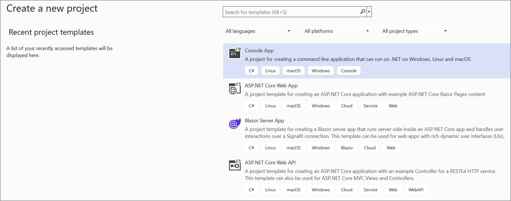

# Save PDF file to Google Cloud storage

To save a PDF file to Google cloud storage, you can follow the steps below

Step 1: Create a simple console application

Step 3: Install the [Syncfusion.Pdf.Net.Core ](https://www.nuget.org/packages/Syncfusion.Pdf.Net.Core) and [Microsoft.Azure.Storage.Blob](https://www.nuget.org/packages/Microsoft.Azure.Storage.Blob) NuGet packages as a reference to your project from the [NuGet.org](https://www.nuget.org/).

  

Step 4: Include the following namespaces in the Program.cs file.





        using Syncfusion.Pdf;
        using Google.Cloud.Storage.V1;
        using Syncfusion.Pdf.Graphics;
        using Google.Apis.Auth.OAuth2;
        using Syncfusion.Drawing;
        using System.IO;





Step 5: Add the below code example to create a simple PDF and save in Google cloud storage.





        // Step 1: Create a PDF document
        PdfDocument document = new PdfDocument();

        // Step 2: Add a page
        PdfPage page = document.Pages.Add();

        // Step 3: Add content to the page (e.g., text, images, etc.)
        PdfGraphics graphics = page.Graphics;
        graphics.DrawString("Hello, World!", new PdfStandardFont(PdfFontFamily.Helvetica, 12), PdfBrushes.Black, new PointF(10, 10));

        // Step 4: Save the PDF to a memory stream
        MemoryStream stream = new MemoryStream();
        document.Save(stream);
        document.Close(true);

        // Step 5: Upload the PDF to Google Cloud Storage
        // Load the credentials file
        GoogleCredential credential = GoogleCredential.FromFile("credentials.json");//Replace with your actual credentials.json

        // Create a storage client
        StorageClient storage = StorageClient.Create(credential);

        // Upload the PDF to the specified bucket and object name
        storage.UploadObject("bucketName", "Sample.pdf", null, stream);//





You can download a complete working sample from GitHub.
