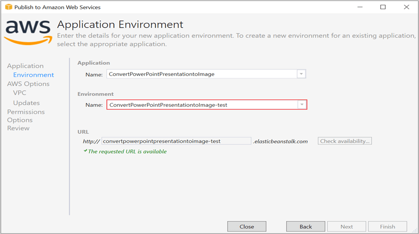
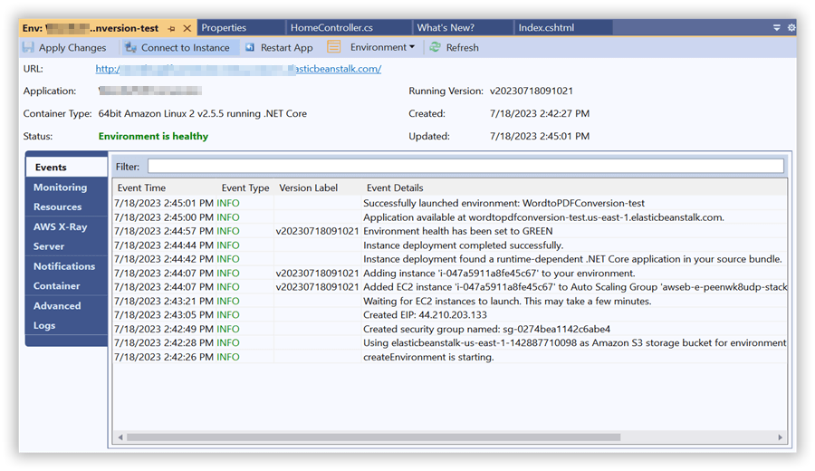
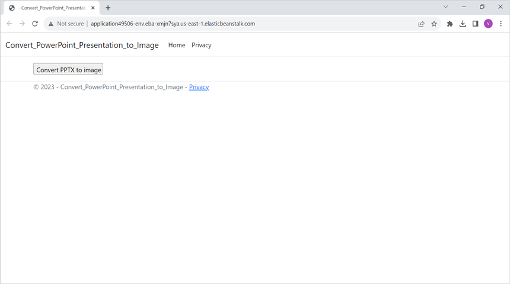

# Convert PowerPoint Presentation to Image in AWS Elastic Beanstalk

Syncfusion PowerPoint is a [.NET Core PowerPoint library](https://www.syncfusion.com/document-processing/powerpoint-framework/net-core) used to create, read, edit and **convert PowerPoint documents** programmatically without **Microsoft PowerPoint** or interop dependencies. Using this library, you can **convert a PowerPoint Presentation to image in AWS Elastic Beanstalk**.

## Steps to convert PowerPoint Presentation to Image in AWS Elastic Beanstalk

Step 1: Create a new ASP.NET Core Web application (Model-View-Controller) project.

)

Step 2: Install the following **Nuget packages** in your application from [Nuget.org](https://www.nuget.org/).

* [Syncfusion.PresentationRenderer.Net.Core](https://www.nuget.org/packages/Syncfusion.PresentationRenderer.Net.Core)
* [SkiaSharp.NativeAssets.Linux.NoDependencies v2.88.6](https://www.nuget.org/packages/SkiaSharp.NativeAssets.Linux.NoDependencies/2.88.6)

N> Starting with v16.2.0.x, if you reference Syncfusion assemblies from trial setup or from the NuGet feed, you also have to add "Syncfusion.Licensing" assembly reference and include a license key in your projects. Please refer to this [link](https://help.syncfusion.com/common/essential-studio/licensing/overview) to know about registering Syncfusion license key in your application to use our components.

Step 3: Include the following namespaces in the **HomeController.cs** file.




using Syncfusion.Presentation;
using Syncfusion.PresentationRenderer;




Step 4: A default action method named Index will be present in HomeController.cs. Right click on Index method and select **Go To View** where you will be directed to its associated view page **Index.cshtml**.

Step 5: Add a new button in the **Index.cshtml** as shown below.




@{
    Html.BeginForm("ConvertPPTXToImage", "Home", FormMethod.Get);
    {
        

            <input type="submit" value="Convert PPTX to image" style="width:175px;height:27px" />
        

    }
    Html.EndForm();
}




Step 6: Include the below code snippet in the **Homecontroller.cs** file to **convert a PowerPoint Presentation to image** and download it.




 public IActionResult ConvertPPTXToImage()
 {
     using (FileStream inputStream = new FileStream(Path.GetFullPath("wwwroot/Data/Input.pptx"), FileMode.Open, FileAccess.Read))
     {
         //Open the existing PPTX document.
         using (IPresentation pptxDoc = Presentation.Open(inputStream))
         {                   
             //Hooks the font substitution event.
             pptxDoc.FontSettings.SubstituteFont += FontSettings_SubstituteFont;
             //Initialize the PresentationRenderer to perform image conversion.
             pptxDoc.PresentationRenderer = new PresentationRenderer();
             //Convert PowerPoint slide to image as stream.
             MemoryStream stream = new MemoryStream();
             stream = (MemoryStream)pptxDoc.Slides[0].ConvertToImage(ExportImageFormat.Jpeg);
             //Unhooks the font substitution event after converting to image file.
             pptxDoc.FontSettings.SubstituteFont -= FontSettings_SubstituteFont;
             stream.Position = 0;
             //Download image file in the browser.
             return File(stream, "image/jpeg", "PPTXToimage_Page1.jpeg");
         }
     }
 }

 //Sets the alternate font when a specified font is not installed in the production environment.
 private void FontSettings_SubstituteFont(object sender, SubstituteFontEventArgs args)
 {
     if (args.OriginalFontName == "Calibri" && args.FontStyle == FontStyle.Regular)
         args.AlternateFontStream = new FileStream(Path.GetFullPath("wwwroot/Fonts/calibri.ttf"), FileMode.Open, FileAccess.Read, FileShare.ReadWrite);
 }




## Steps to publish as AWS Elastic Beanstalk

Step 1: Right-click the project and select **Publish to AWS Elastic Beanstalk (Legacy)** option.

Step 2: Select the **Deployment Target** as **Create a new application environment** and click **Next** button.

Step 3: Choose the **Environment Name** in the dropdown list and the **URL** will be automatically assign and check the URL is available, if available click next otherwise change the **URL**. 

Step 4: Select the instance type in **t3a.micro** from the dropdown list and click next.

Step 5: Click the **Next** button to proceed further.

Step 6: Click the **Next** button.

Step 7: Click the **Deploy** button to deploy the sample on AWS Elastic Beanstalk.

Step 8: After changing the status from **Updating** to **Environment is healthy**, click the **URL**.

Step 9: After opening the provided **URL**, click **Create PowerPoint** button to download the PowerPoint document.

You can download a complete working sample from GitHub.

By executing the program, you will get the **image** as follows.

Click [here](https://www.syncfusion.com/document-processing/powerpoint-framework/net) to explore the rich set of Syncfusion PowerPoint Library (Presentation) features. 

An online sample link to [convert PowerPoint Presentation to image](https://ej2.syncfusion.com/aspnetcore/PowerPoint/PPTXToImage#/material3) in ASP.NET Core. 
