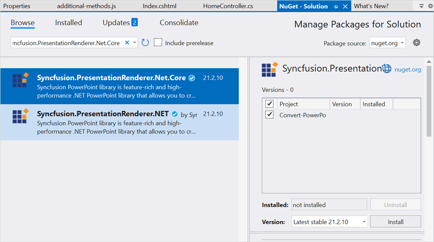
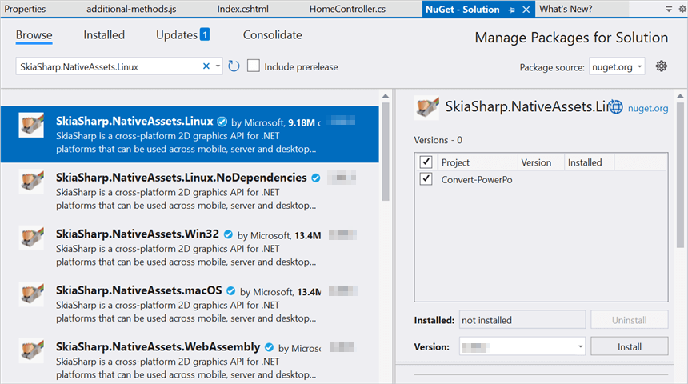
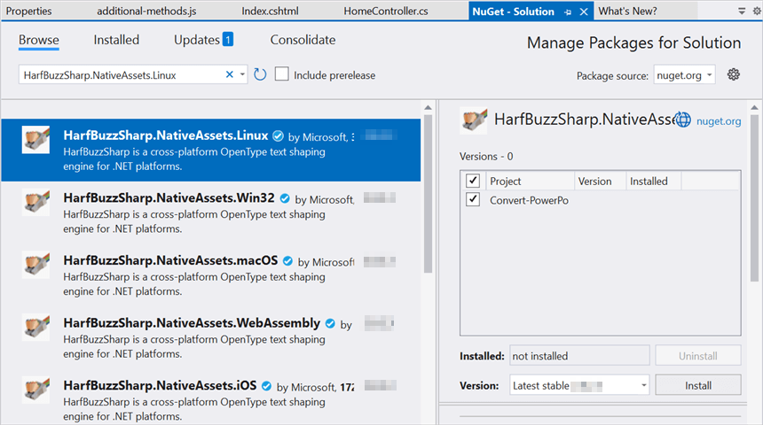
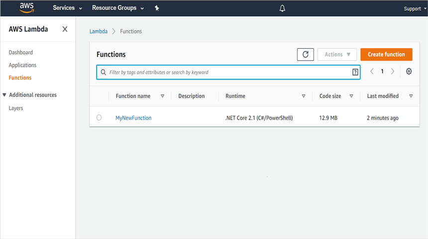
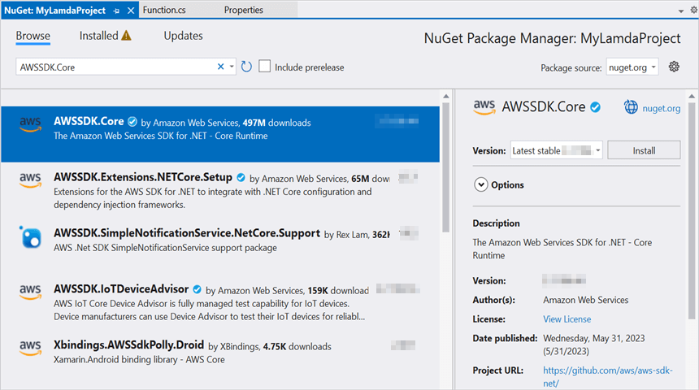
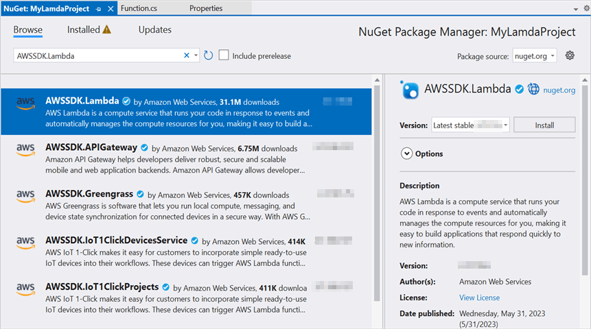

# Convert PowerPoint Presentation to Image in AWS Lambda

Syncfusion PowerPoint is a [.NET Core PowerPoint library](https://www.syncfusion.com/document-processing/powerpoint-framework/net-core) used to create, read, edit and **convert PowerPoint documents** programmatically without **Microsoft PowerPoint** or interop dependencies. Using this library, you can **convert a PowerPoint Presentation to image in AWS Lambda**.

## Steps to convert PowerPoint Presentation to Image in AWS Lambda

Step 1: Create a new **AWS Lambda project** as follows.

Step 2: Select Blueprint as Empty Function and click **Finish**.

Step 3: Install the following **Nuget packages** in your application from [Nuget.org](https://www.nuget.org/).

* [Syncfusion.PresentationRenderer.Net.Core](https://www.nuget.org/packages/Syncfusion.PresentationRenderer.Net.Core)
* [SkiaSharp.NativeAssets.Linux v2.88.2](https://www.nuget.org/packages/SkiaSharp.NativeAssets.Linux/2.88.2)
* [HarfBuzzSharp.NativeAssets.Linux v2.8.2.2](https://www.nuget.org/packages/HarfBuzzSharp.NativeAssets.Linux/2.8.2.2)

N> Starting with v16.2.0.x, if you reference Syncfusion assemblies from trial setup or from the NuGet feed, you also have to add "Syncfusion.Licensing" assembly reference and include a license key in your projects. Please refer to this [link](https://help.syncfusion.com/common/essential-studio/licensing/overview) to know about registering Syncfusion license key in your application to use our components.

Step 4: Create a folder and copy the required data files and include the files to the project.

Step 5: Set the **copy to output directory** to **Copy if newer** to all the data files.

Step 6: Include the following namespaces in **Function.cs** file.




using Syncfusion.Presentation;
using Syncfusion.PresentationRenderer;




step 7: Add the following code snippet in **Function.cs** to **convert a PowerPoint Presentation to image**.




/// 

/// A simple function that takes a string and does a ToUpper
/// 

/// <param name="input"></param>
/// <param name="context"></param>
/// <returns></returns>
public string FunctionHandler(string input, ILambdaContext context)
{
    string filePath = Path.GetFullPath(@"Data/Input.pptx");
    //Open the existing PowerPoint presentation with loaded stream.
    using (IPresentation pptxDoc = Presentation.Open(filePath))
    {
        //Initialize the PresentationRenderer to perform image conversion.
        pptxDoc.PresentationRenderer = new PresentationRenderer();
        //Convert PowerPoint slide to image as stream.
        Stream stream = pptxDoc.Slides[0].ConvertToImage(ExportImageFormat.Jpeg);
        //Reset the stream position.
        stream.Position = 0;
        // Create a memory stream to save the image.
        MemoryStream memoryStream = new MemoryStream();
        stream.CopyTo(memoryStream);
        return Convert.ToBase64String(memoryStream.ToArray());
    }
}




Step 8: Right-click the project and select **Publish to AWS Lambda**.

Step 9: Create a new AWS profile in the Upload Lambda Function Window. After creating the profile, add a name for the Lambda function to publish. Then, click **Next**.

Step 10: In the Advanced Function Details window, specify the **Role Name** as based on AWS Managed policy. After selecting the role, click the **Upload** button to deploy your application.

Step 11: After deploying the application, you can see the published Lambda function in **AWS console**.

Step 12: Edit Memory size and Timeout as maximum in Basic settings of the AWS Lambda function.

## Steps to post the request to AWS Lambda

Step 1: Create a new console project.

step 2: Install the following **Nuget packages** in your application from [Nuget.org](https://www.nuget.org/).

* [AWSSDK.Core](https://www.nuget.org/packages/AWSSDK.Core/)
* [AWSSDK.Lambda](https://www.nuget.org/packages/AWSSDK.Lambda/)
* [Newtonsoft.Json](https://www.nuget.org/packages/Newtonsoft.Json/)

Step 3: Include the following namespaces in **Program.cs** file.




using Amazon;
using Amazon.Lambda;
using Amazon.Lambda.Model;
using Newtonsoft.Json;




Step 4: Add the following code snippet in **Program.cs** to invoke the published AWS Lambda function using the function name and access keys.




//Create a new AmazonLambdaClient
AmazonLambdaClient client = new AmazonLambdaClient("awsaccessKeyID", "awsSecreteAccessKey", RegionEndpoint.USEast2);
//Create new InvokeRequest with published function name.
InvokeRequest invoke = new InvokeRequest
{
    FunctionName = "MyNewFunction",
    InvocationType = InvocationType.RequestResponse,
    Payload = "\"Test\""
};
//Get the InvokeResponse from client InvokeRequest.
InvokeResponse response = client.Invoke(invoke);
//Read the response stream
var stream = new StreamReader(response.Payload);
JsonReader reader = new JsonTextReader(stream);
var serilizer = new JsonSerializer();
var responseText = serilizer.Deserialize(reader);
//Convert Base64String into image file.
byte[] bytes = Convert.FromBase64String(responseText.ToString());
FileStream fileStream = new FileStream("PPTXtoImage.Jpeg", FileMode.Create);
BinaryWriter writer = new BinaryWriter(fileStream);
writer.Write(bytes, 0, bytes.Length);
writer.Close();
System.Diagnostics.Process.Start("PPTXtoImage.Jpeg");




By executing the program, you will get the **image** as follows.

From GitHub, you can download the [console application](https://github.com/SyncfusionExamples/PowerPoint-Examples/tree/master/PPTX-to-Image-conversion/Convert-PowerPoint-presentation-to-Image/AWS/Console_Application) and [AWS Lambda](https://github.com/SyncfusionExamples/PowerPoint-Examples/tree/master/PPTX-to-Image-conversion/Convert-PowerPoint-presentation-to-Image/AWS/AWS_Lambda) project.

