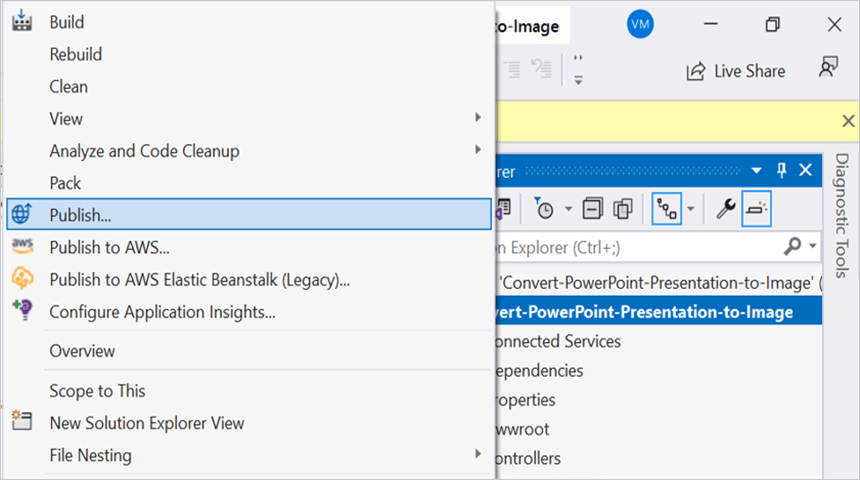
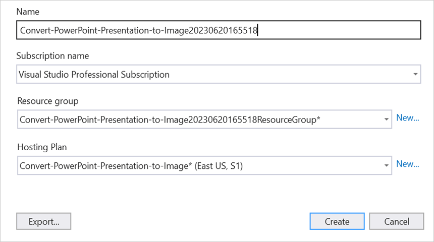
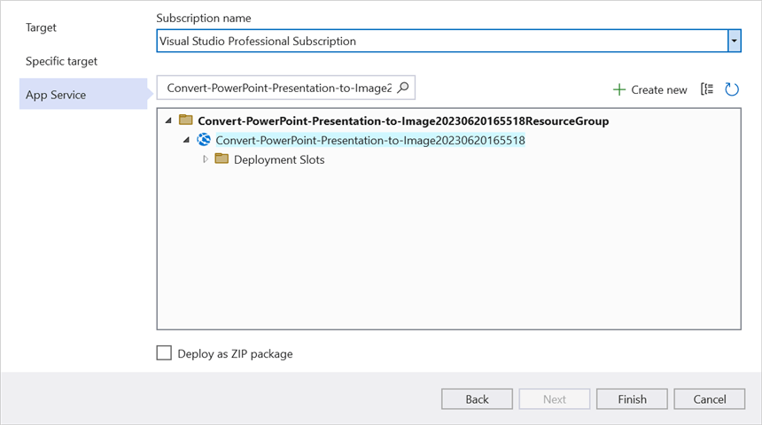
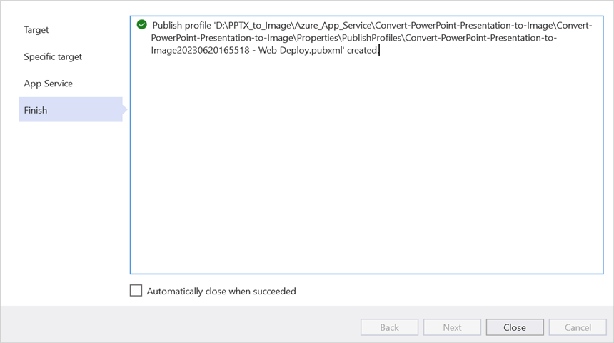
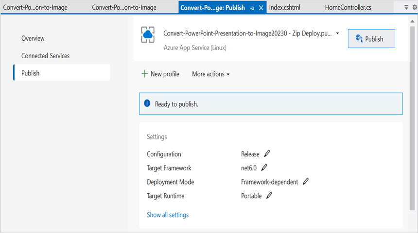
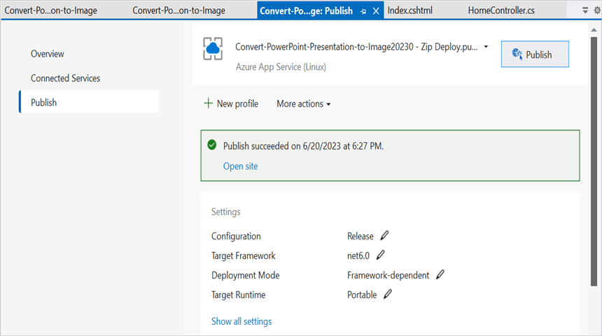
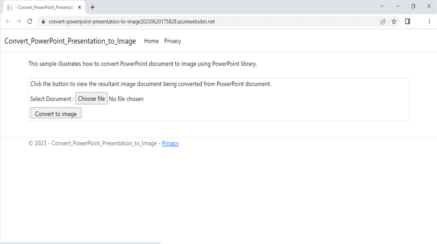

# Convert PowerPoint Presentation to Image in Azure App Service on Linux

Syncfusion PowerPoint is a [.NET Core PowerPoint library](https://www.syncfusion.com/document-processing/powerpoint-framework/net-core) used to create, read, edit and **convert PowerPoint documents** programmatically without **Microsoft PowerPoint** or interop dependencies. Using this library, you can **convert a PowerPoint Presentation to image in Azure App Service on Linux**.

## Steps to convert PowerPoint Presentation to Image in Azure App Service on Linux

Step 1: Create a new ASP.NET Core Web App (Model-View-Controller).

Step 2: Create a project name and select the location.

Step 3: Click **Create** button.

Step 4: Install the following **Nuget packages** in your application from [Nuget.org](https://www.nuget.org/).

* [Syncfusion.PresentationRenderer.Net.Core](https://www.nuget.org/packages/Syncfusion.PresentationRenderer.Net.Core) 
* [SkiaSharp.NativeAssets.Linux v2.88.2](https://www.nuget.org/packages/SkiaSharp.NativeAssets.Linux/2.88.2)
* [HarfBuzzSharp.NativeAssets.Linux v2.8.2.2](https://www.nuget.org/packages/HarfBuzzSharp.NativeAssets.Linux/2.8.2.2)

Step 5: Add a new button in the **Index.cshtml** as shown below.




@{
    Html.BeginForm("ConvertPPTXtoImage", "Home", FormMethod.Post, new { enctype = "multipart/form-data" });
    {
        

            

                

                    This sample illustrates how to convert PowerPoint document to image using PowerPoint library.
                

                &nbsp;
                

                    Click the button to view the resultant image document being converted from PowerPoint document.
                    

                        

                            Select Document :
                            @Html.TextBox("file", "", new { type = "file", accept = ".pptx" })  
                        

                        

                            <input class="buttonStyle" type="submit" value="Convert to image" name="button" style="width:150px;height:27px" />
                             
                            

                                @ViewBag.Message
                            

                        

                    

                

                 
            

        

        Html.EndForm();
    }
}




Step 6: Include the following namespaces in **HomeController.cs**.




using Syncfusion.Presentation;
using Syncfusion.PresentationRenderer;




Step 9: Include the below code snippet in **HomeController.cs** for **convert a PowerPoint Presentation to image**. 





private Microsoft.AspNetCore.Hosting.IHostingEnvironment _env;
public HomeController(Microsoft.AspNetCore.Hosting.IHostingEnvironment env)
{
    _env = env;
}

/// 

/// Convert Presentation to image
/// 

/// <param name="button"></param>
/// <returns></returns>
public ActionResult ConvertPPTXtoImage(string button)
{
    if (button == null)
        return View("Index");
    if (Request.Form.Files != null)
    {
        if (Request.Form.Files.Count == 0)
        {
            ViewBag.Message = string.Format("Browse a PowerPoint Presentation and then click the button to convert as a image");
            return View("Index");
        }
        // Gets the extension from file.
        string extension = Path.GetExtension(Request.Form.Files[0].FileName).ToLower();
        // Compares extension with supported extensions.
        if (extension == ".pptx")
        {
            MemoryStream memoryStream = new MemoryStream();
            Request.Form.Files[0].CopyTo(memoryStream);
            try
            {
                //Open the existing PowerPoint presentation with loaded stream.
                using (IPresentation pptxDoc = Presentation.Open(memoryStream))
                {
                    //Initialize the PresentationRenderer to perform image conversion.
                    pptxDoc.PresentationRenderer = new PresentationRenderer();
                    //Convert PowerPoint slide to image as stream.
                    Stream stream = pptxDoc.Slides[0].ConvertToImage(ExportImageFormat.Jpeg);
                    //Reset the stream position
                    stream.Position = 0;
                    //Download image in the browser.
                    return File(stream, "application/jpeg", "PPTXtoImage.Jpeg");                                
                }
            }
            catch (Exception ex)
            {
                ViewBag.Message = ex.ToString();
            }
        }
        else
        {
            ViewBag.Message = string.Format("Please choose PowerPoint document to convert to image");
        }
    }
    else
    {
        ViewBag.Message = string.Format("Browse a PowerPoint document and then click the button to convert as a image");
    }
    return View("Index");
}




## Steps to publish as Azure App Service on Linux

Step 1: Right-click the project and select **Publish** option.

Step 2: Click the **Add a Publish Profile** button.

Step 3: Select the publish target as **Azure**.

Step 4: Select the Specific target as **Azure App Service (Linux)**.

Step 5: To create a new app service, click **Create new** option.

Step 6: Click the **Create** button to proceed with **App Service** creation.

Step 7: Click the **Finish** button to finalize the **App Service** creation.

Step 8: Click **Close** button.

Step 9: Click the **Publish** button.

Step 10: Now, Publish has been succeeded.

Step 11: Now, the published webpage will open in the browser. 

Step 12: Select the **PowerPoint Presentation** and Click **Convert to Image** to convert the given PowerPoint Presentation to image.You will get the output **image** document as follows.

You can download a complete working sample from [GitHub](https://github.com/SyncfusionExamples/PowerPoint-Examples/tree/master/PPTX-to-Image-conversion/Convert-PowerPoint-presentation-to-Image/Azure/Azure_App_Service).

Click [here](https://www.syncfusion.com/document-processing/powerpoint-framework/net-core) to explore the rich set of Syncfusion PowerPoint Library (Presentation) features. 

An online sample link to [convert PowerPoint Presentation to image](https://ej2.syncfusion.com/aspnetcore/PowerPoint/PPTXToImage#/material3) in ASP.NET Core.
