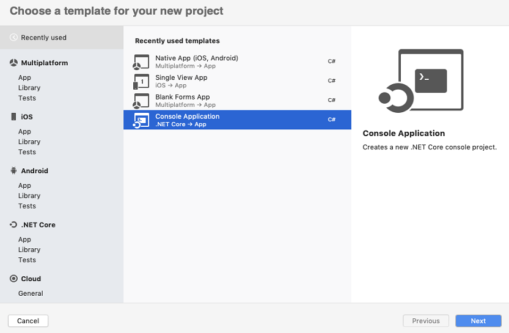
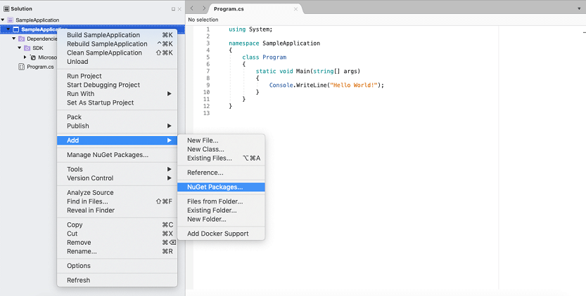

# Convert PowerPoint to Image on macOS

Syncfusion PowerPoint is a [.NET Core PowerPoint library](https://www.syncfusion.com/document-processing/powerpoint-framework/net-core) used to create, read, edit and convert PowerPoint presentation programmatically without **Microsoft PowerPoint** or interop dependencies. Using this library, you can **convert a PowerPoint to image in .NET Core application on macOS**.

## Steps to convert PowerPoint to Image programmatically

Step 1: Create a new C# .NET Core console application.

Step 2: Select the project version.

Step 3: Install the [Syncfusion.PresentationRenderer.Net.Core](https://www.nuget.org/packages/Syncfusion.PresentationRenderer.Net.Core) NuGet package as reference to your .NET Standard applications from [NuGet.org](https://www.nuget.org/).

N> Starting with v16.2.0.x, if you reference Syncfusion assemblies from trial setup or from the NuGet feed, you also have to add "Syncfusion.Licensing" assembly reference and include a license key in your projects. Please refer to this [link](https://help.syncfusion.com/common/essential-studio/licensing/overview) to know about registering Syncfusion license key in your application to use our components.

Step 4: Include the following Namespaces in the **Program.cs** file.




using Syncfusion.Presentation;
using Syncfusion.PresentationRenderer;




Step 5: Add the following code snippet in **Program.cs** file to **convert a PowerPoint to image in .NET Core application on macOS**.




 //Open the file as Stream.
 using (FileStream fileStreamInput = new FileStream("Data/Input.pptx", FileMode.Open, FileAccess.Read))
 {
     //Open the existing PowerPoint presentation with loaded stream.
     using (IPresentation pptxDoc = Presentation.Open(fileStreamInput))
     {
         //Initialize the PresentationRenderer to perform image conversion.
         pptxDoc.PresentationRenderer = new PresentationRenderer();
         //Convert PowerPoint slide to image as stream.
         using (Stream stream = pptxDoc.Slides[0].ConvertToImage(ExportImageFormat.Jpeg))
         {
             //Reset the stream position.
             stream.Position = 0;
             //Create FileStream to save the image file.
             using (FileStream outputStream = new FileStream("PPTXtoImage.Jpeg", FileMode.Create, FileAccess.ReadWrite, FileShare.ReadWrite))
             {
                 //Save the image file.
                 stream.CopyTo(outputStream);
             }
         }
     }
 }




You can download a complete working sample from [GitHub](https://github.com/SyncfusionExamples/PowerPoint-Examples/tree/master/PPTX-to-Image-conversion/Convert-PowerPoint-presentation-to-Image/MAC).

By executing the program, you will get the **image** as follows.

Click [here](https://www.syncfusion.com/document-processing/powerpoint-framework/net-core) to explore the rich set of Syncfusion PowerPoint Library (Presentation) features. 

An online sample link to [convert PowerPoint Presentation to image](https://ej2.syncfusion.com/aspnetcore/PowerPoint/PPTXToImage#/material3) in ASP.NET Core. 