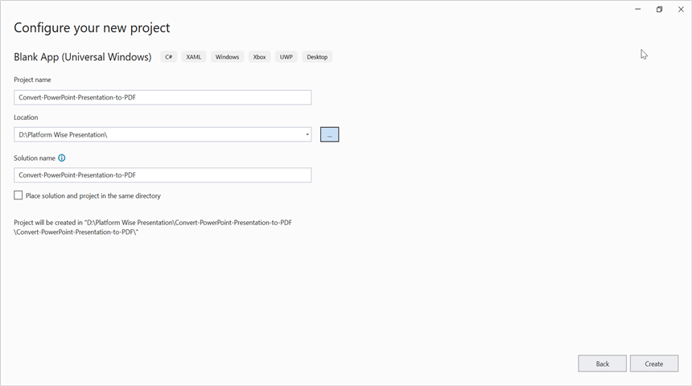
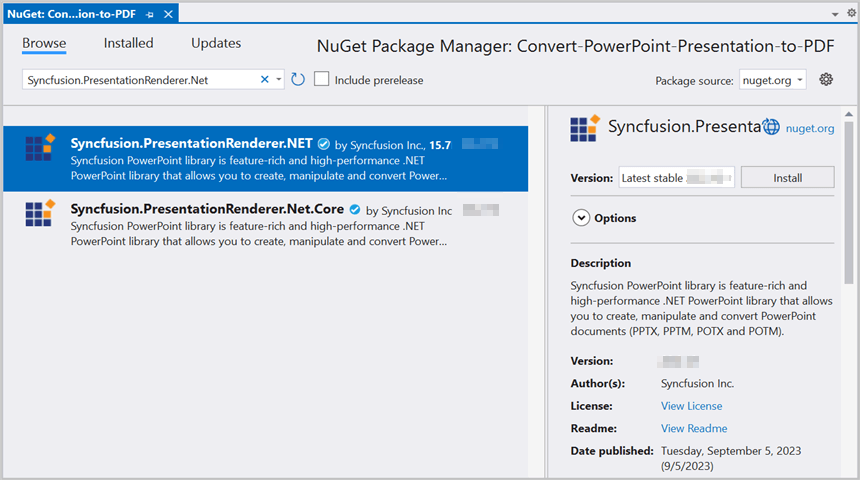

# Convert PowerPoint to Image in WinUI

Syncfusion PowerPoint is a [WinUI PowerPoint library](https://www.syncfusion.com/document-processing/powerpoint-framework/winui/powerpoint-library) used to create, read, edit and convert PowerPoint documents programmatically without **Microsoft PowerPoint** or interop dependencies. Using this library, you can **convert a PowerPoint to image in WinUI**.

## Prerequisites
To use the WinUI 3 project templates, install the Windows App SDK extension for Visual Studio. For more details, refer [here](https://learn.microsoft.com/en-us/windows/apps/windows-app-sdk/set-up-your-development-environment?tabs=cs-vs-community%2Ccpp-vs-community%2Cvs-2022-17-1-a%2Cvs-2022-17-1-b).

## WinUI Desktop app

Step 1: Create a new C# WinUI Desktop app. Select Blank App, Packaged with WAP (WinUI 3 in Desktop) from the template and click the **Next** button.

Step 2: Enter the project name and click **Create**.

Step 3: Install the [Syncfusion.PresentationRenderer.NET](https://www.nuget.org/packages/Syncfusion.Presentation.NET) NuGet package as a reference to your project from [NuGet.org](https://www.nuget.org/).

N> Starting with v16.2.0.x, if you reference Syncfusion assemblies from trial setup or from the NuGet feed, you also have to add "Syncfusion.Licensing" assembly reference and include a license key in your projects. Please refer to this [link](https://help.syncfusion.com/common/essential-studio/licensing/overview) to know about registering a Syncfusion license key in your application to use our components.

Step 4: Add a new button to the **MainWindow.xaml** as shown below.




<?xml version="1.0" encoding="utf-8"?>
<Window
    x:Class="Convert_PowerPoint_Presentation_to_Image.MainWindow"
    xmlns="http://schemas.microsoft.com/winfx/2006/xaml/presentation"
    xmlns:x="http://schemas.microsoft.com/winfx/2006/xaml"
    xmlns:local="using:Convert_PowerPoint_Presentation_to_Image"
    xmlns:d="http://schemas.microsoft.com/expression/blend/2008"
    xmlns:mc="http://schemas.openxmlformats.org/markup-compatibility/2006"
    mc:Ignorable="d">

    <StackPanel Orientation="Horizontal" HorizontalAlignment="Center" VerticalAlignment="Center">
        <Button x:Name="button" Click="ConvertPPTXtoImage">Convert PPTX to Image</Button>
    </StackPanel>
</Window>




Step 5: Include the following namespaces in the **MainWindow.xaml.cs** file.




using Syncfusion.Presentation;
using Syncfusion.PresentationRenderer;




Step 6: Add a new action method **ConvertPPTXtoImage** in MainWindow.xaml.cs and include the below code snippet to **convert a PowerPoint to image in WinUI**.




//Loading an existing PowerPoint document.
Assembly assembly = typeof(App).GetTypeInfo().Assembly;
//Open the existing PowerPoint presentation with loaded stream.
using (IPresentation pptxDoc = Presentation.Open(assembly.GetManifestResourceStream("Convert_PowerPoint_Presentation_to_Image.Assets.Input.pptx")))
{
    //Initialize the PresentationRenderer.
    pptxDoc.PresentationRenderer = new PresentationRenderer();
    //Converts the first slide into image.
    Stream stream = pptxDoc.Slides[0].ConvertToImage(ExportImageFormat.Jpeg);
    //Reset the stream position.
    stream.Position = 0;
    //Save the stream as a image file in the local machine.
    SaveHelper.SaveAndLaunch("PPTXtoImage.Jpeg", stream as MemoryStream);
}




## Save Image file in WinUI





public static async void SaveAndLaunch(string filename, MemoryStream stream)
{
    StorageFile storageFile;
    string extension = Path.GetExtension(filename);
    //Gets process windows handle to open the dialog in application process.
    IntPtr windowHandle = System.Diagnostics.Process.GetCurrentProcess().MainWindowHandle;
    if (!Windows.Foundation.Metadata.ApiInformation.IsTypePresent("Windows.Phone.UI.Input.HardwareButtons"))
    {
        FileSavePicker savePicker = new();
        
        if (extension == ".Jpeg")
        {
            savePicker.DefaultFileExtension = ".jpeg";
            savePicker.SuggestedFileName = filename;
            //Saves the file as image file.
            savePicker.FileTypeChoices.Add("JPEG", new List<string>() { ".jpeg" });
        }

        WinRT.Interop.InitializeWithWindow.Initialize(savePicker, windowHandle);
        storageFile = await savePicker.PickSaveFileAsync();
    }
    else
    {
        StorageFolder local = ApplicationData.Current.LocalFolder;
        storageFile = await local.CreateFileAsync(filename, CreationCollisionOption.ReplaceExisting);
    }
    if (storageFile != null)
    {
        using (IRandomAccessStream zipStream await storageFile.OpenAsync(FileAccessMode.ReadWrite))
        {
            //Writes compressed data from memory to file.
            using Stream outstream = zipStream.AsStreamForWrite();
            outstream.SetLength(0);
            byte[] buffer = stream.ToArray();
            outstream.Write(buffer, 0, buffer.Length);
            outstream.Flush();
        }

        //Creates message dialog box. 
        MessageDialog msgDialog = new("Do you want to view the Document?", "File has been converted successfully");
        UICommand yesCmd = new("Yes");
        msgDialog.Commands.Add(yesCmd);
        UICommand noCmd = new("No");
        msgDialog.Commands.Add(noCmd);

        WinRT.Interop.InitializeWithWindow.Initialize(msgDialog, windowHandle);

        //Showing a dialog box. 
        IUICommand cmd = await msgDialog.ShowAsync();
        if (cmd.Label == yesCmd.Label)
        {
            //Launch the saved file. 
            await Windows.System.Launcher.LaunchFileAsync(storageFile);
        }
    }
}




You can download a complete working sample from [GitHub](https://github.com/SyncfusionExamples/PowerPoint-Examples/tree/master/PPTX-to-Image-conversion/Convert-PowerPoint-presentation-to-Image/WinUI).

By executing the program, you will get the **image** as follows.

Click [here](https://www.syncfusion.com/document-processing/powerpoint-framework/winui) to explore the rich set of Syncfusion PowerPoint Library (Presentation) features. 

An online sample link to [convert PowerPoint Presentation to image](https://ej2.syncfusion.com/aspnetcore/PowerPoint/PPTXToImage#/material3) in ASP.NET Core. 