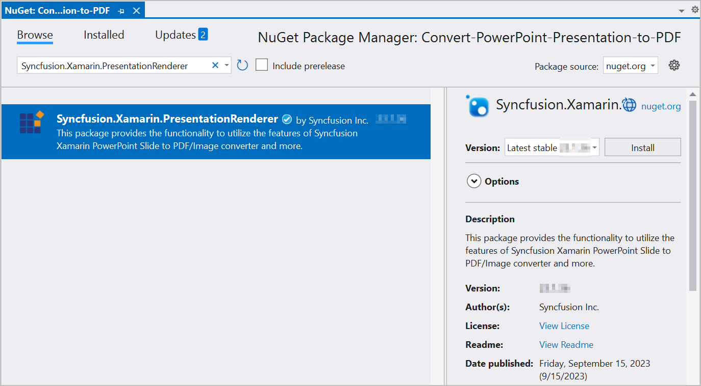

# Convert PowerPoint to Image in Xamarin

Syncfusion PowerPoint is a [Xamarin PowerPoint library](https://www.syncfusion.com/document-processing/powerpoint-framework/xamarin/powerpoint-library) used to create, read, edit and convert PowerPoint documents programmatically without **Microsoft PowerPoint** or interop dependencies. Using this library, you can **convert a PowerPoint to image in Xamarin**.

## Steps to convert PowerPoint to Image programmatically

Step 1: Create a new C# **Xamarin.Forms** application project.

Step 2: Select a project template and required platforms to deploy the application. In this application the portable assemblies to be shared across multiple platforms, the .NET Standard code sharing strategy has been selected. For more details about code sharing refer [here](https://docs.microsoft.com/en-us/xamarin/cross-platform/app-fundamentals/code-sharing).

Step 3: Install [Syncfusion.Xamarin.PresentationRenderer](https://www.nuget.org/packages/Syncfusion.Xamarin.PresentationRenderer) NuGet package as a reference to the .NET Standard project in your Xamarin applications from [NuGet.org](https://www.nuget.org/).

N> Starting with v16.2.0.x, if you reference Syncfusion assemblies from trial setup or from the NuGet feed, you also have to add "Syncfusion.Licensing" assembly reference and include a license key in your projects. Please refer to this [link](https://help.syncfusion.com/common/essential-studio/licensing/overview) to know about registering Syncfusion license key in your application to use our components.

Step 4: Add new Forms XAML page in portable project If there is no XAML page is defined in the App class. Otherwise proceed to the next step.
<ul>
<li>To add the new XAML page, right click on the project and select <b>Add > New Item</b> and add a Forms XAML Page from the list. Name it as MainXamlPage.</li>
<li>In App class of <b>portable project</b> (App.cs), replace the existing constructor of App class with the code snippet given below which invokes the <b>MainXamlPage</b>.</li>
</ul>




public App()
{
  // The root page of your application
  MainPage = new MainXamlPage();
}




Step 5: In the **MainXamlPage.xaml** add new button as shown below.




<?xml version="1.0" encoding="utf-8" ?>
<ContentPage xmlns="http://xamarin.com/schemas/2014/forms"
             xmlns:x="http://schemas.microsoft.com/winfx/2009/xaml"
             x:Class="Convert_PowerPoint_Presentation_to_Image.MainPage">
    <StackLayout VerticalOptions="Center">
        <Button Text="Convert PPTXtoImage" Clicked="OnButtonClicked" HorizontalOptions="Center"/>
    </StackLayout>
</ContentPage>




Step 6: Include the following namespace in the MainXamlPage.xaml.cs file.




using Syncfusion.Presentation;
using Syncfusion.PresentationRenderer;




Step 7: Include the below code snippet in the click event of the button in MainXamlPage.xaml.cs, to **convert a PowerPoint to image in Xamarin**.




//Loading an existing PowerPoint document.
Assembly assembly = typeof(App).GetTypeInfo().Assembly;
//Open the existing PowerPoint presentation with loaded stream.
using (IPresentation pptxDoc = Presentation.Open(assembly.GetManifestResourceStream("Convert-PowerPoint-Presentation-to-Image.Assets.Input.pptx")))
{
    pptxDoc.PresentationRenderer = new PresentationRenderer();
    //Convert PowerPoint slide to image as stream.
    using (Stream stream = pptxDoc.Slides[0].ConvertToImage(ExportImageFormat.Jpeg))
    {
        //Reset the stream position.
        stream.Position = 0;
        //Create the MemoryStream to save the converted image.
        using (MemoryStream imageStream = new MemoryStream())
        {
            stream.CopyTo(imageStream);
            //Save the stream as a file in the device and invoke it for viewing.
            Xamarin.Forms.DependencyService.Get<ISave>().SaveAndView("PPTXtoImage.Jpeg", "application/jpeg", imageStream);
        }
    }                   
}




## Helper files for Xamarin

Refer the below helper files and add them into the mentioned project. These helper files allow you to save the stream as a physical file and open the file for viewing.

<table>
  <tr>
  <td>
    <b>Project</b>
  </td>
  <td>
    <b>File Name</b>
  </td>
  <td>
    <b>Summary</b>
  </td>
  </tr>
  <tr>
  <td>
    {{'[Portable project](https://github.com/SyncfusionExamples/PowerPoint-Examples/tree/master/PPTX-to-Image-conversion/Convert-PowerPoint-presentation-to-Image/Xamarin/Convert-PowerPoint-Presentation-to-Image/Convert-PowerPoint-Presentation-to-Image)'| markdownify }}
  </td>
  <td>
    {{'[ISave.cs](https://github.com/SyncfusionExamples/PowerPoint-Examples/blob/master/PPTX-to-Image-conversion/Convert-PowerPoint-presentation-to-Image/Xamarin/Convert-PowerPoint-Presentation-to-Image/Convert-PowerPoint-Presentation-to-Image/ISave.cs)'| markdownify }}
  </td>
  <td>Represent the base interface for save operation
  </td>
  </tr>
  <tr>
  <td rowspan="2">
    {{'[iOS Project](https://github.com/SyncfusionExamples/PowerPoint-Examples/tree/master/PPTX-to-Image-conversion/Convert-PowerPoint-presentation-to-Image/Xamarin/Convert-PowerPoint-Presentation-to-Image/Convert-PowerPoint-Presentation-to-Image.iOS)'| markdownify }}
  </td>
  <td>
    {{'[SaveIOS.cs](https://github.com/SyncfusionExamples/PowerPoint-Examples/blob/master/PPTX-to-Image-conversion/Convert-PowerPoint-presentation-to-Image/Xamarin/Convert-PowerPoint-Presentation-to-Image/Convert-PowerPoint-Presentation-to-Image.iOS/SaveIOS.cs)'| markdownify }}
  </td>
  <td>
    Save implementation for iOS device
  </td>
  </tr>
  <tr>
  <td>
    {{'[PreviewControllerDS.cs](https://github.com/SyncfusionExamples/PowerPoint-Examples/blob/master/PPTX-to-Image-conversion/Convert-PowerPoint-presentation-to-Image/Xamarin/Convert-PowerPoint-Presentation-to-Image/Convert-PowerPoint-Presentation-to-Image.iOS/PreviewControllerDS.cs)'| markdownify }}
  </td>
  <td>
    Helper class for viewing the <b>PowerPoint Presenatation</b> in iOS device
  </td>
  </tr>
  <tr>
  <td>
    {{'[Android project](https://github.com/SyncfusionExamples/PowerPoint-Examples/tree/master/PPTX-to-Image-conversion/Convert-PowerPoint-presentation-to-Image/Xamarin/Convert-PowerPoint-Presentation-to-Image/Convert-PowerPoint-Presentation-to-Image.Android)'| markdownify }}
  </td>
  <td>
   {{'[SaveAndroid.cs](https://github.com/SyncfusionExamples/PowerPoint-Examples/blob/master/PPTX-to-Image-conversion/Convert-PowerPoint-presentation-to-Image/Xamarin/Convert-PowerPoint-Presentation-to-Image/Convert-PowerPoint-Presentation-to-Image.Android/SaveAndroid.cs)'| markdownify }}
  </td>
  <td>Save implementation for Android device
  </td>
  </tr>
  <tr>
  <td>
    {{'[UWP project](https://github.com/SyncfusionExamples/PowerPoint-Examples/tree/master/PPTX-to-Image-conversion/Convert-PowerPoint-presentation-to-Image/Xamarin/Convert-PowerPoint-Presentation-to-Image/Convert-PowerPoint-Presentation-to-Image.UWP)'| markdownify }}
  </td>
  <td>
    {{'[SaveWindows.cs](https://github.com/SyncfusionExamples/PowerPoint-Examples/blob/master/PPTX-to-Image-conversion/Convert-PowerPoint-presentation-to-Image/Xamarin/Convert-PowerPoint-Presentation-to-Image/Convert-PowerPoint-Presentation-to-Image.UWP/SaveWindows.cs)'| markdownify }}
  </td>
  <td>Save implementation for UWP device.
  </td>
  </tr>
</table>

Compile and execute the application. Now this application convert a PowerPoint to image.

You can download a complete working sample from [GitHub](https://github.com/SyncfusionExamples/PowerPoint-Examples/tree/master/PPTX-to-Image-conversion/Convert-PowerPoint-presentation-to-Image/Xamarin).

By executing the program, you will get the **image** as follows.

Click [here](https://www.syncfusion.com/document-processing/powerpoint-framework/xamarin) to explore the rich set of Syncfusion PowerPoint Library (Presentation) features. 

An online sample link to [convert PowerPoint Presentation to image](https://ej2.syncfusion.com/aspnetcore/PowerPoint/PPTXToImage#/material3) in ASP.NET Core. 

