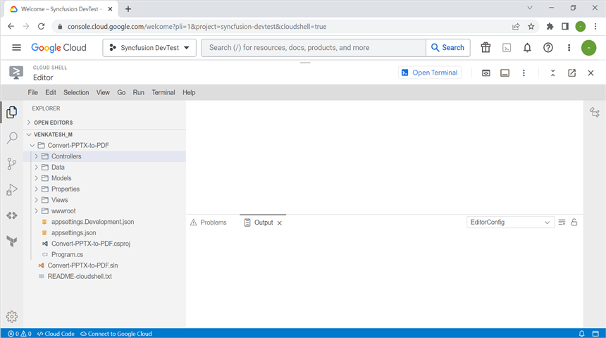
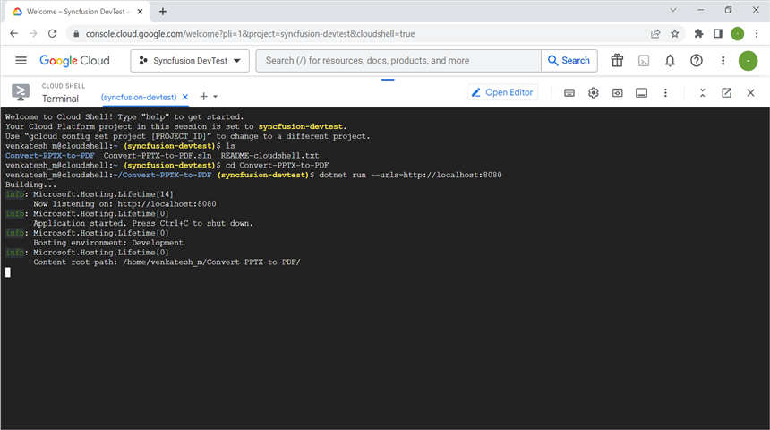
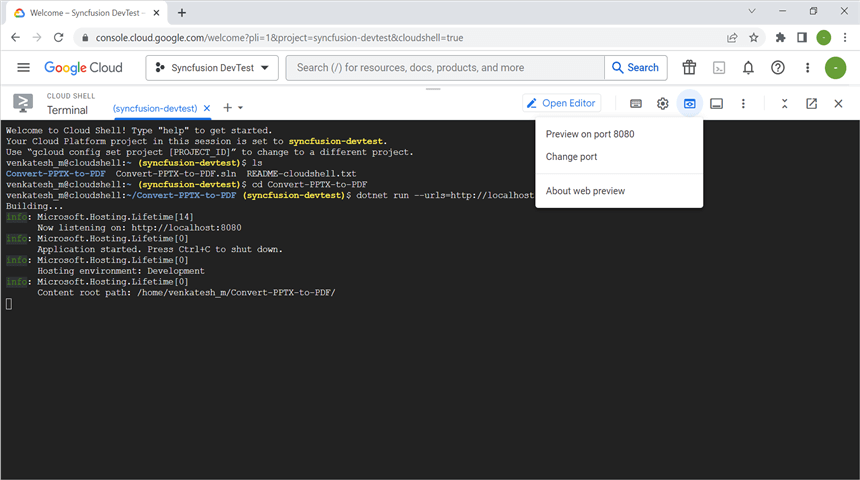
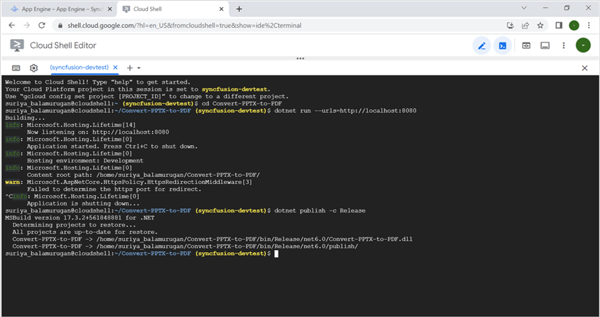
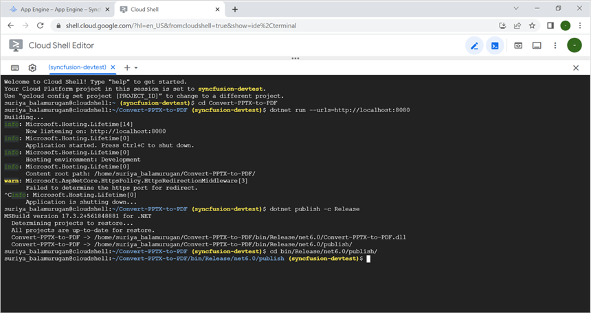
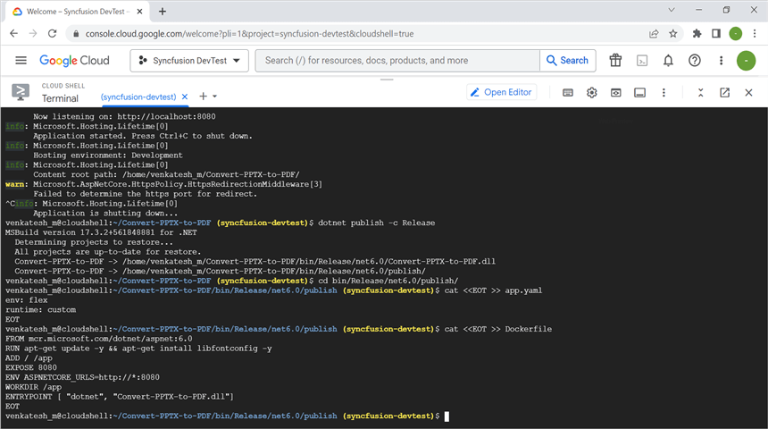
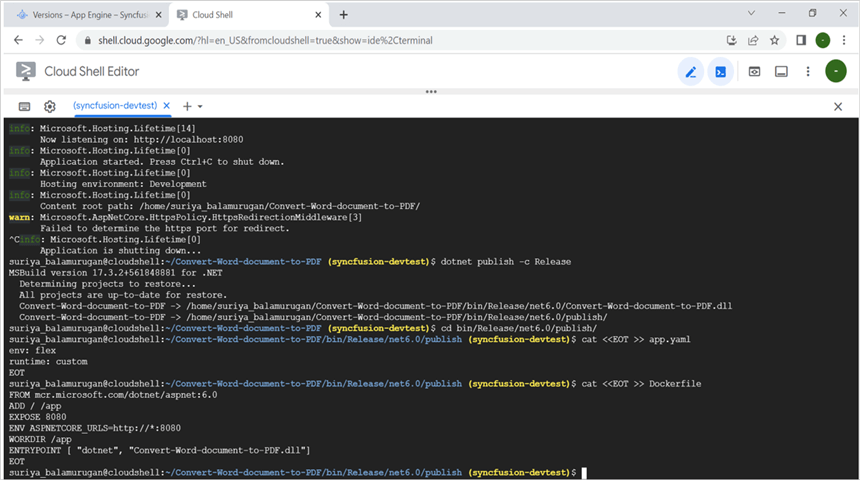
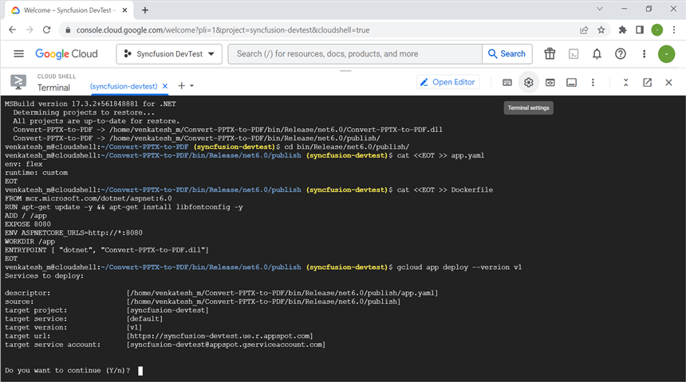
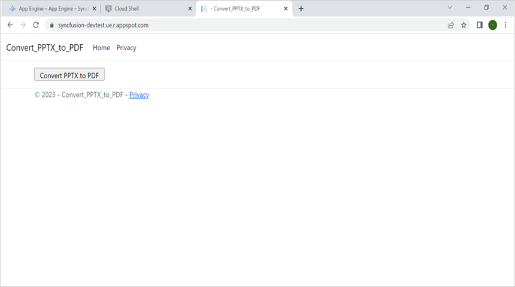

# Convert PowerPoint Presentation to PDF in GCP App Engine

Syncfusion PowerPoint is a [.NET Core PowerPoint library]https://www.syncfusion.com/document-processing/powerpoint-framework/net-core) used to create, read, edit and **convert PowerPoint documents** programmatically without **Microsoft PowerPoint** or interop dependencies. Using this library, you can **convert a PowerPoint Presentation to PDF in GCP App Engine**.

## Setting Up App Engine

Step 1: Click the **Activate Cloud Shell** button.

Step 2: In the **Cloud Shell editor**, run the following **command** to confirm authentication.




gcloud auth list




Step 3: Click the **Authorize** button.

Step 4: Click the **Open editor** button.

## Creating a Sample Application Using Visual Studio

Step 1: Open Visual Studio and select the ASP.NET Core Web app (Model-View-Controller) template.

Step 2: Configure your new project according to your requirements.

Step 3: Click the **Create** button.

Step 4: Install the following **Nuget packages** in your application from [Nuget.org](https://www.nuget.org/).

* [Syncfusion.PresentationRenderer.Net.Core](https://www.nuget.org/packages/Syncfusion.PresentationRenderer.Net.Core) 
* [SkiaSharp.NativeAssets.Linux v2.88.2](https://www.nuget.org/packages/SkiaSharp.NativeAssets.Linux/2.88.2)
* [HarfBuzzSharp.NativeAssets.Linux v2.8.2.2](https://www.nuget.org/packages/HarfBuzzSharp.NativeAssets.Linux/2.8.2.2)

N> Starting with v16.2.0.x, if you reference Syncfusion assemblies from trial setup or from the NuGet feed, you also have to add "Syncfusion.Licensing" assembly reference and include a license key in your projects. Please refer to this [link](https://help.syncfusion.com/common/essential-studio/licensing/overview) to know about registering Syncfusion license key in your application to use our components.

Step 4: Include the following namespaces in the **HomeController.cs** file.




using Syncfusion.Presentation;
using Syncfusion.PresentationRenderer;
using Syncfusion.Pdf;




Step 5: A default action method named Index will be present in HomeController.cs. Right click on Index method and select **Go To View** where you will be directed to its associated view page **Index.cshtml**.

Step 6: Add a new button in the Index.cshtml as shown below.




@{
    Html.BeginForm("ConvertPPTXToPDF", "Home", FormMethod.Get);
    {
        

            <input type="submit" value="Convert PPTX to PDF" style="width:175px;height:27px" />
        

    }
    Html.EndForm();
}




Step 7: Add a new action method **ConvertPPTXToPDF** in HomeController.cs and include the below code snippet to **convert the PowerPoint Presentation to Pdf** and download it.




using (FileStream inputStream = new FileStream(Path.GetFullPath("Data/Input.pptx"), FileMode.Open, FileAccess.Read))
{
    //Opens the existing PPTX document.
    using (IPresentation pptxDoc = Presentation.Open(inputStream))
    {
        //Converts PPTX document into PDF document.
        using (PdfDocument pdfDocument = PresentationToPdfConverter.Convert(pptxDoc))
        { 
            //Saves the PDF document to MemoryStream.
            pdfDocument.Save(stream);
            stream.Position = 0;
            //Download PDF document in the browser.
            return File(stream, "application/pdf", "PPTXtoPDF.pdf");
        }
    }
}




## Deploying the Application to App Engine

Step 1: Open the **Cloud Shell editor**.

Step 2: Open the **Home Workspace** in the Cloud Shell editor.

N> If you have your sample application in your local machine, drag and drop it into the Workspace. If you created the sample using the Cloud Shell terminal command, it will be available in the Workspace.

Step 3: Open the terminal and run the following **command** to view the files and directories within your **current workspace** or directory.




$ ls
This will show the list of files and folders in workspace. Navigate to which sample you want run.
$ cd Convert-PPTX-to-PDF




Step 4: Finally, **run the application** using the following command.




dotnet run --urls=http://localhost:8080




Step 5: Verify that the application is running properly by accessing the **Web View** -> **Preview on port 8080**.

Step 6: Close the preview page and return to the terminal. Press **Ctrl+C** to shut down the application.

## Publishing the Application to GCP

Step 1: Run the following command in Cloud Shell to publish the application.




dotnet publish -c Release




Step 2: Run the following command in Cloud Shell to Navigate to the publish folder.




cd bin/Release/net6.0/publish/




Step 3: Add the app.yaml file to the publish folder with the following contents.




$ cat <<EOT >> app.yaml
env: flex
runtime: custom   
EOT




Step 4: Add the Docker file to the publish folder with the following contents.




$ cat <<EOT >> Dockerfile
FROM mcr.microsoft.com/dotnet/aspnet:6.0
RUN apt-get update -y && apt-get install libfontconfig -y
ADD / /app
EXPOSE 8080
ENV ASPNETCORE_URLS=http://*:8080
WORKDIR /app
ENTRYPOINT [ "dotnet", "Convert-Word-document-to-PDF.dll"]
EOT




Step 6: Run the following command in Cloud Shell to Deploy the application to cloud service.




$ gcloud app deploy --version v1




Step 8: The application is now deployed successfully.

You can download a complete working sample from GitHub.

By executing the program, you will get the **PDF document** as follows. The output will be saved in bin folder.

