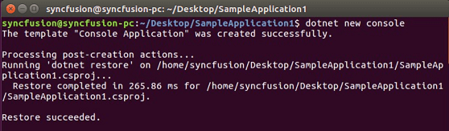
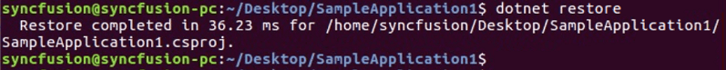
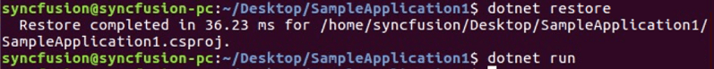

# Convert PowerPoint to PDF in Linux

Syncfusion PowerPoint is a [.NET Core PowerPoint library](https://www.syncfusion.com/document-processing/powerpoint-framework/net-core) used to create, read, edit and **convert PowerPoint documents** programmatically without **Microsoft PowerPoint** or interop dependencies. Using this library, you can **convert a PowerPoint to PDF in .NET Core application on Linux**.

## Steps to convert PowerPoint to PDF in .NET Core application on Linux

Step 1: Execute the following command in **Linux terminal** to create a new .NET Core Console application.




dotnet new console




Step 2: Install the following **Nuget packages** in your application from [Nuget.org](https://www.nuget.org/) by execute the following command.

* [Syncfusion.PresentationRenderer.Net.Core](https://www.nuget.org/packages/Syncfusion.DocIORenderer.Net.Core) 
* [SkiaSharp.NativeAssets.Linux v2.88.2](https://www.nuget.org/packages/SkiaSharp.NativeAssets.Linux/2.88.2)
* [HarfBuzzSharp.NativeAssets.Linux v2.8.2.2](https://www.nuget.org/packages/HarfBuzzSharp.NativeAssets.Linux/2.8.2.2)




dotnet add package Syncfusion.PresentationRenderer.Net.Core -v 22.1.38 -s https://www.nuget.org/
dotnet add package SkiaSharp.NativeAssets.Linux -v 2.88.2 -s https://www.nuget.org/
dotnet add package HarfBuzzSharp.NativeAssets.Linux -v 2.8.2.2 -s https://www.nuget.org/




N> Starting with v16.2.0.x, if you reference Syncfusion assemblies from trial setup or from the NuGet feed, you also have to add "Syncfusion.Licensing" assembly reference and include a license key in your projects. Please refer to this [link](https://help.syncfusion.com/common/essential-studio/licensing/overview) to know about registering Syncfusion license key in your applications to use our components.

Step 3: Add the following Namespaces in **Program.cs** file.




using Syncfusion.Presentation;
using Syncfusion.PresentationRenderer;
using Syncfusion.Pdf;




Step 4: Add the following code snippet in **Program.cs** file.




//Open the file as Stream
using (FileStream fileStreamInput = new FileStream(Path.GetFullPath(@"../../../Data/Input.pptx"), FileMode.Open, FileAccess.Read))
{
    //Open the existing PowerPoint presentation with loaded stream.
    using (IPresentation pptxDoc = Presentation.Open(fileStreamInput))
    {
        //Convert the PowerPoint document to PDF document.
        using (PdfDocument pdfDocument = PresentationToPdfConverter.Convert(pptxDoc))
        {
            //Save the converted PDF document to MemoryStream.
            MemoryStream pdfStream = new MemoryStream();
            pdfDocument.Save(pdfStream);
            pdfStream.Position = 0;
            //Create FileStream to save the PDF file.
            using (FileStream outputStream = new FileStream("Sample.pdf", FileMode.Create, FileAccess.ReadWrite, FileShare.ReadWrite))
            {
                //Saves the PDF file.
                pdfDocument.Save(outputStream);
            }
        }
    }
}




Step 5: Execute the following command to **restore** the NuGet packages.




dotnet restore




Step 6: Execute the following command in **terminal** to **run the application**.




dotnet run




You can download a complete working sample from GitHub.

By executing the program, you will get the **PDF** as follows. The output will be saved in parallel to program.cs file.

