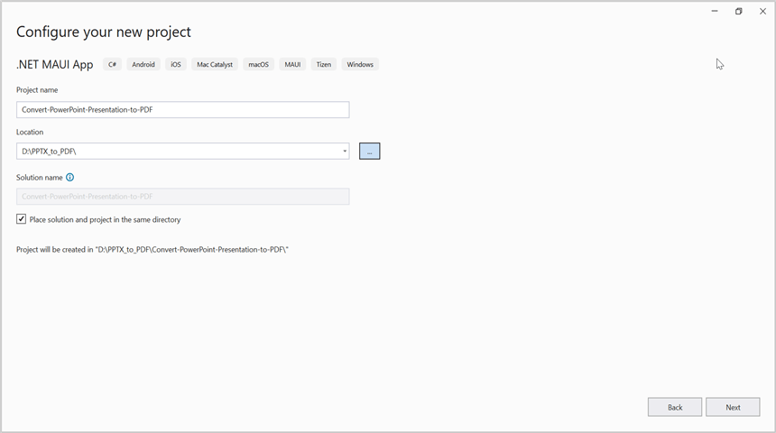

# Convert PowerPoint to PDF in .NET MAUI

Syncfusion PowerPoint is a [.NET MAUI PowerPoint library](https://www.syncfusion.com/powerpoint-framework/maui/powerpoint-library) used to create, read, edit and convert PowerPoint documents programmatically without **Microsoft PowerPoint** or interop dependencies. Using this library, you can **convert a PowerPoint to PDF in .NET MAUI**.

## Prerequisites
To create .NET Multi-platform App UI (.NET MAUI) apps, you need the latest versions of Visual Studio 2022 and .NET 6. For more details, refer [here](https://docs.microsoft.com/en-us/dotnet/maui/get-started/installation).

## Steps to convert PowerPoint to PDF programmatically

Step 1: Create a new C# .NET MAUI app. Select **.NET MAUI App (Preview)** from the template and click the **Next** button.

Step 2: Enter the project name and click **Create**.

Step 3: Install the [Syncfusion.PresentationRenderer.NET](https://www.nuget.org/packages/Syncfusion.Presentation.NET) NuGet package as a reference to your project from [NuGet.org](https://www.nuget.org/).

N> Starting with v16.2.0.x, if you reference Syncfusion assemblies from trial setup or from the NuGet feed, you also have to add "Syncfusion.Licensing" assembly reference and include a license key in your projects. Please refer to this [link](https://help.syncfusion.com/common/essential-studio/licensing/overview) to know about registering Syncfusion license key in your application to use our components.

Step 4: Add a new button to the **MainPage.xaml** as shown below.




<?xml version="1.0" encoding="utf-8" ?>
<ContentPage xmlns="http://schemas.microsoft.com/dotnet/2021/maui"
             xmlns:x="http://schemas.microsoft.com/winfx/2009/xaml"
             x:Class="Convert_PowerPoint_Presentation_to_PDF.MainPage">
    <ScrollView>
        <Grid RowSpacing="25" RowDefinitions="Auto,Auto,Auto,Auto,*"
            Padding="{OnPlatform iOS='30,60,30,30', Default='30'}">
            <Button 
                Text="Convert PPTX to PDF"
                FontAttributes="Bold"
                Grid.Row="0"
                SemanticProperties.Hint="Convert PPTX to PDF"
                Clicked="ConvertPPTXtoPDF"
                HorizontalOptions="Center" />
        </Grid>
    </ScrollView>
</ContentPage>




Step 5: Include the following namespaces in the **MainPage.xaml.cs** file.




using Syncfusion.Presentation;
using Syncfusion.PresentationRenderer;
using Syncfusion.Pdf;




Step 6: Add a new action method **ConvertPPTXtoPDF** in MainPage.xaml.cs and include the below code snippet to **convert a PowerPoint to PDF in .NET MAUI**.




//Loading an existing PowerPoint document.
Assembly assembly = typeof(App).GetTypeInfo().Assembly;
//Open the existing PowerPoint presentation with loaded stream.
using (IPresentation pptxDoc = Presentation.Open(assembly.GetManifestResourceStream("Convert_PowerPoint_Presentation_to_PDF.Assets.Input.docx")))
{
    //Convert the PowerPoint document to PDF document.
    using (PdfDocument pdfDocument = PresentationToPdfConverter.Convert(pptxDoc))
    {
        //Save the converted PDF document to MemoryStream.
        MemoryStream pdfStream = new MemoryStream();
        pdfDocument.Save(pdfStream);
        pdfStream.Position = 0;
        //save and Launch the PDF document.
        SaveService saveService = new();
        saveService.SaveAndView("Sample.pdf", "application/pdf", pdfStream);
    }
}




You can download a complete working sample from [GitHub](https://github.com/SyncfusionExamples/PowerPoint-Examples/tree/master/Read-and-save-PowerPoint-presentation/Open-and-save-PowerPoint/.NET-MAUI).

By executing the program, you will get the **PDF document** as follows.

## Helper files for .NET MAUI

Refer the below helper files and add them into the mentioned project. These helper files allow you to save the stream as a physical file and open the file for viewing.

<table>
  <tr>
  <td>
    <b>Folder Name</b>
  </td>
  <td>
    <b>File Name</b>
  </td>
  <td>
    <b>Summary</b>
  </td>
  </tr>
  <tr>
  <td>
    {{'[.NET MAUI Project]()'| markdownify }}
  </td>
  <td>
    {{'[SaveService.cs]()'| markdownify }}
  </td>
  <td>Represent the base class for save operation.
  </td>
  </tr>
  <tr>
  <td>
    {{'[Windows]()'| markdownify }}
  </td>
  <td>
    {{'[SaveWindows.cs]()'| markdownify }}
  </td>
  <td>Save implementation for Windows.
  </td>
  </tr>
  <tr>
  <td>
    {{'[Android]()'| markdownify }}
  </td>
  <td>
    {{'[SaveAndroid.cs]()'| markdownify }}
  </td>
  <td>Save implementation for Android device.
  </td>
  </tr>
  <tr>
  <td>
    {{'[Mac Catalyst]()'| markdownify }}
  </td>
  <td>
    {{'[SaveMac.cs]()'| markdownify }}
  </td>
  <td>Save implementation for Mac Catalyst device.
  </td>
  </tr>
  <tr>
  <td rowspan="2">
    {{'[iOS]()'| markdownify }}
  </td>
  <td>
    {{'[SaveIOS.cs]()'| markdownify }}
  </td>
  <td>
    Save implementation for iOS device
  </td>
  </tr>
  <tr>
  <td>
    {{'[PreviewControllerDS.cs]()'| markdownify }} {{'[QLPreviewItemFileSystem.cs]()'| markdownify }}
  </td>
  <td>
    Helper classes for viewing the <b>PowerPoint Presenatation</b> in iOS device
  </td>
  </tr>
</table>

Click [here](https://www.syncfusion.com/document-processing/powerpoint-framework/maui) to explore the rich set of Syncfusion PowerPoint Library (Presentation) features. 

An online sample link to [convert PowerPoint Presentation to PDF](https://ej2.syncfusion.com/aspnetcore/PowerPoint/PPTXToPDF#/material3) in ASP.NET Core.  
