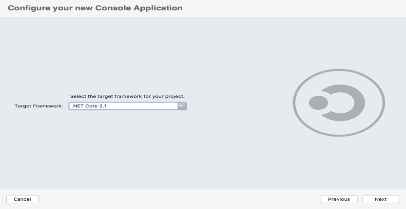

# Convert PowerPoint to PDF on macOS

Syncfusion PowerPoint is a [.NET Core PowerPoint library](https://www.syncfusion.com/document-processing/powerpoint-framework/net-core) used to create, read, edit and convert PowerPoint documents programmatically without **Microsoft PowerPoint** or interop dependencies. Using this library, you can **convert a PowerPoint to PDF in .NET Core application on macOS**.

## Steps to convert PowerPoint to PDF programmatically

Step 1: Create a new C# .NET Core console application.

Step 2: Select the project version.

Step 3: Install the [Syncfusion.PresentationRenderer.Net.Core](https://www.nuget.org/packages/Syncfusion.PresentationRenderer.Net.Core) NuGet package as reference to your .NET Standard applications from [NuGet.org](https://www.nuget.org/).

N> Starting with v16.2.0.x, if you reference Syncfusion assemblies from trial setup or from the NuGet feed, you also have to add "Syncfusion.Licensing" assembly reference and include a license key in your projects. Please refer to this [link](https://help.syncfusion.com/common/essential-studio/licensing/overview) to know about registering Syncfusion license key in your application to use our components.

Step 4: Include the following Namespaces in the **Program.cs** file.




using Syncfusion.Presentation;
using Syncfusion.PresentationRenderer;
using Syncfusion.Pdf;




Step 5: Add the following code snippet in **Program.cs** file to **convert a PowerPoint to PDF in .NET Core application on macOS**.




//Open the file as Stream
using (FileStream fileStreamInput = new FileStream(Path.GetFullPath(@"../../../Data/Input.pptx"), FileMode.Open, FileAccess.Read))
{
    //Open the existing PowerPoint presentation with loaded stream.
    using (IPresentation pptxDoc = Presentation.Open(fileStreamInput))
    {
        //Convert the PowerPoint document to PDF document.
        using (PdfDocument pdfDocument = PresentationToPdfConverter.Convert(pptxDoc))
        {
            //Save the converted PDF document to MemoryStream.
            MemoryStream pdfStream = new MemoryStream();
            pdfDocument.Save(pdfStream);
            pdfStream.Position = 0;
            //Save the stream as file.
            using (FileStream fileStreamOutput = File.Create("Sample.pdf"))
            {
                pdfStream.CopyTo(fileStreamOutput);
            }
        }                         
    }
}




You can download a complete working sample from [GitHub](https://github.com/SyncfusionExamples/PowerPoint-Examples/tree/master/PPTX-to-PDF-conversion/Convert-PowerPoint-presentation-to-PDF/Mac).

By executing the program, you will get the **PDF** as follows.

Click [here](https://www.syncfusion.com/document-processing/powerpoint-framework/net-core) to explore the rich set of Syncfusion PowerPoint Library (Presentation) features. 

An online sample link to [convert PowerPoint Presentation to PDF](https://ej2.syncfusion.com/aspnetcore/PowerPoint/PPTXToPDF#/material3) in ASP.NET Core. 