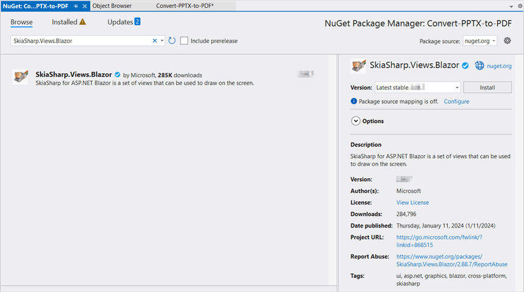

# Convert PowerPoint to Image in Blazor

Syncfusion PowerPoint is a [.NET Core PowerPoint library](https://www.syncfusion.com/document-processing/powerpoint-framework/net-core) used to create, read, edit and convert PowerPoint presentation programmatically without **Microsoft PowerPoint** or interop dependencies. Using this library, you can **convert a PowerPoint to image in Blazor**.

## Server app

Step 1: Create a new C# Blazor Server app project. Select Blazor App from the template and click the Next button.

Step 2: Now, the project configuration window will popup. Click Create button to create a new project with the required project name.

Step 3: Choose **Blazor Server App** and click Create button to create a new Blazor Server app for .NET Core 3.0.0-preview9.

Step 4: Install the [Syncfusion.PresentationRenderer.Net.Core](https://www.nuget.org/packages/Syncfusion.PresentationRenderer.Net.Core) NuGet package as reference to your .NET Standard applications from [NuGet.org](https://www.nuget.org/).

N> Starting with v16.2.0.x, if you reference Syncfusion assemblies from trial setup or from the NuGet feed, you also have to add "Syncfusion.Licensing" assembly reference and include a license key in your projects. Please refer to this [link](https://help.syncfusion.com/common/essential-studio/licensing/overview) to know about registering Syncfusion license key in your application to use our components.

Step 5: Create a razor file with name as **Presentation** under **Pages** folder and include the following namespaces in the file.




@page "/presentation"
@using System.IO;
@using Convert_PowerPoint_Presentation_to_Image;
@inject Convert_PowerPoint_Presentation_to_Image.Data.PresentationService service
@inject Microsoft.JSInterop.IJSRuntime JS




Step 6: Add the following code to create a new button.




<h2>Syncfusion PowerPoint (Presentation) library</h2>

Syncfusion PowerPoint (Presentation) library is used to create, read, edit, and convert PowerPoint files in your applications without Microsoft Office dependencies.

<button class="btn btn-primary" @onclick="@ConvertPPTXtoImage">Convert PPTX to Image</button>




Step 7: Add the following code in **Presentation.razor** file to **convert PowerPoint to image** and download the **image file**.




@code {
    MemoryStream documentStream;
    /// 

    /// Download the image file.
    /// 

    protected async void ConvertPPTXtoImage()
    {
        documentStream = service.ConvertPPTXtoImage();
        await JS.SaveAs("PPTXtoImage.Jpeg", documentStream.ToArray());
    }
}




Step 8: Create a new cs file with name as **PowerPointService** under Data folder and include the following namespaces in the file.




using Syncfusion.Presentation;
using Syncfusion.PresentationRenderer;




Step 9: Create a new MemoryStream method with name as **ConvertPPTXtoImage** in **PowerPointService** class and include the following code snippet to **convert a PowerPoint to image in Blazor Server app**.




//Open the file as Stream.
using (FileStream sourceStreamPath = new FileStream(@"wwwroot/Input.pptx", FileMode.Open, FileAccess.Read, FileShare.ReadWrite))
{
    //Open the existing PowerPoint presentation with loaded stream.
    using (IPresentation pptxDoc = Presentation.Open(sourceStreamPath))
    {
        //Initialize the PresentationRenderer to perform image conversion.
        pptxDoc.PresentationRenderer = new PresentationRenderer();
        //Convert PowerPoint slide to image as stream.
        using (Stream stream = pptxDoc.Slides[0].ConvertToImage(ExportImageFormat.Jpeg))
        {
            //Save the converted image file to MemoryStream.
            MemoryStream Stream = new MemoryStream();
            stream.CopyTo(Stream);
            Stream.Position = 0;
            //Download image file in the browser.
            return Stream;
        }
    }
}  



            
Step 10: Create a new class file in the project, with name as FileUtils and add the following code to invoke the JavaScript action to download the file in the browser.




public static class FileUtils
{
    public static ValueTask<object> SaveAs(this IJSRuntime js, string filename, byte[] data)
        => js.InvokeAsync<object>(
             "saveAsFile",
             filename,
             Convert.ToBase64String(data));
}




Step 11: Add the following JavaScript function in the **_Host.cshtml** in the Pages folder.







You can download a complete working sample from [GitHub](https://github.com/SyncfusionExamples/PowerPoint-Examples/tree/master/PPTX-to-Image-conversion/Convert-PowerPoint-presentation-to-Image/Blazor/Server-app).

By executing the program, you will get the **image** as follows.

Click [here](https://www.syncfusion.com/document-processing/powerpoint-framework/blazor) to explore the rich set of Syncfusion PowerPoint Library (Presentation) features. 

An online sample link to [convert PowerPoint Presentation to image](https://blazor.syncfusion.com/demos/powerpoint/pptx-to-image?theme=fluent) in Blazor. 

## WASM app

Step 1: Create a new C# Blazor WASM app project. Select Blazor App from the template and click the Next button.

Step 2: Now, the project configuration window will popup. Click Create button to create a new project with the required project name.

Step 3: Choose Blazor WebAssembly App and click Create button to create a new Blazor WASM app for .NET Core 3.0.0-preview9.

Step 4: Install the following **Nuget packages** in your application from [Nuget.org](https://www.nuget.org/).

* [Syncfusion.PresentationRenderer.Net.Core](https://www.nuget.org/packages/Syncfusion.PresentationRenderer.Net.Core) 
* [SkiaSharp.Views.Blazor v2.88.6](https://www.nuget.org/packages/SkiaSharp.Views.Blazor/2.88.6)

N> 1. Starting with v16.2.0.x, if you reference Syncfusion assemblies from trial setup or from the NuGet feed, you also have to add "Syncfusion.Licensing" assembly reference and include a license key in your projects. Please refer to this [link](https://help.syncfusion.com/common/essential-studio/licensing/overview) to know about registering Syncfusion license key in your application to use our components.
N> 2. Install this wasm-tools and wasm-tools-net6 by using the "dotnet workload install wasm-tools" and "dotnet workload install wasm-tools-net6" commands in your command prompt respectively if you are facing issues related to Skiasharp during runtime. After installing wasm tools using the above commands, please restart your machine.

Step 5: Create a razor file with name as ``Presentation`` under ``Pages`` folder and add the following namespaces in the file.




@page "/presentation"
@inject Microsoft.JSInterop.IJSRuntime JS
@inject HttpClient client
@using System.IO
@using Syncfusion.Presentation
@using Syncfusion.PresentationRenderer




Step 6: Add the following code to create a new button.




<h2>Syncfusion PowerPoint library (Essential Presentation)</h2>

Syncfusion Blazor PowerPoint library (Essential Presentation) used to create, read, edit, and convert PowerPoint files in your applications without Microsoft Office dependencies.

<button class="btn btn-primary" @onclick="@PPTXToImage">Convert PPTX to image</button>




Step 7: Create a new async method with name as ``PPTXToImage`` and include the following code snippet to **convert a PowerPoint to image in Blazor WASM app**.




//Input data file is inside the wwwroot folder.
using (Stream inputStream = await client.GetStreamAsync("sample-data/Input.pptx"))
{
    //Open an existing PowerPoint Presentation file.
    using (IPresentation pptxDoc = Syncfusion.Presentation.Presentation.Open(inputStream))
    {
        //Initialize the PresentationRenderer to perform image conversion.
        pptxDoc.PresentationRenderer = new PresentationRenderer();
        //Convert the entire Presentation to images.
        Stream[] imageStreams = pptxDoc.RenderAsImages(ExportImageFormat.Jpeg);
        for (int i = 0; i < imageStreams.Length; i++)
        {
            imageStreams[i].Position = 0;
            //Download image file in the browser.
            await JS.SaveAs("PPTXToImage_" + i + ".jpeg", (imageStreams[i] as MemoryStream).ToArray());
        }
    }
}




Step 8: To download the PowerPoint presentation in browser, create a class file with FileUtils name and add the following code to invoke the JavaScript action to download the file in the browser.




public static class FileUtils
{
    public static ValueTask<object> SaveAs(this IJSRuntime js, string filename, byte[] data)
         => js.InvokeAsync<object>(
            "saveAsFile",
            filename,
            Convert.ToBase64String(data));
}




Step 9: Add the following JavaScript function in the **Index.html** file present under ``wwwroot``.







You can download a complete working sample from [GitHub](https://github.com/SyncfusionExamples/PowerPoint-Examples/tree/master/PPTX-to-Image-conversion/Convert-PowerPoint-presentation-to-Image/Blazor/WASM-app).

By executing the program, you will get the **image** as follows.

N> Even though PowerPoint library works in WASM app, it is recommended to use server deployment. Since the WASM app deployment increases the application payload size. You can also explore our [Blazor PowerPoint library demo](https://blazor.syncfusion.com/demos/powerpoint/getting-started) that shows how to create and modify PowerPoint files from C# with just five lines of code.

Click [here](https://www.syncfusion.com/document-processing/powerpoint-framework/blazor) to explore the rich set of Syncfusion PowerPoint Library (Presentation) features. 

An online sample link to [convert PowerPoint Presentation to image](https://blazor.syncfusion.com/demos/powerpoint/pptx-to-image?theme=fluent) in Blazor. 