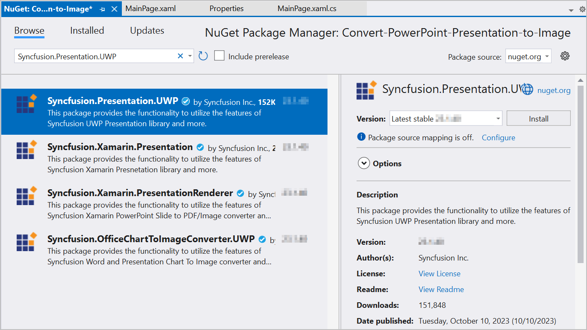

# Convert PowerPoint to Image in UWP

Syncfusion PowerPoint is a [UWP PowerPoint library](https://www.syncfusion.com/document-processing/powerpoint-framework/uwp/powerpoint-library) used to create, read, edit and **convert PowerPoint presentation** programmatically without **Microsoft PowerPoint** or interop dependencies. Using this library, you can **convert a PowerPoint to image in UWP**.

## Steps to convert PowerPoint to Image programmatically

Step 1: Create a new C# UWP application project.

Step 2: Install the [Syncfusion.Presentation.UWP](https://www.nuget.org/packages/Syncfusion.Presentation.UWP) NuGet package as reference to your .NET Standard applications from [NuGet.org](https://www.nuget.org/).

N> Starting with v16.2.0.x, if you reference Syncfusion assemblies from trial setup or from the NuGet feed, you also have to add "Syncfusion.Licensing" assembly reference and include a license key in your projects. Please refer to this [link](https://help.syncfusion.com/common/essential-studio/licensing/overview) to know about registering Syncfusion license key in your application to use our components.

Step 3: Add a new button in the MainPage.xaml as shown below.




<Page
    x:Class="Convert_PowerPoint_Presentation_to_Image.MainPage"
    xmlns="http://schemas.microsoft.com/winfx/2006/xaml/presentation"
    xmlns:x="http://schemas.microsoft.com/winfx/2006/xaml"
    xmlns:local="using:Convert_PowerPoint_Presentation_to_Image"
    xmlns:d="http://schemas.microsoft.com/expression/blend/2008"
    xmlns:mc="http://schemas.openxmlformats.org/markup-compatibility/2006"
    mc:Ignorable="d"
    Background="{ThemeResource ApplicationPageBackgroundThemeBrush}">
    <Grid>
        <Button x:Name="button" Content="Convert PPTX to Image" Click="OnButtonClicked" HorizontalAlignment="Center" VerticalAlignment="Center"/>
    </Grid>
</Page>




Step 4: Include the following namespaces in the **MainPage.xaml.cs** file.




using Syncfusion.OfficeChartToImageConverter;




Step 5: Include the below code snippet in the click event of the button in **MainPage.xaml.cs** to **convert the PowerPoint to image in UWP**.




//Load the presentation file using open picker.
FileOpenPicker openPicker = new FileOpenPicker();
openPicker.FileTypeFilter.Add(".pptx");
StorageFile inputFile = await openPicker.PickSingleFileAsync();
using (IPresentation pptxDoc = await Presentation.OpenAsync(inputFile))
{
    //Initialize the ‘ChartToImageConverter’ instance to convert the charts in the slides.
    pptxDoc.ChartToImageConverter = new ChartToImageConverter();
    //Pick the folder to save the converted images.
    FolderPicker folderPicker = new FolderPicker
    {
        ViewMode = PickerViewMode.Thumbnail
    };
    folderPicker.FileTypeFilter.Add("*");
    StorageFolder storageFolder = await folderPicker.PickSingleFolderAsync();
    StorageFile imageFile = await storageFolder.CreateFileAsync("PPTXtoImage.jpg", CreationCollisionOption.ReplaceExisting);
    ISlide slide = pptxDoc.Slides[0];
    //Convert the PPTX to image.
    await slide.SaveAsImageAsync(imageFile);
} 




You can download a complete working sample from [GitHub](https://github.com/SyncfusionExamples/PowerPoint-Examples/tree/master/PPTX-to-Image-conversion/Convert-PowerPoint-presentation-to-Image/UWP).

By executing the program, you will get the **Image** as follows.

Click [here](https://www.syncfusion.com/document-processing/powerpoint-framework/uwp) to explore the rich set of Syncfusion PowerPoint Library (Presentation) features. 

 An online sample link to [convert PowerPoint Presentation to image](https://ej2.syncfusion.com/aspnetcore/PowerPoint/PPTXToImage#/material3) in ASP.NET Core. 

