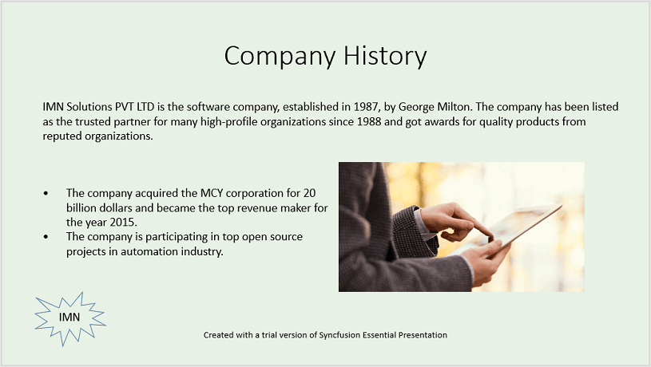

# Create PowerPoint document in AWS Lambda

Syncfusion PowerPoint is a [.NET Core PowerPoint library](https://www.syncfusion.com/document-processing/powerpoint-framework/net-core) used to create, read, edit and convert PowerPoint documents programmatically without **Microsoft PowerPoint** or interop dependencies. Using this library, you can **create a PowerPoint document in AWS Lambda**.

## Steps to create PowerPoint document in AWS Lambda

Step 1: Create a new **AWS Lambda project** as follows.

Step 2: Select Blueprint as Empty Function and click **Finish**.

Step 3: Install the [Syncfusion.Presentation.Net.Core](https://www.nuget.org/packages/Syncfusion.Presentation.Net.Core) NuGet package as a reference to your project from [NuGet.org](https://www.nuget.org/).

N> Starting with v16.2.0.x, if you reference Syncfusion assemblies from trial setup or from the NuGet feed, you also have to add "Syncfusion.Licensing" assembly reference and include a license key in your projects. Please refer to this [link](https://help.syncfusion.com/common/essential-studio/licensing/overview) to know about registering Syncfusion license key in your application to use our components.

Step 4: Create a folder and copy the required data files and include the files to the project.

Step 5: Set the **copy to output directory** to **Copy if newer** to all the data files.

Step 6: Include the following namespaces in **Function.cs** file.




using Syncfusion.Presentation;




step 7: Add the following code snippet in **Function.cs** to **create a PowerPoint document in AWS Lambda**.




//Create a new instance of PowerPoint Presentation file.
using IPresentation pptxDoc = Presentation.Create();

//Add a new slide to file and apply background color.
ISlide slide = pptxDoc.Slides.Add(SlideLayoutType.TitleOnly);
//Specify the fill type and fill color for the slide background.
slide.Background.Fill.FillType = FillType.Solid;
slide.Background.Fill.SolidFill.Color = ColorObject.FromArgb(232, 241, 229);

//Add title content to the slide by accessing the title placeholder of the TitleOnly layout-slide.
IShape titleShape = slide.Shapes[0] as IShape;
titleShape.TextBody.AddParagraph("Company History").HorizontalAlignment = HorizontalAlignmentType.Center;

//Add description content to the slide by adding a new TextBox.
IShape descriptionShape = slide.AddTextBox(53.22, 141.73, 874.19, 77.70);
descriptionShape.TextBody.Text = "IMN Solutions PVT LTD is the software company, established in 1987, by George Milton. The company has been listed as the trusted partner for many high-profile organizations since 1988 and got awards for quality products from reputed organizations.";

//Add bullet points to the slide.
IShape bulletPointsShape = slide.AddTextBox(53.22, 270, 437.90, 116.32);
//Add a paragraph for a bullet point.
IParagraph firstPara = bulletPointsShape.TextBody.AddParagraph("The company acquired the MCY corporation for 20 billion dollars and became the top revenue maker for the year 2015.");
//Format how the bullets should be displayed.
firstPara.ListFormat.Type = ListType.Bulleted;
firstPara.LeftIndent = 35;
firstPara.FirstLineIndent = -35;
// Add another paragraph for the next bullet point.
IParagraph secondPara = bulletPointsShape.TextBody.AddParagraph("The company is participating in top open source projects in automation industry.");
//Format how the bullets should be displayed.
secondPara.ListFormat.Type = ListType.Bulleted;
secondPara.LeftIndent = 35;
secondPara.FirstLineIndent = -35;

//Get a picture as stream.
string filePath = Path.GetFullPath(@"Data/Image.jpg");
using FileStream pictureStream = new(filePath, FileMode.Open, FileAccess.Read);
//Add the picture to a slide by specifying its size and position.
slide.Shapes.AddPicture(pictureStream, 499.79, 238.59, 364.54, 192.16);

//Add an auto-shape to the slide.
IShape stampShape = slide.Shapes.AddShape(AutoShapeType.Explosion1, 48.93, 430.71, 104.13, 80.54);
//Format the auto-shape color by setting the fill type and text.
stampShape.Fill.FillType = FillType.None;
stampShape.TextBody.AddParagraph("IMN").HorizontalAlignment = HorizontalAlignmentType.Center;

//Save the PowerPoint Presentation.
MemoryStream pptxStream = new MemoryStream();
pptxDoc.Save(pptxStream);
return Convert.ToBase64String(pptxStream.ToArray());




Step 8: Right-click the project and select **Publish to AWS Lambda**.

Step 9: Create a new AWS profile in the Upload Lambda Function Window. After creating the profile, add a name for the Lambda function to publish. Then, click **Next**.

Step 10: In the Advanced Function Details window, specify the **Role Name** as based on AWS Managed policy. After selecting the role, click the **Upload** button to deploy your application.

Step 11: After deploying the application, you can see the published Lambda function in **AWS console**.

Step 12: Edit Memory size and Timeout as maximum in Basic settings of the AWS Lambda function.

## Steps to post the request to AWS Lambda

Step 1: Create a new console project.

step 2: Install the following **Nuget packages** in your application from [Nuget.org](https://www.nuget.org/).

* [AWSSDK.Core](https://www.nuget.org/packages/AWSSDK.Core/)
* [AWSSDK.Lambda](https://www.nuget.org/packages/AWSSDK.Lambda/)
* [Newtonsoft.Json](https://www.nuget.org/packages/Newtonsoft.Json/)

Step 3: Include the following namespaces in **Program.cs** file.




using Amazon;
using Amazon.Lambda;
using Amazon.Lambda.Model;
using Newtonsoft.Json;




Step 4: Add the following code snippet in **Program.cs** to invoke the published AWS Lambda function using the function name and access keys.




//Create a new AmazonLambdaClient
AmazonLambdaClient client = new AmazonLambdaClient("awsaccessKeyID", "awsSecreteAccessKey", RegionEndpoint.USEast2);
//Create new InvokeRequest with published function name.
InvokeRequest invoke = new InvokeRequest
{
    FunctionName = "MyNewFunction",
    InvocationType = InvocationType.RequestResponse,
    Payload = "\"Test\""
};
//Get the InvokeResponse from client InvokeRequest.
InvokeResponse response = client.Invoke(invoke);
//Read the response stream
var stream = new StreamReader(response.Payload);
JsonReader reader = new JsonTextReader(stream);
var serilizer = new JsonSerializer();
var responseText = serilizer.Deserialize(reader);
//Convert Base64String into PowerPoint document
byte[] bytes = Convert.FromBase64String(responseText.ToString());
FileStream fileStream = new FileStream("Sample.pptx", FileMode.Create);
BinaryWriter writer = new BinaryWriter(fileStream);
writer.Write(bytes, 0, bytes.Length);
writer.Close();
System.Diagnostics.Process.Start("Sample.pptx");




By executing the program, you will get the **PowerPoint document** as follows.

From GitHub, you can download the [console application](https://github.com/SyncfusionExamples/PowerPoint-Examples/tree/master/Getting-started/AWS/Console_Application) and [AWS Lambda](https://github.com/SyncfusionExamples/PowerPoint-Examples/tree/master/Getting-started/AWS/AWS_Lambda) project.

Click [here](https://www.syncfusion.com/document-processing/powerpoint-framework/net-core) to explore the rich set of Syncfusion PowerPoint Library (Presentation) features. 

An online sample link to [create a PowerPoint Presentation](https://ej2.syncfusion.com/aspnetcore/PowerPoint/Default#/material3) in ASP.NET Core. 

