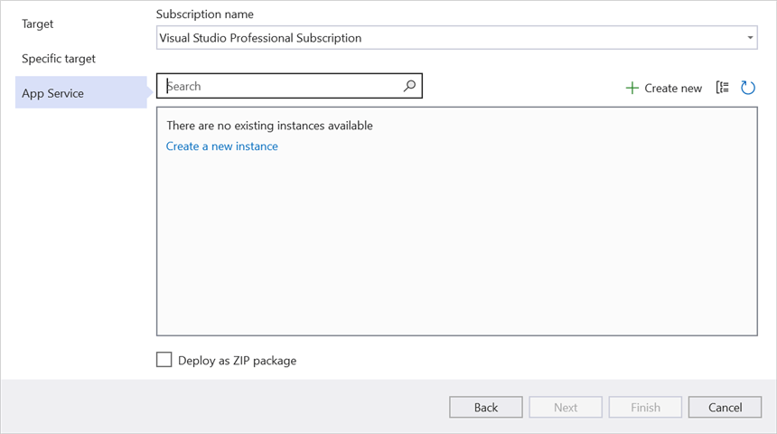
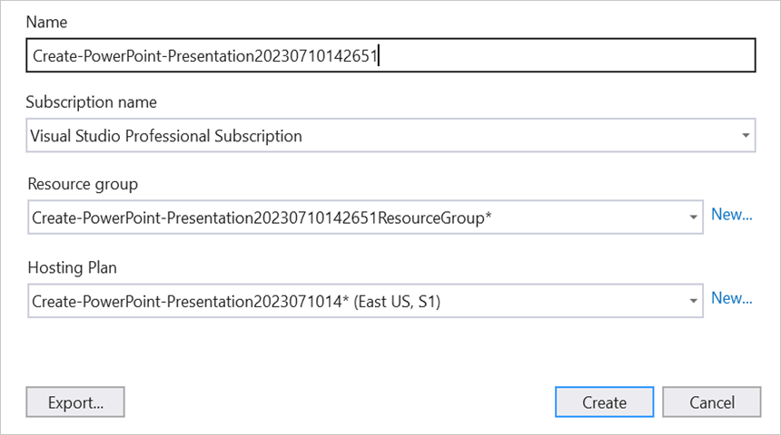
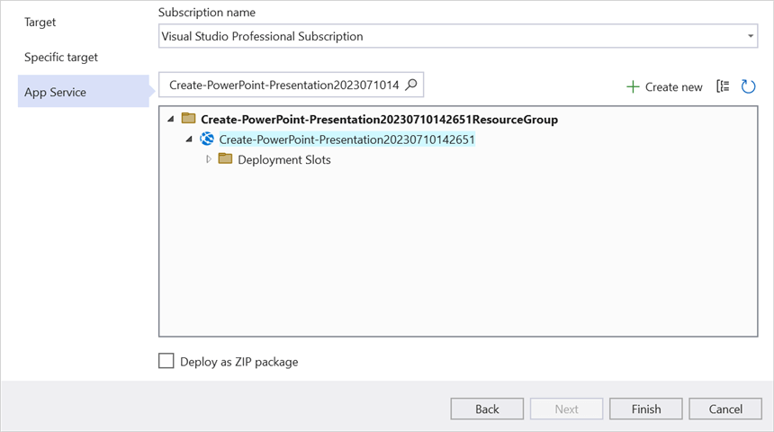
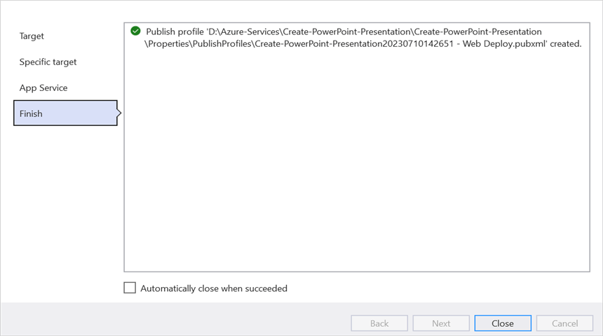
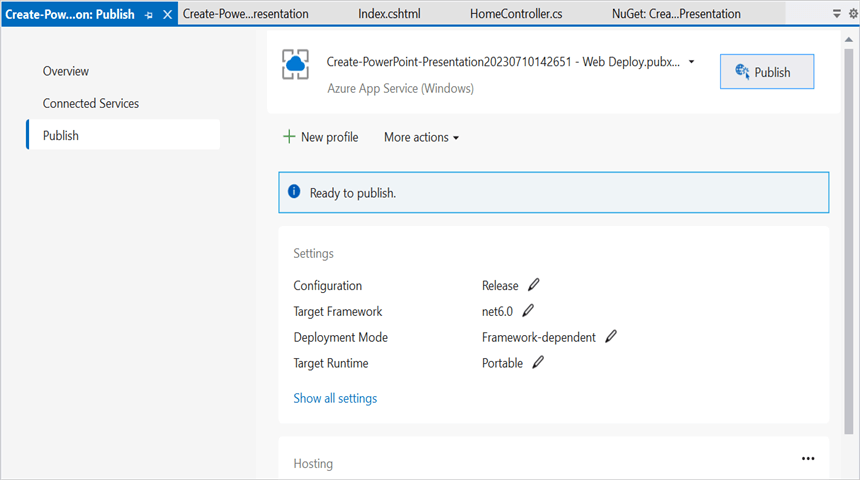
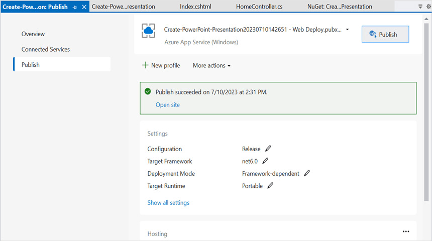
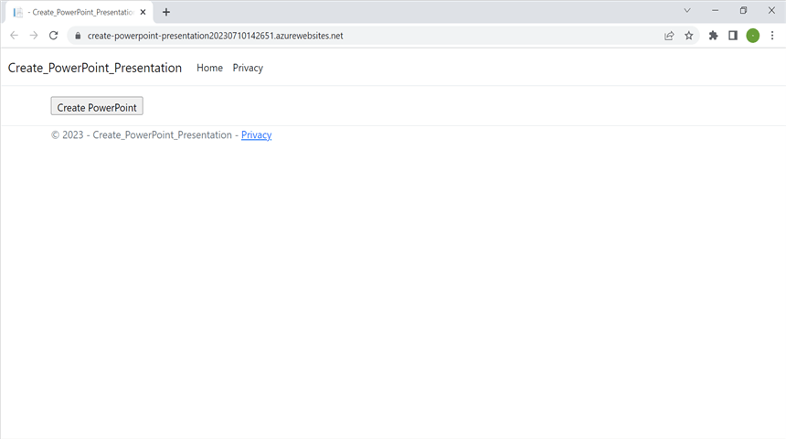
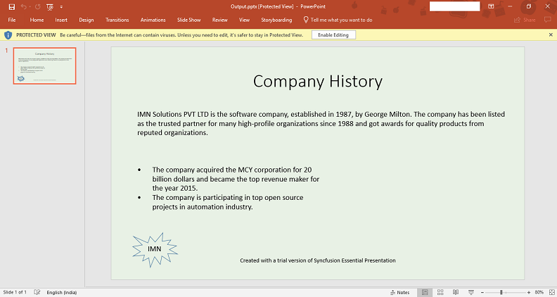

# Create PowerPoint document in Azure App Service on Windows

Syncfusion PowerPoint is a [.NET Core PowerPoint library](https://www.syncfusion.com/document-processing/powerpoint-framework/net-core) used to create, read, edit and convert PowerPoint documents programmatically without **Microsoft PowerPoint** or interop dependencies. Using this library, you can **create PowerPoint document in Azure App Service on Windows**.

## Steps to create PowerPoint document in Azure App Service on Windows

Step 1: Create a new ASP.NET Core Web App (Model-View-Controller).

Step 2: Create a project name and select the location.

Step 3: Click **Create** button.

Step 4: Install the [Syncfusion.Presentation.Net.Core](https://www.nuget.org/packages/Syncfusion.Presentation.Net.Core) NuGet package as a reference to your project from [NuGet.org](https://www.nuget.org/).

N> Starting with v16.2.0.x, if you reference Syncfusion assemblies from trial setup or from the NuGet feed, you also have to add "Syncfusion.Licensing" assembly reference and include a license key in your projects. Please refer to this [link](https://help.syncfusion.com/common/essential-studio/licensing/overview) to know about registering Syncfusion license key in your application to use our components.

Step 5: Add a new button in the **Index.cshtml** as shown below.




@{
    Html.BeginForm("CreatePowerPoint", "Home", FormMethod.Get);
    {
        

        <input type="submit" value="Create PowerPoint" style="width:150px;height:27px" />
        

    }
    Html.EndForm();
}




Step 6: Include the following namespaces in **HomeController.cs**.




using Syncfusion.Presentation;




Step 7: Include the below code snippet in **HomeController.cs** for **create a PowerPoint document**. 




private readonly IWebHostEnvironment _hostingEnvironment;
public HomeController(IWebHostEnvironment hostingEnvironment)
{
    _hostingEnvironment = hostingEnvironment;
}

public ActionResult CreatePowerPoint()
{
    //Create a new instance of PowerPoint Presentation file.
    using IPresentation pptxDoc = Presentation.Create();

    //Add a new slide to file and apply background color.
    ISlide slide = pptxDoc.Slides.Add(SlideLayoutType.TitleOnly);
    //Specify the fill type and fill color for the slide background.
    slide.Background.Fill.FillType = FillType.Solid;
    slide.Background.Fill.SolidFill.Color = ColorObject.FromArgb(232, 241, 229);

    //Add title content to the slide by accessing the title placeholder of the TitleOnly layout-slide.
    IShape titleShape = slide.Shapes[0] as IShape;
    titleShape.TextBody.AddParagraph("Company History").HorizontalAlignment = HorizontalAlignmentType.Center;

    //Add description content to the slide by adding a new TextBox.
    IShape descriptionShape = slide.AddTextBox(53.22, 141.73, 874.19, 77.70);
    descriptionShape.TextBody.Text = "IMN Solutions PVT LTD is the software company, established in 1987, by George Milton. The company has been listed as the trusted partner for many high-profile organizations since 1988 and got awards for quality products from reputed organizations.";

    //Add bullet points to the slide.
    IShape bulletPointsShape = slide.AddTextBox(53.22, 270, 437.90, 116.32);
    //Add a paragraph for a bullet point.
    IParagraph firstPara = bulletPointsShape.TextBody.AddParagraph("The company acquired the MCY corporation for 20 billion dollars and became the top revenue maker for the year 2015.");
    //Format how the bullets should be displayed.
    firstPara.ListFormat.Type = ListType.Bulleted;
    firstPara.LeftIndent = 35;
    firstPara.FirstLineIndent = -35;
    // Add another paragraph for the next bullet point.
    IParagraph secondPara = bulletPointsShape.TextBody.AddParagraph("The company is participating in top open source projects in automation industry.");
    //Format how the bullets should be displayed.
    secondPara.ListFormat.Type = ListType.Bulleted;
    secondPara.LeftIndent = 35;
    secondPara.FirstLineIndent = -35;

    //Get a picture as stream.
    string imagePath = Path.Combine(_hostingEnvironment.WebRootPath, "Data/Image.jpg");
    using FileStream imageStream = new FileStream(imagePath, FileMode.Open, FileAccess.Read);
    //Add the picture to a slide by specifying its size and position.
    slide.Shapes.AddPicture(imageStream, 499.79, 238.59, 364.54, 192.16);

    //Add an auto-shape to the slide.
    IShape stampShape = slide.Shapes.AddShape(AutoShapeType.Explosion1, 48.93, 430.71, 104.13, 80.54);
    //Format the auto-shape color by setting the fill type and text.
    stampShape.Fill.FillType = FillType.None;
    stampShape.TextBody.AddParagraph("IMN").HorizontalAlignment = HorizontalAlignmentType.Center;

    //Save the PowerPoint Presentation as stream.
    MemoryStream pptxStream = new();
    pptxDoc.Save(pptxStream);
    pptxStream.Position = 0;

    //Download Powerpoint document in the browser.
    return File(pptxStream, "application/powerpoint", "Result.pptx");
        }public ActionResult CreatePowerPoint()
        {
    //Create a new instance of PowerPoint Presentation file.
    using IPresentation pptxDoc = Presentation.Create();

    //Add a new slide to file and apply background color.
    ISlide slide = pptxDoc.Slides.Add(SlideLayoutType.TitleOnly);
    //Specify the fill type and fill color for the slide background.
    slide.Background.Fill.FillType = FillType.Solid;
    slide.Background.Fill.SolidFill.Color = ColorObject.FromArgb(232, 241, 229);

    //Add title content to the slide by accessing the title placeholder of the TitleOnly layout-slide.
    IShape titleShape = slide.Shapes[0] as IShape;
    titleShape.TextBody.AddParagraph("Company History").HorizontalAlignment = HorizontalAlignmentType.Center;

    //Add description content to the slide by adding a new TextBox.
    IShape descriptionShape = slide.AddTextBox(53.22, 141.73, 874.19, 77.70);
    descriptionShape.TextBody.Text = "IMN Solutions PVT LTD is the software company, established in 1987, by George Milton. The company has been listed as the trusted partner for many high-profile organizations since 1988 and got awards for quality products from reputed organizations.";

    //Add bullet points to the slide.
    IShape bulletPointsShape = slide.AddTextBox(53.22, 270, 437.90, 116.32);
    //Add a paragraph for a bullet point.
    IParagraph firstPara = bulletPointsShape.TextBody.AddParagraph("The company acquired the MCY corporation for 20 billion dollars and became the top revenue maker for the year 2015.");
    //Format how the bullets should be displayed.
    firstPara.ListFormat.Type = ListType.Bulleted;
    firstPara.LeftIndent = 35;
    firstPara.FirstLineIndent = -35;
    // Add another paragraph for the next bullet point.
    IParagraph secondPara = bulletPointsShape.TextBody.AddParagraph("The company is participating in top open source projects in automation industry.");
    //Format how the bullets should be displayed.
    secondPara.ListFormat.Type = ListType.Bulleted;
    secondPara.LeftIndent = 35;
    secondPara.FirstLineIndent = -35;

    //Get a picture as stream.
    string imagePath = Path.Combine(_hostingEnvironment.WebRootPath, "Data/Image.jpg");
    using FileStream imageStream = new FileStream(imagePath, FileMode.Open, FileAccess.Read);
    //Add the picture to a slide by specifying its size and position.
    slide.Shapes.AddPicture(imageStream, 499.79, 238.59, 364.54, 192.16);

    //Add an auto-shape to the slide.
    IShape stampShape = slide.Shapes.AddShape(AutoShapeType.Explosion1, 48.93, 430.71, 104.13, 80.54);
    //Format the auto-shape color by setting the fill type and text.
    stampShape.Fill.FillType = FillType.None;
    stampShape.TextBody.AddParagraph("IMN").HorizontalAlignment = HorizontalAlignmentType.Center;

    //Save the PowerPoint Presentation as stream.
    MemoryStream pptxStream = new();
    pptxDoc.Save(pptxStream);
    pptxStream.Position = 0;

    //Download Powerpoint document in the browser.
    return File(pptxStream, "application/powerpoint", "Result.pptx");
}




## Steps to publish as Azure App Service on Windows

Step 1: Right-click the project and select **Publish** option.

Step 2: Click the **Add a Publish Profile** button.

Step 3: Select the publish target as **Azure**.

Step 4: Select the Specific target as **Azure App Service (Windows)**.

Step 5: To create a new app service, click **Create new** option.

Step 6: Click the **Create** button to proceed with **App Service** creation.

Step 7: Click the **Finish** button to finalize the **App Service** creation.

Step 8: Click **Close** button.

Step 9: Click the **Publish** button.

Step 10: Now, Publish has been succeeded.

Step 11: Now, the published webpage will open in the browser. 

Step 12: Click **Create PowerPoint** to create a PowerPoint document.You will get the output **PowerPoint document** as follows.

You can download a complete working sample from [GitHub](https://github.com/SyncfusionExamples/PowerPoint-Examples/tree/master/PPTX-to-PDF-conversion/Convert-PowerPoint-presentation-to-PDF/Azure/Azure_App_Service).

Click [here](https://www.syncfusion.com/document-processing/powerpoint-framework/net-core) to explore the rich set of Syncfusion PowerPoint Library (Presentation) features. 

An online sample link to [create a PowerPoint Presentation](https://ej2.syncfusion.com/aspnetcore/PowerPoint/Default#/material3) in ASP.NET Core.
