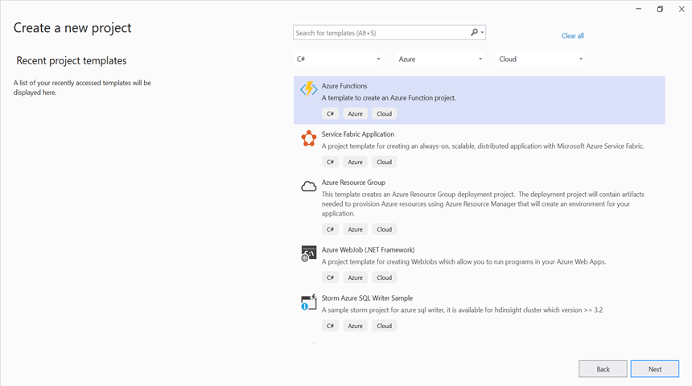
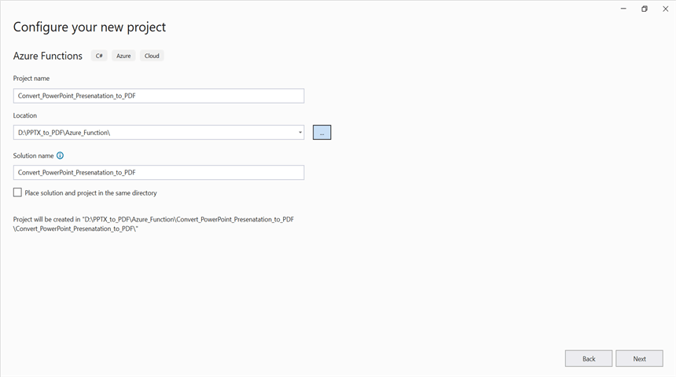
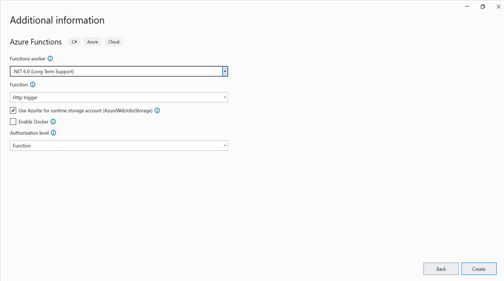
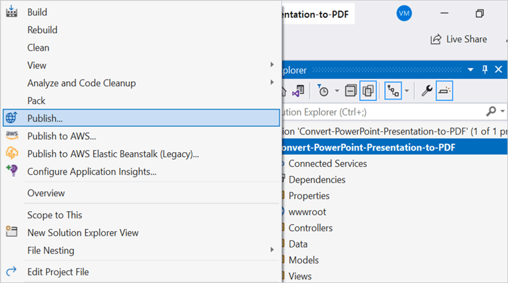
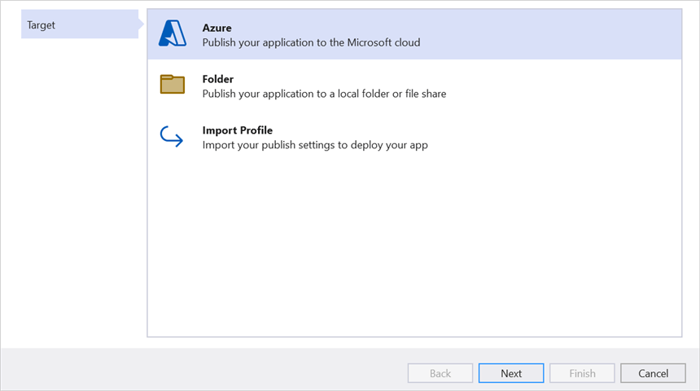
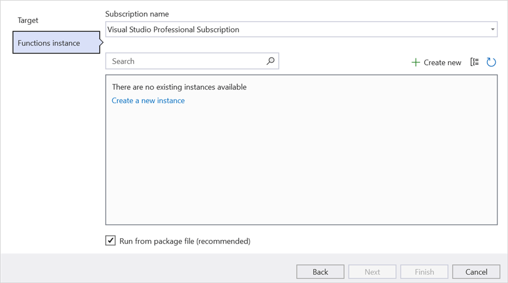
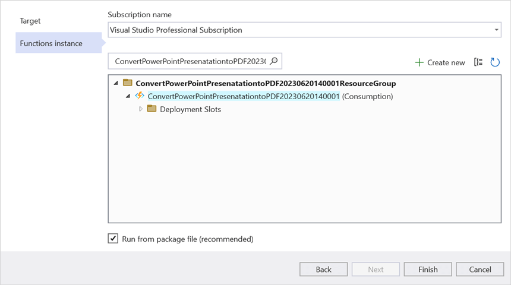
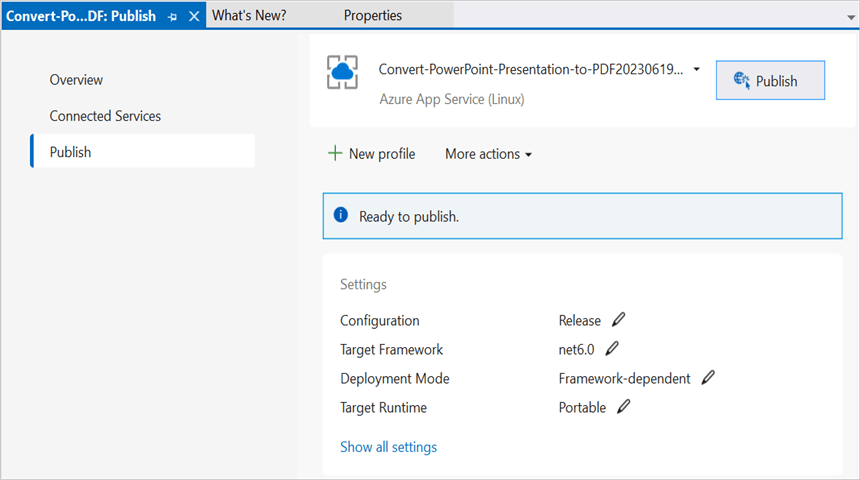
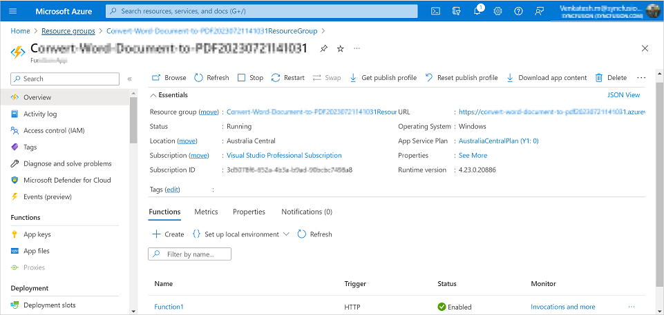
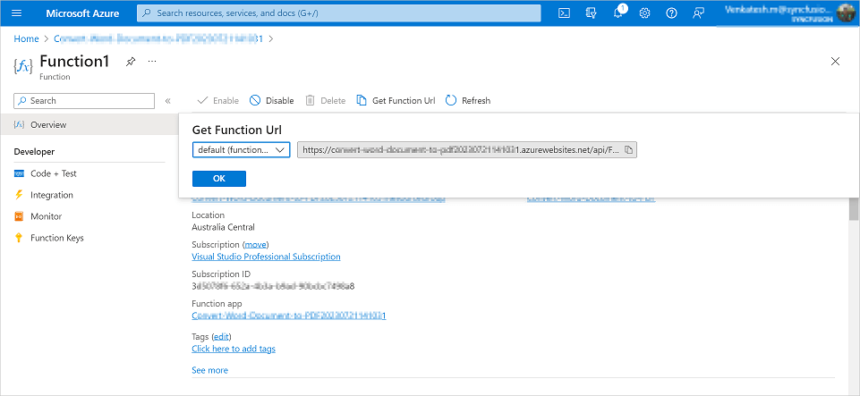

# Create PowerPoint document in Azure Functions v4

Syncfusion PowerPoint is a [.NET PowerPoint library](https://www.syncfusion.com/document-processing/powerpoint-framework/net) used to create, read, edit and convert PowerPoint documents programmatically without **Microsoft PowerPoint** or interop dependencies. Using this library, you can **create a PowerPoint document in Azure Functions v4**.

## Create an Azure Functions App

Step 1: Create a new Azure Functions project.

Step 2: Create a project name and select the location.

Step 3: Select function worker as **.NET 6.0 (Long Term Support)**. 

Step 4: Install the [Syncfusion.Presentation.Net.Core](https://www.nuget.org/packages/Syncfusion.Presentation.AspNet) NuGet package as a reference to your project from [NuGet.org](https://www.nuget.org/).

N> Starting with v16.2.0.x, if you reference Syncfusion assemblies from trial setup or from the NuGet feed, you also have to add "Syncfusion.Licensing" assembly reference and include a license key in your projects. Please refer to this [link](https://help.syncfusion.com/common/essential-studio/licensing/overview) to know about registering Syncfusion license key in your application to use our components.

Step 5: Include the following namespaces in the **Function1.cs** file.




using Syncfusion.Presentation;




Step 6: Add the following code snippet in **Run** method of **Function1** class to perform **create a PowerPoint document** in Azure Functions and return the resultant **PowerPoint document** to client end.




//Create a new instance of PowerPoint Presentation file.
using IPresentation pptxDoc = Presentation.Create();

//Add a new slide to file and apply background color.
ISlide slide = pptxDoc.Slides.Add(SlideLayoutType.TitleOnly);
//Specify the fill type and fill color for the slide background.
slide.Background.Fill.FillType = FillType.Solid;
slide.Background.Fill.SolidFill.Color = ColorObject.FromArgb(232, 241, 229);

//Add title content to the slide by accessing the title placeholder of the TitleOnly layout-slide.
IShape titleShape = slide.Shapes[0] as IShape;
titleShape.TextBody.AddParagraph("Company History").HorizontalAlignment = HorizontalAlignmentType.Center;

//Add description content to the slide by adding a new TextBox.
IShape descriptionShape = slide.AddTextBox(53.22, 141.73, 874.19, 77.70);
descriptionShape.TextBody.Text = "IMN Solutions PVT LTD is the software company, established in 1987, by George Milton. The company has been listed as the trusted partner for many high-profile organizations since 1988 and got awards for quality products from reputed organizations.";

//Add bullet points to the slide.
IShape bulletPointsShape = slide.AddTextBox(53.22, 270, 437.90, 116.32);
//Add a paragraph for a bullet point.
IParagraph firstPara = bulletPointsShape.TextBody.AddParagraph("The company acquired the MCY corporation for 20 billion dollars and became the top revenue maker for the year 2015.");
//Format how the bullets should be displayed.
firstPara.ListFormat.Type = ListType.Bulleted;
firstPara.LeftIndent = 35;
firstPara.FirstLineIndent = -35;
// Add another paragraph for the next bullet point.
IParagraph secondPara = bulletPointsShape.TextBody.AddParagraph("The company is participating in top open source projects in automation industry.");
//Format how the bullets should be displayed.
secondPara.ListFormat.Type = ListType.Bulleted;
secondPara.LeftIndent = 35;
secondPara.FirstLineIndent = -35;

//Get a picture as stream.
var assembly = Assembly.GetExecutingAssembly();
var pictureStream = assembly.GetManifestResourceStream("Create_PowerPoint_Presentation.Data.Image.jpg");  
//Add the picture to a slide by specifying its size and position.
slide.Shapes.AddPicture(pictureStream, 499.79, 238.59, 364.54, 192.16);

//Add an auto-shape to the slide.
IShape stampShape = slide.Shapes.AddShape(AutoShapeType.Explosion1, 48.93, 430.71, 104.13, 80.54);
//Format the auto-shape color by setting the fill type and text.
stampShape.Fill.FillType = FillType.None;
stampShape.TextBody.AddParagraph("IMN").HorizontalAlignment = HorizontalAlignmentType.Center;

MemoryStream memoryStream = new MemoryStream();
//Saves the PowerPoint document file.
pptxDoc.Save(memoryStream);
//Create the response to return.
HttpResponseMessage response = new HttpResponseMessage(HttpStatusCode.OK);
//Set the PowerPoint document saved stream as content of response.
response.Content = new ByteArrayContent(memoryStream.ToArray());
//Set the contentDisposition as attachment.
response.Content.Headers.ContentDisposition = new ContentDispositionHeaderValue("attachment")
{
    FileName = "Result.pptx"
};
//Set the content type as PowerPoint document mime type.
response.Content.Headers.ContentType = new System.Net.Http.Headers.MediaTypeHeaderValue("application/pptx");
//Return the response with output PowerPoint document stream.
return response;




## Publish to Azure Functions

Step 1: Right click the project and select **Publish**. Then, create a new profile in the Publish Window.

Step 2: Select the target as **Azure** and click **Next** button.

Step 3: Select the **Create new** button.

Step 4: Click **Create** button. 

Step 5: After creating app service then click **Finish** button. 

Step 6: Click the **Publish** button.

Step 7: Publish has been succeed.

## Obtain the Azure Function URL

Step 1: After publishing your Azure Function, go to the [Azure portal](https://portal.azure.com) and locate the Function App that hosts your function. In the function app, you can see the list of all available functions in the app.

Step 2: Find the function for which you want to obtain the URL and click on its name. This will open the Function Overview page for that specific function.

Step 3: On the Function Overview page, you will find a Get function URL button. Clicking on it will reveal the URL specific to that function. Copy that **URL** and run the console application. Then, paste the URL into the console application, this will trigger your Function to **create a PowerPoint document**.

By executing the program, you will get the **PowerPoint document** as follows.

## Steps to post the request to Azure Functions

Step 1: Create a console application to request the Azure Functions API.

Step 2: Add the following code snippet into **Main** method to post the request to Azure Functions with template PowerPoint document and get the resultant PowerPoint document.




//Reads the template PowerPoint file.
FileStream fs = new FileStream(@"../../Data/Template.pptx", FileMode.Open, FileAccess.ReadWrite, FileShare.ReadWrite);
fs.Position = 0;
//Saves the PowerPoint file in memory stream.
MemoryStream inputStream = new MemoryStream();
fs.CopyTo(inputStream);
inputStream.Position = 0;
try
{
    Console.WriteLine("Please enter your Azure Functions URL :");
    string functionURL = Console.ReadLine();

    //Create HttpWebRequest with hosted azure functions URL.    
    HttpWebRequest req = (HttpWebRequest)WebRequest.Create(functionURL);
    //Set request method as POST
    req.Method = "POST";
    //Get the request stream to save the PowerPoint file stream
    Stream stream = req.GetRequestStream();
    //Write the PowerPoint file stream into request stream
    stream.Write(inputStream.ToArray(), 0, inputStream.ToArray().Length);

    //Gets the responce from the Azure Functions.
    HttpWebResponse res = (HttpWebResponse)req.GetResponse();

    //Saves the PowerPoint file stream.
    FileStream fileStream = File.Create("Result.pptx");
    res.GetResponseStream().CopyTo(fileStream);
    //Dispose the streams.
    inputStream.Dispose();
    fileStream.Dispose();
}
catch (Exception ex)
{
    throw;
}




From GitHub, you can download the [console application](https://github.com/SyncfusionExamples/PowerPoint-Examples/tree/master/Getting-started/Azure/Azure_Functions/Console_Application) and [Azure Functions v4](https://github.com/SyncfusionExamples/PowerPoint-Examples/tree/master/Getting-started/Azure/Azure_Functions/Azure_Functions_v4).

Click [here](https://www.syncfusion.com/document-processing/powerpoint-framework/net) to explore the rich set of Syncfusion PowerPoint Library (Presentation) features. 

An online sample link to [create a PowerPoint Presentation](https://ej2.syncfusion.com/aspnetcore/PowerPoint/Default#/material3) in ASP.NET Core.  

