# Create PowerPoint document in Google App Engine

Syncfusion PowerPoint is a [.NET Core PowerPoint library](https://www.syncfusion.com/document-processing/powerpoint-framework/net-core) used to create, read, edit and convert PowerPoint documents programmatically without **Microsoft PowerPoint** or interop dependencies. Using this library, you can **create PowerPoint document in Google App Engine**.

## Set up App Engine

Step 1: Open the **Google Cloud Console** and click the **Activate Cloud Shell** button.

Step 2: Click the **Cloud Shell Editor** button to view the **Workspace**.

Step 3: Open **Cloud Shell Terminal**, run the following **command** to confirm authentication.




gcloud auth list




Step 4: Click the **Authorize** button.

## Create an application for App Engine

Step 1: Open Visual Studio and select the ASP.NET Core Web app (Model-View-Controller) template.

Step 2: Configure your new project according to your requirements.
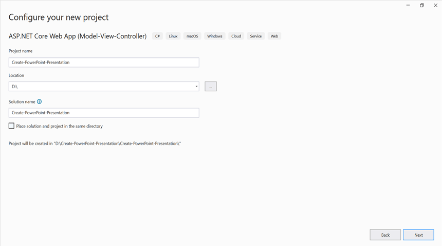

Step 3: Click the **Create** button.

Step 4: Install the [Syncfusion.Presentation.Net.Core](https://www.nuget.org/packages/Syncfusion.Presentation.Net.Core) NuGet package as a reference to your project from [NuGet.org](https://www.nuget.org/).

N> Starting with v16.2.0.x, if you reference Syncfusion assemblies from trial setup or from the NuGet feed, you also have to add "Syncfusion.Licensing" assembly reference and include a license key in your projects. Please refer to this [link](https://help.syncfusion.com/common/essential-studio/licensing/overview) to know about registering Syncfusion license key in your application to use our components.

Step 5: Include the following namespaces in the **HomeController.cs** file.




using Syncfusion.Presentation;




Step 6: A default action method named Index will be present in HomeController.cs. Right click on Index method and select **Go To View** where you will be directed to its associated view page **Index.cshtml**.

Step 7: Add a new button in the Index.cshtml as shown below.




@{
    Html.BeginForm("CreatePowerPoint", "Home", FormMethod.Get);
    {
        

<input type="submit" value="Create PowerPoint" style="width:150px;height:27px" />
        

    }
    Html.EndForm();
}




Step 8: Add a new action method **CreatePowerPoint** in HomeController.cs and include the below code snippet to **create a PowerPoint document**.




//Create a new instance of PowerPoint Presentation file.
using IPresentation pptxDoc = Presentation.Create();

//Add a new slide to file and apply background color.
ISlide slide = pptxDoc.Slides.Add(SlideLayoutType.TitleOnly);
//Specify the fill type and fill color for the slide background.
slide.Background.Fill.FillType = FillType.Solid;
slide.Background.Fill.SolidFill.Color = ColorObject.FromArgb(232, 241, 229);

//Add title content to the slide by accessing the title placeholder of the TitleOnly layout-slide.
IShape titleShape = slide.Shapes[0] as IShape;
titleShape.TextBody.AddParagraph("Company History").HorizontalAlignment = HorizontalAlignmentType.Center;

//Add description content to the slide by adding a new TextBox.
IShape descriptionShape = slide.AddTextBox(53.22, 141.73, 874.19, 77.70);
descriptionShape.TextBody.Text = "IMN Solutions PVT LTD is the software company, established in 1987, by George Milton. The company has been listed as the trusted partner for many high-profile organizations since 1988 and got awards for quality products from reputed organizations.";

//Add bullet points to the slide.
IShape bulletPointsShape = slide.AddTextBox(53.22, 270, 437.90, 116.32);
//Add a paragraph for a bullet point.
IParagraph firstPara = bulletPointsShape.TextBody.AddParagraph("The company acquired the MCY corporation for 20 billion dollars and became the top revenue maker for the year 2015.");
//Format how the bullets should be displayed.
firstPara.ListFormat.Type = ListType.Bulleted;
firstPara.LeftIndent = 35;
firstPara.FirstLineIndent = -35;
// Add another paragraph for the next bullet point.
IParagraph secondPara = bulletPointsShape.TextBody.AddParagraph("The company is participating in top open source projects in automation industry.");
//Format how the bullets should be displayed.
secondPara.ListFormat.Type = ListType.Bulleted;
secondPara.LeftIndent = 35;
secondPara.FirstLineIndent = -35;

//Get a picture as stream.
using FileStream pictureStream = new(Path.GetFullPath("Data/Image.jpg"), FileMode.Open, FileAccess.Read);
//Add the picture to a slide by specifying its size and position.
slide.Shapes.AddPicture(pictureStream, 499.79, 238.59, 364.54, 192.16);

//Add an auto-shape to the slide.
IShape stampShape = slide.Shapes.AddShape(AutoShapeType.Explosion1, 48.93, 430.71, 104.13, 80.54);
//Format the auto-shape color by setting the fill type and text.
stampShape.Fill.FillType = FillType.None;
stampShape.TextBody.AddParagraph("IMN").HorizontalAlignment = HorizontalAlignmentType.Center;

//Save the PowerPoint Presentation as stream.
MemoryStream pptxStream = new();
pptxDoc.Save(pptxStream);
pptxStream.Position = 0;

//Download Powerpoint document in the browser.
return File(pptxStream, "application/powerpoint", "Result.pptx");




## Move application to App Engine

Step 1: Open the **Cloud Shell editor**.

Step 2: Drag and drop the sample from your local machine to **Workspace**.
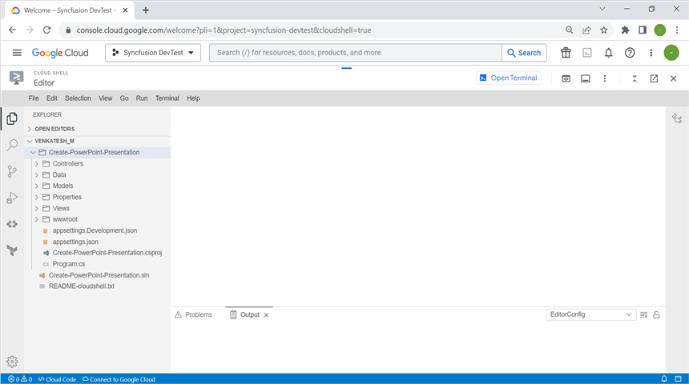

N> If you have your sample application in your local machine, drag and drop it into the Workspace. If you created the sample using the Cloud Shell terminal command, it will be available in the Workspace.

Step 3: Open the Cloud Shell Terminal and run the following **command** to view the files and directories within your **current Workspace**.




$ ls




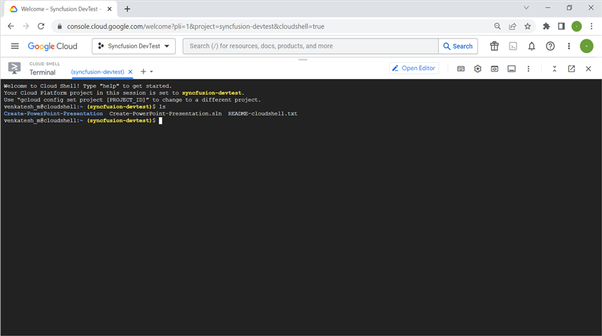

Step 4: Run the following **command** to navigate which sample you want run.




$ cd Create-PowerPoint-Presentation




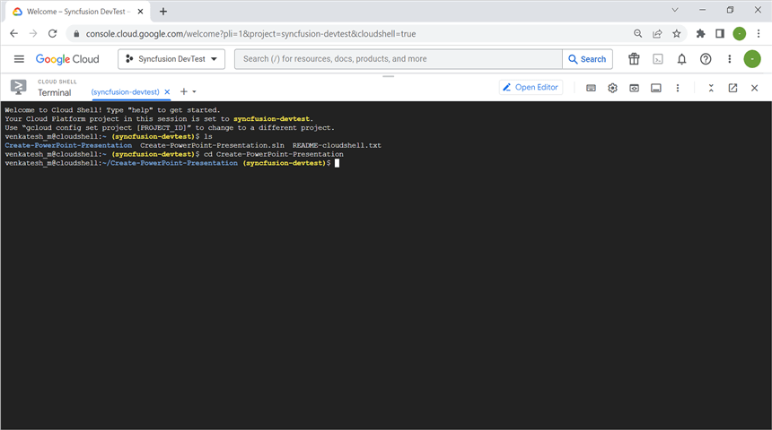

Step 5: To ensure that the sample is working correctly, please run the application using the following command.




dotnet run --urls=http://localhost:8080




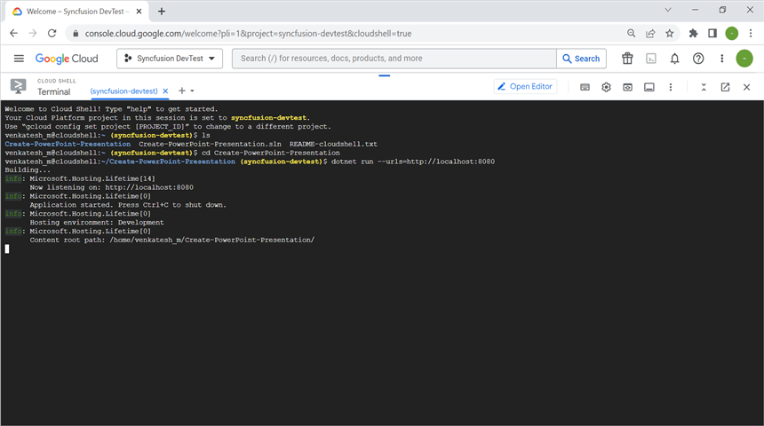

Step 6: Verify that the application is running properly by accessing the **Web View** -> **Preview on port 8080**.
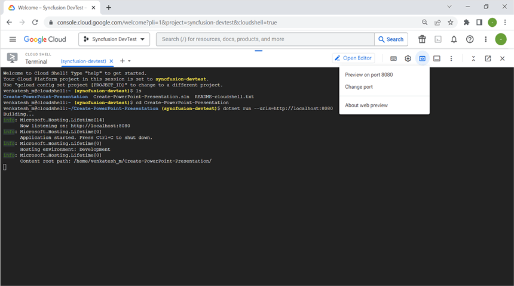

Step 7: Now you can see the sample output on the preview page.
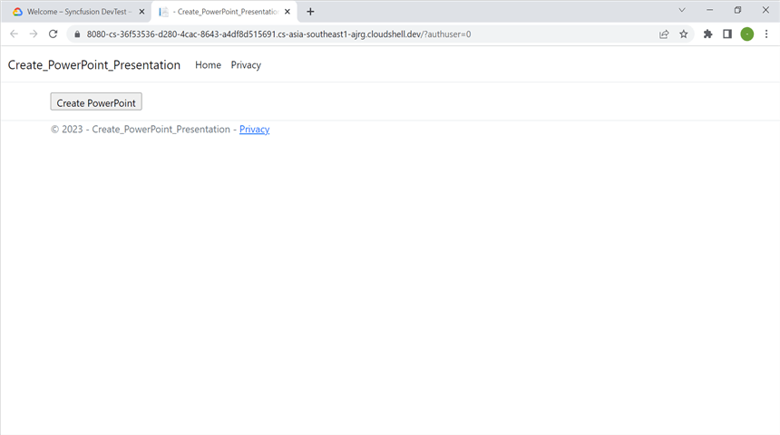

Step 8: Close the preview page and return to the terminal then press **Ctrl+C** for which will typically stop the process.
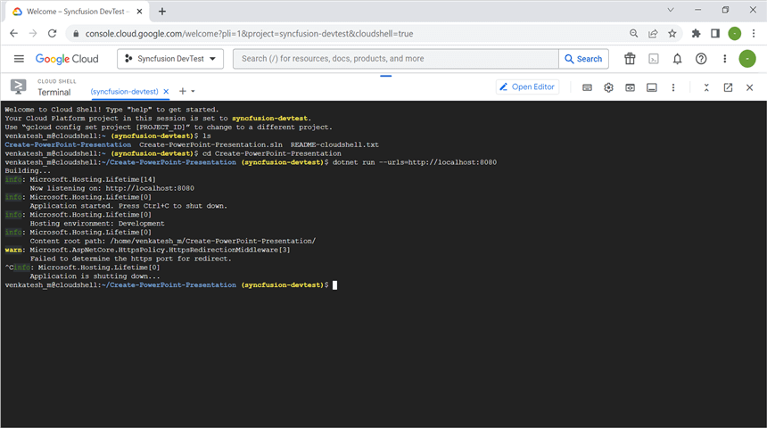

## Publish the application

Step 1: Run the following command in **Cloud Shell Terminal** to publish the application.




dotnet publish -c Release




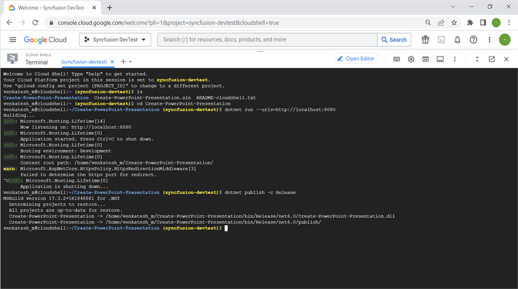

Step 2: Run the following command in **Cloud Shell Terminal** to navigate to the publish folder.



cd bin/Release/net6.0/publish/




## Configure app.yaml and docker file

Step 1: Add the app.yaml file to the publish folder with the following contents.




$ cat <<EOT >> app.yaml
env: flex
runtime: custom   
EOT




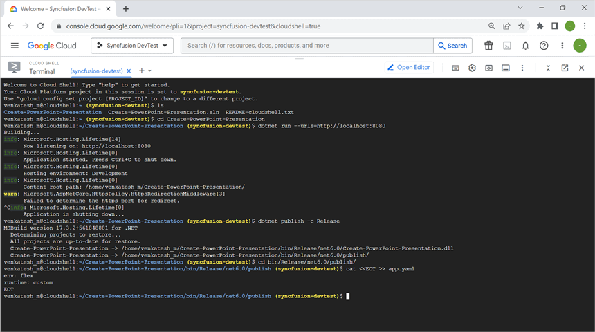

Step 2: Add the Docker file to the publish folder with the following contents.




$ cat <<EOT >> Dockerfile
FROM mcr.microsoft.com/dotnet/aspnet:6.0
RUN apt-get update -y && apt-get install libfontconfig -y
ADD / /app
EXPOSE 8080
ENV ASPNETCORE_URLS=http://*:8080
WORKDIR /app
ENTRYPOINT [ "dotnet", "Create-PowerPoint-Presentation.dll"]
EOT




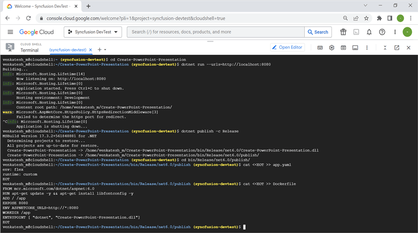

Step 3: You can ensure **Docker** and **app.yaml** files are added in **Workspace**.
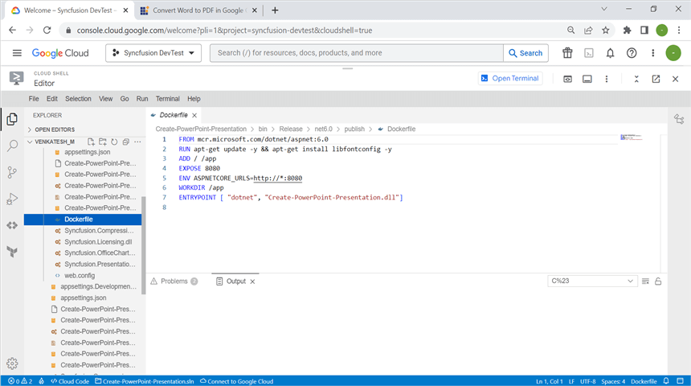

## Deploy to App Engine

Step 1: To deploy the application to the App Engine, run the following command in Cloud Shell Terminal. Afterwards, retrieve the **URL** from the Cloud Shell Terminal.




$ gcloud app deploy --version v1




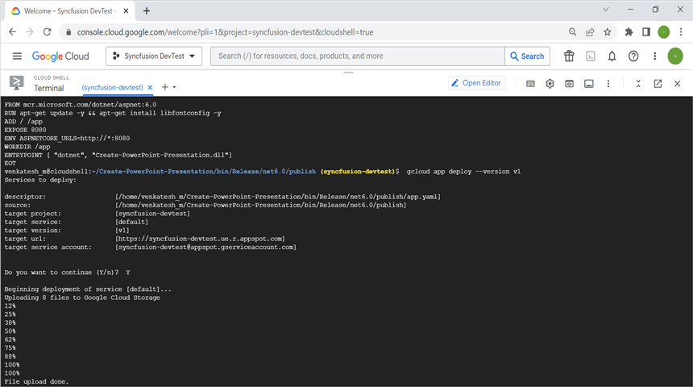

Step 2: Open the **URL** to access the application, which has been successfully deployed.
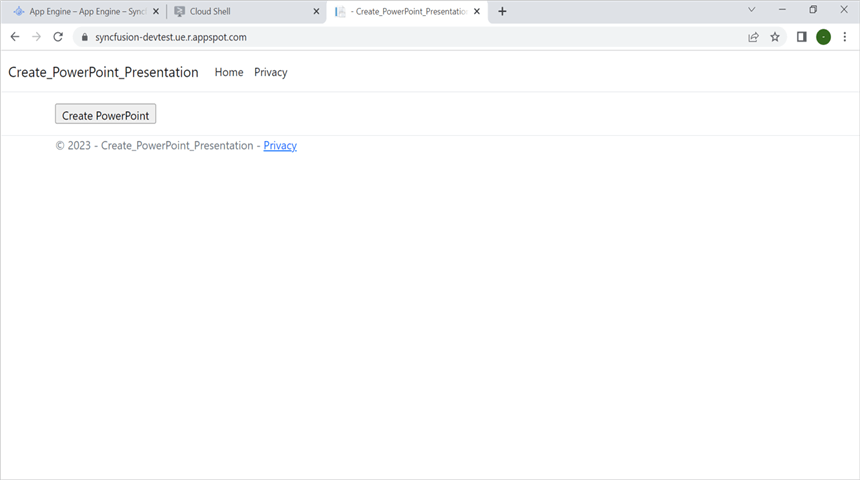

You can download a complete working sample from [GitHub](https://github.com/SyncfusionExamples/DocIO-Examples/tree/main/Word-to-PDF-Conversion/Convert-Word-document-to-PDF/GCP/Google-App-Engine).

By executing the program, you will get the **PowerPoint document** as follows. The output will be saved in **bin** folder.

