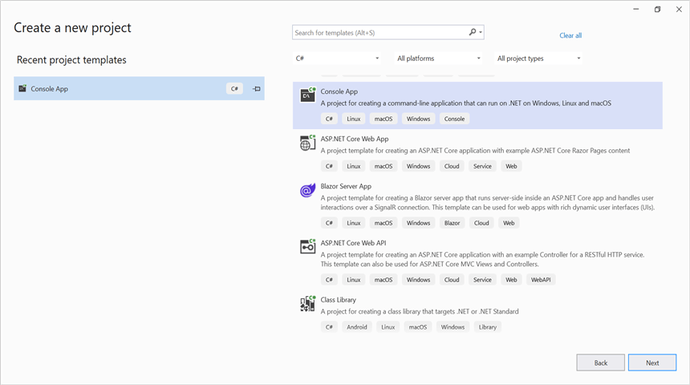
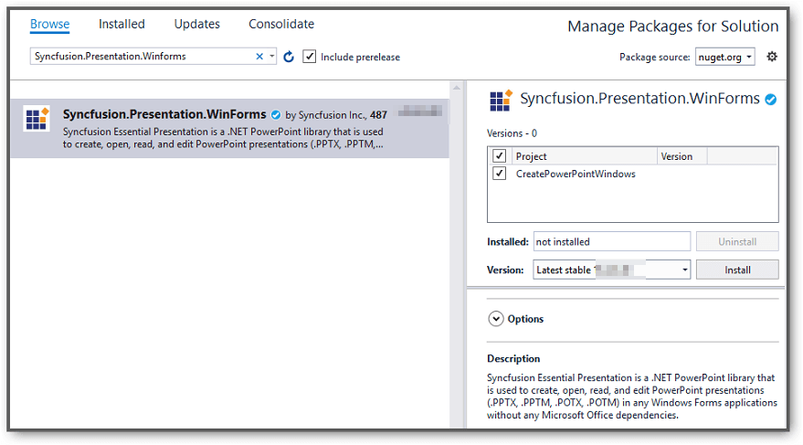

# Create a PowerPoint in Console application

Syncfusion PowerPoint is a [.NET PowerPoint library](https://www.syncfusion.com/document-processing/powerpoint-framework/net) used to create, read, and edit **PowerPoint presentation** programmatically without **Microsoft PowerPoint** or interop dependencies. Using this library, you can **create a PowerPoint in Console application**.

## Create a PowerPoint using .NET Core and Latest

The below steps illustrates **create a PowerPoint** in console application using **.NET Core**.

Step 1: Create a new **.NET Core console application** project.

Step 2: Install the [Syncfusion.Presentation.Net.Core](https://www.nuget.org/packages/Syncfusion.Presentation.Net.Core/) NuGet package as a reference to your project from [NuGet.org](https://www.nuget.org/).

N> Starting with v16.2.0.x, if you reference Syncfusion assemblies from trial setup or from the NuGet feed, you also have to add "Syncfusion.Licensing" assembly reference and include a license key in your projects. Please refer to this [link](https://help.syncfusion.com/common/essential-studio/licensing/overview) to know about registering Syncfusion license key in your application to use our components.

Step 3: Include the following namespaces in **Program.cs** file.




using Syncfusion.Presentation;




Step 4: Include the below code snippet in **Program.cs** to **create a PowerPoint**.




//Create a new instance of PowerPoint Presentation file
using (IPresentation pptxDoc = Presentation.Create())
{
    //Add a new slide to file and apply background color
    ISlide slide = pptxDoc.Slides.Add(SlideLayoutType.TitleOnly);
    //Specify the fill type and fill color for the slide background 
    slide.Background.Fill.FillType = FillType.Solid;
    slide.Background.Fill.SolidFill.Color = ColorObject.FromArgb(232, 241, 229);
    //Add title content to the slide by accessing the title placeholder of the TitleOnly layout-slide
    IShape titleShape = slide.Shapes[0] as IShape;
    titleShape.TextBody.AddParagraph("Company History").HorizontalAlignment = HorizontalAlignmentType.Center;
    //Add description content to the slide by adding a new TextBox
    IShape descriptionShape = slide.AddTextBox(53.22, 141.73, 874.19, 77.70);
    descriptionShape.TextBody.Text = "IMN Solutions PVT LTD is the software company, established in 1987, by George Milton. The company has been listed as the trusted partner for many high-profile organizations since 1988 and got awards for quality products from reputed organizations.";
    //Add bullet points to the slide
    IShape bulletPointsShape = slide.AddTextBox(53.22, 270, 437.90, 116.32);
    //Add a paragraph for a bullet point
    IParagraph firstPara = bulletPointsShape.TextBody.AddParagraph("The company acquired the MCY corporation for 20 billion dollars and became the top revenue maker for the year 2015.");
    //Format how the bullets should be displayed
    firstPara.ListFormat.Type = ListType.Bulleted;
    firstPara.LeftIndent = 35;
    firstPara.FirstLineIndent = -35;
    // Add another paragraph for the next bullet point
    IParagraph secondPara = bulletPointsShape.TextBody.AddParagraph("The company is participating in top open source projects in automation industry.");
    //Format how the bullets should be displayed
    secondPara.ListFormat.Type = ListType.Bulleted;
    secondPara.LeftIndent = 35;
    secondPara.FirstLineIndent = -35;
    //Gets a picture as stream.
    FileStream pictureStream = new FileStream("Image.jpg", FileMode.Open);
    //Adds the picture to a slide by specifying its size and position.
    slide.Shapes.AddPicture(pictureStream, 499.79, 238.59, 364.54, 192.16);
    //Add an auto-shape to the slide
    IShape stampShape = slide.Shapes.AddShape(AutoShapeType.Explosion1, 48.93, 430.71, 104.13, 80.54);
    //Format the auto-shape color by setting the fill type and text
    stampShape.Fill.FillType = FillType.None;
    stampShape.TextBody.AddParagraph("IMN").HorizontalAlignment = HorizontalAlignmentType.Center;
    //Save the PowerPoint Presentation as stream
    using (FileStream outputStream = new FileStream("Sample.pptx", FileMode.Create))
    {
        pptxDoc.Save(outputStream);
    }
}



You can download a complete working sample from [GitHub](https://github.com/SyncfusionExamples/PowerPoint-Examples/tree/master/Getting-started/.NET).

By executing the program, you will get the **PowerPoint** as follows.

## Create a PowerPoint in .NET Framework

The below steps illustrates **create a PowerPoint** in console application using **.NET Framework**.

Step 1: Create a new **.NET FrameWork console application** project.

Step 2: Install [Syncfusion.Presentation.WinForms](https://www.nuget.org/packages/Syncfusion.Presentation.WinForms/) NuGet package as a reference to your Windows Forms application from the [NuGet.org](https://www.nuget.org/).

N> 1. The [Syncfusion.Presentation.WinForms](https://www.nuget.org/packages/Syncfusion.Presentation.WinForms/) is a dependency for Syncfusion Windows Forms GUI controls and is named with the suffix "WinForms". It contains platform-independent .NET Framework assemblies (compatible with versions 4.0, 4.5, 4.5.1, and 4.6) for the PowerPoint library and does not include any Windows Forms-related references or code. Therefore, we recommend using this package for .NET Framework Console applications.
N> 2. Starting with v16.2.0.x, if you reference Syncfusion assemblies from trial setup or from the NuGet feed, you also have to add "Syncfusion.Licensing" assembly reference and include a license key in your projects. Please refer to this [link](https://help.syncfusion.com/common/essential-studio/licensing/overview) to know about registering Syncfusion license key in your application to use our components.

Step 3: Include the following namespaces in **Program.cs** file.




using Syncfusion.Presentation;




Step 5: Include the below code snippet in **Program.cs** to **create a PowerPoint**.




//Create a new instance of PowerPoint Presentation file
using( IPresentation pptxDoc = Presentation.Create())   
{
    //Add a new slide to file and apply background color
    ISlide slide = pptxDoc.Slides.Add(SlideLayoutType.TitleOnly);
    //Specify the fill type and fill color for the slide background 
    slide.Background.Fill.FillType = FillType.Solid;
    slide.Background.Fill.SolidFill.Color = ColorObject.FromArgb(232, 241, 229);
    //Add title content to the slide by accessing the title placeholder of the TitleOnly layout-slide
    IShape titleShape = slide.Shapes[0] as IShape;
    titleShape.TextBody.AddParagraph("Company History").HorizontalAlignment = HorizontalAlignmentType.Center;
    //Add description content to the slide by adding a new TextBox
    IShape descriptionShape = slide.AddTextBox(53.22, 141.73, 874.19, 77.70);
    descriptionShape.TextBody.Text = "IMN Solutions PVT LTD is the software company, established in 1987, by George Milton. The company has been listed as the trusted partner for many high-profile organizations since 1988 and got awards for quality products from reputed organizations.";
    //Add bullet points to the slide
    IShape bulletPointsShape = slide.AddTextBox(53.22, 270, 437.90, 116.32);

    //Add a paragraph for a bullet point
    IParagraph firstPara = bulletPointsShape.TextBody.AddParagraph("The company acquired the MCY corporation for 20 billion dollars and became the top revenue maker for the year 2015.");

    //Format how the bullets should be displayed
    firstPara.ListFormat.Type = ListType.Bulleted;
    firstPara.LeftIndent = 35;
    firstPara.FirstLineIndent = -35;

    // Add another paragraph for the next bullet point
    IParagraph secondPara = bulletPointsShape.TextBody.AddParagraph("The company is participating in top open source projects in automation industry.");

    //Format how the bullets should be displayed
    secondPara.ListFormat.Type = ListType.Bulleted;
    secondPara.LeftIndent = 35;
    secondPara.FirstLineIndent = -35;
    //Gets a picture as stream.
    Stream pictureStream = File.Open("Data/Image.jpg", FileMode.Open);

    //Adds the picture to a slide by specifying its size and position.
    slide.Shapes.AddPicture(pictureStream, 499.79, 238.59, 364.54, 192.16);
    //Add an auto-shape to the slide
    IShape stampShape = slide.Shapes.AddShape(AutoShapeType.Explosion1, 48.93, 430.71, 104.13, 80.54);

    //Format the auto-shape color by setting the fill type and text
    stampShape.Fill.FillType = FillType.None;
    stampShape.TextBody.AddParagraph("IMN").HorizontalAlignment = HorizontalAlignmentType.Center;
    //Save the PowerPoint Presentation 
    pptxDoc.Save("Result.pptx");
}




You can download a complete working sample from [GitHub](https://github.com/SyncfusionExamples/PowerPoint-Examples/tree/master/Getting-started/.NET-FrameWork).

By executing the program, you will get the **PowerPoint** as follows.

