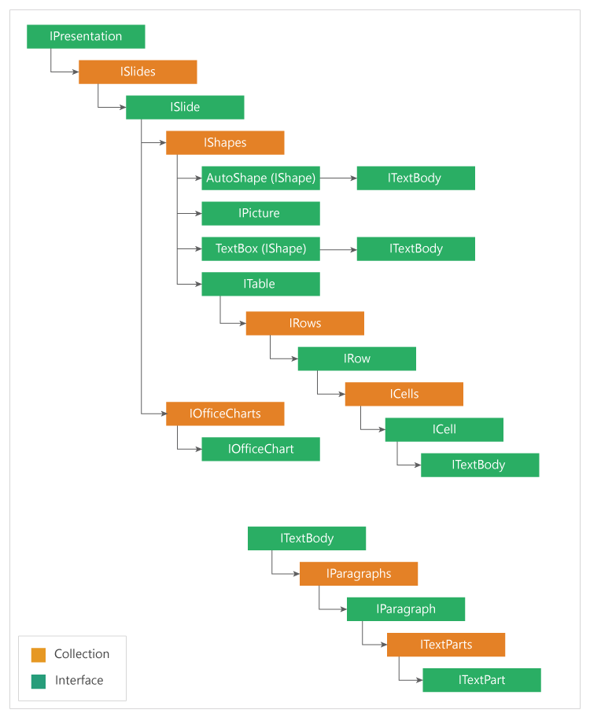

# Document Object Model representation

In order to create and modify a PowerPoint Presentation, you need to know how the elements are organized in Essential Presentation’s document object model (DOM). The following figure illustrates this DOM.

