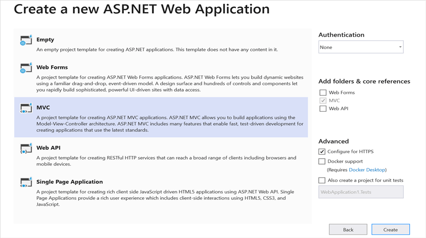
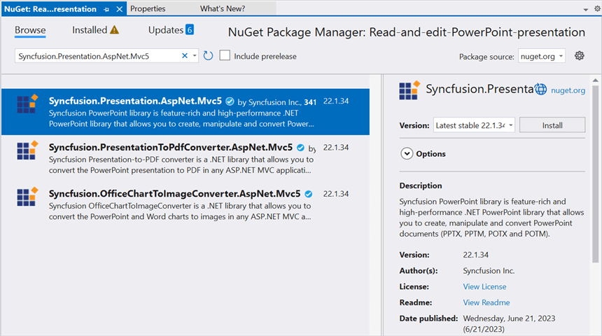

# Open and save Presentation in ASP.NET MVC

Syncfusion PowerPoint is a [.NET PowerPoint library](https://www.syncfusion.com/document-processing/powerpoint-framework/net) used to create, read, edit and convert PowerPoint documents programmatically without **Microsoft PowerPoint** or interop dependencies. Using this library, you can **open and save a Presentation in ASP.NET MVC**.

## Steps to open and save PowerPoint Presentation programmatically

Step 1: Create a new C# ASP.NET MVC application project.

Step 2: Select the **MVC** template to create the project.

Step 3: Install the [Syncfusion.Presentation.AspNet.Mvc5](https://www.nuget.org/packages/Syncfusion.Presentation.AspNet.Mvc5/) NuGet package as reference to your .NET Standard applications from [NuGet.org](https://www.nuget.org/).

Step 4: Include the following namespace in that **HomeController.cs** file.




using Syncfusion.Presentation;




Step 5: A default action method named **Index** will be present in HomeController.cs. Right click on this action method and select **Go To View** where you will be directed to its associated view page **Index.cshtml**.

Step 6: Add a new button in the Index.cshtml as shown below.




@{
    Html.BeginForm("CreatePowerPoint", "Home", FormMethod.Get);
    {
    

         
        <input type="submit" value="Create PowerPoint" style="width:150px;height:27px" />
    

    }
    Html.EndForm();
}




Step 7: Add a new action method **CreatePowerPoint** in HomeController.cs and include the below code snippet to **open an existing Presentation in ASP.NET MVC**.




FileStream fileStreamPath = new FileStream(Server.MapPath("~/App_Start/Template.pptx"), FileMode.Open, FileAccess.Read);
//Open an existing PowerPoint presentation.
IPresentation pptxDoc = Presentation.Open(fileStreamPath)




Step 8: Add below code snippet demonstrates accessing a shape from a slide and changing the text within it.




//Gets the first slide from the PowerPoint presentation
ISlide slide = pptxDoc.Slides[0];
//Gets the first shape of the slide
IShape shape = slide.Shapes[0] as IShape;
//Change the text of the shape
if (shape.TextBody.Text == "Company History")
    shape.TextBody.Text = "Company Profile";




Step 9: Add below code example to **save the PowerPoint Presentation in ASP.NET MVC**.




//Save the PowerPoint Presentation as stream
MemoryStream pptxStream = new MemoryStream();
pptxDoc.Save(pptxStream);
pptxStream.Position = 0;
//Download Powerpoint document in the browser.
return File(pptxStream, "application/powerpoint", "Result.pptx");




You can download a complete working sample from [GitHub](https://github.com/SyncfusionExamples/PowerPoint-Examples/tree/master/Getting-started/ASP.NET/Read-and-edit-PowerPoint-presentation)

By executing the program, you will get the **PowerPoint document** as follows.

