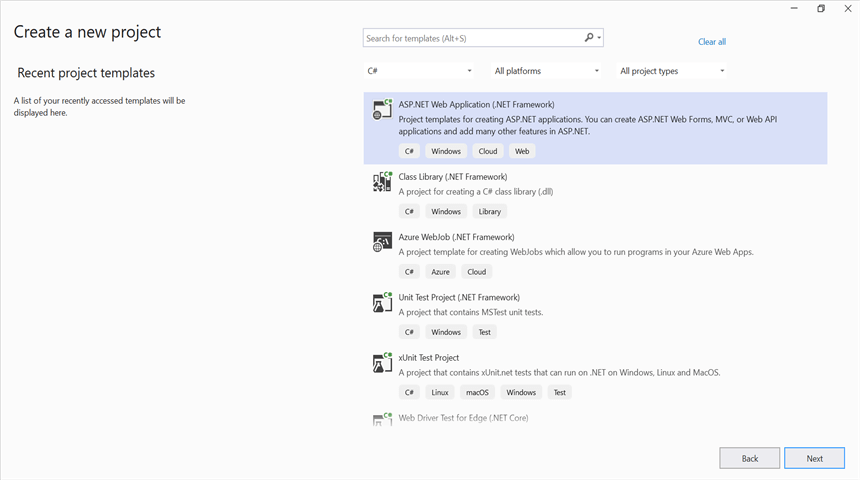
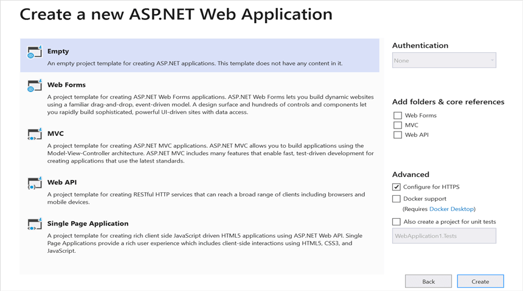
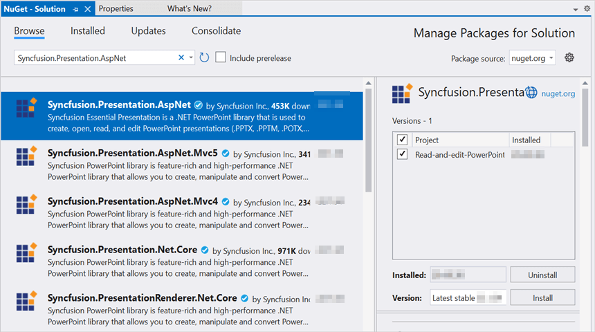
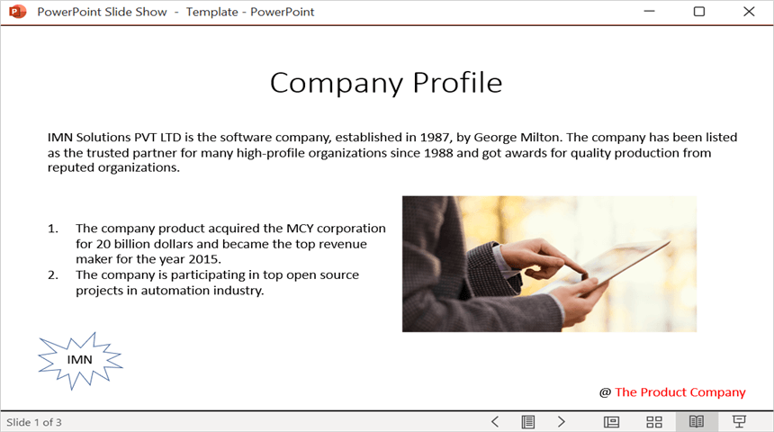

# Open and save Presentation in ASP.NET

Syncfusion PowerPoint is a [.NET PowerPoint library](https://www.syncfusion.com/document-processing/powerpoint-framework/net) used to create, read, edit and convert PowerPoint documents programmatically without **Microsoft PowerPoint** or interop dependencies. Using this library, you can **open and save a Presentation in ASP.NET**.

## Steps to open and save PowerPoint Presentation programmatically

Step 1: Create a new C# ASP.NET web application project.

Step 2: Select the **Empty** template to create the project.

Step 3: Install the [Syncfusion.Presentation.AspNet](https://www.nuget.org/packages/Syncfusion.Presentation.AspNet/) NuGet package as reference to your .NET Standard applications from [NuGet.org](https://www.nuget.org/).

N> Starting with v16.2.0.x, if you reference Syncfusion assemblies from trial setup or from the NuGet feed, you also have to add "Syncfusion.Licensing" assembly reference and include a license key in your projects. Please refer to this [link](https://help.syncfusion.com/common/essential-studio/licensing/overview) to know about registering Syncfusion license key in your application to use our components.

Step 4: Include the following namespaces in **MainPage.aspx.cs**.




using Syncfusion.Presentation;




Step 5: Add a new button in the **MainPage.aspx** as shown below.




<%@ Page Language="C#" AutoEventWireup="true" CodeBehind="MainPage.aspx.cs" Inherits="Read_and_edit_PowerPoint_presentation.WebForm1" %>
<!DOCTYPE html>
<html xmlns="http://www.w3.org/1999/xhtml">
<head runat="server">
<title></title>
</head>
<body>
    <form id="form1" runat="server">
        

       <asp:Button ID="Button1" runat="server" Text="Open and Save Presentation" OnClick="OnButtonClicked" />
       

    </form>
</body>
</html>




Step 6: Include the below code snippets in the click event of the button in **MainPage.aspx.cs**, to **open an existing PowerPoint Presentation in ASP.NET**.




//Open an existing PowerPoint presentation
IPresentation pptxDoc = Presentation.Open(Server.MapPath("~/App_Data/Template.pptx"));




Step 7: Add below code snippet demonstrates accessing a shape from a slide and changing the text within it.




//Gets the first slide from the PowerPoint presentation
ISlide slide = pptxDoc.Slides[0];
//Gets the first shape of the slide
IShape shape = slide.Shapes[0] as IShape;
//Change the text of the shape
if (shape.TextBody.Text == "Company History")
    shape.TextBody.Text = "Company Profile";




Step 8: Add below code example to **save the PowerPoint Presentation in ASP.NET**.




//Save the PowerPoint presentation
pptxDoc.Save("Result.pptx", FormatType.Pptx, Response);
//Close the PowerPoint presentation
pptxDoc.Close();




You can download a complete working sample from [GitHub](https://github.com/SyncfusionExamples/PowerPoint-Examples/tree/master/Read-and-save-PowerPoint-presentation/Open-and-save-PowerPoint/ASP.NET).

By executing the program, you will get the **PowerPoint document** as follows.

Click [here](https://www.syncfusion.com/document-processing/powerpoint-framework/net) to explore the rich set of Syncfusion PowerPoint Library (Presentation) features.