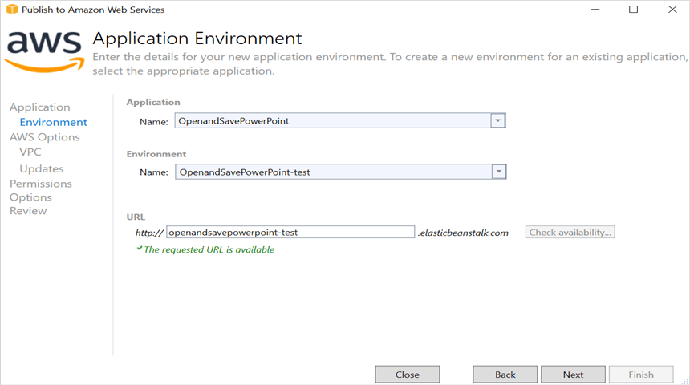
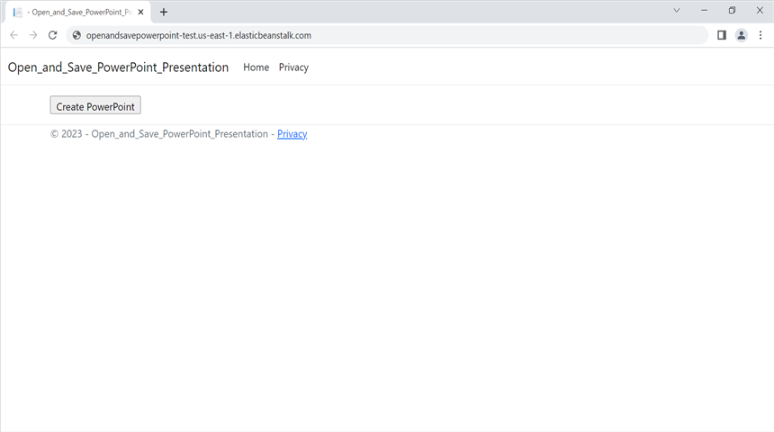

# Open and save Presentation in AWS Elastic Beanstalk

Syncfusion PowerPoint is a [.NET Core PowerPoint library](https://www.syncfusion.com/document-processing/powerpoint-framework/net-core) used to create, read, edit and convert PowerPoint documents programmatically without **Microsoft PowerPoint** or interop dependencies. Using this library, you can **open and save a Presentation in AWS Elastic Beanstalk**.

## Steps to open and save Presentation in AWS Elastic Beanstalk

Step 1: Create a new ASP.NET Core Web App (Model-View-Controller).

Step 2: Create a project name and select the location.

Step 3: Click **Create** button.

Step 4: Install the [Syncfusion.Presentation.Net.Core](https://www.nuget.org/packages/Syncfusion.Presentation.Net.Core) NuGet package as a reference to your project from [NuGet.org](https://www.nuget.org/).

N> Starting with v16.2.0.x, if you reference Syncfusion assemblies from trial setup or from the NuGet feed, you also have to add "Syncfusion.Licensing" assembly reference and include a license key in your projects. Please refer to this [link](https://help.syncfusion.com/common/essential-studio/licensing/overview) to know about registering Syncfusion license key in your application to use our components.

Step 5: Add a new button in the **Index.cshtml** as shown below.




@{
    Html.BeginForm("CreatePowerPoint", "Home", FormMethod.Get);
    {
        

            <input type="submit" value="Create PowerPoint" style="width:150px;height:27px" />
        

    }
    Html.EndForm();
}




Step 6: Include the following namespaces in **HomeController.cs**.




using Syncfusion.Presentation;




Step 7: Add a new action method **CreatePowerPoint** in HomeController.cs and include the below code snippet to **open an existing Presentation in AWS Elastic Beanstalk**.




using FileStream fileStreamPath = new(Path.GetFullPath("wwwroot/Data/Input.pptx"), FileMode.Open, FileAccess.Read, FileShare.ReadWrite);
//Open an existing PowerPoint presentation.
using IPresentation pptxDoc = Presentation.Open(fileStreamPath);




Step 8: Add below code snippet demonstrates accessing a shape from a slide and changing the text within it.




//Get the first slide from the PowerPoint presentation.
ISlide slide = pptxDoc.Slides[0];
//Get the first shape of the slide.
IShape shape = slide.Shapes[0] as IShape;
//Change the text of the shape.
if (shape.TextBody.Text == "Company History")
    shape.TextBody.Text = "Company Profile";




Step 9: Add below code example to **save the PowerPoint Presentation**.




//Save the PowerPoint Presentation as stream.
MemoryStream pptxStream = new();
pptxDoc.Save(pptxStream);
pptxStream.Position = 0;
//Download Powerpoint document in the browser.
return File(pptxStream, "application/powerpoint", "Result.pptx");




## Steps to publish as AWS Elastic Beanstalk

Step 1: Right-click the project and select **Publish to AWS Elastic Beanstalk (Legacy)** option.

Step 2: Select the **Deployment Target** as **Create a new application environment** and click **Next** button.

Step 3: Choose the **Environment Name** in the dropdown list and the **URL** will be automatically assign and check the URL is available, if available click next otherwise change the **URL**. 

Step 4: Select the instance type in **t3a.micro** from the dropdown list and click next.

Step 5: Click the **Next** button to proceed further.

Step 6: Click the **Next** button.

Step 7: Click the **Deploy** button to deploy the sample on AWS Elastic Beanstalk.

Step 8: After changing the status from **Updating** to **Environment is healthy**, click the **URL**.

Step 9: After opening the provided **URL**, click **Create PowerPoint** button to download the PowerPoint document.

You can download a complete working sample from GitHub.

By executing the program, you will get the **PowerPoint document** as follows.

Click [here](https://www.syncfusion.com/document-processing/powerpoint-framework/net-core) to explore the rich set of Syncfusion PowerPoint Library (Presentation) features. 
